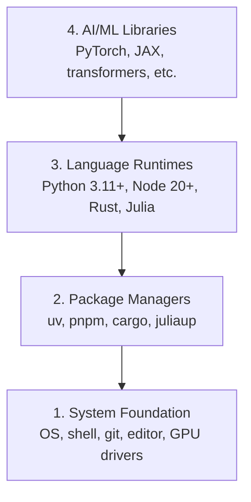

# Dev Environment

> Tools yang kamu pakai akan membentuk cara berpikirmu. Setup sekali, setup dengan benar.

**Type:** Build
**Languages:** Python, Node.js, Rust
**Prerequisites:** None
**Time:** ~45 minutes

## Learning Objectives

- Menyiapkan Python 3.11+, Node.js 20+, dan Rust toolchains from scratch
- Mengonfigurasi virtual environments dan package managers agar build bisa reproducible
- Memverifikasi akses GPU dengan CUDA/MPS dan menjalankan test tensor operation
- Memahami stack empat layer: system, packages, runtimes, dan AI libraries

## The Problem

Kamu akan belajar AI engineering lewat ratusan lesson menggunakan Python, TypeScript, Rust, dan Julia. Kalau environment-mu bermasalah, setiap lesson akan berubah menjadi pertarungan melawan tooling, bukan proses belajar.

Banyak orang melewati environment setup. Setelah itu mereka menghabiskan waktu berjam-jam untuk debugging import errors, version conflicts, dan CUDA drivers yang belum terpasang. Di lesson ini kita lakukan sekali saja, tetapi dengan benar.

## The Concept

AI engineering environment memiliki empat layer:



Kita install dari bawah ke atas. Setiap layer bergantung pada layer di bawahnya.

## Build It

### Step 1: System Foundation

Cek system-mu dan install tools dasar.

```bash
# macOS
xcode-select --install
brew install git curl wget

# Ubuntu/Debian
sudo apt update && sudo apt install -y build-essential git curl wget

# Windows (use WSL2)
wsl --install -d Ubuntu-24.04
```

### Step 2: Python with uv

Kita memakai `uv`. Tool ini 10-100x lebih cepat daripada pip dan bisa menangani virtual environments secara otomatis.

```bash
curl -LsSf https://astral.sh/uv/install.sh | sh

uv python install 3.12

uv venv
source .venv/bin/activate  # or .venv\Scripts\activate on Windows

uv pip install numpy matplotlib jupyter
```

Verify:

```python
import sys
print(f"Python {sys.version}")

import numpy as np
print(f"NumPy {np.__version__}")
a = np.array([1, 2, 3])
print(f"Vector: {a}, dot product with itself: {np.dot(a, a)}")
```

### Step 3: Node.js with pnpm

Untuk TypeScript lessons, terutama agents, MCP servers, dan web apps.

```bash
curl -fsSL https://fnm.vercel.app/install | bash
fnm install 22
fnm use 22

npm install -g pnpm

node -e "console.log('Node', process.version)"
```

### Step 4: Rust

Untuk performance-critical lessons seperti inference dan systems.

```bash
curl --proto '=https' --tlsv1.2 -sSf https://sh.rustup.rs | sh

rustc --version
cargo --version
```

### Step 5: Julia (Optional)

Untuk math-heavy lessons ketika Julia lebih enak dipakai.

```bash
curl -fsSL https://install.julialang.org | sh

julia -e 'println("Julia ", VERSION)'
```

### Step 6: GPU Setup (If You Have One)

```bash
# NVIDIA
nvidia-smi

# Install PyTorch with CUDA
uv pip install torch torchvision torchaudio --index-url https://download.pytorch.org/whl/cu124
```

```python
import torch
print(f"CUDA available: {torch.cuda.is_available()}")
if torch.cuda.is_available():
    print(f"GPU: {torch.cuda.get_device_name(0)}")
```

Tidak punya GPU? Tidak masalah. Sebagian besar lesson bisa berjalan di CPU. Untuk training-heavy lessons, gunakan Google Colab atau cloud GPUs.

### Step 7: Verify Everything

Jalankan verification script:

```bash
python phases/00-setup-and-tooling/01-dev-environment/code/verify.py
```

## Use It

Environment-mu sekarang siap untuk semua lesson di course ini. Ini ringkasan penggunaan tiap language:

| Language | Used In | Package Manager |
|----------|---------|-----------------|
| Python | Phases 1-12 (ML, DL, NLP, Vision, Audio, LLMs) | uv |
| TypeScript | Phases 13-17 (Tools, Agents, Swarms, Infra) | pnpm |
| Rust | Phases 12, 15-17 (Performance-critical systems) | cargo |
| Julia | Phase 1 (Math foundations) | Pkg |

## Ship It

Lesson ini menghasilkan verification script yang bisa dijalankan siapa pun untuk mengecek setup mereka.

Lihat `outputs/prompt-env-check.md` untuk prompt yang membantu AI assistants mendiagnosis environment issues.

## Exercises

1. Jalankan verification script dan perbaiki failure yang muncul.
2. Buat Python virtual environment untuk course ini dan install PyTorch.
3. Tulis "hello world" dalam empat languages dan jalankan semuanya.
