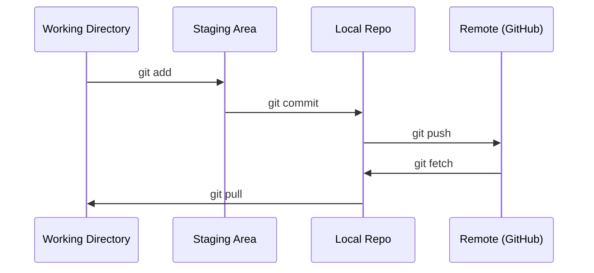

# Git & Kolaborasi

> Kontrol versi bukan opsional. Setiap eksperimen, setiap model, setiap lesson yang kamu buat di sini akan dilacak.

**Type:** Learn
**Language:** --
**Prerequisites:** Phase 0, Lesson 01
**Waktu:** ~30 menit

## Tujuan Pembelajaran

- Konfigurasikan identitas git dan gunakan alur kerja harian add, commit, dan push
- Membuat dan menggabungkan cabang untuk eksperimen terisolasi tanpa merusak yang utama
- Tulis `.gitignore` yang mengecualikan pos pemeriksaan model dan file biner besar
- Navigasikan riwayat penerapan dengan `git log` untuk memahami evolusi proyek

## Masalah

kamu akan menulis ratusan file code dalam 20 fase. Tanpa kontrol versi kamu akan kehilangan pekerjaan, merusak hal-hal yang tidak dapat kamu batalkan, dan tidak memiliki cara untuk berkolaborasi dengan orang lain.

Git adalah alatnya. GitHub adalah tempat code berada. Lesson ini mencakup apa yang kamu perlukan untuk kursus ini dan tidak lebih.

## Konsep



Tiga hal yang perlu diingat:
1. Sering menabung (`git commit`)
2. Dorong ke distance jauh (`git push`)
3. Cabang untuk eksperimen (`git checkout -b experiment`)

## Build

### Langkah 1: Konfigurasikan git

```bash
git config --global user.name "Your Name"
git config --global user.email "you@example.com"
```

### Langkah 2: Alur kerja harian

```bash
git status
git add file.py
git commit -m "Add perceptron implementation"
git push origin main
```

### Langkah 3: Percabangan untuk eksperimen

```bash
git checkout -b experiment/new-optimizer

# ... make changes, commit ...

git checkout main
git merge experiment/new-optimizer
```

### Langkah 4: Bekerja dengan repo kursus ini

```bash
git clone https://github.com/rohitg00/ai-engineering-from-scratch.git
cd ai-engineering-from-scratch

git checkout -b my-progress
# work through lessons, commit your code
git push origin my-progress
```

## Pakai

Untuk kursus ini, kamu memerlukan prompt berikut:

| Prompt | Kapan |
|---------|------|
| `git clone` | Dapatkan repo kursus |
| `git add` + `git commit` | Simpan pekerjaan kamu |
| `git push` | Cadangkan ke GitHub |
| `git checkout -b` | Cobalah sesuatu tanpa merusak main |
| `git log --oneline` | Lihat apa yang telah kamu lakukan |

Itu saja. kamu tidak memerlukan rebase, cherry-pick, atau submodul untuk kursus ini.

## Latihan

1. Kloning repo ini, buat cabang bernama `my-progress`, buat file, komit, dorong
2. Buat `.gitignore` yang mengecualikan file pos pemeriksaan model (`.pt`, `.pth`, `.safetensors`)
3. Lihat riwayat penerapan repo ini dengan `git log --oneline` dan baca bagaimana lesson ditambahkan

## Istilah Kunci

| Istilah | Apa kata orang | Apa sebenarnya arti |
|------|----------------|----------------------|
| Berkomitmen | "Menyimpan" | Cuplikan seluruh proyek kamu pada suatu waktu |
| Cabang | "Salinan" | Sebuah penunjuk ke komit yang bergerak maju saat kamu bekerja |
| Gabungkan | "Menggabungkan code" | Mengambil perubahan dari satu cabang dan menerapkannya ke cabang lain |
| Distance Jauh | "Awan" | Salinan repo kamu yang dihosting di tempat lain (GitHub, GitLab) |
