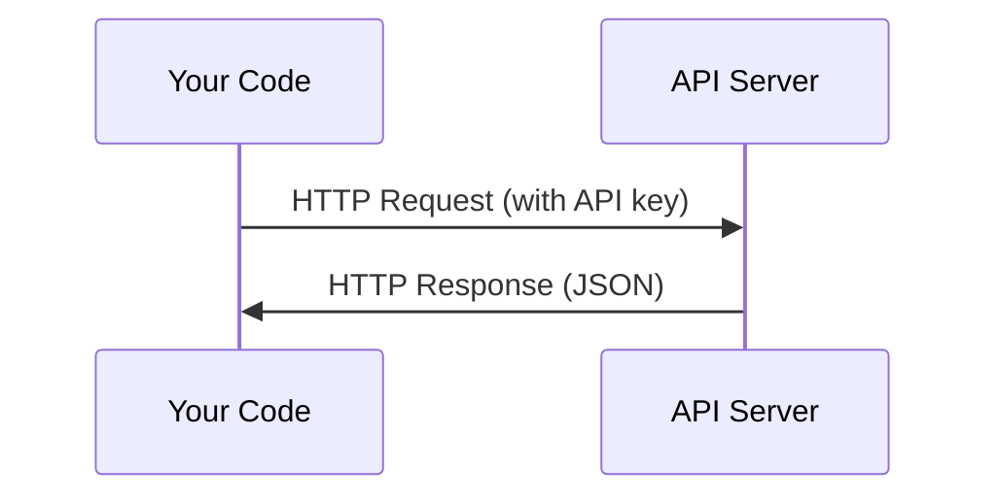

# API & Kunci

> Setiap AI API bekerja dengan cara yang sama: kirim permintaan, dapatkan respons. Detailnya berubah, polanya tidak.

**Type:** Build
**Language:** Python, TypeScript
**Prerequisites:** Phase 0, Lesson 01
**Waktu:** ~30 menit

## Tujuan Pembelajaran

- Simpan kunci API dengan aman menggunakan variabel lingkungan dan file `.env`
- Lakukan panggilan API LLM menggunakan Anthropic Python SDK dan HTTP mentah
- Bandingkan format permintaan/respons HTTP berbasis SDK dan mentah untuk debugging
- Identifikasi dan tangani kesalahan API umum termasuk autentikasi dan batas kecepatan

## Masalah

Mulai dari Fase 11, kamu akan memanggil LLM API (Anthropic, OpenAI, Google). Pada Fase 13-16 kamu akan membangun agen yang menggunakan API ini secara berulang. kamu perlu mengetahui cara kerja kunci API, cara menyimpannya dengan aman, dan cara melakukan panggilan API pertama kamu.

## Konsep



Setiap panggilan API memiliki:
1. Titik akhir (URL)
2. Kunci API (otentikasi)
3. Badan permintaan (apa yang kamu inginkan)
4. Badan respons (apa yang kamu dapatkan kembali)

## Build

### Langkah 1: Simpan kunci API dengan aman

Jangan pernah memasukkan kunci API ke dalam code. Gunakan variabel lingkungan.

```bash
export ANTHROPIC_API_KEY="sk-ant-..."
export OPENAI_API_KEY="sk-..."
```

Atau gunakan file `.env` (tambahkan ke `.gitignore`):

```
ANTHROPIC_API_KEY=sk-ant-...
OPENAI_API_KEY=sk-...
```

### Langkah 2: Panggilan API pertama (Python)

```python
import anthropic

client = anthropic.Anthropic()

response = client.messages.create(
    model="claude-sonnet-4-20250514",
    max_tokens=256,
    messages=[{"role": "user", "content": "What is a neural network in one sentence?"}]
)

print(response.content[0].text)
```

### Langkah 3: Panggilan API pertama (TypeScript)

```typescript
import Anthropic from "@anthropic-ai/sdk";

const client = new Anthropic();

const response = await client.messages.create({
  model: "claude-sonnet-4-20250514",
  max_tokens: 256,
  messages: [{ role: "user", content: "What is a neural network in one sentence?" }],
});

console.log(response.content[0].text);
```

### Langkah 4: HTTP mentah (tanpa SDK)

```python
import os
import urllib.request
import json

url = "https://api.anthropic.com/v1/messages"
headers = {
    "Content-Type": "application/json",
    "x-api-key": os.environ["ANTHROPIC_API_KEY"],
    "anthropic-version": "2023-06-01",
}
body = json.dumps({
    "model": "claude-sonnet-4-20250514",
    "max_tokens": 256,
    "messages": [{"role": "user", "content": "What is a neural network in one sentence?"}],
}).encode()

req = urllib.request.Request(url, data=body, headers=headers, method="POST")
with urllib.request.urlopen(req) as resp:
    result = json.loads(resp.read())
    print(result["content"][0]["text"])
```

Inilah yang dilakukan SDK. Memahami panggilan HTTP mentah membantu saat melakukan debug.

## Pakai

Untuk kursus ini:

| API | Saat kamu membutuhkannya | Tingkat gratis |
|-----|-----------------|-----------|
| Antropis (Claude) | Fase 11-16 (agen, alat) | Kredit $5 saat mendaftar |
| OpenAI | Fase 11 (perbandingan) | Kredit $5 saat mendaftar |
| Memeluk Wajah | Fase 4-10 (model, dataset) | Gratis |

kamu tidak membutuhkan semuanya saat ini. Aturlah ketika lesson memerlukannya.

## Kirim

Lesson ini menghasilkan:
- `outputs/prompt-api-troubleshooter.md` - mendiagnosis kesalahan API umum

## Latihan

1. Dapatkan kunci API Antropik dan lakukan panggilan API pertama kamu
2. Coba versi HTTP mentah dan bandingkan format respons dengan versi SDK
3. Sengaja menggunakan kunci API yang salah dan membaca pesan kesalahan

## Istilah Kunci

| Istilah | Apa kata orang | Apa sebenarnya arti |
|------|----------------|----------------------|
| Kunci API | "Kata sandi untuk API" | String unik yang mengidentifikasi akun kamu dan mengotorisasi permintaan |
| Batas tarif | "Mereka membatasi saya" | Permintaan maksimum per menit/jam untuk mencegah penyalahgunaan dan memastikan penggunaan wajar |
| Tanda | "Sebuah kata" (dalam konteks API) | Unit penagihan: token input dan output dihitung dan dibebankan secara terpisah |
| Streaming | "Respon waktu nyata" | Mendapatkan respon kata demi kata daripada menunggu respon lengkap |
