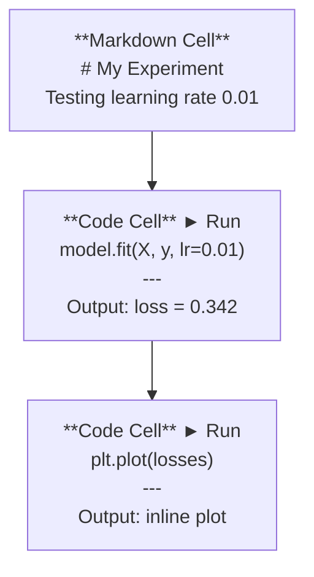
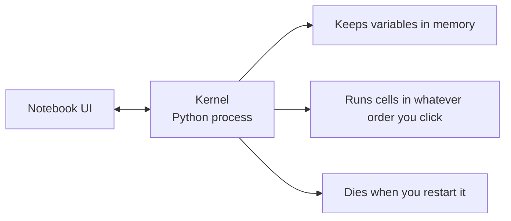

# Buku Catatan Jupyter

> Notebook adalah laboratorium teknik AI. kamu membuat prototipe di sini, lalu memindahkan apa yang berhasil ke dalam produksi.

**Type:** Build
**Language:** Python
**Prerequisites:** Phase 0, Lesson 01
**Waktu:** ~30 menit

## Tujuan Pembelajaran

- Instal dan luncurkan JupyterLab, Jupyter Notebook, atau VS Code dengan ekstensi Jupyter
- Gunakan prompt ajaib (`%timeit`, `%%time`, `%matplotlib inline`) untuk melakukan benchmark dan memvisualisasikan inline
- Bedakan kapan menggunakan buku catatan vs skrip dan terapkan alur kerja "jelajahi di buku catatan, kirimkan dalam skrip"
- Identifikasi dan hindari jebakan notebook yang umum: eksekusi tidak berurutan, status tersembunyi, dan kebocoran memori

## Masalah

Setiap makalah AI, tutorial, dan kompetisi Kaggle menggunakan notebook Jupyter. Mereka memungkinkan kamu menjalankan code sedikit demi sedikit, melihat output sebaris, mencampur code dengan penjelasan, dan melakukan iterasi dengan cepat. Jika kamu mencoba mempelajari AI tanpa buku catatan, kamu mengerjakan pekerjaan rumah matematika tanpa kertas coretan.

Tapi buku catatan punya jebakan nyata. Orang-orang menggunakannya untuk segala hal, termasuk hal-hal yang tidak mereka sukai. Mengetahui kapan harus menggunakan buku catatan dan kapan harus menggunakan skrip akan menyelamatkan kamu dari mimpi buruk debugging nanti.

## Konsep

Buku catatan adalah daftar sel. Setiap sel berupa code atau teks.



Kernel adalah proses Python yang berjalan di latar belakang. Saat kamu menjalankan sebuah sel, ia mengirimkan code ke kernel, yang mengeksekusinya dan mengirimkan kembali hasilnya. Semua sel berbagi kernel yang sama, sehingga variabel tetap ada antar sel.



Bagian "apa pun urutan yang kamu klik" adalah kekuatan super dan senjata api.

## Build

### Langkah 1: Pilih antarmuka kamu

Tiga opsi, satu format:

| Antarmuka | Instal | Terbaik untuk |
|-----------|---------|----------|
| Lab Jupyter | `pip install jupyterlab` lalu `jupyter lab` | Pengalaman IDE penuh, banyak tab, browser file, terminal |
| Buku Catatan Jupyter | `pip install notebook` lalu `jupyter notebook` | Sederhana, ringan, satu buku catatan sekaligus |
| Code VS | Instal ekstensi "Jupyter" | Sudah ada di editor kamu, integrasi git, debugging |

Ketiganya membaca dan menulis file `.ipynb` yang sama. Pilih apa pun yang kamu suka. JupyterLab adalah yang paling umum dalam pekerjaan AI.

```bash
pip install jupyterlab
jupyter lab
```

### Langkah 2: Pintasan keyboard yang penting

kamu beroperasi dalam dua mode. Tekan `Escape` untuk mode prompt (bilah biru di sebelah kiri), `Enter` untuk mode edit (bilah hijau).

**Mode prompt (paling sering digunakan):**

| Kunci | Aksi |
|-----|--------|
| `Shift+Enter` | Jalankan sel, pindah ke berikutnya |
| `A` | Sisipkan sel di atas |
| `B` | Sisipkan sel di bawah |
| `DD` | Hapus sel |
| `M` | Konversikan ke penurunan harga |
| `Y` | Konversikan ke code |
| `Z` | Membatalkan operasi sel |
| `Ctrl+Shift+H` | Tampilkan semua pintasan |

**Modus edit:**

| Kunci | Aksi |
|-----|--------|
| `Tab` | Pelengkapan otomatis |
| `Shift+Tab` | Tampilkan tanda tangan fungsi |
| `Ctrl+/` | Alihkan komentar |

`Shift+Enter` adalah yang akan kamu gunakan ribuan kali sehari. Learn dulu.

### Langkah 3: Tipe sel

**Sel code** jalankan Python dan tampilkan hasilnya:

```python
import numpy as np
data = np.random.randn(1000)
data.mean(), data.std()
```

Output: `(0.0032, 0.9987)`

**Sel penurunan harga** merender teks yang diformat. Gunakan mereka untuk mendokumentasikan apa yang kamu lakukan dan alasannya. Mendukung header, huruf tebal, miring, matematika LaTeX (`$E = mc^2$`), tabel, dan gambar.

### Langkah 4: Prompt ajaibIni bukan Python. Itu adalah prompt khusus Jupyter yang dimulai dengan `%` (sihir garis) atau `%%` (sihir sel).

**Waktu code kamu:**

```python
%timeit np.random.randn(10000)
```

Output: `45.2 us +/- 1.3 us per loop`

```python
%%time
model.fit(X_train, y_train, epochs=10)
```

Output: `Wall time: 2.34 s`

`%timeit` menjalankan code berkali-kali dan rata-rata. `%%time` menjalankannya sekali. Gunakan `%timeit` untuk microbenchmark, `%%time` untuk latihan berjalan.

**Aktifkan plot sebaris:**

```python
%matplotlib inline
```

Setiap `plt.plot()` atau `plt.show()` kini dirender langsung di notebook.

**Instal paket tanpa meninggalkan notebook:**

```python
!pip install scikit-learn
```

Awalan `!` menjalankan prompt shell apa pun.

**Periksa variabel lingkungan:**

```python
%env CUDA_VISIBLE_DEVICES
```

### Langkah 5: Tampilkan inline output yang kaya

Buku catatan secara otomatis menampilkan ekspresi terakhir dalam sel. Tapi kamu bisa mengendalikannya:

```python
import pandas as pd

df = pd.DataFrame({
    "model": ["Linear", "Random Forest", "Neural Net"],
    "accuracy": [0.72, 0.89, 0.94],
    "training_time": [0.1, 2.3, 45.6]
})
df
```

Ini membuat tabel HTML yang diformat, bukan dump teks. Sama dengan plot:

```python
import matplotlib.pyplot as plt

plt.figure(figsize=(8, 4))
plt.plot([1, 2, 3, 4], [1, 4, 2, 3])
plt.title("Inline Plot")
plt.show()
```

Plotnya muncul tepat di bawah sel. Inilah sebabnya mengapa notebook mendominasi pekerjaan AI. kamu melihat data, plot, dan code secara bersamaan.

Untuk gambar:

```python
from IPython.display import Image, display
display(Image(filename="architecture.png"))
```

### Langkah 6: Google Colab

Colab adalah notebook Jupyter gratis di cloud. Ini memberi kamu GPU, perpustakaan pra-instal, dan integrasi Google Drive. Tidak diperlukan pengaturan.

1. Buka [colab.research.google.com](https://colab.research.google.com)
2. Unggah file `.ipynb` apa pun dari kursus ini
3. Runtime > Ubah jenis runtime > T4 GPU (gratis)

Perbedaan Colab dengan Jupyter lokal:
- File tidak bertahan di antara sesi (simpan ke Drive atau unduh)
- Pra-instal: numpy, pandas, matplotlib, torch, tensorflow, sklearn
- `from google.colab import files` untuk mengunggah/mengunduh file
- `from google.colab import drive; drive.mount('/content/drive')` untuk penyimpanan persisten
- Waktu habis sesi setelah 90 menit tidak aktif (tingkat gratis)

## Pakai

### Notebook vs Skrip: Kapan menggunakan yang mana

| Gunakan buku catatan untuk | Gunakan skrip untuk |
|-------------------|-----------------|
| Menjelajahi dataset | Jalur training |
| Membuat prototipe model | Utilitas yang dapat digunakan kembali |
| Memvisualisasikan hasil | Apa pun dengan `if __name__` |
| Menjelaskan pekerjaan kamu | Code yang berjalan sesuai jadwal |
| Eksperimen cepat | Code produksi |
| Latihan kursus | Paket dan perpustakaan |

Aturannya: **jelajahi di buku catatan, kirimkan dalam skrip**.

Alur kerja umum di AI:
1. Jelajahi data di buku catatan
2. Prototipe model kamu di buku catatan
3. Setelah berhasil, pindahkan code ke file `.py`
4. Impor kembali file `.py` tersebut ke dalam buku catatan untuk eksperimen lebih lanjut

### Perangkap umum

**Eksekusi di luar urutan.** kamu menjalankan sel 5, lalu sel 2, lalu sel 7. Notebook berfungsi di mesin kamu, namun rusak saat seseorang menjalankannya dari atas ke bawah. Perbaiki: Kernel > Restart & Run All sebelum berbagi.

**Keadaan tersembunyi.** kamu menghapus sel namun variabel yang dibuat masih ada di memori. Notebooknya terlihat bersih tetapi bergantung pada sel hantu. Cara mengatasinya: Restart kernel secara berkala.

**Kebocoran memori.** Memuat set data 4 GB, melatih model, memuat set data lain. Tidak ada yang dibebaskan. Perbaiki: `del variable_name` dan `gc.collect()`, atau restart kernel.

## Kirim

Lesson ini menghasilkan:
- `outputs/prompt-notebook-helper.md` untuk men-debug masalah notebook

## Latihan1. Buka JupyterLab, buat buku catatan, dan gunakan `%timeit` untuk membandingkan pemahaman daftar vs numpy untuk membuat larik 100.000 angka acak
2. Buat buku catatan dengan sel penurunan harga dan code yang memuat CSV, menampilkan kerangka data, dan memplot bagan. Kemudian jalankan Kernel > Restart & Run All untuk memverifikasi bahwa itu berfungsi dari atas ke bawah
3. Ambil code dari `code/notebook_tips.py`, tempelkan ke notebook Colab, dan jalankan dengan GPU gratis

## Istilah Kunci

| Istilah | Apa kata orang | Apa sebenarnya arti |
|------|----------------|----------------------|
| Kernel | "Hal yang menjalankan code saya" | Proses Python terpisah yang mengeksekusi sel dan menyimpan variabel di memori |
| Sel | "Blok code" | Unit yang dapat dijalankan secara independen di buku catatan, baik code atau penurunan harga |
| Prompt ajaib | "Trik Jupyter" | Prompt khusus yang diawali dengan `%` atau `%%` yang mengontrol lingkungan notebook |
| `.ipynb` | "Berkas buku catatan" | File JSON yang berisi sel, output, dan metadata. Singkatan dari IPython Notebook |

## Bacaan Lanjutan

- [JupyterLab Docs](https://jupyterlab.readthedocs.io/) untuk rangkaian feature lengkap
- [FAQ Google Colab](https://research.google.com/colaboratory/faq.html) untuk batasan dan feature khusus Colab
- [28 Tip Notebook Jupyter](https://www.dataquest.io/blog/jupyter-notebook-tips-tricks-shortcuts/) untuk pintasan pengguna tingkat lanjut
