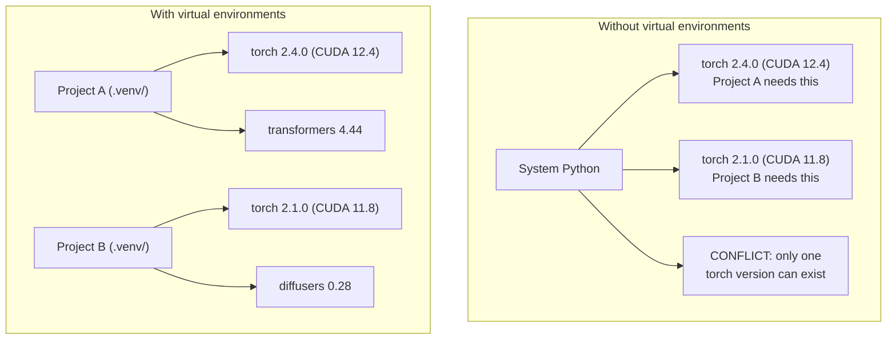

# Lingkungan Python

> Neraka ketergantungan itu nyata. Lingkungan virtual adalah obatnya.

**Type:** Build
**Language:** Python
**Prerequisites:** Phase 0, Lesson 01
**Waktu:** ~30 menit

## Tujuan Pembelajaran

- Buat lingkungan virtual terisolasi menggunakan `uv`, `venv`, atau `conda`
- Tulis `pyproject.toml` dengan grup ketergantungan opsional dan buat file kunci agar dapat direproduksi
- Mendiagnosis dan memperbaiki kesalahan umum: pemasangan global, pencampuran pip/conda, ketidakcocokan versi CUDA
- Menerapkan strategi lingkungan per fase untuk proyek dengan ketergantungan yang bertentangan

## Masalah

kamu menginstal PyTorch 2.4 untuk proyek penyesuaian. Minggu depan, proyek lain memerlukan PyTorch 2.1 karena build CUDA-nya telah di-embed. kamu meningkatkan versi secara global, dan proyek pertama terhenti. kamu menurunkan versi, dan yang kedua rusak.

Ini adalah neraka ketergantungan. Hal ini terjadi terus-menerus dalam pekerjaan AI/ML karena:

- PyTorch, JAX, dan TensorFlow masing-masing mengirimkan binding CUDA-nya sendiri
- Pustaka model embed versi framework tertentu
- `pip install` global menimpa apa pun yang ada sebelumnya
- Build CUDA 11.8 tidak berfungsi dengan driver CUDA 12.x (dan sebaliknya)

Cara mengatasinya: setiap proyek mendapatkan lingkungan terisolasinya sendiri dengan paketnya sendiri.

## Konsep



## Build

### Opsi 1: uv venv (Disarankan)

`uv` adalah pengelola paket Python tercepat (10-100x lebih cepat dari pip). Ini menangani lingkungan virtual, versi Python, dan resolusi ketergantungan dalam satu alat.

```bash
curl -LsSf https://astral.sh/uv/install.sh | sh

uv python install 3.12

cd your-project
uv venv
source .venv/bin/activate
```

Instal paket:

```bash
uv pip install torch numpy
```

Buat proyek dengan `pyproject.toml` dalam satu langkah:

```bash
uv init my-ai-project
cd my-ai-project
uv add torch numpy matplotlib
```

### Opsi 2: venv (Bawaan)

Jika kamu tidak dapat menginstal `uv`, Python dikirimkan bersama `venv`:

```bash
python3 -m venv .venv
source .venv/bin/activate  # Linux/macOS
.venv\Scripts\activate     # Windows

pip install torch numpy
```

Lebih lambat dari `uv`, tetapi berfungsi di mana pun Python diinstal.

### Opsi 3: conda (Saat kamu Membutuhkannya)

Conda mengelola dependensi non-Python seperti toolkit CUDA, cuDNN, dan pustaka C. Gunakan ketika:

- kamu memerlukan versi toolkit CUDA tertentu tanpa menginstalnya di seluruh sistem
- kamu berada di cluster bersama di mana kamu tidak dapat menginstal paket sistem
- Petunjuk pemasangan perpustakaan mengatakan "gunakan conda"

```bash
# Install miniconda (not the full Anaconda)
curl -LsSf https://repo.anaconda.com/miniconda/Miniconda3-latest-Linux-x86_64.sh -o miniconda.sh
bash miniconda.sh -b

conda create -n myproject python=3.12
conda activate myproject

conda install pytorch torchvision torchaudio pytorch-cuda=12.4 -c pytorch -c nvidia
```

Satu aturan: jika kamu menggunakan conda untuk suatu lingkungan, gunakan conda untuk semua paket di lingkungan itu. Mencampur `pip install` ke dalam conda env menyebabkan konflik ketergantungan yang sulit untuk di-debug.

### Untuk Kursus Ini: Strategi Per Fase

kamu dapat menciptakan satu lingkungan untuk keseluruhan kursus. Jangan. Fase yang berbeda memerlukan ketergantungan yang berbeda (terkadang saling bertentangan).

Strategi:

```
ai-engineering-from-scratch/
├── .venv/                    <-- shared lightweight env for phases 0-3
├── phases/
│   ├── 04-neural-networks/
│   │   └── .venv/            <-- PyTorch env
│   ├── 05-cnns/
│   │   └── .venv/            <-- same PyTorch env (symlink or shared)
│   ├── 08-transformers/
│   │   └── .venv/            <-- might need different transformer versions
│   └── 11-llm-apis/
│       └── .venv/            <-- API SDKs, no torch needed
```

Skrip di `code/env_setup.sh` menciptakan lingkungan dasar untuk kursus ini.

## Dasar-dasar pyproject.toml

Setiap proyek Python harus memiliki `pyproject.toml`. Ini menggantikan `setup.py`, `setup.cfg`, dan `requirements.txt` dalam satu file.

```toml
[project]
name = "ai-engineering-from-scratch"
version = "0.1.0"
requires-python = ">=3.11"
dependencies = [
    "numpy>=1.26",
    "matplotlib>=3.8",
    "jupyter>=1.0",
    "scikit-learn>=1.4",
]

[project.optional-dependencies]
torch = ["torch>=2.3", "torchvision>=0.18"]
llm = ["anthropic>=0.39", "openai>=1.50"]
```

Kemudian instal:

```bash
uv pip install -e ".[torch]"    # base + PyTorch
uv pip install -e ".[llm]"     # base + LLM SDKs
uv pip install -e ".[torch,llm]" # everything
```

## Kunci file

File kunci embed setiap ketergantungan (termasuk ketergantungan transitif) ke versi yang tepat. Hal ini menjamin reproduktifitas: siapa pun yang menginstal dari lockfile mendapatkan paket yang persis sama.

```bash
# uv generates uv.lock automatically when using uv add
uv add numpy

# pip-tools approach
uv pip compile pyproject.toml -o requirements.lock
uv pip install -r requirements.lock
```

Komit file kunci kamu ke git. Ketika seseorang mengkloning repo, mereka menginstal dari lockfile dan mendapatkan versi yang identik.

## Kesalahan Umum

### 1. Menginstal secara global

```bash
pip install torch  # BAD: installs to system Python

source .venv/bin/activate
pip install torch  # GOOD: installs to virtual environment
```

Periksa ke mana paket kamu pergi:

```bash
which python       # should show .venv/bin/python, not /usr/bin/python
which pip           # should show .venv/bin/pip
```

### 2. Mencampur pip dan conda```bash
conda create -n myenv python=3.12
conda activate myenv
conda install pytorch -c pytorch
pip install some-other-package   # BAD: can break conda's dependency tracking
conda install some-other-package # GOOD: let conda manage everything
```

Jika kamu harus menggunakan pip di dalam conda (beberapa paket hanya pip), instal semua paket conda terlebih dahulu, lalu paket pip terakhir.

### 3. Lupa activation

```bash
python train.py           # uses system Python, missing packages
source .venv/bin/activate
python train.py           # uses project Python, packages found
```

Prompt shell kamu akan menampilkan nama lingkungan:

```
(.venv) $ python train.py
```

### 4. Melakukan .venv ke git

```bash
echo ".venv/" >> .gitignore
```

Lingkungan virtual berukuran 200MB-2GB. Mereka bersifat lokal, tidak portabel antar mesin. Komit `pyproject.toml` dan lockfile sebagai gantinya.

### 5. Versi CUDA tidak cocok

```bash
nvidia-smi                # shows driver CUDA version (e.g., 12.4)
python -c "import torch; print(torch.version.cuda)"  # shows PyTorch CUDA version

# These must be compatible.
# PyTorch CUDA version must be <= driver CUDA version.
```

## Pakai

Jalankan skrip pengaturan untuk membuat lingkungan kursus kamu:

```bash
bash phases/00-setup-and-tooling/06-python-environments/code/env_setup.sh
```

Ini menciptakan `.venv` di root repo dengan dependensi inti diinstal dan diverifikasi.

## Latihan

1. Jalankan `env_setup.sh` dan verifikasi semua kelulusan pemeriksaan
2. Buat lingkungan virtual kedua, instal versi numpy yang berbeda di dalamnya, dan konfirmasikan kedua lingkungan tersebut terisolasi
3. Tulis `pyproject.toml` untuk proyek yang memerlukan PyTorch dan Anthropic SDK
4. Sengaja menginstal paket secara global (tanpa mengaktifkan venv), perhatikan kemana perginya, lalu uninstall

## Istilah Kunci

| Istilah | Apa kata orang | Apa sebenarnya arti |
|------|----------------|----------------------|
| Lingkungan maya | "Sebuah Venv" | Direktori terisolasi yang berisi juru bahasa dan paket Python, terpisah dari sistem Python |
| File Kunci | "Ketergantungan yang di-embed" | Sebuah file yang mencantumkan setiap paket dan versi persisnya, menjamin instalasi yang identik di seluruh mesin |
| proyek py.toml | "Setup.py baru" | File konfigurasi proyek Python standar, menggantikan setup.py/setup.cfg/requirements.txt |
| Ketergantungan transitif | "Ketergantungan dari ketergantungan" | Paket B bergantung pada C; jika kamu menginstal A yang bergantung pada B, C adalah ketergantungan transitif dari A |
| Ketidakcocokan CUDA | "GPU saya tidak berfungsi" | PyTorch dikompilasi untuk versi CUDA yang berbeda dari yang didukung driver GPU kamu |
