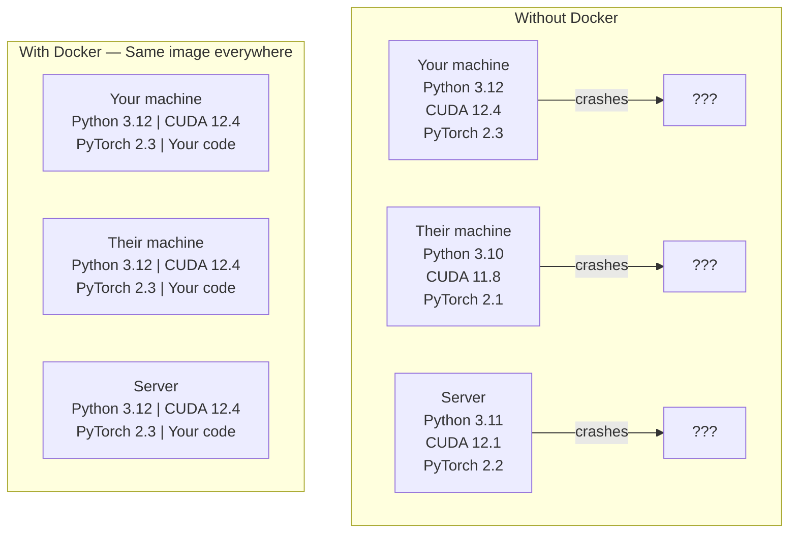

# Docker untuk AI

> Kontainer membuat "berfungsi di mesin saya" menjadi masa lalu.

**Type:** Build
**Language:** Python
**Prerequisites:** Fase 0, Lesson 01 dan 03
**Waktu:** ~60 menit

## Tujuan Pembelajaran

- Build image Docker berkemampuan GPU dengan pustaka CUDA, PyTorch, dan AI dari Dockerfile
- Pasang direktori host sebagai volume untuk mempertahankan model, dataset, dan code di seluruh pembangunan kembali kontainer
- Konfigurasikan NVIDIA Container Toolkit untuk mengekspos GPU di dalam container
- Mengatur aplikasi AI multi-layanan (server inference + database vector) menggunakan Docker Compose

## Masalah

kamu melatih model di laptop kamu dengan PyTorch 2.3, CUDA 12.4, dan Python 3.12. Rekan kamu memiliki PyTorch 2.1, CUDA 11.8, dan Python 3.10. Model kamu mogok di mesin mereka. Dockerfile kamu berfungsi pada keduanya.

Proyek AI adalah mimpi buruk ketergantungan. Tumpukan tipikal mencakup Python, PyTorch, driver CUDA, cuDNN, pustaka C tingkat sistem, dan paket khusus seperti flash-attn yang memerlukan versi kompiler yang tepat. Docker mengemas semua ini menjadi satu image yang berjalan secara identik di mana saja.

## Konsep

Docker membungkus code, runtime, pustaka, dan alat sistem kamu ke dalam unit terisolasi yang disebut kontainer. Anggap saja sebagai mesin virtual yang ringan, hanya saja ia berbagi kernel OS host dan bukan menjalankannya sendiri, sehingga ia dimulai dalam hitungan detik, bukan menit.



### Mengapa proyek AI membutuhkan Docker lebih dari kebanyakan proyek lainnya

1. **Driver GPU rapuh.** Code CUDA 12.4 tidak berjalan di CUDA 11.8. Docker mengisolasi toolkit CUDA di dalam container sambil membagikan driver GPU host melalui NVIDIA Container Toolkit.

2. **Weight model besar.** Model parameter 7B berukuran 14 GB di fp16. kamu tidak ingin mengunduh ulang setiap kali kamu membangunnya kembali. Volume Docker memungkinkan kamu memasang direktori model dari host.

3. **Arsitektur multi-layanan adalah hal yang umum.** Aplikasi AI sebenarnya bukan sekadar skrip Python. Ini adalah server inference, database vector untuk RAG, mungkin antarmuka web. Docker Compose mengatur semua ini dengan satu prompt.

### Kosakata kunci

| Istilah | Artinya |
|------|---------------|
| Gambar | Templat hanya-baca. resep kamu. Dibangun dari Dockerfile. |
| Wadah | Contoh gambar yang sedang berjalan. Dapur kamu. |
| File Docker | Petunjuk untuk membangun sebuah gambar. Lapis demi lapis. |
| Jilid | Penyimpanan persisten yang bertahan saat kontainer dimulai ulang. |
| komposisi buruh pelabuhan | Alat untuk mendefinisikan aplikasi multi-kontainer di YAML. |

### Pola kontainer umum di AI

```
Dev Container
  Full toolkit. Editor support. Jupyter. Debugging tools.
  Used during development and experimentation.

Training Container
  Minimal. Just the training script and dependencies.
  Runs on GPU clusters. No editor, no Jupyter.

Inference Container
  Optimized for serving. Small image. Fast cold start.
  Runs behind a load balancer in production.
```

## Build

### Langkah 1: Instal Docker

```bash
# macOS
brew install --cask docker
open /Applications/Docker.app

# Ubuntu
curl -fsSL https://get.docker.com | sh
sudo usermod -aG docker $USER
# Log out and back in for group change to take effect
```

Verifikasi:

```bash
docker --version
docker run hello-world
```

### Langkah 2: Instal NVIDIA Container Toolkit (Linux dengan GPU NVIDIA)

Ini memungkinkan kontainer Docker mengakses GPU kamu. pengguna macOS dan Windows (WSL2) dapat melewati ini; Docker Desktop menangani passthrough GPU secara berbeda pada platform tersebut.

```bash
distribution=$(. /etc/os-release;echo $ID$VERSION_ID)
curl -fsSL https://nvidia.github.io/libnvidia-container/gpgkey | sudo gpg --dearmor -o /usr/share/keyrings/nvidia-container-toolkit-keyring.gpg
curl -s -L https://nvidia.github.io/libnvidia-container/$distribution/libnvidia-container.list | \
    sed 's#deb https://#deb [signed-by=/usr/share/keyrings/nvidia-container-toolkit-keyring.gpg] https://#g' | \
    sudo tee /etc/apt/sources.list.d/nvidia-container-toolkit.list

sudo apt-get update
sudo apt-get install -y nvidia-container-toolkit
sudo nvidia-ctk runtime configure --runtime=docker
sudo systemctl restart docker
```

Uji akses GPU di dalam container:

```bash
docker run --rm --gpus all nvidia/cuda:12.4.1-base-ubuntu22.04 nvidia-smi
```

Jika kamu melihat info GPU, berarti toolkit berfungsi.

### Langkah 3: Pahami gambar dasar

Memilih gambar dasar yang tepat menghemat waktu proses debug.

```
nvidia/cuda:12.4.1-devel-ubuntu22.04
  Full CUDA toolkit. Compilers included.
  Use for: building packages that need nvcc (flash-attn, bitsandbytes)
  Size: ~4 GB

nvidia/cuda:12.4.1-runtime-ubuntu22.04
  CUDA runtime only. No compilers.
  Use for: running pre-built code
  Size: ~1.5 GB

pytorch/pytorch:2.3.1-cuda12.4-cudnn9-runtime
  PyTorch pre-installed on top of CUDA.
  Use for: skipping the PyTorch install step
  Size: ~6 GB

python:3.12-slim
  No CUDA. CPU only.
  Use for: inference on CPU, lightweight tools
  Size: ~150 MB
```

### Langkah 4: Tulis Dockerfile untuk pengembangan AI

Ini Dockerfile di `code/Dockerfile`. Berjalan melaluinya:

```dockerfile
FROM nvidia/cuda:12.4.1-devel-ubuntu22.04

ENV DEBIAN_FRONTEND=noninteractive
ENV PYTHONUNBUFFERED=1

RUN apt-get update && apt-get install -y --no-install-recommends \
    python3.12 \
    python3.12-venv \
    python3.12-dev \
    python3-pip \
    git \
    curl \
    build-essential \
    && rm -rf /var/lib/apt/lists/*

RUN update-alternatives --install /usr/bin/python python /usr/bin/python3.12 1

RUN python -m pip install --no-cache-dir --upgrade pip setuptools wheel

RUN python -m pip install --no-cache-dir \
    torch==2.3.1 \
    torchvision==0.18.1 \
    torchaudio==2.3.1 \
    --index-url https://download.pytorch.org/whl/cu124

RUN python -m pip install --no-cache-dir \
    numpy \
    pandas \
    scikit-learn \
    matplotlib \
    jupyter \
    transformers \
    datasets \
    accelerate \
    safetensors

WORKDIR /workspace

VOLUME ["/workspace", "/models"]

EXPOSE 8888

CMD ["python"]
```

Build itu:

```bash
docker build -t ai-dev -f phases/00-setup-and-tooling/07-docker-for-ai/code/Dockerfile .
```

Ini memerlukan waktu cukup lama untuk pertama kalinya (mengunduh gambar dasar CUDA + PyTorch). Build berikutnya menggunakan layer cache.

Jalankan:

```bash
docker run --rm -it --gpus all \
    -v $(pwd):/workspace \
    -v ~/models:/models \
    ai-dev python -c "import torch; print(f'PyTorch {torch.__version__}, CUDA: {torch.cuda.is_available()}')"
```

Jalankan Jupyter di dalam wadah:

```bash
docker run --rm -it --gpus all \
    -v $(pwd):/workspace \
    -v ~/models:/models \
    -p 8888:8888 \
    ai-dev jupyter notebook --ip=0.0.0.0 --port=8888 --no-browser --allow-root
```### Langkah 5: Pemasangan volume untuk data dan model

Pemasangan volume sangat penting untuk pekerjaan AI. Tanpanya, unduhan model 14 GB kamu akan hilang saat penampung berhenti.

```bash
# Mount your code
-v $(pwd):/workspace

# Mount a shared models directory
-v ~/models:/models

# Mount datasets
-v ~/datasets:/data
```

Di dalam skrip training kamu, muat dari jalur yang dipasang:

```python
from transformers import AutoModel

model = AutoModel.from_pretrained("/models/llama-7b")
```

Model ini ada di sistem file host kamu. Build kembali penampung sesering yang kamu inginkan tanpa mengunduh ulang.

### Langkah 6: Docker Compose untuk aplikasi AI multi-layanan

Aplikasi RAG yang sebenarnya memerlukan server inference dan database vector. Docker Compose menjalankan keduanya dengan satu prompt.

Lihat `code/docker-compose.yml`:

```yaml
services:
  ai-dev:
    build:
      context: .
      dockerfile: Dockerfile
    deploy:
      resources:
        reservations:
          devices:
            - driver: nvidia
              count: all
              capabilities: [gpu]
    volumes:
      - ../../../:/workspace
      - ~/models:/models
      - ~/datasets:/data
    ports:
      - "8888:8888"
    stdin_open: true
    tty: true
    command: jupyter notebook --ip=0.0.0.0 --port=8888 --no-browser --allow-root

  qdrant:
    image: qdrant/qdrant:v1.12.5
    ports:
      - "6333:6333"
      - "6334:6334"
    volumes:
      - qdrant_data:/qdrant/storage

volumes:
  qdrant_data:
```

Mulai semuanya:

```bash
cd phases/00-setup-and-tooling/07-docker-for-ai/code
docker compose up -d
```

Sekarang wadah pengembang AI kamu dapat menjangkau database vector di `http://qdrant:6333` berdasarkan nama layanan. Docker Compose membuat jaringan bersama secara otomatis.

Uji koneksi dari dalam wadah AI:

```python
from qdrant_client import QdrantClient

client = QdrantClient(host="qdrant", port=6333)
print(client.get_collections())
```

Hentikan semuanya:

```bash
docker compose down
```

Tambahkan `-v` untuk juga menghapus volume qdrant:

```bash
docker compose down -v
```

### Langkah 7: Prompt Docker yang berguna untuk pekerjaan AI

```bash
# List running containers
docker ps

# List all images and their sizes
docker images

# Remove unused images (reclaim disk space)
docker system prune -a

# Check GPU usage inside a running container
docker exec -it <container_id> nvidia-smi

# Copy a file from container to host
docker cp <container_id>:/workspace/results.csv ./results.csv

# View container logs
docker logs -f <container_id>
```

## Pakai

kamu sekarang memiliki lingkungan pengembangan AI yang dapat direproduksi. Untuk sisa kursus ini:

- Gunakan `docker compose up` untuk memulai lingkungan pengembang dan database vector kamu secara bersamaan
- Pasang code, model, dan data kamu sebagai volume sehingga tidak ada yang hilang di antara pembangunan kembali
- Saat lesson memerlukan paket Python baru, tambahkan paket tersebut ke Dockerfile dan bangun kembali
- Bagikan Dockerfile kamu dengan rekan satu tim. Mereka mendapatkan lingkungan yang sama persis.

### Tidak ada GPUnya?

Hapus tanda `--gpus all` dan blok penerapan NVIDIA. Kontainer masih berfungsi untuk lesson berbasis CPU. PyTorch mendeteksi tidak adanya CUDA dan kembali ke CPU secara otomatis.

## Latihan

1. Build Dockerfile dan jalankan `python -c "import torch; print(torch.__version__)"` di dalam container
2. Mulai tumpukan penulisan buruh pelabuhan dan verifikasi Qdrant dapat diakses dari wadah AI di `http://qdrant:6333/collections`
3. Tambahkan `flask` ke Dockerfile, bangun kembali, dan jalankan server API sederhana pada port 5000. Petakan port dengan `-p 5000:5000`
4. Ukur ukuran gambar dengan `docker images`. Coba alihkan gambar dasar dari `devel` ke `runtime` dan bandingkan ukurannya

## Istilah Kunci

| Istilah | Apa kata orang | Apa sebenarnya arti |
|------|----------------|----------------------|
| Wadah | "VM Ringan" | Proses terisolasi menggunakan kernel host, dengan sistem file dan jaringannya sendiri |
| Layer gambar | "Langkah yang di-cache" | Setiap instruksi Dockerfile membuat sebuah layer. Layer yang tidak diubah akan di-cache, sehingga pembangunan kembali dapat dilakukan dengan cepat. |
| Perangkat Kontainer NVIDIA | "GPU di Docker" | Hook runtime yang memaparkan GPU host ke container melalui `--gpus` flag |
| Pemasangan volume | "Folder bersama" | Direktori pada host yang dipetakan ke dalam container. Perubahan tetap ada setelah penampung berhenti. |
| Gambar dasar | "Titik awal" | Gambar `FROM` yang menjadi dasar pembuatan Dockerfile kamu. Menentukan apa yang sudah diinstal sebelumnya. |
