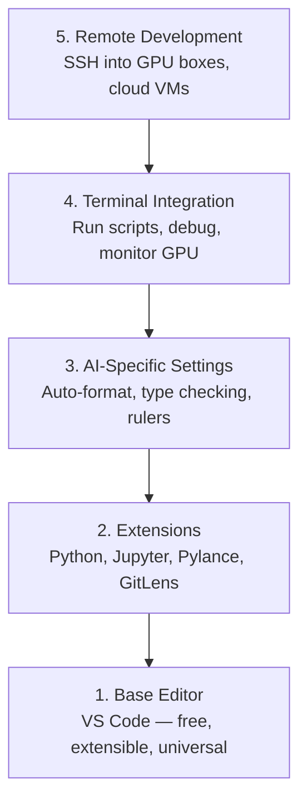

# Pengaturan Editor

> Editor kamu adalah co-pilot kamu. Konfigurasikan sekali agar tidak mengganggu kamu dan mulai menarik bebannya.

**Type:** Build
**Language:** --
**Prerequisites:** Phase 0, Lesson 01
**Waktu:** ~20 menit

## Tujuan Pembelajaran

- Instal VS Code dengan ekstensi penting untuk Python, Jupyter, linting, dan SSH distance jauh
- Konfigurasikan format-saat-simpan, pemeriksaan jenis, dan pengguliran output buku catatan untuk alur kerja AI
- Siapkan SSH Distance Jauh untuk mengedit dan men-debug code pada mesin GPU distance jauh seolah-olah itu lokal
- Evaluasi alternatif editor (Cursor, Windsurf, Neovim) dan tradeoff untuk pekerjaan AI

## Masalah

kamu akan menghabiskan ribuan jam di dalam editor kamu untuk menulis Python, menjalankan notebook, men-debug loop training, dan memasukkan SSH ke dalam kotak GPU. Editor yang salah dikonfigurasi mengubah setiap sesi menjadi gesekan: tidak ada pelengkapan otomatis, tidak ada petunjuk mengetik, tidak ada kesalahan sebaris, pemformatan manual, dan alur kerja terminal yang kikuk.

Penyiapan yang tepat membutuhkan waktu 20 menit. Melewatkannya akan dikenakan biaya 20 menit setiap hari.

## Konsep

Penyiapan editor teknik AI memerlukan lima hal:



## Build

### Langkah 1: Instal Code VS

VS Code adalah editor yang direkomendasikan. Ini gratis, berjalan di semua OS, memiliki dukungan notebook Jupyter kelas satu, dan ekosistem ekstensi mencakup semua yang kamu perlukan untuk pekerjaan AI.

Unduh dari [code.visualstudio.com](https://code.visualstudio.com/).

Verifikasi dari terminal:

```bash
code --version
```

Jika `code` tidak ditemukan di macOS, buka VS Code, tekan `Cmd+Shift+P`, ketik "Shell Command", dan pilih "Install 'code' command in PATH".

### Langkah 2: Instal Ekstensi Penting

Buka terminal terintegrasi di VS Code (`Ctrl+`` ` atau `` Cmd+` ``) dan instal ekstensi yang penting untuk pekerjaan AI:

```bash
code --install-extension ms-python.python
code --install-extension ms-python.vscode-pylance
code --install-extension ms-toolsai.jupyter
code --install-extension eamodio.gitlens
code --install-extension ms-vscode-remote.remote-ssh
code --install-extension ms-python.debugpy
code --install-extension ms-python.black-formatter
code --install-extension charliermarsh.ruff
```

Apa yang masing-masing lakukan:

| Ekstensi | Mengapa |
|-----------|-----|
| ular piton | Dukungan bahasa, deteksi env virtual, jalankan/debug |
| Pylance | Pemeriksaan tipe cepat, pelengkapan otomatis, resolusi impor |
| Jupyter | Jalankan notebook di dalam VS Code, penjelajah variabel |
| GitLens | Lihat siapa yang mengubah apa, sebaris git menyalahkan |
| SSH distance jauh | Buka folder di kotak GPU distance jauh seolah-olah itu lokal |
| Debug | Proses debug menyeluruh untuk Python |
| Pemformat Hitam | Format otomatis saat disimpan, gaya konsisten |
| ruff | Linting cepat, menangkap kesalahan umum |

File `code/.vscode/extensions.json` dalam lesson ini berisi daftar rekomendasi lengkap. Saat kamu membuka folder proyek, VS Code akan meminta kamu untuk menginstalnya.

### Langkah 3: Konfigurasikan Pengaturan

Salin pengaturan dari `code/.vscode/settings.json` dalam lesson ini, atau terapkan secara manual melalui `Settings > Open Settings (JSON)`.

Pengaturan utama agar AI berfungsi:

```jsonc
{
    "python.analysis.typeCheckingMode": "basic",
    "editor.formatOnSave": true,
    "editor.rulers": [88, 120],
    "notebook.output.scrolling": true,
    "files.autoSave": "afterDelay"
}
```

Mengapa hal ini penting:

- **Pemeriksaan tipe pada dasar**: Menangkap tipe argumen yang salah sebelum kamu menjalankannya. Menghemat waktu proses debug pada ketidakcocokan bentuk tensor dan parameter API yang salah.
- **Format saat disimpan**: Jangan pernah berpikir untuk memformat lagi. Hitam menanganinya.
- **Penguasa di 88 dan 120**: Hitam membungkus di 88. Penanda 120 muncul ketika dokumen dan komentar menjadi terlalu panjang.
- **Pengguliran output buku catatan**: Loop training mencetak ribuan baris. Tanpa menggulir, panel output akan meledak.
- **Simpan otomatis**: kamu lupa menyimpan. Skrip training kamu akan menjalankan code lama. Simpan otomatis mencegah hal itu.

### Langkah 4: Integrasi Terminal

Terminal terintegrasi VS Code adalah tempat kamu menjalankan skrip training, memantau GPU, dan mengelola lingkungan.

Atur dengan benar:

```jsonc
{
    "terminal.integrated.defaultProfile.osx": "zsh",
    "terminal.integrated.defaultProfile.linux": "bash",
    "terminal.integrated.fontSize": 13,
    "terminal.integrated.scrollback": 10000
}
```Pintasan yang berguna:

| Aksi | macOS | Linux/Windows |
|--------|-------|---------------|
| Alihkan terminal | `` Ctrl+` `` | `` Ctrl+` `` |
| Terminal baru | `Ctrl+Shift+`` ` | `Ctrl+Shift+`` ` |
| Terminal terpisah | `Cmd+\` | `Ctrl+\` |

Terminal terpisah berguna: satu untuk menjalankan skrip kamu, satu lagi untuk memantau GPU dengan `nvidia-smi -l 1` atau `watch -n 1 nvidia-smi`.

### Langkah 5: Pengembangan Distance Jauh (SSH ke dalam Kotak GPU)

Ini adalah perluasan terpenting untuk pekerjaan AI. kamu akan menjalankan training pada mesin distance jauh (VM cloud, server lab, Lambda, Vast.ai). SSH distance jauh memungkinkan kamu membuka sistem file distance jauh, mengedit file, menjalankan terminal, dan melakukan debug seolah-olah semuanya bersifat lokal.

Pengaturan:

1. Instal ekstensi SSH Distance Jauh (dilakukan pada Langkah 2).
2. Tekan `Ctrl+Shift+P` (atau `Cmd+Shift+P`), ketik "Remote-SSH: Connect to Host".
3. Masukkan `user@your-gpu-box-ip`.
4. VS Code menginstal komponen servernya pada mesin distance jauh secara otomatis.

Untuk akses tanpa kata sandi, siapkan kunci SSH:

```bash
ssh-keygen -t ed25519 -C "your-email@example.com"
ssh-copy-id user@your-gpu-box-ip
```

Tambahkan host ke `~/.ssh/config` untuk kenyamanan:

```
Host gpu-box
    HostName 203.0.113.50
    User ubuntu
    IdentityFile ~/.ssh/id_ed25519
    ForwardAgent yes
```

Sekarang `Remote-SSH: Connect to Host > gpu-box` terhubung secara instan.

## Alternatif

### Kursor

[cursor.com](https://cursor.com) adalah fork VS Code dengan pembuatan code AI bawaan. Ini menggunakan ekosistem ekstensi dan format pengaturan yang sama. Jika kamu menggunakan Cursor, semua yang ada dalam lesson ini tetap berlaku. Impor `settings.json` dan `extensions.json` yang sama.

### Selancar angin

[windsurf.com](https://windsurf.com) adalah fork VS Code yang mengutamakan AI. Cerita yang sama: ekstensi yang sama, format pengaturan yang sama, dukungan SSH Distance Jauh yang sama.

### Vim/Neovim

Jika kamu sudah menggunakan Vim atau Neovim dan produktif di dalamnya, tetaplah di sana. Pengaturan minimum agar AI Python berfungsi:

- **pyright** atau **pylsp** untuk pemeriksaan tipe (melalui Mason atau instalasi manual)
- **nvim-lspconfig** untuk integrasi server bahasa
- **jupyter-vim** atau **molten-nvim** untuk eksekusi seperti notebook
- **telescope.nvim** untuk pencarian file/simbol
- **none-ls.nvim** dengan warna hitam dan ruff untuk pemformatan/linting

Jika kamu belum menggunakan Vim, jangan mulai sekarang. Kurva pembelajaran akan bersaing dengan pembelajaran teknik AI. Gunakan Code VS.

## Pakai

Dengan pengaturan ini, alur kerja harian kamu terlihat seperti:

1. Buka folder proyek di VS Code (atau sambungkan melalui Remote SSH ke kotak GPU).
2. Tulis Python di editor dengan pelengkapan otomatis, ketik petunjuk, dan kesalahan sebaris.
3. Jalankan notebook Jupyter sejajar dengan ekstensi Jupyter.
4. Gunakan terminal terintegrasi untuk skrip training, `uv pip install`, dan pemantauan GPU.
5. Tinjau perubahan dengan GitLens sebelum melakukan.

## Latihan

1. Instal VS Code dan semua ekstensi yang tercantum di Langkah 2
2. Salin `settings.json` dari lesson ini ke konfigurasi VS Code kamu
3. Buka file Python dan verifikasi bahwa Pylance menampilkan petunjuk tipe dan format Hitam saat disimpan
4. Jika kamu memiliki akses ke mesin distance jauh, atur SSH Distance Jauh dan buka folder di dalamnya

## Istilah Kunci| Istilah | Apa kata orang | Apa sebenarnya arti |
|------|----------------|----------------------|
| LSP | "Mesin pelengkapan otomatis" | Protokol Server Bahasa: standar bagi editor untuk mendapatkan info jenis, penyelesaian, dan diagnostik dari server khusus bahasa |
| Pylance | "Plugin Python" | Server bahasa Python Microsoft menggunakan Pyright untuk pemeriksaan tipe dan IntelliSense |
| SSH distance jauh | "Bekerja di server" | Ekstensi VS Code yang menjalankan server ringan pada mesin distance jauh dan mengalirkan UI ke editor lokal kamu |
| Format saat menyimpan | "Lebih cantik otomatis" | Editor menjalankan formatter (Black, Ruff) setiap kali kamu menyimpan, sehingga gaya code selalu konsisten |
