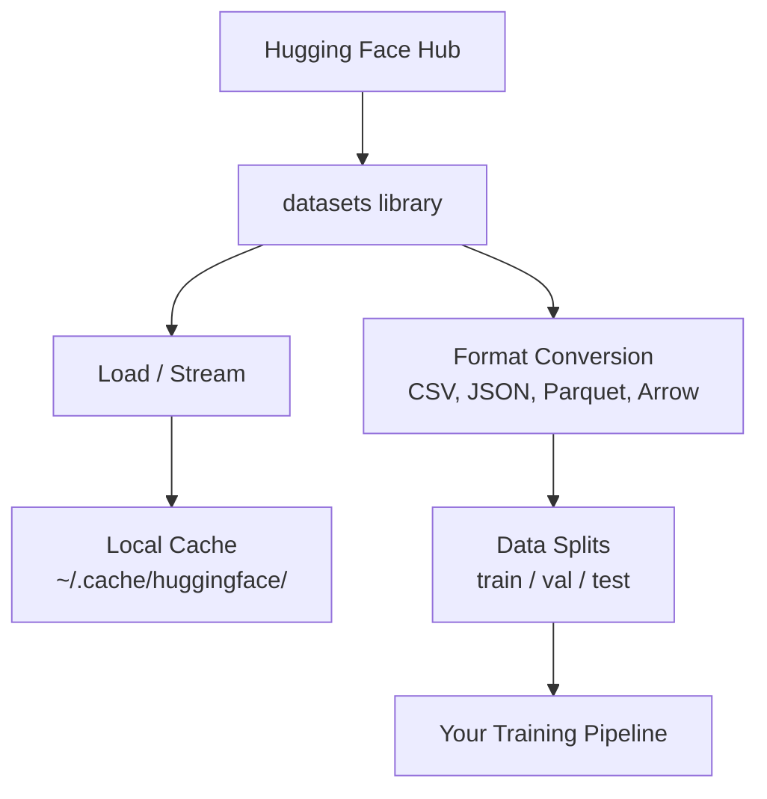

# Manajemen Data

> Data adalah bahan bakarnya. Cara kamu mengelolanya menentukan seberapa cepat kamu melaju.

**Type:** Build
**Language:** Python
**Prerequisites:** Phase 0, Lesson 01
**Waktu:** ~45 menit

## Tujuan Pembelajaran

- Muat, streaming, dan cache dataset menggunakan perpustakaan Hugging Face `datasets`
- Konversi antara format CSV, JSON, Parket, dan Panah dan jelaskan tradeoff
- Buat pemisahan training/validasi/pengujian yang dapat direproduksi dengan benih acak tetap
- Kelola file model dan dataset besar menggunakan `.gitignore`, Git LFS, atau DVC

## Masalah

Setiap proyek AI dimulai dengan data. kamu perlu menemukan dataset, mengunduhnya, mengonversi antar format, membaginya untuk training dan evaluasi, dan membuat versi agar eksperimen dapat direproduksi. Melakukan ini secara manual setiap saat akan lambat dan rawan kesalahan. kamu memerlukan alur kerja yang berulang.

## Konsep



Pustaka Hugging Face `datasets` adalah cara standar untuk memuat data untuk pekerjaan AI. Ini menangani pengunduhan, caching, konversi format, dan streaming langsung.

## Build

### Langkah 1: Instal pustaka dataset

```bash
pip install datasets huggingface_hub
```

### Langkah 2: Muat dataset

```python
from datasets import load_dataset

dataset = load_dataset("imdb")
print(dataset)
print(dataset["train"][0])
```

Ini mengunduh dataset ulasan film IMDB. Setelah pengunduhan pertama, memuat dari cache di `~/.cache/huggingface/datasets/`.

### Langkah 3: Streaming dataset besar

Beberapa dataset terlalu besar untuk muat di disk. Streaming memuatnya baris demi baris tanpa mengunduh keseluruhannya.

```python
dataset = load_dataset("wikimedia/wikipedia", "20220301.en", split="train", streaming=True)

for i, example in enumerate(dataset):
    print(example["title"])
    if i >= 4:
        break
```

Streaming memberi kamu `IterableDataset`. kamu memproses baris saat baris tersebut tiba. Penggunaan memori tetap konstan berapa pun ukuran kumpulan datanya.

### Langkah 4: Format dataset

Pustaka `datasets` menggunakan Apache Arrow. kamu dapat mengonversi ke format lain bergantung pada kebutuhan pipeline kamu.

```python
dataset = load_dataset("imdb", split="train")

dataset.to_csv("imdb_train.csv")
dataset.to_json("imdb_train.json")
dataset.to_parquet("imdb_train.parquet")
```

Perbandingan format:

| Format | Ukuran | Kecepatan Baca | Terbaik Untuk |
|--------|------|-----------|----------|
| CSV | Besar | Lambat | Keterbacaan manusia, spreadsheet |
| JSON | Besar | Lambat | API, data bersarang |
| Parket | Kecil | Cepat | Analisis, kueri kolom |
| Panah | Kecil | Tercepat | Pemrosesan dalam memori (apa yang `datasets` gunakan secara internal) |

Untuk pekerjaan AI, Parket adalah format penyimpanan terbaik. Panah adalah apa yang kamu kerjakan dalam memori. CSV dan JSON ditujukan untuk pertukaran.

### Langkah 5: Pemisahan data

Setiap proyek ML memerlukan tiga pemisahan:

- **Train**: Model belajar dari hal ini (biasanya 80%)
- **Validasi**: kamu memeriksa kemajuan selama training (biasanya 10%)
- **Tes**: Evaluasi akhir setelah training selesai (biasanya 10%)

Beberapa dataset sudah dipecah sebelumnya. Jika tidak, pisahkan sendiri:

```python
dataset = load_dataset("imdb", split="train")

split = dataset.train_test_split(test_size=0.2, seed=42)
train_val = split["train"].train_test_split(test_size=0.125, seed=42)

train_ds = train_val["train"]
val_ds = train_val["test"]
test_ds = split["test"]

print(f"Train: {len(train_ds)}, Val: {len(val_ds)}, Test: {len(test_ds)}")
```

Selalu tetapkan benih untuk reproduktifitas. Benih yang sama menghasilkan belahan yang sama setiap saat.

### Langkah 6: Unduh dan cache model

Model adalah file besar. Pustaka `huggingface_hub` menangani pengunduhan dan penyimpanan cache.

```python
from huggingface_hub import hf_hub_download, snapshot_download

model_path = hf_hub_download(
    repo_id="sentence-transformers/all-MiniLM-L6-v2",
    filename="config.json"
)
print(f"Cached at: {model_path}")

model_dir = snapshot_download("sentence-transformers/all-MiniLM-L6-v2")
print(f"Full model at: {model_dir}")
```

Model di-cache ke `~/.cache/huggingface/hub/`. Setelah diunduh, mereka langsung dimuat pada proses berikutnya.

### Langkah 7: Tangani file besar

Weight model dan dataset besar tidak boleh dimasukkan ke git. Tiga pilihan:

**Opsi A: .gitignore (paling sederhana)**

```
*.bin
*.safetensors
*.pt
*.onnx
data/*.parquet
data/*.csv
models/
```

**Opsi B: Git LFS (melacak file besar di git)**

```bash
git lfs install
git lfs track "*.bin"
git lfs track "*.safetensors"
git add .gitattributes
```

Git LFS menyimpan pointer di repo kamu dan file sebenarnya di server terpisah. GitHub memberi kamu 1 GB gratis.

**Opsi C: DVC (kontrol versi data)**

```bash
pip install dvc
dvc init
dvc add data/training_set.parquet
git add data/training_set.parquet.dvc data/.gitignore
git commit -m "Track training data with DVC"
```DVC membuat file `.dvc` kecil yang mengarah ke data kamu. Datanya sendiri berada di S3, GCS, atau backend penyimpanan distance jauh lainnya.

| Pendekatan | Kompleksitas | Terbaik Untuk |
|----------|-----------|----------|
| .gitignore | Rendah | Proyek pribadi, data yang diunduh dapat kamu ambil kembali |
| Git LFS | Sedang | Tim berbagi weight model melalui git |
| DVC | Tinggi | Eksperimen yang dapat direproduksi, dataset besar, tim |

Untuk kursus ini, `.gitignore` sudah cukup. Gunakan DVC saat kamu perlu mereproduksi eksperimen yang tepat di seluruh mesin.

### Langkah 8: Pola penyimpanan

**Penyimpanan lokal** berfungsi untuk dataset di bawah ~10 GB. Cache HF menangani ini secara otomatis.

**Penyimpanan cloud** ditujukan untuk apa pun yang lebih besar atau digunakan bersama di seluruh mesin:

```python
import os

local_path = os.path.expanduser("~/.cache/huggingface/datasets/")

# s3_path = "s3://my-bucket/datasets/"
# gcs_path = "gs://my-bucket/datasets/"
```

DVC terintegrasi dengan S3 dan GCS secara langsung:

```bash
dvc remote add -d myremote s3://my-bucket/dvc-store
dvc push
```

Untuk kursus ini, penyimpanan lokal sudah cukup. Penyimpanan cloud menjadi relevan saat kamu menyempurnakan instance GPU distance jauh.

## Kumpulan Data yang Digunakan dalam Kursus Ini

| Dataset | Lesson | Ukuran | Apa yang diajarkannya |
|---------|---------|------|----------------|
| IMDB | Tokenization, klasifikasi | 84MB | Dasar-dasar klasifikasi teks |
| Teks Wiki | Pemodelan bahasa | 181MB | Prediksi token berikutnya |
| Pasukan | sistem QA | 35MB | Menjawab pertanyaan, rentang |
| Perayapan Umum (bagian) | Embedding | Bervariasi | Pemrosesan teks skala besar |
| MNIST | Dasar-dasar visi | 21MB | Dasar-dasar klasifikasi gambar |
| COCO (bagian) | Multimoda | Bervariasi | Pasangan gambar-teks |

kamu tidak perlu mengunduh semuanya sekarang. Setiap lesson menentukan apa yang dibutuhkannya.

## Pakai

Jalankan skrip utilitas untuk memverifikasi semuanya berfungsi:

```bash
python code/data_utils.py
```

Ini mengunduh dataset kecil, mengonversinya, membaginya, dan mencetak ringkasan.

## Kirim

Lesson ini menghasilkan:
- `code/data_utils.py` - utilitas pemuatan dan cache data yang dapat digunakan kembali
- `outputs/prompt-data-helper.md` - prompt untuk menemukan dataset yang tepat untuk suatu tugas

## Latihan

1. Muat dataset `glue` dengan konfigurasi `mrpc` dan periksa 5 contoh pertama
2. Streaming dataset `c4` dan hitung berapa banyak contoh yang dapat kamu proses dalam 10 detik
3. Konversikan dataset ke Parket dan bandingkan ukuran file ke CSV
4. Buat pembagian train/val/test 70/15/15 dengan seed tetap dan verifikasi ukurannya

## Istilah Kunci

| Istilah | Apa kata orang | Apa sebenarnya arti |
|------|----------------|----------------------|
| Pemisahan dataset | "Training data" | Subset bernama (train/val/test) yang digunakan pada berbagai tahapan siklus hidup ML |
| Streaming | "Muat dengan malas" | Memproses data baris demi baris dari sumber distance jauh tanpa mengunduh dataset lengkap |
| Parket | "CSV terkompresi" | Format file berbentuk kolom yang dioptimalkan untuk kueri analitis dan efisiensi penyimpanan |
| Panah | "Kerangka data cepat" | Format kolom dalam memori yang digunakan secara internal oleh pustaka dataset untuk pembacaan tanpa salinan |
| Git LFS | "Git untuk file besar" | Ekstensi yang menyimpan file besar di luar repo git sambil menjaga pointer di kontrol versi |
| DVC | "Git untuk data" | Sistem kontrol versi untuk dataset dan model yang terintegrasi dengan penyimpanan cloud |
| Tembolok | "Sudah diunduh" | Salinan lokal dari data yang diambil sebelumnya, disimpan di ~/.cache/huggingface/ secara default |
