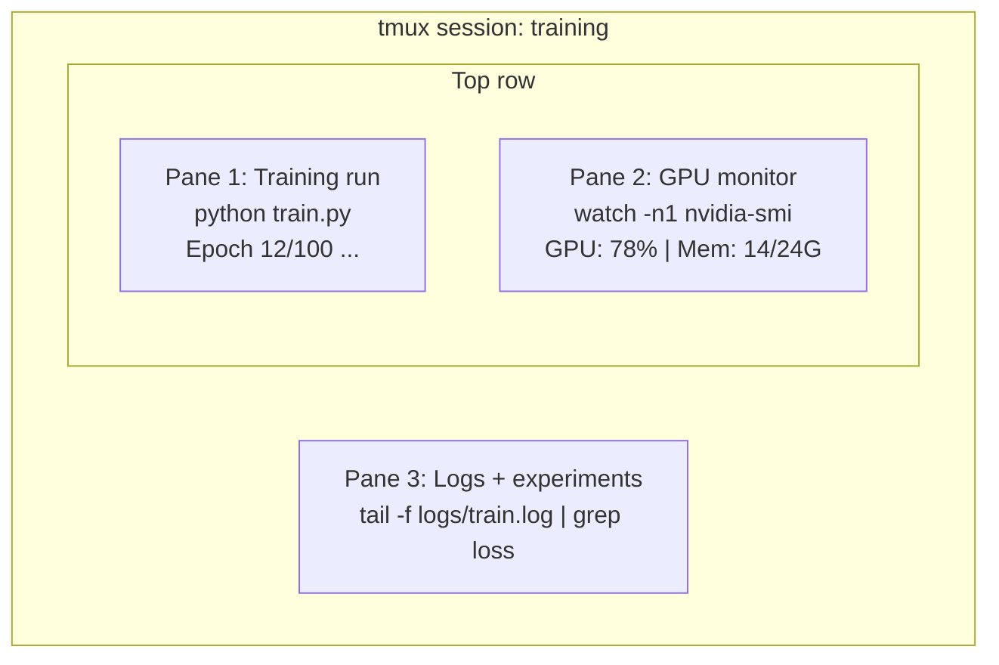

# Terminal & Cangkang

> Terminal adalah tempat tinggal para insinyur AI. Dapatkan kenyamanan di sini.

**Type:** Learn
**Language:** --
**Prerequisites:** Phase 0, Lesson 01
**Waktu:** ~35 menit

## Tujuan Pembelajaran

- Gunakan perpipaan, pengalihan, dan `grep` untuk memfilter dan memproses log training dari baris prompt
- Buat sesi tmux persisten dengan beberapa panel untuk training bersamaan dan pemantauan GPU
- Pantau sumber daya sistem dan GPU dengan `htop`, `nvtop`, dan `nvidia-smi`
- Transfer file antara mesin lokal dan distance jauh menggunakan SSH, `scp`, dan `rsync`

## Masalah

kamu akan menghabiskan lebih banyak waktu di terminal daripada di editor mana pun. Training berjalan, pemantauan GPU, tailing log, sesi SSH distance jauh, manajemen lingkungan. Setiap alur kerja AI menyentuh cangkangnya. Jika kamu lambat di sini, kamu lambat di mana pun.

Lesson ini mencakup keterampilan terminal yang penting untuk pekerjaan AI. Tidak ada sejarah Unix. Tidak perlu mendalami skrip Bash. Hanya apa yang kamu butuhkan.

## Konsep



Tiga hal berjalan sekaligus. Satu terminal. kamu dapat melepas, pulang, memasukkan kembali SSH, dan memasang kembali. Training tetap berjalan.

## Build

### Langkah 1: Kenali cangkang kamu

Periksa shell mana yang kamu jalankan:

```bash
echo $SHELL
```

Sebagian besar sistem menggunakan `bash` atau `zsh`. Keduanya bekerja dengan baik. Prompt dalam kursus ini berfungsi baik.

Hal-hal penting yang perlu diketahui:

```bash
# Move around
cd ~/projects/ai-engineering-from-scratch
pwd
ls -la

# History search (most useful shortcut you'll learn)
# Ctrl+R then type part of a previous command
# Press Ctrl+R again to cycle through matches

# Clear terminal
clear   # or Ctrl+L

# Cancel a running command
# Ctrl+C

# Suspend a running command (resume with fg)
# Ctrl+Z
```

### Langkah 2: Perpipaan dan pengalihan

Perpipaan menghubungkan prompt bersama-sama. Ini adalah cara kamu memproses log, memfilter output, dan alat rantai. kamu akan menggunakannya terus-menerus.

```bash
# Count how many times "loss" appears in a log
cat train.log | grep "loss" | wc -l

# Extract just the loss values from training output
grep "loss:" train.log | awk '{print $NF}' > losses.txt

# Watch a log file update in real time, filtering for errors
tail -f train.log | grep --line-buffered "ERROR"

# Sort experiments by final accuracy
grep "final_accuracy" results/*.log | sort -t= -k2 -n -r

# Redirect stdout and stderr to separate files
python train.py > output.log 2> errors.log

# Redirect both to the same file
python train.py > train_full.log 2>&1
```

Tiga pengalihan yang kamu perlukan:

| Simbol | Apa fungsinya |
|--------|-------------|
| `>` | Tulis stdout ke file (timpa) |
| `>>` | Tambahkan stdout ke file |
| `2>` | Tulis stderr ke file |
| `2>&1` | Kirim stderr ke tempat yang sama dengan stdout |
| `\|` | Kirim stdout dari satu prompt sebagai stdin ke |

### Langkah 3: Proses latar belakang

Latihan berjalan memakan waktu berjam-jam. kamu tidak ingin terminal kamu tetap terbuka sepanjang waktu.

```bash
# Run in background (output still goes to terminal)
python train.py &

# Run in background, immune to hangup (closing terminal won't kill it)
nohup python train.py > train.log 2>&1 &

# Check what's running in background
jobs
ps aux | grep train.py

# Bring a background job to foreground
fg %1

# Kill a background process
kill %1
# or find its PID and kill that
kill $(pgrep -f "train.py")
```

Perbedaan antara `&`, `nohup`, dan `screen`/`tmux`:

| Metode | Terminal selamat dari penutupan? | Bisakah memasang kembali? |
|--------|-------------------------|---------------|
| `command &` | Tidak | Tidak |
| `nohup command &` | Ya | Tidak (periksa file log) |
| `screen` / `tmux` | Ya | Ya |

Untuk waktu yang lebih lama dari beberapa menit, gunakan tmux.

### Langkah 4: tmux

tmux memungkinkan kamu membuat sesi terminal persisten dengan banyak panel. Ini adalah satu-satunya alat yang paling berguna untuk mengelola proses training.

```bash
# Install
# macOS
brew install tmux
# Ubuntu
sudo apt install tmux

# Start a named session
tmux new -s training

# Split horizontally
# Ctrl+B then "

# Split vertically
# Ctrl+B then %

# Navigate between panes
# Ctrl+B then arrow keys

# Detach (session keeps running)
# Ctrl+B then d

# Reattach
tmux attach -t training

# List sessions
tmux ls

# Kill a session
tmux kill-session -t training
```

Sesi alur kerja AI yang khas:

```bash
tmux new -s train

# Pane 1: start training
python train.py --epochs 100 --lr 1e-4

# Ctrl+B, " to split, then run GPU monitor
watch -n1 nvidia-smi

# Ctrl+B, % to split vertically, tail the logs
tail -f logs/experiment.log

# Now detach with Ctrl+B, d
# SSH out, go get coffee, come back
# tmux attach -t train
```

### Langkah 5: Memantau dengan htop dan nvtop

```bash
# System processes (better than top)
htop

# GPU processes (if you have NVIDIA GPU)
# Install: sudo apt install nvtop (Ubuntu) or brew install nvtop (macOS)
nvtop

# Quick GPU check without nvtop
nvidia-smi

# Watch GPU usage update every second
watch -n1 nvidia-smi

# See which processes are using the GPU
nvidia-smi --query-compute-apps=pid,name,used_memory --format=csv
```

`htop` pengikatan kunci yang akan kamu gunakan:
- `F6` atau `>` untuk mengurutkan berdasarkan kolom (urutkan berdasarkan memori untuk menemukan kebocoran memori)
- `F5` untuk beralih tampilan pohon (lihat proses anak)
- `F9` untuk menghentikan suatu proses
- `/` untuk mencari nama proses

### Langkah 6: SSH untuk kotak GPU distance jauh

Saat kamu menyewa GPU cloud (Lambda, RunPod, Vast.ai), kamu terhubung melalui SSH.

```bash
# Basic connection
ssh user@gpu-box-ip

# With a specific key
ssh -i ~/.ssh/my_gpu_key user@gpu-box-ip

# Copy files to remote
scp model.pt user@gpu-box-ip:~/models/

# Copy files from remote
scp user@gpu-box-ip:~/results/metrics.json ./

# Sync a whole directory (faster for many files)
rsync -avz ./data/ user@gpu-box-ip:~/data/

# Port forward (access remote Jupyter/TensorBoard locally)
ssh -L 8888:localhost:8888 user@gpu-box-ip
# Now open localhost:8888 in your browser

# SSH config for convenience
# Add to ~/.ssh/config:
# Host gpu
#     HostName 192.168.1.100
#     User ubuntu
#     IdentityFile ~/.ssh/gpu_key
#
# Then just:
# ssh gpu
```

### Langkah 7: Alias ​​berguna untuk pekerjaan AI

Tambahkan ini ke `~/.bashrc` atau `~/.zshrc` kamu:```bash
source phases/00-setup-and-tooling/10-terminal-and-shell/code/shell_aliases.sh
```

Atau salin yang kamu inginkan. Alias ​​kuncinya:

```bash
# GPU status at a glance
alias gpu='nvidia-smi --query-gpu=index,name,utilization.gpu,memory.used,memory.total,temperature.gpu --format=csv,noheader'

# Kill all Python training processes
alias killtraining='pkill -f "python.*train"'

# Quick virtual environment activate
alias ae='source .venv/bin/activate'

# Watch training loss
alias watchloss='tail -f logs/*.log | grep --line-buffered "loss"'
```

Lihat `code/shell_aliases.sh` untuk set lengkapnya.

### Langkah 8: Pola terminal AI yang umum

Ini muncul berulang kali dalam praktiknya:

```bash
# Run training, log everything, notify when done
python train.py 2>&1 | tee train.log; echo "DONE" | mail -s "Training complete" you@email.com

# Compare two experiment logs side by side
diff <(grep "accuracy" exp1.log) <(grep "accuracy" exp2.log)

# Find the largest model files (clean up disk space)
find . -name "*.pt" -o -name "*.safetensors" | xargs du -h | sort -rh | head -20

# Download a model from Hugging Face
wget https://huggingface.co/model/resolve/main/model.safetensors

# Untar a dataset
tar xzf dataset.tar.gz -C ./data/

# Count lines in all Python files (see how big your project is)
find . -name "*.py" | xargs wc -l | tail -1

# Check disk space (training data fills disks fast)
df -h
du -sh ./data/*

# Environment variable check before training
env | grep -i cuda
env | grep -i torch
```

## Pakai

Inilah saatnya setiap alat berperan selama kursus ini:

| Alat | Saat kamu menggunakannya |
|------|----------------|
| tmux | Setiap latihan dijalankan (Fase 3+) |
| `tail -f` + `grep` | Memantau log training |
| `nohup` / `&` | Tugas latar belakang cepat |
| `htop` / `nvtop` | Men-debug training lambat, kesalahan OOM |
| SSH + `rsync` | Bekerja pada GPU cloud |
| Perpipaan + pengalihan | Mengolah hasil percobaan |
| Alias ​​​​| Menghemat waktu pada prompt berulang |

## Latihan

1. Instal tmux, buat sesi dengan tiga panel, dan jalankan `htop` di satu panel, `watch -n1 date` di panel lain, dan skrip Python di panel ketiga. Lepaskan dan pasang kembali.
2. Tambahkan alias dari `code/shell_aliases.sh` ke konfigurasi shell kamu dan muat ulang dengan `source ~/.zshrc` (atau `~/.bashrc`).
3. Buat log training palsu dengan `for i in $(seq 1 100); do echo "epoch $i loss: $(echo "scale=4; 1/$i" | bc)"; sleep 0.1; done > fake_train.log` lalu gunakan `grep`, `tail`, dan `awk` untuk mengekstrak nilai loss saja.
4. Siapkan entri konfigurasi SSH untuk server yang dapat kamu akses (atau gunakan `localhost` untuk mempraktikkan sintaksisnya).

## Istilah Kunci

| Istilah | Apa kata orang | Apa sebenarnya arti |
|------|----------------|----------------------|
| cangkang | "Terminal" | Program yang menafsirkan prompt kamu (bash, zsh, fish) |
| tmux | "Terminal multiplekser" | Sebuah program yang memungkinkan kamu menjalankan beberapa sesi terminal dalam satu jendela, dan melepaskan/memasang kembali |
| Pipa | "Masalah bar" | Operator `\|` yang mengirimkan output suatu prompt sebagai input ke prompt lainnya |
| PID | "ID Proses" | Nomor unik yang ditetapkan untuk setiap proses yang berjalan, digunakan untuk memantau atau mematikannya |
| tidak apa | "Tidak ada telepon" | Menjalankan prompt yang kebal terhadap sinyal hangup, jadi menutup terminal tidak akan mematikannya |
| SSH | "Menghubungkan ke server" | Secure Shell, protokol terenkripsi untuk menjalankan prompt pada mesin distance jauh |
