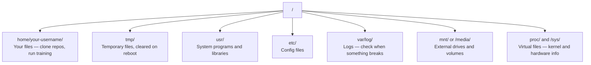

# Linux untuk AI

> Kebanyakan AI berjalan di Linux. kamu perlu cukup tahu agar tidak terjebak.

**Type:** Learn
**Language:** --
**Prerequisites:** Phase 0, Lesson 01
**Waktu:** ~30 menit

## Tujuan Pembelajaran

- Navigasikan sistem file Linux dan lakukan operasi file penting dari baris prompt
- Kelola izin file dengan `chmod` dan `chown` untuk mengatasi kesalahan "Izin ditolak"
- Instal paket sistem dengan `apt` dan siapkan kotak GPU baru untuk pekerjaan AI
- Identifikasi perbedaan macOS-ke-Linux yang biasanya membuat pengembang tersandung saat bekerja pada mesin distance jauh

## Masalah

kamu mengembangkan di macOS atau Windows. Namun saat kamu melakukan SSH ke dalam kotak GPU cloud, menyewa instans Lambda, atau menjalankan mesin EC2, kamu akan mendarat di Ubuntu. Terminal adalah satu-satunya antarmuka kamu. Tidak ada Finder, tidak ada Explorer, tidak ada GUI. Jika kamu tidak dapat menavigasi sistem file, menginstal paket, dan mengelola proses dari baris prompt, kamu terjebak membayar jam kerja GPU yang menganggur sambil mencari di Google "cara mengekstrak file di Linux."

Ini adalah panduan bertahan hidup. Ini mencakup apa yang kamu butuhkan untuk mengoperasikan mesin Linux distance jauh untuk pekerjaan AI. Tidak lebih.

## Tata Letak Sistem File

Linux mengatur semuanya di bawah satu root `/`. Tidak ada `C:\` atau `/Volumes`. Direktori yang akan kamu sentuh:



Direktori beranda kamu adalah `~` atau `/home/your-username`. Hampir semua yang kamu lakukan terjadi di sini.

## Prompt Penting

Ini adalah 15 prompt yang mencakup 95% dari apa yang akan kamu lakukan pada kotak GPU distance jauh.

### Bergerak

```bash
pwd                         # Where am I?
ls                          # What's here?
ls -la                      # What's here, including hidden files with details?
cd /path/to/dir             # Go there
cd ~                        # Go home
cd ..                       # Go up one level
```

### File dan Direktori

```bash
mkdir my-project            # Create a directory
mkdir -p a/b/c              # Create nested directories in one shot

cp file.txt backup.txt      # Copy a file
cp -r src/ src-backup/      # Copy a directory (recursive)

mv old.txt new.txt          # Rename a file
mv file.txt /tmp/           # Move a file

rm file.txt                 # Delete a file (no trash, it's gone)
rm -rf my-dir/              # Delete a directory and everything inside
```

`rm -rf` bersifat permanen. Tidak ada pembatalan. Periksa kembali jalurnya sebelum menekan enter.

### Membaca File

```bash
cat file.txt                # Print entire file
head -20 file.txt           # First 20 lines
tail -20 file.txt           # Last 20 lines
tail -f log.txt             # Follow a log file in real time (Ctrl+C to stop)
less file.txt               # Scroll through a file (q to quit)
```

### Mencari

```bash
grep "error" training.log           # Find lines containing "error"
grep -r "learning_rate" .           # Search all files in current directory
grep -i "cuda" config.yaml          # Case-insensitive search

find . -name "*.py"                 # Find all Python files under current dir
find . -name "*.ckpt" -size +1G     # Find checkpoint files larger than 1GB
```

## Izin

Setiap file di Linux memiliki bit pemilik dan izin. kamu akan mengalami hal ini ketika skrip tidak dapat dijalankan atau kamu tidak dapat menulis ke direktori.

```bash
ls -l train.py
# -rwxr-xr-- 1 user group 2048 Mar 19 10:00 train.py
#  ^^^             owner permissions: read, write, execute
#     ^^^          group permissions: read, execute
#        ^^        everyone else: read only
```

Perbaikan umum:

```bash
chmod +x train.sh           # Make a script executable
chmod 755 deploy.sh         # Owner: full, others: read+execute
chmod 644 config.yaml       # Owner: read+write, others: read only

chown user:group file.txt   # Change who owns a file (needs sudo)
```

Ketika ada pesan "Izin ditolak", itu hampir selalu merupakan masalah izin. `chmod +x` atau `sudo` akan memperbaiki sebagian besar kasus.

## Manajemen Paket (apt)

Ubuntu menggunakan `apt`. Ini adalah cara kamu menginstal perangkat lunak tingkat sistem.

```bash
sudo apt update             # Refresh the package list (always do this first)
sudo apt install -y htop    # Install a package (-y skips confirmation)
sudo apt install -y build-essential  # C compiler, make, etc. Needed by many Python packages
sudo apt install -y tmux    # Terminal multiplexer (keep sessions alive after disconnect)

apt list --installed        # What's installed?
sudo apt remove htop        # Uninstall
```

Paket umum yang akan kamu instal pada kotak GPU baru:

```bash
sudo apt update && sudo apt install -y \
    build-essential \
    git \
    curl \
    wget \
    tmux \
    htop \
    unzip \
    python3-venv
```

## Pengguna dan sudo

kamu biasanya masuk sebagai pengguna biasa. Beberapa operasi memerlukan akses root (admin).

```bash
whoami                      # What user am I?
sudo command                # Run a single command as root
sudo su                     # Become root (exit to go back, use sparingly)
```

Pada instans GPU cloud, biasanya kamu adalah satu-satunya pengguna dan sudah memiliki akses sudo. Jangan jalankan semuanya sebagai root. Gunakan sudo hanya jika diperlukan.

## Proses dan sistemd

Saat training kamu terhenti, atau kamu perlu memeriksa apa yang sedang berjalan:

```bash
htop                        # Interactive process viewer (q to quit)
ps aux | grep python        # Find running Python processes
kill 12345                  # Gracefully stop process with PID 12345
kill -9 12345               # Force kill (use when graceful doesn't work)
nvidia-smi                  # GPU processes and memory usage
```

systemd mengelola layanan (daemon latar belakang). kamu akan menggunakannya jika kamu menjalankan server inference:

```bash
sudo systemctl start nginx          # Start a service
sudo systemctl stop nginx           # Stop it
sudo systemctl restart nginx        # Restart it
sudo systemctl status nginx         # Check if it's running
sudo systemctl enable nginx         # Start automatically on boot
```

## Ruang Disk

Kotak GPU seringkali memiliki ruang disk yang terbatas. Model dan dataset mengisinya dengan cepat.

```bash
df -h                       # Disk usage for all mounted drives
df -h /home                 # Disk usage for /home specifically

du -sh *                    # Size of each item in current directory
du -sh ~/.cache             # Size of your cache (pip, huggingface models land here)
du -sh /data/checkpoints/   # Check how big your checkpoints are

# Find the biggest space hogs
du -h --max-depth=1 / 2>/dev/null | sort -hr | head -20
```

Penghemat ruang umum:

```bash
# Clear pip cache
pip cache purge

# Clear apt cache
sudo apt clean

# Remove old checkpoints you don't need
rm -rf checkpoints/epoch_01/ checkpoints/epoch_02/
```

## Jaringan

kamu akan mengunduh model, mentransfer file, dan menggunakan API dari baris prompt.

```bash
# Download files
wget https://example.com/model.bin                   # Download a file
curl -O https://example.com/data.tar.gz              # Same thing with curl
curl -s https://api.example.com/health | python3 -m json.tool  # Hit an API, pretty-print JSON

# Transfer files between machines
scp model.bin user@remote:/data/                     # Copy file to remote machine
scp user@remote:/data/results.csv .                  # Copy file from remote to local
scp -r user@remote:/data/checkpoints/ ./local-dir/   # Copy directory

# Sync directories (faster than scp for large transfers, resumes on failure)
rsync -avz --progress ./data/ user@remote:/data/
rsync -avz --progress user@remote:/results/ ./results/
```

Gunakan `rsync` di atas `scp` untuk apa pun yang berukuran besar. Itu hanya mentransfer byte yang diubah dan menangani koneksi yang terputus.

## tmux: Jaga Sesi Tetap Hidup

Saat kamu melakukan SSH ke dalam kotak distance jauh, menutup laptop kamu akan menghentikan proses training kamu. tmux mencegah hal ini.```bash
tmux new -s train           # Start a new session named "train"
# ... start your training, then:
# Ctrl+B, then D            # Detach (training keeps running)

tmux ls                     # List sessions
tmux attach -t train        # Reattach to session

# Inside tmux:
# Ctrl+B, then %            # Split pane vertically
# Ctrl+B, then "            # Split pane horizontally
# Ctrl+B, then arrow keys   # Switch between panes
```

Selalu jalankan pekerjaan training panjang di dalam tmux. Selalu.

## WSL2 untuk Pengguna Windows

Jika kamu menggunakan Windows, WSL2 memberi kamu lingkungan Linux nyata tanpa dual-boot.

```bash
# In PowerShell (admin)
wsl --install -d Ubuntu-24.04

# After restart, open Ubuntu from Start menu
sudo apt update && sudo apt upgrade -y
```

WSL2 menjalankan kernel Linux asli. Segala sesuatu dalam lesson ini bekerja di dalamnya. File Windows kamu ada di `/mnt/c/Users/YourName/` dari dalam WSL.

Passthrough GPU berfungsi dengan driver NVIDIA yang diinstal di sisi Windows. Instal driver Windows NVIDIA (bukan Linux), dan CUDA akan tersedia di dalam WSL2.

## Gotcha: macOS ke Linux

Hal-hal yang akan membuat kamu tersandung jika kamu menggunakan macOS:

| macOS | Linux | Catatan |
|-------|-------|-------|
| `brew install` | `sudo apt install` | Terkadang nama paket berbeda. `brew install htop` vs `sudo apt install htop` berfungsi sama, tetapi `brew install readline` vs `sudo apt install libreadline-dev` tidak. |
| `open file.txt` | `xdg-open file.txt` | Namun kamu tidak akan memiliki GUI di kotak distance jauh. Gunakan `cat` atau `less`. |
| `pbcopy` / `pbpaste` | Tidak tersedia | Pipa ke/dari clipboard tidak ada melalui SSH. |
| `~/.zshrc` | `~/.bashrc` | macOS defaultnya adalah zsh. Sebagian besar server Linux menggunakan bash. |
| `/opt/homebrew/` | `/usr/bin/`, `/usr/local/bin/` | Biner tinggal di tempat yang berbeda. |
| `sed -i '' 's/a/b/' file` | `sed -i 's/a/b/' file` | macOS sed memerlukan string kosong setelah `-i`. Linux tidak. |
| Sistem file tidak peka huruf besar/kecil | Sistem file peka huruf besar/kecil | `Model.py` dan `model.py` adalah dua file berbeda di Linux. |
| Akhiran baris `\n` | Akhir baris `\n` | Sama. Namun Windows menggunakan `\r\n`, yang merusak skrip bash. Jalankan `dos2unix` untuk memperbaikinya. |

## Kartu Referensi Cepat

```
Navigation:     pwd, ls, cd, find
Files:          cp, mv, rm, mkdir, cat, head, tail, less
Search:         grep, find
Permissions:    chmod, chown, sudo
Packages:       apt update, apt install
Processes:      htop, ps, kill, nvidia-smi
Services:       systemctl start/stop/restart/status
Disk:           df -h, du -sh
Network:        curl, wget, scp, rsync
Sessions:       tmux new/attach/detach
```

## Latihan

1. SSH ke mesin Linux mana pun (atau buka WSL2) dan navigasikan ke direktori home kamu. Buat folder proyek, buat tiga file kosong di dalamnya dengan `touch`, lalu daftarkan dengan `ls -la`.
2. Instal `htop` dengan apt, jalankan, dan identifikasi proses mana yang menggunakan memori paling banyak.
3. Mulai sesi tmux, jalankan `sleep 300` di dalamnya, lepaskan, daftarkan sesi, dan pasang kembali.
4. Gunakan `df -h` untuk memeriksa ruang disk yang tersedia, lalu gunakan `du -sh ~/.cache/*` untuk menemukan apa yang menghabiskan ruang di cache kamu.
5. Transfer file dari mesin lokal kamu ke mesin distance jauh menggunakan `scp`, lalu lakukan transfer yang sama dengan `rsync` dan bandingkan pengalamannya.
