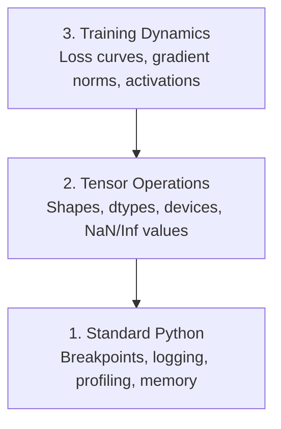

# Debugging dan Pembuatan Profil

> Bug AI terburuk tidak mogok. Mereka diam-diam berlatih tentang sampah dan melaporkan kurva loss yang indah.

**Type:** Build
**Language:** Python
**Prerequisites:** Lesson 1 (Lingkungan Pengembang), pemahaman dasar PyTorch
**Waktu:** ~60 menit

## Tujuan Pembelajaran

- Gunakan kondisional `breakpoint()` dan `debug_print` untuk memeriksa bentuk tensor, tipe d, dan nilai NaN di tengah training
- Profil loop training dengan `cProfile`, `line_profiler`, dan `tracemalloc` untuk menemukan hambatan
- Deteksi bug AI yang umum: ketidakcocokan bentuk, kehilangan NaN, kebocoran data, dan tensor perangkat yang salah
- Siapkan TensorBoard untuk memvisualisasikan kurva loss, histogram weight, dan distribusi gradient

## Masalah

Code AI gagal secara berbeda dari code biasa. Aplikasi web mengalami crash dengan pelacakan tumpukan. Loop training yang salah dikonfigurasi berjalan selama 8 jam, menghabiskan $200 waktu GPU, dan menghasilkan model yang memprediksi rata-rata setiap input. Code tidak pernah salah. Bugnya adalah tensor pada perangkat yang salah, `.detach()` yang terlupakan, atau label yang bocor ke dalam feature.

kamu memerlukan alat debugging yang menangkap kegagalan diam-diam ini sebelum membuang waktu dan komputasi kamu.

## Konsep

Debugging AI beroperasi pada tiga level:



Kebanyakan orang langsung melompat ke level 3 (menatap TensorBoard). Namun 80% bug AI hidup di level 1 dan 2.

## Build

### Bagian 1: Debugging Cetak (Ya, Berhasil)

Proses debug pencetakan dihentikan. Seharusnya tidak. Untuk code tensor, pernyataan cetak yang ditargetkan lebih baik daripada melakukan debugger karena kamu perlu melihat bentuk, tipe, dan rentang nilai sekaligus.

```python
def debug_print(name, tensor):
    print(f"{name}: shape={tensor.shape}, dtype={tensor.dtype}, "
          f"device={tensor.device}, "
          f"min={tensor.min().item():.4f}, max={tensor.max().item():.4f}, "
          f"mean={tensor.mean().item():.4f}, "
          f"has_nan={tensor.isnan().any().item()}")
```

Sebut ini setelah setiap operasi yang mencurigakan. Jika bug ditemukan, hapus cetakannya. Sederhana.

### Bagian 2: Python Debugger (pdb dan breakpoint)

Debugger bawaan diremehkan untuk pekerjaan AI. Masukkan `breakpoint()` ke loop training kamu dan periksa tensor secara interaktif.

```python
def training_step(model, batch, criterion, optimizer):
    inputs, labels = batch
    outputs = model(inputs)
    loss = criterion(outputs, labels)

    if loss.item() > 100 or torch.isnan(loss):
        breakpoint()

    loss.backward()
    optimizer.step()
```

Saat debugger memasukkan kamu, prompt yang berguna:

- `p outputs.shape` untuk memeriksa bentuk
- `p loss.item()` untuk melihat nilai loss
- `p torch.isnan(outputs).sum()` untuk menghitung NaN
- `p model.fc1.weight.grad` untuk memeriksa gradient
- `c` untuk melanjutkan, `q` untuk keluar

Ini adalah debugging bersyarat. kamu hanya berhenti ketika ada sesuatu yang salah. Untuk training 10.000 langkah, itu penting.

### Bagian 3: Pencatatan Python

Ganti pernyataan cetak dengan logging ketika proses debug kamu lebih dari sekadar pemeriksaan cepat.

```python
import logging

logging.basicConfig(
    level=logging.INFO,
    format="%(asctime)s [%(levelname)s] %(message)s",
    handlers=[
        logging.FileHandler("training.log"),
        logging.StreamHandler()
    ]
)
logger = logging.getLogger(__name__)

logger.info("Starting training: lr=%.4f, batch_size=%d", lr, batch_size)
logger.warning("Loss spike detected: %.4f at step %d", loss.item(), step)
logger.error("NaN loss at step %d, stopping", step)
```

Logging memberi kamu stempel waktu, tingkat keparahan, dan output file. Ketika proses training gagal pada jam 3 pagi, kamu menginginkan file log, bukan output terminal yang keluar dari layar.

### Bagian 4: Bagian Code Waktu

Mengetahui ke mana perginya waktu adalah langkah pertama menuju optimization.

```python
import time

class Timer:
    def __init__(self, name=""):
        self.name = name

    def __enter__(self):
        self.start = time.perf_counter()
        return self

    def __exit__(self, *args):
        elapsed = time.perf_counter() - self.start
        print(f"[{self.name}] {elapsed:.4f}s")

with Timer("data loading"):
    batch = next(dataloader_iter)

with Timer("forward pass"):
    outputs = model(batch)

with Timer("backward pass"):
    loss.backward()
```

Temuan umum: pemuatan data membutuhkan 60% waktu training. Perbaikannya adalah `num_workers > 0` di DataLoader kamu, bukan GPU yang lebih cepat.

### Bagian 5: cProfile dan line_profiler

Saat kamu membutuhkan lebih dari sekadar pengatur waktu manual:

```bash
python -m cProfile -s cumtime train.py
```

Ini menunjukkan setiap pemanggilan fungsi yang diurutkan berdasarkan waktu kumulatif. Untuk pembuatan profil baris demi baris:

```bash
pip install line_profiler
```

```python
@profile
def train_step(model, data, target):
    output = model(data)
    loss = F.cross_entropy(output, target)
    loss.backward()
    return loss

# Run with: kernprof -l -v train.py
```

### Bagian 6: Pembuatan Profil Memori

#### Memori CPU dengan tracemalloc

```python
import tracemalloc

tracemalloc.start()

# your code here
model = build_model()
data = load_dataset()

snapshot = tracemalloc.take_snapshot()
top_stats = snapshot.statistics("lineno")
for stat in top_stats[:10]:
    print(stat)
```

#### Memori CPU dengan memory_profiler

```bash
pip install memory_profiler
```

```python
from memory_profiler import profile

@profile
def load_data():
    raw = read_csv("data.csv")       # watch memory jump here
    processed = preprocess(raw)       # and here
    return processed
```

Jalankan dengan `python -m memory_profiler your_script.py` untuk melihat penggunaan memori baris demi baris.

#### Memori GPU dengan PyTorch

```python
import torch

if torch.cuda.is_available():
    print(torch.cuda.memory_summary())

    print(f"Allocated: {torch.cuda.memory_allocated() / 1e9:.2f} GB")
    print(f"Cached: {torch.cuda.memory_reserved() / 1e9:.2f} GB")
```

Saat kamu menekan OOM (Kehabisan Memori):1. Kurangi ukuran batch (hal pertama yang harus dicoba, selalu)
2. Gunakan `torch.cuda.empty_cache()` untuk mengosongkan memori cache
3. Gunakan `del tensor` diikuti dengan `torch.cuda.empty_cache()` untuk perantara berukuran besar
4. Gunakan presisi campuran (`torch.cuda.amp`) untuk mengurangi separuh penggunaan memori
5. Gunakan pos pemeriksaan gradient untuk model yang sangat dalam

### Bagian 7: Bug AI yang Umum dan Cara Menangkapnya

#### Bentuk Tidak Cocok

Bug yang paling sering terjadi. Tensor memiliki bentuk `[batch, features]` ketika model mengharapkan `[batch, channels, height, width]`.

```python
def check_shapes(model, sample_input):
    print(f"Input: {sample_input.shape}")
    hooks = []

    def make_hook(name):
        def hook(module, inp, out):
            in_shape = inp[0].shape if isinstance(inp, tuple) else inp.shape
            out_shape = out.shape if hasattr(out, "shape") else type(out)
            print(f"  {name}: {in_shape} -> {out_shape}")
        return hook

    for name, module in model.named_modules():
        hooks.append(module.register_forward_hook(make_hook(name)))

    with torch.no_grad():
        model(sample_input)

    for h in hooks:
        h.remove()
```

Jalankan ini sekali dengan kumpulan sample. Ini memetakan setiap transformasi bentuk dalam model kamu.

#### NaN Loss

Kehilangan NaN berarti sesuatu meledak. Penyebab umum:

- Learning rate terlalu tinggi
- Pembagian dengan nol dalam loss adat
- Log angka nol atau negatif
- Meledaknya gradient di RNN

```python
def detect_nan(model, loss, step):
    if torch.isnan(loss):
        print(f"NaN loss at step {step}")
        for name, param in model.named_parameters():
            if param.grad is not None:
                if torch.isnan(param.grad).any():
                    print(f"  NaN gradient in {name}")
                if torch.isinf(param.grad).any():
                    print(f"  Inf gradient in {name}")
        return True
    return False
```

#### Kebocoran Data

Model kamu mendapatkan akurasi 99% pada set pengujian. Kedengarannya bagus. Ini adalah bug.

```python
def check_data_leakage(train_set, test_set, id_column="id"):
    train_ids = set(train_set[id_column].tolist())
    test_ids = set(test_set[id_column].tolist())
    overlap = train_ids & test_ids
    if overlap:
        print(f"DATA LEAKAGE: {len(overlap)} samples in both train and test")
        return True
    return False
```

Periksa juga kebocoran temporal: menggunakan data masa depan untuk memprediksi masa lalu. Urutkan berdasarkan stempel waktu sebelum memisahkan.

#### Perangkat Salah

Tensor pada perangkat berbeda (CPU vs GPU) menyebabkan error runtime. Namun terkadang tensor diam-diam tetap berada di CPU sementara yang lainnya ada di GPU, dan training berjalan lambat.

```python
def check_devices(model, *tensors):
    model_device = next(model.parameters()).device
    print(f"Model device: {model_device}")
    for i, t in enumerate(tensors):
        if t.device != model_device:
            print(f"  WARNING: tensor {i} on {t.device}, model on {model_device}")
```

### Bagian 8: Dasar-dasar TensorBoard

TensorBoard menunjukkan kepada kamu apa yang terjadi di dalam training seiring waktu.

```bash
pip install tensorboard
```

```python
from torch.utils.tensorboard import SummaryWriter

writer = SummaryWriter("runs/experiment_1")

for step in range(num_steps):
    loss = train_step(model, batch)

    writer.add_scalar("loss/train", loss.item(), step)
    writer.add_scalar("lr", optimizer.param_groups[0]["lr"], step)

    if step % 100 == 0:
        for name, param in model.named_parameters():
            writer.add_histogram(f"weights/{name}", param, step)
            if param.grad is not None:
                writer.add_histogram(f"grads/{name}", param.grad, step)

writer.close()
```

Luncurkan:

```bash
tensorboard --logdir=runs
```

Apa yang harus dicari:

- **Loss tidak berkurang**: Learning rate terlalu rendah, atau masalah arsitektur model
- **Loss berosilasi liar**: Learning rate terlalu tinggi
- **Loss terjadi pada NaN**: Ketidakstabilan numerik (lihat bagian NaN di atas)
- **Loss kereta berkurang, loss val meningkat**: Overfitting
- **Histogram weight menyusut ke nol**: Gradient menghilang
- **Histogram gradient meledak**: Perlu pemotongan gradient

### Bagian 9: Debugger VS Code

Untuk proses debug interaktif, konfigurasikan VS Code dengan `launch.json`:

```json
{
    "version": "0.2.0",
    "configurations": [
        {
            "name": "Debug Training",
            "type": "debugpy",
            "request": "launch",
            "program": "${file}",
            "console": "integratedTerminal",
            "justMyCode": false
        }
    ]
}
```

Tetapkan breakpoint dengan mengklik selokan. Gunakan panel Variabel untuk memeriksa properti tensor. Konsol Debug memungkinkan kamu menjalankan ekspresi Python arbitrer di tengah eksekusi.

Berguna untuk menelusuri alur preprocessing data di mana kamu ingin melihat setiap transformasi.

## Pakai

Berikut alur kerja debugging yang menangkap sebagian besar bug AI:

1. **Sebelum training**: Jalankan `check_shapes` dengan kumpulan sample. Verifikasi dimension input dan output sesuai harapan.
2. **10 langkah pertama**: Gunakan `debug_print` pada loss, output, dan gradient. Konfirmasikan tidak ada yang merupakan NaN dan nilainya berada dalam rentang yang wajar.
3. **Selama training**: Kehilangan log, learning rate, dan norm gradient. Gunakan TensorBoard untuk visualisasi.
4. **Bila ada yang rusak**: Jatuhkan `breakpoint()` pada titik kegagalan. Periksa tensor secara interaktif.
5. **Untuk performa**: Atur waktu pemuatan data vs maju vs mundur. Memori profil jika kamu berada di dekat OOM.

## Kirim

Jalankan skrip toolkit debugging:

```bash
python phases/00-setup-and-tooling/12-debugging-and-profiling/code/debug_tools.py
```

Lihat `outputs/prompt-debug-ai-code.md` untuk prompt yang membantu mendiagnosis bug khusus AI.

## Latihan1. Jalankan `debug_tools.py` dan baca output setiap bagian. Ubah model dummy untuk memperkenalkan NaN (petunjuk: bagi dengan nol pada forward pass) dan lihat detektor menangkapnya.
2. Buat profil loop training dengan `cProfile` dan identifikasi fungsi paling lambat.
3. Gunakan `tracemalloc` untuk menemukan baris mana dalam pipa pemuatan data kamu yang mengalokasikan memori paling banyak.
4. Siapkan TensorBoard untuk menjalankan training sederhana dan identifikasi apakah model mengalami overfitting.
5. Gunakan `breakpoint()` di dalam loop training. Berlatihlah memeriksa bentuk tensor, perangkat, dan nilai gradient dari prompt debugger.
