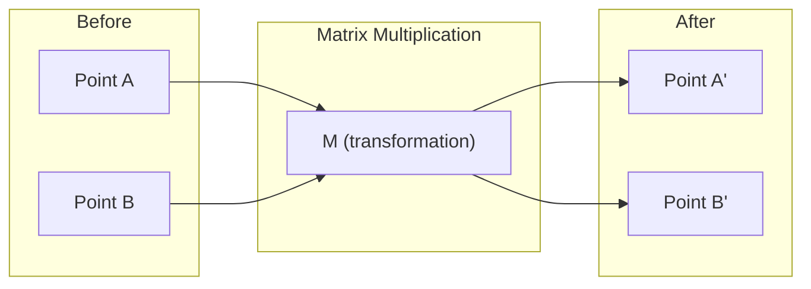
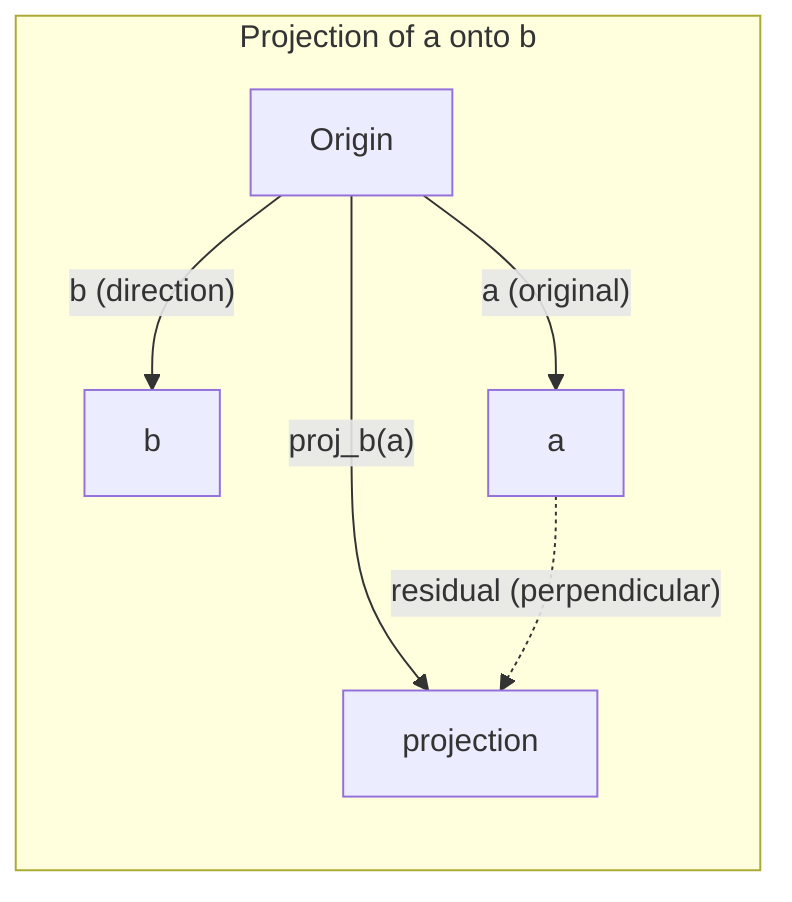

# Intuisi Linear Algebra

> Setiap model AI hanyalah matematika matrix yang mengenakan topi mewah.

**Type:** Learn
**Language:** Python, Julia
**Prerequisites:** Phase 0
**Waktu:** ~60 menit

## Tujuan Pembelajaran

- Menerapkan operasi vector dan matrix (penjumlahan, perkalian titik, perkalian matrix) dari awal dengan Python
- Jelaskan secara geometris apa fungsi perkalian titik, proyeksi, dan proses Gram-Schmidt
- Menentukan kemandirian linier, pangkat, dan basis suatu himpunan vector dengan menggunakan reduksi baris
- Hubungkan konsep aljabar linier ke aplikasi AI mereka: embedding, skor attention, dan LoRA

## Masalah

Buka kertas ML apa saja. Di halaman pertama, kamu akan melihat vector, matrix, perkalian titik, dan transformasi. Tanpa intuisi aljabar linier, ini hanyalah simbol. Dengan itu, kamu dapat melihat apa yang sebenarnya dilakukan neural network -- memindahkan titik-titik di ruang angkasa.

kamu tidak perlu menjadi ahli matematika. kamu perlu melihat arti operasi ini secara geometris, lalu membuat kodenya sendiri.

## Konsep

### Vector Adalah Titik (dan Arah)

Vector hanyalah daftar angka. Namun angka-angka tersebut memiliki arti tersendiri -- yaitu koordinat di ruang angkasa.

**Vector 2D [3, 2]:**

| x | kamu | Titik |
|---|---|-------|
| 3 | 2 | Titik vector dari titik asal (0,0) sampai (3, 2) pada bidang |

Vector mempunyai besar persegi(3^2 + 2^2) = persegi(13) dan mengarah ke atas dan ke kanan.

Di AI, vector mewakili segalanya:
- Sebuah kata → vector angka 768 ("artinya" dalam ruang embedding)
- Gambar → vector jutaan nilai piksel
- Pengguna → vector preferensi

### Matrix Adalah Transformasi

Sebuah matrix mengubah satu vector menjadi vector lainnya. Itu dapat memutar, menskalakan, meregangkan, atau memproyeksikan.



Dalam AI, matrix ADALAH modelnya:
- Weight neural network → matrix yang mengubah input menjadi output
- Skor attention → matrix yang memutuskan apa yang menjadi fokus
- Embedding → matrix yang memetakan kata ke vector

### Produk Titik Mengukur Kesamaan

Perkalian titik dua vector menunjukkan seberapa mirip keduanya.

```
a · b = a₁×b₁ + a₂×b₂ + ... + aₙ×bₙ

Same direction:      a · b > 0  (similar)
Perpendicular:       a · b = 0  (unrelated)
Opposite direction:  a · b < 0  (dissimilar)
```

Beginilah cara kerja mesin pencari, sistem rekomendasi, dan RAG -- menemukan vector dengan perkalian titik tinggi.

### Independensi Linier

Vector dikatakan bebas linier jika tidak ada vector dalam suatu himpunan yang dapat dituliskan sebagai kombinasi vector lainnya. Jika v1, v2, v3 independen, maka keduanya mencakup ruang 3D. Jika yang satu merupakan kombinasi dari yang lain, maka bentangnya hanya satu bidang.

Mengapa ini penting bagi AI: matrix feature kamu harus memiliki kolom yang independen secara linier. Jika dua feature berkorelasi sempurna (bergantung linier), model tidak dapat membedakan pengaruhnya. Hal ini menyebabkan multikolinearitas dalam regresi -- matrix weight menjadi tidak stabil, dan perubahan input yang kecil menghasilkan perubahan output yang liar.

**Contoh nyata:**

```
v1 = [1, 0, 0]
v2 = [0, 1, 0]
v3 = [2, 1, 0]   # v3 = 2*v1 + v2
```

v1 dan v2 adalah independen -- tidak ada kelipatan scalar atau kombinasi keduanya. Tetapi v3 = 2*v1 + v2, jadi {v1, v2, v3} adalah himpunan tak bebas. Ketiga vector ini semuanya terletak pada bidang xy. Tidak peduli bagaimana kamu menggabungkannya, kamu tidak dapat mencapai [0, 0, 1]. kamu mempunyai tiga vector tetapi hanya dua dimension kebebasan.

Dalam dataset: jika feature_3 = 2*feature_1 + feature_2, menambahkan feature_3 tidak akan memberikan informasi baru pada model. Lebih buruk lagi, hal ini membuat persamaan normal menjadi tunggal -- tidak ada solusi unik untuk bobotnya.

### Basis dan Peringkat

Basis adalah himpunan minimal vector-vector bebas linier yang menjangkau seluruh ruang. Banyaknya vector basis adalah dimension ruang.Basis standar untuk ruang 3D adalah {[1,0,0], [0,1,0], [0,0,1]}. Namun ketiga vector independen dalam 3D merupakan dasar yang valid. Pilihan basis adalah pilihan sistem koordinat.

Pangkat suatu matrix = jumlah kolom yang bebas linier = jumlah baris yang bebas linier. Jika peringkat < min (baris, kolom), matrix tersebut kekurangan peringkat. Artinya:
- Sistem mempunyai banyak sekali solusi (atau tidak sama sekali)
- Informasi hilang dalam transformasi
- Matriksnya tidak bisa dibalik

| Situasi | Peringkat | Apa Artinya Bagi ML |
|-----------|------|---------------------|
| Pangkat penuh (peringkat = min(m, n)) | Semaksimal mungkin | Ada solusi kuadrat terkecil yang unik. Model berkondisi baik. |
| Kekurangan peringkat (peringkat < min(m, n)) | Di bawah maksimum | Feature-fiturnya berlebihan. Banyak sekali solusi weight. Diperlukan regularisasi. |
| Peringkat 1 | 1 | Setiap kolom adalah salinan skala dari satu vector. Semua data terletak pada satu garis. |
| Hampir kekurangan peringkat (nilai tunggal kecil) | Secara numerik rendah | Matrix tidak berkondisi buruk. Kebisingan input yang kecil menyebabkan perubahan output yang besar. Gunakan pemotongan SVD atau regresi ridge. |

### Proyeksi

Memproyeksikan vector **a** ke vector **b** menghasilkan komponen **a** ke arah **b**:

```
proj_b(a) = (a dot b / b dot b) * b
```

Residu (a - proj_b(a)) tegak lurus terhadap b. Decomposition ortogonal ini adalah dasar dari pemasangan kuadrat terkecil.

Proyeksi ada dimana-mana di ML:
- Regresi linier meminimalkan distance dari pengamatan ke ruang kolom -- solusinya adalah proyeksi
- PCA memproyeksikan data ke arah varian maksimum
- Attention pada Transformer menghitung proyeksi kueri ke kunci



**Contoh:** a = [3, 4], b = [1, 0]

proj_b(a) = (3*1 + 4*0) / (1*1 + 0*0) * [1, 0] = 3 * [1, 0] = [3, 0]

Proyeksi menghilangkan komponen y. Ini adalah dimensionality reduction dalam bentuk yang paling sederhana -- buang arah yang tidak kamu pedulikan.

### Proses Gram-Schmidt

Mengubah himpunan vector independen menjadi basis ortonormal. Ortonormal artinya setiap vector mempunyai panjang 1 dan setiap pasangannya tegak lurus.

Algoritmanya:
1. Ambil vector pertama, normalkan
2. Ambil vector kedua, kurangi proyeksinya ke vector pertama, normalkan
3. Ambil vector ketiga, kurangi proyeksinya ke semua vector sebelumnya, normalkan
4. Ulangi untuk sisa vector

```
Input:  v1, v2, v3, ... (linearly independent)

u1 = v1 / |v1|

w2 = v2 - (v2 dot u1) * u1
u2 = w2 / |w2|

w3 = v3 - (v3 dot u1) * u1 - (v3 dot u2) * u2
u3 = w3 / |w3|

Output: u1, u2, u3, ... (orthonormal basis)
```

Beginilah cara decomposition QR bekerja secara internal. Q adalah basis ortonormal, R menangkap koefisien proyeksi. Decomposition QR digunakan dalam:
- Menyelesaikan sistem linier (lebih stabil dibandingkan eliminasi Gaussian)
- Menghitung eigenvalue (algoritma QR)
- Regresi kuadrat terkecil (metode numerik standar)

## Build

### Langkah 1: Vector dari awal (Python)

```python
class Vector:
    def __init__(self, components):
        self.components = list(components)
        self.dim = len(self.components)

    def __add__(self, other):
        return Vector([a + b for a, b in zip(self.components, other.components)])

    def __sub__(self, other):
        return Vector([a - b for a, b in zip(self.components, other.components)])

    def dot(self, other):
        return sum(a * b for a, b in zip(self.components, other.components))

    def magnitude(self):
        return sum(x**2 for x in self.components) ** 0.5

    def normalize(self):
        mag = self.magnitude()
        return Vector([x / mag for x in self.components])

    def cosine_similarity(self, other):
        return self.dot(other) / (self.magnitude() * other.magnitude())

    def __repr__(self):
        return f"Vector({self.components})"


a = Vector([1, 2, 3])
b = Vector([4, 5, 6])

print(f"a + b = {a + b}")
print(f"a · b = {a.dot(b)}")
print(f"|a| = {a.magnitude():.4f}")
print(f"cosine similarity = {a.cosine_similarity(b):.4f}")
```

### Langkah 2: Matrix dari awal (Python)

```python
class Matrix:
    def __init__(self, rows):
        self.rows = [list(row) for row in rows]
        self.shape = (len(self.rows), len(self.rows[0]))

    def __matmul__(self, other):
        if isinstance(other, Vector):
            return Vector([
                sum(self.rows[i][j] * other.components[j] for j in range(self.shape[1]))
                for i in range(self.shape[0])
            ])
        rows = []
        for i in range(self.shape[0]):
            row = []
            for j in range(other.shape[1]):
                row.append(sum(
                    self.rows[i][k] * other.rows[k][j]
                    for k in range(self.shape[1])
                ))
            rows.append(row)
        return Matrix(rows)

    def transpose(self):
        return Matrix([
            [self.rows[j][i] for j in range(self.shape[0])]
            for i in range(self.shape[1])
        ])

    def __repr__(self):
        return f"Matrix({self.rows})"


rotation_90 = Matrix([[0, -1], [1, 0]])
point = Vector([3, 1])

rotated = rotation_90 @ point
print(f"Original: {point}")
print(f"Rotated 90°: {rotated}")
```

### Langkah 3: Mengapa hal ini penting bagi AI

```python
import random

random.seed(42)
weights = Matrix([[random.gauss(0, 0.1) for _ in range(3)] for _ in range(2)])
input_vector = Vector([1.0, 0.5, -0.3])

output = weights @ input_vector
print(f"Input (3D): {input_vector}")
print(f"Output (2D): {output}")
print("This is what a neural network layer does -- matrix multiplication.")
```

### Langkah 4: Versi Julia

```julia
a = [1.0, 2.0, 3.0]
b = [4.0, 5.0, 6.0]

println("a + b = ", a + b)
println("a · b = ", a ⋅ b)       # Julia supports unicode operators
println("|a| = ", √(a ⋅ a))
println("cosine = ", (a ⋅ b) / (√(a ⋅ a) * √(b ⋅ b)))

# Matrix-vector multiplication
W = [0.1 -0.2 0.3; 0.4 0.5 -0.1]
x = [1.0, 0.5, -0.3]
println("Wx = ", W * x)
println("This is a neural network layer.")
```

### Langkah 5: Independensi linier dan proyeksi dari awal (Python)

```python
def is_linearly_independent(vectors):
    n = len(vectors)
    dim = len(vectors[0].components)
    mat = Matrix([v.components[:] for v in vectors])
    rows = [row[:] for row in mat.rows]
    rank = 0
    for col in range(dim):
        pivot = None
        for row in range(rank, len(rows)):
            if abs(rows[row][col]) > 1e-10:
                pivot = row
                break
        if pivot is None:
            continue
        rows[rank], rows[pivot] = rows[pivot], rows[rank]
        scale = rows[rank][col]
        rows[rank] = [x / scale for x in rows[rank]]
        for row in range(len(rows)):
            if row != rank and abs(rows[row][col]) > 1e-10:
                factor = rows[row][col]
                rows[row] = [rows[row][j] - factor * rows[rank][j] for j in range(dim)]
        rank += 1
    return rank == n


def project(a, b):
    scalar = a.dot(b) / b.dot(b)
    return Vector([scalar * x for x in b.components])


def gram_schmidt(vectors):
    orthonormal = []
    for v in vectors:
        w = v
        for u in orthonormal:
            proj = project(w, u)
            w = w - proj
        if w.magnitude() < 1e-10:
            continue
        orthonormal.append(w.normalize())
    return orthonormal


v1 = Vector([1, 0, 0])
v2 = Vector([1, 1, 0])
v3 = Vector([1, 1, 1])
basis = gram_schmidt([v1, v2, v3])
for i, u in enumerate(basis):
    print(f"u{i+1} = {u}")
    print(f"  |u{i+1}| = {u.magnitude():.6f}")

print(f"u1 · u2 = {basis[0].dot(basis[1]):.6f}")
print(f"u1 · u3 = {basis[0].dot(basis[2]):.6f}")
print(f"u2 · u3 = {basis[1].dot(basis[2]):.6f}")
```

## Pakai

Sekarang hal yang sama dengan NumPy -- apa yang sebenarnya akan kamu gunakan dalam praktik:

```python
import numpy as np

a = np.array([1, 2, 3], dtype=float)
b = np.array([4, 5, 6], dtype=float)

print(f"a + b = {a + b}")
print(f"a · b = {np.dot(a, b)}")
print(f"|a| = {np.linalg.norm(a):.4f}")
print(f"cosine = {np.dot(a, b) / (np.linalg.norm(a) * np.linalg.norm(b)):.4f}")

W = np.random.randn(2, 3) * 0.1
x = np.array([1.0, 0.5, -0.3])
print(f"Wx = {W @ x}")
```

### Peringkat, Proyeksi, dan QR dengan NumPy

```python
import numpy as np

A = np.array([[1, 2], [2, 4]])
print(f"Rank: {np.linalg.matrix_rank(A)}")

a = np.array([3, 4])
b = np.array([1, 0])
proj = (np.dot(a, b) / np.dot(b, b)) * b
print(f"Projection of {a} onto {b}: {proj}")

Q, R = np.linalg.qr(np.random.randn(3, 3))
print(f"Q is orthogonal: {np.allclose(Q @ Q.T, np.eye(3))}")
print(f"R is upper triangular: {np.allclose(R, np.triu(R))}")
```

### PyTorch -- Tensor Adalah Vector dengan Autodiff

```python
import torch

x = torch.randn(3, requires_grad=True)
y = torch.tensor([1.0, 0.0, 0.0])

similarity = torch.dot(x, y)
similarity.backward()

print(f"x = {x.data}")
print(f"y = {y.data}")
print(f"dot product = {similarity.item():.4f}")
print(f"d(dot)/dx = {x.grad}")
```Gradient hasil kali titik terhadap x hanyalah y. PyTorch menghitung ini secara otomatis. Setiap operasi di neural network dibangun dari operasi seperti ini -- perkalian matrix, perkalian titik, proyeksi -- dan autodiff melacak gradient melalui semuanya.

kamu baru saja membangun dari awal apa yang NumPy lakukan dalam satu baris. Sekarang kamu tahu apa yang terjadi di balik terpal.

## Kirim

Lesson ini menghasilkan:
- `outputs/prompt-linear-algebra-tutor.md` -- prompt bagi asisten AI untuk mengajarkan aljabar linier melalui intuisi geometris

## Koneksi

Segala sesuatu dalam lesson ini terhubung ke bagian tertentu dari AI modern:

| Konsep | Di mana itu muncul |
|---------|------------------|
| Produk titik | Skor attention pada Transformer, kesamaan kosinus pada RAG |
| Perkalian matrix | Setiap layer neural network, setiap transformasi linier |
| Independensi linier | Pemilihan feature, menghindari multikolinearitas |
| Peringkat | Menentukan apakah suatu sistem dapat dipecahkan, LoRA (adaptasi tingkat rendah) |
| Proyeksi | Regresi linier (memproyeksikan ke ruang kolom), PCA |
| Gram-Schmidt / QR | Pemecah numerik, perhitungan eigenvalue |
| Dasar ortonormal | Komputasi numerik yang stabil, transformasi pemutihan |

LoRA layak mendapat attention khusus. Ini menyempurnakan large language model dengan menguraikan pembaruan weight menjadi matrix peringkat rendah. Daripada memperbarui matrix weight 4096x4096 (parameter 16 juta), LoRA memperbarui dua matrix berukuran 4096x16 dan 16x4096 (parameter 131 ribu). Batasan peringkat-16 berarti LoRA mengasumsikan pembaruan weight berada di subruang 16 dimension dari ruang 4096 dimension penuh. Itu adalah aljabar linier yang melakukan pekerjaan nyata.

## Latihan

1. Implementasikan `Vector.angle_between(other)` yang mengembalikan sudut dalam derajat antara dua vector
2. Buat matrix penskalaan 2D yang menggandakan koordinat x dan melipattigakan koordinat y, lalu menerapkannya pada vector [1, 1]
3. Diberikan 5 vector acak mirip kata (dimension 50), temukan dua yang paling mirip menggunakan kesamaan kosinus
4. Verifikasi bahwa output Gram-Schmidt benar-benar ortonormal: periksa apakah setiap pasangan mempunyai hasil kali titik 0 dan setiap vector mempunyai besaran 1
5. Buat matrix 3x3 dengan rank 2. Verifikasi menggunakan metode `rank()`. Kemudian jelaskan benda geometris apa yang direntangkan kolom tersebut.
6. Proyeksikan vector [1, 2, 3] ke [1, 1, 1]. Apa yang diwakili oleh hasilnya secara geometris?

## Istilah Kunci

| Istilah | Apa kata orang | Apa sebenarnya arti |
|------|----------------|----------------------|
| Vector | "Sebuah panah" | Daftar angka yang mewakili suatu titik atau arah dalam ruang berdimensi n |
| Matrix | "Tabel angka" | Transformasi yang memetakan vector dari satu ruang ke ruang lainnya |
| Produk titik | "Kalikan dan jumlahkan" | Ukuran keselarasan dua vector -- inti pencarian kesamaan |
| Embed | "Beberapa keajaiban AI" | Vector yang mewakili makna sesuatu (kata, gambar, pengguna) |
| Independensi linier | "Mereka tidak tumpang tindih" | Tidak ada vector dalam himpunan yang dapat ditulis sebagai kombinasi dari vector lainnya |
| Peringkat | "Berapa dimension" | Banyaknya kolom (atau baris) yang bebas linier dalam suatu matrix |
| Proyeksi | "Bayangan" | Komponen suatu vector terhadap vector lainnya |
| Dasar | "Sumbu koordinat" | Himpunan minimal vector-vector bebas yang merentang ruang |
| Ortonormal | "Vector satuan tegak lurus" | Vector-vector yang saling tegak lurus dan masing-masing mempunyai panjang 1 |
