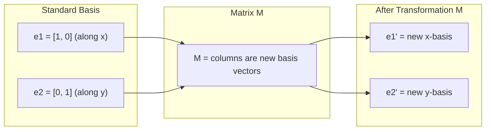
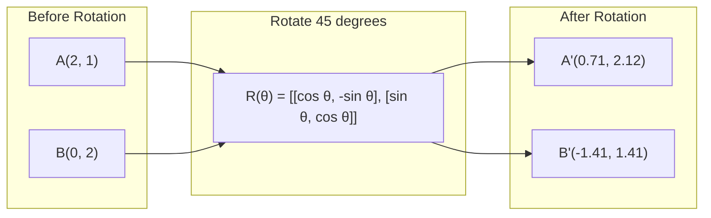
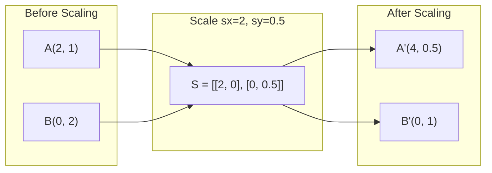
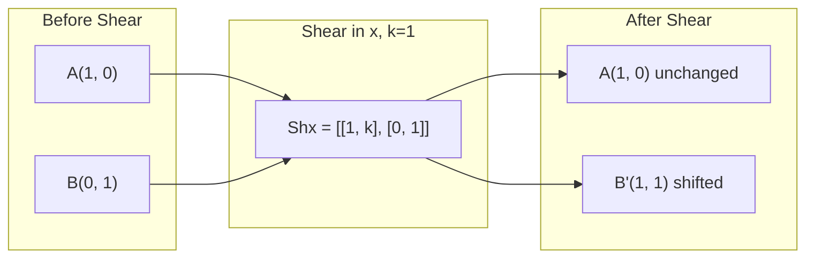
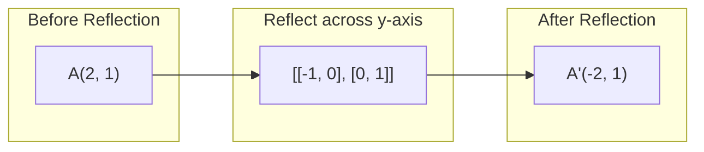
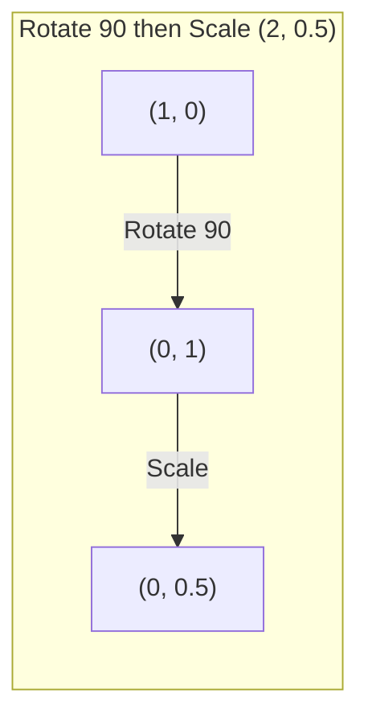
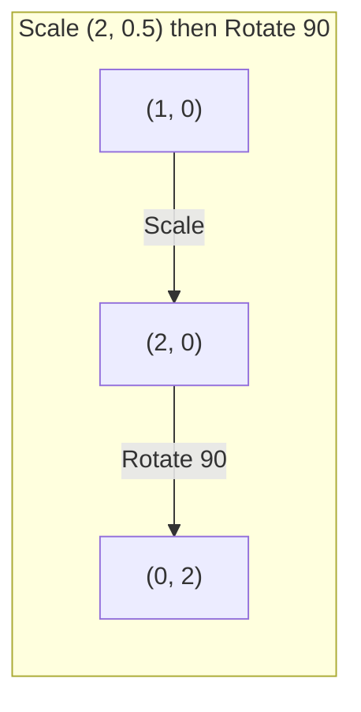

# Transformasi Matrix

> Matrix adalah mesin yang membentuk kembali ruang. Learn pengaruhnya pada setiap titik, dan kamu akan memahami keseluruhan transformasinya.

**Type:** Build
**Language:** Python, Julia
**Prerequisites:** Phase 1, Lesson 01-02 (Intuisi Linear Algebra, Operasi Vector & Matrix)
**Waktu:** ~75 menit

## Tujuan Pembelajaran

- Build matrix rotasi, penskalaan, geser, dan refleksi dan terapkan pada titik 2D dan 3D
- Susun beberapa transformasi dengan perkalian matrix dan verifikasi bahwa urutan itu penting
- Hitung eigenvalue dan eigenvector matrix 2x2 dari persamaan karakteristik
- Jelaskan mengapa eigenvalue menentukan arah PCA, stabilitas RNN, dan perilaku pengelompokan spektral

## Masalah

kamu membaca tentang PCA dan melihat "temukan eigenvector dari covariance matrix." kamu membaca tentang stabilitas model dan melihat "periksa apakah semua eigenvalue memiliki besaran kurang dari 1". kamu membaca tentang augmentasi data dan melihat "menerapkan rotasi acak". Semua ini tidak masuk akal sampai kamu memahami pengaruh matrix terhadap ruang secara geometris.

Matrix bukan sekedar kisi-kisi angka. Mereka adalah mesin spasial. Matrix rotasi memutar poin. Matrix penskalaan merentangkannya. Matrix geser memiringkannya. Setiap transformasi yang diterapkan neural network pada data adalah salah satu dari operasi ini atau komposisinya. Lesson ini membuat operasi tersebut menjadi nyata.

## Konsep

### Transformasi sebagai matrix

Setiap transformasi linier dalam 2D dapat dituliskan sebagai matrix 2x2. Matrix ini memberi tahu kamu dengan tepat di mana vector basis [1, 0] dan [0, 1] berakhir. Segala sesuatu yang lain mengikuti.



### Rotasi

Rotasi 2D berdasarkan sudut theta menjaga distance dan sudut tetap utuh. Ia menggerakkan setiap titik sepanjang busur lingkaran.



Dalam 3D, kamu memutar pada suatu sumbu. Setiap sumbu memiliki matrix rotasinya sendiri:

```
Rz(theta) = | cos  -sin  0 |     Rotate around z-axis
            | sin   cos  0 |     (x-y plane spins, z stays)
            |  0     0   1 |

Rx(theta) = | 1   0     0    |   Rotate around x-axis
            | 0  cos  -sin   |   (y-z plane spins, x stays)
            | 0  sin   cos   |

Ry(theta) = |  cos  0  sin |     Rotate around y-axis
            |   0   1   0  |     (x-z plane spins, y stays)
            | -sin  0  cos |
```

### Penskalaan

Penskalaan meregangkan atau memampatkan sepanjang setiap sumbu secara independen.



### Mencukur

Pemotongan memiringkan satu sumbu sambil menjaga sumbu lainnya tetap. Itu mengubah persegi panjang menjadi jajaran genjang.



Matrix geser:
- `Shx = [[1, k], [0, 1]]` menggeser x sebanyak k*y
- `Shy = [[1, 0], [k, 1]]` menggeser y sebanyak k*x

### Refleksi

Cermin pantulan menunjuk pada suatu sumbu atau garis.



Matrix refleksi:
- Refleksikan melintasi sumbu y: `[[-1, 0], [0, 1]]`
- Refleksikan melintasi sumbu x: `[[1, 0], [0, -1]]`

### Komposisi: transformasi berantai

Menerapkan transformasi A lalu B sama dengan mengalikan matriksnya: `result = B @ A @ point`. Ketertiban itu penting. Putar lalu skala memberikan hasil yang berbeda dengan skala lalu putar.



Terdiri: `S @ R = [[0, -2], [0.5, 0]]`



Terdiri: `R @ S = [[0, -0.5], [2, 0]]`

Hasil yang berbeda. Perkalian matrix tidak bersifat komutatif.

### Eigenvalue dan eigenvector

Kebanyakan vector berubah arah ketika suatu matrix menyentuh vector tersebut. Eigenvector itu istimewa: matrix hanya menskalakannya, tidak pernah memutarnya. Faktor penskalaannya adalah eigenvalue.

```
A @ v = lambda * v

v is the eigenvector (direction that survives)
lambda is the eigenvalue (how much it stretches)

Example: A = | 2  1 |
             | 1  2 |

Eigenvector [1, 1] with eigenvalue 3:
  A @ [1,1] = [3, 3] = 3 * [1, 1]     (same direction, scaled by 3)

Eigenvector [1, -1] with eigenvalue 1:
  A @ [1,-1] = [1, -1] = 1 * [1, -1]  (same direction, unchanged)
```

Matrix merenggangkan ruang sebesar 3x sepanjang [1, 1] dan menjaga [1, -1] tidak berubah. Setiap arah lainnya merupakan campuran dari keduanya.

### Eigendecomposition

Jika suatu matrix mempunyai n eigenvector yang bebas linier, maka matrix tersebut dapat didekomposisi menjadi:

```
A = V @ D @ V^(-1)

V = matrix whose columns are eigenvectors
D = diagonal matrix of eigenvalues
V^(-1) = inverse of V

This says: rotate into eigenvector coordinates, scale along each axis, rotate back.
```

### Mengapa eigenvalue penting**PCA.** Eigenvector covariance matrix adalah principal component. Eigenvalue memberi tahu kamu berapa banyak varian yang ditangkap setiap komponen. Urutkan berdasarkan eigenvalue, pertahankan k teratas, dan kamu mendapatkan dimensionality reduction.

**Stabilitas.** Dalam jaringan berulang dan sistem dinamis, eigenvalue dengan magnitudo > 1 menyebabkan output meledak. Besaran <1 menyebabkan mereka menghilang. Ini adalah masalah gradient hilang/meledak yang dinyatakan dalam satu kalimat.

**Metode spektral.** Jaringan neural grafik menggunakan eigenvalue matrix ketetanggaan. Pengelompokan spektral menggunakan eigenvalue dari Laplacian. Eigenvector mengungkapkan struktur grafik.

### Penentu sebagai faktor skala volume

Penentu matrix transformasi memberi tahu kamu seberapa besar skala area (2D) atau volume (3D).

```
det = 1:   area preserved (rotation)
det = 2:   area doubled
det = 0:   space crushed to lower dimension (singular)
det = -1:  area preserved but orientation flipped (reflection)

| det(Rotation) | = 1        (always)
| det(Scale sx, sy) | = sx * sy
| det(Shear) | = 1           (area preserved)
| det(Reflection) | = -1     (orientation flipped)
```

## Build

### Langkah 1: Transformasi matrix dari awal (Python)

```python
import math

def rotation_2d(theta):
    c, s = math.cos(theta), math.sin(theta)
    return [[c, -s], [s, c]]

def scaling_2d(sx, sy):
    return [[sx, 0], [0, sy]]

def shearing_2d(kx, ky):
    return [[1, kx], [ky, 1]]

def reflection_x():
    return [[1, 0], [0, -1]]

def reflection_y():
    return [[-1, 0], [0, 1]]

def mat_vec_mul(matrix, vector):
    return [
        sum(matrix[i][j] * vector[j] for j in range(len(vector)))
        for i in range(len(matrix))
    ]

def mat_mul(a, b):
    rows_a, cols_b = len(a), len(b[0])
    cols_a = len(a[0])
    return [
        [sum(a[i][k] * b[k][j] for k in range(cols_a)) for j in range(cols_b)]
        for i in range(rows_a)
    ]

point = [1.0, 0.0]
angle = math.pi / 4

rotated = mat_vec_mul(rotation_2d(angle), point)
print(f"Rotate (1,0) by 45 deg: ({rotated[0]:.4f}, {rotated[1]:.4f})")

scaled = mat_vec_mul(scaling_2d(2, 3), [1.0, 1.0])
print(f"Scale (1,1) by (2,3): ({scaled[0]:.1f}, {scaled[1]:.1f})")

sheared = mat_vec_mul(shearing_2d(1, 0), [1.0, 1.0])
print(f"Shear (1,1) kx=1: ({sheared[0]:.1f}, {sheared[1]:.1f})")

reflected = mat_vec_mul(reflection_y(), [2.0, 1.0])
print(f"Reflect (2,1) across y: ({reflected[0]:.1f}, {reflected[1]:.1f})")
```

### Langkah 2: Komposisi transformasi

```python
R = rotation_2d(math.pi / 2)
S = scaling_2d(2, 0.5)

rotate_then_scale = mat_mul(S, R)
scale_then_rotate = mat_mul(R, S)

point = [1.0, 0.0]
result1 = mat_vec_mul(rotate_then_scale, point)
result2 = mat_vec_mul(scale_then_rotate, point)

print(f"Rotate 90 then scale: ({result1[0]:.2f}, {result1[1]:.2f})")
print(f"Scale then rotate 90: ({result2[0]:.2f}, {result2[1]:.2f})")
print(f"Same? {result1 == result2}")
```

### Langkah 3: Eigenvalue dari awal (2x2)

Untuk matrix 2x2 `[[a, b], [c, d]]`, eigenvalue menyelesaikan persamaan karakteristik: `lambda^2 - (a+d)*lambda + (ad - bc) = 0`.

```python
def eigenvalues_2x2(matrix):
    a, b = matrix[0]
    c, d = matrix[1]
    trace = a + d
    det = a * d - b * c
    discriminant = trace ** 2 - 4 * det
    if discriminant < 0:
        real = trace / 2
        imag = (-discriminant) ** 0.5 / 2
        return (complex(real, imag), complex(real, -imag))
    sqrt_disc = discriminant ** 0.5
    return ((trace + sqrt_disc) / 2, (trace - sqrt_disc) / 2)

def eigenvector_2x2(matrix, eigenvalue):
    a, b = matrix[0]
    c, d = matrix[1]
    if abs(b) > 1e-10:
        v = [b, eigenvalue - a]
    elif abs(c) > 1e-10:
        v = [eigenvalue - d, c]
    else:
        if abs(a - eigenvalue) < 1e-10:
            v = [1, 0]
        else:
            v = [0, 1]
    mag = (v[0] ** 2 + v[1] ** 2) ** 0.5
    return [v[0] / mag, v[1] / mag]

A = [[2, 1], [1, 2]]
vals = eigenvalues_2x2(A)
print(f"Matrix: {A}")
print(f"Eigenvalues: {vals[0]:.4f}, {vals[1]:.4f}")

for val in vals:
    vec = eigenvector_2x2(A, val)
    result = mat_vec_mul(A, vec)
    scaled = [val * vec[0], val * vec[1]]
    print(f"  lambda={val:.1f}, v={[round(x,4) for x in vec]}")
    print(f"    A@v = {[round(x,4) for x in result]}")
    print(f"    l*v = {[round(x,4) for x in scaled]}")
```

### Langkah 4: Penentu sebagai faktor skala volume

```python
def det_2x2(matrix):
    return matrix[0][0] * matrix[1][1] - matrix[0][1] * matrix[1][0]

print(f"det(rotation 45) = {det_2x2(rotation_2d(math.pi/4)):.4f}")
print(f"det(scale 2,3)   = {det_2x2(scaling_2d(2, 3)):.1f}")
print(f"det(shear kx=1)  = {det_2x2(shearing_2d(1, 0)):.1f}")
print(f"det(reflect y)   = {det_2x2(reflection_y()):.1f}")

singular = [[1, 2], [2, 4]]
print(f"det(singular)     = {det_2x2(singular):.1f}")
print("Singular: columns are proportional, space collapses to a line.")
```

## Pakai

NumPy menangani semua ini dengan rutinitas yang dioptimalkan.

```python
import numpy as np

theta = np.pi / 4
R = np.array([[np.cos(theta), -np.sin(theta)],
              [np.sin(theta),  np.cos(theta)]])

point = np.array([1.0, 0.0])
print(f"Rotate (1,0) by 45 deg: {R @ point}")

S = np.diag([2.0, 3.0])
composed = S @ R
print(f"Scale(2,3) after Rotate(45): {composed @ point}")

A = np.array([[2, 1], [1, 2]], dtype=float)
eigenvalues, eigenvectors = np.linalg.eig(A)
print(f"\nEigenvalues: {eigenvalues}")
print(f"Eigenvectors (columns):\n{eigenvectors}")

for i in range(len(eigenvalues)):
    v = eigenvectors[:, i]
    lam = eigenvalues[i]
    print(f"  A @ v{i} = {A @ v}, lambda * v{i} = {lam * v}")

print(f"\ndet(R) = {np.linalg.det(R):.4f}")
print(f"det(S) = {np.linalg.det(S):.1f}")

B = np.array([[3, 1], [0, 2]], dtype=float)
vals, vecs = np.linalg.eig(B)
D = np.diag(vals)
V = vecs
reconstructed = V @ D @ np.linalg.inv(V)
print(f"\nEigendecomposition A = V @ D @ V^-1:")
print(f"Original:\n{B}")
print(f"Reconstructed:\n{reconstructed}")
```

### Rotasi 3D dengan NumPy

```python
def rotation_3d_z(theta):
    c, s = np.cos(theta), np.sin(theta)
    return np.array([[c, -s, 0], [s, c, 0], [0, 0, 1]])

def rotation_3d_x(theta):
    c, s = np.cos(theta), np.sin(theta)
    return np.array([[1, 0, 0], [0, c, -s], [0, s, c]])

point_3d = np.array([1.0, 0.0, 0.0])
rotated_z = rotation_3d_z(np.pi / 2) @ point_3d
rotated_x = rotation_3d_x(np.pi / 2) @ point_3d

print(f"\n3D point: {point_3d}")
print(f"Rotate 90 around z: {np.round(rotated_z, 4)}")
print(f"Rotate 90 around x: {np.round(rotated_x, 4)}")
```

## Kirim

Lesson ini membangun fondasi geometris untuk PCA (Fase 2) dan analisis weight neural network. Code eigenvalue/eigenvector yang dibuat di sini adalah algoritme yang sama yang mendukung dimensionality reduction, pengelompokan spektral, dan analisis stabilitas dalam sistem ML produksi.

## Latihan

1. Terapkan rotasi, penskalaan, dan geser ke satuan persegi (sudut di [0,0], [1,0], [1,1], [0,1]). Cetak sudut yang diubah untuk masing-masing sudut. Pastikan rotasi menjaga distance antar sudut.

2. Temukan eigenvalue matrix [[4, 2], [1, 3]] secara manual menggunakan persamaan karakteristik. Kemudian verifikasi dengan fungsi dari awal dan dengan NumPy.

3. Buat komposisi tiga transformasi (putar 30 derajat, skalakan [1,5, 0,8], geser dengan kx=0,3) dan terapkan pada 8 titik yang disusun melingkar. Cetak koordinat sebelum dan sesudah. Hitung determinant dari matrix yang tersusun dan verifikasikan bahwa determinant tersebut sama dengan hasil kali masing-masing determinant.

## Istilah Kunci| Istilah | Apa kata orang | Apa sebenarnya arti |
|------|----------------|----------------------|
| Matrix rotasi | "Memutar sesuatu" | Matrix ortogonal yang menggerakkan titik-titik sepanjang busur lingkaran dengan tetap mempertahankan distance dan sudut. Penentunya selalu 1. |
| Penskalaan matrix | "Membuat segalanya lebih besar" | Matrix diagonal yang meregang atau memampatkan secara independen di sepanjang setiap sumbu. Penentu adalah produk dari faktor skala. |
| Matrix geser | "Hal-hal miring" | Matrix yang menggeser suatu koordinat secara proporsional ke koordinat lainnya sehingga mengubah persegi panjang menjadi jajar genjang. Penentunya adalah 1. |
| Refleksi | "Cermin sesuatu" | Matrix yang membalik ruang melintasi sumbu atau bidang. Penentunya adalah -1. |
| Komposisi | "Lakukan dua hal" | Mengalikan matrix transformasi ke operasi rantai. Urutan Penting : B@A artinya apply A dulu baru B. |
| Eigenvector | "Arah khusus" | Arah yang hanya diskalakan oleh matrix, tidak pernah berputar. Sidik jari transformasi. |
| Eigenvalue | "Berapa peregangannya" | Faktor scalar yang digunakan matrix untuk menskalakan eigenvector-nya. Bisa negatif (flip) atau kompleks (rotasi). |
| Decomposition Eigend | "Pisahkan matriksnya" | Menulis matrix sebagai V @ D @ V^(-1), memisahkannya menjadi arah dan besaran skala fundamentalnya. |
| Penentu | "Satu nomor dari matrix" | Faktor transformasi skala area (2D) atau volume (3D). Nol berarti transformasi tidak dapat diubah. |
| Persamaan karakteristik | "Dari mana eigenvalue berasal" | det(A - lambda * I) = 0. Polinomial yang akarnya merupakan eigenvalue. |

## Bacaan Lanjutan

- [3Blue1Brown: Transformasi Linier](https://www.3blue1 brown.com/lessons/linear-transformations) -- intuisi visual tentang bagaimana matrix membentuk kembali ruang
- [3Blue1Brown: Eigenvectors dan Eigenvalues](https://www.3blue1 brown.com/lessons/eigenvalues) -- penjelasan visual terbaik tentang arti eigenvector secara geometris
- [MIT 18.06 Kuliah 21: Eigenvalue dan Eigenvector](https://ocw.mit.edu/courses/18-06-linear-algebra-spring-2010/) -- Perlakuan klasik Gilbert Strang
