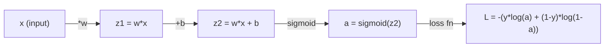
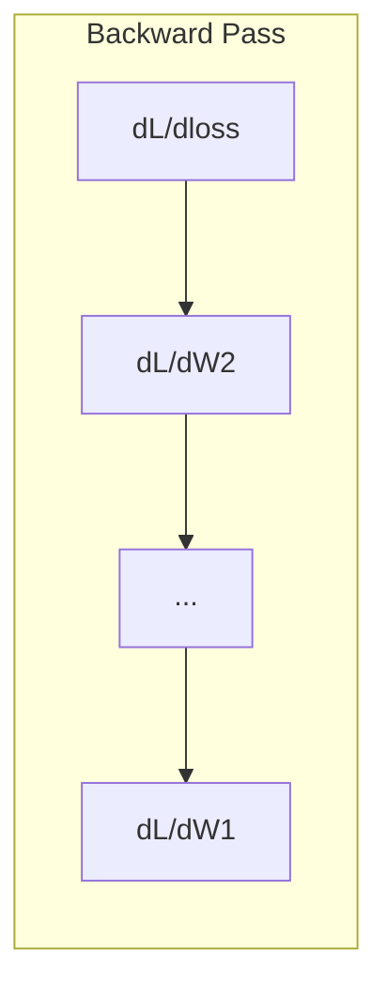

# Kalkulus untuk Machine Learning

> Derivatif memberitahu kamu jalan mana yang menurun. Hanya itu yang perlu dipelajari oleh neural network.

**Type:** Learn
**Language:** Python
**Prerequisites:** Fase 1, Lesson 01-03
**Waktu:** ~60 menit

## Tujuan Pembelajaran

- Hitung turunan numerik dan analitik untuk fungsi ML umum (x^2, sigmoid, cross-entropy)
- Menerapkan gradient descent dari awal untuk meminimalkan loss function dalam 1D dan 2D
- Turunkan gradient model regresi linier dan latih melalui pembaruan weight manual
- Menjelaskan matrix Hessian, perkiraan deret Taylor, dan hubungannya dengan metode optimization

## Masalah

kamu memiliki neural network dengan jutaan weight. Setiap weight adalah sebuah kenop. kamu perlu mencari tahu ke arah mana harus memutar setiap kenop agar modelnya tidak terlalu salah. Kalkulus memberi kamu arah itu.

Tanpa kalkulus, melatih neural network berarti mencoba perubahan acak dan berharap yang terbaik. Dengan turunan, kamu tahu persis bagaimana setiap weight memengaruhi kesalahan. kamu memutar setiap kenop dengan cara yang benar, setiap saat.

## Konsep

### Apa itu turunan?

Derivatif mengukur tingkat perubahan. Untuk fungsi y = f(x), turunan f'(x) memberi tahu kamu: jika kamu mendorong x sedikit saja, berapa perubahan y?

Secara geometris, turunan merupakan kemiringan garis singgung pada suatu titik.

**f(x) = x^2:**

| x | f(x) | f'(x) (kemiringan) |
|---|------|---------------|
| 0 | 0 | 0 (datar, di bawah) |
| 1 | 1 | 2 |
| 2 | 4 | 4 (kemiringan garis singgung pada titik ini) |
| 3 | 9 | 6 |

Pada x=2, kemiringannya adalah 4. Jika kamu memindahkan x sedikit ke kanan, y bertambah sekitar 4 kali lipatnya. Pada x=0, kemiringannya adalah 0. kamu berada di dasar mangkuk.

Definisi formalnya:

```
f'(x) = lim   f(x + h) - f(x)
        h->0  -----------------
                     h
```

Dalam code, kamu melewati batas dan hanya menggunakan h yang sangat kecil. Itu adalah turunan numerik.

### Turunan parsial: satu variabel dalam satu waktu

Fungsi nyata memiliki banyak input. Hilangnya neural network bergantung pada ribuan weight. Turunan parsial membuat semua variabel konstan kecuali satu, kemudian mengambil turunan terhadap variabel tersebut.

```
f(x, y) = x^2 + 3xy + y^2

df/dx = 2x + 3y     (treat y as a constant)
df/dy = 3x + 2y     (treat x as a constant)
```

Setiap turunan parsial menjawab: jika saya menyenggol weight yang satu ini saja, bagaimana kerugiannya berubah?

### Gradient: vector semua turunan parsial

Gradient mengumpulkan setiap turunan parsial menjadi satu vector. Untuk suatu fungsi f(x, y, z), gradiennya adalah:

```
grad f = [ df/dx, df/dy, df/dz ]
```

Gradient menunjuk ke arah pendakian paling curam. Untuk meminimalkan suatu fungsi, lakukan arah sebaliknya.

**Plot kontur f(x,y) = x^2 + y^2:**

Fungsinya membentuk bentuk mangkuk dengan lingkaran konsentris sebagai garis kontur. Minimumnya adalah pada (0, 0).

| Titik | lulusan f | -grad f (arah turun) |
|-------|--------|-------------|
| (1, 1) | [2, 2] (titik menanjak, menjauh dari minimum) | [-2, -2] (menurun, menuju minimum) |
| (0, 0) | [0, 0] (datar, minimal) | [0, 0] |

Ini adalah gradient descent dalam sebuah gambar. Hitung gradiennya, negasikannya, ambil satu langkah.

### Koneksi ke optimization

Melatih neural network adalah optimization. kamu memiliki loss function L(w1, w2, ..., wn) yang mengukur seberapa salah model tersebut. kamu ingin meminimalkannya.

```
Gradient descent update rule:

  w_new = w_old - learning_rate * dL/dw

For every weight:
  1. Compute the partial derivative of loss with respect to that weight
  2. Subtract a small multiple of it from the weight
  3. Repeat
```

Learning rate mengontrol ukuran langkah. Terlalu besar dan kamu overshoot. Terlalu kecil dan kamu merangkak.

**Loss landscape (potongan 1D):**

Loss function L(w) membentuk kurva dengan puncak dan lembah seiring dengan variasi weight w.| Feature | Deskripsi |
|---------|-------------|
| Minimum global | Titik terendah pada keseluruhan kurva -- solusi terbaik |
| Minimum lokal | Lembah yang lebih rendah dari tetangganya tetapi bukan yang terendah secara keseluruhan |
| Kemiringan | Gradient descent mengikuti kemiringan menurun dari titik awal mana pun |

Gradient descent mengikuti kemiringan menurun. Ia dapat terjebak dalam minimum lokal, tetapi dalam ruang berdimensi tinggi (jutaan weight) hal ini jarang menjadi masalah praktis.

### Turunan numerik vs analitik

Ada dua cara untuk menghitung turunan.

Analitis: menerapkan aturan kalkulus dengan tangan. Untuk f(x) = x^2, turunannya adalah f'(x) = 2x. Akurat. Cepat.

Numerik: perkiraan menggunakan definisi. Hitung f(x+h) dan f(x-h) untuk h kecil, lalu gunakan selisihnya.

```
Numerical (central difference):

f'(x) ~= f(x + h) - f(x - h)
          -----------------------
                  2h

h = 0.0001 works well in practice
```

Turunan numerik lebih lambat tetapi dapat digunakan untuk fungsi apa pun. Derivatif analitik cepat tetapi mengharuskan kamu menurunkan rumusnya. Kerangka kerja neural network menggunakan pendekatan ketiga: diferensiasi otomatis, yang menghitung turunan eksak secara mekanis. kamu akan melihatnya di Fase 3.

### Turunan dengan tangan untuk fungsi sederhana

Ini adalah turunannya yang akan kamu lihat berulang kali di ML.

```
Function        Derivative       Used in
--------        ----------       -------
f(x) = x^2     f'(x) = 2x      Loss functions (MSE)
f(x) = wx + b  f'(w) = x        Linear layer (gradient w.r.t. weight)
                f'(b) = 1        Linear layer (gradient w.r.t. bias)
                f'(x) = w        Linear layer (gradient w.r.t. input)
f(x) = e^x     f'(x) = e^x     Softmax, attention
f(x) = ln(x)   f'(x) = 1/x     Cross-entropy loss
f(x) = 1/(1+e^-x)  f'(x) = f(x)(1-f(x))   Sigmoid activation
```

Untuk f(x) = x^2:

```
f(x) = x^2    f'(x) = 2x

  x    f(x)   f'(x)   meaning
  -2    4      -4      slope tilts left (decreasing)
  -1    1      -2      slope tilts left (decreasing)
   0    0       0      flat (minimum!)
   1    1       2      slope tilts right (increasing)
   2    4       4      slope tilts right (increasing)
```

Untuk f(w) = wx + b dengan x=3, b=1:

```
f(w) = 3w + 1    f'(w) = 3

The derivative with respect to w is just x.
If x is big, a small change in w causes a big change in output.
```

### Aturan rantai

Saat fungsi disusun, aturan rantai memberi tahu kamu cara membedakannya.

```
If y = f(g(x)), then dy/dx = f'(g(x)) * g'(x)

Example: y = (3x + 1)^2
  outer: f(u) = u^2       f'(u) = 2u
  inner: g(x) = 3x + 1    g'(x) = 3
  dy/dx = 2(3x + 1) * 3 = 6(3x + 1)
```

Jaringan saraf adalah rangkaian fungsi: input -> linier -> activation -> linier -> activation -> loss. Backpropagation adalah aturan rantai yang diterapkan berulang kali dari output ke input. Itu adalah keseluruhan algoritma.

### Matrix Goni

Gradient memberi tahu kamu kemiringannya. Hessian memberitahu kamu kelengkungannya.

Hessian adalah matrix turunan parsial orde kedua. Untuk fungsi f(x1, x2, ..., xn), entri (i, j) dari Hessian adalah:

```
H[i][j] = d^2f / (dx_i * dx_j)
```

Untuk fungsi 2 variabel f(x, y):

```
H = | d^2f/dx^2    d^2f/dxdy |
    | d^2f/dydx    d^2f/dy^2 |
```

**Apa yang dikatakan Hessian pada titik kritis (di mana gradient = 0):**

| Properti Goni | Arti | Contoh permukaan |
|-----------------|---------|-----------------|
| Pasti positif (semua eigenvalue > 0) | Minimum lokal | Mangkuk mengarah ke atas |
| Pasti negatif (semua eigenvalue < 0) | Maksimum lokal | Mangkuk menunjuk ke bawah |
| Tidak terbatas (eigenvalue campuran) | Titik pelana | Bentuk pelana kuda |

**Contoh:** f(x, y) = x^2 - y^2 (fungsi pelana)

```
df/dx = 2x       df/dy = -2y
d^2f/dx^2 = 2    d^2f/dy^2 = -2    d^2f/dxdy = 0

H = | 2   0 |
    | 0  -2 |

Eigenvalues: 2 and -2 (one positive, one negative)
--> Saddle point at (0, 0)
```

Bandingkan dengan f(x, y) = x^2 + y^2 (mangkuk):

```
H = | 2  0 |
    | 0  2 |

Eigenvalues: 2 and 2 (both positive)
--> Local minimum at (0, 0)
```

**Mengapa Hessian penting di ML:**

Metode Newton menggunakan Hessian untuk mengambil langkah optimization yang lebih baik daripada gradient descent. Daripada hanya mengikuti kemiringan, ini memperhitungkan kelengkungan:

```
Newton's update:    w_new = w_old - H^(-1) * gradient
Gradient descent:   w_new = w_old - lr * gradient
```

Metode Newton menyatu lebih cepat karena Hessian "menskalakan ulang" gradient -- arah curam mendapat langkah lebih kecil, arah datar mendapat langkah lebih besar.

Hasil tangkapannya: untuk jaringan neural dengan N parameter, Hessiannya adalah N x N. Model dengan 1 juta parameter memerlukan matrix entri 1 triliun. Itu sebabnya kami menggunakan perkiraan.| Metode | Apa yang digunakannya | Biaya | Konvergensi |
|--------|-------------|------|-------------|
| Gradient descent | Hanya turunan pertama | PADA(N) per langkah | Lambat (linier) |
| Metode Newton | Hessian Penuh | O(N^3) per langkah | Cepat (kuadrat) |
| L-BFGS | Perkiraan Hessian dari sejarah gradient | PADA(N) per langkah | Sedang (superlinier) |
| adam | Tingkat adaptif per parameter (perkiraan diagonal Hessian) | PADA(N) per langkah | Sedang |
| Gradient alami | Matrix informasi Fisher (statistik Hessian) | O(N^2) per langkah | Cepat |

Dalam praktiknya, Adam adalah optimizer default untuk pembelajaran mendalam. Ini memperkirakan informasi orde kedua dengan harga murah dengan melacak mean berjalan dan varian gradient per parameter.

### Perkiraan Deret Taylor

Fungsi halus apa pun dapat didekati secara lokal dengan polinomial:

```
f(x + h) = f(x) + f'(x)*h + (1/2)*f''(x)*h^2 + (1/6)*f'''(x)*h^3 + ...
```

Semakin banyak suku yang kamu sertakan, semakin baik perkiraannya -- tetapi hanya mendekati titik x.

**Mengapa seri Taylor penting untuk ML:**

- **Taylor orde pertama = gradient descent.** Saat menggunakan f(x + h) ~ f(x) + f'(x)*h, kamu membuat perkiraan linier. Gradient descent meminimalkan model linier ini untuk memilih h = -lr * f'(x).

- **Taylor orde kedua = metode Newton.** Menggunakan f(x + h) ~ f(x) + f'(x)*h + (1/2)*f''(x)*h^2, kamu mendapatkan model kuadrat. Meminimalkannya menghasilkan h = -f'(x)/f''(x) -- langkah Newton.

- **Desain loss function.** MSE dan entropi silang mulus, yang berarti ekspansi Taylornya berperilaku baik. Ini bukanlah sebuah kecelakaan. Loss yang mulus membuat optimization dapat diprediksi.

```
Approximation order    What it captures    Optimization method
-------------------    -----------------   -------------------
0th order (constant)   Just the value      Random search
1st order (linear)     Slope               Gradient descent
2nd order (quadratic)  Curvature           Newton's method
Higher orders          Finer structure     Rarely used in ML
```

Wawasan utamanya: semua optimization berbasis gradient sebenarnya tentang memperkirakan loss function secara lokal dan melangkah ke perkiraan minimum tersebut.

### Integral di ML

Derivatif memberi tahu kamu tingkat perubahan. Integral menghitung akumulasi -- luas di bawah kurva.

Di ML, kamu jarang menghitung integral dengan tangan, namun konsepnya ada di mana-mana:

**Probabilitas.** Untuk variabel acak kontinu dengan kepadatan p(x):
```
P(a < X < b) = integral from a to b of p(x) dx
```
Area di bawah kurva kepadatan probabilitas antara a dan b adalah probabilitas untuk mendarat pada kisaran tersebut.

**Nilai yang diharapkan.** Hasil rata-rata yang ditimbang berdasarkan probabilitas:
```
E[f(X)] = integral of f(x) * p(x) dx
```
Loss yang diperkirakan pada distribusi data merupakan bagian integral. Training meminimalkan perkiraan empiris mengenai hal ini.

**Divergensi KL.** Mengukur perbedaan dua distribusi:
```
KL(p || q) = integral of p(x) * log(p(x) / q(x)) dx
```
Digunakan dalam VAE, penyulingan pengetahuan, dan inference Bayesian.

**Konstanta normalisasi.** Dalam inference Bayesian:
```
p(w | data) = p(data | w) * p(w) / integral of p(data | w) * p(w) dw
```
Penyebutnya merupakan integral dari semua nilai parameter yang mungkin. Hal ini sering kali sulit dilakukan, itulah sebabnya kami menggunakan perkiraan seperti MCMC dan inference variasional.

| Konsep integral | Dimana Munculnya di ML |
|-----------------|----------------------|
| Luas di bawah kurva | Probabilitas dari fungsi kepadatan |
| Nilai yang diharapkan | Loss function, minimalisasi risiko |
| Divergensi KL | VAE, optimalisasi kebijakan, distilasi |
| Normalisasi | Posterior Bayesian, penyebut softmax |
| Kemungkinan marjinal | Perbandingan model, bukti batas bawah (ELBO) |

### Aturan Rantai Multivariabel dalam Grafik Komputasi

Aturan rantai tidak hanya berlaku untuk fungsi scalar dalam suatu garis. Dalam neural network, variabel menyebar dan bergabung. Berikut adalah bagaimana derivatif mengalir melalui forward pass sederhana:



Jalur mundur menghitung gradient dari kanan ke kiri:

```mermaid
graph RL
    dL["dL/dL = 1"] -->|"dL/da"| da["dL/da = -y/a + (1-y)/(1-a)"]
    da -->|"da/dz2 = a(1-a)"| dz2["dL/dz2 = dL/da * a(1-a)"]
    dz2 -->|"dz2/dw = x"| dw["dL/dw = dL/dz2 * x"]
    dz2 -->|"dz2/db = 1"| db["dL/db = dL/dz2 * 1"]
```Setiap panah dikalikan dengan turunan lokal. Gradient untuk parameter apa pun adalah hasil kali semua turunan lokal di sepanjang jalur dari loss hingga parameter tersebut. Saat jalur bercabang dan digabungkan, kamu menjumlahkan kontribusinya (aturan rantai multivariat).

Ini semua adalah backpropagation: aturan rantai diterapkan secara sistematis melalui grafik komputasi, dari output ke input.

### Matrix Jacobian

Ketika suatu fungsi memetakan vector ke vector (seperti layer neural network), turunannya adalah matrix. Jacobian berisi setiap turunan parsial dari setiap output terhadap setiap input.

Untuk f: R^n -> R^m, Jacobian J adalah matrix m x n:

| | x1 | x2 | ... | xn |
|---|---|---|---|---|
| f1 | df1/dx1 | df1/dx2 | ... | df1/dxn |
| f2 | df2/dx1 | df2/dx2 | ... | df2/dxn |
| ... | ... | ... | ... | ... |
| fm | dfm/dx1 | dfm/dx2 | ... | dfm/dxn |

kamu tidak akan menghitung Jacobian dengan tangan untuk neural network. PyTorch menanganinya. Namun mengetahui keberadaannya membantu kamu memahami bentuk dalam backpropagation: jika sebuah layer memetakan R^n ke R^m, Jacobian-nya adalah mxn. Gradient mengalir mundur melalui transpos matrix ini.

### Mengapa hal ini penting untuk neural network

Setiap weight dalam neural network mendapat gradient. Gradient memberi tahu kamu cara menyesuaikan weight tersebut untuk mengurangi penurunan.

```mermaid
graph LR
    subgraph Forward["Forward Pass"]
        I["input"] --> W1["W1"] --> R["relu"] --> W2["W2"] --> S["softmax"] --> L["loss"]
    end
```



Setiap pembaruan berat:
- `W1 = W1 - lr * dL/dW1`
- `W2 = W2 - lr * dL/dW2`

Forward pass menghitung prediksi dan loss. Backward pass menghitung gradient loss terhadap setiap weight. Kemudian setiap weight mengambil langkah kecil menuruni bukit. Ulangi selama jutaan langkah. Itu adalah pembelajaran mendalam.

## Build

### Langkah 1: Turunan numerik dari awal

```python
def numerical_derivative(f, x, h=1e-7):
    return (f(x + h) - f(x - h)) / (2 * h)

def f(x):
    return x ** 2

for x in [-2, -1, 0, 1, 2]:
    numerical = numerical_derivative(f, x)
    analytical = 2 * x
    print(f"x={x:2d}  f'(x) numerical={numerical:.6f}  analytical={analytical:.1f}")
```

Turunan numerik mencocokkan turunan analitis hingga banyak tempat desimal.

### Langkah 2: Turunan parsial dan gradient

```python
def numerical_gradient(f, point, h=1e-7):
    gradient = []
    for i in range(len(point)):
        point_plus = list(point)
        point_minus = list(point)
        point_plus[i] += h
        point_minus[i] -= h
        partial = (f(point_plus) - f(point_minus)) / (2 * h)
        gradient.append(partial)
    return gradient

def f_multi(point):
    x, y = point
    return x**2 + 3*x*y + y**2

grad = numerical_gradient(f_multi, [1.0, 2.0])
print(f"Numerical gradient at (1,2): {[f'{g:.4f}' for g in grad]}")
print(f"Analytical gradient at (1,2): [2*1+3*2, 3*1+2*2] = [{2*1+3*2}, {3*1+2*2}]")
```

### Langkah 3: Gradient descent untuk mencari nilai minimum f(x) = x^2

```python
x = 5.0
lr = 0.1
for step in range(20):
    grad = 2 * x
    x = x - lr * grad
    print(f"step {step:2d}  x={x:8.4f}  f(x)={x**2:10.6f}")
```

Mulai dari x=5, setiap langkah mendekati x=0 (minimum).

### Langkah 4: Gradient descent pada fungsi 2D

```python
def f_2d(point):
    x, y = point
    return x**2 + y**2

point = [4.0, 3.0]
lr = 0.1
for step in range(30):
    grad = numerical_gradient(f_2d, point)
    point = [p - lr * g for p, g in zip(point, grad)]
    loss = f_2d(point)
    if step % 5 == 0 or step == 29:
        print(f"step {step:2d}  point=({point[0]:7.4f}, {point[1]:7.4f})  f={loss:.6f}")
```

### Langkah 5: Membandingkan turunan numerik dan analitik

```python
import math

test_functions = [
    ("x^2",      lambda x: x**2,          lambda x: 2*x),
    ("x^3",      lambda x: x**3,          lambda x: 3*x**2),
    ("sin(x)",   lambda x: math.sin(x),   lambda x: math.cos(x)),
    ("e^x",      lambda x: math.exp(x),   lambda x: math.exp(x)),
    ("1/x",      lambda x: 1/x,           lambda x: -1/x**2),
]

x = 2.0
print(f"{'Function':<12} {'Numerical':>12} {'Analytical':>12} {'Error':>12}")
print("-" * 50)
for name, f, df in test_functions:
    num = numerical_derivative(f, x)
    ana = df(x)
    err = abs(num - ana)
    print(f"{name:<12} {num:12.6f} {ana:12.6f} {err:12.2e}")
```

### Langkah 6: Menghitung Hessian secara numerik

```python
def hessian_2d(f, x, y, h=1e-5):
    fxx = (f(x + h, y) - 2 * f(x, y) + f(x - h, y)) / (h ** 2)
    fyy = (f(x, y + h) - 2 * f(x, y) + f(x, y - h)) / (h ** 2)
    fxy = (f(x + h, y + h) - f(x + h, y - h) - f(x - h, y + h) + f(x - h, y - h)) / (4 * h ** 2)
    return [[fxx, fxy], [fxy, fyy]]

def saddle(x, y):
    return x ** 2 - y ** 2

def bowl(x, y):
    return x ** 2 + y ** 2

H_saddle = hessian_2d(saddle, 0.0, 0.0)
H_bowl = hessian_2d(bowl, 0.0, 0.0)
print(f"Saddle Hessian: {H_saddle}")  # [[2, 0], [0, -2]] -- mixed signs
print(f"Bowl Hessian:   {H_bowl}")    # [[2, 0], [0, 2]]  -- both positive
```

Fungsi pelana Hessian memiliki eigenvalue 2 dan -2 (tanda campuran, mengonfirmasi titik pelana). Mangkuk tersebut mempunyai eigenvalue 2 dan 2 (keduanya positif, mengkonfirmasi nilai minimum).

### Langkah 7: Aksi pendekatan Taylor

```python
import math

def taylor_approx(f, f_prime, f_double_prime, x0, h, order=2):
    result = f(x0)
    if order >= 1:
        result += f_prime(x0) * h
    if order >= 2:
        result += 0.5 * f_double_prime(x0) * h ** 2
    return result

x0 = 0.0
for h in [0.1, 0.5, 1.0, 2.0]:
    true_val = math.sin(h)
    t1 = taylor_approx(math.sin, math.cos, lambda x: -math.sin(x), x0, h, order=1)
    t2 = taylor_approx(math.sin, math.cos, lambda x: -math.sin(x), x0, h, order=2)
    print(f"h={h:.1f}  sin(h)={true_val:.4f}  order1={t1:.4f}  order2={t2:.4f}")
```

Dekat x0=0, sin(x) ~ x (Taylor orde pertama). Perkiraannya sangat baik untuk h kecil tetapi gagal untuk h besar. Inilah sebabnya gradient descent bekerja paling baik dengan learning rate yang kecil -- setiap langkah mengasumsikan perkiraan linier akurat.

### Langkah 8: Mengapa hal ini penting untuk neural network

```python
import random

random.seed(42)

w = random.gauss(0, 1)
b = random.gauss(0, 1)
lr = 0.01

xs = [1.0, 2.0, 3.0, 4.0, 5.0]
ys = [3.0, 5.0, 7.0, 9.0, 11.0]

for epoch in range(200):
    total_loss = 0
    dw = 0
    db = 0
    for x, y in zip(xs, ys):
        pred = w * x + b
        error = pred - y
        total_loss += error ** 2
        dw += 2 * error * x
        db += 2 * error
    dw /= len(xs)
    db /= len(xs)
    total_loss /= len(xs)
    w -= lr * dw
    b -= lr * db
    if epoch % 40 == 0 or epoch == 199:
        print(f"epoch {epoch:3d}  w={w:.4f}  b={b:.4f}  loss={total_loss:.6f}")

print(f"\nLearned: y = {w:.2f}x + {b:.2f}")
print(f"Actual:  y = 2x + 1")
```

Setiap loop training berbasis gradient mengikuti pola ini: memprediksi, menghitung loss, menghitung gradient, memperbarui weight.

## Pakai

Dengan NumPy, operasi yang sama menjadi lebih cepat dan ringkas:

```python
import numpy as np

x = np.array([1, 2, 3, 4, 5], dtype=float)
y = np.array([3, 5, 7, 9, 11], dtype=float)

w, b = np.random.randn(), np.random.randn()
lr = 0.01

for epoch in range(200):
    pred = w * x + b
    error = pred - y
    loss = np.mean(error ** 2)
    dw = np.mean(2 * error * x)
    db = np.mean(2 * error)
    w -= lr * dw
    b -= lr * db

print(f"Learned: y = {w:.2f}x + {b:.2f}")
```

kamu baru saja membuat gradient descent dari awal. PyTorch mengotomatiskan komputasi gradient, tetapi loop pembaruannya identik.

## Latihan1. Implementasikan `numerical_second_derivative(f, x)` menggunakan `numerical_derivative` yang dipanggil dua kali. Pastikan turunan kedua dari x^3 di x=2 adalah 12.
2. Gunakan gradient descent untuk mencari nilai minimum f(x, y) = (x - 3)^2 + (y + 1)^2. Mulai dari (0, 0). Jawabannya harus konvergen ke (3, -1).
3. Tambahkan momentum ke loop gradient descent: pertahankan vector kecepatan yang terakumulasi melewati gradient. Bandingkan kecepatan konvergensi dengan dan tanpa momentum pada f(x) = x^4 - 3x^2.

## Istilah Kunci

| Istilah | Apa kata orang | Apa sebenarnya arti |
|------|----------------|----------------------|
| Turunan | "Kemiringan" | Laju perubahan suatu fungsi pada suatu titik. Memberi tahu kamu berapa banyak perubahan output per unit perubahan input. |
| Turunan parsial | "Turunan dari satu variabel" | Turunan terhadap satu variabel sementara variabel lainnya dianggap konstan. |
| Gradient | "Arah pendakian paling curam" | Vector dari semua turunan parsial. Menunjuk ke arah yang meningkatkan fungsi paling cepat. |
| Gradient descent | "Menurun" | Kurangi gradient (dikalikan learning rate) dari parameter untuk mengurangi loss. Inti dari training neural network. |
| Learning rate | "Ukuran langkah" | Scalar yang mengontrol seberapa besar setiap langkah gradient descent. Terlalu besar: menyimpang. Terlalu kecil: menyatu secara perlahan. |
| Aturan rantai | "Kalikan turunannya" | Aturan untuk membedakan fungsi tersusun: df/dx = df/dg * dg/dx. Dasar matematika dari backpropagation. |
| Jacobian | "Matrix turunan" | Ketika suatu fungsi memetakan vector ke vector, Jacobian adalah matrix semua turunan parsial output terhadap input. |
| Turunan numerik | "Perbedaan terbatas" | Mendekati turunan dengan mengevaluasi fungsi pada dua titik terdekat dan menghitung kemiringan di antara titik-titik tersebut. |
| Backpropagation | "Autodiff mode terbalik" | Menghitung gradient layer by layer dari output ke input menggunakan aturan rantai. Bagaimana neural network belajar. |
| Goni | "Matrix turunan kedua" | Matrix semua turunan parsial orde kedua. Menjelaskan kelengkungan suatu fungsi. Hessian pasti positif pada titik kritis berarti minimum lokal. |
| Deret Taylor | "Perkiraan polinomial" | Mendekati suatu fungsi di dekat suatu titik menggunakan turunannya: f(x+h) ~ f(x) + f'(x)h + (1/2)f''(x)h^2 + ... Dasar untuk memahami mengapa gradient descent dan metode Newton berhasil. |
| Integral | "Area di bawah kurva" | Akumulasi suatu kuantitas dalam suatu rentang. Dalam ML, integral menentukan probabilitas, nilai yang diharapkan, dan divergensi KL. |

## Bacaan Lanjutan

- [3Blue1Brown: Esensi Kalkulus](https://www.3blue1 brown.com/topics/calculus) - intuisi visual untuk turunan, integral, dan aturan rantai
- [Stanford CS231n: Backpropagation](https://cs231n.github.io/optimization-2/) - bagaimana gradient mengalir melalui layer neural network
