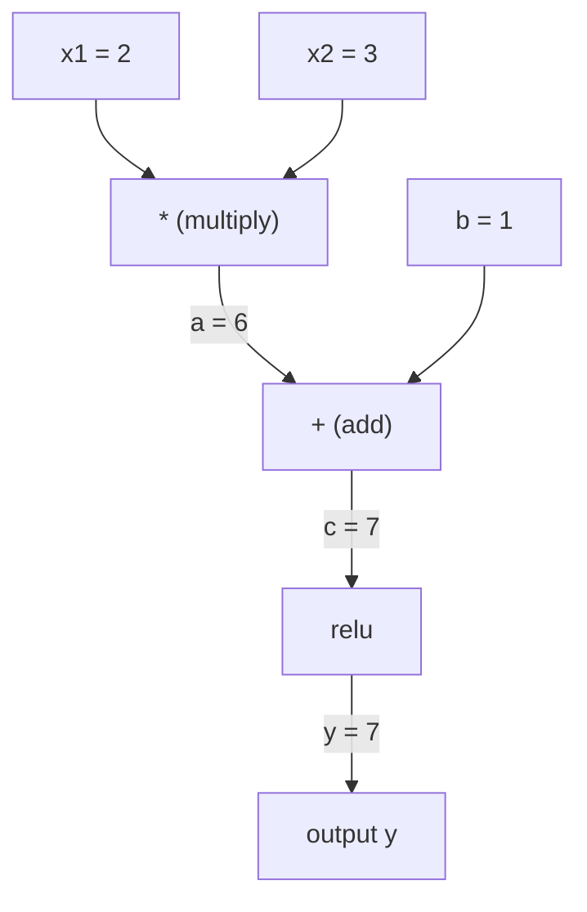
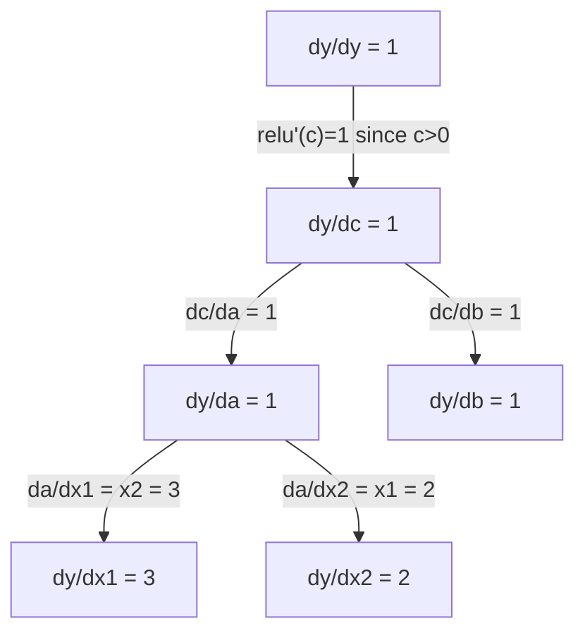

# Aturan Rantai & Diferensiasi Otomatis

> Aturan rantai adalah mesin di balik setiap neural network yang belajar.

**Type:** Build
**Language:** Python
**Prerequisites:** Fase 1, Lesson 04 (Derivatif & Gradient)
**Waktu:** ~90 menit

## Tujuan Pembelajaran

- Build mesin autograd minimal (kelas Nilai) yang mencatat operasi dan menghitung gradient melalui autodiff mode terbalik
- Menerapkan lintasan maju dan mundur melalui grafik komputasi menggunakan pengurutan topologi
- Membangun dan melatih perceptron multi-layer pada XOR hanya menggunakan mesin autograd dari awal
- Verifikasi kebenaran autodiff menggunakan pemeriksaan gradient terhadap perbedaan hingga numerik

## Masalah

kamu dapat menghitung turunan dari fungsi sederhana. Namun neural network bukanlah fungsi yang sederhana. Ini adalah ratusan fungsi yang disusun bersama: perkalian matrix, penambahan bias, penerapan activation, perkalian matrix lagi, softmax, kehilangan entropi silang. Outputnya adalah fungsi dari suatu fungsi.

Untuk melatih jaringan, kamu memerlukan gradient loss terhadap setiap weight. Melakukan ini dengan tangan tidak mungkin dilakukan karena jutaan parameter. Melakukannya secara numerik (perbedaan terbatas) terlalu lambat.

Aturan rantai memberi kamu perhitungan. Diferensiasi otomatis memberi kamu algoritme. Bersama-sama, keduanya memungkinkan kamu menghitung gradient yang tepat melalui komposisi fungsi yang berubah-ubah dalam waktu yang sebanding dengan satu lintasan maju.

Beginilah cara kerja PyTorch, TensorFlow, dan JAX. kamu akan membuat versi miniatur dari awal.

## Konsep

### Aturan Rantai

Jika `y = f(g(x))`, turunan dari `y` terhadap `x` adalah:

```
dy/dx = dy/dg * dg/dx = f'(g(x)) * g'(x)
```

Lipat gandakan turunannya di sepanjang rantai. Setiap tautan menyumbangkan turunan lokalnya.

Contoh: `y = sin(x^2)`

```
g(x) = x^2       g'(x) = 2x
f(g) = sin(g)     f'(g) = cos(g)

dy/dx = cos(x^2) * 2x
```

Untuk komposisi yang lebih dalam, rantainya meluas:

```
y = f(g(h(x)))

dy/dx = f'(g(h(x))) * g'(h(x)) * h'(x)
```

Setiap layer dalam neural network merupakan salah satu tautan dalam rantai ini.

### Grafik Komputasi

Grafik komputasi membuat aturan rantai menjadi visual. Setiap operasi menjadi sebuah node. Data mengalir maju melalui grafik. Gradient mengalir mundur.

**Lulus maju (menghitung nilai):**



**Backward pass (menghitung gradient):**



Jalur mundur menerapkan aturan rantai di setiap node, menyebarkan gradient dari output ke input.

### Mode Maju vs Mode Mundur

Ada dua cara untuk menerapkan aturan rantai melalui grafik.

**Mode maju** dimulai dari input dan mendorong turunannya ke depan. Ini menghitung `dx/dx = 1` dan menyebar melalui setiap operasi. Bagus bila kamu memiliki sedikit input dan banyak output.

```
Forward mode: seed dx/dx = 1, propagate forward

  x = 2       (dx/dx = 1)
  a = x^2     (da/dx = 2x = 4)
  y = sin(a)  (dy/dx = cos(a) * da/dx = cos(4) * 4 = -2.615)
```

**Mode terbalik** dimulai dari output dan menarik gradient ke belakang. Ini menghitung `dy/dy = 1` dan menyebar melalui setiap operasi secara terbalik. Bagus bila kamu memiliki banyak input dan sedikit output.

```
Reverse mode: seed dy/dy = 1, propagate backward

  y = sin(a)  (dy/dy = 1)
  a = x^2     (dy/da = cos(a) = cos(4) = -0.654)
  x = 2       (dy/dx = dy/da * da/dx = -0.654 * 4 = -2.615)
```

Jaringan saraf memiliki jutaan input (weight) dan satu output (loss). Mode mundur menghitung semua gradient dalam satu gerakan mundur. Inilah sebabnya mengapa backpropagation menggunakan mode terbalik.

| Modus | Benih | Arah | Terbaik saat |
|------|------|-----------|-----------|
| Maju | `dx_i/dx_i = 1` | Input ke output | Sedikit input, banyak output |
| Terbalik | `dy/dy = 1` | Output ke input | Banyak input, sedikit output (neural network) |

### Nomor Ganda untuk Mode Maju

Mode maju dapat diterapkan secara elegan dengan dua angka. Nomor ganda berbentuk `a + b*epsilon` di mana `epsilon^2 = 0`.```
Dual number: (value, derivative)

(2, 1) means: value is 2, derivative w.r.t. x is 1

Arithmetic rules:
  (a, a') + (b, b') = (a+b, a'+b')
  (a, a') * (b, b') = (a*b, a'*b + a*b')
  sin(a, a')         = (sin(a), cos(a)*a')
```

Benihkan variabel input dengan turunan 1. Turunan tersebut menyebar secara otomatis melalui setiap operasi.

### Membangun Mesin Autograd

Mesin autograd memerlukan tiga hal:

1. **Pembungkusan nilai.** Bungkus setiap angka dalam objek yang menyimpan nilai dan gradiennya.
2. **Perekaman grafik.** Setiap operasi mencatat inputnya dan fungsi gradient lokal.
3. **Backward pass.** Mengurutkan grafik secara topologi, lalu berjalan secara terbalik, dengan menerapkan aturan rantai pada setiap node.

Inilah yang dilakukan `autograd` PyTorch. Kelas `torch.Tensor` membungkus nilai, mencatat operasi saat `requires_grad=True`, dan menghitung gradient saat kamu memanggil `.backward()`.

### Cara Kerja PyTorch Autograd di Balik Terpal

Saat kamu menulis code PyTorch:

```python
x = torch.tensor(2.0, requires_grad=True)
y = x ** 2 + 3 * x + 1
y.backward()
print(x.grad)  # 7.0 = 2*x + 3 = 2*2 + 3
```

PyTorch secara internal:

1. Membuat node `Tensor` untuk `x` dengan `requires_grad=True`
2. Setiap operasi (`**`, `*`, `+`) membuat node baru dan mencatat fungsi mundur
3. `y.backward()` memicu autodiff mode terbalik melalui grafik yang direkam
4. `grad_fn` setiap node menghitung gradient lokal dan meneruskannya ke node induk
5. Gradient terakumulasi dalam atribut `.grad` melalui penambahan (bukan penggantian)

Grafiknya dinamis (ditentukan demi dijalankan). Grafik baru dibuat pada setiap lintasan maju. Inilah sebabnya PyTorch mendukung aliran kontrol (if/else, loop) di dalam model.

## Build

### Langkah 1: Kelas Nilai

```python
class Value:
    def __init__(self, data, children=(), op=''):
        self.data = data
        self.grad = 0.0
        self._backward = lambda: None
        self._prev = set(children)
        self._op = op

    def __repr__(self):
        return f"Value(data={self.data:.4f}, grad={self.grad:.4f})"
```

Setiap `Value` menyimpan data numeriknya, gradiennya (awalnya nol), fungsi mundur, dan penunjuk ke node anak yang menghasilkannya.

### Langkah 2: Operasi aritmatika dengan pelacakan gradient

```python
    def __add__(self, other):
        other = other if isinstance(other, Value) else Value(other)
        out = Value(self.data + other.data, (self, other), '+')
        def _backward():
            self.grad += out.grad
            other.grad += out.grad
        out._backward = _backward
        return out

    def __mul__(self, other):
        other = other if isinstance(other, Value) else Value(other)
        out = Value(self.data * other.data, (self, other), '*')
        def _backward():
            self.grad += other.data * out.grad
            other.grad += self.data * out.grad
        out._backward = _backward
        return out

    def relu(self):
        out = Value(max(0, self.data), (self,), 'relu')
        def _backward():
            self.grad += (1.0 if out.data > 0 else 0.0) * out.grad
        out._backward = _backward
        return out
```

Setiap operasi membuat penutupan yang mengetahui cara menghitung gradient lokal dan mengalikannya dengan gradient hulu (`out.grad`). `+=` menangani kasus di mana suatu nilai digunakan dalam beberapa operasi.

### Langkah 3: Backward pass

```python
    def backward(self):
        topo = []
        visited = set()
        def build_topo(v):
            if v not in visited:
                visited.add(v)
                for child in v._prev:
                    build_topo(child)
                topo.append(v)
        build_topo(self)

        self.grad = 1.0
        for v in reversed(topo):
            v._backward()
```

Pengurutan topologi memastikan gradient setiap node dihitung sepenuhnya sebelum disebarkan ke turunannya. Gradient benih adalah 1,0 (dy/dy = 1).

### Langkah 4: Lebih banyak operasi untuk mesin yang lengkap

Kelas Nilai dasar menangani penjumlahan, perkalian, dan relu. Mesin autograd yang sebenarnya membutuhkan lebih banyak. Berikut adalah operasi yang kamu perlukan untuk membangun neural network:

```python
    def __neg__(self):
        return self * -1

    def __sub__(self, other):
        return self + (-other)

    def __radd__(self, other):
        return self + other

    def __rmul__(self, other):
        return self * other

    def __rsub__(self, other):
        return other + (-self)

    def __pow__(self, n):
        out = Value(self.data ** n, (self,), f'**{n}')
        def _backward():
            self.grad += n * (self.data ** (n - 1)) * out.grad
        out._backward = _backward
        return out

    def __truediv__(self, other):
        return self * (other ** -1) if isinstance(other, Value) else self * (Value(other) ** -1)

    def exp(self):
        import math
        e = math.exp(self.data)
        out = Value(e, (self,), 'exp')
        def _backward():
            self.grad += e * out.grad
        out._backward = _backward
        return out

    def log(self):
        import math
        out = Value(math.log(self.data), (self,), 'log')
        def _backward():
            self.grad += (1.0 / self.data) * out.grad
        out._backward = _backward
        return out

    def tanh(self):
        import math
        t = math.tanh(self.data)
        out = Value(t, (self,), 'tanh')
        def _backward():
            self.grad += (1 - t ** 2) * out.grad
        out._backward = _backward
        return out
```

**Mengapa setiap operasi penting:**

| Operasi | Aturan mundur | Digunakan di |
|-----------|--------------|---------|
| `__sub__` | Menggunakan kembali tambahkan + neg | Perhitungan loss (pred - target) |
| `__pow__` | n * x^(n-1) | Activation polinomial, MSE (kesalahan^2) |
| `__truediv__` | Menggunakan kembali mul + pow(-1) | Normalisasi, penskalaan learning rate |
| `exp` | exp(x) * hulu | Softmax, kemungkinan log |
| `log` | (1/x) * hulu | Loss lintas entropi, log probabilitas |
| `tanh` | (1 - tanh^2) * hulu | Fungsi activation klasik |

Bagian cerdasnya: `__sub__` dan `__truediv__` didefinisikan berdasarkan operasi yang ada. Mereka mendapatkan gradient yang benar secara gratis karena aturan rantai disusun melalui operasi add/mul/pow yang mendasarinya.

### Langkah 5: Mini MLP dari awal

Dengan kelas Nilai yang lengkap, kamu dapat membangun neural network. Tidak ada PyTorch. Tidak ada NumPy. Hanya Nilai dan aturan rantai.

```python
import random

class Neuron:
    def __init__(self, n_inputs):
        self.w = [Value(random.uniform(-1, 1)) for _ in range(n_inputs)]
        self.b = Value(0.0)

    def __call__(self, x):
        act = sum((wi * xi for wi, xi in zip(self.w, x)), self.b)
        return act.tanh()

    def parameters(self):
        return self.w + [self.b]

class Layer:
    def __init__(self, n_inputs, n_outputs):
        self.neurons = [Neuron(n_inputs) for _ in range(n_outputs)]

    def __call__(self, x):
        return [n(x) for n in self.neurons]

    def parameters(self):
        return [p for n in self.neurons for p in n.parameters()]

class MLP:
    def __init__(self, sizes):
        self.layers = [Layer(sizes[i], sizes[i+1]) for i in range(len(sizes)-1)]

    def __call__(self, x):
        for layer in self.layers:
            x = layer(x)
        return x[0] if len(x) == 1 else x

    def parameters(self):
        return [p for layer in self.layers for p in layer.parameters()]
````Neuron` menghitung `tanh(w1*x1 + w2*x2 + ... + b)`. `Layer` adalah daftar neuron. Layer `MLP` menumpuk. Setiap weight adalah `Value`, jadi pemanggilan `loss.backward()` menyebarkan gradient ke setiap parameter.

**Training XOR:**

```python
random.seed(42)
model = MLP([2, 4, 1])  # 2 inputs, 4 hidden neurons, 1 output

xs = [[0, 0], [0, 1], [1, 0], [1, 1]]
ys = [-1, 1, 1, -1]  # XOR pattern (using -1/1 for tanh)

for step in range(100):
    preds = [model(x) for x in xs]
    loss = sum((p - y) ** 2 for p, y in zip(preds, ys))

    for p in model.parameters():
        p.grad = 0.0
    loss.backward()

    lr = 0.05
    for p in model.parameters():
        p.data -= lr * p.grad

    if step % 20 == 0:
        print(f"step {step:3d}  loss = {loss.data:.4f}")

print("\nPredictions after training:")
for x, y in zip(xs, ys):
    print(f"  input={x}  target={y:2d}  pred={model(x).data:6.3f}")
```

Ini adalah kelas mikro. Loop training neural network lengkap dengan Python murni dengan diferensiasi otomatis. Setiap kerangka pembelajaran mendalam komersial melakukan hal yang sama dalam skala besar.

### Langkah 6: Pemeriksaan gradient

Bagaimana kamu tahu autodiff kamu benar? Bandingkan dengan turunan numerik. Ini adalah pemeriksaan gradient.

```python
def gradient_check(build_expr, x_val, h=1e-7):
    x = Value(x_val)
    y = build_expr(x)
    y.backward()
    autodiff_grad = x.grad

    y_plus = build_expr(Value(x_val + h)).data
    y_minus = build_expr(Value(x_val - h)).data
    numerical_grad = (y_plus - y_minus) / (2 * h)

    diff = abs(autodiff_grad - numerical_grad)
    return autodiff_grad, numerical_grad, diff
```

Ujilah pada ekspresi kompleks:

```python
def expr(x):
    return (x ** 3 + x * 2 + 1).tanh()

ad, num, diff = gradient_check(expr, 0.5)
print(f"Autodiff:  {ad:.8f}")
print(f"Numerical: {num:.8f}")
print(f"Difference: {diff:.2e}")
# Difference should be < 1e-5
```

Pemeriksaan gradient sangat penting saat menerapkan operasi baru. Jika backward pass kamu memiliki bug, pemeriksaan numerik akan mendeteksinya. Setiap implementasi pembelajaran mendalam yang serius menjalankan pemeriksaan gradient selama pengembangan.

**Kapan menggunakan pemeriksaan gradient:**

| Situasi | Apakah pemeriksaan gradient? |
|-----------|-------------------|
| Menambahkan operasi baru ke autograd kamu | Ya, selalu |
| Men-debug loop training yang tidak menyatu | Ya, periksa gradient dulu |
| Training produksi | Tidak, terlalu lambat (2x operan maju per parameter) |
| Tes unit untuk code autograd | Ya, otomatiskan |

### Langkah 7: Verifikasi terhadap penghitungan manual

```python
x1 = Value(2.0)
x2 = Value(3.0)
a = x1 * x2          # a = 6.0
b = a + Value(1.0)    # b = 7.0
y = b.relu()          # y = 7.0

y.backward()

print(f"y = {y.data}")          # 7.0
print(f"dy/dx1 = {x1.grad}")   # 3.0 (= x2)
print(f"dy/dx2 = {x2.grad}")   # 2.0 (= x1)
```

Pemeriksaan manual: `y = relu(x1*x2 + 1)`. Karena `x1*x2 + 1 = 7 > 0`, relu adalah identitas.
`dy/dx1 = x2 = 3`. `dy/dx2 = x1 = 2`. Mesinnya cocok.

## Pakai

### Verifikasi terhadap PyTorch

```python
import torch

x1 = torch.tensor(2.0, requires_grad=True)
x2 = torch.tensor(3.0, requires_grad=True)
a = x1 * x2
b = a + 1.0
y = torch.relu(b)
y.backward()

print(f"PyTorch dy/dx1 = {x1.grad.item()}")  # 3.0
print(f"PyTorch dy/dx2 = {x2.grad.item()}")  # 2.0
```

Gradient yang sama. Mesin kamu menghitung hasil yang sama seperti PyTorch karena matematikanya sama: autodiff mode terbalik melalui aturan rantai.

### Ekspresi yang lebih kompleks

```python
a = Value(2.0)
b = Value(-3.0)
c = Value(10.0)
f = (a * b + c).relu()  # relu(2*(-3) + 10) = relu(4) = 4

f.backward()
print(f"df/da = {a.grad}")  # -3.0 (= b)
print(f"df/db = {b.grad}")  #  2.0 (= a)
print(f"df/dc = {c.grad}")  #  1.0
```

## Kirim

Lesson ini menghasilkan:
- `outputs/skill-autodiff.md` -- keterampilan untuk membangun dan men-debug sistem autograd
- `code/autodiff.py` -- mesin autograd minimal yang dapat kamu kembangkan

Kelas Nilai yang dibangun di sini adalah fondasi untuk loop training neural network di Fase 3.

## Latihan

1. Tambahkan `__pow__` ke kelas Nilai sehingga kamu dapat menghitung `x ** n`. Verifikasi bahwa `d/dx(x^3)` di `x=2` sama dengan `12.0`.

2. Tambahkan `tanh` sebagai fungsi activation. Verifikasi bahwa `tanh'(0) = 1` dan `tanh'(2) = 0.0707` (kurang-lebih).

3. Buat grafik komputasi untuk satu neuron: `y = relu(w1*x1 + w2*x2 + b)`. Hitung kelima gradient dan verifikasi terhadap PyTorch.

4. Menerapkan autodiff mode maju menggunakan angka ganda. Buat kelas `Dual` dan verifikasi bahwa kelas tersebut memberikan turunan yang sama dengan mesin mode terbalik kamu.

## Istilah Kunci| Istilah | Apa kata orang | Apa sebenarnya arti |
|------|----------------|----------------------|
| Aturan rantai | "Kalikan turunannya" | Turunan fungsi tersusun sama dengan hasil kali turunan lokal masing-masing fungsi, dievaluasi di titik kanan |
| Grafik komputasi | "Diagram jaringan" | Grafik asiklik berarah di mana node adalah operasi dan tepinya membawa nilai (maju) atau gradient (mundur) |
| Modus maju | "Dorong derivatif maju" | Autodiff yang menyebarkan turunan dari input ke output. Satu pass per variabel input. |
| Modus terbalik | "backpropagation" | Autodiff yang menyebarkan gradient dari output ke input. Satu pass per variabel output. |
| Kelas Otomatis | "Gradient otomatis" | Sebuah sistem yang mencatat operasi pada nilai, membuat grafik, dan menghitung gradient yang tepat melalui aturan rantai |
| Nomor ganda | "Nilai ditambah turunan" | Bilangan berbentuk a + b*epsilon (epsilon^2 = 0) yang membawa informasi turunan melalui aritmatika |
| Urutan topologi | "Urutan ketergantungan" | Mengurutkan node grafik sehingga setiap node memiliki semua dependensinya. Diperlukan untuk propagasi gradient yang benar. |
| Akumulasi gradient | "Tambahkan, jangan ganti" | Saat suatu nilai dimasukkan ke dalam beberapa operasi, gradiennya adalah jumlah dari semua kontribusi gradient yang masuk |
| Grafik dinamis | "Tentukan dengan menjalankan" | Grafik komputasi dibangun kembali pada setiap lintasan maju, memungkinkan aliran kontrol Python di dalam model (gaya PyTorch) |
| Pemeriksaan gradient | "Verifikasi numerik" | Membandingkan gradient autodiff dengan gradient perbedaan hingga numerik untuk memverifikasi kebenarannya. Penting untuk debugging. |
| MLP | "Perceptron multi-lapis" | Jaringan saraf dengan satu atau lebih layer neuron tersembunyi. Setiap neuron menghitung jumlah tertimbang ditambah bias, lalu menerapkan fungsi activation. |
| saraf | "Jumlah tertimbang + activation" | Satuan dasar: output = activation(w1*x1 + w2*x2 + ... + b). Weight dan bias adalah parameter yang bisa dipelajari. |

## Bacaan Lanjutan

- [3Blue1Brown: Kalkulus Propagasi Balik](https://www.youtube.com/watch?v=tIeHLnjs5U8) -- penjelasan visual tentang aturan rantai di neural network
- [Mekanik PyTorch Autograd](https://pytorch.org/docs/stable/notes/autograd.html) -- cara kerja sistem sebenarnya
- [Baydin dkk., Diferensiasi Otomatis dalam Machine Learning: Survei](https://arxiv.org/abs/1502.05767) -- referensi komprehensif
