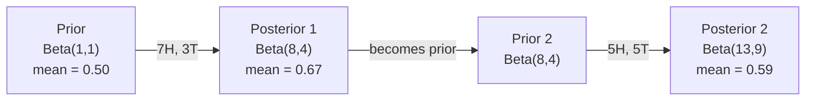

# Teorema Bayes

> Probabilitas adalah tentang apa yang kamu harapkan. Teorema Bayes adalah tentang apa yang kamu pelajari.

**Type:** Build
**Language:** Python
**Prerequisites:** Fase 1, Lesson 06 (Dasar-Dasar Probabilitas)
**Waktu:** ~75 menit

## Tujuan Pembelajaran

- Terapkan teorema Bayes untuk menghitung probabilitas posterior dari prioritas, kemungkinan, dan bukti
- Membangun pengklasifikasi teks Naive Bayes dari awal dengan penghalusan Laplace dan komputasi ruang log
- Bandingkan estimasi MLE dan MAP dan jelaskan bagaimana MAP berhubungan dengan regularisasi L2
- Menerapkan pembaruan Bayesian berurutan menggunakan konjugat Beta-Binomial sebelumnya untuk pengujian A/B

## Masalah

Tes medis 99% akurat. Hasil tes kamu positif. Seberapa besar kemungkinan kamu benar-benar mengidap penyakit tersebut?

Kebanyakan orang mengatakan 99%. Jawaban sebenarnya tergantung pada seberapa langka penyakit ini. Jika 1 dari 10.000 orang mengidapnya, hasil positif hanya memberi kamu sekitar 1% kemungkinan sakit. 99% hasil positif lainnya merupakan peringatan palsu dari orang sehat.

Ini bukan pertanyaan jebakan. Itu adalah teorema Bayes. Setiap filter spam, setiap diagnostik medis, setiap model machine learning yang mengukur ketidakpastian menggunakan alasan yang tepat ini. kamu memulai dengan keyakinan. kamu melihat bukti. kamu memperbarui.

Jika kamu membangun sistem ML tanpa memahami hal ini, kamu akan salah menafsirkan output model, menetapkan ambang batas yang buruk, dan memberikan prediksi yang terlalu percaya diri.

## Konsep

### Dari probabilitas gabungan hingga Bayes

kamu telah mengetahui dari Lesson 06 bahwa probabilitas bersyarat adalah:

```
P(A|B) = P(A and B) / P(B)
```

Dan secara simetris:

```
P(B|A) = P(A and B) / P(A)
```

Kedua ekspresi memiliki pembilang yang sama: P(A dan B). Atur keduanya sama dan atur ulang:

```
P(A and B) = P(A|B) * P(B) = P(B|A) * P(A)

Therefore:

P(A|B) = P(B|A) * P(A) / P(B)
```

Itu adalah teorema Bayes. Empat besaran, satu persamaan.

### Empat bagian

| Bagian | Nama | Artinya |
|------|------|---------------|
| P(A\|B) | Belakang | Keyakinan kamu yang diperbarui tentang A setelah melihat bukti B |
| P(B\|A) | Kemungkinan | Seberapa besar kemungkinan bukti B jika A benar |
| P(A) | Sebelumnya | Keyakinan anda tentang A sebelum melihat bukti apapun |
| P(B) | Bukti | Probabilitas total melihat B dalam semua kemungkinan |

Istilah bukti P(B) bertindak sebagai normalizer. kamu dapat mengembangkannya menggunakan hukum probabilitas total:

```
P(B) = P(B|A) * P(A) + P(B|not A) * P(not A)
```

### Contoh tes kesehatan

Suatu penyakit menyerang 1 dari 10.000 orang. Tes ini 99% akurat (menangkap 99% orang sakit, memberikan hasil positif palsu 1%).

```
P(sick)          = 0.0001     (prior: disease is rare)
P(positive|sick) = 0.99       (likelihood: test catches it)
P(positive|healthy) = 0.01    (false positive rate)

P(positive) = P(positive|sick) * P(sick) + P(positive|healthy) * P(healthy)
            = 0.99 * 0.0001 + 0.01 * 0.9999
            = 0.000099 + 0.009999
            = 0.010098

P(sick|positive) = P(positive|sick) * P(sick) / P(positive)
                 = 0.99 * 0.0001 / 0.010098
                 = 0.0098
                 = 0.98%
```

Kurang dari 1%. Yang sebelumnya mendominasi. Ketika suatu kondisi jarang terjadi, bahkan tes yang akurat pun sebagian besar menghasilkan hasil positif palsu. Inilah sebabnya mengapa dokter memerintahkan tes konfirmasi.

### Contoh filter spam

kamu menerima email yang berisi kata "lotere". Apakah itu spam?

```
P(spam)                = 0.3      (30% of email is spam)
P("lottery"|spam)      = 0.05     (5% of spam emails contain "lottery")
P("lottery"|not spam)  = 0.001    (0.1% of legitimate emails contain "lottery")

P("lottery") = 0.05 * 0.3 + 0.001 * 0.7
             = 0.015 + 0.0007
             = 0.0157

P(spam|"lottery") = 0.05 * 0.3 / 0.0157
                  = 0.955
                  = 95.5%
```

Satu kata mengubah probabilitas dari 30% menjadi 95,5%. Filter spam sebenarnya menerapkan Bayes pada ratusan kata secara bersamaan.

### Naive Bayes: asumsi independensi

Naive Bayes memperluas ini ke beberapa feature dengan mengasumsikan semua feature independen secara kondisional berdasarkan kelasnya:

```
P(class | feature_1, feature_2, ..., feature_n)
  = P(class) * P(feature_1|class) * P(feature_2|class) * ... * P(feature_n|class)
    / P(feature_1, feature_2, ..., feature_n)
```

Bagian yang “naif” adalah asumsi independensi. Dalam teks, kemunculan kata tidak berdiri sendiri ("Baru" dan "York" berkorelasi). Namun asumsi tersebut bekerja dengan sangat baik dalam praktiknya karena pengklasifikasi hanya perlu memberi peringkat pada kelas, bukan menghasilkan probabilitas yang dikalibrasi.

Karena penyebutnya sama untuk semua kelas, kamu dapat melewatinya dan membandingkan pembilangnya saja:

```
score(class) = P(class) * product of P(feature_i | class)
```

Pilih kelas dengan skor tertinggi.

### Estimasi kemungkinan maksimum (MLE)Bagaimana kamu mendapatkan P(feature|kelas) dari training data? Menghitung.

```
P("free"|spam) = (number of spam emails containing "free") / (total spam emails)
```

Inilah MLE: pilih nilai parameter yang paling mungkin membuat data observasi. kamu memaksimalkan fungsi kemungkinan, yang untuk penghitungan diskrit dikurangi menjadi frekuensi relatif.

Masalah: jika sebuah kata tidak pernah muncul di spam selama training, MLE memberikan probabilitas nol. Satu kata yang tidak terlihat membunuh keseluruhan produk. Perbaiki ini dengan pemulusan Laplace:

```
P(word|class) = (count(word, class) + 1) / (total_words_in_class + vocabulary_size)
```

Menambahkan 1 ke setiap penghitungan memastikan tidak ada probabilitas yang nol.

### Maksimum a posteriori (MAP)

MLE bertanya: parameter apa yang memaksimalkan P(data|parameter)?

MAP bertanya: parameter apa yang memaksimalkan P(parameter|data)?

Menurut teorema Bayes:

```
P(parameters|data) proportional to P(data|parameters) * P(parameters)
```

MAP menambahkan prioritas pada parameter itu sendiri. Jika kamu yakin parameternya harus kecil, kamu menyandikannya sebagai prior yang menghukum nilai besar. Ini identik dengan regularisasi L2 di ML. Penalti "punggungan" dalam regresi punggungan secara harafiah merupakan prior Gaussian pada weight.

| Estimasi | Mengoptimalkan | Setara dengan ML |
|------------|-----------|---------------|
| MLE | P(data\|params) | Training tidak teratur |
| PETA | P(data\|param) * P(param) | Regularisasi L2 / L1 |

### Bayesian vs frequentist: perbedaan praktisnya

Para penganut frequentist memperlakukan parameter sebagai sesuatu yang tidak diketahui. Mereka bertanya: "Jika saya mengulangi percobaan ini berkali-kali, apa yang akan terjadi?"

Bayesian memperlakukan parameter sebagai distribusi. Mereka bertanya: "Mengingat apa yang telah saya amati, apa yang saya yakini tentang parameternya?"

Untuk membangun sistem ML, perbedaan praktisnya:

| Aspek | Sering | Bayesian |
|--------|-------------|----------|
| Output | Perkiraan poin | Distribusi nilai |
| Ketidakpastian | Interval kepercayaan (tentang prosedur) | Interval yang kredibel (tentang parameter) |
| Data kecil | Bisa overfit | Sebelumnya bertindak sebagai regularisasi |
| Perhitungan | Biasanya lebih cepat | Sering memerlukan sampling (MCMC) |

Sebagian besar ML produksi bersifat frequentist (SGD, perkiraan poin). Metode Bayesian unggul ketika kamu membutuhkan ketidakpastian yang terkalibrasi (keputusan medis, sistem yang kritis terhadap keselamatan) atau ketika data langka (pembelajaran beberapa kali, cold start).

### Mengapa pemikiran Bayesian penting bagi ML

Hubungannya lebih dalam dari analogi:

**Prior adalah regularisasi.** Prior Gaussian pada weight adalah regularisasi L2. Prior Laplace adalah L1. Setiap kali kamu menambahkan istilah regularisasi, kamu membuat pernyataan Bayesian tentang nilai parameter yang kamu harapkan.

**Posterior adalah ketidakpastian.** Satu prediksi probabilitas tidak memberi tahu kamu seberapa yakin model terhadap estimasi tersebut. Metode Bayesian memberi kamu distribusi: "Saya pikir P(spam) adalah antara 0,8 dan 0,95."

**Pembaruan Bayes adalah pembelajaran online.** Posterior hari ini menjadi prioritas masa depan. Saat model kamu melihat data baru, model tersebut memperbarui keyakinannya secara bertahap, bukan melakukan training ulang dari awal.

**Perbandingan model menggunakan Bayesian.** Kriteria informasi Bayesian (BIC), kemungkinan marjinal, dan faktor Bayes semuanya menggunakan penalaran Bayesian untuk memilih model tanpa overfitting.

## Build

### Langkah 1: Fungsi teorema Bayes

```python
def bayes(prior, likelihood, false_positive_rate):
    evidence = likelihood * prior + false_positive_rate * (1 - prior)
    posterior = likelihood * prior / evidence
    return posterior

result = bayes(prior=0.0001, likelihood=0.99, false_positive_rate=0.01)
print(f"P(sick|positive) = {result:.4f}")
```

### Langkah 2: Pengklasifikasi Naive Bayes

```python
import math
from collections import defaultdict

class NaiveBayes:
    def __init__(self, smoothing=1.0):
        self.smoothing = smoothing
        self.class_counts = defaultdict(int)
        self.word_counts = defaultdict(lambda: defaultdict(int))
        self.class_word_totals = defaultdict(int)
        self.vocab = set()

    def train(self, documents, labels):
        for doc, label in zip(documents, labels):
            self.class_counts[label] += 1
            words = doc.lower().split()
            for word in words:
                self.word_counts[label][word] += 1
                self.class_word_totals[label] += 1
                self.vocab.add(word)

    def predict(self, document):
        words = document.lower().split()
        total_docs = sum(self.class_counts.values())
        vocab_size = len(self.vocab)
        best_class = None
        best_score = float("-inf")
        for cls in self.class_counts:
            score = math.log(self.class_counts[cls] / total_docs)
            for word in words:
                count = self.word_counts[cls].get(word, 0)
                total = self.class_word_totals[cls]
                score += math.log((count + self.smoothing) / (total + self.smoothing * vocab_size))
            if score > best_score:
                best_score = score
                best_class = cls
        return best_class
```

Probabilitas log mencegah underflow. Mengalikan banyak probabilitas kecil menghasilkan angka yang terlalu kecil untuk floating point. Menjumlahkan probabilitas log stabil secara numerik dan setara secara matematis.

### Langkah 3: Latih data spam

```python
train_docs = [
    "win free money now",
    "free lottery ticket winner",
    "claim your prize today free",
    "urgent offer free cash",
    "congratulations you won free",
    "meeting tomorrow at noon",
    "project update attached",
    "can we schedule a call",
    "quarterly report review",
    "lunch on thursday sounds good",
    "team standup notes attached",
    "please review the pull request",
]

train_labels = [
    "spam", "spam", "spam", "spam", "spam",
    "ham", "ham", "ham", "ham", "ham", "ham", "ham",
]

classifier = NaiveBayes()
classifier.train(train_docs, train_labels)

test_messages = [
    "free money waiting for you",
    "meeting rescheduled to friday",
    "you won a free prize",
    "please review the attached report",
]

for msg in test_messages:
    print(f"  '{msg}' -> {classifier.predict(msg)}")
```

### Langkah 4: Periksa probabilitas yang dipelajari

```python
def show_top_words(classifier, cls, n=5):
    vocab_size = len(classifier.vocab)
    total = classifier.class_word_totals[cls]
    probs = {}
    for word in classifier.vocab:
        count = classifier.word_counts[cls].get(word, 0)
        probs[word] = (count + classifier.smoothing) / (total + classifier.smoothing * vocab_size)
    sorted_words = sorted(probs.items(), key=lambda x: x[1], reverse=True)
    for word, prob in sorted_words[:n]:
        print(f"    {word}: {prob:.4f}")

print("\nTop spam words:")
show_top_words(classifier, "spam")
print("\nTop ham words:")
show_top_words(classifier, "ham")
```

## Pakai

Scikit-learn mengirimkan implementasi naif Bayes yang siap produksi:

```python
from sklearn.feature_extraction.text import CountVectorizer
from sklearn.naive_bayes import MultinomialNB
from sklearn.metrics import classification_report

vectorizer = CountVectorizer()
X_train = vectorizer.fit_transform(train_docs)
clf = MultinomialNB()
clf.fit(X_train, train_labels)

X_test = vectorizer.transform(test_messages)
predictions = clf.predict(X_test)
for msg, pred in zip(test_messages, predictions):
    print(f"  '{msg}' -> {pred}")
```

Algoritma yang sama. CountVectorizer menangani tokenization dan pengembangan kosakata. MultinomialNB menangani pemulusan dan probabilitas log secara internal. Versi awal kamu melakukan hal yang sama dalam 40 baris.

## Kirim

Kelas NaiveBayes yang dibangun di sini menunjukkan alur lengkap: tokenization, estimasi probabilitas dengan pemulusan Laplace, prediksi ruang log. Code di `code/bayes.py` berjalan end-to-end tanpa ketergantungan di luar pustaka standar Python.

### Konjugasi Prior

Jika prior dan posterior termasuk dalam kelompok distribusi yang sama, maka prior disebut "konjugasi". Hal ini membuat pembaruan Bayesian bersih secara aljabar -- kamu mendapatkan posterior bentuk tertutup tanpa integrasi numerik.

| Kemungkinan | Konjugasi Sebelumnya | Belakang | Contoh |
|-----------|----------------|-----------|---------|
| Bernoulli | Beta(a,b) | Beta(a + berhasil, b + gagal) | Estimasi bias flip koin |
| Normal (varians diketahui) | Biasa(mu_0, sigma_0) | Normal(rata-rata tertimbang, varians lebih kecil) | Kalibrasi sensor |
| racun | Gamma(a,b) | Gamma(a + jumlah hitungan, b + n) | Memodelkan tingkat kedatangan |
| Multinomial | Dirichlet(alpha) | Dirichlet(alpha + jumlah) | Pemodelan topik, model bahasa |

Mengapa ini penting: tanpa konjugasi prior, kamu memerlukan pengambilan sample Monte Carlo atau inference variasional untuk memperkirakan posterior. Dengan konjugasi prior, kamu cukup memperbarui dua angka.

Distribusi Beta adalah konjugat yang paling umum digunakan sebelumnya dalam praktik. Beta(a, b) mewakili keyakinan kamu tentang parameter probabilitas. Rata-ratanya adalah a/(a+b). Semakin besar a+b, semakin terkonsentrasi (yakin) distribusinya.

Kasus khusus dari Beta sebelumnya:
- Beta(1, 1) = seragam. kamu tidak memiliki pendapat tentang parameternya.
- Beta(10, 10) = mencapai puncaknya pada 0,5. kamu sangat yakin bahwa parameternya mendekati 0,5.
- Beta(1, 10) = condong ke arah 0. kamu yakin parameternya kecil.

Aturan pembaruan sangat sederhana:

```
Prior:     Beta(a, b)
Data:      s successes, f failures
Posterior: Beta(a + s, b + f)
```

Tidak ada integral. Tidak ada pengambilan sample. Hanya tambahan.

### Pembaruan Bayesian Berurutan

Inference Bayesian secara alami bersifat berurutan. Bagian belakang hari ini menjadi bagian belakang hari esok. Inilah cara sistem nyata belajar secara bertahap tanpa memproses ulang semua data historis.

Contoh nyata: memperkirakan apakah suatu koin itu adil.

**Hari 1: Belum ada data.**
Mulailah dengan Beta(1, 1) -- seragam sebelumnya. kamu tidak punya pendapat.
- Rata-rata sebelumnya: 0,5
- Prior datar di [0, 1]

**Hari ke-2: Amati 7 kepala, 3 ekor.**
Posterior = Beta(1 + 7, 1 + 3) = Beta(8, 4)
- Rata-rata posterior: 8/12 = 0,667
- Bukti menunjukkan bahwa koin tersebut bias terhadap kepala

**Hari ke-3: Amati 5 kepala lagi, 5 ekor lagi.**
Gunakan posterior kemarin sebagai sebelumnya hari ini.
Posterior = Beta(8 + 5, 4 + 5) = Beta(13, 9)
- Rata-rata posterior: 13/22 = 0,591
- Data baru yang seimbang menarik estimasi tersebut kembali ke 0,5



Urutan pengamatan tidak menjadi masalah. Beta(1,1) diperbarui dengan 12 kepala dan 8 ekor sekaligus memberikan Beta(13, 9) -- hasil yang sama. Pembaruan berurutan dan pembaruan batch setara secara matematis. Namun pembaruan berurutan memungkinkan kamu mengambil keputusan di setiap langkah tanpa menyimpan data mentah.

Ini adalah dasar pembelajaran online dalam sistem ML produksi. Pengambilan sample Thompson untuk bandit, sistem rekomendasi tambahan, dan detektor anomali streaming semuanya menggunakan pola ini.

### Koneksi ke Pengujian A/B

Pengujian A/B adalah inference Bayesian yang terselubung.Penyiapan: kamu sedang menguji dua warna tombol. Varian A (biru) dan varian B (hijau). kamu ingin tahu mana yang mendapat lebih banyak klik.

Tes A/B Bayesian:

1. **Sebelumnya.** Mulai dengan Beta(1, 1) untuk kedua varian. Tidak ada preferensi sebelumnya.
2. **Data.** Varian A: 50 klik dari 1000 tampilan. Varian B: 65 klik dari 1000 tampilan.
3. **Posterior.**
   - J: Beta(1 + 50, 1 + 950) = Beta(51, 951). Rata-rata = 0,051
   - B: Beta(1 + 65, 1 + 935) = Beta(66, 936). Rata-rata = 0,066
4. **Keputusan.** Hitung P(B > A) -- probabilitas tingkat konversi B yang sebenarnya lebih tinggi daripada A.

Menghitung P(B > A) secara analitis itu sulit. Tapi Monte Carlo menjadikannya sepele:

```
1. Draw 100,000 samples from Beta(51, 951)  -> samples_A
2. Draw 100,000 samples from Beta(66, 936)  -> samples_B
3. P(B > A) = fraction of samples where B > A
```

Jika P(B > A) > 0,95, kamu mengirimkan varian B. Jika antara 0,05 dan 0,95, kamu tetap mengumpulkan data. Jika P(B > A) < 0,05, kamu mengirimkan varian A.

Keuntungan dibandingkan pengujian A/B yang sering dilakukan:
- kamu mendapatkan pernyataan probabilitas langsung: "ada 97% kemungkinan B lebih baik"
- Tidak ada perplexity nilai p. Tidak ada lindung nilai "gagal menolak hipotesis nol".
- kamu dapat memeriksa hasilnya kapan saja tanpa meningkatkan tingkat positif palsu (tidak ada "masalah mengintip")
- kamu dapat menggabungkan pengetahuan sebelumnya (misalnya, pengujian sebelumnya menunjukkan tingkat konversi biasanya 3-8%)

| Aspek | A/B yang sering dikunjungi | Bayesian A/B |
|--------|----------------|--------------|
| Output | nilai-p | P(B > SEBUAH) |
| Interpretasi | “Betapa mengejutkannya data ini jika A=B?” | “Seberapa besar kemungkinan B lebih baik daripada A?” |
| Berhenti lebih awal | Mengembang positif palsu | Aman kapan saja (mengingat model yang dipilih dengan baik sebelumnya dan ditentukan dengan benar) |
| Pengetahuan sebelumnya | Tidak digunakan | Dikodekan sebagai Beta sebelumnya |
| Aturan pengambilan keputusan | hal < 0,05 | P(B > A) > ambang batas |

## Latihan

1. **Beberapa tes.** Seorang pasien mendapat hasil positif dua kali pada tes independen (keduanya 99% akurat, prevalensi penyakit 1 dalam 10.000). Apa P(sakit) setelah kedua tes tersebut? Gunakan bagian posterior dari tes pertama sebagai bagian sebelumnya untuk tes kedua.

2. **Dampak penghalusan.** Jalankan pengklasifikasi spam dengan nilai penghalusan 0,01, 0,1, 1,0, dan 10,0. Bagaimana probabilitas kata teratas berubah? Apa yang terjadi dengan smoothing=0 dan kata yang hanya muncul di ham?

3. **Tambahkan feature.** Perluas kelas NaiveBayes untuk juga menggunakan panjang pesan (pendek/panjang) sebagai feature bersama jumlah kata. Perkirakan P(short|spam) dan P(short|ham) dari training data dan masukkan ke dalam skor prediksi.

4. **PETA dengan tangan.** Berdasarkan data observasi (7 kepala dalam 10 lemparan koin), hitung estimasi bias MAP menggunakan Beta(2,2) sebelumnya. Bandingkan dengan estimasi MLE (7/10).

## Istilah Kunci| Istilah | Apa kata orang | Apa sebenarnya arti |
|------|----------------|----------------------|
| Sebelumnya | "Tebakan awal saya" | P(hipotesis) sebelum mengamati bukti. Dalam ML: istilah regularisasi. |
| Kemungkinan | "Seberapa cocok datanya" | P(bukti\|hipotesis). Seberapa besar kemungkinan data yang diamati berada di bawah hipotesis tertentu. |
| Belakang | "Keyakinan saya yang diperbarui" | P(hipotesis\|bukti). Prior dikalikan dengan kemungkinan, lalu dinormalisasi. |
| Bukti | "Konstanta normalisasi" | P(data) di semua hipotesis. Memastikan jumlah posterior menjadi 1. |
| Naif Bayes | "Pengklasifikasi teks sederhana itu" | Pengklasifikasi yang mengasumsikan feature bersifat independen berdasarkan kelasnya. Berfungsi dengan baik meskipun ada asumsi yang salah. |
| Pemulusan Laplace | "Tambahkan satu pemulusan" | Menambahkan jumlah kecil ke setiap feature untuk mencegah nol probabilitas dari data yang tidak terlihat. |
| MLE | "Gunakan saja frekuensinya" | Pilih parameter yang memaksimalkan P(data\|parameter). Tidak sebelumnya. Dapat melakukan overfit dengan data kecil. |
| PETA | "MLE dengan sebelumnya" | Pilih parameter yang memaksimalkan P(data\|parameters) * P(parameter). Setara dengan MLE yang diregulasi. |
| Log-probabilitas | "Bekerja di ruang log" | Menggunakan log(P) alih-alih P untuk menghindari underflow floating-point saat mengalikan banyak angka kecil. |
| Positif palsu | "Alarm salah" | Tesnya bilang positif, tapi keadaan sebenarnya negatif. Mendorong kekeliruan tarif dasar. |

## Bacaan Lanjutan

- [3Blue1Brown: Teorema Bayes](https://www.youtube.com/watch?v=HZGCoVF3YvM) - penjelasan visual dengan contoh tes medis
- [Stanford CS229: Algoritma Pembelajaran Generatif](https://cs229.stanford.edu/notes2022fall/cs229-notes2.pdf) - Naive Bayes dan kaitannya dengan model diskriminatif
- [Think Bayes](https://greenteapress.com/wp/think-bayes/) - buku gratis, statistik Bayesian dengan code Python
- [scikit-learn Naive Bayes](https://scikit-learn.org/stable/modules/naive_bayes.html) - implementasi produksi dan kapan menggunakan setiap varian
