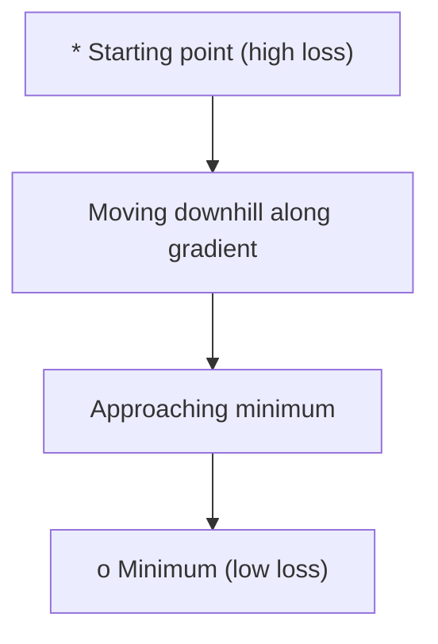
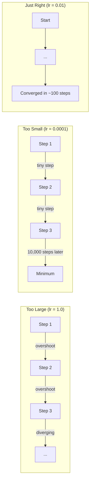
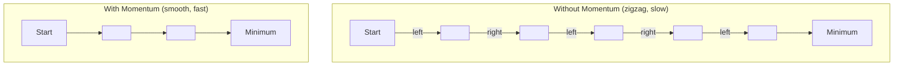
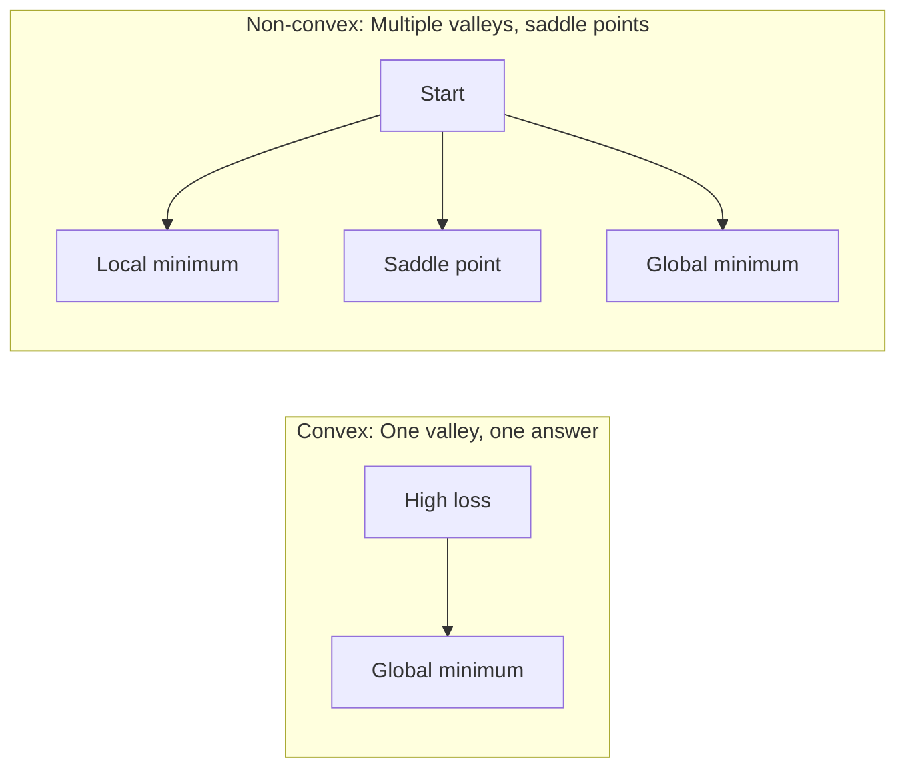
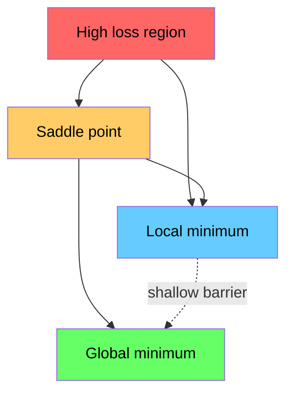

# Optimization

> Melatih neural network pada dasarnya adalah mencari dasar sebuah lembah.

**Type:** Build
**Language:** Python
**Prerequisites:** Phase 1, Lessons 04-05 (Derivatives, Gradients)
**Time:** ~75 menit

## Tujuan Pembelajaran

- Mengimplementasikan vanilla gradient descent, SGD with momentum, dan Adam from scratch
- Membandingkan convergence optimizer pada Rosenbrock function dan menjelaskan mengapa Adam menyesuaikan learning rate per weight
- Membedakan convex dan non-convex loss landscape, serta menjelaskan peran saddle point pada high-dimensional
- Mengatur learning rate schedule seperti step decay, cosine annealing, dan warmup agar training lebih stabil

## Masalah

Kamu punya loss function. Loss memberi tahu seberapa salah modelmu. Kamu punya gradient. Gradient memberi tahu arah mana yang membuat loss semakin buruk. Sekarang kamu butuh strategi untuk berjalan turun ke dasar lembah.

Pendekatan paling sederhana adalah bergerak berlawanan arah dengan gradient. Besar langkahnya dikalikan dengan angka bernama learning rate. Lalu ulangi. Itulah gradient descent. Ia bekerja, tetapi ada syaratnya. Kalau learning rate terlalu besar, langkahmu melompati lembah dan memantul di antara dindingnya. Kalau terlalu kecil, model merangkak menuju jawaban lewat ribuan langkah yang tidak perlu. Kalau berhenti di saddle point, proses terlihat macet walaupun minimum belum ditemukan.

Setiap optimizer dalam deep learning menjawab pertanyaan yang sama: bagaimana cara mencapai dasar lembah lebih cepat dan lebih andal?

## Konsep

### Apa arti optimization

Optimization adalah proses mencari nilai input yang membuat sebuah function bernilai minimum atau maksimum. Dalam machine learning, function itu adalah loss. Input-nya adalah weight model. Training adalah optimization.

```
minimize L(w) where:
  L = loss function
  w = model weights (could be millions of parameters)
```

### Gradient descent (vanilla)

Ini optimizer paling sederhana. Hitung gradient loss terhadap setiap weight. Geser setiap weight ke arah yang berlawanan dari gradient-nya. Besar langkahnya ditentukan oleh learning rate.

```
w = w - lr * gradient
```

Itu seluruh algoritmanya. Satu baris.



### Learning rate: hyperparameter paling penting

Learning rate mengontrol ukuran langkah. Nilai ini sangat menentukan apakah training cepat converge, lambat, atau malah tidak stabil.



Tidak ada formula tunggal untuk learning rate yang selalu benar. Biasanya kamu menemukannya lewat eksperimen. Titik awal yang umum: 0.001 untuk Adam, 0.01 untuk SGD with momentum.

### SGD vs batch vs mini-batch

Vanilla gradient descent menghitung gradient dari seluruh dataset sebelum mengambil satu langkah. Ini disebut batch gradient descent. Stabil, tetapi lambat.

Stochastic gradient descent (SGD) menghitung gradient dari satu sample acak, lalu langsung mengambil langkah. Lebih noisy, tetapi cepat.

Mini-batch gradient descent berada di tengah. Gradient dihitung dari batch kecil, misalnya 32, 64, 128, atau 256 sample, lalu optimizer mengambil langkah. Inilah yang paling sering dipakai dalam praktik.

| Variant | Batch size | Gradient quality | Speed per step | Noise |
|---------|-----------|-----------------|---------------|-------|
| Batch GD | Seluruh dataset | Akurat | Lambat | Tidak ada |
| SGD | 1 sample | Sangat noisy | Cepat | Tinggi |
| Mini-batch | 32-256 | Estimasi bagus | Seimbang | Sedang |

Noise pada SGD dan mini-batch bukan bug. Noise ini membantu optimizer keluar dari local minimum yang dangkal dan saddle point.

### Momentum: bola yang menggelinding turun

Vanilla gradient descent hanya melihat gradient saat ini. Kalau gradient bergerak zigzag, yang sering terjadi di lembah sempit, progress menjadi lambat. Momentum memperbaiki ini dengan mengakumulasi gradient sebelumnya ke dalam velocity term.

```
v = beta * v + gradient
w = w - lr * v
```

Analogi sederhananya: bola yang menggelinding turun. Bola tidak berhenti dan mulai dari nol setiap kali melewati gundukan kecil. Ia membangun kecepatan pada arah yang konsisten dan meredam osilasi.



`beta` biasanya 0.9. Nilai ini mengontrol seberapa banyak riwayat gradient yang disimpan. Beta lebih tinggi berarti momentum lebih besar dan jalur lebih halus, tetapi respons terhadap perubahan arah menjadi lebih lambat.

### Adam: adaptive learning rates

Setiap weight bisa membutuhkan learning rate yang berbeda. Weight yang jarang mendapat gradient besar perlu mengambil langkah lebih besar ketika gradient itu muncul. Weight yang terus-menerus mendapat gradient besar perlu mengambil langkah lebih kecil.

Adam (Adaptive Moment Estimation) melacak dua hal untuk setiap weight:

1. First moment (m): running average dari gradient, mirip momentum
2. Second moment (v): running average dari squared gradient, yaitu ukuran besar kecilnya gradient

```
m = beta1 * m + (1 - beta1) * gradient
v = beta2 * v + (1 - beta2) * gradient^2

m_hat = m / (1 - beta1^t)    bias correction
v_hat = v / (1 - beta2^t)    bias correction

w = w - lr * m_hat / (sqrt(v_hat) + epsilon)
```

Inti Adam ada pada pembagian dengan `sqrt(v_hat)`. Weight dengan gradient besar dibagi angka besar, sehingga effective step-nya kecil. Weight dengan gradient kecil dibagi angka kecil, sehingga effective step-nya lebih besar. Dengan begitu, setiap weight memiliki adaptive learning rate sendiri.

Default hyperparameter: `lr=0.001, beta1=0.9, beta2=0.999, epsilon=1e-8`. Default ini cukup baik untuk banyak masalah.

### Learning rate schedules

Learning rate tetap adalah kompromi. Pada awal training, kamu ingin langkah besar agar progress cepat. Menjelang akhir training, kamu ingin langkah kecil agar model bisa fine-tune dekat minimum.

Schedule yang umum:

| Schedule | Formula | Use case |
|----------|---------|----------|
| Step decay | lr = lr * factor setiap N epoch | Sederhana, kontrol manual |
| Exponential decay | lr = lr_0 * decay^t | Penurunan halus |
| Cosine annealing | lr = lr_min + 0.5 * (lr_max - lr_min) * (1 + cos(pi * t / T)) | Transformers, training modern |
| Warmup + decay | Linear ramp up, lalu decay | Large models, mencegah instability di awal |

### Convex vs non-convex

Convex function hanya punya satu minimum. Gradient descent selalu bisa menemukannya. Function kuadrat seperti `f(x) = x^2` adalah contoh convex.

Loss function pada neural network bersifat non-convex. Di dalamnya ada banyak local minimum, saddle point, dan area datar.



Dalam praktiknya, local minimum pada neural network berdimensi tinggi jarang menjadi masalah utama. Banyak local minimum memiliki nilai loss yang dekat dengan global minimum. Hambatan yang lebih nyata adalah saddle point: datar di beberapa arah, tetapi melengkung di arah lain. Momentum dan noise dari mini-batch membantu optimizer melewatinya.

### Visualisasi loss landscape

Loss adalah function dari semua weight. Untuk model dengan 1 juta weight, loss landscape hidup di ruang berdimensi 1,000,001. Agar bisa divisualisasikan, kita memilih dua arah acak dalam weight space, lalu memplot loss di sepanjang dua arah tersebut. Hasilnya adalah permukaan 2D.



Sharp minima cenderung generalize lebih buruk. Flat minima cenderung generalize lebih baik. Ini salah satu alasan SGD with momentum sering mengalahkan Adam pada final test accuracy: noise dari SGD membantu model tidak menetap di minimum yang terlalu tajam.

## Build

### Langkah 1: Definisikan test function

Rosenbrock function adalah benchmark klasik untuk optimization. Minimum-nya berada di titik (1, 1), di dalam lembah sempit melengkung yang mudah ditemukan tetapi sulit diikuti.

```
f(x, y) = (1 - x)^2 + 100 * (y - x^2)^2
```

```python
def rosenbrock(params):
    x, y = params
    return (1 - x) ** 2 + 100 * (y - x ** 2) ** 2

def rosenbrock_gradient(params):
    x, y = params
    df_dx = -2 * (1 - x) + 200 * (y - x ** 2) * (-2 * x)
    df_dy = 200 * (y - x ** 2)
    return [df_dx, df_dy]
```

### Langkah 2: Vanilla gradient descent

```python
class GradientDescent:
    def __init__(self, lr=0.001):
        self.lr = lr

    def step(self, params, grads):
        return [p - self.lr * g for p, g in zip(params, grads)]
```

### Langkah 3: SGD with momentum

```python
class SGDMomentum:
    def __init__(self, lr=0.001, momentum=0.9):
        self.lr = lr
        self.momentum = momentum
        self.velocity = None

    def step(self, params, grads):
        if self.velocity is None:
            self.velocity = [0.0] * len(params)
        self.velocity = [
            self.momentum * v + g
            for v, g in zip(self.velocity, grads)
        ]
        return [p - self.lr * v for p, v in zip(params, self.velocity)]
```

### Langkah 4: Adam

```python
class Adam:
    def __init__(self, lr=0.001, beta1=0.9, beta2=0.999, epsilon=1e-8):
        self.lr = lr
        self.beta1 = beta1
        self.beta2 = beta2
        self.epsilon = epsilon
        self.m = None
        self.v = None
        self.t = 0

    def step(self, params, grads):
        if self.m is None:
            self.m = [0.0] * len(params)
            self.v = [0.0] * len(params)

        self.t += 1

        self.m = [
            self.beta1 * m + (1 - self.beta1) * g
            for m, g in zip(self.m, grads)
        ]
        self.v = [
            self.beta2 * v + (1 - self.beta2) * g ** 2
            for v, g in zip(self.v, grads)
        ]

        m_hat = [m / (1 - self.beta1 ** self.t) for m in self.m]
        v_hat = [v / (1 - self.beta2 ** self.t) for v in self.v]

        return [
            p - self.lr * mh / (vh ** 0.5 + self.epsilon)
            for p, mh, vh in zip(params, m_hat, v_hat)
        ]
```

### Langkah 5: Jalankan dan bandingkan

```python
def optimize(optimizer, func, grad_func, start, steps=5000):
    params = list(start)
    history = [params[:]]
    for _ in range(steps):
        grads = grad_func(params)
        params = optimizer.step(params, grads)
        history.append(params[:])
    return history

start = [-1.0, 1.0]

gd_history = optimize(GradientDescent(lr=0.0005), rosenbrock, rosenbrock_gradient, start)
sgd_history = optimize(SGDMomentum(lr=0.0001, momentum=0.9), rosenbrock, rosenbrock_gradient, start)
adam_history = optimize(Adam(lr=0.01), rosenbrock, rosenbrock_gradient, start)

for name, history in [("GD", gd_history), ("SGD+M", sgd_history), ("Adam", adam_history)]:
    final = history[-1]
    loss = rosenbrock(final)
    print(f"{name:6s} -> x={final[0]:.6f}, y={final[1]:.6f}, loss={loss:.8f}")
```

Hasil yang diharapkan: Adam converge paling cepat. SGD with momentum mengikuti jalur yang lebih halus. Vanilla GD bergerak lambat di sepanjang lembah sempit.

## Pakai

Dalam praktik, gunakan optimizer bawaan PyTorch atau JAX. Library ini sudah menangani parameter groups, weight decay, gradient clipping, dan GPU acceleration.

```python
import torch

model = torch.nn.Linear(784, 10)

sgd = torch.optim.SGD(model.parameters(), lr=0.01, momentum=0.9)
adam = torch.optim.Adam(model.parameters(), lr=0.001)
adamw = torch.optim.AdamW(model.parameters(), lr=0.001, weight_decay=0.01)

scheduler = torch.optim.lr_scheduler.CosineAnnealingLR(adam, T_max=100)
```

Aturan praktis:

- Mulai dengan Adam (`lr=0.001`). Ini cukup baik untuk sebagian besar masalah tanpa banyak tuning.
- Beralih ke SGD with momentum (`lr=0.01`, `momentum=0.9`) saat kamu mengejar final accuracy terbaik dan punya waktu untuk tuning.
- Gunakan AdamW, yaitu Adam dengan decoupled weight decay, untuk Transformers.
- Gunakan learning rate schedule untuk training yang berjalan lebih lama dari beberapa epoch.
- Kalau training tidak stabil, turunkan learning rate. Kalau training terlalu lambat, naikkan.

## Kirim

Lesson ini menghasilkan panduan untuk memilih optimizer yang tepat. Lihat `outputs/prompt-optimizer-guide.md`.

Class optimizer yang dibuat di sini akan muncul lagi pada Phase 3 saat kita melatih neural network from scratch.

## Latihan

1. **Learning rate sweep.** Jalankan vanilla gradient descent pada Rosenbrock function dengan learning rate [0.0001, 0.0005, 0.001, 0.005, 0.01]. Plot atau cetak final loss setelah 5000 step untuk masing-masing nilai. Cari learning rate terbesar yang masih converge.

2. **Perbandingan momentum.** Jalankan SGD dengan nilai momentum [0.0, 0.5, 0.9, 0.99] pada Rosenbrock function. Lacak loss pada setiap step. Nilai momentum mana yang paling cepat converge? Nilai mana yang overshoot?

3. **Keluar dari saddle point.** Definisikan function `f(x, y) = x^2 - y^2`, dengan saddle point di origin. Mulai dari (0.01, 0.01). Bandingkan perilaku vanilla GD, SGD with momentum, dan Adam. Mana yang paling mudah keluar dari saddle point?

4. **Menerapkan learning rate decay.** Tambahkan exponential decay ke class GradientDescent: `lr = lr_0 * 0.999^step`. Bandingkan convergence dengan dan tanpa decay pada Rosenbrock function.

## Istilah Kunci

| Istilah | Yang sering orang katakan | Makna sebenarnya |
|------|----------------|----------------------|
| Gradient descent | "Turun ke bawah" | Update weight dengan mengurangi gradient yang sudah dikalikan learning rate. Ini optimizer paling dasar. |
| Learning rate | "Ukuran langkah" | Scalar yang mengontrol seberapa jauh setiap update menggeser weight. Terlalu besar membuat training diverge. Terlalu kecil membuang compute. |
| Momentum | "Terus menggelinding" | Mengakumulasi gradient masa lalu menjadi velocity vector. Meredam osilasi dan mempercepat gerak pada arah yang konsisten. |
| SGD | "Sampling acak" | Stochastic gradient descent. Gradient dihitung dari subset acak, bukan seluruh dataset. Dalam praktik, biasanya berarti mini-batch SGD. |
| Mini-batch | "Potongan data" | Sebagian kecil training data, misalnya 32-256 sample, dipakai untuk memperkirakan gradient. Menyeimbangkan kecepatan dan akurasi gradient. |
| Adam | "Optimizer default" | Adaptive Moment Estimation. Melacak running average dari gradient dan squared gradient per weight agar setiap weight punya learning rate efektif sendiri. |
| Bias correction | "Memperbaiki start dingin" | Moment pertama dan kedua Adam dimulai dari nol. Bias correction membagi dengan `(1 - beta^t)` untuk mengimbangi step awal. |
| Learning rate schedule | "Ubah lr seiring waktu" | Function yang menyesuaikan learning rate selama training. Langkah besar di awal, langkah kecil di akhir. |
| Convex function | "Satu lembah" | Function yang setiap local minimum-nya juga global minimum. Gradient descent selalu menemukannya. Loss neural network tidak convex. |
| Saddle point | "Datar tapi bukan minimum" | Titik dengan gradient nol, tetapi minimum di beberapa arah dan maksimum di arah lain. Umum pada high-dimensional. |
| Loss landscape | "Medan" | Loss function yang diplot terhadap weight space. Biasanya divisualisasikan dengan mengambil dua arah acak. |
| Convergence | "Sudah mendekati" | Optimizer mencapai titik ketika step berikutnya tidak lagi menurunkan loss secara berarti. |

## Bacaan Lanjutan

- [Sebastian Ruder: An overview of gradient descent optimization algorithms](https://ruder.io/optimizing-gradient-descent/) - survei lengkap optimizer utama
- [Why Momentum Really Works (Distill)](https://distill.pub/2017/momentum/) - visualisasi interaktif dinamika momentum
- [Adam: A Method for Stochastic Optimization (Kingma & Ba, 2014)](https://arxiv.org/abs/1412.6980) - paper asli Adam, pendek dan mudah dibaca
- [Visualizing the Loss Landscape of Neural Nets (Li et al., 2018)](https://arxiv.org/abs/1712.09913) - paper tentang sharp minima vs flat minima
