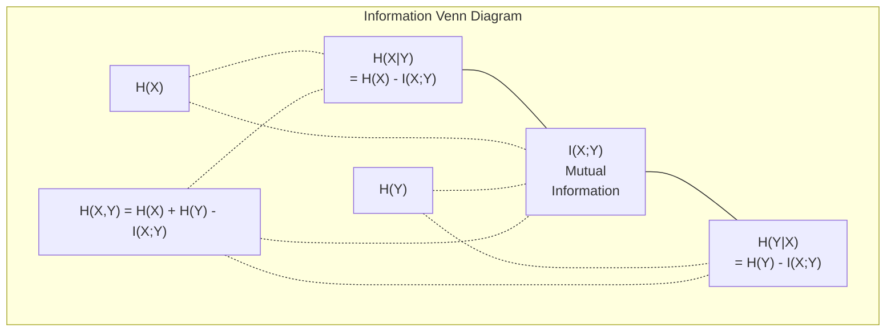

# Teori Informasi

> Teori informasi mengukur kejutan. Loss function dibangun di atasnya.

**Type:** Learn
**Language:** Python
**Prerequisites:** Fase 1, Lesson 06 (Probabilitas)
**Waktu:** ~60 menit

## Tujuan Pembelajaran

- Hitung entropi, entropi silang, dan divergensi KL dari awal dan jelaskan hubungannya
- Cari tahu mengapa meminimalkan loss lintas entropi sama dengan memaksimalkan kemungkinan log
- Hitung informasi timbal balik antara feature dan target untuk menentukan peringkat kepentingan feature
- Jelaskan perplexity sebagai ukuran kosakata efektif yang dipilih oleh model bahasa

## Masalah

kamu memanggil `CrossEntropyLoss()` di setiap model klasifikasi yang kamu latih. kamu melihat "perplexity" di setiap makalah model bahasa. kamu membaca tentang divergensi KL dalam VAE, distilasi, dan RLHF. Ini bukanlah konsep yang tidak berhubungan. Mereka semua mempunyai ide yang sama, memakai topi yang berbeda.

Teori informasi memberi kamu bahasa untuk bernalar tentang ketidakpastian, kompresi, dan prediksi. Claude Shannon menemukannya pada tahun 1948 untuk memecahkan masalah komunikasi. Ternyata, melatih neural network adalah masalah komunikasi: model mencoba mengirimkan label yang benar melalui pipeline berisik dari weight yang dipelajari.

Lesson ini menyusun setiap rumus dari awal sehingga kamu dapat mengetahui dari mana rumus tersebut berasal dan mengapa rumus tersebut berhasil.

## Konsep

### Isi Informasi (Kejutan)

Ketika sesuatu yang tidak terduga terjadi, hal itu membawa lebih banyak informasi. Kepala pendaratan koin? Tidak mengherankan. Kemenangan lotere? Sangat mengejutkan.

Kandungan informasi suatu kejadian dengan probabilitas p adalah:

```
I(x) = -log(p(x))
```

Menggunakan log base 2 memberi kamu bit. Menggunakan log natural memberi kamu nat. Ide yang sama, unit yang berbeda.

```
Event              Probability    Surprise (bits)
Fair coin heads    0.5            1.0
Rolling a 6        0.167          2.58
1-in-1000 event    0.001          9.97
Certain event      1.0            0.0
```

Peristiwa tertentu tidak membawa informasi apa pun. kamu sudah tahu itu akan terjadi.

### Entropi (Kejutan Rata-Rata)

Entropi adalah kejutan yang diharapkan di semua kemungkinan hasil suatu distribusi.

```
H(P) = -sum( p(x) * log(p(x)) )  for all x
```

Koin yang adil memiliki entropi maksimum untuk variabel biner: 1 bit. Koin yang bias (99% kepala) memiliki entropi rendah: 0,08 bit. kamu sudah tahu apa yang akan terjadi, sehingga setiap flip hampir tidak memberi tahu kamu apa pun.

```
Fair coin:    H = -(0.5 * log2(0.5) + 0.5 * log2(0.5)) = 1.0 bit
Biased coin:  H = -(0.99 * log2(0.99) + 0.01 * log2(0.01)) = 0.08 bits
```

Entropi mengukur ketidakpastian yang tidak dapat direduksi dalam suatu distribusi. kamu tidak dapat mengompres di bawahnya.

### Cross-Entropy (Fungsi Loss yang kamu Gunakan Setiap Hari)

Entropi silang mengukur kejutan rata-rata saat kamu menggunakan distribusi Q untuk menyandikan peristiwa yang sebenarnya berasal dari distribusi P.

```
H(P, Q) = -sum( p(x) * log(q(x)) )  for all x
```

P adalah distribusi sebenarnya (label). Q adalah prediksi model kamu. Jika Q cocok dengan P dengan sempurna, entropi silang sama dengan entropi. Setiap ketidakcocokan membuatnya lebih besar.

Dalam klasifikasi, P adalah vector one-hot (kelas sebenarnya mempunyai probabilitas 1, yang lainnya 0). Ini menyederhanakan entropi silang menjadi:

```
H(P, Q) = -log(q(true_class))
```

Itulah keseluruhan rumus loss lintas entropi untuk klasifikasi. Maksimalkan probabilitas prediksi kelas yang benar.

### Divergensi KL (Distance Antar Distribusi)

Divergensi KL mengukur seberapa banyak kejutan ekstra yang kamu dapatkan dari penggunaan Q, bukan P.

```
D_KL(P || Q) = sum( p(x) * log(p(x) / q(x)) )  for all x
             = H(P, Q) - H(P)
```

Entropi silang adalah entropi ditambah divergensi KL. Karena entropi distribusi sebenarnya adalah konstan selama training, meminimalkan entropi silang sama dengan meminimalkan divergensi KL. kamu mendorong distribusi model kamu menuju distribusi sebenarnya.

Divergensi KL tidak simetris: D_KL(P || Q) != D_KL(Q || P). Ini bukan metrik distance yang sebenarnya.

### Saling Informasi

Informasi timbal balik mengukur seberapa banyak pengetahuan tentang satu variabel memberi tahu kamu tentang variabel lainnya.

```
I(X; Y) = H(X) - H(X|Y)
        = H(X) + H(Y) - H(X, Y)
```Jika X dan Y independen, informasi timbal balik adalah nol. Mengetahui yang satu tidak memberi tahu kamu apa pun tentang yang lain. Jika keduanya berkorelasi sempurna, informasi timbal balik sama dengan entropi variabel mana pun.

Dalam pemilihan feature, informasi timbal balik yang tinggi antara suatu feature dan target berarti feature tersebut berguna. Informasi timbal balik yang rendah berarti kebisingan.

### Entropi Bersyarat

H(Y|X) mengukur seberapa besar ketidakpastian yang tersisa tentang Y setelah kamu mengamati X.

```
H(Y|X) = H(X,Y) - H(X)
```

Dua ekstrem:
- Jika X sepenuhnya menentukan Y, maka H(Y|X) = 0. Mengetahui X menghilangkan semua ketidakpastian tentang Y. Contoh: X = suhu dalam Celsius, Y = suhu dalam Fahrenheit.
- Jika X tidak memberitahukan apa pun tentang Y, maka H(Y|X) = H(Y). Mengetahui X tidak mengurangi ketidakpastian kamu sama sekali. Contoh: X = pelemparan koin, Y = cuaca besok.

Entropi bersyarat selalu non-negatif dan tidak pernah melebihi H(Y):

```
0 <= H(Y|X) <= H(Y)
```

Dalam machine learning, entropi bersyarat muncul di pohon keputusan. Pada setiap pemisahan, algoritme memilih feature X yang meminimalkan H(Y|X) -- feature yang menghilangkan sebagian besar ketidakpastian tentang label Y.

### Entropi Gabungan

H(X,Y) adalah entropi distribusi gabungan X dan Y secara bersamaan.

```
H(X,Y) = -sum sum p(x,y) * log(p(x,y))   for all x, y
```

Properti utama:

```
H(X,Y) <= H(X) + H(Y)
```

Kesetaraan berlaku ketika X dan Y independen. Jika mereka berbagi informasi, entropi gabungannya lebih kecil daripada jumlah entropi individu. Entropi yang "hilang" sebenarnya adalah informasi timbal balik.



Hubungannya:
- H(X,Y) = H(X) + H(Y|X) = H(Y) + H(X|Y)
- Saya(X;Y) = H(X) - H(X|Y) = H(Y) - H(Y|X)
- H(X,Y) = H(X) + H(Y) - Saya(X;Y)

### Saling Informasi (Menyelami Lebih Dalam)

Informasi timbal balik I(X;Y) mengkuantifikasi seberapa besar pengetahuan terhadap satu variabel mengurangi ketidakpastian terhadap variabel lainnya.

```
I(X;Y) = H(X) - H(X|Y)
       = H(Y) - H(Y|X)
       = H(X) + H(Y) - H(X,Y)
       = sum sum p(x,y) * log(p(x,y) / (p(x) * p(y)))
```

Properti:
- I(X;Y) >= 0 selalu. kamu tidak pernah kehilangan informasi dengan mengamati sesuatu.
- I(X;Y) = 0 jika dan hanya jika X dan Y saling bebas.
- Saya(X;Y) = Saya(Y;X). Ini simetris, tidak seperti divergensi KL.
- Saya(X;X) = H(X). Sebuah variabel membagikan semua informasinya dengan dirinya sendiri.

**Informasi timbal balik untuk pemilihan feature.** Di ML, kamu menginginkan feature yang informatif tentang target. Informasi timbal balik memberi kamu cara berprinsip untuk menentukan peringkat feature:

1. Untuk setiap feature X_i, hitung I(X_i; Y) dengan Y adalah variabel target.
2. Peringkat feature berdasarkan skor MI.
3. Pertahankan feature k teratas.

Ini berfungsi untuk hubungan apa pun antara feature dan target -- linier, nonlinier, monotonik, atau tidak. Korelasi hanya menangkap hubungan linier. MI menangkap semuanya.

| Metode | Mendeteksi | Biaya komputasi | Menangani kategoris? |
|--------|---------|-------------------|---------------------|
| Korelasi Pearson | Hubungan linier | PADA(n) | Tidak |
| Korelasi Spearman | Hubungan monoton | O(n log n) | Tidak |
| Saling informasi | Ketergantungan statistik apa pun | O(n log n) dengan binning | Ya |

### Penghalusan Label dan Entropi Silang

Klasifikasi standar menggunakan target keras: [0, 0, 1, 0]. Kelas sebenarnya mendapat probabilitas 1, semua kelas lainnya mendapat 0. Pemulusan label menggantikannya dengan target lunak:

```
soft_target = (1 - epsilon) * hard_target + epsilon / num_classes
```

Dengan epsilon = 0,1 dan 4 kelas:
– Target keras: [0, 0, 1, 0]
- Target lunak: [0,025, 0,025, 0,925, 0,025]

Dari perspektif teori informasi, perataan label meningkatkan entropi distribusi target. Target keras one-hot memiliki entropi 0 -- tidak ada ketidakpastian. Target lunak memiliki entropi positif.Mengapa ini membantu:
- Mencegah model mendorong logit ke nilai ekstrem (logit tak terbatas akan diperlukan agar dapat mencocokkan target one-hot dengan sempurna dalam entropi silang)
- Bertindak sebagai regularisasi: model tidak dapat 100% yakin
- Meningkatkan kalibrasi: probabilitas yang diprediksi lebih mencerminkan ketidakpastian sebenarnya
- Mengurangi kesenjangan antara training dan perilaku inference

Hilangnya entropi silang dengan pemulusan label menjadi:

```
L = (1 - epsilon) * CE(hard_target, prediction) + epsilon * H_uniform(prediction)
```

Istilah kedua menghukum prediksi yang jauh dari seragam -- sebuah regularisasi langsung pada keyakinan.

### Mengapa Cross-Entropy Adalah Loss Klasifikasi

Tiga perspektif, kesimpulan yang sama.

**Pandangan teori informasi.** Cross-entropy mengukur berapa banyak bit yang kamu buang dengan menggunakan distribusi model kamu, bukan distribusi sebenarnya. Meminimalkannya menjadikan model kamu pembuat enkode realitas yang paling efisien.

**Tampilan kemungkinan maksimum.** Untuk N sample training dengan kelas sebenarnya y_i:

```
Likelihood     = product( q(y_i) )
Log-likelihood = sum( log(q(y_i)) )
Negative log-likelihood = -sum( log(q(y_i)) )
```

Baris terakhir adalah loss lintas entropi. Meminimalkan entropi silang = memaksimalkan kemungkinan training data dalam model kamu.

**Tampilan gradient.** Gradient entropi silang terhadap logitnya sederhana (diprediksi - benar). Bersih, stabil, dan cepat untuk dihitung. Inilah mengapa ia berpasangan sempurna dengan softmax.

### Bit vs Nat

Satu-satunya perbedaan adalah basis log.

```
log base 2   -> bits      (information theory tradition)
log base e   -> nats      (machine learning convention)
log base 10  -> hartleys  (rarely used)
```

1 nat = 1/ln(2) bit = 1,4427 bit. PyTorch dan TensorFlow menggunakan log natural (nats) secara default.

### Perplexity

Perplexity adalah eksponensial entropi silang. Ini memberi tahu kamu jumlah efektif dari pilihan yang sama kemungkinannya yang modelnya tidak pasti.

```
Perplexity = 2^H(P,Q)   (if using bits)
Perplexity = e^H(P,Q)   (if using nats)
```

Model bahasa dengan perplexity 50, rata-rata, sama bingungnya dengan model bahasa yang harus memilih secara seragam dari 50 kemungkinan token berikutnya. Lebih rendah lebih baik.

GPT-2 mencapai perplexity ~30 pada tolok ukur umum. Model modern menggunakan satu digit untuk domain yang terwakili dengan baik.

## Build

### Langkah 1: Konten informasi dan entropi

```python
import math

def information_content(p, base=2):
    if p <= 0 or p > 1:
        return float('inf') if p <= 0 else 0.0
    return -math.log(p) / math.log(base)

def entropy(probs, base=2):
    return sum(
        p * information_content(p, base)
        for p in probs if p > 0
    )

fair_coin = [0.5, 0.5]
biased_coin = [0.99, 0.01]
fair_die = [1/6] * 6

print(f"Fair coin entropy:   {entropy(fair_coin):.4f} bits")
print(f"Biased coin entropy: {entropy(biased_coin):.4f} bits")
print(f"Fair die entropy:    {entropy(fair_die):.4f} bits")
```

### Langkah 2: Cross-entropy dan divergensi KL

```python
def cross_entropy(p, q, base=2):
    total = 0.0
    for pi, qi in zip(p, q):
        if pi > 0:
            if qi <= 0:
                return float('inf')
            total += pi * (-math.log(qi) / math.log(base))
    return total

def kl_divergence(p, q, base=2):
    return cross_entropy(p, q, base) - entropy(p, base)

true_dist = [0.7, 0.2, 0.1]
good_model = [0.6, 0.25, 0.15]
bad_model = [0.1, 0.1, 0.8]

print(f"Entropy of true dist:     {entropy(true_dist):.4f} bits")
print(f"CE (good model):          {cross_entropy(true_dist, good_model):.4f} bits")
print(f"CE (bad model):           {cross_entropy(true_dist, bad_model):.4f} bits")
print(f"KL divergence (good):     {kl_divergence(true_dist, good_model):.4f} bits")
print(f"KL divergence (bad):      {kl_divergence(true_dist, bad_model):.4f} bits")
```

### Langkah 3: Entropi silang sebagai loss klasifikasi

```python
def softmax(logits):
    max_logit = max(logits)
    exps = [math.exp(z - max_logit) for z in logits]
    total = sum(exps)
    return [e / total for e in exps]

def cross_entropy_loss(true_class, logits):
    probs = softmax(logits)
    return -math.log(probs[true_class])

logits = [2.0, 1.0, 0.1]
true_class = 0

probs = softmax(logits)
loss = cross_entropy_loss(true_class, logits)

print(f"Logits:      {logits}")
print(f"Softmax:     {[f'{p:.4f}' for p in probs]}")
print(f"True class:  {true_class}")
print(f"Loss:        {loss:.4f} nats")
print(f"Perplexity:  {math.exp(loss):.2f}")
```

### Langkah 4: Entropi silang sama dengan kemungkinan log negatif

```python
import random

random.seed(42)

n_samples = 1000
n_classes = 3
true_labels = [random.randint(0, n_classes - 1) for _ in range(n_samples)]
model_logits = [[random.gauss(0, 1) for _ in range(n_classes)] for _ in range(n_samples)]

ce_loss = sum(
    cross_entropy_loss(label, logits)
    for label, logits in zip(true_labels, model_logits)
) / n_samples

nll = -sum(
    math.log(softmax(logits)[label])
    for label, logits in zip(true_labels, model_logits)
) / n_samples

print(f"Cross-entropy loss:      {ce_loss:.6f}")
print(f"Negative log-likelihood: {nll:.6f}")
print(f"Difference:              {abs(ce_loss - nll):.2e}")
```

### Langkah 5: Saling informasi

```python
def mutual_information(joint_probs, base=2):
    rows = len(joint_probs)
    cols = len(joint_probs[0])

    margin_x = [sum(joint_probs[i][j] for j in range(cols)) for i in range(rows)]
    margin_y = [sum(joint_probs[i][j] for i in range(rows)) for j in range(cols)]

    mi = 0.0
    for i in range(rows):
        for j in range(cols):
            pxy = joint_probs[i][j]
            if pxy > 0:
                mi += pxy * math.log(pxy / (margin_x[i] * margin_y[j])) / math.log(base)
    return mi

independent = [[0.25, 0.25], [0.25, 0.25]]
dependent = [[0.45, 0.05], [0.05, 0.45]]

print(f"MI (independent): {mutual_information(independent):.4f} bits")
print(f"MI (dependent):   {mutual_information(dependent):.4f} bits")
```

## Pakai

Konsep yang sama menggunakan NumPy, cara kamu akan menggunakannya dalam praktik:

```python
import numpy as np

def np_entropy(p):
    p = np.asarray(p, dtype=float)
    mask = p > 0
    result = np.zeros_like(p)
    result[mask] = p[mask] * np.log(p[mask])
    return -result.sum()

def np_cross_entropy(p, q):
    p, q = np.asarray(p, dtype=float), np.asarray(q, dtype=float)
    mask = p > 0
    return -(p[mask] * np.log(q[mask])).sum()

def np_kl_divergence(p, q):
    return np_cross_entropy(p, q) - np_entropy(p)

true = np.array([0.7, 0.2, 0.1])
pred = np.array([0.6, 0.25, 0.15])
print(f"Entropy:    {np_entropy(true):.4f} nats")
print(f"Cross-ent:  {np_cross_entropy(true, pred):.4f} nats")
print(f"KL div:     {np_kl_divergence(true, pred):.4f} nats")
```

kamu membangun dari awal apa yang dilakukan `torch.nn.CrossEntropyLoss()` secara internal. Sekarang kamu tahu mengapa loss menurun selama training: prediksi distribusi model kamu semakin mendekati distribusi sebenarnya, diukur dalam jumlah nat informasi yang terbuang.

## Latihan

1. Hitung entropi alfabet Inggris dengan asumsi distribusi seragam (26 huruf). Kemudian perkirakan menggunakan frekuensi huruf sebenarnya. Mana yang lebih tinggi dan mengapa?

2. Model mengeluarkan logit [5.0, 2.0, 0.5] untuk sample dengan kelas sebenarnya 1. Hitung loss lintas entropi dengan tangan, lalu verifikasi dengan fungsi `cross_entropy_loss` kamu. Logit apa yang tidak menghasilkan loss?

3. Tunjukkan bahwa divergensi KL tidak simetris. Pilih dua distribusi P dan Q dan hitung D_KL(P || Q) dan D_KL(Q || P). Jelaskan mengapa mereka berbeda.

4. Build fungsi yang menghitung perplexity untuk rangkaian prediksi token. Diberikan daftar pasangan (true_token_index, prediksi_logits), kembalikan perplexity urutannya.

## Istilah Kunci| Istilah | Apa kata orang | Apa sebenarnya arti |
|------|----------------|----------------------|
| Konten informasi | "Kejutan" | Jumlah bit (atau nat) yang diperlukan untuk mengkodekan suatu peristiwa: -log(p) |
| Entropi | "Keacakan" | Kejutan rata-rata di seluruh hasil suatu distribusi. Mengukur ketidakpastian yang tidak dapat direduksi. |
| Entropi silang | "Loss function" | Kejutan rata-rata saat menggunakan distribusi model Q untuk mengkodekan peristiwa dari distribusi sebenarnya P. |
| Divergensi KL | "Distance antar distribusi" | Bit ekstra terbuang dengan menggunakan Q alih-alih P. Sama dengan entropi silang dikurangi entropi. Tidak simetris. |
| Saling informasi | "Seberapa berhubungankah X dan Y" | Pengurangan ketidakpastian tentang X dari mengetahui Y. Nol berarti mandiri. |
| Softmax | "Ubah logit menjadi probabilitas" | Eksponen dan normalkan. Memetakan vector bernilai nyata apa pun ke distribusi probabilitas yang valid. |
| Perplexity | "Betapa bingungnya modelnya" | Eksponensial entropi silang. Ukuran kosakata efektif yang dipilih model pada setiap langkah. |
| Bit | "Unit Shannon" | Informasi diukur dengan basis log 2. Satu bit menyelesaikan satu pelemparan koin yang adil. |
| Nat | "Unit ML" | Informasi diukur dengan log natural. Digunakan oleh PyTorch dan TensorFlow secara default. |
| Kemungkinan log negatif | "Loss NLL" | Identik dengan loss entropi silang untuk label one-hot. Meminimalkannya akan memaksimalkan kemungkinan prediksi yang benar. |

## Bacaan Lanjutan

- [Shannon 1948: A Mathematical Theory of Communication](https://people.math.harvard.edu/~ctm/home/text/others/shannon/entropy/entropy.pdf) - makalah asli, masih dapat dibaca
- [Teori Informasi Visual (Chris Olah)](https://colah.github.io/posts/2015-09-Visual-Information/) - penjelasan visual terbaik tentang entropi dan divergensi KL
- [dokumen PyTorch CrossEntropyLoss](https://pytorch.org/docs/stable/generated/torch.nn.CrossEntropyLoss.html) - bagaimana framework mengimplementasikan apa yang baru saja kamu buat
