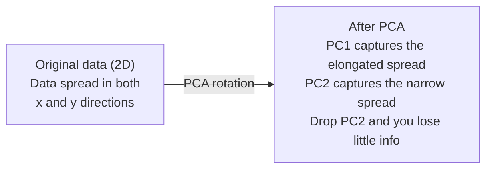

# Dimensionality Reduction

> Data berdimensi tinggi memiliki struktur. kamu menemukannya dengan melihat dari sudut yang tepat.

**Type:** Build
**Language:** Python
**Prerequisites:** Phase 1, Lesson 01 (Intuisi Linear Algebra), 02 (Vector, Matrix & Operasi), 03 (Eigenvalue & Eigenvector), 06 (Probability & Distributions)
**Waktu:** ~90 menit

## Tujuan Pembelajaran

- Menerapkan PCA dari awal: memusatkan data, menghitung covariance matrix, eigendecomposition, dan memproyeksikan
- Gunakan explained variance ratio dan elbow method untuk memilih jumlah principal component
- Bandingkan PCA, t-SNE, dan UMAP untuk memvisualisasikan digit MNIST dalam 2D dan jelaskan tradeoff
- Terapkan PCA kernel dengan kernel RBF untuk memisahkan struktur data nonlinier yang tidak dapat ditangani oleh PCA standar

## Masalah

kamu memiliki dataset dengan 784 feature per sample. Mungkin itu adalah nilai piksel dari angka tulisan tangan. Mungkin itu adalah tingkat ekspresi gen. Mungkin itu adalah sinyal perilaku pengguna. kamu tidak dapat memvisualisasikan 784 dimension. kamu tidak bisa mem-plot-nya. kamu bahkan tidak bisa memikirkannya.

Namun sebagian besar feature 784 tersebut mubazir. Informasi aktual berada pada permukaan yang jauh lebih kecil. Tulisan tangan "7" tidak memerlukan 784 angka independen untuk mendeskripsikannya. Dibutuhkan beberapa hal: sudut pukulan, panjang mistar gawang, seberapa miringnya. Sisanya adalah kebisingan.

Dimensionality Reduction menemukan permukaan yang lebih kecil. Dibutuhkan data 784 dimension dan mengompresinya menjadi 2, 10, atau 50 dimension sambil mempertahankan struktur yang penting.

## Konsep

### Curse of dimensionality

Ruang berdimensi tinggi tidak intuitif. Tiga hal hancur seiring bertambahnya dimension.

**Distance menjadi tidak berarti.** Dalam high-dimensional, distance antara dua titik acak mana pun menyatu ke nilai yang sama. Jika setiap titik memiliki distance yang kira-kira sama dari setiap titik lainnya, pencarian nearest neighbor akan berhenti berfungsi.

```
Dimension    Avg distance ratio (max/min between random points)
2            ~5.0
10           ~1.8
100          ~1.2
1000         ~1.02
```

**Volume terkonsentrasi di sudut.** Unit hypercube dalam dimension d memiliki sudut 2^d. Dalam 100 dimension, hampir seluruh volume berada di sudut, jauh dari pusat. Titik data menyebar ke tepian dan model kamu kekurangan data di bagian dalam.

**kamu memerlukan lebih banyak data secara eksponensial.** Untuk mempertahankan kepadatan sample yang sama dalam suatu ruang, beralih dari 2D ke 20D berarti kamu memerlukan data 10^18 kali lebih banyak. kamu tidak pernah merasa cukup. Mengurangi dimension membawa kepadatan data kembali ke sesuatu yang bisa diterapkan.

### PCA: temukan arah yang penting

Principal Component Analysis (PCA) menemukan sumbu yang paling bervariasi dalam data kamu. Ini memutar sistem koordinat kamu sehingga sumbu pertama menangkap varian terbanyak, sumbu kedua menangkap varian terbanyak berikutnya, dan seterusnya.

Algoritmanya:

```
1. Center the data        (subtract the mean from each feature)
2. Compute covariance     (how features move together)
3. Eigendecomposition     (find the principal directions)
4. Sort by eigenvalue     (biggest variance first)
5. Project               (keep top k eigenvectors, drop the rest)
```

Mengapa eigendecomposition? Covariance matrix-nya simetris dan semi pasti positif. Eigenvector-nya merupakan arah ortogonal dalam ruang feature. Eigenvalue memberi tahu kamu berapa banyak varian yang ditangkap setiap arah. Eigenvector dengan titik largest eigenvalue sepanjang arah varian maksimum.



- **Sebelum PCA:** Cloud data tersebar secara diagonal pada sumbu x dan y
- **Setelah PCA:** Sistem koordinat diputar sehingga PC1 sejajar dengan arah varian maksimum (sebaran memanjang) dan PC2 sejajar dengan arah varian minimum (sebaran sempit)
- **Dimensionality Reduction:** Menghapus PC2 memproyeksikan data ke PC1, sehingga kehilangan sedikit informasi

### Explained variance ratio

Setiap principal component menangkap sebagian kecil dari total varians. Explained variance ratio memberi tahu kamu seberapa besarnya.

```
Component    Eigenvalue    Explained ratio    Cumulative
PC1          4.73          0.473              0.473
PC2          2.51          0.251              0.724
PC3          1.12          0.112              0.836
PC4          0.89          0.089              0.925
...
```

Ketika cumulative explained variance mencapai 0,95, kamu mengetahui bahwa banyak komponen menangkap 95% informasi. Segala sesuatu setelah itu sebagian besar berupa kebisingan.

### Memilih jumlah komponen

Tiga strategi:

1. **Ambang Batas.** Pertahankan komponen yang cukup untuk menjelaskan 90-95% varians.
2. **Elbow method.** Plot menjelaskan varians per komponen. Carilah penurunan yang tajam.
3. **Kinerja hilir.** Gunakan PCA sebagai preprocessing. Sapu k dan ukur akurasi model kamu. K terbaik adalah ketika akurasi tidak stabil.

### t-SNE: melestarikan lingkungan

t-Distributed Stochastic Neighbor Embedding (t-SNE) dirancang untuk visualisasi. Ini memetakan data berdimensi tinggi ke 2D (atau 3D) sambil mempertahankan titik mana yang dekat satu sama lain.

Intuisi: di ruang asli, hitung distribusi probabilitas pada pasangan titik berdasarkan jaraknya. Point dekat mendapat probabilitas tinggi. Point jauh mendapat probabilitas rendah. Kemudian temukan susunan 2D yang memiliki distribusi probabilitas yang sama. Titik-titik yang bertetangga dalam dimension 784 tetap bertetangga dalam 2D.

Properti utama t-SNE:
- Non-linier. Hal ini dapat mengungkap lipatan kompleks yang tidak dapat dilakukan oleh PCA.
- Stokastik. Proses yang berbeda menghasilkan tata letak yang berbeda.
- Parameter perplexity mengontrol berapa banyak tetangga yang perlu dipertimbangkan (kisaran tipikal: 5-50).
- Distance antar cluster pada output tidak berarti. Hanya clusternya saja yang seperti itu.
- Lambat pada dataset besar. O(n^2) secara default.

### UMAP: struktur global yang lebih cepat dan lebih baik

Uniform Manifold Approximation and Projection (UMAP) bekerja mirip dengan t-SNE tetapi dengan dua keunggulan:
- Lebih cepat. Ini menggunakan perkiraan grafik nearest neighbor daripada menghitung semua distance berpasangan.
- Struktur global yang lebih baik. Posisi relatif cluster pada output cenderung lebih bermakna dibandingkan pada t-SNE.

UMAP membuat grafik berbobot dalam ruang berdimensi tinggi ("representasi topologi fuzzy") dan kemudian menemukan tata letak berdimensi rendah yang mempertahankan grafik ini sebaik mungkin.

Parameter utama:
- `n_neighbors`: berapa banyak tetangga yang mendefinisikan struktur lokal (mirip dengan perplexity). Nilai-nilai yang lebih tinggi mempertahankan lebih banyak struktur global.
- `min_dist`: seberapa rapat titik-titik dalam output. Nilai yang lebih rendah menciptakan cluster yang lebih padat.

### Kapan menggunakan yang mana

| Metode | Kasus penggunaan | Mempertahankan | Kecepatan |
|--------|----------|-----------|-------|
| PCA | Preprocessing sebelum training | Varians global | Cepat (tepat), bekerja pada jutaan sample |
| PCA | Visualisasi eksplorasi cepat | Struktur linier | Cepat |
| t-SNE | Plot 2D berkualitas publikasi | Lingkungan lokal | Lambat (<10 ribu sample ideal) |
| UMAP | Visualisasi 2D dalam skala | Lokal + beberapa struktur global | Sedang (menangani jutaan) |
| PCA | Pengurangan feature untuk model | Feature dengan peringkat varians | Cepat |
| t-SNE / UMAP | Memahami struktur cluster | Pemisahan cluster | Sedang hingga lambat |

Aturan praktisnya: gunakan PCA untuk preprocessing dan kompresi data. Gunakan t-SNE atau UMAP ketika kamu perlu memvisualisasikan struktur dalam 2D.

### PCA Kernel

PCA standar menemukan subruang linier. Ini memutar sistem koordinat kamu dan menjatuhkan sumbu. Namun bagaimana jika datanya terletak pada manifold nonlinier? Lingkaran dalam 2D ​​tidak dapat dipisahkan oleh garis apapun. PCA standar tidak akan membantu.Kernel PCA menerapkan PCA dalam ruang feature berdimensi tinggi yang disebabkan oleh kernel function, tanpa secara eksplisit menghitung koordinat dalam ruang tersebut. Ini adalah trik kernel -- ide yang sama di balik SVM.

Algoritmanya:
1. Hitung kernel matrix K dimana K_ij = k(x_i, x_j)
2. Pusatkan kernel matrix di ruang feature
3. Eigendecomposition kernel matrix terpusat
4. Eigenvector teratas (berskala 1/sqrt(eigenvalue)) adalah proyeksinya

Kernel function umum:

| Kernel | Rumus | Baik untuk |
|--------|---------|----------|
| RBF (Gaussian) | exp(-gamma * \|\|x - y\|\|^2) | Sebagian besar data nonlinier, manifold halus |
| Polinomial | (x .y + c)^d | Hubungan polinomial |
| Sigmoid | tanh(alpha * x .y ​​+ c) | Pemetaan seperti neural network |

Kapan menggunakan PCA kernel vs PCA standar:

| Kriteria | PCA Standar | PCA Kernel |
|-----------|-------------|------------|
| Struktur data | Subruang linier | Manifold nonlinier |
| Kecepatan | O(min(n^2 d, d^2 n)) | O(n^2 d + n^3) |
| Interpretasi | Komponen adalah kombinasi linier dari feature | Komponen tidak memiliki interpretasi feature langsung |
| Skalabilitas | Bekerja pada jutaan sample | Kernel matrix adalah nxn, memori terbatas |
| Rekonstruksi | Inverse transform langsung | Membutuhkan perkiraan pra-gambar |

Contoh klasik: lingkaran konsentris dalam 2D. Dua lingkaran titik, satu di dalam yang lain. PCA standar memproyeksikan keduanya ke jalur yang sama -- tidak berguna untuk klasifikasi. Kernel PCA dengan kernel RBF memetakan lingkaran dalam dan lingkaran luar ke wilayah berbeda, menjadikannya dapat dipisahkan secara linier.

### Reconstruction Error

Seberapa baik dimensionality reduction kamu? kamu mengompresi 784 dimension menjadi 50. Apa yang hilang dari kamu?

Ukur reconstruction error:
1. Proyeksikan data ke k dimension: X_reduksi = X @ W_k
2. Rekonstruksi: X_hat = X_reduction @ W_k^T
3. Hitung MSE: mean((X - X_hat)^2)

Untuk PCA, reconstruction error memiliki hubungan yang jelas dengan explained variance:

```
Reconstruction error = sum of eigenvalues NOT included
Total variance = sum of ALL eigenvalues
Fraction lost = (sum of dropped eigenvalues) / (sum of all eigenvalues)
```

Explained variance ratio untuk setiap komponen adalah:

```
explained_ratio_k = eigenvalue_k / sum(all eigenvalues)
```

Merencanakan explained variance secara kumulatif terhadap jumlah komponen memberi kamu kurva "siku". Jumlah komponen yang tepat adalah dimana:
- Kurvanya mendatar (pengembaliannya semakin berkurang)
- Varians kumulatif melewati ambang batas kamu (biasanya 0,90 atau 0,95)
- Kinerja tugas hilir tidak stabil

Kesalahan rekonstruksi berguna selain memilih k. kamu dapat menggunakannya untuk deteksi anomali: sample dengan reconstruction error tinggi adalah outlier yang tidak sesuai dengan subruang yang dipelajari. Ini adalah dasar deteksi anomali berbasis PCA dalam sistem produksi.

## Build

### Langkah 1: PCA dari awal

```python
import numpy as np

class PCA:
    def __init__(self, n_components):
        self.n_components = n_components
        self.components = None
        self.mean = None
        self.eigenvalues = None
        self.explained_variance_ratio_ = None

    def fit(self, X):
        self.mean = np.mean(X, axis=0)
        X_centered = X - self.mean

        cov_matrix = np.cov(X_centered, rowvar=False)

        eigenvalues, eigenvectors = np.linalg.eigh(cov_matrix)

        sorted_idx = np.argsort(eigenvalues)[::-1]
        eigenvalues = eigenvalues[sorted_idx]
        eigenvectors = eigenvectors[:, sorted_idx]

        self.components = eigenvectors[:, :self.n_components].T
        self.eigenvalues = eigenvalues[:self.n_components]
        total_var = np.sum(eigenvalues)
        self.explained_variance_ratio_ = self.eigenvalues / total_var

        return self

    def transform(self, X):
        X_centered = X - self.mean
        return X_centered @ self.components.T

    def fit_transform(self, X):
        self.fit(X)
        return self.transform(X)
```

### Langkah 2: Uji pada data sintetis

```python
np.random.seed(42)
n_samples = 500

t = np.random.uniform(0, 2 * np.pi, n_samples)
x1 = 3 * np.cos(t) + np.random.normal(0, 0.2, n_samples)
x2 = 3 * np.sin(t) + np.random.normal(0, 0.2, n_samples)
x3 = 0.5 * x1 + 0.3 * x2 + np.random.normal(0, 0.1, n_samples)

X_synthetic = np.column_stack([x1, x2, x3])

pca = PCA(n_components=2)
X_reduced = pca.fit_transform(X_synthetic)

print(f"Original shape: {X_synthetic.shape}")
print(f"Reduced shape:  {X_reduced.shape}")
print(f"Explained variance ratios: {pca.explained_variance_ratio_}")
print(f"Total variance captured: {sum(pca.explained_variance_ratio_):.4f}")
```

### Langkah 3: Digit MNIST dalam 2D

```python
from sklearn.datasets import fetch_openml

mnist = fetch_openml("mnist_784", version=1, as_frame=False, parser="auto")
X_mnist = mnist.data[:5000].astype(float)
y_mnist = mnist.target[:5000].astype(int)

pca_mnist = PCA(n_components=50)
X_pca50 = pca_mnist.fit_transform(X_mnist)
print(f"50 components capture {sum(pca_mnist.explained_variance_ratio_):.2%} of variance")

pca_2d = PCA(n_components=2)
X_pca2d = pca_2d.fit_transform(X_mnist)
print(f"2 components capture {sum(pca_2d.explained_variance_ratio_):.2%} of variance")
```

### Langkah 4: Bandingkan dengan sklearn

```python
from sklearn.decomposition import PCA as SklearnPCA
from sklearn.manifold import TSNE

sklearn_pca = SklearnPCA(n_components=2)
X_sklearn_pca = sklearn_pca.fit_transform(X_mnist)

print(f"\nOur PCA explained variance:     {pca_2d.explained_variance_ratio_}")
print(f"Sklearn PCA explained variance: {sklearn_pca.explained_variance_ratio_}")

diff = np.abs(np.abs(X_pca2d) - np.abs(X_sklearn_pca))
print(f"Max absolute difference: {diff.max():.10f}")

tsne = TSNE(n_components=2, perplexity=30, random_state=42)
X_tsne = tsne.fit_transform(X_mnist)
print(f"\nt-SNE output shape: {X_tsne.shape}")
```

### Langkah 5: perbandingan UMAP

```python
try:
    from umap import UMAP

    reducer = UMAP(n_components=2, n_neighbors=15, min_dist=0.1, random_state=42)
    X_umap = reducer.fit_transform(X_mnist)
    print(f"UMAP output shape: {X_umap.shape}")
except ImportError:
    print("Install umap-learn: pip install umap-learn")
```

## Pakai

PCA sebagai preprocessing sebelum pengklasifikasi:

```python
from sklearn.decomposition import PCA as SklearnPCA
from sklearn.linear_model import LogisticRegression
from sklearn.model_selection import train_test_split
from sklearn.metrics import accuracy_score

X_train, X_test, y_train, y_test = train_test_split(
    X_mnist, y_mnist, test_size=0.2, random_state=42
)

results = {}
for k in [10, 30, 50, 100, 200]:
    pca_k = SklearnPCA(n_components=k)
    X_tr = pca_k.fit_transform(X_train)
    X_te = pca_k.transform(X_test)

    clf = LogisticRegression(max_iter=1000, random_state=42)
    clf.fit(X_tr, y_train)
    acc = accuracy_score(y_test, clf.predict(X_te))
    var_captured = sum(pca_k.explained_variance_ratio_)
    results[k] = (acc, var_captured)
    print(f"k={k:>3d}  accuracy={acc:.4f}  variance={var_captured:.4f}")
```

Performanya stabil jauh sebelum dimension 784. Dataran tinggi itu adalah titik operasi kamu.

## Kirim

Lesson ini menghasilkan:
- `outputs/skill-dimensionality-reduction.md` - keterampilan untuk memilih teknik dimensionality reduction yang tepat untuk tugas tertentu

## Latihan

1. Ubah kelas PCA untuk mendukung `inverse_transform`. Rekonstruksi digit MNIST dari 10, 50, dan 200 komponen. Cetak reconstruction error (rata-rata selisih kuadrat dari aslinya) untuk masing-masing.2. Jalankan t-SNE pada subset MNIST yang sama dengan nilai perplexity 5, 30, dan 100. Jelaskan bagaimana perubahan output. Mengapa perplexity mempengaruhi keketatan klaster?

3. Ambil dataset dengan 50 feature dan hanya 5 yang informatif (buat satu dengan `sklearn.datasets.make_classification`). Terapkan PCA dan periksa apakah kurva explained variance dengan benar mengidentifikasi bahwa data tersebut efektif 5 dimension.

## Istilah Kunci

| Istilah | Apa kata orang | Apa sebenarnya arti |
|------|----------------|----------------------|
| Kutukan Dimensionalitas | "Terlalu banyak feature" | Distance, volume, dan kepadatan data semuanya berperilaku berlawanan dengan intuisi seiring bertambahnya dimension. Model memerlukan lebih banyak data secara eksponensial sebagai kompensasinya. |
| PCA | "Kurangi dimension" | Putar sistem koordinat kamu sehingga sumbu sejajar dengan arah varian maksimum, lalu hilangkan sumbu varian rendah. |
| Principal component | "Arah penting" | Eigenvector dari covariance matrix. Arah dalam ruang feature tempat data paling bervariasi. |
| Explained variance ratio | "Berapa banyak informasi yang dimiliki komponen ini" | Fraksi varians total yang ditangkap oleh satu principal component. Jumlahkan rasio k teratas untuk melihat berapa banyak k komponen yang terawetkan. |
| Covariance matrix | "Bagaimana feature berkorelasi" | Matrix simetris dengan entri (i,j) mengukur bagaimana feature i dan feature j bergerak bersama. Entri diagonal adalah varians individual. |
| t-SNE | "Plot cluster itu" | Metode nonlinier yang memetakan data berdimensi tinggi ke 2D dengan mempertahankan probabilitas lingkungan berpasangan. Bagus untuk visualisasi, bukan untuk pra-pemrosesan. |
| UMAP | "T-SNE lebih cepat" | Metode nonlinier berdasarkan analisis data topologi. Mempertahankan struktur lokal dan beberapa struktur global. Skalanya lebih baik daripada t-SNE. |
| Perplexity | "Tombol t-SNE" | Mengontrol jumlah tetangga efektif yang dipertimbangkan setiap titik. Perplexity rendah berfokus pada struktur yang sangat lokal. Perplexity yang tinggi menangkap pola yang lebih luas. |
| Berjenis | "Permukaan tempat data berada" | Permukaan berdimensi lebih rendah yang tertanam dalam ruang berdimensi lebih tinggi. Selembar kertas yang diremas dalam 3D adalah manifold 2D. |

## Bacaan Lanjutan

- [Tutorial Analisis Komponen Utama](https://arxiv.org/abs/1404.1100) (Shlens) - derivasi PCA yang jelas dari awal
- [Cara Menggunakan t-SNE Secara Efektif](https://distill.pub/2016/misread-tsne/) (Wattenberg dkk.) - panduan interaktif mengenai kendala t-SNE dan pilihan parameter
- [Dokumentasi UMAP](https://umap-learn.readthedocs.io/) - teori dan panduan praktis dari penulis UMAP
