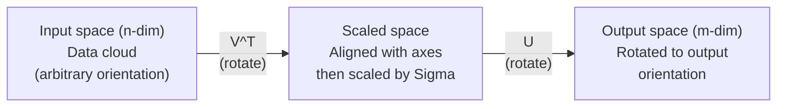
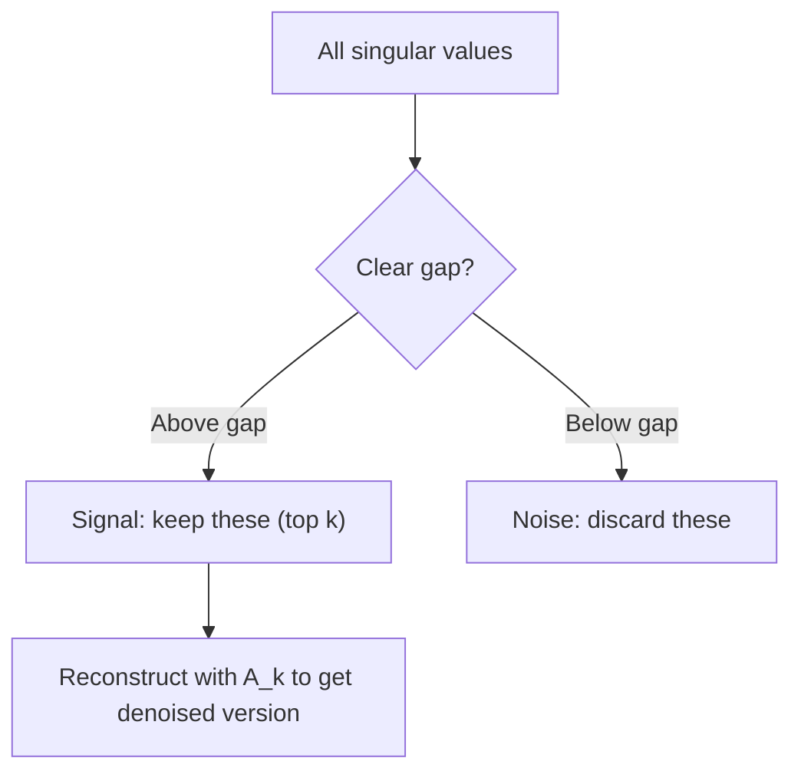

# Decomposition Nilai Singular

> SVD adalah pisau aljabar linier Swiss Army. Setiap matrix memiliki satu. Setiap data scientist membutuhkannya.

**Type:** Build
**Language:** Python, Julia
**Prerequisites:** Phase 1, Lesson 01 (Intuisi Linear Algebra), 02 (Operasi Vector & Matrix), 03 (Transformasi Matrix)
**Waktu:** ~120 menit

## Tujuan Pembelajaran

- Menerapkan SVD melalui iterasi daya dan menjelaskan arti geometris U, Sigma, dan V^T
- Terapkan SVD terpotong untuk kompresi gambar dan ukur rasio kompresi vs reconstruction error
- Hitung pseudoinverse Moore-Penrose melalui SVD untuk menyelesaikan sistem kuadrat terkecil yang ditentukan secara berlebihan
- Hubungkan SVD ke PCA, sistem rekomendasi (faktor laten), dan Analisis Semantik Laten di NLP

## Masalah

kamu memiliki matrix 1000x2000. Mungkin itu adalah rating film pengguna. Mungkin itu adalah tabel frekuensi istilah dokumen. Mungkin itu adalah nilai piksel suatu gambar. kamu perlu mengompresinya, menolaknya, menemukan struktur tersembunyi di dalamnya, atau menyelesaikan sistem kuadrat terkecil dengannya. Eigendecomposition hanya berfungsi pada matrix persegi. Meski begitu, matrix tersebut memerlukan kumpulan eigenvector independen linier yang lengkap.

SVD bekerja pada matrix apa pun. Bentuk apa pun. Peringkat apa pun. Tidak ada syarat. Ini menguraikan matrix menjadi tiga faktor yang mengungkapkan geometri dari apa yang dilakukan matrix terhadap ruang. Ini adalah faktorisasi paling umum dan paling berguna dalam semua aljabar linier.

## Konsep

### Apa yang dilakukan SVD secara geometris

Setiap matrix, apapun bentuknya, melakukan tiga operasi secara berurutan: memutar, menskalakan, memutar. SVD membuat decomposition ini menjadi eksplisit.

```
A = U * Sigma * V^T

      m x n     m x m    m x n    n x n
     (any)    (rotate)  (scale)  (rotate)
```

Mengingat matrix A apa pun, SVD memfaktorkannya menjadi:
- V^T memutar vector di ruang input (n-dimension)
- Skala sigma di sepanjang setiap sumbu (peregangan atau kompres)
- U memutar hasilnya ke dalam ruang output (dimension m)



Pikirkan seperti ini. kamu menyerahkan matrix kepada SVD. Ia memberitahu kamu: "Matrix ini mengambil bola input, mula-mula memutarnya sebesar V^T, lalu merentangkannya menjadi ellipsoid dengan Sigma, lalu memutar ellipsoid tersebut dengan U." Nilai tunggalnya adalah panjang sumbu ellipsoid.

### Decomposition penuh

Untuk matrix A berbentuk mxn:

```
A = U * Sigma * V^T

where:
  U     is m x m, orthogonal (U^T U = I)
  Sigma is m x n, diagonal (singular values on the diagonal)
  V     is n x n, orthogonal (V^T V = I)

The singular values sigma_1 >= sigma_2 >= ... >= sigma_r > 0
where r = rank(A)
```

Kolom-kolom U disebut vector tunggal kiri. Kolom-kolom dari V disebut vector tunggal siku-siku. Entri diagonal Sigma disebut nilai singular. Mereka selalu non-negatif dan diurutkan secara konvensional dalam urutan menurun.

### Vector tunggal kiri, nilai tunggal, vector tunggal kanan

Setiap komponen SVD memiliki makna geometris yang berbeda.

**Vector tunggal kanan (kolom V):** Ini membentuk basis ortonormal untuk ruang input (R^n). Mereka adalah arah dalam ruang input yang dipetakan oleh matrix ke arah ortogonal dalam ruang output. Anggap saja mereka sebagai sistem koordinat alami untuk domain tersebut.

**Nilai tunggal (diagonal Sigma):** Ini adalah faktor penskalaan. Nilai singular ke-i menunjukkan seberapa besar matrix merenggangkan vector-vector di sepanjang vector singular kanan ke-i. Nilai tunggal nol berarti matrix menghancurkan arah tersebut seluruhnya.

**Vector tunggal kiri (kolom U):** Ini membentuk basis ortonormal untuk ruang output (R^m). Vector tunggal kiri ke-i adalah arah dalam ruang output tempat vector tunggal kanan ke-i mendarat (setelah penskalaan).

Hubungan di antara mereka:

```
A * v_i = sigma_i * u_i

The matrix A takes the i-th right singular vector v_i,
scales it by sigma_i, and maps it to the i-th left singular vector u_i.
```

Ini memberi kamu gambaran koordinat demi koordinat tentang fungsi matrix apa pun.

### Bentuk produk luarSVD dapat ditulis sebagai penjumlahan dari matrix peringkat-1:

```
A = sigma_1 * u_1 * v_1^T + sigma_2 * u_2 * v_2^T + ... + sigma_r * u_r * v_r^T

Each term sigma_i * u_i * v_i^T is a rank-1 matrix (an outer product).
The full matrix is the sum of r such matrices, where r is the rank.
```

Bentuk ini adalah dasar dari pendekatan peringkat rendah. Setiap istilah menambahkan satu layer struktur. Istilah pertama menangkap satu pola yang paling penting. Yang kedua mencakup hal terpenting berikutnya. Dan sebagainya. Memotong jumlah ini akan memberi kamu perkiraan terbaik pada peringkat tertentu.

```
Rank-1 approx:    A_1 = sigma_1 * u_1 * v_1^T
                  (captures the dominant pattern)

Rank-2 approx:    A_2 = sigma_1 * u_1 * v_1^T + sigma_2 * u_2 * v_2^T
                  (captures the two most important patterns)

Rank-k approx:    A_k = sum of top k terms
                  (optimal by the Eckart-Young theorem)
```

### Hubungan dengan eigendecomposition

SVD dan eigendecomposition sangat terkait. Nilai singular dan vector A berasal langsung dari eigenvalue dan eigenvector A^T A dan A A^T.

```
A^T A = V * Sigma^T * U^T * U * Sigma * V^T
      = V * Sigma^T * Sigma * V^T
      = V * D * V^T

where D = Sigma^T * Sigma is a diagonal matrix with sigma_i^2 on the diagonal.

So:
- The right singular vectors (V) are eigenvectors of A^T A
- The singular values squared (sigma_i^2) are eigenvalues of A^T A

Similarly:
A A^T = U * Sigma * V^T * V * Sigma^T * U^T
      = U * Sigma * Sigma^T * U^T

So:
- The left singular vectors (U) are eigenvectors of A A^T
- The eigenvalues of A A^T are also sigma_i^2
```

Koneksi ini memberi tahu kamu tiga hal:
1. Nilai singular selalu real dan non-negatif (merupakan akar kuadrat dari eigenvalue matrix semi-definit positif).
2. kamu dapat menghitung SVD melalui eigendecomposition dari A^T A, tetapi hal ini membuat bilangan kondisi menjadi kuadrat dan kehilangan presisi numerik. Algoritme SVD khusus menghindari hal ini.
3. Jika A berbentuk persegi dan semi pasti positif simetris, SVD dan eigendecomposition adalah hal yang sama.

### SVD terpotong: perkiraan peringkat rendah

Teorema Eckart-Young-Mirsky menyatakan bahwa perkiraan peringkat-k terbaik untuk A (dalam Frobenius dan norm spektral) diperoleh dengan hanya mempertahankan k nilai singular teratas dan vector yang sesuai:

```
A_k = U_k * Sigma_k * V_k^T

where:
  U_k     is m x k  (first k columns of U)
  Sigma_k is k x k  (top-left k x k block of Sigma)
  V_k     is n x k  (first k columns of V)

Approximation error = sigma_{k+1}  (in spectral norm)
                    = sqrt(sigma_{k+1}^2 + ... + sigma_r^2)  (in Frobenius norm)
```

Ini bukan sekadar perkiraan yang "baik". Ini terbukti merupakan perkiraan terbaik untuk peringkat k. Tidak ada matrix peringkat-k lain yang mendekati A.

| Komponen | Besaran relatif | Tetap di peringkat ke-3 kira-kira? |
|-----------|-------------------|------------------------|
| sigma_1 | Terbesar | Ya |
| sigma_2 | Besar | Ya |
| sigma_3 | Sedang-besar | Ya |
| sigma_4 | Sedang | Tidak (kesalahan) |
| sigma_5 | Sedang-kecil | Tidak (kesalahan) |
| sigma_6 | Kecil | Tidak (kesalahan) |
| sigma_7 | Sangat kecil | Tidak (kesalahan) |
| sigma_8 | Kecil | Tidak (kesalahan) |

Pertahankan 3 teratas: A_3 menangkap tiga nilai tunggal terbesar. Kesalahan = nilai yang tersisa (sigma_4 hingga sigma_8).

Jika nilai singular meluruh dengan cepat, k kecil akan menangkap sebagian besar matrix. Jika peluruhannya lambat, matrix tersebut tidak memiliki struktur peringkat rendah.

### Kompresi gambar dengan SVD

Gambar skala abu-abu adalah matrix intensitas piksel. Gambar berukuran 800x600 memiliki 480.000 nilai. SVD memungkinkan kamu memperkirakannya dengan jauh lebih sedikit.

```
Original image: 800 x 600 = 480,000 values

SVD with rank k:
  U_k:      800 x k values
  Sigma_k:  k values
  V_k:      600 x k values
  Total:    k * (800 + 600 + 1) = k * 1401 values

  k=10:   14,010 values   (2.9% of original)
  k=50:   70,050 values  (14.6% of original)
  k=100: 140,100 values  (29.2% of original)

  The compression ratio improves as k gets smaller,
  but visual quality degrades.
```

Wawasan utama: gambar alam memiliki nilai tunggal yang cepat rusak. Beberapa nilai tunggal pertama menangkap struktur luas (bentuk, gradient). Yang terakhir menangkap detail halus dan noise. Memotong pada peringkat 50 sering kali menghasilkan gambar yang terlihat hampir identik dengan aslinya namun menggunakan penyimpanan 85% lebih sedikit.

### SVD untuk sistem rekomendasi

Hadiah Netflix menjadikan ini terkenal. kamu memiliki matrix peringkat film pengguna yang sebagian besar entrinya hilang.

```
             Movie1  Movie2  Movie3  Movie4  Movie5
  User1      [  5      ?       3       ?       1  ]
  User2      [  ?      4       ?       2       ?  ]
  User3      [  3      ?       5       ?       ?  ]
  User4      [  ?      ?       ?       4       3  ]

  ? = unknown rating
```

Idenya: matrix peringkat ini memiliki peringkat rendah. Pengguna tidak memiliki selera yang sepenuhnya mandiri. Ada beberapa faktor laten (aksi vs. drama, lama vs. baru, otak vs. mendalam) yang menjelaskan sebagian besar preferensi.

SVD pada matrix pemeringkatan (yang terisi) menguraikannya menjadi:
- U: profil pengguna dalam ruang faktor laten
- Sigma: pentingnya setiap faktor laten
- V^T: profil film dalam ruang faktor laten

Perkiraan rating pengguna untuk sebuah film adalah perkalian titik antara profil penggunanya dengan profil film tersebut (ditimbang berdasarkan nilai tunggal). Perkiraan peringkat rendah mengisi entri yang hilang.Dalam praktiknya, kamu menggunakan varian seperti SVD atau ALS inkremental Simon Funk (kuadrat terkecil bergantian) yang menangani data yang hilang secara langsung. Namun ide intinya sama: decomposition faktor laten melalui SVD.

### SVD di NLP: Analisis Semantik Laten

Analisis Semantik Laten (LSA), juga disebut Pengindeksan Semantik Laten (LSI), menerapkan SVD ke matrix istilah-dokumen.

```
             Doc1   Doc2   Doc3   Doc4
  "cat"      [  3      0      1      0  ]
  "dog"      [  2      0      0      1  ]
  "fish"     [  0      4      1      0  ]
  "pet"      [  1      1      1      1  ]
  "ocean"    [  0      3      0      0  ]

After SVD with rank k=2:

  Each document becomes a point in 2D "concept space."
  Each term becomes a point in the same 2D space.
  Documents about similar topics cluster together.
  Terms with similar meanings cluster together.

  "cat" and "dog" end up near each other (land pets).
  "fish" and "ocean" end up near each other (water concepts).
  Doc1 and Doc3 cluster if they share similar topics.
```

LSA adalah salah satu metode pertama yang berhasil menangkap kesamaan semantik dari teks mentah. Ini berfungsi karena istilah-istilah sinonim cenderung muncul dalam dokumen serupa, sehingga SVD mengelompokkannya ke dalam dimension laten yang sama. Embedding kata modern (Word2Vec, GloVe) dapat dilihat sebagai turunan dari ide ini.

### SVD untuk pengurangan kebisingan

Data noise memiliki sinyal yang terkonsentrasi pada nilai tunggal teratas dan noise tersebar di semua nilai tunggal. Pemotongan menghilangkan tingkat kebisingan.

**Nilai tunggal sinyal bersih:**

| Komponen | Besaran | Ketik |
|-----------|-----------|------|
| sigma_1 | Sangat besar | Sinyal |
| sigma_2 | Besar | Sinyal |
| sigma_3 | Sedang | Sinyal |
| sigma_4 | Mendekati nol | Dapat Diabaikan |
| sigma_5 | Mendekati nol | Dapat Diabaikan |

**Nilai tunggal sinyal bising (kebisingan menambah semua):**

| Komponen | Besaran | Ketik |
|-----------|-----------|------|
| sigma_1 | Sangat besar | Sinyal |
| sigma_2 | Besar | Sinyal |
| sigma_3 | Sedang | Sinyal |
| sigma_4 | Kecil | Kebisingan |
| sigma_5 | Kecil | Kebisingan |
| sigma_6 | Kecil | Kebisingan |
| sigma_7 | Kecil | Kebisingan |



Ini digunakan dalam pemrosesan sinyal, pengukuran ilmiah, dan pembersihan data. Kapan pun matrix kamu rusak karena derau aditif, SVD terpotong adalah cara mendasar untuk memisahkan sinyal dari derau.

### Pseudoinverse melalui SVD

Pseudoinverse A+ Moore-Penrose menggeneralisasi inversi matrix menjadi matrix non-persegi dan singular. SVD membuat komputasi menjadi hal yang sepele.

```
If A = U * Sigma * V^T, then:

A+ = V * Sigma+ * U^T

where Sigma+ is formed by:
  1. Transpose Sigma (swap rows and columns)
  2. Replace each non-zero diagonal entry sigma_i with 1/sigma_i
  3. Leave zeros as zeros

For A (m x n):      A+ is (n x m)
For Sigma (m x n):  Sigma+ is (n x m)
```

Pseudoinverse memecahkan masalah kuadrat terkecil. Jika Ax = b tidak mempunyai solusi eksak (sistem overdetermined), maka x = A+ b adalah solusi kuadrat terkecil (diminimalkan ||Ax - b||).

```
Overdetermined system (more equations than unknowns):

  [1  1]         [3]
  [2  1] x   =   [5]       No exact solution exists.
  [3  1]         [6]

  x_ls = A+ b = V * Sigma+ * U^T * b

  This gives the x that minimizes the sum of squared residuals.
  Same result as the normal equations (A^T A)^(-1) A^T b,
  but numerically more stable.
```

### Keunggulan stabilitas numerik

Menghitung eigendecomposition A^T A mengkuadratkan nilai tunggal (eigenvalue A^T A adalah sigma_i^2). Ini mengkuadratkan nomor kondisi, memperkuat kesalahan numerik.

```
Example:
  A has singular values [1000, 1, 0.001]
  Condition number of A: 1000 / 0.001 = 10^6

  A^T A has eigenvalues [10^6, 1, 10^{-6}]
  Condition number of A^T A: 10^6 / 10^{-6} = 10^{12}

  Computing SVD directly: works with condition number 10^6
  Computing via A^T A:     works with condition number 10^{12}
                           (6 extra digits of precision lost)
```

Algoritma SVD modern (bidiagonalisasi Golub-Kahan) bekerja secara langsung pada A, tidak pernah membentuk A^T A. Inilah sebabnya mengapa kamu harus selalu memilih `np.linalg.svd(A)` daripada `np.linalg.eig(A.T @ A)`.

### Koneksi ke PCA

PCA IS SVD pada data terpusat. Ini bukanlah sebuah analogi. Secara harfiah, ini adalah perhitungan yang sama.

```
Given data matrix X (n_samples x n_features), centered (mean subtracted):

Covariance matrix: C = (1/(n-1)) * X^T X

PCA finds eigenvectors of C. But:

  X = U * Sigma * V^T    (SVD of X)

  X^T X = V * Sigma^2 * V^T

  C = (1/(n-1)) * V * Sigma^2 * V^T

So the principal components are exactly the right singular vectors V.
The explained variance for each component is sigma_i^2 / (n-1).

In sklearn, PCA is implemented using SVD, not eigendecomposition.
It is faster and more numerically stable.
```

Ini berarti semua yang kamu pelajari tentang dimensionality reduction di Lesson 10 adalah SVD. PCA adalah aplikasi SVD yang paling umum dalam machine learning.

## Build

### Langkah 1: SVD dari awal menggunakan power iterasi

Idenya: untuk mencari nilai tunggal terbesar dan vektornya, gunakan perulangan pangkat pada A^T A (atau A A^T). Kemudian kempiskan matrix dan ulangi untuk nilai tunggal berikutnya.

```python
import numpy as np

def power_iteration(M, num_iters=100):
    n = M.shape[1]
    v = np.random.randn(n)
    v = v / np.linalg.norm(v)

    for _ in range(num_iters):
        Mv = M @ v
        v = Mv / np.linalg.norm(Mv)

    eigenvalue = v @ M @ v
    return eigenvalue, v

def svd_from_scratch(A, k=None):
    m, n = A.shape
    if k is None:
        k = min(m, n)

    sigmas = []
    us = []
    vs = []

    A_residual = A.copy().astype(float)

    for _ in range(k):
        AtA = A_residual.T @ A_residual
        eigenvalue, v = power_iteration(AtA, num_iters=200)

        if eigenvalue < 1e-10:
            break

        sigma = np.sqrt(eigenvalue)
        u = A_residual @ v / sigma

        sigmas.append(sigma)
        us.append(u)
        vs.append(v)

        A_residual = A_residual - sigma * np.outer(u, v)

    U = np.column_stack(us) if us else np.empty((m, 0))
    S = np.array(sigmas)
    V = np.column_stack(vs) if vs else np.empty((n, 0))

    return U, S, V
```

### Langkah 2: Uji dan bandingkan dengan NumPy

```python
np.random.seed(42)
A = np.random.randn(5, 4)

U_ours, S_ours, V_ours = svd_from_scratch(A)
U_np, S_np, Vt_np = np.linalg.svd(A, full_matrices=False)

print("Our singular values:", np.round(S_ours, 4))
print("NumPy singular values:", np.round(S_np, 4))

A_reconstructed = U_ours @ np.diag(S_ours) @ V_ours.T
print(f"Reconstruction error: {np.linalg.norm(A - A_reconstructed):.8f}")
```

### Langkah 3: Demo kompresi gambar

```python
def compress_image_svd(image_matrix, k):
    U, S, Vt = np.linalg.svd(image_matrix, full_matrices=False)
    compressed = U[:, :k] @ np.diag(S[:k]) @ Vt[:k, :]
    return compressed

image = np.random.seed(42)
rows, cols = 200, 300
image = np.random.randn(rows, cols)

for k in [1, 5, 10, 20, 50]:
    compressed = compress_image_svd(image, k)
    error = np.linalg.norm(image - compressed) / np.linalg.norm(image)
    original_size = rows * cols
    compressed_size = k * (rows + cols + 1)
    ratio = compressed_size / original_size
    print(f"k={k:>3d}  error={error:.4f}  storage={ratio:.1%}")
```

### Langkah 4: Pengurangan kebisingan

```python
np.random.seed(42)
clean = np.outer(np.sin(np.linspace(0, 4*np.pi, 100)),
                 np.cos(np.linspace(0, 2*np.pi, 80)))
noise = 0.3 * np.random.randn(100, 80)
noisy = clean + noise

U, S, Vt = np.linalg.svd(noisy, full_matrices=False)
denoised = U[:, :5] @ np.diag(S[:5]) @ Vt[:5, :]

print(f"Noisy error:    {np.linalg.norm(noisy - clean):.4f}")
print(f"Denoised error: {np.linalg.norm(denoised - clean):.4f}")
print(f"Improvement:    {(1 - np.linalg.norm(denoised - clean) / np.linalg.norm(noisy - clean)):.1%}")
```

### Langkah 5: Pseudoinverse

```python
A = np.array([[1, 1], [2, 1], [3, 1]], dtype=float)
b = np.array([3, 5, 6], dtype=float)

U, S, Vt = np.linalg.svd(A, full_matrices=False)
S_inv = np.diag(1.0 / S)
A_pinv = Vt.T @ S_inv @ U.T

x_svd = A_pinv @ b
x_lstsq = np.linalg.lstsq(A, b, rcond=None)[0]
x_pinv = np.linalg.pinv(A) @ b

print(f"SVD pseudoinverse solution:  {x_svd}")
print(f"np.linalg.lstsq solution:   {x_lstsq}")
print(f"np.linalg.pinv solution:    {x_pinv}")
```

## Pakai

Demo yang berfungsi penuh ada di `code/svd.py`. Jalankan untuk melihat SVD diterapkan pada kompresi gambar, sistem rekomendasi, analisis semantik laten, dan pengurangan noise.

```bash
python svd.py
```Versi Julia di `code/svd.jl` mendemonstrasikan konsep yang sama menggunakan fungsi asli `svd()` dan paket `LinearAlgebra` Julia.

```bash
julia svd.jl
```

## Kirim

Lesson ini menghasilkan:
- `outputs/skill-svd.md` - keterampilan untuk mengetahui kapan dan bagaimana menerapkan SVD dalam proyek nyata

## Latihan

1. Menerapkan SVD penuh dari awal tanpa menggunakan power iterasi. Sebagai gantinya, hitung eigendecomposition dari A^TA A untuk mendapatkan V dan nilai singularnya, lalu hitung U = A V Sigma^{-1}. Bandingkan akurasi numerik dengan versi iterasi daya kamu dan dengan NumPy.

2. Muat gambar skala abu-abu asli (atau ubah gambar menjadi skala abu-abu). Kompres pada peringkat 1, 5, 10, 25, 50, 100. Untuk setiap peringkat, hitung rasio kompresi dan kesalahan relatifnya. Temukan peringkat di mana gambar dapat diterima secara visual.

3. Build sistem rekomendasi kecil. Buat matrix rating film pengguna berukuran 10x8 dengan beberapa entri yang diketahui. Isi entri yang hilang dengan rata-rata baris. Hitung SVD dan rekonstruksi perkiraan peringkat-3. Gunakan matrix yang direkonstruksi untuk memprediksi peringkat yang hilang. Pastikan prediksi tersebut masuk akal.

4. Buat matrix istilah dokumen 100x50 dengan 3 topik sintetik. Setiap topik memiliki 5 istilah terkait. Tambahkan kebisingan. Terapkan SVD dan verifikasi bahwa 3 nilai tunggal teratas jauh lebih besar daripada nilai lainnya. Proyeksikan dokumen ke dalam ruang laten 3D dan periksa apakah dokumen dari topik yang sama dikelompokkan secara bersamaan.

5. Hasilkan matrix peringkat rendah yang bersih (peringkat 3, ukuran 50x40) dan tambahkan noise Gaussian pada level yang berbeda (sigma = 0.1, 0.5, 1.0, 2.0). Untuk setiap tingkat kebisingan, temukan peringkat pemotongan optimal dengan menyapu k dari 1 hingga 40 dan mengukur reconstruction error terhadap matrix bersih. Plot bagaimana k optimal berubah seiring dengan tingkat kebisingan.

## Istilah Kunci| Istilah | Apa kata orang | Apa sebenarnya arti |
|------|----------------|----------------------|
| SVD | "Faktorkan matrix apa pun" | Uraikan A menjadi U Sigma V^T dengan U dan V ortogonal dan Sigma diagonal dengan entri non-negatif. Berfungsi untuk matrix apa pun dalam bentuk apa pun. |
| Nilai tunggal | "Betapa pentingnya komponen ini" | Entri diagonal ke-i dari Sigma. Mengukur seberapa jauh matrix meregang sepanjang arah utama ke-i. Selalu non-negatif, diurutkan dalam urutan menurun. |
| Vector tunggal kiri | "Arah output" | Kolom U. Arah dalam ruang output yang dipetakan oleh vector tunggal kanan ke-i (setelah diskalakan dengan sigma_i). |
| Vector tunggal kanan | "Arah input" | Kolom V. Arah dalam ruang input yang dipetakan matrix ke vector tunggal kiri ke-i (setelah diskalakan dengan sigma_i). |
| SVD terpotong | "Perkiraan peringkat rendah" | Simpan hanya k nilai singular teratas dan vektornya. Menghasilkan perkiraan peringkat-k terbaik terhadap matrix asli (teorema Eckart-Young). |
| Peringkat | "Dimension sejati" | Banyaknya nilai tunggal yang bukan nol. Memberi tahu kamu berapa banyak arah independen yang sebenarnya digunakan matrix. |
| Pembalikan semu | "Kebalikan umum" | V Sigma+ U^T. Membalikkan nilai tunggal yang bukan nol, membiarkan nol sebagai nol. Menyelesaikan permasalahan kuadrat terkecil untuk matrix nonkuadrat atau matrix tunggal. |
| Nomor kondisi | "Betapa sensitifnya terhadap kesalahan" | sigma_max / sigma_min. Angka kondisi yang besar berarti perubahan input yang kecil menyebabkan perubahan output yang besar. SVD mengungkapkan hal ini secara langsung. |
| Faktor laten | "Variabel tersembunyi" | Sebuah dimension di ruang peringkat rendah yang ditemukan oleh SVD. Dalam rekomendasi, faktor laten mungkin berhubungan dengan preferensi genre. Di NLP, ini mungkin sesuai dengan suatu topik. |
| Norm Frobenius | "Total ukuran matrix" | Akar kuadrat dari jumlah entri kuadrat. Sama dengan akar kuadrat dari jumlah nilai kuadrat tunggal. Digunakan untuk mengukur kesalahan perkiraan. |
| Teorema Eckart-Young | "SVD memberikan kompresi terbaik" | Untuk setiap target peringkat k, SVD yang terpotong meminimalkan kesalahan perkiraan pada semua matrix peringkat-k yang mungkin. |
| Iterasi daya | "Temukan eigenvector terbesar" | Kalikan vector acak dengan matrix berulang kali dan normalkan. Menyatu ke eigenvector dengan largest eigenvalue. Blok penyusun banyak algoritma SVD. |

## Bacaan Lanjutan

- [Gilbert Strang: Linear Algebra dan Penerapannya, Bab 7](https://math.mit.edu/~gs/linearalgebra/) - penanganan SVD secara menyeluruh dengan aplikasi
- [3Blue1Brown: Tapi apa itu SVD?](https://www.youtube.com/watch?v=vSczTbgc8Rc) - intuisi geometris untuk SVD
- [Kami Merekomendasikan Decomposition Nilai Singular](https://www.ams.org/publicoutreach/feature-column/fcarc-svd) - ikhtisar yang dapat diakses dari American Mathematical Society
- [Netflix Prize dan Faktorisasi Matrix](https://sifter.org/~simon/journal/20061211.html) - Postingan blog asli Simon Funk di SVD untuk mendapatkan rekomendasi
- [Analisis Semantik Laten](https://en.wikipedia.org/wiki/Latent_semantic_analisis) - aplikasi NLP asli SVD
- [Linear Algebra Numerik oleh Trefethen dan Bau](https://people.maths.ox.ac.uk/trefethen/text.html) - standar emas untuk memahami algoritma SVD dan sifat numeriknya
