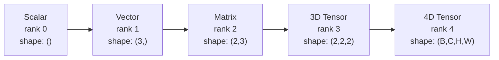
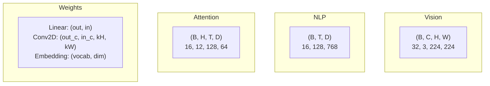
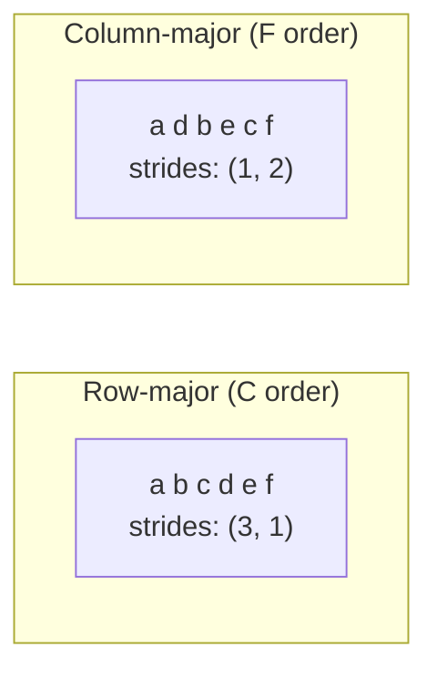

# Operasi Tensor

> Tensor adalah bahasa umum antara data dan pembelajaran mendalam. Setiap gambar, setiap kalimat, setiap gradient mengalir melaluinya.

**Type:** Build
**Language:** Python
**Prerequisites:** Phase 1, Lesson 01 (Intuisi Linear Algebra), 02 (Vector, Matrix & Operasi)
**Waktu:** ~90 menit

## Tujuan Pembelajaran

- Menerapkan kelas tensor dengan operasi bentuk, langkah, pembentukan ulang, transposisi, dan berdasarkan elemen dari awal
- Terapkan aturan penyiaran untuk beroperasi pada tensor dengan bentuk berbeda tanpa menyalin data
- Tulis ekspresi einsum untuk perkalian titik, perkalian matrix, perkalian luar, dan operasi batch
- Lacak bentuk tensor yang tepat melalui setiap langkah attention multi-kepala

## Masalah

kamu membangun Transformer. Umpan ke depan terlihat bersih. kamu menjalankannya dan mendapatkan: `RuntimeError: mat1 and mat2 shapes cannot be multiplied (32x768 and 512x768)`. kamu menatap bentuknya. kamu mencoba transpose. Sekarang tertulis `Expected 4D input (got 3D input)`. kamu menambahkan unsqueeze. Sesuatu yang lain rusak.

Kesalahan bentuk adalah bug paling umum dalam code pembelajaran mendalam. Secara konseptual, mereka tidak sulit -- setiap operasi memiliki bentuk kontrak -- tetapi mereka berkembang biak dengan cepat. Sebuah Transformer memiliki lusinan bentuk ulang, transposisi, dan siaran yang dirangkai menjadi satu. Satu sumbu salah dan kesalahan mengalir. Lebih buruk lagi, beberapa kesalahan bentuk tidak menimbulkan kesalahan sama sekali. Mereka secara diam-diam menghasilkan sampah dengan menyiarkannya dalam dimension yang salah atau menjumlahkan pada sumbu yang salah.

Matrix menangani hubungan berpasangan antara dua himpunan benda. Data nyata tidak cocok dengan dua dimension. Kumpulan 32 gambar RGB pada 224x224 adalah tensor 4D: `(32, 3, 224, 224)`. Attention diri dengan 12 kepala juga 4D: `(batch, heads, seq_len, head_dim)`. kamu memerlukan struktur data yang dapat digeneralisasi ke sejumlah dimension, dengan operasi yang disusun dengan rapi di semua dimension. Struktur itu adalah tensor. Kuasai operasinya dan kesalahan bentuk menjadi mudah di-debug.

## Konsep

### Apa itu tensor

Tensor adalah array angka multidimensi dengan tipe data seragam. Jumlah dimension adalah **peringkat** (atau **urutan**). Setiap dimension adalah **sumbu**. **Bentuk** adalah tupel yang mencantumkan ukuran di sepanjang setiap sumbu.



Total elemen = produk dari semua ukuran. Suatu bentuk `(2, 3, 4)` menampung elemen `2 * 3 * 4 = 24`.

### Bentuk tensor dalam pembelajaran mendalam

Tipe data yang berbeda dipetakan ke bentuk tensor tertentu berdasarkan konvensi.



PyTorch menggunakan NCHW (pipeline pertama). TensorFlow defaultnya adalah NHWC (pipeline terakhir). Tata letak yang tidak cocok menyebabkan pelambatan atau kesalahan secara diam-diam.

### Cara kerja tata letak memori

Array 2D dalam memori adalah urutan byte 1D. **Langkah** memberi tahu kamu berapa banyak elemen yang harus dilewati untuk bergerak satu langkah di setiap sumbu.



Transpose tidak memindahkan data. Ini menukar langkahnya, membuat tensor **tidak bersebelahan** -- elemen untuk sebuah baris tidak lagi berdekatan di memori.

### Aturan penyiaran

Penyiaran memungkinkan kamu mengoperasikan tensor dengan berbagai bentuk tanpa menyalin data. Sejajarkan bentuk dari kanan. Dua dimension kompatibel jika keduanya sama atau salah satunya bernilai 1. Dimension yang lebih sedikit akan diisi dengan angka 1 di sebelah kiri.

```
Tensor A:     (8, 1, 6, 1)
Tensor B:        (7, 1, 5)
Padded B:     (1, 7, 1, 5)
Result:       (8, 7, 6, 5)
```

### Einsum: operasi tensor universal

Penjumlahan Einstein memberi label pada setiap sumbu dengan sebuah huruf. Sumbu pada input tetapi bukan output dijumlahkan. Sumbu di keduanya disimpan.

```mermaid
graph LR
    subgraph "matmul: ik,kj -> ij"
        A["A(I,K)"] --> |"sum over k"| C["C(I,J)"]
        B["B(K,J)"] --> |"sum over k"| C
    end
```Pola utama: `i,i->` (produk titik), `i,j->ij` (produk luar), `ii->` (jejak), `ij->ji` (transpos), `bij,bjk->bik` (matmul batch), `bhtd,bhsd->bhts` (skor attention).

## Build

Code ada di `code/tensors.py`. Setiap langkah merujuk pada implementasi di sana.

### Langkah 1: Penyimpanan tensor dan langkahnya

Tensor menyimpan daftar angka datar ditambah metadata bentuk. Langkahnya memberi tahu logika pengindeksan cara memetakan indeks multidimensi ke posisi datar.

```python
class Tensor:
    def __init__(self, data, shape=None):
        if isinstance(data, (list, tuple)):
            self._data, self._shape = self._flatten_nested(data)
        elif isinstance(data, np.ndarray):
            self._data = data.flatten().tolist()
            self._shape = tuple(data.shape)
        else:
            self._data = [data]
            self._shape = ()

        if shape is not None:
            total = reduce(lambda a, b: a * b, shape, 1)
            if total != len(self._data):
                raise ValueError(
                    f"Cannot reshape {len(self._data)} elements into shape {shape}"
                )
            self._shape = tuple(shape)

        self._strides = self._compute_strides(self._shape)

    @staticmethod
    def _compute_strides(shape):
        if len(shape) == 0:
            return ()
        strides = [1] * len(shape)
        for i in range(len(shape) - 2, -1, -1):
            strides[i] = strides[i + 1] * shape[i + 1]
        return tuple(strides)
```

Untuk bentuk `(3, 4)`, langkahnya adalah `(4, 1)` -- lewati 4 elemen untuk maju satu baris, lewati 1 elemen untuk maju satu kolom.

### Langkah 2: Bentuk kembali, peras, keluarkan

Reshape mengubah bentuk tanpa mengubah urutan elemen. Jumlah total elemen harus tetap sama. Gunakan `-1` untuk satu dimension guna menyimpulkan ukurannya.

```python
t = Tensor(list(range(12)), shape=(2, 6))
r = t.reshape((3, 4))
r = t.reshape((-1, 3))
```

Squeeze menghapus sumbu ukuran 1. Unsqueeze menyisipkan satu. Melepaskan pemerasan sangat penting untuk penyiaran -- vector bias `(D,)` yang ditambahkan ke kumpulan `(B, T, D)` memerlukan pelepasan ke `(1, 1, D)`.

```python
t = Tensor(list(range(6)), shape=(1, 3, 1, 2))
s = t.squeeze()
v = Tensor([1, 2, 3])
u = v.unsqueeze(0)
```

### Langkah 3: Ubah urutan dan permutasi

Transpose menukar dua sumbu. Permute menyusun ulang semua sumbu. Ini adalah bagaimana kamu mengkonversi antara NCHW dan NHWC.

```python
mat = Tensor(list(range(6)), shape=(2, 3))
tr = mat.transpose(0, 1)

t4d = Tensor(list(range(24)), shape=(1, 2, 3, 4))
perm = t4d.permute((0, 2, 3, 1))
```

Setelah transpos atau permutasi, tensor tidak bersebelahan dalam memori. Di PyTorch, `view` gagal pada tensor yang tidak bersebelahan -- gunakan `reshape` atau hubungi `.contiguous()` terlebih dahulu.

### Langkah 4: Operasi dan pengurangan berdasarkan elemen

Operasi berdasarkan elemen (menambah, mengalikan, mengurangi) diterapkan secara independen ke setiap elemen dan mempertahankan bentuknya. Pengurangan (jumlah, rata-rata, maks) menciutkan satu atau lebih sumbu.

```python
a = Tensor([[1, 2], [3, 4]])
b = Tensor([[10, 20], [30, 40]])
c = a + b
d = a * 2
s = a.sum(axis=0)
```

Penggabungan rata-rata global dalam CNN: `(B, C, H, W).mean(axis=[2, 3])` menghasilkan `(B, C)`. Urutan mean pooling di NLP: `(B, T, D).mean(axis=1)` menghasilkan `(B, D)`.

### Langkah 5: Menyiarkan dengan NumPy

Fungsi `demo_broadcasting_numpy()` di `tensors.py` menunjukkan pola inti.

```python
activations = np.random.randn(4, 3)
bias = np.array([0.1, 0.2, 0.3])
result = activations + bias

images = np.random.randn(2, 3, 4, 4)
scale = np.array([0.5, 1.0, 1.5]).reshape(1, 3, 1, 1)
result = images * scale

a = np.array([1, 2, 3]).reshape(-1, 1)
b = np.array([10, 20, 30, 40]).reshape(1, -1)
outer = a * b
```

Distance berpasangan melalui penyiaran: bentuk ulang `(M, 2)` menjadi `(M, 1, 2)` dan `(N, 2)` menjadi `(1, N, 2)`, kurangi, kuadratkan, jumlahkan sepanjang sumbu terakhir, ambil akar kuadrat. Hasil: `(M, N)`.

### Langkah 6: Operasi Einsum

Fungsi `demo_einsum()` dan `demo_einsum_gallery()` menelusuri setiap pola umum.

```python
a = np.array([1.0, 2.0, 3.0])
b = np.array([4.0, 5.0, 6.0])
dot = np.einsum("i,i->", a, b)

A = np.array([[1, 2], [3, 4], [5, 6]], dtype=float)
B = np.array([[7, 8, 9], [10, 11, 12]], dtype=float)
matmul = np.einsum("ik,kj->ij", A, B)

batch_A = np.random.randn(4, 3, 5)
batch_B = np.random.randn(4, 5, 2)
batch_mm = np.einsum("bij,bjk->bik", batch_A, batch_B)
```

Biaya komputasi suatu kontraksi adalah produk dari semua ukuran indeks (disimpan dan dijumlahkan). Untuk `bij,bjk->bik` dengan B=32, I=128, J=64, K=128: `32 * 128 * 64 * 128 = 33,554,432` kalikan-tambahkan.

### Langkah 7: Mekanisme attention melalui einsum

Fungsi `demo_attention_einsum()` mengimplementasikan attention multi-head secara end to end.

```python
B, H, T, D = 2, 4, 8, 16
E = H * D

X = np.random.randn(B, T, E)
W_q = np.random.randn(E, E) * 0.02

Q = np.einsum("bte,ek->btk", X, W_q)
Q = Q.reshape(B, T, H, D).transpose(0, 2, 1, 3)

scores = np.einsum("bhtd,bhsd->bhts", Q, K) / np.sqrt(D)
weights = softmax(scores, axis=-1)
attn_output = np.einsum("bhts,bhsd->bhtd", weights, V)

concat = attn_output.transpose(0, 2, 1, 3).reshape(B, T, E)
output = np.einsum("bte,ek->btk", concat, W_o)
```

Setiap langkah adalah operasi tensor: proyeksi (matmul via einsum), pemisahan head (pembentukan ulang + transpos), skor attention (batch matmul via einsum), jumlah tertimbang (batch matmul via einsum), penggabungan head (transpos + pembentukan ulang), proyeksi output (matmul via einsum).

## Pakai

### Gores vs NumPy| Operasi | Gores (kelas Tensor) | NomorPy |
|---|---|---|
| Buat | `Tensor([[1,2],[3,4]])` | `np.array([[1,2],[3,4]])` |
| Bentuk kembali | `t.reshape((3,4))` | `a.reshape(3,4)` |
| Ubah urutan | `t.transpose(0,1)` | `a.T` atau `a.transpose(0,1)` |
| Peras | `t.squeeze(0)` | `np.squeeze(a, 0)` |
| Jumlah | `t.sum(axis=0)` | `a.sum(axis=0)` |
| Einsum | T/A | `np.einsum("ij,jk->ik", a, b)` |

### Gores vs PyTorch

```python
import torch

t = torch.tensor([[1, 2, 3], [4, 5, 6]], dtype=torch.float32)
t.shape
t.stride()
t.is_contiguous()

t.reshape(3, 2)
t.unsqueeze(0)
t.transpose(0, 1)
t.transpose(0, 1).contiguous()

torch.einsum("ik,kj->ij", A, B)
```

PyTorch menambahkan autograd, dukungan GPU, dan kernel BLAS yang dioptimalkan. Semantik bentuknya identik. Jika kamu memahami versi awal, kesalahan bentuk PyTorch dapat dibaca.

### Setiap layer neural network sebagai operasi tensor

| Operasi | Bentuk Tensor | Einsum |
|---|---|---|
| Layer linier | `Y = X @ W.T + b` | `"bd,od->bo"` + bias |
| Attention QKV | `Q = X @ W_q` | `"btd,dh->bth"` |
| Skor attention | `Q @ K.T / sqrt(d)` | `"bhtd,bhsd->bhts"` |
| Output attention | `softmax(scores) @ V` | `"bhts,bhsd->bhtd"` |
| Norm kumpulan | `(X - mu) / sigma * gamma` | berdasarkan elemen + siaran |
| Softmax | `exp(x) / sum(exp(x))` | berdasarkan elemen + reduksi |

## Kirim

Lesson ini menghasilkan dua prompt yang dapat digunakan kembali:

1. **`outputs/prompt-tensor-shapes.md`** -- Prompt sistematis untuk men-debug ketidakcocokan bentuk tensor. Termasuk tabel keputusan untuk setiap operasi umum (matmul, siaran, cat, Linear, Conv2d, BatchNorm, softmax) dan tabel pencarian perbaikan.

2. **`outputs/prompt-tensor-debugger.md`** -- Prompt debugging langkah demi langkah yang kamu tempelkan ke asisten AI mana pun ketika kesalahan bentuk menghalangi kamu. Berikan pesan kesalahan dan bentuk tensor kamu, dapatkan kembali perbaikan yang tepat.

## Latihan

1. **Mudah -- Bentuk ulang bolak-balik.** Ambil bentuk tensor `(2, 3, 4)`. Bentuk ulang menjadi `(6, 4)`, lalu ke `(24,)`, lalu kembali ke `(2, 3, 4)`. Verifikasi urutan elemen dipertahankan di setiap langkah dengan mencetak data datar.

2. **Sedang -- Menerapkan penyiaran.** Perluas kelas `Tensor` dengan metode `broadcast_to(shape)` yang memperluas dimension ukuran 1 agar sesuai dengan bentuk target. Kemudian ubah `_elementwise_op` agar disiarkan secara otomatis sebelum dioperasikan. Uji dengan bentuk `(3, 1)` dan `(1, 4)` menghasilkan `(3, 4)`.

3. **Sulit -- Build einsum dari awal.** Menerapkan fungsi dasar `einsum(subscripts, *tensors)` yang menangani setidaknya: perkalian titik (`i,i->`), perkalian matrix (`ij,jk->ik`), perkalian luar (`i,j->ij`), dan transpos (`ij->ji`). Parsing string subskrip, identifikasi indeks terkontrak, dan ulangi semua kombinasi indeks. Bandingkan hasil kamu dengan `np.einsum`.

4. **Keras -- Pelacak bentuk attention.** Tulis fungsi yang menggunakan `batch_size`, `seq_len`, `embed_dim`, dan `num_heads` sebagai input dan mencetak bentuk yang tepat pada setiap langkah attention multi-kepala: input, proyeksi Q/K/V, pembagian kepala, skor attention, weight softmax, jumlah tertimbang, penggabungan kepala, proyeksi output. Verifikasi terhadap output `demo_attention_einsum()`.

## Istilah Kunci| Istilah | Apa kata orang | Apa sebenarnya arti |
|---|---|---|
| Tensor | "Sebuah matrix tetapi lebih banyak dimension" | Array multidimensi dengan tipe seragam dan bentuk, langkah, dan operasi yang ditentukan |
| Peringkat | "Jumlah dimension" | Jumlah sumbu. Suatu matrix mempunyai rangking 2, bukan rangking yang sama dengan rangking matriksnya |
| Bentuk | "Ukuran tensor" | Tuple yang mencantumkan ukuran di sepanjang setiap sumbu. `(2, 3)` artinya 2 baris, 3 kolom |
| Langkah | "Bagaimana memori ditata" | Jumlah elemen yang harus dilewati untuk maju satu posisi di sepanjang setiap sumbu |
| Penyiaran | "Ini hanya berfungsi jika bentuknya berbeda" | Seperangkat aturan ketat: sejajar dari kanan, dimension harus sama atau harus 1 |
| Bersebelahan | "Tensornya normal" | Elemen disimpan secara berurutan dalam memori tanpa celah atau penataan ulang dari tata letak logis |
| Einsum | "Cara yang bagus untuk menulis matmul" | Notasi umum yang menyatakan kontraksi tensor, hasil kali luar, jejak, atau transpos dalam satu baris |
| Lihat | "Sama seperti membentuk kembali" | Tensor berbagi buffer memori yang sama tetapi dengan metadata bentuk/langkah yang berbeda. Gagal pada data yang tidak bersebelahan |
| Kontraksi | "Menjumlahkan indeks" | Operasi umum yang mana indeks bersama antara tensor dikalikan dan dijumlahkan, menghasilkan hasil dengan peringkat lebih rendah |
| NCHW / NHWC | "Format PyTorch vs TensorFlow" | Konvensi tata letak memori untuk tensor gambar. NCHW menempatkan pipeline sebelum spasial meredup, NHWC menempatkannya setelah |

## Bacaan Lanjutan

- [NumPy Broadcasting](https://numpy.org/doc/stable/user/basics.broadcasting.html) -- Aturan kanonik dengan contoh visual
- [Tampilan Tensor PyTorch](https://pytorch.org/docs/stable/tensor_view.html) -- Kapan tampilan berfungsi dan kapan disalin
- [einops](https://github.com/arogozhnikov/einops) -- Pustaka yang membuat pembentukan ulang tensor mudah dibaca dan aman
- [The Illustrated Transformer](https://jalammar.github.io/illustrated-transformer/) -- Memvisualisasikan bentuk tensor yang mengalir melalui attention
- [Penjumlahan Einstein di NumPy](https://numpy.org/doc/stable/reference/generated/numpy.einsum.html) -- Dokumentasi einsum lengkap dengan contoh
