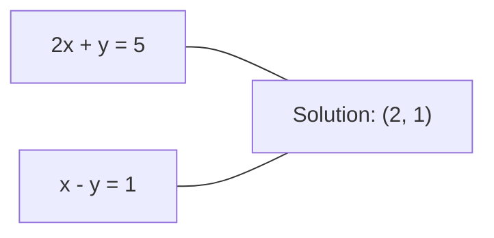
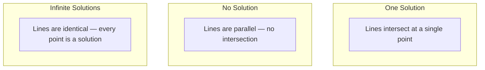

# Sistem Linier

> Menyelesaikan Ax = b adalah soal tertua dalam matematika yang masih menjalankan neural network kamu.

**Type:** Build
**Language:** Python
**Prerequisites:** Phase 1, Lesson 01 (Intuisi Linear Algebra), 02 (Vector & Matrix), 03 (Transformasi Matrix)
**Waktu:** ~120 menit

## Tujuan Pembelajaran

- Selesaikan Ax = b menggunakan eliminasi Gaussian dengan pivoting parsial dan substitusi kembali
- Faktorkan matrix dengan decomposition LU, QR, dan Cholesky dan jelaskan kapan masing-masing matrix sesuai
- Turunkan persamaan normal untuk kuadrat terkecil dan hubungkan ke regresi linier dan punggungan
- Mendiagnosis sistem yang terkondisi buruk menggunakan nomor kondisi dan menerapkan regularisasi untuk menstabilkannya

## Masalah

Setiap kali kamu melatih regresi linier, kamu memecahkan sistem linier. Setiap kali kamu menghitung kecocokan kuadrat terkecil, kamu memecahkan sistem linier. Setiap kali layer neural network menghitung `y = Wx + b`, layer tersebut mengevaluasi satu sisi sistem linier. Saat kamu menambahkan regularisasi, kamu memodifikasi sistem. Saat kamu menggunakan proses Gaussian, kamu memfaktorkan sebuah matrix. Saat kamu membalikkan covariance matrix untuk distance Mahalanobis, kamu memecahkan sistem linier.

Persamaan Ax = b muncul dimana-mana. A adalah matrix koefisien yang diketahui. b adalah vector output yang diketahui. x adalah vector hal yang tidak diketahui yang ingin kamu temukan. Dalam regresi linier, A adalah matrix data kamu, b adalah vector target kamu, dan x adalah vector weight. Keseluruhan model direduksi menjadi: carilah x sedemikian rupa sehingga Ax sedekat mungkin dengan b.

Lesson ini membangun setiap metode utama untuk menyelesaikan persamaan tersebut dari awal. kamu akan memahami mengapa beberapa metode cepat dan yang lainnya stabil, mengapa beberapa metode hanya berfungsi untuk sistem kuadrat dan metode lainnya menangani metode yang terlalu ditentukan, dan mengapa nomor kondisi matrix kamu menentukan apakah jawaban kamu berarti atau tidak.

## Konsep

### Arti Ax = b secara geometris

Suatu sistem persamaan linear mempunyai interpretasi geometri. Setiap persamaan mendefinisikan hyperplane. Solusinya adalah titik (atau himpunan titik) di mana semua hyperplanes berpotongan.

```
2x + y = 5          Two lines in 2D.
x - y  = 1          They intersect at x=2, y=1.
```



Tiga hal bisa terjadi:



Dalam bentuk matrix, “satu solusi” berarti A dapat dibalik. "Tidak ada solusi" berarti sistem tidak konsisten. "Solusi tak terbatas" berarti A memiliki spasi nol. Sebagian besar masalah ML termasuk dalam kategori "tidak ada solusi pasti" karena kamu memiliki lebih banyak persamaan (titik data) daripada (parameter) yang tidak diketahui. Di sinilah peran kuadrat terkecil.

### Gambar kolom vs gambar baris

Ada dua cara membaca Ax = b.

**Gambar baris.** Setiap baris A mendefinisikan satu persamaan. Setiap persamaan adalah hyperplane. Solusinya adalah di mana mereka semua bersinggungan.

**Gambar kolom.** Setiap kolom A adalah vector. Pertanyaannya menjadi: kombinasi linier kolom A yang manakah yang menghasilkan b?

```
A = | 2  1 |    b = | 5 |
    | 1 -1 |        | 1 |

Row picture: solve 2x + y = 5 and x - y = 1 simultaneously.

Column picture: find x1, x2 such that:
  x1 * [2, 1] + x2 * [1, -1] = [5, 1]
  2 * [2, 1] + 1 * [1, -1] = [4+1, 2-1] = [5, 1]   check.
```

Gambar kolom lebih mendasar. Jika b terletak pada ruang kolom A, sistem mempunyai solusi. Jika b tidak, carilah titik terdekat pada ruang kolom. Titik terdekat tersebut adalah solusi kuadrat terkecil.

### Eliminasi Gaussian

Eliminasi Gaussian mengubah Ax = b menjadi sistem segitiga atas Ux = c yang diselesaikan dengan substitusi balik. Ini adalah metode yang paling langsung.

Algoritmanya:

```
1. For each column k (the pivot column):
   a. Find the largest entry in column k at or below row k (partial pivoting).
   b. Swap that row with row k.
   c. For each row i below k:
      - Compute multiplier m = A[i][k] / A[k][k]
      - Subtract m times row k from row i.
2. Back substitute: solve from the last equation upward.
```

Contoh:

```
Original:
| 2  1  1 | 8 |       R2 = R2 - (2)R1     | 2  1   1 |  8 |
| 4  3  3 |20 |  -->  R3 = R3 - (1)R1 --> | 0  1   1 |  4 |
| 2  3  1 |12 |                            | 0  2   0 |  4 |

                       R3 = R3 - (2)R2     | 2  1   1 |  8 |
                                       --> | 0  1   1 |  4 |
                                           | 0  0  -2 | -4 |

Back substitute:
  -2 * x3 = -4    -->  x3 = 2
  x2 + 2  = 4     -->  x2 = 2
  2*x1 + 2 + 2 = 8 --> x1 = 2
```

Eliminasi Gaussian memerlukan biaya operasi O(n^3). Untuk sistem 1000x1000, itu berarti sekitar satu miliar operasi floating-point. Cepat, tetapi kamu bisa melakukannya lebih baik jika kamu perlu menyelesaikan beberapa sistem dengan A yang sama.### Perputaran sebagian: mengapa hal ini penting

Tanpa melakukan pivot, eliminasi Gaussian bisa gagal atau menghasilkan sampah. Jika elemen pivot adalah nol, kamu membaginya dengan nol. Jika kecil, kamu memperbesar kesalahan pembulatan.

```
Bad pivot:                       With partial pivoting:
| 0.001  1 | 1.001 |            Swap rows first:
| 1      1 | 2     |            | 1      1 | 2     |
                                 | 0.001  1 | 1.001 |
m = 1/0.001 = 1000              m = 0.001/1 = 0.001
R2 = R2 - 1000*R1               R2 = R2 - 0.001*R1
| 0.001  1     | 1.001   |      | 1      1     | 2     |
| 0     -999   | -999.0  |      | 0      0.999 | 0.999 |

x2 = 1.000 (correct)            x2 = 1.000 (correct)
x1 = (1.001 - 1)/0.001          x1 = (2 - 1)/1 = 1.000 (correct)
   = 0.001/0.001 = 1.000        Stable because the multiplier is small.
```

Dalam aritmatika floating-point dengan presisi terbatas, versi yang tidak diputar dapat kehilangan angka yang signifikan. Pivot parsial selalu memilih pivot terbesar yang tersedia untuk meminimalkan amplifikasi kesalahan.

### Decomposition LU

Penguraian LU faktor A menjadi matrix segitiga bawah L dan matrix segitiga atas U: A = LU. Matrix L menyimpan pengali dari eliminasi Gaussian. Matrix U merupakan hasil eliminasi.

```
A = L @ U

| 2  1  1 |   | 1  0  0 |   | 2  1   1 |
| 4  3  3 | = | 2  1  0 | @ | 0  1   1 |
| 2  3  1 |   | 1  2  1 |   | 0  0  -2 |
```

Mengapa memfaktorkan dan bukan hanya menghilangkan? Karena setelah kamu memiliki L dan U, menyelesaikan Ax = b untuk b baru hanya membutuhkan O(n^2):

```
Ax = b
LUx = b
Let y = Ux:
  Ly = b    (forward substitution, O(n^2))
  Ux = y    (back substitution, O(n^2))
```

Biaya O(n^3) dibayarkan satu kali pada saat faktorisasi. Setiap penyelesaian berikutnya adalah O(n^2). Jika kamu perlu menyelesaikan 1000 sistem dengan vector A yang sama tetapi berbeda b, LU menghemat faktor 1000/3 dalam total pekerjaan.

Dengan pivot parsial, kamu mendapatkan PA = LU dimana P adalah matrix permutasi yang mencatat pertukaran baris.

### Decomposition QR

Penguraian QR memfaktorkan A menjadi matrix ortogonal Q dan matrix segitiga atas R: A = QR.

Matrix ortogonal mempunyai sifat Q^T Q = I. Kolom-kolomnya merupakan vector ortonormal. Mengalikannya dengan Q akan mempertahankan panjang dan sudut.

```
A = Q @ R

Q has orthonormal columns: Q^T Q = I
R is upper triangular

To solve Ax = b:
  QRx = b
  Rx = Q^T b    (just multiply by Q^T, no inversion needed)
  Back substitute to get x.
```

QR secara numerik lebih stabil daripada LU dalam menyelesaikan permasalahan kuadrat terkecil. Proses Gram-Schmidt membangun Q kolom demi kolom:

```
Given columns a1, a2, ... of A:

q1 = a1 / ||a1||

q2 = a2 - (a2 . q1) * q1        (subtract projection onto q1)
q2 = q2 / ||q2||                (normalize)

q3 = a3 - (a3 . q1) * q1 - (a3 . q2) * q2
q3 = q3 / ||q3||

R[i][j] = qi . aj    for i <= j
```

Setiap langkah menghilangkan komponen sepanjang vector q sebelumnya, hanya menyisakan arah ortogonal baru.

### Decomposition kolesky

Jika A simetris (A = A^T) dan definit positif (semua nilai eigennya positif), kamu dapat memfaktorkannya sebagai A = L L^T dengan L adalah segitiga bawah. Ini adalah decomposition Cholesky.

```
A = L @ L^T

| 4  2 |   | 2  0 |   | 2  1 |
| 2  5 | = | 1  2 | @ | 0  2 |

L[i][i] = sqrt(A[i][i] - sum(L[i][k]^2 for k < i))
L[i][j] = (A[i][j] - sum(L[i][k]*L[j][k] for k < j)) / L[j][j]    for i > j
```

Cholesky dua kali lebih cepat dari LU dan membutuhkan setengah penyimpanan. Ini hanya berfungsi untuk matrix pasti positif simetris, tetapi matrix tersebut muncul terus-menerus:

- Covariance matrix bersifat semi pasti positif simetris (pasti positif dengan regularisasi).
- Kernel matrix dalam proses Gaussian adalah pasti positif simetris.
- Hessian suatu fungsi cembung minimal adalah pasti positif simetris.
- A^TA A selalu merupakan semi-pasti positif simetris.

Dalam proses Gaussian, kamu memfaktorkan kernel matrix K dengan Cholesky, lalu menyelesaikan K alpha = y untuk mendapatkan mean prediktif. Faktor Cholesky juga memberi kamu determinant log untuk kemungkinan marjinal: log det(K) = 2 * sum(log(diag(L))).

### Kuadrat terkecil: ketika Ax = b tidak mempunyai solusi eksak

Jika A adalah mxn dengan m > n (lebih banyak persamaan daripada persamaan yang tidak diketahui), maka sistem tersebut bersifat overdetermined. Tidak ada solusi pasti. Sebaliknya, kamu meminimalkan kesalahan kuadrat:

```
minimize ||Ax - b||^2

This is the sum of squared residuals:
  sum((A[i,:] @ x - b[i])^2 for i in range(m))
```

Minimizer memenuhi persamaan normal:

```
A^T A x = A^T b
```

Turunan: perluas ||Ax - b||^2 = (Ax - b)^T (Ax - b) = x^T A^T A x - 2 x^T A^T b + b^T b. Ambil gradient terhadap x, setel ke nol: 2 A^T A x - 2 A^T b = 0.

```
Original system (overdetermined, 4 equations, 2 unknowns):
| 1  1 |         | 3 |
| 1  2 | x     = | 5 |       No exact x satisfies all 4 equations.
| 1  3 |         | 6 |
| 1  4 |         | 8 |

Normal equations:
A^T A = | 4  10 |    A^T b = | 22 |
        | 10 30 |            | 63 |

Solve: x = [1.5, 1.7]

This is linear regression. x[0] is the intercept, x[1] is the slope.
```

### Persamaan normal = regresi linier

Koneksinya tepat. Dalam regresi linier, matrix data X kamu memiliki satu baris per sample dan satu kolom per feature. Vector target kamu y memiliki satu entri per sample. Vector weight w memenuhi:

```
X^T X w = X^T y
w = (X^T X)^(-1) X^T y
```

Ini adalah solusi bentuk tertutup untuk regresi linier. Setiap panggilan ke `sklearn.linear_model.LinearRegression.fit()` menghitung ini (atau yang setara melalui QR atau SVD).Tambahkan istilah regularisasi lambda * I ke matrix dan kamu mendapatkan regresi ridge:

```
(X^T X + lambda * I) w = X^T y
w = (X^T X + lambda * I)^(-1) X^T y
```

Regularisasi membuat matrix terkondisi lebih baik (lebih mudah diinversi secara akurat) dan mencegah overfitting dengan mengecilkan weight menuju nol. Matrix X^T X + lambda * I selalu pasti positif simetris jika lambda > 0, sehingga kamu dapat menggunakan Cholesky untuk menyelesaikannya.

### Pseudoinverse (Moore-Penrose)

Pseudoinverse A+ menggeneralisasi inversi matrix menjadi matrix non-persegi dan singular. Untuk matrix apa pun A:

```
x = A+ b

where A+ = V Sigma+ U^T    (computed via SVD)
```

Sigma+ dibentuk dengan mengambil kebalikan dari setiap nilai tunggal bukan nol dan mentransposisi hasilnya. Jika A = U Sigma V^T, maka A+ = V Sigma+ U^T.

```
A = U Sigma V^T        (SVD)

Sigma = | 5  0 |       Sigma+ = | 1/5  0  0 |
        | 0  2 |                | 0  1/2  0 |
        | 0  0 |

A+ = V Sigma+ U^T
```

Pseudoinverse memberikan solusi kuadrat terkecil dengan norm minimum. Jika sistem memiliki:
- Satu solusi: A+ b memberikannya.
- Tidak ada solusi: A+ b memberikan solusi kuadrat terkecil.
- Solusi tak terhingga: A+ b menghasilkan solusi dengan ||x|| terkecil.

`np.linalg.lstsq` dan `np.linalg.pinv` NumPy keduanya menggunakan SVD secara internal.

### Nomor kondisi

Nomor kondisi mengukur seberapa sensitif solusi terhadap perubahan kecil pada input. Untuk matrix A, bilangan kondisinya adalah:

```
kappa(A) = ||A|| * ||A^(-1)|| = sigma_max / sigma_min
```

dimana sigma_max dan sigma_min adalah nilai tunggal terbesar dan terkecil.

```
Well-conditioned (kappa ~ 1):        Ill-conditioned (kappa ~ 10^15):
Small change in b -->                Small change in b -->
small change in x                    huge change in x

| 2  0 |   kappa = 2/1 = 2          | 1   1          |   kappa ~ 10^15
| 0  1 |   safe to solve            | 1   1+10^(-15) |   solution is garbage
```

Aturan praktis:
- kappa < 100 : aman, solusi akurat.
- kappa ~ 10^k: kamu kehilangan sekitar k digit presisi dari aritmatika floating-point kamu.
- kappa ~ 10^16 (untuk float64): solusinya tidak ada artinya. Matriksnya secara efektif bersifat tunggal.

Dalam ML, pengondisian buruk terjadi ketika feature-fiturnya hampir kolinear. Regularisasi (menambahkan lambda * I) meningkatkan nomor kondisi dari sigma_max / sigma_min menjadi (sigma_max + lambda) / (sigma_min + lambda).

### Metode berulang: konjugasi gradient

Untuk sistem sparse yang sangat besar (jutaan yang tidak diketahui), metode langsung seperti LU atau Cholesky terlalu mahal. Metode iteratif memperkirakan solusi dengan meningkatkan tebakan pada banyak iterasi.

Gradient konjugasi (CG) menyelesaikan Ax = b ketika A simetris pasti positif. Ia menemukan solusi eksak paling banyak dalam n iterasi (dalam aritmatika eksak), namun biasanya konvergen jauh lebih cepat jika eigenvalue dari A dikelompokkan.

```
Algorithm sketch:
  x0 = initial guess (often zero)
  r0 = b - A x0           (residual)
  p0 = r0                 (search direction)

  For k = 0, 1, 2, ...:
    alpha = (rk . rk) / (pk . A pk)
    x_{k+1} = xk + alpha * pk
    r_{k+1} = rk - alpha * A pk
    beta = (r_{k+1} . r_{k+1}) / (rk . rk)
    p_{k+1} = r_{k+1} + beta * pk
    if ||r_{k+1}|| < tolerance: stop
```

CG digunakan dalam:
- Optimization skala besar (metode Newton-CG)
- Mengatasi diskritisasi PDE
- Metode kernel dimana kernel matrix terlalu besar untuk difaktorkan
- Pengkondisian awal untuk pemecah berulang lainnya

Tingkat konvergensi tergantung pada nomor kondisi. Sistem yang terkondisi lebih baik menyatu lebih cepat, yang merupakan alasan lain mengapa regularisasi dapat membantu.

### Gambaran lengkap: metode yang mana, kapan

| Metode | Persyaratan | Biaya | Kasus penggunaan |
|--------|-------------|------|----------|
| Eliminasi Gaussian | Persegi, bukan tunggal A | O(n^3) | Penyelesaian satu kali dari sistem persegi |
| Decomposition LU | Persegi, bukan tunggal A | O(n^3) faktor + O(n^2) selesaikan | Beberapa penyelesaian dengan A | yang sama
| Decomposition QR | Setiap A (m >= n) | O(mn^2) | Kuadrat terkecil, stabil secara numerik |
| Cholesky | Pasti positif simetris A | O(n^3/3) | Covariance matrix, proses Gaussian, regresi ridge |
| Persamaan normal | Terlalu ditentukan (m > n) | O(mn^2 + n^3) | Regresi linier (n kecil) |
| SVD / pseudoinverse | Setiap A | O(mn^2) | Sistem dengan kekurangan peringkat, solusi norm minimum |
| Gradient konjugasi | Pasti positif simetris, A | jarang O(n * k * nnz) | Sistem renggang besar, k = iterasi |

### Koneksi ke MLSetiap metode dalam lesson ini muncul di ML produksi:

**Regresi linier.** Solusi bentuk tertutup menyelesaikan persamaan normal X^T X w = X^T y. Hal ini dilakukan melalui Cholesky (jika n kecil) atau QR (jika stabilitas numerik penting) atau SVD (jika matrix mungkin kekurangan peringkat).

**Regresi punggungan.** Menambahkan lambda * I ke X^T X. Sistem yang diatur (X^T X + lambda * I) w = X^T y selalu dapat diselesaikan melalui Cholesky karena X^T X + lambda * I adalah pasti positif simetris untuk lambda > 0.

**Proses Gaussian.** Rata-rata prediktif memerlukan penyelesaian K alpha = y dengan K adalah kernel matrix. Faktorisasi Cholesky dari K adalah pendekatan standar. Kemungkinan marjinal log menggunakan log det(K) = 2 jumlah(log(diag(L))).

**Inisialisasi jaringan neural.** Inisialisasi ortogonal menggunakan decomposition QR untuk membuat matrix weight yang kolomnya ortonormal. Hal ini mencegah runtuhnya sinyal di jaringan dalam.

**Prakondisi.** Optimizer skala besar menggunakan Cholesky yang tidak lengkap atau LU yang tidak lengkap sebagai prakondisi untuk pemecah gradient konjugasi.

**Rekayasa feature.** Nomor kondisi X^T X memberi tahu kamu apakah feature kamu kolinear. Jika kappa besar, hilangkan feature atau tambahkan regularisasi.

## Build

### Langkah 1: Eliminasi Gaussian dengan pivoting parsial

```python
import numpy as np

def gaussian_elimination(A, b):
    n = len(b)
    Ab = np.hstack([A.astype(float), b.reshape(-1, 1).astype(float)])

    for k in range(n):
        max_row = k + np.argmax(np.abs(Ab[k:, k]))
        Ab[[k, max_row]] = Ab[[max_row, k]]

        if abs(Ab[k, k]) < 1e-12:
            raise ValueError(f"Matrix is singular or nearly singular at pivot {k}")

        for i in range(k + 1, n):
            m = Ab[i, k] / Ab[k, k]
            Ab[i, k:] -= m * Ab[k, k:]

    x = np.zeros(n)
    for i in range(n - 1, -1, -1):
        x[i] = (Ab[i, -1] - Ab[i, i+1:n] @ x[i+1:n]) / Ab[i, i]

    return x
```

### Langkah 2: Decomposition LU

```python
def lu_decompose(A):
    n = A.shape[0]
    L = np.eye(n)
    U = A.astype(float).copy()
    P = np.eye(n)

    for k in range(n):
        max_row = k + np.argmax(np.abs(U[k:, k]))
        if max_row != k:
            U[[k, max_row]] = U[[max_row, k]]
            P[[k, max_row]] = P[[max_row, k]]
            if k > 0:
                L[[k, max_row], :k] = L[[max_row, k], :k]

        for i in range(k + 1, n):
            L[i, k] = U[i, k] / U[k, k]
            U[i, k:] -= L[i, k] * U[k, k:]

    return P, L, U

def lu_solve(P, L, U, b):
    n = len(b)
    Pb = P @ b.astype(float)

    y = np.zeros(n)
    for i in range(n):
        y[i] = Pb[i] - L[i, :i] @ y[:i]

    x = np.zeros(n)
    for i in range(n - 1, -1, -1):
        x[i] = (y[i] - U[i, i+1:] @ x[i+1:]) / U[i, i]

    return x
```

### Langkah 3: Decomposition Cholesky

```python
def cholesky(A):
    n = A.shape[0]
    L = np.zeros_like(A, dtype=float)

    for i in range(n):
        for j in range(i + 1):
            s = A[i, j] - L[i, :j] @ L[j, :j]
            if i == j:
                if s <= 0:
                    raise ValueError("Matrix is not positive definite")
                L[i, j] = np.sqrt(s)
            else:
                L[i, j] = s / L[j, j]

    return L
```

### Langkah 4: Kuadrat terkecil melalui persamaan normal

```python
def least_squares_normal(A, b):
    AtA = A.T @ A
    Atb = A.T @ b
    return gaussian_elimination(AtA, Atb)

def ridge_regression(A, b, lam):
    n = A.shape[1]
    AtA = A.T @ A + lam * np.eye(n)
    Atb = A.T @ b
    L = cholesky(AtA)
    y = np.zeros(n)
    for i in range(n):
        y[i] = (Atb[i] - L[i, :i] @ y[:i]) / L[i, i]
    x = np.zeros(n)
    for i in range(n - 1, -1, -1):
        x[i] = (y[i] - L.T[i, i+1:] @ x[i+1:]) / L.T[i, i]
    return x
```

### Langkah 5: Nomor kondisi

```python
def condition_number(A):
    U, S, Vt = np.linalg.svd(A)
    return S[0] / S[-1]
```

## Pakai

Menyatukan potongan-potongan untuk regresi linier dan regresi ridge pada data nyata:

```python
np.random.seed(42)
X_raw = np.random.randn(100, 3)
w_true = np.array([2.0, -1.0, 0.5])
y = X_raw @ w_true + np.random.randn(100) * 0.1

X = np.column_stack([np.ones(100), X_raw])

w_ols = least_squares_normal(X, y)
print(f"OLS weights (ours):    {w_ols}")

w_np = np.linalg.lstsq(X, y, rcond=None)[0]
print(f"OLS weights (numpy):   {w_np}")
print(f"Max difference: {np.max(np.abs(w_ols - w_np)):.2e}")

w_ridge = ridge_regression(X, y, lam=1.0)
print(f"Ridge weights (ours):  {w_ridge}")

from sklearn.linear_model import Ridge
ridge_sk = Ridge(alpha=1.0, fit_intercept=False)
ridge_sk.fit(X, y)
print(f"Ridge weights (sklearn): {ridge_sk.coef_}")
```

## Kirim

Lesson ini menghasilkan:
- `code/linear_systems.py` berisi implementasi eliminasi Gaussian dari awal, decomposition LU, decomposition Cholesky, kuadrat terkecil, dan regresi ridge
- Demonstrasi kerja bahwa persamaan normal dan Regresi Linier sklearn menghasilkan weight yang sama

## Latihan

1. Selesaikan sistem `[[1,2,3],[4,5,6],[7,8,10]] x = [6, 15, 27]` menggunakan eliminasi Gaussian, pemecah LU kamu, dan `np.linalg.solve`. Pastikan ketiganya memberikan jawaban yang sama dalam toleransi floating-point.

2. Hasilkan matrix acak X berukuran 50x5 dan target y = X @ w_true + noise. Selesaikan w menggunakan persamaan normal, QR (melalui `np.linalg.qr`), SVD (melalui `np.linalg.svd`), dan `np.linalg.lstsq`. Bandingkan keempat solusi. Ukur bilangan kondisi X^T X dan jelaskan pengaruhnya terhadap metode mana yang kamu percayai.

3. Buat matrix yang hampir singular dengan membuat dua kolom hampir identik (misalnya kolom 2 = kolom 1 + 1e-10 * noise). Hitung nomor kondisinya. Selesaikan Ax = b dengan dan tanpa regularisasi (tambahkan 0,01 * I). Bandingkan solusi dan residunya. Jelaskan mengapa regularisasi membantu.

4. Menerapkan algoritma gradient konjugasi untuk matrix pasti positif simetris acak berukuran 100x100. Hitung berapa banyak iterasi yang diperlukan untuk mencapai toleransi 1e-8. Bandingkan dengan maksimum teoritis n iterasi.

5. Atur waktu pemecah Cholesky kamu vs pemecah LU kamu vs `np.linalg.solve` pada matrix pasti positif simetris berukuran 10, 50, 200, 500. Plot hasilnya. Verifikasi Cholesky kira-kira 2x lebih cepat dari LU.

## Istilah Kunci| Istilah | Apa kata orang | Apa sebenarnya arti |
|------|----------------|----------------------|
| Sistem linier | "Pecahkan untuk x" | Himpunan persamaan linear Ax = b. Mencari x berarti mencari input yang menghasilkan output b pada transformasi A. |
| Eliminasi Gaussian | "Pengurangan baris" | Secara sistematis menghilangkan entri di bawah diagonal menggunakan operasi baris, menghasilkan sistem segitiga atas yang dapat diselesaikan dengan substitusi kembali. O(n^3). |
| Berputar sebagian | "Tukar baris untuk stabilitas" | Sebelum menghilangkan di kolom k, tukar baris dengan nilai absolut terbesar di kolom tersebut ke posisi pivot. Mencegah pembagian dengan jumlah kecil. |
| Decomposition LU | "Faktorkan menjadi segitiga" | Tuliskan A = LU dimana L adalah segitiga bawah (menyimpan pengali) dan U adalah segitiga atas (matrix yang dihilangkan). Mengamortisasi biaya O(n^3) pada beberapa penyelesaian. |
| Decomposition QR | "Faktorisasi ortogonal" | Tulis A = QR dimana Q mempunyai kolom ortonormal dan R adalah segitiga atas. Lebih stabil dari LU untuk kuadrat terkecil. |
| Decomposition Cholesky | "Akar kuadrat dari suatu matrix" | Untuk A pasti positif simetris, tulislah A = LL^T. Setengah biaya LU. Digunakan untuk covariance matrix, kernel matrix, dan regresi ridge. |
| Kuadrat terkecil | "Paling cocok ketika tidak mungkin tepatnya" | Minimalkan jumlah sisa kuadrat ||Ax - b||^2 ketika sistem terlalu ditentukan (lebih banyak persamaan daripada yang tidak diketahui). |
| Persamaan normal | "Pintasan kalkulus" | A^T A x = A^T b. Mengatur gradient ||Ax - b||^2 menjadi nol. Ini adalah solusi bentuk tertutup untuk regresi linier. |
| Pembalikan semu | "Inversi untuk matrix non-persegi" | A+ = V Sigma+ U^T melalui SVD. Memberikan solusi kuadrat terkecil dengan norm minimum untuk matrix apa pun, persegi atau persegi panjang, tunggal atau tidak. |
| Nomor kondisi | "Betapa dapat dipercayanya jawaban ini" | kappa = sigma_max / sigma_min. Mengukur sensitivitas terhadap gangguan input. Kehilangan sekitar log10(kappa) digit presisi. |
| Regresi punggung bukit | "Kuadrat terkecil yang diregulasi" | Selesaikan (X^T X + lambda I) w = X^T y. Menambahkan lambda I meningkatkan pengondisian dan mengecilkan weight menuju nol. Mencegah overfitting. |
| Gradient konjugasi | "Iteratif Ax=b untuk matrix besar" | Pemecah berulang untuk sistem pasti positif simetris. Menyatu paling banyak dalam n langkah. Praktis untuk sistem spar besar dimana faktorisasi terlalu mahal. |
| Sistem yang terlalu ditentukan | "Lebih banyak data daripada parameter" | m > n dalam sistem m-kali-n. Tidak ada solusi pasti. Kuadrat terkecil menemukan perkiraan terbaik. Ini adalah setiap masalah regresi. |
| Substitusi kembali | "Selesaikan dari bawah ke atas" | Diberikan sistem segitiga atas, selesaikan persamaan terakhir terlebih dahulu, lalu substitusikan ke belakang. O(n^2). |
| Substitusi maju | "Selesaikan dari atas ke bawah" | Diberikan sistem segitiga bawah, selesaikan persamaan pertama terlebih dahulu, lalu substitusikan. O(n^2). Digunakan dalam langkah L penyelesaian LU. |

## Bacaan Lanjutan- [MIT 18.06: Linear Algebra](https://ocw.mit.edu/courses/18-06-linear-algebra-spring-2010/) (Gilbert Strang) -- kursus definitif tentang sistem linier dan faktorisasi matrix
- [Aljabar Linear Numerik](https://people.maths.ox.ac.uk/trefethen/text.html) (Trefethen & Bau) -- referensi standar untuk memahami stabilitas numerik, pengkondisian, dan mengapa algoritma gagal
- [Perhitungan Matrix](https://www.cs.cornell.edu/cv/GolubVanLoan4/golubandvanloan.htm) (Golub & Van Loan) -- referensi ensiklopedis untuk setiap algoritma matrix
- [3Blue1Brown: Inverse Matrices](https://www.3blue1 brown.com/lessons/inverse-matrices) -- intuisi visual tentang arti penyelesaian Ax = b secara geometris
