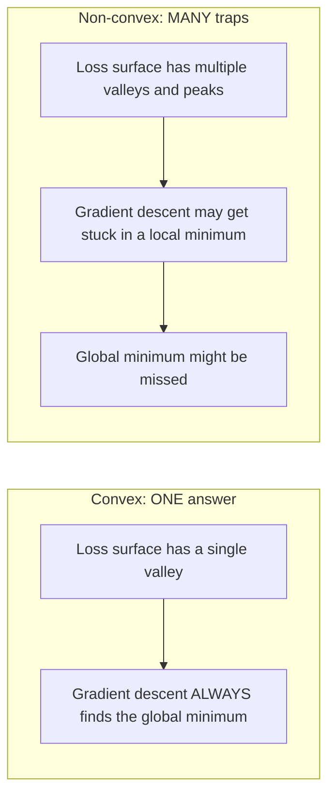
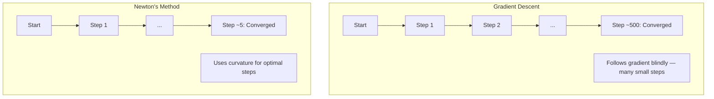
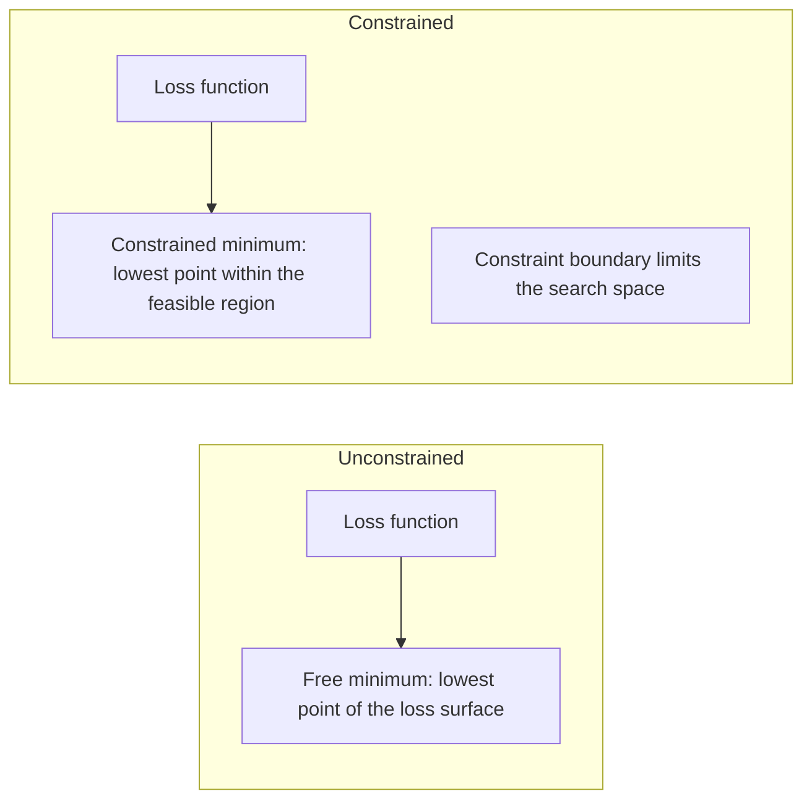
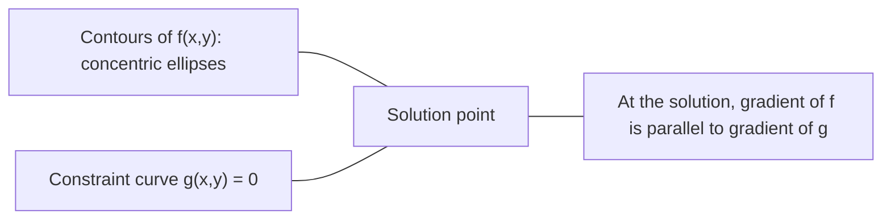

# Optimization Cembung

> Soal cembung mempunyai satu lembah. Jaringan saraf memiliki jutaan. Mengetahui perbedaan itu penting.

**Type:** Build
**Language:** Python
**Prerequisites:** Fase 1, Lesson 04 (Kalkulus untuk ML), 08 (Optimization)
**Waktu:** ~90 menit

## Tujuan Pembelajaran

- Uji apakah suatu fungsi cembung menggunakan definisi, turunan kedua, dan kriteria Hessian
- Menerapkan metode Newton dan membandingkan konvergensi kuadratnya dengan gradient descent
- Memecahkan masalah optimization terbatas menggunakan pengali Lagrange dan menginterpretasikan kondisi KKT
- Jelaskan mengapa lanskap kehilangan neural network bersifat non-cembung namun SGD masih menemukan solusi yang baik

## Masalah

Lesson 08 mengajarkan kamu gradient descent, momentum, dan Adam. Optimizer tersebut berjalan menuruni bukit di permukaan apa pun. Tapi mereka datang tanpa jaminan. Gradient descent pada lanskap non-cembung mungkin terjadi pada titik minimum lokal yang buruk, tertahan di titik pelana, atau terombang-ambing selamanya. kamu tetap menggunakannya karena neural network tidak cembung dan tidak ada alternatif lain.

Namun banyak masalah dalam machine learning yang bersifat cembung. Regresi linier, regresi logistik, SVM, LASSO, regresi ridge. Untuk ini, ada sesuatu yang lebih kuat: optimization dengan jaminan matematis. Masalah cembung mempunyai tepat satu lembah. Algoritme apa pun yang berjalan menurun akan mencapai minimum global. Tidak perlu memulai ulang. Tidak ada learning rate schedule. Tidak ada doa.

Memahami konveksitas menghasilkan tiga hal. Pertama, ini memberi tahu kamu kapan soal kamu mudah (cembung) versus sulit (non-cembung). Kedua, ini memberi kamu alat yang lebih cepat seperti metode Newton untuk masalah cembung. Ketiga, ini menjelaskan konsep yang muncul di seluruh ML: regularisasi sebagai batasan, dualitas dalam SVM, dan mengapa pembelajaran mendalam berhasil meskipun melanggar setiap properti bagus yang diberikan konveksitas kepada kamu.

## Konsep

### Himpunan cembung

Suatu himpunan S dikatakan cembung jika untuk dua titik mana pun di S, ruas garis di antara keduanya juga terletak seluruhnya di S.

| Himpunan cembung | Tidak cembung |
|---|---|
| **Persegi Panjang**: dua titik mana pun di dalamnya dapat dihubungkan dengan ruas garis yang berada di dalam | **Bentuk bintang/bulan sabit**: garis antara dua titik dalam dapat lewat di luar himpunan |
| **Segitiga**: properti yang sama berlaku untuk semua titik interior | **Donut/annulus**: lubang berarti beberapa segmen garis meninggalkan himpunan |
| Ruas garis antara dua titik mana pun tetap berada dalam himpunan | Ruas garis antara beberapa pasang titik keluar dari himpunan |

Uji formal: untuk sembarang titik x, y di S dan sembarang t di [0, 1], titik tx + (1-t)y juga ada di S.

Contoh himpunan cembung:
- Sebuah garis, sebuah bidang, semuanya R^n
- Bola (lingkaran, bola, hipersfer)
- Setengah spasi: {x : a^T x <= b}
- Perpotongan sejumlah himpunan cembung

Contoh himpunan tak cembung:
- Donat (annulus)
- Penyatuan dua lingkaran yang saling lepas
- Set apa pun dengan "penyok" atau "lubang"

### Fungsi cembung

Suatu fungsi f cembung jika domainnya adalah himpunan cembung dan untuk dua titik x, y di domainnya dan sembarang t di [0, 1]:

```
f(tx + (1-t)y) <= t*f(x) + (1-t)*f(y)
```

Secara geometris: ruas garis antara dua titik pada grafik terletak di atas atau pada grafik.| Properti | Fungsi cembung | Fungsi non-cembung |
|---|---|---|
| **Uji ruas garis** | Garis antara dua titik pada grafik terletak **di atas atau di** kurva | Garis antara beberapa titik pada grafik turun **di bawah** kurva |
| **Bentuk** | Mangkuk/lembah tunggal melengkung ke atas | Banyak puncak dan lembah dengan kelengkungan campuran |
| **Minimal lokal** | Setiap minimum lokal adalah minimum global | Beberapa minimum lokal mungkin ada pada ketinggian yang berbeda |

Fungsi cembung umum:
- f(x) = x^2 (parabola)
- f(x) = |x| (nilai absolut)
- f(x) = e^x (eksponensial)
- f(x) = max(0, x) (ReLU, meskipun linear sepotong-sepotong)
- f(x) = -log(x) untuk x > 0 (log negatif)
- Fungsi linier apa pun f(x) = a^T x + b (cembung dan cekung)

### Menguji konveksitas

Tiga tes praktis, dari yang paling mudah hingga yang paling ketat.

**Ujian 1: Uji turunan kedua (1D).** Jika f''(x) >= 0 untuk semua x, maka f cembung.

- f(x) = x^2: f''(x) = 2 >= 0. Cembung.
- f(x) = x^3: f''(x) = 6x. Negatif untuk x < 0. Tidak cembung.
- f(x) = e^x: f''(x) = e^x > 0. Cembung.

**Uji 2: Uji Hessian (multivariat).** Jika matrix Hessian H(x) bernilai semidefinite positif untuk semua x, maka f cembung. Hessian adalah matrix turunan parsial kedua.

**Tes 3: Uji definisi.** Periksa pertidaksamaan f(tx + (1-t)y) <= t*f(x) + (1-t)*f(y) secara langsung. Berguna untuk fungsi yang turunannya sulit dihitung.

### Mengapa konveksitas itu penting

Teorema utama optimization cembung:

**Untuk fungsi cembung, setiap minimum lokal adalah minimum global.**

Ini berarti gradient descent tidak bisa terjebak. Jalan menurun apa pun mengarah pada jawaban yang sama. Algoritma dijamin konvergen pada solusi optimal.



Konsekuensi:
- Tidak perlu restart secara acak
- Tidak perlu learning rate schedule yang rumit
- Bukti konvergensi dimungkinkan (laju bergantung pada properti fungsi)
- Solusinya unik (sampai daerah datar)

### Cembung vs non-cembung di ML

| Masalah | Cembung? | Mengapa |
|---------|---------|-----|
| Regresi linier (MSE) | Ya | Loss adalah kuadrat dalam weight |
| Regresi logistik | Ya | Log-loss berbentuk cembung dalam weight |
| SVM (kehilangan engsel) | Ya | Maksimum fungsi linier |
| LASSO (regresi L1) | Ya | Jumlah fungsi cembung adalah cembung |
| Regresi punggungan (L2) | Ya | Kuadrat + kuadrat = cembung |
| Jaringan saraf (loss apa pun) | Tidak | Activation nonlinier membuat lanskap non-cembung |
| pengelompokan k-means | Tidak | Langkah penugasan diskrit |
| Faktorisasi matrix | Tidak | Produk yang tidak diketahui |

Model linier dengan loss cembung bersifat cembung. Saat kamu menambahkan layer tersembunyi dengan activation nonlinier, konveksitas terputus.

### Matrix Hessian

Hessian H dari suatu fungsi f: R^n -> R adalah matrix n x n turunan parsial kedua.

```
H[i][j] = d^2 f / (dx_i dx_j)
```

Untuk f(x, y) = x^2 + 3xy + y^2:

```
df/dx = 2x + 3y       d^2f/dx^2 = 2      d^2f/dxdy = 3
df/dy = 3x + 2y       d^2f/dydx = 3      d^2f/dy^2 = 2

H = [ 2  3 ]
    [ 3  2 ]
```

Hessian memberitahu kamu tentang kelengkungan:
- Eigenvalue semuanya positif: fungsi melengkung ke atas di segala arah (cembung pada titik tersebut)
- Eigenvalue semuanya negatif: melengkung ke bawah di segala arah (cekung, maks lokal)
- Tanda campuran: titik pelana (melengkung ke atas di beberapa arah, ke bawah di arah lain)
- Eigenvalue nol: datar ke arah tersebut (merosot)

Untuk konveksitas, Hessian harus berupa semidefinite positif (semua eigenvalue >= 0) di semua tempat, tidak hanya di satu titik.

### Metode NewtonPenurunan gradient menggunakan informasi orde pertama (gradient). Metode Newton menggunakan informasi orde kedua (Hessian). Ini cocok dengan perkiraan kuadrat pada titik saat ini dan melompat langsung ke nilai minimum kuadrat tersebut.

```
Update rule:
  x_new = x - H^(-1) * gradient

Compare to gradient descent:
  x_new = x - lr * gradient
```

Metode Newton menggantikan learning rate scalar dengan kebalikan Hessian. Ini secara otomatis menyesuaikan ukuran dan arah langkah berdasarkan kelengkungan lokal.



Keuntungan:
- Konvergensi kuadrat mendekati minimum (kuadrat kesalahan setiap langkah)
- Tidak ada learning rate yang perlu disesuaikan
- Skala-invarian (berfungsi terlepas dari bagaimana kamu membuat parameter masalah)

Kekurangan:
- Menghitung biaya Hessian O(n^2) memori dan O(n^3) untuk membalikkan
- Untuk neural network dengan 1 juta weight, itu berarti 10^12 entri dan 10^18 operasi
- Tidak praktis untuk pembelajaran mendalam

### Optimization terbatas

Optimization tanpa batasan: minimalkan f(x) pada semua x.
Optimization terbatas: minimalkan f(x) sesuai dengan batasan.

Masalah nyata mempunyai kendala. kamu ingin meminimalkan biaya tetapi anggaran kamu terbatas. kamu ingin meminimalkan kesalahan tetapi kompleksitas model kamu terbatas.



### Pengganda lagrange

Metode pengali Lagrange mengubah permasalahan yang dibatasi menjadi permasalahan yang tidak dibatasi.

Soal: minimalkan f(x) dengan syarat g(x) = 0.

Solusi: perkenalkan variabel baru (lamda pengganda Lagrange) dan selesaikan masalah yang tidak dibatasi:

```
L(x, lambda) = f(x) + lambda * g(x)
```

Pada penyelesaiannya, gradient L adalah nol:

```
dL/dx = df/dx + lambda * dg/dx = 0
dL/dlambda = g(x) = 0
```

Intuisi geometri: pada batasan minimum, gradient f harus sejajar dengan gradient batasan g. Jika keduanya tidak sejajar, kamu dapat bergerak sepanjang permukaan pembatas dan mengurangi f lebih jauh.



Contoh: perkecil f(x,y) = x^2 + y^2 dengan syarat x + y = 1.

```
L = x^2 + y^2 + lambda(x + y - 1)

dL/dx = 2x + lambda = 0  =>  x = -lambda/2
dL/dy = 2y + lambda = 0  =>  y = -lambda/2
dL/dlambda = x + y - 1 = 0

From first two: x = y
Substituting: 2x = 1, so x = y = 0.5, lambda = -1
```

Titik terdekat pada garis x + y = 1 dengan titik asal adalah (0,5, 0,5).

### Syarat KKT

Kondisi Karush-Kuhn-Tucker memperluas pengganda Lagrange ke batasan ketimpangan.

Soal: minimalkan f(x) dengan syarat g_i(x) <= 0 untuk i = 1, ..., m.

Kondisi KKT (diperlukan untuk optimalitas):

```
1. Stationarity:    df/dx + sum(lambda_i * dg_i/dx) = 0
2. Primal feasibility:  g_i(x) <= 0  for all i
3. Dual feasibility:    lambda_i >= 0  for all i
4. Complementary slackness:  lambda_i * g_i(x) = 0  for all i
```

Kelambanan yang saling melengkapi adalah wawasan utama: apakah batasannya aktif (g_i = 0, solusinya berada di batas) atau pengalinya nol (batasan tidak menjadi masalah). Batasan yang tidak mempengaruhi solusi mempunyai lambda = 0.

Kondisi KKT sangat penting bagi SVM. Vector pendukung adalah titik data di mana batasan aktif (lambda > 0). Semua titik data lainnya memiliki lambda = 0 dan tidak mempengaruhi batas keputusan.

### Regularisasi sebagai optimization terbatas

Regularisasi L1 dan L2 bukanlah trik sembarangan. Itu adalah masalah optimization yang terselubung.

**Regulerisasi L2 (Ridge):**

```
minimize  Loss(w)  subject to  ||w||^2 <= t

Equivalent unconstrained form:
minimize  Loss(w) + lambda * ||w||^2
```

Batasan ||w||^2 <= t mendefinisikan bola (lingkaran dalam 2D, bola dalam 3D). Solusinya adalah dimana kontur loss pertama kali menyentuh bola ini.

**Regulerisasi L1 (LASSO):**

```
minimize  Loss(w)  subject to  ||w||_1 <= t

Equivalent unconstrained form:
minimize  Loss(w) + lambda * ||w||_1
```

Batasan ||w||_1 <= t mendefinisikan berlian (kotak diputar dalam 2D).| Properti | Batasan L2 (lingkaran) | Batasan L1 (berlian) |
|---|---|---|
| **Bentuk batasan** | Lingkaran (bola di tingkat yang lebih tinggi meredup) | Berlian (kotak diputar dalam 2D) |
| **Dimana kontur loss menyentuh** | Batas halus — titik mana pun pada lingkaran | Sudut — sejajar dengan sumbu |
| **Perilaku solusi** | Bobotnya kecil tapi bukan nol | Beberapa weight tepat nol (jarang) |
| **Hasil** | Penyusutan berat | Pemilihan feature |

Hal ini menjelaskan mengapa L1 menghasilkan model yang jarang (pemilihan feature) sedangkan L2 hanya menyusutkan weight. Berlian itu memiliki sudut-sudut yang sejajar dengan sumbu. Kontur yang hilang cenderung menyentuh sudut, menetapkan satu atau lebih weight tepat ke nol.

### Dualitas

Setiap masalah optimization terbatas (primal) mempunyai masalah pendamping (dual). Untuk soal cembung, primal dan ganda memiliki nilai optimal yang sama. Ini adalah dualitas yang kuat.

Fungsi ganda Lagrangian:

```
Primal: minimize f(x) subject to g(x) <= 0
Lagrangian: L(x, lambda) = f(x) + lambda * g(x)
Dual function: d(lambda) = min_x L(x, lambda)
Dual problem: maximize d(lambda) subject to lambda >= 0
```

Mengapa dualitas penting:
- Masalah ganda terkadang lebih mudah diselesaikan daripada masalah utama
- SVM diselesaikan dalam bentuk gandanya, di mana masalahnya bergantung pada perkalian titik antar titik data (mengaktifkan trik kernel)
- Dual memberikan batas bawah pada primal optimum, berguna untuk memeriksa kualitas solusi

Khusus untuk SVM:

```
Primal: find w, b that maximize the margin 2/||w|| subject to
        y_i(w^T x_i + b) >= 1 for all i

Dual:   maximize sum(alpha_i) - 0.5 * sum_ij(alpha_i * alpha_j * y_i * y_j * x_i^T x_j)
        subject to alpha_i >= 0 and sum(alpha_i * y_i) = 0

The dual only involves dot products x_i^T x_j.
Replace x_i^T x_j with K(x_i, x_j) to get the kernel trick.
```

### Mengapa pembelajaran mendalam berhasil meskipun tidak konveksitas

Loss function neural network sangat non-cembung. Berdasarkan setiap ukuran klasik, optimization-nya pasti gagal. Namun gradient descent stokastik menemukan solusi yang baik dan andal. Beberapa faktor menjelaskan hal ini.

**Sebagian besar nilai minimum lokal sudah cukup baik.** Dalam ruang berdimensi tinggi, titik kritis acak (yang gradiennya nol) sebagian besar merupakan titik pelana, bukan nilai minimum lokal. Beberapa nilai minimum lokal yang ada cenderung memiliki nilai loss yang mendekati nilai minimum global. Terjebak dalam minimum lokal yang buruk sangat tidak mungkin terjadi ketika ruang parameter memiliki jutaan dimension.

**Titik pelana, bukan titik minimum lokal, adalah hambatan sebenarnya.** Dalam fungsi dengan n parameter, titik pelana memiliki gabungan arah kelengkungan positif dan negatif. Untuk titik kritis acak dalam high-dimensional, probabilitas semua n eigenvalue menjadi positif (minimum lokal) kira-kira 2^(-n). Hampir semua titik kritis merupakan titik pelana. Kebisingan SGD membantu menghindarinya.

**Parameterisasi berlebihan memperhalus lanskap.** Jaringan dengan lebih banyak parameter dibandingkan contoh training memiliki permukaan loss yang lebih mulus dan lebih terhubung. Jaringan yang lebih luas mempunyai minimum lokal buruk yang lebih sedikit. Hal ini berlawanan dengan intuisi tetapi konsisten secara empiris.

**Struktur loss landscape:**

| Properti | Ruang berdimensi rendah | Ruang berdimensi tinggi |
|---|---|---|
| **Pemandangan** | Banyak puncak dan lembah terpencil | Lembah yang terhubung mulus |
| **Minimal** | Banyak minima lokal yang terisolasi | Beberapa minimum lokal yang buruk; sebagian besar mendekati optimal |
| **Navigasi** | Sulit menemukan minimum global | Banyak jalan menuju solusi yang baik |
| **Poin penting** | Campuran titik minimum dan titik pelana lokal | Poin pelana yang sangat banyak, bukan minimum lokal |

**Stochastic noise bertindak sebagai regularisasi implisit.** Mini-batch SGD menambahkan noise yang mencegah penurunan ke nilai minimum yang tajam. Pakaian mini yang tajam; generalisasi minimum datar. Optimization bias kebisingan terhadap wilayah datar pada loss landscape.

### Metode tingkat kedua dalam praktiknya

Metode Newton Murni tidak praktis untuk model berukuran besar. Beberapa perkiraan membuat informasi orde kedua dapat digunakan.**L-BFGS (BFGS memori terbatas):** Mendekati inverse Hessian menggunakan perbedaan gradient m terakhir. Membutuhkan memori O(mn) alih-alih O(n^2). Berfungsi dengan baik untuk masalah hingga ~10.000 parameter. Digunakan dalam ML klasik (regresi logistik, CRF) tetapi tidak dalam pembelajaran mendalam.

**Gradient alami:** Menggunakan matrix informasi Fisher (yang diharapkan dari kemungkinan log Hessian), bukan Hessian standar. Hal ini menjelaskan geometri distribusi probabilitas. K-FAC (Kronecker-Factored Approximate Curvature) memperkirakan matrix Fisher sebagai produk Kronecker, sehingga praktis untuk neural network.

**Optimization bebas Hessian:** Menggunakan gradient konjugasi untuk menyelesaikan Hx = g tanpa pernah membentuk H. Hanya memerlukan produk vector Hessian, yang dapat dihitung dalam waktu O(n) melalui diferensiasi otomatis.

**Perkiraan diagonal:** Momen kedua Adam merupakan perkiraan diagonal dari diagonal Hessian. AdaHessian memperluasnya dengan menggunakan elemen diagonal Hessian aktual melalui penaksir Hutchinson.

| Metode | Memori | Biaya per langkah | Kapan menggunakan |
|--------|--------|--------------|-------------|
| Gradient descent | PADA(n) | PADA(n) | Dasar, model besar |
| Metode Newton | O(n^2) | O(n^3) | Soal cembung kecil |
| L-BFGS | O(mn) | O(mn) | Soal cembung sedang |
| adam | PADA(n) | PADA(n) | Default pembelajaran mendalam |
| K-FAC | PADA(n) | O(n) per layer | Penelitian, training dalam jumlah besar |

## Build

### Langkah 1: Pemeriksa konveksitas

Build fungsi yang menguji konveksitas secara empiris dengan mengambil sample titik dan memeriksa definisinya.

```python
import random
import math

def check_convexity(f, dim, bounds=(-5, 5), samples=1000):
    violations = 0
    for _ in range(samples):
        x = [random.uniform(*bounds) for _ in range(dim)]
        y = [random.uniform(*bounds) for _ in range(dim)]
        t = random.uniform(0, 1)
        mid = [t * xi + (1 - t) * yi for xi, yi in zip(x, y)]
        lhs = f(mid)
        rhs = t * f(x) + (1 - t) * f(y)
        if lhs > rhs + 1e-10:
            violations += 1
    return violations == 0, violations
```

### Langkah 2: Metode Newton untuk 2D

Menerapkan metode Newton menggunakan Hessian eksplisit. Bandingkan kecepatan konvergensi dengan gradient descent.

```python
def newtons_method(f, grad_f, hessian_f, x0, steps=50, tol=1e-12):
    x = list(x0)
    history = [x[:]]
    for _ in range(steps):
        g = grad_f(x)
        H = hessian_f(x)
        det = H[0][0] * H[1][1] - H[0][1] * H[1][0]
        if abs(det) < 1e-15:
            break
        H_inv = [
            [H[1][1] / det, -H[0][1] / det],
            [-H[1][0] / det, H[0][0] / det],
        ]
        dx = [
            H_inv[0][0] * g[0] + H_inv[0][1] * g[1],
            H_inv[1][0] * g[0] + H_inv[1][1] * g[1],
        ]
        x = [x[0] - dx[0], x[1] - dx[1]]
        history.append(x[:])
        if sum(gi ** 2 for gi in g) < tol:
            break
    return history
```

### Langkah 3: Pemecah pengali Lagrange

Selesaikan optimization terbatas menggunakan gradient descent pada Lagrangian.

```python
def lagrange_solve(f_grad, g_val, g_grad, x0, lr=0.01,
                   lr_lambda=0.01, steps=5000):
    x = list(x0)
    lam = 0.0
    history = []
    for _ in range(steps):
        fg = f_grad(x)
        gv = g_val(x)
        gg = g_grad(x)
        x = [
            xi - lr * (fgi + lam * ggi)
            for xi, fgi, ggi in zip(x, fg, gg)
        ]
        lam = lam + lr_lambda * gv
        history.append((x[:], lam, gv))
    return history
```

### Langkah 4: Bandingkan pesanan pertama dan kedua

Jalankan gradient descent dan metode Newton pada fungsi kuadrat yang sama. Hitung langkah-langkah menuju konvergensi.

```python
def quadratic(x):
    return 5 * x[0] ** 2 + x[1] ** 2

def quadratic_grad(x):
    return [10 * x[0], 2 * x[1]]

def quadratic_hessian(x):
    return [[10, 0], [0, 2]]
```

Metode Newton akan konvergen dalam 1 langkah (tepat untuk kuadrat). Gradient descent akan memerlukan ratusan langkah karena eigenvalue Hessian berbeda 5 kali lipat, sehingga menciptakan lembah yang memanjang.

## Pakai

Analisis konveksitas berlaku langsung saat memilih model dan pemecah ML.

Untuk masalah cembung (regresi logistik, SVM, LASSO):
- Gunakan pemecah khusus (liblinear, CVXPY, scipy.optimize.minimize dengan metode='L-BFGS-B')
- Harapkan solusi global yang unik
- Metode orde kedua praktis dan cepat

Untuk masalah non-cembung (neural network):
- Gunakan metode orde pertama (SGD, Adam)
- Terimalah bahwa solusinya bergantung pada inisialisasi dan keacakan
- Gunakan jadwal overparameterization, noise, dan learning rate sebagai regularisasi implisit
- Jangan buang waktu mencari nilai minimum global. Minimum lokal yang baik sudah cukup.

```python
from scipy.optimize import minimize

result = minimize(
    fun=lambda w: sum((y - X @ w) ** 2) + 0.1 * sum(w ** 2),
    x0=np.zeros(d),
    method='L-BFGS-B',
    jac=lambda w: -2 * X.T @ (y - X @ w) + 0.2 * w,
)
```

Untuk SVM, formulasi ganda memungkinkan kamu menggunakan trik kernel:

```python
from sklearn.svm import SVC

svm = SVC(kernel='rbf', C=1.0)
svm.fit(X_train, y_train)
print(f"Support vectors: {svm.n_support_}")
```

## Latihan

1. **Galeri konveksitas.** Uji konveksitas fungsi berikut menggunakan pemeriksa: f(x) = x^4, f(x) = sin(x), f(x,y) = x^2 + y^2, f(x,y) = x*y, f(x) = max(x, 0). Jelaskan mengapa setiap hasil masuk akal.2. **Lomba Newton vs gradient descent.** Jalankan kedua metode pada f(x,y) = 50*x^2 + y^2 dari titik awal (10, 10). Berapa banyak langkah yang dibutuhkan masing-masing langkah untuk mencapai loss <1e-10? Apa yang terjadi pada gradient descent ketika angka kondisi (rasio eigenvalue Hessian terbesar dan terkecil) meningkat?

3. **Geometri pengali Lagrange.** Minimalkan f(x,y) = (x-3)^2 + (y-3)^2 tunduk pada x + 2y = 4. Verifikasi penyelesaiannya dengan memeriksa bahwa gradient f sejajar dengan gradient g pada solusi.

4. **Kendala regularisasi.** Menerapkan optimization dengan batasan L1: minimalkan (x-3)^2 + (y-2)^2 sesuai dengan |x| + |kamu| <= 1. Tunjukkan bahwa solusinya mempunyai satu koordinat yang sama dengan nol (sparsitas dari batasan wajik).

5. **Analisis eigenvalue Hessian.** Hitung fungsi Hessian Rosenbrock di (1,1) dan di (-1,1). Hitung eigenvalue di kedua titik. Apa eigenvalue yang memberitahu kamu tentang kelengkungan minimum versus jauh dari kelengkungan tersebut?

## Istilah Kunci

| Istilah | Artinya |
|------|---------------|
| Himpunan cembung | Himpunan yang ruas garis antara dua titik mana pun dalam himpunan tersebut tetap berada di dalam himpunan |
| Fungsi cembung | Suatu fungsi yang garis antara dua titik pada grafiknya terletak di atas atau pada grafik. Demikian pula, Hessian adalah semidefinit positif di mana pun |
| Minimum lokal | Suatu titik yang lebih rendah dari semua titik terdekat. Untuk fungsi cembung, setiap minimum lokal adalah minimum global |
| Minimum global | Titik terendah suatu fungsi pada seluruh domainnya |
| Matrix Goni | Matrix semua turunan parsial kedua. Mengkodekan informasi kelengkungan |
| Semidefinit positif | Matrix yang nilai eigennya semuanya non-negatif. Analog multidimensi dari "turunan kedua >= 0" |
| Nomor kondisi | Rasio largest eigenvalue hingga terkecil dari Hessian. Angka kondisi tinggi berarti lembah memanjang dan gradient descent lambat |
| Metode Newton | Optimizer orde kedua yang menggunakan inverse Hessian untuk menentukan arah dan ukuran langkah. Konvergensi kuadrat mendekati minimum |
| Pengganda Lagrange | Variabel yang diperkenalkan untuk mengubah masalah optimization yang dibatasi menjadi masalah optimization yang tidak dibatasi |
| Syarat KKT | Kondisi yang diperlukan untuk optimalitas dengan kendala ketimpangan. Generalisasi pengganda Lagrange |
| Kelambanan yang saling melengkapi | Pada penyelesaiannya, batasannya aktif atau pengalinya nol. Tidak pernah keduanya bukan nol |
| Dualitas | Setiap masalah yang dibatasi memiliki masalah ganda yang menyertainya. Untuk soal cembung, keduanya mempunyai nilai optimal yang sama |
| Dualitas yang kuat | Nilai optimal primal dan ganda adalah sama. Berlaku untuk soal cembung yang memenuhi kondisi Slater |
| L-BFGS | Perkiraan metode orde kedua yang menyimpan perbedaan gradient m terakhir, bukan | penuh Hessian
| Titik pelana | Suatu titik di mana gradiennya nol tetapi minimum di beberapa arah dan maksimum di arah lain |
| Parameterisasi berlebihan | Menggunakan lebih banyak parameter daripada contoh training. Menghaluskan loss landscape dan mengurangi nilai minimum lokal yang buruk |

## Bacaan Lanjutan- [Boyd & Vandenberghe: Optimization Cembung](https://web.stanford.edu/~boyd/cvxbook/) - buku teks standar, tersedia gratis secara online
- [Bottou, Curtis, Nocedal: Metode Optimization untuk Machine Learning Skala Besar (2018)](https://arxiv.org/abs/1606.04838) - menjembatani teori optimization cembung dan praktik pembelajaran mendalam
- [Choromanska et al.: The Loss Surfaces of Multilayer Networks (2015)](https://arxiv.org/abs/1412.0233) - mengapa lanskap jaringan neural non-cembung tidak seburuk kelihatannya
- [Nocedal & Wright: Optimization Numerik](https://link.springer.com/book/10.1007/978-0-387-40065-5) - referensi komprehensif untuk metode Newton, L-BFGS, dan optimization terbatas
