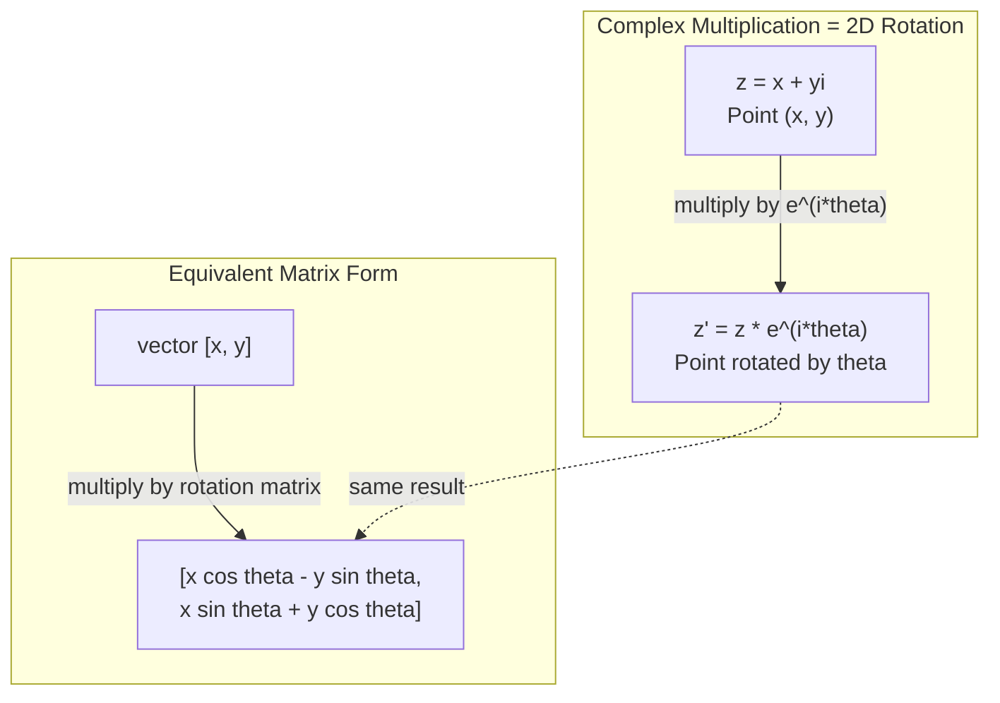
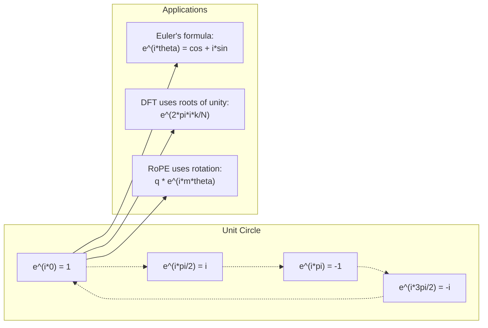

# Bilangan Kompleks untuk AI

> Akar kuadrat dari -1 bukanlah khayalan. Ini adalah kunci rotasi, frekuensi, dan separuh pemrosesan sinyal.

**Type:** Learn
**Language:** Python
**Prerequisites:** Fase 1, Lesson 01-04 (aljabar linier, kalkulus)
**Waktu:** ~60 menit

## Tujuan Pembelajaran

- Melakukan aritmatika kompleks (menambah, mengalikan, membagi, mengkonjugasikan) dalam bentuk persegi panjang dan polar
- Terapkan rumus Euler untuk mengkonversi antara fungsi eksponensial kompleks dan fungsi trigonometri
- Menerapkan Transformasi Fourier Diskrit menggunakan akar kesatuan yang kompleks
- Jelaskan bagaimana rotasi kompleks mendasari pengkodean posisi RoPE dan sinusoidal pada Transformer

## Masalah

kamu membuka makalah tentang transformasi Fourier dan ada `i` di mana-mana. kamu melihat pengkodean posisi Transformer dan melihat `sin` dan `cos` pada frekuensi yang berbeda -- bagian nyata dan imajiner dari eksponensial kompleks. kamu membaca tentang komputasi kuantum dan menemukan segala sesuatu dinyatakan dalam ruang vector yang kompleks.

Bilangan kompleks tampak abstrak. Sistem bilangan yang dibangun berdasarkan akar kuadrat -1 terasa seperti trik matematika. Tapi itu bukan tipuan. Ini adalah bahasa alami rotasi dan osilasi. Setiap kali sesuatu berputar, bergetar, atau berosilasi, bilangan kompleks adalah alat yang tepat.

Tanpa memahami bilangan kompleks, kamu tidak dapat memahami Transformasi Fourier Diskrit. kamu tidak dapat memahami FFT. kamu tidak dapat memahami cara kerja RoPE (Rotary Position Embedding) dalam model bahasa modern. kamu tidak dapat memahami mengapa pengkodean posisi sinusoidal pada kertas Transformer asli menggunakan frekuensi yang sama.

Lesson ini membangun aritmatika kompleks dari awal, menghubungkannya ke geometri, dan menunjukkan dengan tepat di mana bilangan kompleks muncul dalam machine learning.

## Konsep

### Apa itu bilangan kompleks?

Bilangan kompleks mempunyai dua bagian: bagian real dan bagian imajiner.

```
z = a + bi

where:
  a is the real part
  b is the imaginary part
  i is the imaginary unit, defined by i^2 = -1
```

Itu dia. kamu memperpanjang garis bilangan menjadi sebuah bidang. Bilangan real berada pada satu sumbu. Angka-angka imajiner berada di sisi yang lain. Setiap bilangan kompleks adalah sebuah titik pada bidang ini.

### Aritmatika kompleks

**Penjumlahan.** Tambahkan bagian nyata, tambahkan bagian imajiner.

```
(a + bi) + (c + di) = (a + c) + (b + d)i

Example: (3 + 2i) + (1 + 4i) = 4 + 6i
```

**Perkalian.** Gunakan hukum distributif dan ingat bahwa i^2 = -1.

```
(a + bi)(c + di) = ac + adi + bci + bdi^2
                 = ac + adi + bci - bd
                 = (ac - bd) + (ad + bc)i

Example: (3 + 2i)(1 + 4i) = 3 + 12i + 2i + 8i^2
                            = 3 + 14i - 8
                            = -5 + 14i
```

**Konjugasi.** Balikkan tanda bagian imajiner.

```
conjugate of (a + bi) = a - bi
```

Hasil kali bilangan kompleks dan konjugatnya selalu real:

```
(a + bi)(a - bi) = a^2 + b^2
```

**Pembagian.** Kalikan pembilang dan penyebut dengan konjugat penyebutnya.

```
(a + bi) / (c + di) = (a + bi)(c - di) / (c^2 + d^2)
```

Ini menghilangkan bagian imajiner dari penyebutnya, sehingga menghasilkan bilangan kompleks yang bersih.

### Bidang yang kompleks

Bidang kompleks memetakan setiap bilangan kompleks ke titik 2D. Sumbu horizontal adalah sumbu nyata, sumbu vertikal adalah sumbu imajiner.

```
z = 3 + 2i  corresponds to the point (3, 2)
z = -1 + 0i corresponds to the point (-1, 0) on the real axis
z = 0 + 4i  corresponds to the point (0, 4) on the imaginary axis
```

Bilangan kompleks sekaligus merupakan titik dan vector dari titik asal. Penafsiran ganda inilah yang membuat bilangan kompleks berguna untuk geometri.

### Bentuk kutub

Setiap titik pada bidang dapat dinyatakan berdasarkan jaraknya dari titik asal dan sudutnya terhadap sumbu nyata positif.

```
z = r * (cos(theta) + i*sin(theta))

where:
  r = |z| = sqrt(a^2 + b^2)     (magnitude, or modulus)
  theta = atan2(b, a)             (phase, or argument)
```

Bentuk persegi panjang (a+bi) bagus untuk penjumlahan. Bentuk polar (r, theta) bagus untuk perkalian.

**Perkalian dalam bentuk kutub.** Kalikan besarnya, tambahkan sudutnya.

```
z1 = r1 * e^(i*theta1)
z2 = r2 * e^(i*theta2)

z1 * z2 = (r1 * r2) * e^(i*(theta1 + theta2))
```Inilah sebabnya mengapa bilangan kompleks sempurna untuk rotasi. Mengalikan bilangan kompleks yang besarnya 1 merupakan rotasi murni.

### Rumus Euler

Jembatan antara eksponensial kompleks dan trigonometri:

```
e^(i*theta) = cos(theta) + i*sin(theta)
```

Ini adalah rumus terpenting dalam lesson ini. Ketika theta = pi:

```
e^(i*pi) = cos(pi) + i*sin(pi) = -1 + 0i = -1

Therefore: e^(i*pi) + 1 = 0
```

Lima konstanta fundamental (e, i, pi, 1, 0) dihubungkan dalam satu persamaan.

### Mengapa rumus Euler penting untuk ML

Rumus Euler mengatakan bahwa `e^(i*theta)` menelusuri lingkaran satuan seiring perubahan theta. Pada theta = 0, kamu berada di (1, 0). Pada theta = pi/2, kamu berada di (0, 1). Pada theta = pi, kamu berada di (-1, 0). Pada theta = 3*pi/2, kamu berada di (0, -1). Rotasi penuh adalah theta = 2*pi.

Ini berarti eksponensial kompleks ADALAH rotasi. Dan rotasi ada dimana-mana dalam pemrosesan sinyal dan ML.

### Koneksi ke rotasi 2D

Mengalikan bilangan kompleks (x + yi) dengan e^(i*theta) akan memutar titik (x, y) sebesar sudut theta di sekitar titik asal.

```
Rotation via complex multiplication:
  (x + yi) * (cos(theta) + i*sin(theta))
  = (x*cos(theta) - y*sin(theta)) + (x*sin(theta) + y*cos(theta))i

Rotation via matrix multiplication:
  [cos(theta)  -sin(theta)] [x]   [x*cos(theta) - y*sin(theta)]
  [sin(theta)   cos(theta)] [y] = [x*sin(theta) + y*cos(theta)]
```

Mereka menghasilkan hasil yang identik. Perkalian kompleks ADALAH rotasi 2D. Matrix rotasi hanyalah perkalian kompleks yang ditulis dalam notasi matrix.



### Fasor dan sinyal berputar

Eksponensial kompleks e^(i*omega*t) adalah sebuah titik yang berputar mengelilingi lingkaran satuan dengan frekuensi sudut omega. Ketika t bertambah, titik menelusuri lingkaran.

Bagian nyata dari titik putar ini adalah cos(omega*t). Bagian imajinernya adalah sin (omega*t). Sinyal sinusoidal adalah bayangan bilangan kompleks yang berputar.

```
e^(i*omega*t) = cos(omega*t) + i*sin(omega*t)

Real part:      cos(omega*t)    -- a cosine wave
Imaginary part: sin(omega*t)    -- a sine wave
```

Ini adalah representasi fasor. Alih-alih melacak gelombang sinus yang bergelombang, kamu melacak panah yang berputar dengan mulus. Pergeseran fasa menjadi offset sudut. Perubahan amplitudo menjadi perubahan besaran. Penjumlahan sinyal menjadi penjumlahan vector.

### Akar persatuan

Akar kesatuan ke-N adalah N titik yang berjarak sama pada lingkaran satuan:

```
w_k = e^(2*pi*i*k/N)    for k = 0, 1, 2, ..., N-1
```

Untuk N = 4, akar-akarnya adalah: 1, i, -1, -i (empat titik kompas).
Untuk N = 8, diperoleh empat titik kompas ditambah empat diagonal.

Akar kesatuan adalah dasar dari Transformasi Fourier Diskrit. DFT menguraikan sinyal menjadi komponen-komponen pada N frekuensi dengan distance yang sama.

### Koneksi ke DFT

Transformasi Fourier Diskrit dari sinyal x[0], x[1], ..., x[N-1] adalah:

```
X[k] = sum_{n=0}^{N-1} x[n] * e^(-2*pi*i*k*n/N)
```

Setiap X[k] mengukur seberapa besar korelasi sinyal dengan akar kesatuan ke-k -- sebuah sinusoida kompleks pada frekuensi k. DFT memecah sinyal menjadi N fasor berputar dan memberi tahu kamu amplitudo dan fase masing-masing fasor.

### Kenapa aku bukan khayalan

Kata "imajiner" adalah suatu kebetulan sejarah. Descartes menggunakannya dengan acuh tak acuh. Tapi saya tidak lebih imajiner daripada angka negatif ketika orang pertama kali menolaknya. Jawaban bilangan negatif "berapa hasil pengurangan 5 dari 3?" Satuan imajiner menjawab "berapakah kuadratmu sehingga diperoleh -1?"

Lebih bermanfaatnya: i adalah operator rotasi 90 derajat. Kalikan bilangan real dengan i satu kali, kamu memutar 90 derajat terhadap sumbu imajiner. Kalikan dengan i lagi (i^2), kamu memutar 90 derajat lagi -- sekarang kamu menunjuk ke arah negatif nyata. Itu sebabnya i^2 = -1. Hal ini tidak misterius. Ini adalah setengah putaran yang dibangun dari dua putaran seperempat.

Inilah sebabnya mengapa bilangan kompleks ada di mana-mana dalam bidang teknik. Segala sesuatu yang berputar -- gelombang elektromagnetik, keadaan kuantum, osilasi sinyal, pengkodean posisi -- secara alami dijelaskan dengan bilangan kompleks.

### Eksponensial kompleks vs fungsi trigonometriSebelum rumus Euler, para insinyur menulis sinyal sebagai A*cos(omega*t + phi) -- amplitudo A, frekuensi omega, fase phi. Ini berhasil tetapi membuat aritmatika menjadi sulit. Menjumlahkan dua cosinus dengan fase berbeda memerlukan identitas trigonometri.

Dengan eksponensial kompleks, sinyal yang sama adalah A*e^(i*(omega*t + phi)). Menjumlahkan dua sinyal berarti menjumlahkan dua bilangan kompleks. Mengalikan (memodulasi) hanyalah mengalikan besaran dan menjumlahkan sudut. Pergeseran fasa menjadi penambahan sudut. Pergeseran frekuensi menjadi perkalian dengan fasor.

Seluruh bidang pemrosesan sinyal beralih ke notasi eksponensial yang kompleks karena perhitungannya lebih rapi. "Sinyal nyata" selalu merupakan bagian nyata dari representasi kompleks. Bagian imajiner dijalankan sebagai pembukuan, membuat semua aljabar berjalan secara alami.

### Koneksi ke trafo

**Pengkodean posisi sinusoidal** (kertas Transformer asli):

```
PE(pos, 2i) = sin(pos / 10000^(2i/d))
PE(pos, 2i+1) = cos(pos / 10000^(2i/d))
```

Pasangan sin dan cos adalah bagian real dan imajiner dari eksponensial kompleks pada frekuensi berbeda. Setiap frekuensi memberikan "resolusi" yang berbeda untuk posisi pengkodean. Frekuensi rendah berubah secara perlahan (posisi kasar). Frekuensi tinggi berubah dengan cepat (posisi halus). Bersama-sama mereka memberikan sidik jari frekuensi yang unik pada setiap posisi.

**RoPE (Rotary Position Embedding)** membawa hal ini lebih jauh. Ini secara eksplisit mengalikan kueri dan vector kunci dengan matrix rotasi yang kompleks. Posisi relatif antara dua token menjadi sudut rotasi. Attention dihitung menggunakan vector yang diputar ini, sehingga membuat model peka terhadap posisi relatif melalui perkalian kompleks.

| Operasi | Bentuk Aljabar | Arti Geometris |
|-----------|---------------|-------------------|
| Tambahan | (a+c) + (b+d)saya | Penjumlahan vector pada bidang |
| Perkalian | (ac-bd) + (iklan+bc)i | Putar dan skala |
| Konjugasi | a - dua | Renungkan sumbu nyata |
| Besaran | persegi(a^2 + b^2) | Distance dari asal |
| Fase | atan2(b, a) | Sudut dari sumbu nyata positif |
| Divisi | kalikan dengan konjugasi | Rotasi terbalik dan skala ulang |
| Kekuatan | r^n * e^(i*n*theta) | Putar n kali, skalakan dengan r^n |



## Build

### Langkah 1: Kelas kompleks

Membangun kelas bilangan kompleks yang mendukung aritmatika, besaran, fase, dan konversi antara bentuk persegi panjang dan kutub.

```python
import math

class Complex:
    def __init__(self, real, imag=0.0):
        self.real = real
        self.imag = imag

    def __add__(self, other):
        return Complex(self.real + other.real, self.imag + other.imag)

    def __mul__(self, other):
        r = self.real * other.real - self.imag * other.imag
        i = self.real * other.imag + self.imag * other.real
        return Complex(r, i)

    def __truediv__(self, other):
        denom = other.real ** 2 + other.imag ** 2
        r = (self.real * other.real + self.imag * other.imag) / denom
        i = (self.imag * other.real - self.real * other.imag) / denom
        return Complex(r, i)

    def magnitude(self):
        return math.sqrt(self.real ** 2 + self.imag ** 2)

    def phase(self):
        return math.atan2(self.imag, self.real)

    def conjugate(self):
        return Complex(self.real, -self.imag)
```

### Langkah 2: Konversi kutub dan rumus Euler

```python
def to_polar(z):
    return z.magnitude(), z.phase()

def from_polar(r, theta):
    return Complex(r * math.cos(theta), r * math.sin(theta))

def euler(theta):
    return Complex(math.cos(theta), math.sin(theta))
```

Verifikasi: `euler(theta).magnitude()` harus selalu 1.0. `euler(0)` harus memberikan (1, 0). `euler(pi)` harus memberikan (-1, 0).

### Langkah 3: Rotasi

Memutar suatu titik (x, y) dengan sudut theta merupakan salah satu perkalian kompleks:

```python
point = Complex(3, 4)
rotated = point * euler(math.pi / 4)
```

Besarannya tetap sama. Hanya sudutnya yang berubah.

### Langkah 4: DFT dari aritmatika kompleks

```python
def dft(signal):
    N = len(signal)
    result = []
    for k in range(N):
        total = Complex(0, 0)
        for n in range(N):
            angle = -2 * math.pi * k * n / N
            total = total + Complex(signal[n], 0) * euler(angle)
        result.append(total)
    return result
```

Ini adalah DFT O(N^2). Setiap output X[k] adalah jumlah sample sinyal dikalikan dengan akar kesatuan.

### Langkah 5: DFT terbalik

DFT terbalik merekonstruksi sinyal asli dari spektrumnya. Satu-satunya perubahan dari DFT maju: balikkan tanda eksponen dan bagi dengan N.

```python
def idft(spectrum):
    N = len(spectrum)
    result = []
    for n in range(N):
        total = Complex(0, 0)
        for k in range(N):
            angle = 2 * math.pi * k * n / N
            total = total + spectrum[k] * euler(angle)
        result.append(Complex(total.real / N, total.imag / N))
    return result
```

Ini memberi kamu rekonstruksi sempurna. Terapkan DFT, lalu IDFT, dan kamu mendapatkan kembali sinyal asli ke presisi mesin. Tidak ada informasi yang hilang.

### Langkah 6: Akar persatuan

```python
def roots_of_unity(N):
    return [euler(2 * math.pi * k / N) for k in range(N)]
```

Verifikasi dua properti:
- Setiap akar mempunyai magnitudo tepat 1.
- Jumlah semua N akar adalah nol (hilang secara simetri).Properti inilah yang membuat DFT dapat dibalik. Akar kesatuan membentuk basis ortogonal untuk domain frekuensi.

## Pakai

Python memiliki dukungan bilangan kompleks bawaan. `j` literal mewakili unit imajiner.

```python
z = 3 + 2j
w = 1 + 4j

print(z + w)
print(z * w)
print(abs(z))

import cmath
print(cmath.phase(z))
print(cmath.exp(1j * cmath.pi))
```

Untuk array, numpy menangani bilangan kompleks secara asli:

```python
import numpy as np

z = np.array([1+2j, 3+4j, 5+6j])
print(np.abs(z))
print(np.angle(z))
print(np.conj(z))
print(np.real(z))
print(np.imag(z))

signal = np.sin(2 * np.pi * 5 * np.linspace(0, 1, 128))
spectrum = np.fft.fft(signal)
freqs = np.fft.fftfreq(128, d=1/128)
```

## Kirim

Jalankan `code/complex_numbers.py` untuk menghasilkan `outputs/skill-complex-arithmetic.md`.

## Latihan

1. **Aritmatika kompleks dengan tangan.** Hitung (2 + 3i) * (4 - i) dan verifikasi dengan code tersebut. Kemudian hitung (5 + 2i) / (1 - 3i). Gambarkan kedua hasil pada bidang kompleks dan periksa apakah perkalian diputar dan menskalakan angka pertama.

2. **Urutan rotasi.** Mulai dari titik (1, 0). Kalikan dengan e^(i*pi/6) dua belas kali. Pastikan kamu kembali ke (1, 0) setelah 12 perkalian. Cetak koordinat pada setiap langkah dan konfirmasikan bahwa koordinat tersebut merupakan 12-gon biasa.

3. **DFT dari sinyal yang diketahui.** Buat sinyal yang merupakan jumlah dari sin(2*pi*3*t) dan 0,5*sin(2*pi*7*t) yang diambil sampelnya pada 32 titik. Jalankan DFT kamu. Verifikasi bahwa spektrum magnitudo mempunyai puncak pada frekuensi 3 dan 7, dengan puncak pada 7 adalah setengah tinggi puncak pada 3.

4. **Visualisasi akar kesatuan.** Hitung akar kesatuan ke-8. Verifikasi bahwa jumlahnya nol. Verifikasi bahwa mengalikan akar apa pun dengan akar primitif e^(2*pi*i/8) menghasilkan akar berikutnya.

5. **Ekivalensi matrix rotasi.** Untuk 10 sudut acak dan 10 titik acak, pastikan bahwa perkalian kompleks memberikan hasil yang sama seperti perkalian matrix-vector dengan matrix rotasi 2x2. Cetak perbedaan numerik maksimum.

## Istilah Kunci

| Istilah | Artinya |
|------|---------------|
| Bilangan kompleks | Bilangan a + bi yang mana a adalah bagian real, b adalah bagian imajiner, dan i^2 = -1 |
| Satuan imajiner | Bilangan i, didefinisikan oleh i^2 = -1. Bukan khayalan dalam arti filosofis -- ini adalah operator rotasi |
| Bidang kompleks | Bidang 2D yang sumbu x real dan sumbu y imajiner. Disebut juga pesawat Argand |
| Besaran (modulus) | Distance dari titik asal: sqrt(a^2 + b^2). Ditulis sebagai \|z\| |
| Fase (argumen) | Sudut terhadap sumbu nyata positif: atan2(b, a). Ditulis sebagai arg(z) |
| Konjugasi | Bayangan cermin pada sumbu real: konjugasi a + bi adalah a - bi |
| Bentuk kutub | Mengekspresikan z sebagai r * e^(i*theta) alih-alih a + bi. Memudahkan perkalian |
| Rumus Euler | e^(i*theta) = cos(theta) + i*sin(theta). Menghubungkan eksponensial ke trigonometri |
| Fasor | Bilangan kompleks berputar e^(i*omega*t) yang mewakili sinyal sinusoidal |
| Akar Persatuan | N bilangan kompleks e^(2*pi*i*k/N) untuk k = 0 sampai N-1. N titik yang berjarak sama pada lingkaran satuan |
| DFT | Transformasi Fourier Diskrit. Menguraikan sinyal menjadi komponen sinusoidal kompleks menggunakan akar kesatuan |
| Tali | Embedding Posisi Putar. Menggunakan perkalian kompleks untuk mengkodekan posisi relatif dalam attention Transformer |

## Bacaan Lanjutan- [Pengantar Visual Rumus Euler](https://betterexplained.com/articles/intuitive-understanding-of-eulers-formula/) - membangun intuisi geometris tanpa notasi yang berat
- [Su dkk.: RoFormer (2021)](https://arxiv.org/abs/2104.09864) - makalah yang memperkenalkan Embedding Posisi Putar menggunakan rotasi kompleks
- [Vaswani dkk.: Hanya Attention yang kamu Butuhkan (2017)](https://arxiv.org/abs/1706.03762) - makalah Transformer asli dengan pengkodean posisi sinusoidal
- [3Blue1Brown: Rumus Euler dengan teori grup pengantar](https://www.youtube.com/watch?v=mvmuCPvRoWQ) - penjelasan visual mengapa e^(i*pi) = -1
- [Needham: Analisis Kompleks Visual](https://global.oup.com/academic/product/visual-complex-analisis-9780198534464) - perlakuan visual terbaik dari bilangan kompleks, penuh dengan wawasan geometris
- [Aneh: Pengantar Linear Algebra, Ch. 10](https://math.mit.edu/~gs/linearalgebra/) - bilangan kompleks dalam konteks aljabar linier dan eigenvalue
