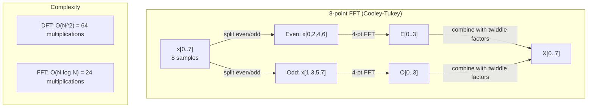
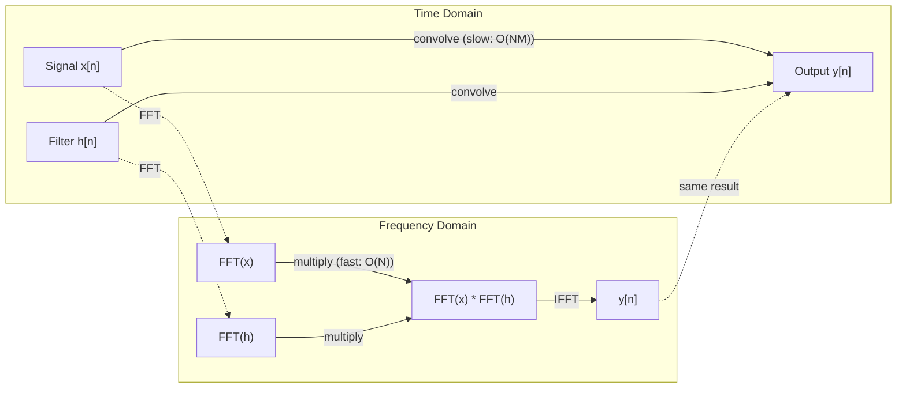

# Transformasi Fourier

> Setiap sinyal adalah jumlah gelombang sinus. Transformasi Fourier memberi tahu kamu yang mana.

**Type:** Build
**Language:** Python
**Prerequisites:** Phase 1, Lesson 01-04, 19 (bilangan kompleks)
**Waktu:** ~90 menit

## Tujuan Pembelajaran

- Menerapkan DFT dari awal dan memverifikasinya dengan FFT O(N log N) Cooley-Tukey
- Menafsirkan koefisien frekuensi: mengekstrak amplitudo, fase, dan spektrum daya dari suatu sinyal
- Terapkan teorema konvolusi untuk melakukan konvolusi melalui perkalian FFT
- Hubungkan decomposition frekuensi Fourier ke pengkodean posisi Transformer dan layer konvolusi CNN

## Masalah

Rekaman audio adalah urutan pengukuran tekanan dari waktu ke waktu. Harga saham adalah urutan nilai selama beberapa hari. Gambar adalah kisi-kisi intensitas piksel di ruang angkasa. Semua ini adalah data dalam domain waktu (atau domain ruang). kamu melihat nilai berubah pada beberapa indeks.

Namun banyak pola yang tidak terlihat dalam domain waktu. Apakah sinyal audio ini berupa nada murni atau akord? Apakah harga saham ini memiliki siklus mingguan? Apakah gambar ini memiliki tekstur yang berulang? Pertanyaan-pertanyaan ini tentang konten frekuensi, dan domain waktu menyembunyikannya.

Transformasi Fourier mengubah data dari domain waktu ke domain frekuensi. Dibutuhkan sinyal dan menguraikannya menjadi gelombang sinus dengan frekuensi berbeda. Setiap gelombang sinus mempunyai amplitudo (seberapa kuatnya) dan fase (di mana ia dimulai). Transformasi Fourier memberi tahu kamu berdua.

Hal ini penting bagi ML karena pemikiran domain frekuensi muncul di mana-mana. Jaringan saraf konvolusional melakukan konvolusi, yaitu perkalian dalam domain frekuensi. Pengkodean posisi Transformer menggunakan decomposition frekuensi untuk merepresentasikan posisi. Model audio (pengenalan ucapan, pembuatan musik) beroperasi pada spektogram -- representasi frekuensi suara. Model deret waktu mencari pola periodik. Memahami transformasi Fourier memberi kamu kosakata untuk menangani semua ini.

## Konsep

### Definisi DFT

Diberikan N sample x[0], x[1], ..., x[N-1], Transformasi Fourier Diskrit menghasilkan N koefisien frekuensi X[0], X[1], ..., X[N-1]:

```
X[k] = sum_{n=0}^{N-1} x[n] * e^(-2*pi*i*k*n/N)

for k = 0, 1, ..., N-1
```

Setiap X[k] adalah bilangan kompleks. Besarannya |X[k]| memberitahu kamu amplitudo frekuensi k. Sudut fasenya (X[k]) memberi tahu kamu offset fase frekuensi tersebut.

Wawasan utama: `e^(-2*pi*i*k*n/N)` adalah fasor berputar pada frekuensi k. DFT menghitung korelasi antara sinyal dan masing-masing N frekuensi dengan distance yang sama. Jika sinyal mengandung energi pada frekuensi k, korelasinya besar. Jika tidak, maka mendekati nol.

### Arti setiap koefisien

**X[0]: komponen DC.** Ini adalah jumlah seluruh sample -- sebanding dengan mean. Ini mewakili offset sinyal yang konstan (frekuensi nol).

```
X[0] = sum_{n=0}^{N-1} x[n] * e^0 = sum of all samples
```

**X[k] untuk 1 <= k <= N/2: frekuensi positif.** X[k] mewakili frekuensi k siklus per N sample. K yang lebih tinggi berarti frekuensi yang lebih tinggi (osilasi yang lebih cepat).

**X[N/2]: frekuensi Nyquist.** Frekuensi tertinggi yang dapat kamu wakili dengan N sample. Di atas ini, kamu mendapatkan aliasing -- frekuensi tinggi yang menyamar sebagai frekuensi rendah.

**X[k] untuk N/2 < k < N: frekuensi negatif.** Untuk sinyal bernilai nyata, X[N-k] = conj(X[k]). Frekuensi negatif adalah bayangan cermin dari frekuensi positif. Inilah sebabnya mengapa informasi yang berguna ada pada koefisien N/2 + 1 yang pertama.

### DFT terbalik

DFT terbalik merekonstruksi sinyal asli dari koefisien frekuensinya:

```
x[n] = (1/N) * sum_{k=0}^{N-1} X[k] * e^(2*pi*i*k*n/N)

for n = 0, 1, ..., N-1
```Satu-satunya perbedaan dengan DFT maju: tanda eksponennya positif (bukan negatif), dan ada faktor normalisasi 1/N.

DFT terbalik adalah rekonstruksi sempurna. Tidak ada informasi yang hilang. kamu dapat berpindah dari domain waktu ke domain frekuensi dan kembali lagi tanpa kesalahan apa pun. DFT adalah perubahan basis -- ia mengungkapkan kembali informasi yang sama dalam sistem koordinat yang berbeda.

### FFT: membuatnya cepat

DFT seperti yang didefinisikan di atas adalah O(N^2): untuk setiap N koefisien output, kamu menjumlahkan N sample input. Untuk N = 1 juta, itu berarti 10^12 operasi.

Fast Fourier Transform (FFT) menghitung hasil yang sama dalam O(N log N). Untuk N = 1 juta, itu berarti sekitar 20 juta operasi, bukan satu triliun. Inilah yang membuat analisis frekuensi menjadi praktis.

Algoritma Cooley-Tukey (FFT yang paling umum) bekerja dengan cara membagi dan menaklukkan:

1. Bagi sinyal menjadi sample berindeks genap dan berindeks ganjil.
2. Hitung DFT masing-masing bagian secara rekursif.
3. Gabungkan dua DFT setengah ukuran menggunakan "faktor twiddle" e^(-2*pi*i*k/N).

```
X[k] = E[k] + e^(-2*pi*i*k/N) * O[k]          for k = 0, ..., N/2 - 1
X[k + N/2] = E[k] - e^(-2*pi*i*k/N) * O[k]    for k = 0, ..., N/2 - 1

where E = DFT of even-indexed samples
      O = DFT of odd-indexed samples
```

Simetri berarti setiap level rekursi berfungsi O(N), dan terdapat level log2(N). Jumlah: O(N log N).



FFT memerlukan panjang sinyal pangkat 2. Dalam praktiknya, sinyal diberi bantalan nol ke pangkat 2 berikutnya.

### Analisis spektral

**Spektrum daya** adalah |X[k]|^2 -- besaran kuadrat setiap koefisien frekuensi. Ini menunjukkan berapa banyak energi pada setiap frekuensi.

**Spektrum fase** adalah sudut(X[k]) -- offset fase setiap frekuensi. Untuk sebagian besar tugas analisis, kamu peduli dengan spektrum daya dan mengabaikan fasenya.

```
Power at frequency k:  P[k] = |X[k]|^2 = X[k].real^2 + X[k].imag^2
Phase at frequency k:  phi[k] = atan2(X[k].imag, X[k].real)
```

### Resolusi frekuensi

Resolusi frekuensi DFT bergantung pada jumlah sample N dan laju pengambilan sample fs.

```
Frequency of bin k:      f_k = k * fs / N
Frequency resolution:    delta_f = fs / N
Maximum frequency:       f_max = fs / 2  (Nyquist)
```

Untuk menyelesaikan dua frekuensi yang berdekatan, kamu memerlukan lebih banyak sample. Untuk menangkap frekuensi tinggi, kamu memerlukan laju pengambilan sample yang lebih tinggi.

### Teorema konvolusi

Ini adalah salah satu hasil terpenting dalam pemrosesan sinyal dan relevan langsung dengan CNN.

**Konvolusi dalam domain waktu sama dengan perkalian searah dalam domain frekuensi.**

```
x * h = IFFT(FFT(x) . FFT(h))

where * is convolution and . is element-wise multiplication
```

Mengapa ini penting:

- Konvolusi langsung dua sinyal dengan panjang N dan M memerlukan operasi O(N*M).
- Konvolusi berbasis FFT membutuhkan O(N log N): ubah keduanya, kalikan, ubah kembali.
- Untuk kernel besar, konvolusi FFT jauh lebih cepat.
- Inilah yang terjadi pada layer konvolusional dengan bidang reseptif yang besar.

Catatan: DFT menghitung konvolusi melingkar (sinyal membungkus). Untuk konvolusi linier (tanpa sampul), zero-pad kedua sinyal dengan panjang N + M - 1 sebelum komputasi.



### Jendela

DFT mengasumsikan sinyal bersifat periodik -- DFT memperlakukan N sample sebagai satu periode sinyal yang berulang tanpa batas. Jika sinyal tidak dimulai dan diakhiri pada nilai yang sama, hal ini menciptakan diskontinuitas pada batas, yang muncul sebagai konten frekuensi tinggi palsu. Ini disebut kebocoran spektral.

Windowing mengurangi kebocoran dengan mengurangi sinyal ke nol di kedua ujungnya sebelum menghitung DFT.

Jendela umum:| Jendela | Bentuk | Lebar lobus utama | Tingkat lobus samping | Kasus penggunaan |
|--------|-------|----------------|-----------------|----------|
| Persegi Panjang | Datar (tanpa jendela) | Tersempit | Tertinggi (-13 dB) | Ketika sinyal tepat periodik dalam N sample |
| Han | Kosinus yang ditinggikan | Sedang | Rendah (-31 dB) | Analisis spektral tujuan umum |
| Hamming | Kosinus termodifikasi | Sedang | Lebih rendah (-42 dB) | Pemrosesan audio, analisis ucapan |
| orang kulit hitam | Kosinus rangkap tiga | Lebar | Sangat rendah (-58 dB) | Ketika penekanan lobus samping sangat penting |

```
Hann window:    w[n] = 0.5 * (1 - cos(2*pi*n / (N-1)))
Hamming window: w[n] = 0.54 - 0.46 * cos(2*pi*n / (N-1))
```

Terapkan jendela dengan mengalikannya berdasarkan elemen dengan sinyal sebelum DFT: `X = DFT(x * w)`.

### Properti DFT

| Properti | Domain Waktu | Domain Frekuensi |
|----------|-------------|-----------------|
| Linearitas | a*x + b*y | a*X + b*Y |
| Pergeseran waktu | x[n - k] | X[f] * e^(-2*pi*i*f*k/N) |
| Pergeseran frekuensi | x[n] * e^(2*pi*i*f0*n/N) | X[f - f0] |
| Konvolusi | x * jam | X * H (searah) |
| Perkalian | x * h (searah) | X * H (konvolusi melingkar, skala 1/N) |
| Teorema Parseval | jumlah \|x[n]\|^2 | (1/N) * jumlah \|X[k]\|^2 |
| Simetri konjugasi (input nyata) | x[n] nyata | X[k] = konj(X[N-k]) |

Teorema Parseval mengatakan energi total di kedua domain adalah sama. Energi dilestarikan melalui transformasi.

### Koneksi ke pengkodean posisi

Transformer asli menggunakan pengkodean posisi sinusoidal:

```
PE(pos, 2i)   = sin(pos / 10000^(2i/d_model))
PE(pos, 2i+1) = cos(pos / 10000^(2i/d_model))
```

Setiap pasangan dimension (2i, 2i+1) berosilasi pada frekuensi yang berbeda. Frekuensi ditempatkan secara geometris dari tinggi (dimension 0,1) ke rendah (dimension terakhir). Hal ini memberikan setiap posisi pola unik di semua pita frekuensi -- mirip dengan bagaimana koefisien Fourier mengidentifikasi sinyal secara unik.

Properti utama yang disediakannya:

- **Keunikan:** Tidak ada dua posisi yang memiliki pengkodean yang sama.
- **Nilai yang dibatasi:** sin dan cos selalu ada di [-1, 1].
- **Posisi relatif:** Pengkodean posisi p+k dapat dinyatakan sebagai fungsi linier dari pengkodean pada posisi p. Model dapat belajar untuk memperhatikan posisi relatif.

### Koneksi ke CNN

Layer konvolusi menerapkan filter yang dipelajari (kernel) ke input dengan menggesernya melintasi sinyal atau gambar. Secara matematis, ini adalah operasi konvolusi.

Berdasarkan teorema konvolusi, persamaan ini setara dengan:
1. FFT masukannya
2. FFT kernelnya
3. Kalikan dalam domain frekuensi
4. IFFT hasilnya

Implementasi CNN standar menggunakan konvolusi langsung (lebih cepat untuk kernel kecil 3x3). Namun untuk kernel besar atau konvolusi global, pendekatan berbasis FFT jauh lebih cepat. Beberapa arsitektur (seperti FNet) menggantikan attention sepenuhnya dengan FFT, sehingga mencapai akurasi kompetitif dengan kompleksitas O(N log N) dan bukan kompleksitas O(N^2).

### Spektogram dan Transformasi Fourier Waktu Singkat

FFT tunggal memberi kamu konten frekuensi dari keseluruhan sinyal, namun tidak memberi tahu kamu apa pun tentang kapan frekuensi tersebut muncul. Kicauan (sinyal yang frekuensinya meningkat seiring waktu) dan tali busur (semua frekuensi hadir secara bersamaan) dapat memiliki spektrum besaran yang sama.

Transformasi Fourier Waktu Pendek (STFT) menyelesaikan masalah ini dengan menghitung FFT pada jendela sinyal yang tumpang tindih. Hasilnya adalah spektogram: representasi 2D dengan waktu pada satu sumbu dan frekuensi pada sumbu lainnya. Intensitas pada setiap titik menunjukkan energi pada frekuensi tersebut pada waktu itu.

```
STFT procedure:
1. Choose a window size (e.g., 1024 samples)
2. Choose a hop size (e.g., 256 samples -- 75% overlap)
3. For each window position:
   a. Extract the windowed segment
   b. Apply a Hann/Hamming window
   c. Compute FFT
   d. Store the magnitude spectrum as one column of the spectrogram
```Spektogram adalah representasi input standar untuk model audio ML. Model pengenalan ucapan (Whisper, DeepSpeech) beroperasi pada spektogram mel -- spektogram dengan frekuensi yang dipetakan ke skala mel, yang lebih cocok dengan persepsi nada manusia.

### Mengasingkan

Jika suatu sinyal mengandung frekuensi di atas fs/2 (frekuensi Nyquist), pengambilan sample pada laju fs akan membuat salinan alias. Sinyal 90 Hz yang diambil sampelnya pada 100 Hz terlihat identik dengan sinyal 10 Hz. Tidak ada cara untuk membedakannya hanya dari sampelnya.

```
Example:
  True signal: 90 Hz sine wave
  Sampling rate: 100 Hz
  Apparent frequency: 100 - 90 = 10 Hz

  The samples from the 90 Hz signal at 100 Hz sampling rate
  are identical to the samples from a 10 Hz signal.
  No amount of math can recover the original 90 Hz.
```

Inilah sebabnya mengapa konverter analog-ke-digital menyertakan filter anti-aliasing yang menghilangkan frekuensi di atas Nyquist sebelum pengambilan sample. Di ML, aliasing muncul saat melakukan downsampling peta feature tanpa pemfilteran low-pass yang tepat -- beberapa arsitektur mengatasinya dengan layer pengumpulan anti-alias.

### Zero-padding tidak meningkatkan resolusi

Kesalahpahaman umum: memberi bantalan nol pada sinyal sebelum FFT meningkatkan resolusi frekuensi. Tidak. Zero-padding menginterpolasi antara wadah frekuensi yang ada, memberi kamu spektrum yang tampak lebih halus. Namun ia tidak dapat mengungkapkan detail frekuensi yang tidak ada dalam sample aslinya.

Resolusi frekuensi sebenarnya hanya bergantung pada waktu pengamatan T = N/fs. Untuk menyelesaikan dua frekuensi yang dipisahkan oleh delta_f, kamu memerlukan setidaknya data T = 1 / delta_f detik. Tidak ada jumlah zero-padding yang mengubah batas fundamental ini.

## Build

### Langkah 1: DFT dari awal

DFT O(N^2) mengikuti langsung dari definisi.

```python
import math

class Complex:
    ...

def dft(x):
    N = len(x)
    result = []
    for k in range(N):
        total = Complex(0, 0)
        for n in range(N):
            angle = -2 * math.pi * k * n / N
            w = Complex(math.cos(angle), math.sin(angle))
            xn = x[n] if isinstance(x[n], Complex) else Complex(x[n])
            total = total + xn * w
        result.append(total)
    return result
```

### Langkah 2: DFT terbalik

Struktur yang sama, eksponen positif, dibagi dengan N.

```python
def idft(X):
    N = len(X)
    result = []
    for n in range(N):
        total = Complex(0, 0)
        for k in range(N):
            angle = 2 * math.pi * k * n / N
            w = Complex(math.cos(angle), math.sin(angle))
            total = total + X[k] * w
        result.append(Complex(total.real / N, total.imag / N))
    return result
```

### Langkah 3: FFT (Cooley-Tukey)

FFT rekursif membutuhkan panjang pangkat 2. Dibagi menjadi genap dan ganjil, berulang, digabungkan dengan faktor twiddle.

```python
def fft(x):
    N = len(x)
    if N <= 1:
        return [x[0] if isinstance(x[0], Complex) else Complex(x[0])]
    if N % 2 != 0:
        return dft(x)

    even = fft([x[i] for i in range(0, N, 2)])
    odd = fft([x[i] for i in range(1, N, 2)])

    result = [Complex(0)] * N
    for k in range(N // 2):
        angle = -2 * math.pi * k / N
        twiddle = Complex(math.cos(angle), math.sin(angle))
        t = twiddle * odd[k]
        result[k] = even[k] + t
        result[k + N // 2] = even[k] - t
    return result
```

### Langkah 4: Pembantu analisis spektral

```python
def power_spectrum(X):
    return [xk.real ** 2 + xk.imag ** 2 for xk in X]

def convolve_fft(x, h):
    N = len(x) + len(h) - 1
    padded_N = 1
    while padded_N < N:
        padded_N *= 2

    x_padded = x + [0.0] * (padded_N - len(x))
    h_padded = h + [0.0] * (padded_N - len(h))

    X = fft(x_padded)
    H = fft(h_padded)

    Y = [xk * hk for xk, hk in zip(X, H)]

    y = idft(Y)
    return [y[n].real for n in range(N)]
```

## Pakai

Untuk pekerjaan nyata, gunakan FFT numpy yang didukung oleh perpustakaan C yang sangat optimal.

```python
import numpy as np

signal = np.sin(2 * np.pi * 5 * np.arange(256) / 256)
spectrum = np.fft.fft(signal)
freqs = np.fft.fftfreq(256, d=1/256)

power = np.abs(spectrum) ** 2

positive_freqs = freqs[:len(freqs)//2]
positive_power = power[:len(power)//2]
```

Untuk windowing dan analisis spektral lebih lanjut:

```python
from scipy.signal import windows, stft

window = windows.hann(256)
windowed = signal * window
spectrum = np.fft.fft(windowed)
```

Untuk konvolusi:

```python
from scipy.signal import fftconvolve

result = fftconvolve(signal, kernel, mode='full')
```

Untuk spektogram:

```python
from scipy.signal import stft

frequencies, times, Zxx = stft(signal, fs=sample_rate, nperseg=256)
spectrogram = np.abs(Zxx) ** 2
```

Matrix spektogram mempunyai bentuk (n_frequencies, n_time_frames). Setiap kolom adalah spektrum daya pada satu jendela waktu. Inilah yang digunakan model audio ML sebagai input.

## Kirim

Jalankan `code/fourier.py` untuk menghasilkan `outputs/prompt-spectral-analyzer.md`.

## Latihan

1. **Identifikasi nada murni.** Membuat sinyal dengan gelombang sinus tunggal pada frekuensi yang tidak diketahui (antara 1 dan 50 Hz), sample pada 128 Hz selama 1 detik. Gunakan DFT kamu untuk mengidentifikasi frekuensi. Verifikasi jawabannya cocok. Sekarang tambahkan noise Gaussian dengan standar deviasi 0,5 dan ulangi. Bagaimana kebisingan mempengaruhi spektrum?

2. **Verifikasi FFT vs DFT.** Menghasilkan sinyal acak dengan panjang 64. Hitung DFT (O(N^2)) dan FFT. Verifikasi bahwa semua koefisien cocok dengan kisaran 1e-10. Waktu keduanya berfungsi pada sinyal dengan panjang 256, 512, 1024, dan 2048. Plot rasio waktu DFT terhadap waktu FFT.

3. **Pembuktian teorema konvolusi dengan contoh.** Buat sinyal x = [1, 2, 3, 4, 0, 0, 0, 0] dan filter h = [1, 1, 1, 0, 0, 0, 0, 0]. Hitung konvolusi melingkarnya secara langsung (loop bersarang). Kemudian hitung melalui FFT (transformasi, perkalian, inverse transform). Verifikasikan hasil yang cocok. Sekarang lakukan konvolusi linier dengan zero-padding dengan tepat.4. **Efek jendela.** Membuat sinyal yang merupakan jumlah dari dua gelombang sinus pada 10 Hz dan 12 Hz (sangat dekat). Sample pada 128 Hz selama 1 detik. Hitung spektrum daya tanpa jendela, jendela Hann, dan jendela Hamming. Jendela manakah yang paling mudah untuk membedakan kedua puncak tersebut? Mengapa?

5. **Analisis pengkodean posisi.** Hasilkan pengkodean posisi sinusoidal untuk d_model = 128 dan max_pos = 512. Untuk setiap pasangan posisi (p1, p2), hitung perkalian titik pengkodeannya. Tunjukkan bahwa perkalian titik hanya bergantung pada |p1 - p2|, bukan pada posisi absolut. Apa yang terjadi pada perkalian titik seiring bertambahnya distance?

## Istilah Kunci

| Istilah | Artinya |
|------|---------------|
| DFT (Transformasi Fourier Diskrit) | Mengonversi N sample domain waktu menjadi N koefisien domain frekuensi. Setiap koefisien merupakan korelasi dengan sinusoid kompleks pada frekuensi |
| FFT (Transformasi Fourier Cepat) | Algoritme O(N log N) untuk menghitung DFT. Algoritma Cooley-Tukey membagi indeks genap/ganjil secara rekursif |
| DFT terbalik | Merekonstruksi sinyal domain waktu dari koefisien frekuensi. Rumusnya sama seperti DFT dengan tanda eksponen terbalik dan skala 1/N |
| Tempat frekuensi | Setiap indeks k dalam output DFT mewakili frekuensi k*fs/N Hz. "Bin" adalah slot frekuensi diskrit |
| Komponen DC | X[0], koefisien frekuensi nol. Sebanding dengan rata-rata sinyal |
| Frekuensi Nyquist | fs/2, frekuensi maksimum yang dapat diwakili pada laju pengambilan sample fs. Frekuensi di atas alias |
| Spektrum daya | \|X[k]\|^2, besaran kuadrat setiap koefisien frekuensi. Menunjukkan distribusi energi melintasi frekuensi |
| Spektrum fase | sudut(X[k]), offset fasa setiap komponen frekuensi. Sering diabaikan dalam analisis |
| Kebocoran spektral | Konten frekuensi palsu yang disebabkan oleh memperlakukan sinyal non-periodik sebagai sinyal periodik. Dikurangi dengan windowing |
| Fungsi jendela | Fungsi lancip (Hann, Hamming, Blackman) diterapkan sebelum DFT untuk mengurangi kebocoran spektral |
| Faktor twiddle | Eksponensial kompleks e^(-2*pi*i*k/N) yang digunakan untuk menggabungkan sub-DFT dalam komputasi kupu-kupu FFT |
| Teorema konvolusi | Konvolusi dalam domain waktu sama dengan perkalian searah dalam domain frekuensi. Dasar pemrosesan sinyal dan CNN |
| Konvolusi melingkar | Konvolusi tempat sinyal membungkus. Inilah yang secara alami dihitung oleh DFT |
| Konvolusi linier | Konvolusi standar tanpa sampul. Dicapai dengan zero-padding sebelum DFT |
| Teorema Parseval | Energi total dipertahankan melalui transformasi Fourier. jumlah \|x[n]\|^2 = (1/N) jumlah \|X[k]\|^2 |
| Mengasingkan | Ketika frekuensi di atas Nyquist muncul sebagai frekuensi yang lebih rendah karena laju pengambilan sample tidak mencukupi |

## Bacaan Lanjutan- [Cooley & Tukey: Algoritma untuk Perhitungan Mesin Deret Fourier Kompleks (1965)](https://www.ams.org/journals/mcom/1965-19-090/S0025-5718-1965-0178586-1/) - makalah FFT asli yang mengubah komputasi
- [3Blue1Brown: Tapi apa itu Transformasi Fourier?](https://www.youtube.com/watch?v=spUNpyF58BY) - pengenalan visual terbaik tentang transformasi Fourier
- [Lee-Thorp dkk.: FNet: Mencampur Token dengan Transformasi Fourier (2021)](https://arxiv.org/abs/2105.03824) - menggantikan attention mandiri dengan FFT di Transformer
- [Smith: Panduan Ilmuwan dan Insinyur untuk Pemrosesan Sinyal Digital](http://www.dspguide.com/) - buku teks online gratis yang mencakup FFT, windowing, dan analisis spektral secara mendalam
- [Vaswani et al.: Hanya Attention yang kamu Butuhkan (2017)](https://arxiv.org/abs/1706.03762) - pengkodean posisi sinusoidal yang berasal dari decomposition frekuensi Fourier
- [Radford et al.: Whisper (2022)](https://arxiv.org/abs/2212.04356) - pengenalan ucapan menggunakan mel-spektogram sebagai representasi input
