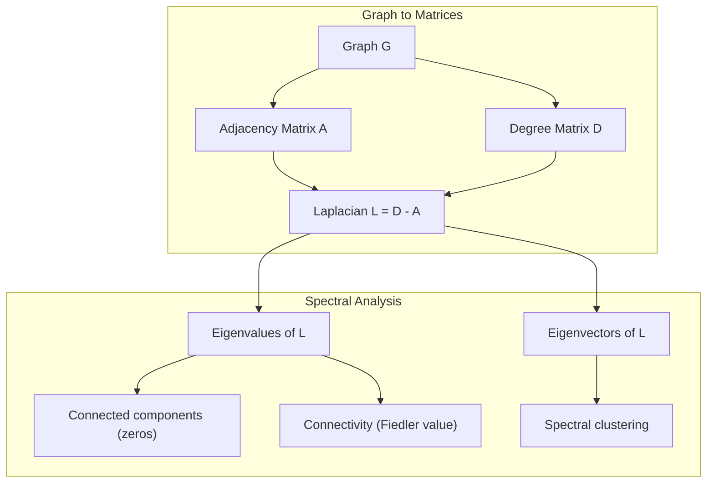
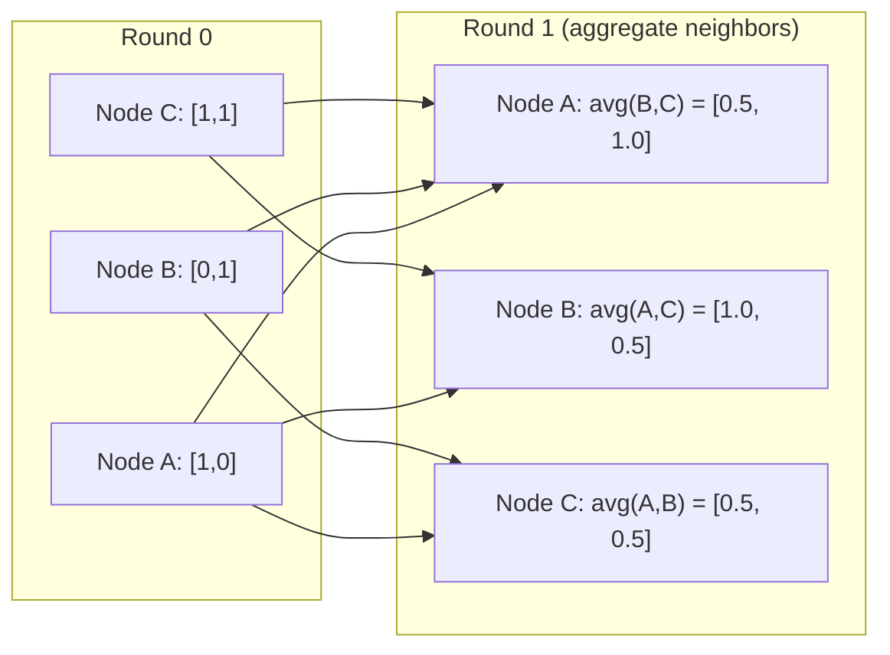

# Teori Grafik untuk Machine Learning

> Grafik adalah struktur data hubungan. Jika data kamu memiliki koneksi, kamu memerlukan teori grafik.

**Type:** Build
**Language:** Python
**Prerequisites:** Phase 1, Lesson 01-03 (aljabar linier, matrix)
**Waktu:** ~90 menit

## Tujuan Pembelajaran

- Membangun kelas grafik dengan representasi matrix/daftar ketetanggaan dan mengimplementasikan traversal BFS dan DFS
- Hitung grafik Laplacian dan gunakan nilai eigennya untuk mendeteksi komponen yang terhubung dan node cluster
- Mengimplementasikan satu putaran penyampaian pesan gaya GNN sebagai perkalian matrix kedekatan yang dinormalisasi
- Terapkan pengelompokan spektral untuk mempartisi grafik menggunakan vector Fiedler

## Masalah

Jejaring sosial, molekul, basis pengetahuan, jaringan kutipan, peta jalan -- semuanya berupa grafik. ML tradisional memperlakukan data sebagai tabel datar. Setiap baris bersifat independen. Setiap feature adalah kolom. Namun ketika struktur koneksi penting, tabel gagal.

Pertimbangkan jaringan sosial. kamu ingin memprediksi produk apa yang akan dibeli pengguna. Riwayat pembelian mereka penting. Namun riwayat pembelian teman mereka lebih penting. Koneksi membawa sinyal.

Atau pertimbangkan sebuah molekul. kamu ingin memprediksi apakah ia berikatan dengan protein. Atom memang penting, namun yang terpenting adalah bagaimana atom terikat satu sama lain. Strukturnya adalah datanya.

Graph Neural Networks (GNNs) adalah area dengan pertumbuhan tercepat dalam pembelajaran mendalam. Mereka mendukung penemuan obat-obatan, rekomendasi sosial, deteksi penipuan, dan penalaran grafik pengetahuan. Setiap GNN dibangun di atas landasan yang sama: teori grafik dasar.

kamu memerlukan empat hal:
1. Cara merepresentasikan grafik sebagai matrix (sehingga dapat dikalikan)
2. Algoritma traversal untuk mengeksplorasi struktur graf
3. Laplacian -- matrix terpenting dalam teori grafik spektral
4. Pengiriman pesan -- operasi yang membuat GNN berfungsi

## Konsep

### Grafik: Node dan Tepi

Graf G = (V, E) terdiri dari simpul (simpul) V dan sisi E. Setiap sisi menghubungkan dua simpul.

**Berarah vs tidak berarah.** Pada graf tidak berarah, sisi (u, v) berarti u terhubung ke v DAN v terhubung ke u. Pada graf berarah (digraf), sisi (u, v) berarti u menunjuk ke v, tetapi tidak harus sebaliknya.

**Berbobot vs tidak berbobot.** Pada graf tak berbobot, sisi-sisinya ada atau tidak. Dalam grafik berbobot, setiap sisi memiliki weight numerik -- distance, biaya, kekuatan.

| Jenis grafik | Contoh |
|-----------|---------|
| Tidak terarah, tidak berbobot | Jaringan persahabatan Facebook |
| Diarahkan, tidak berbobot | Jaringan ikuti Twitter |
| Tidak terarah, berbobot | Peta jalan (distance) |
| Diarahkan, berbobot | Tautan halaman web (skor PageRank) |

### Matrix Kedekatan

Matrix ketetanggaan A adalah representasi inti. Untuk graf dengan n node:

```
A[i][j] = 1    if there is an edge from node i to node j
A[i][j] = 0    otherwise
```

Untuk graf tak berarah, A simetris: A[i][j] = A[j][i]. Untuk graf berbobot, A[i][j] = weight sisi (i, j).

**Contoh -- segitiga:**

```
Nodes: 0, 1, 2
Edges: (0,1), (1,2), (0,2)

A = [[0, 1, 1],
     [1, 0, 1],
     [1, 1, 0]]
```

Matrix ketetanggaan merupakan input untuk setiap GNN. Operasi matrix pada A berhubungan dengan operasi pada grafik.

### Gelar

Derajat suatu simpul adalah jumlah sisi yang terhubung dengannya. Untuk graf berarah, kamu mempunyai derajat masuk (tepi masuk) dan derajat keluar (tepi keluar).

Matrix derajat D adalah diagonal:

```
D[i][i] = degree of node i
D[i][j] = 0    for i != j
```

Untuk contoh segitiga: D = diag(2, 2, 2) karena setiap node terhubung ke dua node lainnya.Gelar memberi tahu kamu tentang pentingnya simpul. Derajat tinggi = simpul hub. Distribusi derajat suatu jaringan mengungkapkan strukturnya. Jejaring sosial mengikuti hukum kekuasaan (sedikit hub, banyak node daun). Grafik acak memiliki derajat terdistribusi Poisson.

### BFS dan DFS

Dua algoritma traversal grafik dasar. kamu membutuhkan keduanya.

**Breadth-First Search (BFS):** Jelajahi semua tetangga terlebih dahulu, lalu tetangga tetangga. Menggunakan antrian (FIFO).

```
BFS from node 0:
  Visit 0
  Queue: [1, 2]        (neighbors of 0)
  Visit 1
  Queue: [2, 3]        (add neighbors of 1)
  Visit 2
  Queue: [3]           (neighbors of 2 already visited)
  Visit 3
  Queue: []            (done)
```

BFS menemukan jalur terpendek dalam grafik tidak berbobot. Distance dari awal ke node mana pun sama dengan level BFS saat node tersebut pertama kali ditemukan. Inilah sebabnya mengapa BFS digunakan untuk menghitung distance hop di jejaring sosial.

**Pencarian Kedalaman-Pertama (DFS):** Telusuri sedalam mungkin sebelum menelusuri kembali. Menggunakan tumpukan (LIFO) atau rekursi.

```
DFS from node 0:
  Visit 0
  Stack: [1, 2]        (neighbors of 0)
  Visit 2               (pop from stack)
  Stack: [1, 3]         (add neighbors of 2)
  Visit 3               (pop from stack)
  Stack: [1]
  Visit 1               (pop from stack)
  Stack: []             (done)
```

DFS berguna untuk:
- Menemukan komponen yang terhubung (menjalankan DFS dari node yang belum dikunjungi)
- Deteksi siklus (tepi belakang di pohon DFS)
- Penyortiran topologi (urutan penyelesaian DFS terbalik)

| Algoritma | Struktur data | Menemukan | Kasus penggunaan |
|-----------|---------------|-------|----------|
| BFS | Antrian | Jalur terpendek | Distance jaringan sosial, traversal grafik pengetahuan |
| DFS | Tumpukan | Komponen, siklus | Konektivitas, pengurutan topologi |

### Grafik Laplacian

L = D - A. Matrix terpenting dalam teori grafik spektral.

Untuk segitiga:

```
D = [[2, 0, 0],    A = [[0, 1, 1],    L = [[2, -1, -1],
     [0, 2, 0],         [1, 0, 1],         [-1, 2, -1],
     [0, 0, 2]]         [1, 1, 0]]         [-1, -1,  2]]
```

Laplacian memiliki sifat luar biasa:

1. **L adalah semi-pasti positif.** Semua eigenvalue >= 0.

2. **Jumlah eigenvalue nol sama dengan jumlah komponen yang terhubung.** Graf terhubung mempunyai tepat satu eigenvalue nol. Graf dengan 3 komponen tidak terhubung mempunyai tiga eigenvalue nol.

3. **Eigenvalue bukan nol terkecil (nilai Fiedler) mengukur konektivitas.** Nilai Fiedler yang besar berarti grafik terhubung dengan baik. Nilai Fiedler yang kecil berarti grafik tersebut memiliki titik lemah -- hambatan.

4. **Eigenvector dari nilai Fiedler (vector Fiedler) menunjukkan pemisahan terbaik.** Node dengan nilai positif dimasukkan ke dalam satu grup, node dengan nilai negatif masuk ke grup lainnya. Ini adalah pengelompokan spektral.



### Properti Spektral

Eigenvalue dari matrix ketetanggaan dan Laplacian mengungkapkan sifat struktural tanpa traversal apa pun.

**Pengelompokan spektral** berfungsi seperti ini:
1. Hitung Laplacian L
2. Carilah k eigenvector terkecil dari L (lewati vector pertama, yaitu vector semua-satu untuk graf terhubung)
3. Gunakan eigenvector tersebut sebagai koordinat baru untuk setiap node
4. Jalankan k-means pada koordinat tersebut

Mengapa ini berhasil? Eigenvector dari L mengkodekan fungsi "paling halus" pada grafik. Node yang terhubung dengan baik mendapatkan nilai eigenvector yang serupa. Node yang dipisahkan oleh hambatan mendapatkan nilai yang berbeda. Eigenvector secara alami memisahkan cluster.

**Koneksi jalan acak.** Laplacian yang dinormalisasi berhubungan dengan jalan acak pada grafik. Distribusi stasioner dari jalan acak sebanding dengan derajat simpul. Waktu pencampuran (seberapa cepat perjalanan menyatu) bergantung pada kesenjangan spektral.

### Pesan Melewati

Operasi inti dari Graph Neural Networks. Setiap node mengumpulkan pesan dari tetangganya, mengagregasinya, dan memperbarui statusnya sendiri.

```
h_v^(k+1) = UPDATE(h_v^(k), AGGREGATE({h_u^(k) : u in neighbors(v)}))
```

Dalam bentuk paling sederhana, AGGREGATE = mean, dan UPDATE = transformasi linier + activation:

```
h_v^(k+1) = sigma(W * mean({h_u^(k) : u in neighbors(v)}))
```

Ini adalah perkalian matrix yang terselubung. Jika H adalah matrix semua feature node dan A adalah matrix ketetanggaan:

```
H^(k+1) = sigma(A_norm * H^(k) * W)
```

di mana A_norm adalah matrix ketetanggaan yang dinormalisasi (setiap baris berjumlah 1).Satu putaran penyampaian pesan memungkinkan setiap node "melihat" tetangga terdekatnya. Dua putaran membiarkannya melihat tetangga tetangga. Putaran K memberikan informasi kepada setiap node dari lingkungan K-hopnya.



### Konsep dan Aplikasi ML

| Konsep | Aplikasi ML |
|---------|---------------|
| Matrix ketetanggaan | Representasi input GNN |
| Grafik Laplacian | Pengelompokan spektral, deteksi komunitas |
| BFS/DFS | Penjelajahan grafik pengetahuan, pencarian jalur |
| Distribusi gelar | Pentingnya simpul, rekayasa feature |
| Pesan lewat | Layer GNN (GCN, GAT, GraphSAGE) |
| Eigenvalue dari L | Deteksi komunitas, partisi grafik |
| Pengelompokan spektral | Pengelompokan node tanpa pengawasan |
| Peringkat Halaman | Pentingnya simpul, pencarian web |

## Build

### Langkah 1: Kelas grafik dari awal

```python
class Graph:
    def __init__(self, n_nodes, directed=False):
        self.n = n_nodes
        self.directed = directed
        self.adj = {i: {} for i in range(n_nodes)}

    def add_edge(self, u, v, weight=1.0):
        self.adj[u][v] = weight
        if not self.directed:
            self.adj[v][u] = weight

    def neighbors(self, node):
        return list(self.adj[node].keys())

    def degree(self, node):
        return len(self.adj[node])

    def adjacency_matrix(self):
        import numpy as np
        A = np.zeros((self.n, self.n))
        for u in range(self.n):
            for v, w in self.adj[u].items():
                A[u][v] = w
        return A

    def degree_matrix(self):
        import numpy as np
        D = np.zeros((self.n, self.n))
        for i in range(self.n):
            D[i][i] = self.degree(i)
        return D

    def laplacian(self):
        return self.degree_matrix() - self.adjacency_matrix()
```

Daftar kedekatan (`self.adj`) menyimpan tetangga secara efisien. Konversi matrix ketetanggaan menggunakan numpy karena semua operasi spektral memerlukannya.

### Langkah 2: BFS dan DFS

```python
from collections import deque

def bfs(graph, start):
    visited = set()
    order = []
    distances = {}
    queue = deque([(start, 0)])
    visited.add(start)
    while queue:
        node, dist = queue.popleft()
        order.append(node)
        distances[node] = dist
        for neighbor in graph.neighbors(node):
            if neighbor not in visited:
                visited.add(neighbor)
                queue.append((neighbor, dist + 1))
    return order, distances


def dfs(graph, start):
    visited = set()
    order = []
    stack = [start]
    while stack:
        node = stack.pop()
        if node in visited:
            continue
        visited.add(node)
        order.append(node)
        for neighbor in reversed(graph.neighbors(node)):
            if neighbor not in visited:
                stack.append(neighbor)
    return order
```

BFS menggunakan deque (antrian berujung ganda) untuk O(1) popleft. DFS menggunakan daftar sebagai tumpukan. Keduanya mengunjungi setiap node tepat satu kali -- waktu O(V + E).

### Langkah 3: Komponen yang terhubung dan eigenvalue Laplacian

```python
def connected_components(graph):
    visited = set()
    components = []
    for node in range(graph.n):
        if node not in visited:
            order, _ = bfs(graph, node)
            visited.update(order)
            components.append(order)
    return components


def laplacian_eigenvalues(graph):
    import numpy as np
    L = graph.laplacian()
    eigenvalues = np.linalg.eigvalsh(L)
    return eigenvalues
```

`eigvalsh` adalah untuk matrix simetris -- Laplacian selalu simetris untuk graf tak berarah. Ia mengembalikan eigenvalue dalam urutan menaik. Hitung angka nol untuk menemukan jumlah komponen yang terhubung.

### Langkah 4: Pengelompokan spektral

```python
def spectral_clustering(graph, k=2):
    import numpy as np
    L = graph.laplacian()
    eigenvalues, eigenvectors = np.linalg.eigh(L)
    features = eigenvectors[:, 1:k+1]

    labels = np.zeros(graph.n, dtype=int)
    for i in range(graph.n):
        if features[i, 0] >= 0:
            labels[i] = 0
        else:
            labels[i] = 1
    return labels
```

Untuk k=2, tanda vector Fiedler membagi grafik menjadi dua cluster. Untuk k>2, kamu akan menjalankan k-means pada k eigenvector pertama (tidak termasuk eigenvector semua yang sepele).

### Langkah 5: Penyampaian pesan

```python
def message_passing(graph, features, weight_matrix):
    import numpy as np
    A = graph.adjacency_matrix()
    row_sums = A.sum(axis=1, keepdims=True)
    row_sums[row_sums == 0] = 1
    A_norm = A / row_sums
    aggregated = A_norm @ features
    output = aggregated @ weight_matrix
    return output
```

Ini adalah satu putaran penyampaian pesan GNN. Feature baru setiap node adalah rata-rata tertimbang dari feature tetangganya, yang ditransformasikan oleh matrix weight. Tumpuk beberapa putaran untuk menyebarkan informasi lebih jauh.

## Pakai

Dengan networkx dan numpy, operasi yang sama dilakukan dalam satu kalimat:

```python
import networkx as nx
import numpy as np

G = nx.karate_club_graph()

A = nx.adjacency_matrix(G).toarray()
L = nx.laplacian_matrix(G).toarray()

eigenvalues = np.linalg.eigvalsh(L.astype(float))
print(f"Smallest eigenvalues: {eigenvalues[:5]}")
print(f"Connected components: {nx.number_connected_components(G)}")

communities = nx.community.greedy_modularity_communities(G)
print(f"Communities found: {len(communities)}")

pr = nx.pagerank(G)
top_nodes = sorted(pr.items(), key=lambda x: x[1], reverse=True)[:5]
print(f"Top 5 PageRank nodes: {top_nodes}")
```

networkx menangani grafik dengan ukuran berapa pun dengan backend C yang dioptimalkan. Gunakan dalam produksi. Gunakan implementasi kamu dari awal untuk memahami fungsinya.

### analisis spektral numpy

```python
import numpy as np

A = np.array([
    [0, 1, 1, 0, 0],
    [1, 0, 1, 0, 0],
    [1, 1, 0, 1, 0],
    [0, 0, 1, 0, 1],
    [0, 0, 0, 1, 0]
])

D = np.diag(A.sum(axis=1))
L = D - A

eigenvalues, eigenvectors = np.linalg.eigh(L)
print(f"Eigenvalues: {np.round(eigenvalues, 4)}")
print(f"Fiedler value: {eigenvalues[1]:.4f}")
print(f"Fiedler vector: {np.round(eigenvectors[:, 1], 4)}")

fiedler = eigenvectors[:, 1]
group_a = np.where(fiedler >= 0)[0]
group_b = np.where(fiedler < 0)[0]
print(f"Cluster A: {group_a}")
print(f"Cluster B: {group_b}")
```

Vector Fiedler melakukan pekerjaan berat. Entri positif di satu cluster, negatif di cluster lain. Tidak diperlukan optimization berulang -- hanya satu eigendecomposition.

## Kirim

Lesson ini menghasilkan:
- `outputs/skill-graph-analysis.md` -- referensi keterampilan untuk menganalisis data terstruktur grafik

## Koneksi

| Konsep | Di mana itu muncul |
|---------|------------------|
| Matrix ketetanggaan | GCN, GAT, input GraphSAGE |
| Laplacian | Pengelompokan spektral, filter ChebNet |
| BFS | Traversal grafik pengetahuan, kueri jalur terpendek |
| Pesan lewat | Setiap layer GNN, pesan saraf lewat |
| Kesenjangan spektral | Konektivitas grafik, pencampuran waktu jalan acak |
| Distribusi gelar | Jaringan hukum kekuasaan, rekayasa feature simpul |
| Komponen yang terhubung | Preprocessing, menangani grafik terputus |
| Peringkat Halaman | Pemeringkatan kepentingan simpul, inisialisasi attention |

GNN layak mendapat attention khusus. Operasi konvolusi grafik di GCN (Kipf & Welling, 2017) menggunakan matrix ketetanggaan dengan tambahan self-loop, A_hat = A + I:

```text
H^(l+1) = sigma(D_hat^(-1/2) * A_hat * D_hat^(-1/2) * H^(l) * W^(l))
```dimana A_hat = A + I (adjacency plus self-loop) dan D_hat adalah matrix derajat dari A_hat. Self-loop memastikan setiap node menyertakan fiturnya sendiri selama agregasi. Ini persis seperti penyampaian pesan dengan normalisasi simetris. D_hat^(-1/2) * A_hat * D_hat^(-1/2) adalah matrix ketetanggaan yang dinormalisasi. Laplacian muncul karena normalisasi ini terkait dengan L_sym = I - D^(-1/2) * A * D^(-1/2). Memahami Laplacian berarti memahami alasan kerja GCN.

## Latihan

1. **Menerapkan PageRank dari awal.** Mulailah dengan skor yang seragam. Pada setiap langkah: score(v) = (1-d)/n + d * sum(score(u)/out_degree(u)) untuk semua u yang menunjuk ke v. Gunakan d=0.85. Jalankan hingga konvergensi (ubah <1e-6). Uji pada grafik web kecil.

2. **Temukan komunitas menggunakan pengelompokan spektral.** Buat grafik dengan dua kluster yang terpisah jelas (misalnya, dua klik yang dihubungkan oleh satu sisi). Jalankan pengelompokan spektral dan verifikasi bahwa ia menemukan pemisahan yang tepat. Apa yang terjadi jika kamu menambahkan lebih banyak tepi lintas cluster?

3. **Menerapkan algoritma Dijkstra** untuk jalur terpendek dalam grafik berbobot. Bandingkan hasilnya dengan BFS pada grafik yang sama dengan weight seragam.

4. **Build jaringan penyampaian pesan 2 lapis.** Terapkan penyampaian pesan dua kali dengan matrix weight berbeda. Tunjukkan bahwa setelah 2 putaran, setiap node mempunyai informasi dari lingkungan 2 hopnya.

5. **Analisis grafik dunia nyata.** Gunakan grafik Klub Karate (34 node, 78 sisi). Hitung distribusi derajat, eigenvalue Laplacian, dan pengelompokan spektral. Bandingkan hasil pengelompokan spektral dengan pemisahan kebenaran dasar yang diketahui.

## Istilah Kunci

| Istilah | Apa kata orang | Apa sebenarnya arti |
|------|----------------|----------------------|
| Grafik | "Node dan tepi" | Struktur matematika G=(V,E) yang mengkodekan hubungan berpasangan |
| Matrix ketetanggaan | "Tabel koneksi" | Matrix n x n dimana A[i][j] = 1 jika node i dan j terhubung |
| Gelar | "Seberapa terhubung sebuah node" | Banyaknya sisi yang menyentuh simpul |
| Laplacian | "D dikurangi A" | L = D - A, matrix yang nilai eigennya menunjukkan struktur graf |
| Nilai Fiedler | "Konektivitas aljabar" | Eigenvalue terkecil bukan nol dari L, yang mengukur seberapa baik keterhubungan grafik tersebut |
| BFS | "Pencarian tingkat demi tingkat" | Traversal yang mengunjungi semua tetangga sebelum masuk lebih dalam, menemukan jalur terpendek |
| DFS | "Masuk lebih dalam dulu" | Traversal yang mengikuti satu jalur sampai ke ujungnya sebelum mundur |
| Pesan lewat | "Node berbicara dengan tetangga" | Setiap node mengumpulkan informasi dari tetangganya, inti dari GNN |
| Pengelompokan spektral | "Kluster berdasarkan eigenvector" | Partisi grafik menggunakan eigenvector dari Laplacian |
| Komponen yang terhubung | "Sepotong terpisah" | Subgraf maksimal dimana setiap node dapat menjangkau setiap node lainnya |

## Bacaan Lanjutan

- **Kipf & Welling (2017)** -- "Klasifikasi Semi-Supervisi dengan Jaringan Konvolusional Grafik." Makalah yang meluncurkan GNN modern. Menunjukkan bahwa konvolusi grafik spektral menyederhanakan penyampaian pesan.
- **Spielman (2012)** -- Catatan kuliah "Teori Grafik Spektral". Pengantar definitif tentang Laplacian, kesenjangan spektral, dan partisi grafik.
- **Hamilton (2020)** -- "Pembelajaran Representasi Grafik". Buku yang mencakup GNN mulai dari dasar hingga aplikasi.
- **Bronstein dkk. (2021)** -- "Pembelajaran Mendalam Geometris: Kisi, Grup, Grafik, Geodesi, dan Pengukur." Makalah kerangka pemersatu.
- **Veličković dkk. (2018)** -- "Jaringan Attention Grafik." Memperluas penyampaian pesan dengan mekanisme attention.
