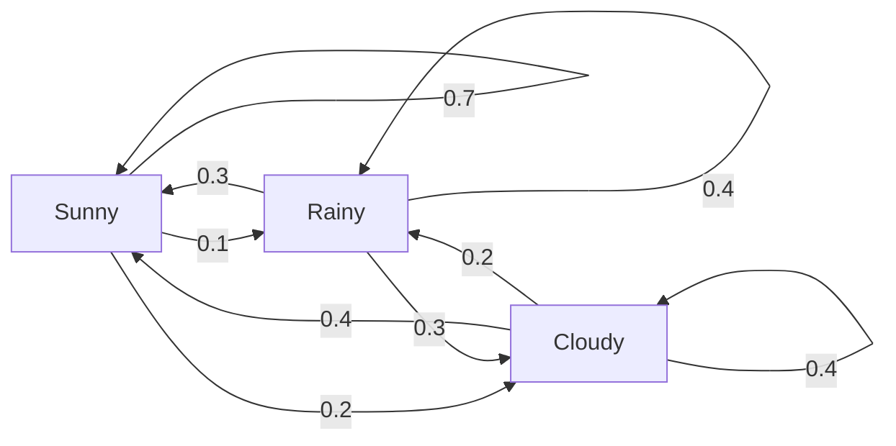
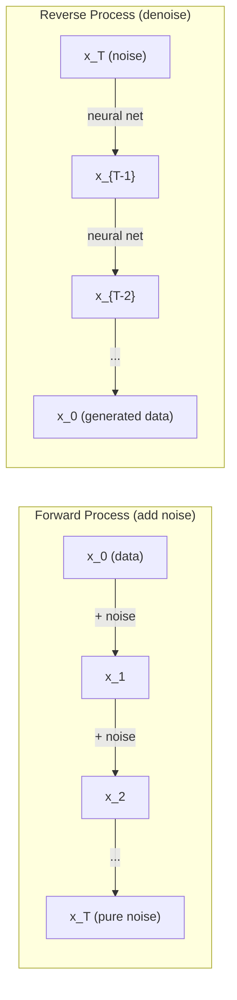

# Proses Stokastik

> Keacakan dengan struktur. Matematika di balik jalan acak, rantai Markov, dan model difusi.

**Type:** Learn
**Language:** Python
**Prerequisites:** Fase 1, Lesson 06-07 (probabilitas, Bayes)
**Waktu:** ~75 menit

## Tujuan Pembelajaran

- Simulasikan jalan acak 1D dan 2D dan verifikasi skala perpindahan kuadrat(n).
- Membangun simulator rantai Markov dan menghitung distribusi stasionernya melalui eigendecomposition
- Menerapkan dinamika Metropolis-Hastings MCMC dan Langevin untuk pengambilan sample dari distribusi target
- Hubungkan proses difusi maju dengan gerak Brown dan jelaskan bagaimana proses sebaliknya menghasilkan data

## Masalah

Banyak sistem AI melibatkan keacakan yang berkembang seiring waktu. Bukan keacakan statis -- keacakan terstruktur dan berurutan di mana setiap langkah bergantung pada langkah sebelumnya.

Model bahasa menghasilkan token satu per satu. Setiap token bergantung pada konteks sebelumnya. Model mengeluarkan distribusi probabilitas, mengambil sample darinya, dan melanjutkan. Itu adalah proses stokastik.

Model difusi menambahkan noise ke gambar selangkah demi selangkah hingga menjadi statis murni. Kemudian mereka membalikkan prosesnya, mencela langkah demi langkah hingga muncul gambaran baru. Proses majunya adalah rantai Markov. Proses kebalikannya adalah rantai Markov yang dipelajari berjalan mundur.

Agen pembelajaran penguatan mengambil tindakan dalam suatu lingkungan. Setiap tindakan mengarah ke keadaan baru dengan beberapa kemungkinan. Agen mengikuti kebijakan acak di dunia acak. Semuanya adalah proses pengambilan keputusan Markov.

Pengambilan sample MCMC -- tulang punggung inference Bayesian -- membangun rantai Markov yang distribusi stasionernya adalah posterior tempat kamu ingin mengambil sample.

Semua ini didasarkan pada empat gagasan dasar:
1. Jalan acak -- proses stokastik paling sederhana
2. Rantai Markov -- keacakan terstruktur dengan matrix transisi
3. Dinamika Langevin -- gradient descent dengan noise
4. Metropolis-Hastings -- pengambilan sample dari distribusi mana pun

## Konsep

### Jalan Acak

Mulailah dari posisi 0. Pada setiap langkah, lempar koin yang adil. Kepala: bergerak ke kanan (+1). Ekor: bergerak ke kiri (-1).

Setelah n langkah, posisi kamu adalah jumlah dari n nilai acak +/-1. Posisi yang diharapkan adalah 0 (perjalanannya tidak bias). Namun distance yang diharapkan dari titik asal bertambah seiring kuadrat(n).

Ini berlawanan dengan intuisi. Perjalanannya lancar - tidak ada penyimpangan di kedua arah. Namun seiring berjalannya waktu, ia mengembara semakin jauh dari tempat asalnya. Simpangan baku setelah n langkah adalah akar kuadrat(n).

```
Step 0:  Position = 0
Step 1:  Position = +1 or -1
Step 2:  Position = +2, 0, or -2
...
Step 100: Expected distance from origin ~ 10 (sqrt(100))
Step 10000: Expected distance from origin ~ 100 (sqrt(10000))
```

**Dalam 2D**, gerakan berjalan ke atas, bawah, kiri, atau kanan dengan probabilitas yang sama. Penskalaan sqrt(n) yang sama berlaku untuk distance dari titik asal. Jalur ini menelusuri pola seperti fraktal.

**Mengapa sqrt(n)?** Setiap langkah bernilai +1 atau -1 dengan probabilitas yang sama. Setelah n langkah, posisi S_n = X_1 + X_2 + ... + X_n dimana masing-masing X_i adalah +/-1. Varians setiap langkah adalah 1, dan langkah-langkah tersebut saling bebas, jadi Var(S_n) = n. Simpangan baku = kuadrat(n). Berdasarkan teorema limit pusat, S_n / sqrt(n) konvergen ke distribusi normal standar.

Penskalaan sqrt(n) ini muncul di mana saja di ML. Kebisingan SGD berskala 1/sqrt(batch_size). Embed skala dimension sebagai sqrt(d). Akar kuadrat adalah tanda penjumlahan acak yang independen.

**Hubungan dengan gerak Brown.** Lakukan jalan acak dengan ukuran langkah 1/sqrt(n) dan n langkah per satuan waktu. Saat n menuju tak terhingga, perjalanan tersebut menyatu ke gerak Brown B(t) -- proses waktu berkelanjutan di mana B(t) terdistribusi normal dengan mean 0 dan varians t.Gerak Brown adalah dasar matematika difusi. Model ini memodelkan goncangan acak partikel dalam suatu fluida, fluktuasi harga saham, dan -- yang terpenting -- proses kebisingan dalam model difusi.

**Kehancuran Penjudi.** Pejalan acak yang memulai dari posisi k, dengan penghalang penyerap di 0 dan N. Berapa peluang mencapai N sebelum 0? Untuk jalan raya yang adil: P(mencapai N) = k/N. Ini sangat sederhana dan elegan. Hal ini berkaitan dengan teori martingales -- fair random walk adalah martingale (nilai masa depan yang diharapkan = nilai saat ini).

### Rantai Markov

Rantai Markov adalah sistem yang melakukan transisi antar keadaan berdasarkan probabilitas tetap. Properti kuncinya: keadaan berikutnya hanya bergantung pada keadaan saat ini, bukan pada sejarah.

```
P(X_{t+1} = j | X_t = i, X_{t-1} = ...) = P(X_{t+1} = j | X_t = i)
```

Ini adalah properti Markov. Artinya kamu dapat menggambarkan keseluruhan dinamika dengan matrix transisi P:

```
P[i][j] = probability of going from state i to state j
```

Setiap baris P berjumlah 1 (kamu harus pergi ke suatu tempat).

**Contoh -- Cuaca:**

```
States: Sunny (0), Rainy (1), Cloudy (2)

P = [[0.7, 0.1, 0.2],    (if sunny: 70% sunny, 10% rainy, 20% cloudy)
     [0.3, 0.4, 0.3],    (if rainy: 30% sunny, 40% rainy, 30% cloudy)
     [0.4, 0.2, 0.4]]    (if cloudy: 40% sunny, 20% rainy, 40% cloudy)
```

Mulai di negara bagian mana pun. Setelah banyak transisi, distribusi keadaan menyatu ke distribusi stasioner pi, dimana pi * P = pi. Ini adalah eigenvector kiri dari P dengan eigenvalue 1.

Untuk rantai cuaca, distribusi stasionernya mungkin [0,53, 0,18, 0,29] -- dalam jangka panjang, 53% cuaca cerah terlepas dari kondisi awalnya.



**Menghitung distribusi stasioner.** Ada dua pendekatan:

1. **Metode pangkat**: kalikan distribusi awal apa pun dengan P berulang kali. Setelah cukup banyak iterasi, ia menyatu.
2. **Metode eigenvalue**: cari eigenvector kiri P dengan eigenvalue 1. Ini adalah eigenvector P^T dengan eigenvalue 1.

Kedua pendekatan tersebut memerlukan rantai untuk memenuhi kondisi konvergensi.

**Kondisi konvergensi.** Rantai Markov menyatu ke distribusi stasioner unik jika:
- **Tidak dapat direduksi**: setiap negara bagian dapat dijangkau dari setiap negara bagian lainnya
- **Aperiodik**: rantai tidak berputar dengan periode tetap

Sebagian besar rantai yang kamu temui di ML memenuhi kedua kondisi tersebut.

**Keadaan yang menyerap.** Suatu keadaan dikatakan menyerap jika setelah kamu memasukinya, kamu tidak pernah keluar (P[i][i] = 1). Menyerap proses model rantai Markov dengan status terminal -- permainan yang berakhir, pelanggan yang melakukan churn, urutan token yang mencapai token akhir teks.

**Waktu pencampuran.** Berapa langkah hingga rantai "mendekati" distribusi stasioner? Secara formal, jumlah langkah hingga total distance variasi dari stasioneritas turun di bawah ambang batas tertentu. Pencampuran cepat = diperlukan beberapa langkah. Kesenjangan spektral P (1 dikurangi largest eigenvalue kedua) mengontrol waktu pencampuran. Kesenjangan yang lebih besar = pencampuran lebih cepat.

### Koneksi ke Model Bahasa

Pembuatan token dalam model bahasa kira-kira merupakan proses Markov. Mengingat konteks saat ini, model mengeluarkan distribusi pada token berikutnya. Suhu mengontrol ketajaman:

```
P(token_i) = exp(logit_i / temperature) / sum(exp(logit_j / temperature))
```

- Suhu = 1,0 : distribusi standar
- Suhu <1.0: lebih tajam (lebih deterministik)
- Suhu > 1.0: lebih datar (lebih acak)
- Suhu -> 0 : argmax (serakah)

Pengambilan sample k teratas dipotong menjadi k token dengan probabilitas tertinggi. Pengambilan sample top-p (inti) terpotong menjadi kumpulan token terkecil yang probabilitas kumulatifnya melebihi p. Keduanya memodifikasi probabilitas transisi Markov.

### Gerak BrownBatas waktu berkelanjutan dari perjalanan acak. Posisi B(t) memiliki tiga properti:
1.B(0) = 0
2. B(t) - B(s) berdistribusi normal dengan mean 0 dan varians t - s (untuk t > s)
3. Kenaikan pada interval yang tidak tumpang tindih bersifat independen

Gerak Brown bersifat kontinyu namun tidak dapat dibedakan -- ia bergoyang pada setiap skala. Jalur memiliki dimension fraktal 2 pada bidang.

Dalam simulasi diskrit, kamu memperkirakan gerak Brown dengan:

```
B(t + dt) = B(t) + sqrt(dt) * z,    where z ~ N(0, 1)
```

Penskalaan sqrt(dt) itu penting. Itu berasal dari teorema limit pusat yang diterapkan pada jalan acak.

### Dinamika Langevin

Gradient descent menemukan fungsi minimum. Dinamika Langevin menemukan distribusi probabilitas sebanding dengan exp(-U(x)/T), dengan U adalah fungsi energi dan T adalah suhu.

```
x_{t+1} = x_t - dt * gradient(U(x_t)) + sqrt(2 * T * dt) * z_t
```

Dua gaya bekerja pada partikel:
1. **Gaya gradient** (-dt * gradient(U)): mendorong menuju energi rendah (seperti gradient descent)
2. **Kekuatan acak** (sqrt(2*T*dt) * z): mendorong ke arah acak (eksplorasi)

Pada suhu T = 0, ini adalah gradient descent murni. Pada suhu tinggi, ini hampir seperti perjalanan acak. Pada suhu yang tepat, partikel menjelajahi lanskap energi dan menghabiskan lebih banyak waktu di wilayah berenergi rendah.

**Hubungan ke model difusi.** Proses maju model difusi adalah:

```
x_t = sqrt(alpha_t) * x_{t-1} + sqrt(1 - alpha_t) * noise
```

Ini adalah rantai Markov yang secara bertahap mencampurkan data dengan noise. Setelah langkah yang cukup, x_T adalah noise Gaussian murni.

Proses sebaliknya -- beralih dari noise kembali ke data -- juga merupakan rantai Markov, namun probabilitas transisinya dipelajari oleh neural network. Jaringan belajar memprediksi kebisingan yang ditambahkan pada setiap langkah, lalu menguranginya.



### MCMC: Rantai Markov Monte Carlo

Terkadang kamu perlu mengambil sample dari distribusi p(x) yang dapat kamu evaluasi (hingga konstanta) tetapi tidak dapat diambil sampelnya secara langsung. Posterior Bayesian adalah contoh klasiknya -- kamu tahu kemungkinannya dikalikan sebelumnya, tetapi konstanta normalisasi sulit dilakukan.

**Metropolis-Hastings** membuat rantai Markov yang distribusi stasionernya adalah p(x):

1. Mulai dari beberapa posisi x
2. Usulkan posisi baru x' dari distribusi proposal Q(x'|x)
3. Hitung rasio penerimaan: a = p(x') * Q(x|x') / (p(x) * Q(x'|x))
4. Terima x' dengan probabilitas min(1, a). Jika tidak, tetaplah di x.
5. Ulangi.

Jika Q simetris (misalnya Q(x'|x) = Q(x|x') = N(x, sigma^2)), maka rasio disederhanakan menjadi a = p(x') / p(x). kamu hanya memerlukan rasio probabilitas -- konstanta normalisasi dibatalkan.

Rantai dijamin konvergen ke p(x) dalam kondisi ringan. Namun konvergensi bisa berjalan lambat jika proposal terlalu kecil (random walk) atau terlalu besar (penolakan tinggi). Menyesuaikan proposal adalah seni MCMC.

**Mengapa berhasil.** Rasio penerimaan memastikan keseimbangan terperinci: probabilitas berada di x dan berpindah ke x' sama dengan probabilitas berada di x' dan berpindah ke x. Keseimbangan terperinci menyiratkan bahwa p(x) adalah distribusi rantai yang stasioner. Jadi setelah langkah yang cukup, sampelnya berasal dari p(x).**Pertimbangan praktis:**
- **Burn-in**: buang N sample pertama. Rantai memerlukan waktu untuk mencapai distribusi stasioner dari titik awalnya.
- **Penipisan**: simpan setiap sample ke-k untuk mengurangi autokorelasi.
- **Beberapa rantai**: menjalankan beberapa rantai dari titik awal yang berbeda. Jika mereka konvergen pada distribusi yang sama, kamu mempunyai bukti konvergensi.
- **Tingkat penerimaan**: untuk proposal Gaussian dalam dimension d, tingkat penerimaan optimal adalah sekitar 23% (Roberts & Rosenthal, 2001). Terlalu tinggi berarti rantai hampir tidak bergerak. Terlalu rendah berarti menolak semuanya.

### Proses Stokastik di AI

| Proses | Aplikasi AI |
|---------|---------------|
| Jalan acak | Eksplorasi di RL, embedding Node2Vec |
| Rantai Markov | Pembuatan teks, pengambilan sample MCMC |
| Gerak Brown | Model difusi (proses maju) |
| Dinamika Langevin | Model generatif berbasis skor, SGLD |
| Proses pengambilan keputusan Markov | Pembelajaran penguatan |
| Metropolis-Hastings | Inference Bayesian, pengambilan sample posterior |

## Build

### Langkah 1: Simulator jalan acak

```python
import numpy as np

def random_walk_1d(n_steps, seed=None):
    rng = np.random.RandomState(seed)
    steps = rng.choice([-1, 1], size=n_steps)
    positions = np.concatenate([[0], np.cumsum(steps)])
    return positions


def random_walk_2d(n_steps, seed=None):
    rng = np.random.RandomState(seed)
    directions = rng.choice(4, size=n_steps)
    dx = np.zeros(n_steps)
    dy = np.zeros(n_steps)
    dx[directions == 0] = 1   # right
    dx[directions == 1] = -1  # left
    dy[directions == 2] = 1   # up
    dy[directions == 3] = -1  # down
    x = np.concatenate([[0], np.cumsum(dx)])
    y = np.concatenate([[0], np.cumsum(dy)])
    return x, y
```

Jalan 1D menyimpan jumlah kumulatif. Setiap langkah adalah +1 atau -1. Setelah n langkah, posisinya adalah jumlah. Variansnya bertambah secara linier dengan n, sehingga deviasi standarnya bertambah sebesar kuadrat (n).

### Langkah 2: Rantai Markov

```python
class MarkovChain:
    def __init__(self, transition_matrix, state_names=None):
        self.P = np.array(transition_matrix, dtype=float)
        self.n_states = len(self.P)
        self.state_names = state_names or [str(i) for i in range(self.n_states)]

    def step(self, current_state, rng=None):
        if rng is None:
            rng = np.random.RandomState()
        probs = self.P[current_state]
        return rng.choice(self.n_states, p=probs)

    def simulate(self, start_state, n_steps, seed=None):
        rng = np.random.RandomState(seed)
        states = [start_state]
        current = start_state
        for _ in range(n_steps):
            current = self.step(current, rng)
            states.append(current)
        return states

    def stationary_distribution(self):
        eigenvalues, eigenvectors = np.linalg.eig(self.P.T)
        idx = np.argmin(np.abs(eigenvalues - 1.0))
        stationary = np.real(eigenvectors[:, idx])
        stationary = stationary / stationary.sum()
        return np.abs(stationary)
```

Distribusi stasioner adalah eigenvector kiri P dengan eigenvalue 1. Kita menemukannya dengan menghitung eigenvector P^T (transposisi mengubah eigenvector kiri menjadi eigenvector kanan).

### Langkah 3: Dinamika Langevin

```python
def langevin_dynamics(grad_U, x0, dt, temperature, n_steps, seed=None):
    rng = np.random.RandomState(seed)
    x = np.array(x0, dtype=float)
    trajectory = [x.copy()]
    for _ in range(n_steps):
        noise = rng.randn(*x.shape)
        x = x - dt * grad_U(x) + np.sqrt(2 * temperature * dt) * noise
        trajectory.append(x.copy())
    return np.array(trajectory)
```

Gradient mendorong x menuju energi rendah. Kebisingan mencegahnya macet. Pada kesetimbangan, distribusi sample sebanding dengan exp(-U(x)/suhu).

### Langkah 4: Metropolis-Hastings

```python
def metropolis_hastings(target_log_prob, proposal_std, x0, n_samples, seed=None):
    rng = np.random.RandomState(seed)
    x = np.array(x0, dtype=float)
    samples = [x.copy()]
    accepted = 0
    for _ in range(n_samples - 1):
        x_proposed = x + rng.randn(*x.shape) * proposal_std
        log_ratio = target_log_prob(x_proposed) - target_log_prob(x)
        if np.log(rng.rand()) < log_ratio:
            x = x_proposed
            accepted += 1
        samples.append(x.copy())
    acceptance_rate = accepted / (n_samples - 1)
    return np.array(samples), acceptance_rate
```

Algoritme mengusulkan titik baru, memeriksa apakah titik tersebut memiliki probabilitas lebih tinggi (atau menerima dengan probabilitas sebanding dengan rasio), dan mengulanginya. Tingkat penerimaan harus sekitar 23-50% untuk pencampuran yang baik.

## Pakai

Dalam praktiknya, kamu menggunakan perpustakaan yang sudah ada untuk algoritme ini. Namun memahami mekanismenya penting untuk debugging dan penyetelan.

```python
import numpy as np

rng = np.random.RandomState(42)
walk = np.cumsum(rng.choice([-1, 1], size=10000))
print(f"Final position: {walk[-1]}")
print(f"Expected distance: {np.sqrt(10000):.1f}")
print(f"Actual distance: {abs(walk[-1])}")
```

### numpy untuk matrix transisi

```python
import numpy as np

P = np.array([[0.7, 0.1, 0.2],
              [0.3, 0.4, 0.3],
              [0.4, 0.2, 0.4]])

distribution = np.array([1.0, 0.0, 0.0])
for _ in range(100):
    distribution = distribution @ P

print(f"Stationary distribution: {np.round(distribution, 4)}")
```

Kalikan distribusi awal dengan P berulang kali. Setelah cukup banyak iterasi, distribusi tersebut menyatu ke distribusi stasioner di mana pun kamu memulai. Ini adalah metode kekuatan untuk mencari eigenvector kiri yang dominan.

### Koneksi ke kerangka nyata

- **Difusi PyTorch:** `DDPMScheduler` di Hugging Face `diffusers` mengimplementasikan rantai Markov maju dan mundur
- **NumPyro / PyMC:** Gunakan MCMC (NUTS sampler, yang meningkatkan Metropolis-Hastings) untuk inference Bayesian
- **Gymnasium (RL):** Fungsi langkah lingkungan mendefinisikan proses pengambilan keputusan Markov

### Memverifikasi konvergensi rantai Markov

```python
import numpy as np

P = np.array([[0.9, 0.1], [0.3, 0.7]])

eigenvalues = np.linalg.eigvals(P)
spectral_gap = 1 - sorted(np.abs(eigenvalues))[-2]
print(f"Eigenvalues: {eigenvalues}")
print(f"Spectral gap: {spectral_gap:.4f}")
print(f"Approximate mixing time: {1/spectral_gap:.1f} steps")
```

Kesenjangan spektral menunjukkan seberapa cepat rantai melupakan keadaan awalnya. Kesenjangan 0,2 berarti kira-kira 5 langkah untuk mencampur. Kesenjangan 0,01 berarti sekitar 100 langkah. Selalu periksa ini sebelum menjalankan simulasi yang panjang -- rantai pencampuran yang lambat akan membuang-buang komputasi.

## Kirim

Lesson ini menghasilkan:
- `outputs/prompt-stochastic-process-advisor.md` -- prompt yang membantu mengidentifikasi kerangka proses stokastik mana yang berlaku untuk masalah tertentu

## Koneksi| Konsep | Di mana itu muncul |
|---------|------------------|
| Jalan acak | Embedding grafik Node2Vec, eksplorasi di RL |
| Rantai Markov | Pembuatan token di LLM, pengambilan sample MCMC |
| Gerak Brown | Proses difusi maju dalam DDPM, model berbasis SDE |
| Dinamika Langevin | Model generatif berbasis skor, dinamika Langevin gradient stokastik (SGLD) |
| Distribusi stasioner | Target konvergensi MCMC, PageRank |
| Metropolis-Hastings | Pengambilan sample posterior Bayesian, simulasi anil |
| Suhu | Pengambilan sample LLM, eksplorasi Boltzmann di RL, simulasi anil |
| Waktu pencampuran | Kecepatan konvergensi MCMC, analisis kesenjangan spektral |
| Keadaan menyerap | Token akhir urutan, status terminal di RL |
| Saldo terperinci | Jaminan kebenaran untuk sampler MCMC |

Model difusi patut mendapat attention khusus. DDPM (Ho et al., 2020) mendefinisikan rantai Markov maju:

```
q(x_t | x_{t-1}) = N(x_t; sqrt(1-beta_t) * x_{t-1}, beta_t * I)
```

di mana beta_t adalah jadwal kebisingan. Setelah T langkah, x_T kira-kira N(0, I). Proses sebaliknya diparameterisasi oleh neural network yang memprediksi kebisingan:

```
p_theta(x_{t-1} | x_t) = N(x_{t-1}; mu_theta(x_t, t), sigma_t^2 * I)
```

Setiap langkah generasi merupakan langkah dalam rantai Markov yang dipelajari. Memahami rantai Markov berarti memahami bagaimana dan mengapa model difusi menghasilkan data.

SGLD (Stochastic Gradient Langevin Dynamics) menggabungkan gradient descent batch mini dengan noise Langevin. Daripada menghitung gradient penuh, kamu menggunakan estimasi stokastik dan menambahkan noise yang dikalibrasi. Saat learning rate menurun, SGLD bertransisi dari optimization ke pengambilan sample -- kamu mendapatkan perkiraan sample posterior Bayesian secara gratis. Ini adalah salah satu cara paling sederhana untuk mendapatkan perkiraan ketidakpastian dari neural network.

Wawasan utama dari semua hubungan ini: proses stokastik bukan sekadar alat teoretis. Ini adalah mekanisme komputasi dalam sistem AI modern. Saat kamu menyetel suhu LLM, kamu menyetel rantai Markov. Saat kamu melatih model difusi, kamu belajar membalikkan proses gerak Brown. Saat kamu menjalankan inference Bayesian, kamu sedang membangun rantai yang menyatu ke posterior.

## Latihan

1. **Simulasikan 1000 jalan acak dengan 10.000 langkah.** Plot distribusi posisi akhir. Verifikasikan kira-kira Gaussian dengan mean 0 dan deviasi standar sqrt(10000) = 100.

2. **Membuat generator teks menggunakan rantai Markov.** Berlatih dengan korpus kecil: untuk setiap kata, hitung transisi ke kata berikutnya. Build matrix transisi. Hasilkan kalimat baru dengan mengambil sample dari rantai.

3. **Menerapkan simulasi anil** menggunakan Metropolis-Hastings. Mulailah dengan suhu tinggi (terima hampir semuanya) dan dinginkan secara bertahap (terima hanya perbaikan). Gunakan ini untuk mencari nilai minimum suatu fungsi dengan banyak nilai minimum lokal.

4. **Bandingkan dinamika Langevin pada temperatur berbeda.** Sample dari potensial sumur ganda U(x) = (x^2 - 1)^2. Pada suhu rendah, sample dikelompokkan dalam satu sumur. Pada suhu tinggi, mereka menyebar ke keduanya. Temukan suhu kritis di mana rantai bercampur antar sumur.

5. **Menerapkan proses difusi maju.** Mulailah dengan sinyal 1D (misalnya gelombang sinus). Tambahkan kebisingan secara progresif selama 100 langkah dengan jadwal kebisingan linier. Tunjukkan bagaimana sinyal terdegradasi menjadi noise murni. Kemudian terapkan denoiser sederhana yang membalikkan proses (bahkan yang naif yang hanya mengurangi estimasi noise).

## Istilah Kunci| Istilah | Apa kata orang | Apa sebenarnya arti |
|------|----------------|----------------------|
| Jalan acak | "Gerakan membalik koin" | Sebuah proses dimana posisi berubah secara acak pada setiap langkah |
| Properti Markov | "Tanpa Memori" | Masa depan hanya bergantung pada keadaan saat ini, bukan pada sejarah |
| Matrix transisi | "Tabel probabilitas" | P[i][j] = peluang berpindah dari keadaan i ke keadaan j |
| Distribusi stasioner | "Rata-rata jangka panjang" | Distribusi pi dimana pi*P = pi -- kesetimbangan rantai |
| Gerak Brown | "Goyangan acak" | Batas waktu kontinu dari perjalanan acak, B(t) ~ N(0, t) |
| Dinamika Langevin | "Gradient descent dengan kebisingan" | Perbarui aturan yang menggabungkan gradient deterministik dan gangguan acak |
| MCMC | "Berjalan menuju sasaran" | Membangun rantai Markov yang distribusi stasionernya sesuai dengan yang kamu inginkan |
| Metropolis-Hastings | "Usulkan dan terima/tolak" | Algoritma MCMC yang menggunakan rasio penerimaan untuk memastikan konvergensi |
| Suhu | "Tombol keacakan" | Parameter yang mengendalikan tradeoff antara eksplorasi dan eksploitasi |
| Proses difusi | "Kebisingan masuk, kebisingan keluar" | Maju: tambahkan kebisingan secara bertahap. Kebalikannya: hapus secara bertahap. Menghasilkan data. |

## Bacaan Lanjutan

- **Ho, Jain, Abbeel (2020)** -- "Menyangkal Model Probabilistik Difusi." Makalah DDPM yang meluncurkan revolusi model difusi. Derivasi yang jelas dari rantai Markov maju dan mundur.
- **Song & Ermon (2019)** -- "Pemodelan Generatif dengan Memperkirakan Gradient Distribusi Data." Pendekatan berbasis skor menggunakan dinamika Langevin untuk pengambilan sample.
- **Roberts & Rosenthal (2004)** -- "Rantai Markov ruang keadaan umum dan algoritma MCMC." Teori dibalik kapan dan mengapa MCMC bekerja.
- **Norris (1997)** -- "Rantai Markov." Buku teks standar. Meliputi konvergensi, distribusi stasioner, dan waktu memukul.
- **Welling & Teh (2011)** -- "Pembelajaran Bayesian melalui Dinamika Langevin Gradient Stokastik." Menggabungkan SGD dengan dinamika Langevin untuk inference Bayesian yang terukur.
