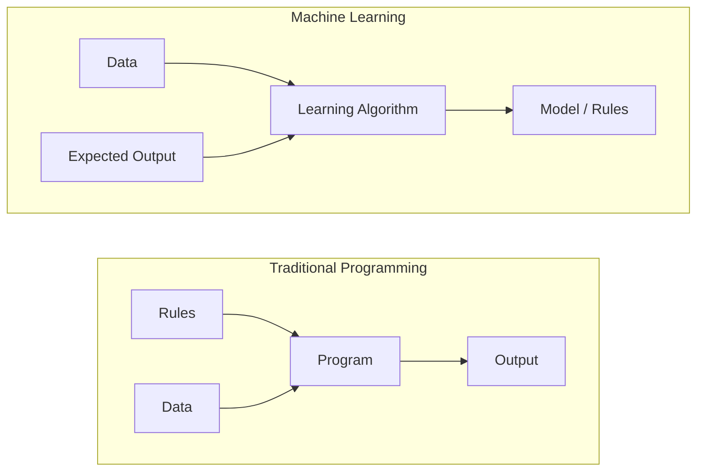
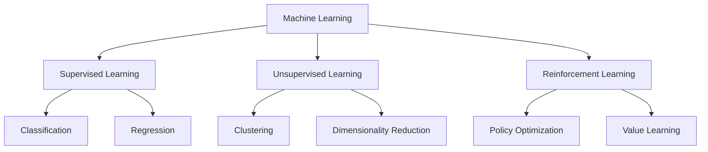
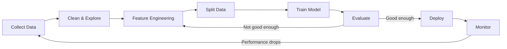
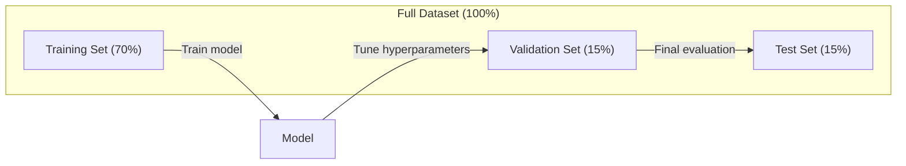
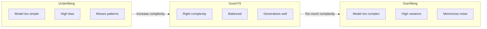
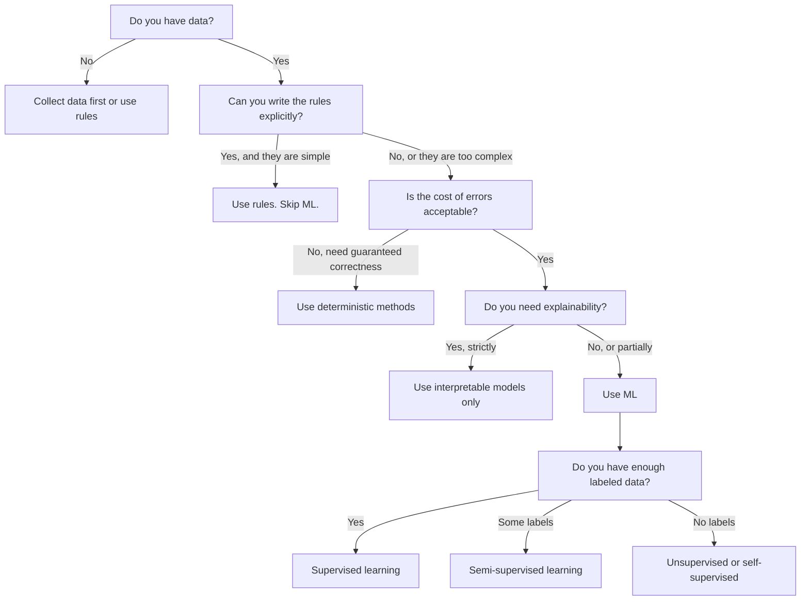

# Apa Itu Machine Learning

> Pembelajaran mesin mengajarkan komputer untuk menemukan pola dalam data, bukan menulis aturan dengan tangan.

**Type:** Learn
**Language:** Python
**Prerequisites:** Phase 1 (Dasar Matematika)
**Waktu:** ~45 menit

## Tujuan Pembelajaran

- Jelaskan perbedaan antara pembelajaran yang diawasi, tidak diawasi, dan pembelajaran penguatan dan identifikasi jenis mana yang berlaku untuk masalah tertentu
- Menerapkan pengklasifikasi centroid terdekat dari awal dan mengevaluasinya berdasarkan garis dasar acak
- Bedakan antara tugas klasifikasi dan regresi dan pilih loss function yang sesuai untuk masing-masing tugas
- Evaluasi apakah masalah bisnis tertentu cocok untuk ML atau lebih baik diselesaikan dengan aturan deterministik

## Masalah

kamu ingin membuat filter spam. Pendekatan tradisional: duduk dan tulis ratusan aturan. "Jika email berisi 'UANG GRATIS', tandai sebagai spam. Jika lebih dari 3 tanda seru, tandai sebagai spam." kamu menghabiskan waktu berminggu-minggu untuk menulis peraturan. Kemudian pelaku spam mengubah kata-katanya. Aturanmu dilanggar. kamu menulis lebih banyak aturan. Siklusnya tidak pernah berakhir.

Pembelajaran mesin membalikkan keadaan ini. Alih-alih menulis peraturan, kamu memberikan komputer ribuan email berlabel ("spam" atau "bukan spam") dan membiarkannya mengetahui aturannya sendiri. Komputer menemukan pola yang tidak pernah terpikirkan oleh kamu. Saat pelaku spam mengubah taktik, kamu melatih kembali data baru alih-alih menulis ulang code.

Pergeseran dari "aturan pemrograman" ke "pembelajaran dari data" adalah inti dari machine learning. Setiap mesin rekomendasi, asisten suara, mobil self-driving, dan model bahasa bekerja dengan cara ini.

## Konsep

### Belajar Dari Data, Bukan Aturan

Pemrograman tradisional dan machine learning memecahkan masalah dalam arah yang berlawanan.



Pemrograman tradisional: kamu menulis aturannya. Program ini menerapkannya pada data untuk menghasilkan output.

Pembelajaran mesin: kamu memberikan data dan output yang diharapkan. Algoritme menemukan aturannya.

"Model" yang dihasilkan dari training ADALAH aturan, yang dikodekan sebagai angka (weight, parameter). Ia menggeneralisasikan contoh-contoh yang telah dilihatnya untuk membuat prediksi terhadap data yang belum pernah dilihatnya.

### Tiga Jenis Machine Learning



**Pembelajaran yang Diawasi**: kamu memiliki pasangan input-output. Model belajar memetakan input ke output.
- "Ini 10.000 foto berlabel kucing atau anjing. Belajar membedakannya."
- "Berikut feature dan harga rumah. Belajar memprediksi harga."

**Pembelajaran Tanpa Pengawasan**: kamu hanya memiliki input. Tidak ada label. Model menemukan strukturnya sendiri.
- "Berikut adalah 10.000 riwayat pembelian pelanggan. Temukan pengelompokan alami."
- "Berikut adalah 1.000 titik data dimension. Kurangi menjadi 2 dimension sambil mempertahankan struktur."

**Pembelajaran Penguatan**: Agen mengambil tindakan di suatu lingkungan dan menerima imbalan atau penalti. Ia mempelajari strategi (kebijakan) untuk memaksimalkan imbalan total.
- "Mainkan game ini. +1 untuk menang, -1 untuk kalah. Cari tahu strateginya."
- "Kontrol lengan robot ini. +1 untuk mengambil objek, -0,01 untuk setiap detik yang terbuang."

Sebagian besar dari apa yang akan kamu bangun dalam praktik menggunakan pembelajaran yang diawasi. Pembelajaran tanpa pengawasan biasa terjadi pada pra-pemrosesan dan eksplorasi. Pembelajaran penguatan mendukung AI game, robotika, dan RLHF untuk model bahasa.

### Melampaui Tiga Besar

Ketiga kategori di atas bersih, tetapi ML di dunia nyata sering kali mengaburkan batasan tersebut.

**Pembelajaran semi-supervisi** menggunakan sekumpulan kecil data berlabel dan sejumlah besar data tidak berlabel. kamu mungkin memiliki 100 gambar medis berlabel dan 100.000 gambar tidak berlabel. Tekniknya meliputi:- **Penyebaran label:** Buat grafik yang menghubungkan titik data serupa. Label menyebar dari node berlabel ke tetangga yang tidak berlabel melalui grafik.
- **Pelabelan semu:** Latih model pada data berlabel, gunakan model tersebut untuk memprediksi label pada data tak berlabel, lalu latih ulang semua data. Model melakukan bootstrap pada set training-nya sendiri.
- **Regulerisasi konsistensi:** Model harus memberikan prediksi yang sama untuk sebuah input dan versi input tersebut yang sedikit terganggu. Ini berfungsi bahkan tanpa label.

**Pembelajaran dengan pengawasan mandiri** menciptakan pengawasan dari data itu sendiri. Tidak diperlukan label manusia sama sekali. Model membuat tugas prediksinya sendiri dari struktur data.

- **Pemodelan bahasa bertopeng (BERT):** Sembunyikan 15% kata dalam kalimat, latih model untuk memprediksi kata yang hilang. "Label" berasal dari teks aslinya.
- **Pembelajaran kontrastif (SimCLR):** Ambil gambar, buat dua versi tambahan. Latih model untuk mengenali bahwa gambar tersebut berasal dari gambar yang sama sekaligus membedakannya dari versi tambahan gambar lainnya.
- **Prediksi token berikutnya (GPT):** Memprediksi kata berikutnya berdasarkan semua kata sebelumnya. Setiap dokumen teks menjadi contoh training.

Ini bukanlah kategori yang terpisah dari tiga besar. Itu adalah strategi yang menggabungkan ide-ide yang diawasi dan tidak diawasi. Pembelajaran dengan pengawasan mandiri secara teknis diawasi (model memprediksi sesuatu), tetapi labelnya dihasilkan secara otomatis, bukan oleh manusia.

### Klasifikasi vs Regresi

Ini adalah dua tugas utama pembelajaran yang diawasi.

| Aspek | Klasifikasi | Regresi |
|--------|---------------|------------|
| Output | Kategori terpisah | Angka kontinu |
| Contoh | "Apakah ini email spam?" | “Berapa harga rumahnya?” |
| Ruang output | {kucing, anjing, burung} | Bilangan real apa saja |
| Loss function | Entropi silang, akurasi | Kesalahan kuadrat rata-rata, MAE |
| Keputusan | Batas antar kelas | Kurva yang sesuai dengan data |

Klasifikasi menjawab “kategori yang mana?” Regresi menjawab “berapa?”

Beberapa masalah dapat dibingkai dengan cara apa pun. Memprediksi apakah suatu saham naik atau turun adalah klasifikasi. Memprediksi harga pastinya adalah regresi.

### Alur Kerja ML

Setiap proyek machine learning mengikuti alur yang sama, apa pun algoritmenya.



**Kumpulkan Data**: Kumpulkan data mentah. Lebih banyak data hampir selalu lebih baik, namun kualitas lebih penting daripada kuantitas.

**Bersihkan & Jelajahi**: Menangani nilai yang hilang, menghapus duplikat, memvisualisasikan distribusi, menemukan anomali. Langkah ini seringkali memakan waktu 60-80% dari total waktu proyek.

**Rekayasa Feature**: Mengubah data mentah menjadi feature yang dapat digunakan model. Ubah tanggal menjadi hari dalam seminggu. Normalisasikan kolom numerik. Enkode variabel kategori. Feature bagus lebih penting daripada algoritme mewah.

**Pisahkan Data**: Bagi menjadi set training, validasi, dan pengujian. Model dilatih pada training data, kamu menyesuaikan hyperparameter pada data validasi, dan kamu melaporkan performa akhir pada data pengujian.

**Model Kereta**: Memasukkan training data ke dalam suatu algoritma. Algoritme menyesuaikan parameter internal untuk meminimalkan loss function.

**Evaluasi**: Mengukur kinerja pada data validasi/pengujian. Jika kinerja tidak dapat diterima, kembali dan coba feature, algoritma, atau hyperparameter yang berbeda.

**Deploy**: Memasukkan model ke dalam produksi untuk membuat prediksi pada data baru.

**Monitor**: Melacak kinerja dari waktu ke waktu. Distribusi data berubah (data drift), dan model menurun. Saat performa turun, latih kembali.

### Training, Validasi, dan Pemisahan TesIni adalah konsep terpenting yang salah bagi pemula. kamu harus mengevaluasi model kamu berdasarkan data yang belum pernah dilihatnya selama training. Jika tidak, kamu mengukur hafalan, bukan belajar.



| Berpisah | Tujuan | Saat digunakan | Ukuran khas |
|-------|---------|-----------|-------------|
| Training | Model belajar dari data ini | Selama training | 60-80% |
| Validasi | Sesuaikan hyperparameter, bandingkan model | Setelah setiap training dijalankan | 10-20% |
| Tes | Estimasi kinerja akhir yang tidak bias | Sekali, di bagian paling akhir | 10-20% |

Set tes itu sakral. kamu melihatnya tepat sekali. Jika kamu terus menyesuaikan model berdasarkan performa pengujian, kamu berlatih secara efektif pada set pengujian dan angka yang dilaporkan tidak ada artinya.

Untuk dataset kecil, gunakan validasi silang k-fold: bagi data menjadi k bagian, latih pada k-1 bagian, validasi bagian yang tersisa, putar, dan rata-rata hasil.

### Kelebihan dan Kekurangan



**Underfitting**: Model terlalu sederhana untuk menangkap pola dalam data. Garis lurus mencoba menyesuaikan hubungan yang melengkung. Kesalahan training tinggi. Kesalahan pengujian tinggi.

**Overfitting**: Model terlalu rumit dan mengingat training data, termasuk noise-nya. Kurva bergelombang yang melewati setiap titik training tetapi gagal pada data baru. Kesalahan training rendah. Kesalahan pengujian tinggi.

**Cocok**: Model menangkap pola nyata tanpa mengingat noise. Kesalahan training dan kesalahan pengujian keduanya cukup rendah.

Tanda-tanda overfitting:
- Akurasi training jauh lebih tinggi daripada akurasi validasi
- Model memiliki performa yang baik pada training data, namun buruk pada data baru
- Menambahkan lebih banyak training data akan meningkatkan kinerja (model menghafal, bukan belajar)

Perbaikan untuk overfitting:
- Dapatkan lebih banyak training data
- Mengurangi kompleksitas model (parameter lebih sedikit, arsitektur lebih sederhana)
- Regularisasi (tambahkan penalti untuk weight besar)
- Dropout (secara acak menghilangkan neuron selama training)
- Penghentian awal (hentikan training ketika kesalahan validasi mulai meningkat)

Perbaikan untuk kekurangan:
- Gunakan model yang lebih kompleks
- Tambahkan lebih banyak feature
- Kurangi regularisasi
- Berlatih lebih lama

### Pengorbanan Bias-Varians

Ini adalah kerangka matematis di balik overfitting dan underfitting.

**Bias**: Kesalahan akibat asumsi yang salah dalam model. Model linier memiliki bias yang tinggi jika hubungan sebenarnya nonlinier. Bias yang tinggi menyebabkan underfitting.

**Varians**: Kesalahan dari sensitivitas terhadap fluktuasi kecil pada training data. Model dengan varian tinggi memberikan prediksi yang sangat berbeda ketika dilatih pada subset data yang berbeda. Varians yang tinggi menyebabkan overfitting.

| Kompleksitas model | Bias | Varians | Hasil |
|-----------------|------|----------|--------|
| Terlalu rendah (model linier untuk data melengkung) | Tinggi | Rendah | Kurangnya |
| Akurat | Sedang | Sedang | Generalisasi yang bagus |
| Terlalu tinggi (polinomial derajat-20 untuk 10 poin) | Rendah | Tinggi | Keterlaluan |

Kesalahan total = Bias^2 + Varians + Kebisingan yang tidak dapat direduksi

kamu tidak dapat mengurangi noise yang tidak dapat direduksi (ini adalah keacakan dalam data itu sendiri). kamu ingin menemukan titik terbaik di mana bias^2 + varians diminimalkan.

### Tidak Ada Teorema Makan Siang Gratis

Tidak ada algoritma tunggal yang bekerja paling baik untuk setiap permasalahan. Algoritma yang berkinerja baik pada satu kelas masalah akan berkinerja buruk pada kelas masalah lainnya. Inilah sebabnya para data scientist mencoba berbagai algoritme dan membandingkan hasilnya.Dalam praktiknya, pilihannya bergantung pada:
- Berapa banyak data yang kamu miliki
- Berapa banyak feature yang ada
- Apakah hubungannya linier atau nonlinier
- Apakah kamu memerlukan interpretasi
- Berapa banyak komputasi yang kamu mampu

### Kapan TIDAK Menggunakan Machine Learning

ML memang ampuh tetapi tidak selalu merupakan alat yang tepat. Sebelum mencari model, tanyakan apakah kamu benar-benar membutuhkannya.

**Jangan gunakan ML ketika:**

- **Aturannya sederhana dan jelas.** Perhitungan pajak, algoritma pengurutan, konversi unit. Jika kamu dapat menulis logika dalam beberapa pernyataan if, model akan menambah kompleksitas tanpa manfaat apa pun.
- **kamu tidak memiliki data atau data sangat sedikit.** ML memerlukan contoh untuk dipelajari. Dengan 10 titik data, kamu tidak dapat melatih sesuatu yang berarti. Kumpulkan data terlebih dahulu.
- ** Loss jika melakukan kesalahan adalah bencana besar dan kamu memerlukan jaminan kebenarannya. ** Penghitungan dosis medis, pengendalian reaktor nuklir, verifikasi kriptografi. Model ML bersifat probabilistik. Terkadang mereka salah. Jika “terkadang salah” tidak dapat diterima, gunakan metode deterministik.
- **Tabel pencarian atau heuristik memecahkan masalah.** Jika ambang batas atau tabel sederhana mencakup 99% kasus, menambahkan ML akan meningkatkan biaya pemeliharaan tanpa perbaikan yang berarti.
- **kamu tidak dapat menjelaskan keputusan tersebut dan diperlukan penjelasan.** Industri yang diatur (peminjaman, asuransi, peradilan pidana) terkadang mengharuskan setiap keputusan dapat dijelaskan sepenuhnya. Beberapa model ML dapat diinterpretasikan (regresi linier, pohon keputusan kecil). Kebanyakan tidak.
- **Masalah berubah lebih cepat daripada kemampuan kamu untuk berlatih ulang.** Jika aturan berubah setiap hari dan training ulang memerlukan waktu seminggu, model akan selalu basi.

Gunakan diagram alur keputusan ini:



## Build

Code di `code/ml_intro.py` mengimplementasikan pengklasifikasi centroid terdekat dari awal, algoritma ML yang paling sederhana. Ini menunjukkan ide inti: belajar dari data, lalu memprediksi data baru.

### Langkah 1: Pengklasifikasi Centroid Terdekat dari Awal

Pengklasifikasi centroid terdekat menghitung pusat (rata-rata) setiap kelas dalam training data. Untuk memprediksi, ia menugaskan setiap titik baru ke kelas yang pusatnya paling dekat.

```python
class NearestCentroid:
    def fit(self, X, y):
        self.classes = np.unique(y)
        self.centroids = np.array([
            X[y == c].mean(axis=0) for c in self.classes
        ])

    def predict(self, X):
        distances = np.array([
            np.sqrt(((X - c) ** 2).sum(axis=1))
            for c in self.centroids
        ])
        return self.classes[distances.argmin(axis=0)]
```

Itu adalah keseluruhan algoritma. Fit menghitung dua cara. Prediksi menghitung distance. Tidak ada gradient descent, tidak ada iterasi, tidak ada hyperparameter.

### Langkah 2: Melatih Data Sintetis

Kami menghasilkan dataset klasifikasi 2D dengan dua kelas yang sedikit tumpang tindih. Pengklasifikasi centroid menggambar batas keputusan linier antara pusat kelas.

```python
rng = np.random.RandomState(42)
X_class0 = rng.randn(100, 2) + np.array([1.0, 1.0])
X_class1 = rng.randn(100, 2) + np.array([-1.0, -1.0])
X = np.vstack([X_class0, X_class1])
y = np.array([0] * 100 + [1] * 100)
```

### Langkah 3: Bandingkan dengan Baseline

Setiap model ML harus dibandingkan dengan dasar yang sepele. Di sini, garis dasar memprediksi kelas acak. Jika model ML kamu tidak bisa menebak secara acak, ada sesuatu yang salah.

```python
baseline_preds = rng.choice([0, 1], size=len(y_test))
baseline_acc = np.mean(baseline_preds == y_test)
```

Pengklasifikasi centroid harus mendapatkan akurasi sekitar 90%+ pada dataset bersih ini. Baseline acak mendapat sekitar 50%.

### Mengapa Ini Penting

Pengklasifikasi centroid terdekat sangatlah sederhana. Ia tidak memiliki hyperparameter, tidak ada iterasi, tidak ada gradient descent. Namun ini menangkap pola dasar ML:

1. **Learn** representasi dari training data (pusat massa)
2. **Memprediksi** data baru menggunakan representasi tersebut (distance terdekat)
3. **Evaluasi** berdasarkan data dasar (tebakan acak)

Setiap algoritme ML, mulai dari regresi logistik hingga Transformer, mengikuti pola tiga langkah yang sama. Representasinya menjadi lebih kompleks, namun alur kerjanya tetap sama.

### Langkah 4: Apa yang Tidak Dapat Dilakukan Pengklasifikasi CentroidPengklasifikasi centroid terdekat mengasumsikan setiap kelas membentuk satu gumpalan. Ini menarik batasan keputusan linier. Gagal ketika:

- Kelas memiliki beberapa cluster (misalnya, angka "1" dapat ditulis dengan beberapa cara berbeda)
- Batasan keputusan bersifat nonlinier (misalnya, satu kelas membungkus kelas lainnya)
- Feature memiliki skala yang sangat berbeda (distance didominasi oleh feature dengan skala terbesar)

Keterbatasan ini memotivasi setiap algoritma lain yang akan kamu pelajari. Nearest neighbor K menangani banyak cluster. Pohon keputusan menangani batasan nonlinier. Penskalaan feature memperbaiki masalah skala. Setiap lesson dibangun berdasarkan keterbatasan lesson sebelumnya.

## Pakai

sklearn menyediakan `NearestCentroid` dan generator data sintetis:

```python
from sklearn.neighbors import NearestCentroid
from sklearn.datasets import make_classification
from sklearn.model_selection import train_test_split

X, y = make_classification(
    n_samples=500, n_features=2, n_redundant=0,
    n_clusters_per_class=1, random_state=42
)
X_train, X_test, y_train, y_test = train_test_split(X, y, test_size=0.3)

clf = NearestCentroid()
clf.fit(X_train, y_train)
print(f"Accuracy: {clf.score(X_test, y_test):.3f}")
```

## Kirim

Lesson ini menghasilkan `outputs/prompt-ml-problem-framer.md` -- prompt yang mengubah masalah bisnis yang tidak jelas menjadi tugas ML yang nyata. Berikan deskripsi masalahnya ("kami ingin mengurangi churn" atau "memprediksi permintaan untuk kuartal berikutnya") dan ini mengidentifikasi jenis pembelajaran, menentukan target prediksi, mencantumkan feature kandidat, memilih metrik keberhasilan, menetapkan garis dasar, dan menandai kendala seperti kebocoran data atau ketidakseimbangan kelas. Gunakan ini di awal proyek ML apa pun untuk menghindari pembuatan hal yang salah.

## Istilah Kunci

| Istilah | Apa kata orang | Apa sebenarnya arti |
|------|----------------|----------------------|
| Model | "AI" | Fungsi matematika dengan parameter yang dapat dipelajari yang memetakan input ke output |
| Training | "Mengajar AI" | Menjalankan algoritme optimization untuk menyesuaikan parameter model sehingga prediksi cocok dengan output yang diketahui |
| Feature | "Kolom input" | Properti data terukur yang digunakan model untuk membuat prediksi |
| Label | "Jawabannya" | Output yang diketahui untuk contoh training, digunakan untuk menghitung sinyal kesalahan |
| Hiperparameter | "Pengaturan yang kamu sesuaikan" | Parameter yang ditetapkan sebelum training yang mengontrol proses pembelajaran (learning rate, jumlah layer) |
| Loss function | "Betapa salahnya modelnya" | Sebuah fungsi yang mengukur kesenjangan antara output yang diprediksi dan output aktual, yang coba diminimalkan oleh training |
| Keterlaluan | "Itu hafal tesnya" | Model tersebut mempelajari kebisingan khusus training, bukan pola umum, sehingga gagal pada data baru |
| Kurangnya | "Ia tidak mempelajari apa pun" | Modelnya terlalu sederhana untuk menangkap pola nyata dalam data |
| Generalisasi | "Ini berfungsi pada data baru" | Kemampuan model untuk membuat prediksi akurat pada data yang tidak dilatih |
| Validasi silang | "Menguji bagian yang berbeda" | Memisahkan data berulang kali menjadi lipatan training/pengujian dan merata-ratakan hasil, memberikan perkiraan kinerja yang lebih kuat |
| Regularisasi | "Menjaga weight tetap kecil" | Menambahkan istilah penalti ke loss function yang menghalangi model yang terlalu rumit |
| Penyimpangan data | "Dunia telah berubah" | Distribusi statistik data masuk bergeser seiring waktu, menurunkan kinerja model |

## Latihan

1. Ambil dataset apa pun (misalnya Iris, Titanic). Bagi 15/70/15 menjadi training/validasi/pengujian. Jelaskan mengapa kamu tidak perlu menyetel hyperparameter pada set pengujian.
2. Sebutkan tiga permasalahan dunia nyata. Untuk masing-masingnya, identifikasi apakah itu klasifikasi, regresi, atau pengelompokan, dan apakah diawasi atau tidak.
3. Sebuah model mendapatkan akurasi 99% pada training data tetapi 60% pada data pengujian. Diagnosis masalahnya dan buat daftar tiga hal yang ingin kamu coba untuk memperbaikinya.

## Bacaan Lanjutan- [Pengantar Pembelajaran Statistik](https://www.statlearning.com/) - buku teks gratis yang mencakup semua metode ML klasik dengan contoh praktis
- [Kursus Singkat Machine Learning Google](https://developers.google.com/machine-learning/crash-course) - pengenalan visual singkat tentang konsep ML
- [Panduan Pengguna Scikit-learn](https://scikit-learn.org/stable/user_guide.html) - referensi praktis untuk mengimplementasikan ML dengan Python
