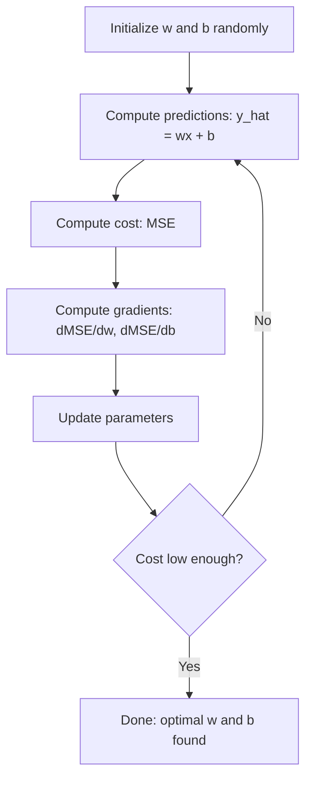

# Regresi Linier

> Regresi linier menarik garis lurus terbaik melalui data kamu. Ini adalah "halo dunia" machine learning.

**Type:** Build
**Language:** Python
**Prerequisites:** Phase 1 (Linear Algebra, Kalkulus, Optimization), Phase 2 Lesson 1
**Waktu:** ~90 menit

## Tujuan Pembelajaran

- Turunkan aturan pembaruan gradient descent untuk kesalahan kuadrat rata-rata dan terapkan regresi linier dari awal
- Bandingkan gradient descent dan persamaan normal dalam hal kompleksitas komputasi dan kapan menggunakan masing-masing persamaan
- Membangun model regresi linier berganda dengan standarisasi feature dan menafsirkan weight yang dipelajari
- Jelaskan bagaimana regresi Ridge (regularisasi L2) mencegah overfitting dengan memberikan penalti pada weight yang besar

## Masalah

kamu memiliki data: ukuran rumah dan harga jualnya. kamu ingin memprediksi harga rumah baru berdasarkan ukurannya. kamu dapat melihatnya di plot sebar, tetapi kamu memerlukan rumus. kamu memerlukan garis yang paling sesuai dengan data sehingga kamu dapat memasukkan ukuran apa pun dan mendapatkan prediksi harga.

Regresi linier memberi kamu garis itu. Lebih penting lagi, ini memperkenalkan keseluruhan loop training ML: menentukan model, menentukan fungsi biaya, mengoptimalkan parameter. Setiap algoritma ML mengikuti pola yang sama. Kuasai di sini dengan kasus paling sederhana, dan kamu akan mengenalinya di mana saja.

Ini bukan hanya untuk permasalahan sederhana. Regresi linier digunakan dalam sistem produksi untuk peramalan permintaan, analisis pengujian A/B, pemodelan keuangan, dan sebagai dasar untuk setiap tugas regresi.

## Konsep

### Modelnya

Regresi linier mengasumsikan hubungan linier antara input (x) dan output (y):

```
y = wx + b
```

- `w` (berat/kemiringan): berapa banyak perubahan y ketika x bertambah 1
- `b` (bias/intersep): nilai y ketika x = 0

Untuk beberapa input (feature), ini meluas ke:

```
y = w1*x1 + w2*x2 + ... + wn*xn + b
```

Atau dalam bentuk vector: `y = w^T * x + b`

Tujuannya: temukan nilai w dan b yang membuat prediksi y sedekat mungkin dengan y sebenarnya di semua contoh training.

### Fungsi Biaya (Mean Squared Error)

Bagaimana kamu mengukur "sedekat mungkin"? kamu memerlukan satu angka yang menunjukkan seberapa salah prediksi kamu. Pilihan paling umum adalah Mean Squared Error (MSE):

```
MSE = (1/n) * sum((y_predicted - y_actual)^2)
```

Mengapa kuadrat? Dua alasan. Pertama, ia memberikan penalti lebih besar pada kesalahan besar daripada kesalahan kecil (kesalahan 10 100x lebih buruk daripada kesalahan 1, bukan 10x). Kedua, fungsi kuadratnya halus dan dapat dibedakan di semua tempat, sehingga optimization menjadi mudah.

Fungsi biaya menciptakan permukaan. Untuk weight tunggal w dan bias b, permukaan MSE terlihat seperti mangkuk (paraboloid cembung). Bagian bawah mangkuk adalah tempat UMK diminimalkan. Latihan berarti menemukan dasar itu.

### Penurunan Gradient

Gradient descent menemukan dasar mangkuk dengan mengambil langkah menuruni bukit.



Gradient memberi tahu kamu dua hal: ke arah mana setiap parameter harus dipindahkan, dan berapa banyak yang harus dipindahkan.

Untuk UMK dengan y_hat = wx + b:

```
dMSE/dw = (2/n) * sum((y_hat - y) * x)
dMSE/db = (2/n) * sum(y_hat - y)
```

Aturan pembaruan:

```
w = w - learning_rate * dMSE/dw
b = b - learning_rate * dMSE/db
```

Learning rate mengontrol ukuran langkah. Terlalu besar: kamu overshoot minimum dan menyimpang. Terlalu kecil: training memakan waktu lama. Nilai awal yang umum: 0,01, 0,001, atau 0,0001.

### Persamaan Normal (Solusi Bentuk Tertutup)

Khusus untuk regresi linier, terdapat rumus langsung yang memberikan weight optimal tanpa iterasi apa pun:

```
w = (X^T * X)^(-1) * X^T * y
```Ini membalikkan matrix untuk menyelesaikan w dalam satu langkah. Ini berfungsi sempurna untuk dataset kecil. Untuk dataset besar (jutaan baris atau ribuan feature), gradient descent lebih disukai karena inversi matrix adalah O(n^3) dalam jumlah feature.

### Regresi Linier Berganda

Dengan berbagai feature, modelnya menjadi:

```
y = w1*x1 + w2*x2 + ... + wn*xn + b
```

Semuanya bekerja sama: MSE adalah fungsi biaya, gradient descent memperbarui semua weight secara bersamaan. Satu-satunya perbedaan adalah kamu memasang hyperplane, bukan garis.

Penskalaan feature penting di sini. Jika satu feature berkisar dari 0 hingga 1 dan feature lainnya berkisar dari 0 hingga 1.000.000, gradient descent akan mengalami kesulitan karena permukaan biaya menjadi memanjang. Standarisasi feature (kurangi mean, bagi dengan deviasi standar) sebelum training.

### Regresi Polinomial

Bagaimana jika hubungannya tidak linier? kamu masih dapat menggunakan regresi linier dengan membuat feature polinomial:

```
y = w1*x + w2*x^2 + w3*x^3 + b
```

Ini masih merupakan regresi "linier" karena modelnya linier dalam weight (w1, w2, w3). kamu hanya menggunakan feature nonlinier x.

Polinomial derajat yang lebih tinggi dapat menyesuaikan kurva yang lebih kompleks tetapi berisiko mengalami overfitting. Polinomial derajat 10 akan melewati setiap titik dalam dataset 10 titik tetapi memberikan prediksi yang buruk pada data baru.

### Skor R-Kuadrat

MSE memberi tahu kamu betapa salahnya kamu, tetapi angkanya bergantung pada skala y. R-kuadrat (R^2) memberikan ukuran yang tidak bergantung pada skala:

```
R^2 = 1 - (sum of squared residuals) / (sum of squared deviations from mean)
    = 1 - SS_res / SS_tot
```

- R^2 = 1.0: prediksi sempurna
- R^2 = 0,0: model tidak lebih baik daripada memprediksi mean setiap saat
- R^2 < 0,0: model lebih buruk daripada memprediksi mean

### Pratinjau Regularisasi (Regresi Ridge)

Jika kamu memiliki banyak feature, model dapat melakukan overfit dengan memberikan weight yang besar. Regresi ridge (regularisasi L2) menambahkan penalti:

```
Cost = MSE + lambda * sum(w_i^2)
```

Istilah penalti tidak mendukung weight yang besar. Lambda hyperparameter mengontrol tradeoff: lambda yang lebih tinggi berarti weight yang lebih kecil dan lebih banyak regularisasi. Hal ini dibahas secara mendalam pada lesson selanjutnya. Untuk saat ini, ketahuilah bahwa hal itu ada dan mengapa hal itu membantu.

## Build

### Langkah 1: Hasilkan data sample

```python
import random
import math

random.seed(42)

TRUE_W = 3.0
TRUE_B = 7.0
N_SAMPLES = 100

X = [random.uniform(0, 10) for _ in range(N_SAMPLES)]
y = [TRUE_W * x + TRUE_B + random.gauss(0, 2.0) for x in X]

print(f"Generated {N_SAMPLES} samples")
print(f"True relationship: y = {TRUE_W}x + {TRUE_B} (+ noise)")
print(f"First 5 points: {[(round(X[i], 2), round(y[i], 2)) for i in range(5)]}")
```

### Langkah 2: Regresi linier dari awal dengan gradient descent

```python
class LinearRegression:
    def __init__(self, learning_rate=0.01):
        self.w = 0.0
        self.b = 0.0
        self.lr = learning_rate
        self.cost_history = []

    def predict(self, X):
        return [self.w * x + self.b for x in X]

    def compute_cost(self, X, y):
        predictions = self.predict(X)
        n = len(y)
        cost = sum((pred - actual) ** 2 for pred, actual in zip(predictions, y)) / n
        return cost

    def compute_gradients(self, X, y):
        predictions = self.predict(X)
        n = len(y)
        dw = (2 / n) * sum((pred - actual) * x for pred, actual, x in zip(predictions, y, X))
        db = (2 / n) * sum(pred - actual for pred, actual in zip(predictions, y))
        return dw, db

    def fit(self, X, y, epochs=1000, print_every=200):
        for epoch in range(epochs):
            dw, db = self.compute_gradients(X, y)
            self.w -= self.lr * dw
            self.b -= self.lr * db
            cost = self.compute_cost(X, y)
            self.cost_history.append(cost)
            if epoch % print_every == 0:
                print(f"  Epoch {epoch:4d} | Cost: {cost:.4f} | w: {self.w:.4f} | b: {self.b:.4f}")
        return self

    def r_squared(self, X, y):
        predictions = self.predict(X)
        y_mean = sum(y) / len(y)
        ss_res = sum((actual - pred) ** 2 for actual, pred in zip(y, predictions))
        ss_tot = sum((actual - y_mean) ** 2 for actual in y)
        return 1 - (ss_res / ss_tot)


print("=== Training Linear Regression (Gradient Descent) ===")
model = LinearRegression(learning_rate=0.005)
model.fit(X, y, epochs=1000, print_every=200)
print(f"\nLearned: y = {model.w:.4f}x + {model.b:.4f}")
print(f"True:    y = {TRUE_W}x + {TRUE_B}")
print(f"R-squared: {model.r_squared(X, y):.4f}")
```

### Langkah 3: Persamaan normal (solusi bentuk tertutup)

```python
class LinearRegressionNormal:
    def __init__(self):
        self.w = 0.0
        self.b = 0.0

    def fit(self, X, y):
        n = len(X)
        x_mean = sum(X) / n
        y_mean = sum(y) / n
        numerator = sum((X[i] - x_mean) * (y[i] - y_mean) for i in range(n))
        denominator = sum((X[i] - x_mean) ** 2 for i in range(n))
        self.w = numerator / denominator
        self.b = y_mean - self.w * x_mean
        return self

    def predict(self, X):
        return [self.w * x + self.b for x in X]

    def r_squared(self, X, y):
        predictions = self.predict(X)
        y_mean = sum(y) / len(y)
        ss_res = sum((actual - pred) ** 2 for actual, pred in zip(y, predictions))
        ss_tot = sum((actual - y_mean) ** 2 for actual in y)
        return 1 - (ss_res / ss_tot)


print("\n=== Normal Equation (Closed-Form) ===")
model_normal = LinearRegressionNormal()
model_normal.fit(X, y)
print(f"Learned: y = {model_normal.w:.4f}x + {model_normal.b:.4f}")
print(f"R-squared: {model_normal.r_squared(X, y):.4f}")
```

### Langkah 4: Regresi linier berganda

```python
class MultipleLinearRegression:
    def __init__(self, n_features, learning_rate=0.01):
        self.weights = [0.0] * n_features
        self.bias = 0.0
        self.lr = learning_rate
        self.cost_history = []

    def predict_single(self, x):
        return sum(w * xi for w, xi in zip(self.weights, x)) + self.bias

    def predict(self, X):
        return [self.predict_single(x) for x in X]

    def compute_cost(self, X, y):
        predictions = self.predict(X)
        n = len(y)
        return sum((pred - actual) ** 2 for pred, actual in zip(predictions, y)) / n

    def fit(self, X, y, epochs=1000, print_every=200):
        n = len(y)
        n_features = len(X[0])
        for epoch in range(epochs):
            predictions = self.predict(X)
            errors = [pred - actual for pred, actual in zip(predictions, y)]
            for j in range(n_features):
                grad = (2 / n) * sum(errors[i] * X[i][j] for i in range(n))
                self.weights[j] -= self.lr * grad
            grad_b = (2 / n) * sum(errors)
            self.bias -= self.lr * grad_b
            cost = self.compute_cost(X, y)
            self.cost_history.append(cost)
            if epoch % print_every == 0:
                print(f"  Epoch {epoch:4d} | Cost: {cost:.4f}")
        return self

    def r_squared(self, X, y):
        predictions = self.predict(X)
        y_mean = sum(y) / len(y)
        ss_res = sum((actual - pred) ** 2 for actual, pred in zip(y, predictions))
        ss_tot = sum((actual - y_mean) ** 2 for actual in y)
        return 1 - (ss_res / ss_tot)


random.seed(42)
N = 100
X_multi = []
y_multi = []
for _ in range(N):
    size = random.uniform(500, 3000)
    bedrooms = random.randint(1, 5)
    age = random.uniform(0, 50)
    price = 50 * size + 10000 * bedrooms - 1000 * age + 50000 + random.gauss(0, 20000)
    X_multi.append([size, bedrooms, age])
    y_multi.append(price)


def standardize(X):
    n_features = len(X[0])
    means = [sum(X[i][j] for i in range(len(X))) / len(X) for j in range(n_features)]
    stds = []
    for j in range(n_features):
        variance = sum((X[i][j] - means[j]) ** 2 for i in range(len(X))) / len(X)
        stds.append(variance ** 0.5)
    X_scaled = []
    for i in range(len(X)):
        row = [(X[i][j] - means[j]) / stds[j] if stds[j] > 0 else 0 for j in range(n_features)]
        X_scaled.append(row)
    return X_scaled, means, stds


y_mean_val = sum(y_multi) / len(y_multi)
y_std_val = (sum((yi - y_mean_val) ** 2 for yi in y_multi) / len(y_multi)) ** 0.5
y_scaled = [(yi - y_mean_val) / y_std_val for yi in y_multi]

X_scaled, x_means, x_stds = standardize(X_multi)

print("\n=== Multiple Linear Regression (3 features) ===")
print("Features: house size, bedrooms, age")
multi_model = MultipleLinearRegression(n_features=3, learning_rate=0.01)
multi_model.fit(X_scaled, y_scaled, epochs=1000, print_every=200)

print(f"\nWeights (standardized): {[round(w, 4) for w in multi_model.weights]}")
print(f"Bias (standardized): {multi_model.bias:.4f}")
print(f"R-squared: {multi_model.r_squared(X_scaled, y_scaled):.4f}")
```

### Langkah 5: Regresi polinomial

```python
class PolynomialRegression:
    def __init__(self, degree, learning_rate=0.01):
        self.degree = degree
        self.weights = [0.0] * degree
        self.bias = 0.0
        self.lr = learning_rate

    def make_features(self, X):
        return [[x ** (d + 1) for d in range(self.degree)] for x in X]

    def predict(self, X):
        features = self.make_features(X)
        return [sum(w * f for w, f in zip(self.weights, row)) + self.bias for row in features]

    def fit(self, X, y, epochs=1000, print_every=200):
        features = self.make_features(X)
        n = len(y)
        for epoch in range(epochs):
            predictions = [sum(w * f for w, f in zip(self.weights, row)) + self.bias for row in features]
            errors = [pred - actual for pred, actual in zip(predictions, y)]
            for j in range(self.degree):
                grad = (2 / n) * sum(errors[i] * features[i][j] for i in range(n))
                self.weights[j] -= self.lr * grad
            grad_b = (2 / n) * sum(errors)
            self.bias -= self.lr * grad_b
            if epoch % print_every == 0:
                cost = sum(e ** 2 for e in errors) / n
                print(f"  Epoch {epoch:4d} | Cost: {cost:.6f}")
        return self

    def r_squared(self, X, y):
        predictions = self.predict(X)
        y_mean = sum(y) / len(y)
        ss_res = sum((actual - pred) ** 2 for actual, pred in zip(y, predictions))
        ss_tot = sum((actual - y_mean) ** 2 for actual in y)
        return 1 - (ss_res / ss_tot)


random.seed(42)
X_poly = [x / 10.0 for x in range(0, 50)]
y_poly = [0.5 * x ** 2 - 2 * x + 3 + random.gauss(0, 1.0) for x in X_poly]

x_max = max(abs(x) for x in X_poly)
X_poly_norm = [x / x_max for x in X_poly]
y_poly_mean = sum(y_poly) / len(y_poly)
y_poly_std = (sum((yi - y_poly_mean) ** 2 for yi in y_poly) / len(y_poly)) ** 0.5
y_poly_norm = [(yi - y_poly_mean) / y_poly_std for yi in y_poly]

print("\n=== Polynomial Regression (degree 2 vs degree 5) ===")
print("True relationship: y = 0.5x^2 - 2x + 3")

print("\nDegree 2:")
poly2 = PolynomialRegression(degree=2, learning_rate=0.1)
poly2.fit(X_poly_norm, y_poly_norm, epochs=2000, print_every=500)
print(f"  R-squared: {poly2.r_squared(X_poly_norm, y_poly_norm):.4f}")

print("\nDegree 5:")
poly5 = PolynomialRegression(degree=5, learning_rate=0.1)
poly5.fit(X_poly_norm, y_poly_norm, epochs=2000, print_every=500)
print(f"  R-squared: {poly5.r_squared(X_poly_norm, y_poly_norm):.4f}")

print("\nDegree 2 fits the true curve well. Degree 5 fits training data slightly better")
print("but risks overfitting on new data.")
```

### Langkah 6: Regresi ridge (regularisasi L2)

```python
class RidgeRegression:
    def __init__(self, n_features, learning_rate=0.01, alpha=1.0):
        self.weights = [0.0] * n_features
        self.bias = 0.0
        self.lr = learning_rate
        self.alpha = alpha

    def predict_single(self, x):
        return sum(w * xi for w, xi in zip(self.weights, x)) + self.bias

    def predict(self, X):
        return [self.predict_single(x) for x in X]

    def fit(self, X, y, epochs=1000, print_every=200):
        n = len(y)
        n_features = len(X[0])
        for epoch in range(epochs):
            predictions = self.predict(X)
            errors = [pred - actual for pred, actual in zip(predictions, y)]
            mse = sum(e ** 2 for e in errors) / n
            reg_term = self.alpha * sum(w ** 2 for w in self.weights)
            cost = mse + reg_term
            for j in range(n_features):
                grad = (2 / n) * sum(errors[i] * X[i][j] for i in range(n))
                grad += 2 * self.alpha * self.weights[j]
                self.weights[j] -= self.lr * grad
            grad_b = (2 / n) * sum(errors)
            self.bias -= self.lr * grad_b
            if epoch % print_every == 0:
                print(f"  Epoch {epoch:4d} | Cost: {cost:.4f} | L2 penalty: {reg_term:.4f}")
        return self


print("\n=== Ridge Regression (L2 Regularization) ===")
print("Same data as multiple regression, with alpha=0.1")
ridge = RidgeRegression(n_features=3, learning_rate=0.01, alpha=0.1)
ridge.fit(X_scaled, y_scaled, epochs=1000, print_every=200)
print(f"\nRidge weights: {[round(w, 4) for w in ridge.weights]}")
print(f"Plain weights: {[round(w, 4) for w in multi_model.weights]}")
print("Ridge weights are smaller (shrunk toward zero) due to the L2 penalty.")
```

## Pakai

Sekarang hal yang sama dengan scikit-learn, yaitu apa yang sebenarnya akan kamu gunakan dalam produksi.

```python
from sklearn.linear_model import LinearRegression as SklearnLR
from sklearn.linear_model import Ridge
from sklearn.preprocessing import PolynomialFeatures, StandardScaler
from sklearn.model_selection import train_test_split
from sklearn.metrics import mean_squared_error, r2_score
import numpy as np

np.random.seed(42)
X_sk = np.random.uniform(0, 10, (100, 1))
y_sk = 3.0 * X_sk.squeeze() + 7.0 + np.random.normal(0, 2.0, 100)

X_train, X_test, y_train, y_test = train_test_split(X_sk, y_sk, test_size=0.2, random_state=42)

lr = SklearnLR()
lr.fit(X_train, y_train)
y_pred = lr.predict(X_test)

print("=== Scikit-learn Linear Regression ===")
print(f"Coefficient (w): {lr.coef_[0]:.4f}")
print(f"Intercept (b): {lr.intercept_:.4f}")
print(f"R-squared (test): {r2_score(y_test, y_pred):.4f}")
print(f"MSE (test): {mean_squared_error(y_test, y_pred):.4f}")

poly = PolynomialFeatures(degree=2, include_bias=False)
X_poly_sk = poly.fit_transform(X_train)
X_poly_test = poly.transform(X_test)

lr_poly = SklearnLR()
lr_poly.fit(X_poly_sk, y_train)
print(f"\nPolynomial degree 2 R-squared: {r2_score(y_test, lr_poly.predict(X_poly_test)):.4f}")

scaler = StandardScaler()
X_train_scaled = scaler.fit_transform(X_train)
X_test_scaled = scaler.transform(X_test)

ridge = Ridge(alpha=1.0)
ridge.fit(X_train_scaled, y_train)
print(f"Ridge R-squared: {r2_score(y_test, ridge.predict(X_test_scaled)):.4f}")
print(f"Ridge coefficient: {ridge.coef_[0]:.4f}")
```

Implementasi dari awal dan pembelajaran scikit kamu menghasilkan hasil yang sama. Perbedaannya: scikit-learn menangani kasus edge, stabilitas numerik, dan optimalisasi kinerja. Gunakan perpustakaan untuk produksi. Gunakan versi awal untuk memahami apa yang terjadi.

## Kirim

Lesson ini menghasilkan:
- `outputs/skill-regression.md` - keterampilan untuk memilih pendekatan regresi yang tepat berdasarkan masalah

## Latihan1. Menerapkan gradient descent batch, gradient descent stokastik (SGD), dan gradient descent batch mini. Bandingkan kecepatan konvergensi pada dataset yang sama. Manakah yang paling cepat konvergennya? Manakah yang memiliki kurva biaya paling halus?
2. Hasilkan data dari fungsi kubik (y = ax^3 + bx^2 + cx + d + noise). Cocokkan polinomial derajat 1, 3, dan 10. Bandingkan training R^2 dan uji R^2. Pada tingkat manakah overfitting terlihat jelas?
3. Menerapkan regresi Lasso (regularisasi L1: penalti = alpha * sum(|w_i|)). Latih data perumahan multi-feature. Bandingkan weight mana yang menuju nol vs Ridge. Mengapa L1 menghasilkan solusi yang jarang sedangkan L2 tidak?

## Istilah Kunci

| Istilah | Apa kata orang | Apa sebenarnya arti |
|------|----------------|----------------------|
| Regresi linier | "Buat garis melalui data" | Temukan weight w dan bias b yang meminimalkan jumlah selisih kuadrat antara wx+b dan nilai y aktual |
| Fungsi biaya | "Betapa buruknya modelnya" | Fungsi yang memetakan parameter model ke satu angka yang mengukur kesalahan prediksi, yang diminimalkan optimization |
| Kesalahan kuadrat rata-rata | "Rata-rata kesalahan kuadrat" | (1/n) * jumlah (prediksi - aktual)^2, memberikan penalti pada kesalahan besar secara tidak proporsional |
| Gradient descent | "Berjalan menuruni bukit" | Sesuaikan parameter secara berulang ke arah yang mengurangi fungsi biaya, menggunakan turunan parsial |
| Learning rate | "Ukuran langkah" | Scalar yang mengontrol seberapa banyak perubahan parameter per langkah gradient descent |
| Persamaan biasa | "Selesaikan secara langsung" | Solusi bentuk tertutup w = (X^T X)^-1 X^T y yang memberikan weight optimal tanpa iterasi |
| R-kuadrat | "Betapa cocoknya" | Fraksi varians dalam y yang dijelaskan oleh model, berkisar dari negatif tak terhingga hingga 1,0 |
| Penskalaan feature | "Jadikan feature sebanding" | Mengubah feature ke rentang yang serupa (misalnya, rata-rata nol, varian satuan) sehingga gradient descent menyatu lebih cepat |
| Regularisasi | "Menghukum kompleksitas" | Menambahkan istilah ke fungsi biaya yang memperkecil weight, mencegah overfitting |
| Regresi punggung bukit | "Regulerisasi L2" | Regresi linier dengan penalti lambda * sum(w_i^2) ditambahkan ke MSE |
| Regresi polinomial | "Menyesuaikan kurva dengan matematika linier" | Regresi linier pada feature polinomial (x, x^2, x^3, ...), masih linier pada weight |
| Keterlaluan | "Menghafal training data" | Menggunakan model yang sangat kompleks sehingga cocok dengan noise pada training data dan gagal pada data baru |

## Bacaan Lanjutan

- [Pengantar Pembelajaran Statistik (ISLR)](https://www.statlearning.com/) -- PDF gratis, bab 3 dan 6 mencakup regresi linier dan regularisasi dengan contoh R praktis
- [Elemen Pembelajaran Statistik (ESL)](https://hastie.su.domains/ElemStatLearn/) -- PDF gratis, pendamping yang lebih matematis untuk ISLR dengan penanganan ridge dan laso yang lebih mendalam
- [Catatan Kuliah Stanford CS229 tentang Regresi Linier](https://cs229.stanford.edu/main_notes.pdf) -- Catatan Andrew Ng yang menurunkan persamaan normal dan gradient descent dari prinsip pertama
- [dokumentasi scikit-learn LinearRegression](https://scikit-learn.org/stable/modules/linear_model.html) -- referensi praktis untuk LinearRegression, Ridge, Lasso, dan ElasticNet dengan contoh code
