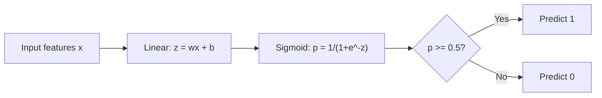
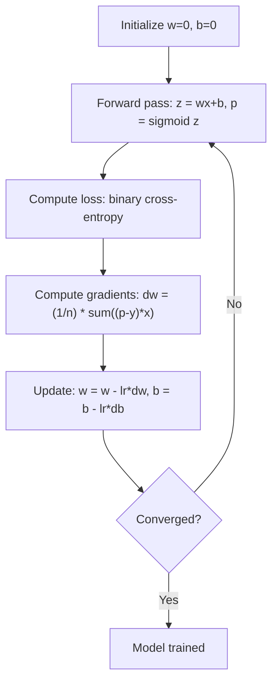

# Regresi Logistik

> Regresi logistik membengkokkan garis lurus menjadi kurva S untuk menjawab pertanyaan ya atau tidak dengan probabilitas.

**Type:** Build
**Language:** Python
**Prerequisites:** Phase 2 Lesson 1-2 (Apa Itu ML, Regresi Linier)
**Waktu:** ~90 menit

## Tujuan Pembelajaran

- Menerapkan regresi logistik dari awal menggunakan fungsi sigmoid dan loss entropi silang biner
- Menghitung dan menafsirkan presisi, perolehan, skor F1, dan matrix perplexity untuk klasifikasi biner
- Jelaskan mengapa MSE gagal untuk klasifikasi dan mengapa entropi silang biner menghasilkan permukaan biaya cembung
- Membangun model regresi softmax untuk klasifikasi kelas jamak dan mengevaluasi tradeoff penyetelan ambang batas

## Masalah

kamu ingin memprediksi apakah suatu tumor itu ganas atau jinak berdasarkan ukurannya. kamu mencoba regresi linier. Ini menghasilkan angka seperti 0,3 atau 1,7 atau -0,5. Apa maksudnya? Apakah 1,7 "sangat ganas"? Apakah -0,5 "sangat tidak berbahaya"? Regresi linier menghasilkan angka yang tidak terbatas. Klasifikasi memerlukan probabilitas terbatas antara 0 dan 1, dan keputusan yang jelas: ya atau tidak.

Regresi logistik memecahkan masalah ini. Dibutuhkan kombinasi linier yang sama (wx + b) dan meneruskannya melalui fungsi sigmoid, yang memasukkan bilangan apa pun ke dalam rentang (0, 1). Outputnya adalah sebuah probabilitas. kamu menetapkan ambang batas (biasanya 0,5) dan membuat keputusan.

Ini adalah salah satu algoritma yang paling banyak digunakan dalam praktiknya. Terlepas dari namanya, regresi logistik adalah algoritma klasifikasi, bukan algoritma regresi. Nama tersebut berasal dari fungsi logistik (sigmoid) yang digunakannya.

## Konsep

### Mengapa Regresi Linier Gagal Klasifikasi

Bayangkan memprediksi lulus/gagal (1/0) berdasarkan jam belajar. Regresi linier memasangkan garis pada data:

```
hours:  1   2   3   4   5   6   7   8   9   10
actual: 0   0   0   0   1   1   1   1   1   1
```

Kesesuaian linier mungkin menghasilkan prediksi seperti -0,2 pada jam 1 dan 1,3 pada jam 10. Nilai-nilai ini bukanlah probabilitas. Nilainya berada di bawah 0 dan di atas 1. Lebih buruk lagi, satu outlier (seseorang yang belajar selama 50 jam) akan menyeret seluruh garis, mengubah prediksi untuk semua orang.

Klasifikasi memerlukan fungsi yang:
- Nilai output antara 0 dan 1 (probabilitas)
- Menciptakan transisi yang tajam (batas keputusan)
- Tidak terdistorsi oleh outlier yang jauh dari batas

### Fungsi Sigmoid

Fungsi sigmoid melakukan hal ini:

```
sigmoid(z) = 1 / (1 + e^(-z))
```

Properti:
- Jika z besar dan positif, sigmoid(z) mendekati 1
- Jika z besar dan negatif, sigmoid(z) mendekati 0
- Jika z = 0, sigmoid(z) = 0,5
- Outputnya selalu antara 0 dan 1
- Fungsinya halus dan dapat dibedakan di mana saja

Turunannya memiliki bentuk yang mudah: sigmoid'(z) = sigmoid(z) * (1 - sigmoid(z)). Hal ini membuat komputasi gradient menjadi efisien.

### Regresi Logistik = Model Linier + Sigmoid

Model menghitung z = wx + b (sama seperti regresi linier), kemudian menerapkan sigmoid:



Output p diinterpretasikan sebagai P(y=1 | x), probabilitas bahwa input tersebut termasuk kelas 1. Batas keputusannya adalah di mana wx + b = 0, yang membuat output sigmoid tepat 0,5.

### Rugi Entropi Silang Biner

kamu tidak dapat menggunakan MSE untuk regresi logistik. UMK dengan sigmoid menciptakan permukaan biaya non-cembung dengan banyak minimum lokal. Sebagai gantinya, gunakan entropi silang biner (loss log):

```
Loss = -(1/n) * sum(y * log(p) + (1-y) * log(1-p))
```Mengapa ini berhasil:
- Jika y=1 dan p mendekati 1: log(1) = 0, maka loss mendekati 0 (benar, biaya rendah)
- Ketika y=1 dan p mendekati 0: log(0) mendekati negatif tak terhingga, sehingga loss sangat besar (salah, biaya tinggi)
- Ketika y=0 dan p mendekati 0: log(1) = 0, maka loss mendekati 0 (benar, biaya rendah)
- Ketika y=0 dan p mendekati 1: log(0) mendekati negatif tak terhingga, sehingga loss sangat besar (salah, biaya tinggi)

Loss function ini cembung untuk regresi logistik, menjamin minimum global tunggal.

### Penurunan Gradient untuk Regresi Logistik

Gradient untuk entropi silang biner dengan sigmoid memiliki bentuk yang bersih:

```
dL/dw = (1/n) * sum((p - y) * x)
dL/db = (1/n) * sum(p - y)
```

Ini terlihat identik dengan gradient regresi linier. Perbedaannya adalah p = sigmoid(wx + b) dan bukan p = wx + b. Sigmoid memperkenalkan nonlinier, namun aturan pembaruan gradient tetap sama.



### Batasan Keputusan

Untuk input 2D (dua feature), batas keputusannya adalah garis di mana:

```
w1*x1 + w2*x2 + b = 0
```

Poin di satu sisi diklasifikasikan sebagai 1, poin di sisi lain 0. Regresi logistik selalu menghasilkan batas keputusan linier. Jika kamu memerlukan batas lengkung, kamu dapat menambahkan feature polinomial atau menggunakan model nonlinier.

### Klasifikasi Multi-Kelas dengan Softmax

Regresi logistik biner menangani dua kelas. Untuk kelas k, gunakan fungsi softmax:

```
softmax(z_i) = e^(z_i) / sum(e^(z_j) for all j)
```

Setiap kelas mempunyai vector bobotnya masing-masing. Model menghitung skor z_i untuk setiap kelas, kemudian softmax mengubah skor menjadi probabilitas yang berjumlah 1. Kelas yang diprediksi adalah kelas dengan probabilitas tertinggi.

Loss function menjadi entropi silang kategoris:

```
Loss = -(1/n) * sum(sum(y_k * log(p_k)))
```

di mana y_k adalah 1 untuk kelas sebenarnya dan 0 untuk semua kelas lainnya (encoding one-hot).

### Metrik Evaluasi

Akurasi saja tidak cukup. Untuk dataset dengan 95% negatif dan 5% positif, model yang selalu memprediksi negatif mendapatkan akurasi 95% tetapi tidak berguna.

**Matrix Perplexity**:

| | Diprediksi Positif | Prediksi Negatif |
|---|---|---|
| Sebenarnya Positif | Benar Positif (TP) | Negatif Palsu (FN) |
| Sebenarnya Negatif | Positif Palsu (FP) | Negatif Benar (TN) |

**Presisi**: Dari semua prediksi positif, berapa banyak yang benar-benar positif?
```
Precision = TP / (TP + FP)
```

**Ingat** (Sensitivitas): Dari semua hal positif yang sebenarnya, berapa banyak yang berhasil kita tangkap?
```
Recall = TP / (TP + FN)
```

**Skor F1**: Rata-rata harmonik dari presisi dan perolehan. Menyeimbangkan kedua metrik.
```
F1 = 2 * (Precision * Recall) / (Precision + Recall)
```

Kapan harus memprioritaskan:
- **Presisi**: ketika positif palsu mahal (filter spam, kamu tidak ingin memblokir email yang sah)
- **Ingat**: ketika hasil negatif palsu mahal (skrining kanker, kamu tidak ingin melewatkan tumor)
- **F1**: saat kamu membutuhkan satu metrik seimbang

## Build

### Langkah 1: Fungsi sigmoid dan pembuatan data

```python
import random
import math

def sigmoid(z):
    z = max(-500, min(500, z))
    return 1.0 / (1.0 + math.exp(-z))


random.seed(42)
N = 200
X = []
y = []

for _ in range(N // 2):
    X.append([random.gauss(2, 1), random.gauss(2, 1)])
    y.append(0)

for _ in range(N // 2):
    X.append([random.gauss(5, 1), random.gauss(5, 1)])
    y.append(1)

combined = list(zip(X, y))
random.shuffle(combined)
X, y = zip(*combined)
X = list(X)
y = list(y)

print(f"Generated {N} samples (2 classes, 2 features)")
print(f"Class 0 center: (2, 2), Class 1 center: (5, 5)")
print(f"First 5 samples:")
for i in range(5):
    print(f"  Features: [{X[i][0]:.2f}, {X[i][1]:.2f}], Label: {y[i]}")
```

### Langkah 2: Regresi logistik dari awal

```python
class LogisticRegression:
    def __init__(self, n_features, learning_rate=0.01):
        self.weights = [0.0] * n_features
        self.bias = 0.0
        self.lr = learning_rate
        self.loss_history = []

    def predict_proba(self, x):
        z = sum(w * xi for w, xi in zip(self.weights, x)) + self.bias
        return sigmoid(z)

    def predict(self, x, threshold=0.5):
        return 1 if self.predict_proba(x) >= threshold else 0

    def compute_loss(self, X, y):
        n = len(y)
        total = 0.0
        for i in range(n):
            p = self.predict_proba(X[i])
            p = max(1e-15, min(1 - 1e-15, p))
            total += y[i] * math.log(p) + (1 - y[i]) * math.log(1 - p)
        return -total / n

    def fit(self, X, y, epochs=1000, print_every=200):
        n = len(y)
        n_features = len(X[0])
        for epoch in range(epochs):
            dw = [0.0] * n_features
            db = 0.0
            for i in range(n):
                p = self.predict_proba(X[i])
                error = p - y[i]
                for j in range(n_features):
                    dw[j] += error * X[i][j]
                db += error
            for j in range(n_features):
                self.weights[j] -= self.lr * (dw[j] / n)
            self.bias -= self.lr * (db / n)
            loss = self.compute_loss(X, y)
            self.loss_history.append(loss)
            if epoch % print_every == 0:
                print(f"  Epoch {epoch:4d} | Loss: {loss:.4f} | w: [{self.weights[0]:.3f}, {self.weights[1]:.3f}] | b: {self.bias:.3f}")
        return self

    def accuracy(self, X, y):
        correct = sum(1 for i in range(len(y)) if self.predict(X[i]) == y[i])
        return correct / len(y)


split = int(0.8 * N)
X_train, X_test = X[:split], X[split:]
y_train, y_test = y[:split], y[split:]

print("\n=== Training Logistic Regression ===")
model = LogisticRegression(n_features=2, learning_rate=0.1)
model.fit(X_train, y_train, epochs=1000, print_every=200)

print(f"\nTrain accuracy: {model.accuracy(X_train, y_train):.4f}")
print(f"Test accuracy:  {model.accuracy(X_test, y_test):.4f}")
print(f"Weights: [{model.weights[0]:.4f}, {model.weights[1]:.4f}]")
print(f"Bias: {model.bias:.4f}")
```

### Langkah 3: Matrix dan metrik perplexity dari awal

```python
class ClassificationMetrics:
    def __init__(self, y_true, y_pred):
        self.tp = sum(1 for t, p in zip(y_true, y_pred) if t == 1 and p == 1)
        self.tn = sum(1 for t, p in zip(y_true, y_pred) if t == 0 and p == 0)
        self.fp = sum(1 for t, p in zip(y_true, y_pred) if t == 0 and p == 1)
        self.fn = sum(1 for t, p in zip(y_true, y_pred) if t == 1 and p == 0)

    def accuracy(self):
        total = self.tp + self.tn + self.fp + self.fn
        return (self.tp + self.tn) / total if total > 0 else 0

    def precision(self):
        denom = self.tp + self.fp
        return self.tp / denom if denom > 0 else 0

    def recall(self):
        denom = self.tp + self.fn
        return self.tp / denom if denom > 0 else 0

    def f1(self):
        p = self.precision()
        r = self.recall()
        return 2 * p * r / (p + r) if (p + r) > 0 else 0

    def print_confusion_matrix(self):
        print(f"\n  Confusion Matrix:")
        print(f"                  Predicted")
        print(f"                  Pos   Neg")
        print(f"  Actual Pos     {self.tp:4d}  {self.fn:4d}")
        print(f"  Actual Neg     {self.fp:4d}  {self.tn:4d}")

    def print_report(self):
        self.print_confusion_matrix()
        print(f"\n  Accuracy:  {self.accuracy():.4f}")
        print(f"  Precision: {self.precision():.4f}")
        print(f"  Recall:    {self.recall():.4f}")
        print(f"  F1 Score:  {self.f1():.4f}")


y_pred_test = [model.predict(x) for x in X_test]
print("\n=== Classification Report (Test Set) ===")
metrics = ClassificationMetrics(y_test, y_pred_test)
metrics.print_report()
```

### Langkah 4: Analisis batasan keputusan

```python
print("\n=== Decision Boundary ===")
w1, w2 = model.weights
b = model.bias
print(f"Decision boundary: {w1:.4f}*x1 + {w2:.4f}*x2 + {b:.4f} = 0")
if abs(w2) > 1e-10:
    print(f"Solved for x2:     x2 = {-w1/w2:.4f}*x1 + {-b/w2:.4f}")

print("\nSample predictions near the boundary:")
test_points = [
    [3.0, 3.0],
    [3.5, 3.5],
    [4.0, 4.0],
    [2.5, 2.5],
    [5.0, 5.0],
]
for point in test_points:
    prob = model.predict_proba(point)
    pred = model.predict(point)
    print(f"  [{point[0]}, {point[1]}] -> prob={prob:.4f}, class={pred}")
```

### Langkah 5: Multi-kelas dengan softmax

```python
class SoftmaxRegression:
    def __init__(self, n_features, n_classes, learning_rate=0.01):
        self.n_features = n_features
        self.n_classes = n_classes
        self.lr = learning_rate
        self.weights = [[0.0] * n_features for _ in range(n_classes)]
        self.biases = [0.0] * n_classes

    def softmax(self, scores):
        max_score = max(scores)
        exp_scores = [math.exp(s - max_score) for s in scores]
        total = sum(exp_scores)
        return [e / total for e in exp_scores]

    def predict_proba(self, x):
        scores = [
            sum(self.weights[k][j] * x[j] for j in range(self.n_features)) + self.biases[k]
            for k in range(self.n_classes)
        ]
        return self.softmax(scores)

    def predict(self, x):
        probs = self.predict_proba(x)
        return probs.index(max(probs))

    def fit(self, X, y, epochs=1000, print_every=200):
        n = len(y)
        for epoch in range(epochs):
            grad_w = [[0.0] * self.n_features for _ in range(self.n_classes)]
            grad_b = [0.0] * self.n_classes
            total_loss = 0.0
            for i in range(n):
                probs = self.predict_proba(X[i])
                for k in range(self.n_classes):
                    target = 1.0 if y[i] == k else 0.0
                    error = probs[k] - target
                    for j in range(self.n_features):
                        grad_w[k][j] += error * X[i][j]
                    grad_b[k] += error
                true_prob = max(probs[y[i]], 1e-15)
                total_loss -= math.log(true_prob)
            for k in range(self.n_classes):
                for j in range(self.n_features):
                    self.weights[k][j] -= self.lr * (grad_w[k][j] / n)
                self.biases[k] -= self.lr * (grad_b[k] / n)
            if epoch % print_every == 0:
                print(f"  Epoch {epoch:4d} | Loss: {total_loss / n:.4f}")
        return self

    def accuracy(self, X, y):
        correct = sum(1 for i in range(len(y)) if self.predict(X[i]) == y[i])
        return correct / len(y)


random.seed(42)
X_3class = []
y_3class = []

centers = [(1, 1), (5, 1), (3, 5)]
for label, (cx, cy) in enumerate(centers):
    for _ in range(50):
        X_3class.append([random.gauss(cx, 0.8), random.gauss(cy, 0.8)])
        y_3class.append(label)

combined = list(zip(X_3class, y_3class))
random.shuffle(combined)
X_3class, y_3class = zip(*combined)
X_3class = list(X_3class)
y_3class = list(y_3class)

split_3 = int(0.8 * len(X_3class))
X_train_3 = X_3class[:split_3]
y_train_3 = y_3class[:split_3]
X_test_3 = X_3class[split_3:]
y_test_3 = y_3class[split_3:]

print("\n=== Multi-class Softmax Regression (3 classes) ===")
softmax_model = SoftmaxRegression(n_features=2, n_classes=3, learning_rate=0.1)
softmax_model.fit(X_train_3, y_train_3, epochs=1000, print_every=200)
print(f"\nTrain accuracy: {softmax_model.accuracy(X_train_3, y_train_3):.4f}")
print(f"Test accuracy:  {softmax_model.accuracy(X_test_3, y_test_3):.4f}")

print("\nSample predictions:")
for i in range(5):
    probs = softmax_model.predict_proba(X_test_3[i])
    pred = softmax_model.predict(X_test_3[i])
    print(f"  True: {y_test_3[i]}, Predicted: {pred}, Probs: [{', '.join(f'{p:.3f}' for p in probs)}]")
```

### Langkah 6: Penyetelan ambang batas

```python
print("\n=== Threshold Tuning ===")
print("Default threshold: 0.5. Adjusting the threshold trades precision for recall.\n")

thresholds = [0.3, 0.4, 0.5, 0.6, 0.7]
print(f"{'Threshold':>10} {'Accuracy':>10} {'Precision':>10} {'Recall':>10} {'F1':>10}")
print("-" * 52)

for t in thresholds:
    y_pred_t = [1 if model.predict_proba(x) >= t else 0 for x in X_test]
    m = ClassificationMetrics(y_test, y_pred_t)
    print(f"{t:>10.1f} {m.accuracy():>10.4f} {m.precision():>10.4f} {m.recall():>10.4f} {m.f1():>10.4f}")
```

## Pakai

Sekarang hal yang sama dengan scikit-learn.

```python
from sklearn.linear_model import LogisticRegression as SklearnLR
from sklearn.metrics import accuracy_score, precision_score, recall_score, f1_score
from sklearn.metrics import confusion_matrix, classification_report
from sklearn.model_selection import train_test_split
from sklearn.preprocessing import StandardScaler
import numpy as np

np.random.seed(42)
X_0 = np.random.randn(100, 2) + [2, 2]
X_1 = np.random.randn(100, 2) + [5, 5]
X_sk = np.vstack([X_0, X_1])
y_sk = np.array([0] * 100 + [1] * 100)

X_tr, X_te, y_tr, y_te = train_test_split(X_sk, y_sk, test_size=0.2, random_state=42)

scaler = StandardScaler()
X_tr_sc = scaler.fit_transform(X_tr)
X_te_sc = scaler.transform(X_te)

lr = SklearnLR()
lr.fit(X_tr_sc, y_tr)
y_pred = lr.predict(X_te_sc)

print("=== Scikit-learn Logistic Regression ===")
print(f"Accuracy:  {accuracy_score(y_te, y_pred):.4f}")
print(f"Precision: {precision_score(y_te, y_pred):.4f}")
print(f"Recall:    {recall_score(y_te, y_pred):.4f}")
print(f"F1:        {f1_score(y_te, y_pred):.4f}")
print(f"\nConfusion Matrix:\n{confusion_matrix(y_te, y_pred)}")
print(f"\nClassification Report:\n{classification_report(y_te, y_pred)}")
```

Penerapan kamu dari awal menghasilkan batasan dan metrik keputusan yang sama. Scikit-learn menambahkan opsi pemecah (liblinear, lbfgs, saga), regularisasi otomatis, strategi multi-kelas (satu lawan satu, multinomial), dan optimalisasi stabilitas numerik.

## Kirim

Lesson ini menghasilkan:
- `code/logistic_regression.py` - regresi logistik dari awal dengan metrik

## Latihan

1. Hasilkan dataset yang TIDAK dapat dipisahkan secara linier (misalnya, dua lingkaran konsentris). Latih regresi logistik dan amati kegagalannya. Kemudian tambahkan feature polinomial (x1^2, x2^2, x1*x2) dan latih lagi. Tunjukkan bahwa akurasinya meningkat.
2. Menerapkan matrix konfusi kelas jamak untuk model softmax 3 kelas. Hitung presisi dan perolehan per kelas. Kelas mana yang paling sulit untuk diklasifikasikan?
3. Buat kurva ROC dari awal. Untuk 100 nilai ambang batas dari 0 hingga 1, hitung tingkat positif sebenarnya dan tingkat positif palsu. Hitung AUC (luas di bawah kurva) menggunakan aturan trapesium.

## Istilah Kunci

| Istilah | Apa kata orang | Apa sebenarnya arti |
|------|----------------|----------------------|
| Regresi logistik | "Regresi untuk klasifikasi" | Model linier yang diikuti dengan fungsi sigmoid yang menghasilkan probabilitas kelas |
| Fungsi sigmoid | "Kurva S" | Fungsi 1/(1+e^(-z)) yang memetakan bilangan real apa pun ke rentang (0, 1) |
| Entropi silang biner | "Log loss" | Loss function -[y*log(p) + (1-y)*log(1-p)] yang sangat menghukum prediksi yang salah |
| Batas keputusan | "Garis pemisah" | Permukaan di mana probabilitas output model sama dengan 0,5, memisahkan kelas prediksi |
| Softmax | "Sigmoid multi-kelas" | Fungsi yang mengubah vector skor menjadi probabilitas yang berjumlah 1 |
| Presisi | "Berapa banyak yang dipilih yang relevan" | TP / (TP + FP), pecahan prediksi positif yang sebenarnya positif |
| Ingat | "Berapa banyak relevan yang dipilih" | TP / (TP + FN), pecahan positif aktual yang diidentifikasi model dengan benar |
| Skor F1 | "Akurasi yang seimbang" | Rata-rata harmonik presisi dan recall: 2*P*R / (P+R) |
| Matrix perplexity | "Perincian kesalahan" | Tabel yang menunjukkan jumlah TP, TN, FP, FN untuk setiap pasangan kelas |
| Ambang | "Pemotongan" | Nilai probabilitas di atas prediksi model kelas 1 (default 0,5, dapat disetel) |
| Pengkodean satu-panas | "Kolom biner untuk kategori" | Mewakili kelas k sebagai vector nol dengan 1 pada posisi k |
| Entropi silang kategoris | "Kehilangan log multi-kelas" | Perpanjangan entropi silang biner ke kelas k menggunakan label enkode one-hot |
