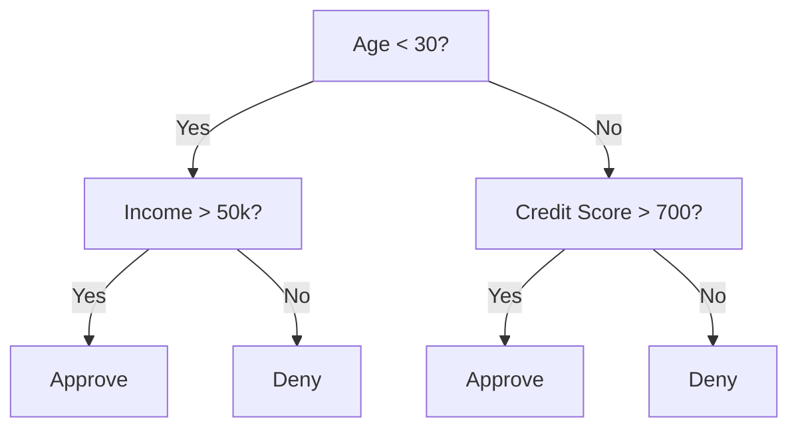
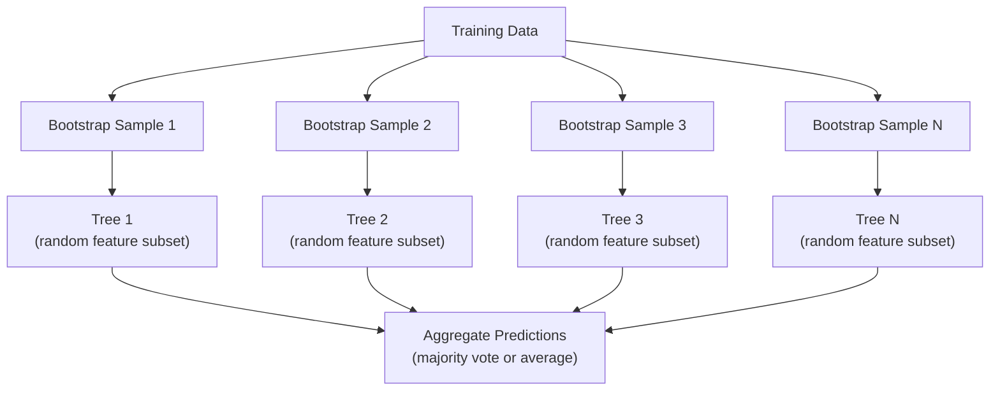

# Pohon Keputusan dan Hutan Acak

> Pohon keputusan hanyalah sebuah diagram alur. Namun kumpulan mereka adalah salah satu alat paling ampuh di ML.

**Type:** Build
**Language:** Python
**Prerequisites:** Fase 1 (Lesson 09 Teori Informasi, 06 Probabilitas)
**Waktu:** ~90 menit

## Tujuan Pembelajaran

- Menerapkan penghitungan pengotor Gini, entropi, dan perolehan informasi untuk menemukan pemisahan pohon keputusan yang optimal
- Buat pengklasifikasi pohon keputusan dari awal dengan kontrol pra-pemangkasan (kedalaman maksimal, sample minimal)
- Buat hutan acak menggunakan pengambilan sample bootstrap dan pengacakan feature, dan jelaskan mengapa hal ini mengurangi varians
- Bandingkan kepentingan feature MDI dengan kepentingan permutasi dan identifikasi kapan MDI bias

## Masalah

kamu memiliki data tabel. Baris adalah contoh, kolom adalah feature, dan ada kolom target yang ingin kamu prediksi. kamu bisa menggunakan neural network untuk itu. Namun untuk data tabular, model berbasis pohon (pohon keputusan, hutan acak, pohon yang ditingkatkan gradient) secara konsisten mengungguli pembelajaran mendalam. Kompetisi Kaggle pada data terstruktur didominasi oleh XGBoost dan LightGBM, bukan Transformer.

Mengapa? Pohon menangani tipe feature campuran (numerik dan kategorikal) tanpa preprocessing. Mereka menangani hubungan nonlinier tanpa rekayasa feature. Prediksi tersebut dapat ditafsirkan: kamu dapat melihat pohon tersebut dan mengetahui secara pasti mengapa prediksi tersebut dibuat. Dan hutan acak, yang memiliki rata-rata banyak pohon, sangat tahan terhadap overfitting pada dataset berukuran sedang.

Lesson ini membangun pohon keputusan dari awal menggunakan pemisahan rekursif, kemudian membangun hutan acak di atasnya. kamu akan menerapkan matematika di balik kriteria terpisah (pengotor Gini, entropi, perolehan informasi) dan memahami mengapa sekelompok pelajar yang lemah menjadi yang kuat.

## Konsep

### Fungsi pohon keputusan

Pohon keputusan mempartisi ruang feature menjadi wilayah persegi panjang dengan mengajukan serangkaian pertanyaan ya/tidak.



Setiap node internal menguji feature terhadap suatu ambang batas. Setiap node daun membuat prediksi. Untuk mengklasifikasikan titik data baru, kamu mulai dari akar dan mengikuti cabang hingga mencapai daun.

Pohon dibangun dari atas ke bawah dengan memilih, pada setiap node, feature dan ambang batas yang paling baik memisahkan data. "Terbaik" ditentukan oleh kriteria terpisah.

### Kriteria terpisah: mengukur pengotor

Di setiap node, kami memiliki satu set sample. Kami ingin membaginya sehingga node anak yang dihasilkan semurni mungkin, yang berarti setiap anak berisi sebagian besar satu kelas.

**Pengotor Gini** mengukur kemungkinan sample yang dipilih secara acak akan salah klasifikasi jika diberi label berdasarkan distribusi kelas pada node tersebut.

```
Gini(S) = 1 - sum(p_k^2)

where p_k is the proportion of class k in set S.
```

Untuk node murni (semua satu kelas), Gini = 0. Untuk pemisahan biner dengan kelas 50/50, Gini = 0,5. Lebih rendah lebih baik.

```
Example: 6 cats, 4 dogs

Gini = 1 - (0.6^2 + 0.4^2) = 1 - (0.36 + 0.16) = 0.48
```

**Entropi** mengukur konten informasi (gangguan) dalam sebuah node. Dicakup dalam Fase 1 Lesson 09.

```
Entropy(S) = -sum(p_k * log2(p_k))
```

Untuk node murni, entropi = 0. Untuk pemisahan biner 50/50, entropi = 1,0. Lebih rendah lebih baik.

```
Example: 6 cats, 4 dogs

Entropy = -(0.6 * log2(0.6) + 0.4 * log2(0.4))
        = -(0.6 * -0.737 + 0.4 * -1.322)
        = 0.442 + 0.529
        = 0.971 bits
```

**Perolehan informasi** adalah pengurangan ketidakmurnian (entropi atau Gini) setelah pemisahan.

```
IG(S, feature, threshold) = Impurity(S) - weighted_avg(Impurity(S_left), Impurity(S_right))

where the weights are the proportions of samples in each child.
```

Algoritme serakah di setiap node: coba setiap feature dan setiap ambang batas yang mungkin. Pilih pasangan (feature, ambang batas) yang memaksimalkan perolehan informasi.

### Cara kerja pemisahan

Untuk dataset dengan n feature dan m sample pada node saat ini:1. Untuk setiap feature j (j = 1 sampai n):
   - Urutkan sample berdasarkan feature j
   - Cobalah setiap titik tengah antara nilai-nilai berbeda yang berurutan sebagai ambang batas
   - Hitung perolehan informasi untuk setiap ambang batas
2. Pilih feature dan ambang batas dengan perolehan informasi tertinggi
3. Bagi data menjadi kiri (feature <= ambang batas) dan kanan (feature > ambang batas)
4. Berulang pada setiap anak

Pendekatan serakah ini tidak menjamin pohon yang optimal secara global. Menemukan pohon yang optimal adalah NP-hard. Namun pemisahan yang serakah berhasil dengan baik dalam praktiknya.

### Kondisi berhenti

Tanpa henti kondisinya, pohon itu tumbuh hingga setiap daunnya murni (satu sample per daun). Ini dengan sempurna mengingat training data dan menggeneralisasi dengan sangat buruk.

**Pra-pemangkasan** menghentikan pohon sebelum tumbuh sepenuhnya:
- Kedalaman maksimum: berhenti membelah saat pohon mencapai kedalaman yang ditentukan
- Sample minimum per daun: dihentikan jika suatu node memiliki kurang dari k sample
- Perolehan informasi minimum: berhenti jika pemisahan terbaik meningkatkan pengotor kurang dari ambang batas
- Node daun maksimum: membatasi jumlah total daun

**Pasca pemangkasan** menumbuhkan seluruh pohon, lalu memangkasnya kembali:
- Pemangkasan biaya-kompleksitas (digunakan oleh scikit-learn): menambahkan penalti sebanding dengan jumlah daun. Tingkatkan penalti untuk mendapatkan pohon yang lebih kecil
- Mengurangi kesalahan pemangkasan: menghapus subpohon jika kesalahan validasi tidak bertambah

Pra-pemangkasan lebih sederhana dan cepat. Pasca pemangkasan sering kali menghasilkan pohon yang lebih baik karena tidak menghentikan perpecahan sebelum waktunya yang mungkin akan menghasilkan perpecahan lebih lanjut yang berguna.

### Pohon keputusan untuk regresi

Untuk regresi, prediksi daun adalah rata-rata dari nilai target pada daun tersebut. Kriteria pemisahan juga berubah:

**Pengurangan varians** menggantikan perolehan informasi:

```
VR(S, feature, threshold) = Var(S) - weighted_avg(Var(S_left), Var(S_right))
```

Pilih pemisahan yang paling mengurangi varians. Pohon tersebut mempartisi ruang input menjadi beberapa wilayah, dan memprediksi konstanta (rata-rata) di setiap wilayah.

### Hutan acak: kekuatan ansambel

Pohon keputusan tunggal memiliki variansi yang tinggi. Perubahan kecil pada data dapat menghasilkan pohon yang sangat berbeda. Hutan acak memperbaikinya dengan membuat rata-rata banyak pohon.



Ada dua sumber keacakan yang membuat pepohonan menjadi beragam:

**Bagging (agregasi bootstrap):** Setiap pohon dilatih pada sample bootstrap, sample acak dengan penggantian dari training data. Sekitar 63% sample asli muncul di setiap bootstrap (sisanya adalah sample siap pakai yang dapat digunakan untuk validasi).

**Pengacakan feature:** Pada setiap pemisahan, hanya subset feature acak yang dipertimbangkan. Untuk klasifikasi, defaultnya adalah sqrt(n_features). Untuk regresi, n_features/3. Hal ini mencegah semua pohon membelah pada ciri dominan yang sama.

Wawasan utamanya: merata-ratakan banyak pohon yang memiliki dekorasi akan mengurangi varians tanpa meningkatkan bias. Setiap pohon mungkin biasa-biasa saja. Ansambelnya kuat.

### Pentingnya feature

Hutan acak secara alami memberikan skor kepentingan feature. Metode yang paling umum:

**Mean Penurunan Pengotor (MDI):** Untuk setiap feature, jumlahkan total pengurangan pengotor di semua pohon dan semua node tempat feature tersebut digunakan. Feature yang menghasilkan pengurangan pengotor lebih besar pada pemisahan sebelumnya adalah lebih penting.

```
importance(feature_j) = sum over all nodes where feature_j is used:
    (n_samples_at_node / n_total_samples) * impurity_decrease
```

Ini cepat (dihitung selama training) tetapi bias terhadap feature berkardinalitas tinggi dan feature dengan banyak kemungkinan titik pisah.

**Kepentingan permutasi** adalah alternatifnya: mengacak nilai satu feature dan mengukur seberapa besar penurunan akurasi model. Lebih dapat diandalkan tetapi lebih lambat.### Saat pohon mengalahkan neural network

Pepohonan dan hutan mendominasi neural network pada data tabular. Beberapa alasan:

| Faktor | Pohon | Jaringan saraf |
|--------|-------|----------------|
| Tipe campuran (numerik + kategorikal) | Dukungan asli | Perlu pengkodean |
| Dataset kecil (<10 ribu baris) | Bekerja dengan baik | Pakaian |
| Interaksi feature | Ditemukan dengan memisahkan | Butuh desain arsitektur |
| Interpretasi | Transparansi penuh | Kotak hitam |
| Waktu training | Menit | Jam |
| Sensitivitas hiperparameter | Rendah | Tinggi |

Jaringan saraf menang ketika datanya memiliki struktur spasial atau berurutan (gambar, teks, audio). Untuk tabel feature datar, pohon adalah defaultnya.

## Build

### Langkah 1: Gini pengotor dan entropi

Build kedua kriteria pemisahan dari awal dan verifikasi bahwa keduanya sepakat mengenai pemisahan mana yang baik.

```python
import math

def gini_impurity(labels):
    n = len(labels)
    if n == 0:
        return 0.0
    counts = {}
    for label in labels:
        counts[label] = counts.get(label, 0) + 1
    return 1.0 - sum((c / n) ** 2 for c in counts.values())

def entropy(labels):
    n = len(labels)
    if n == 0:
        return 0.0
    counts = {}
    for label in labels:
        counts[label] = counts.get(label, 0) + 1
    return -sum(
        (c / n) * math.log2(c / n) for c in counts.values() if c > 0
    )
```

### Langkah 2: Temukan pemisahan terbaik

Coba setiap feature dan setiap ambang batas. Kembalikan yang memiliki perolehan informasi tertinggi.

```python
def information_gain(parent_labels, left_labels, right_labels, criterion="gini"):
    measure = gini_impurity if criterion == "gini" else entropy
    n = len(parent_labels)
    n_left = len(left_labels)
    n_right = len(right_labels)
    if n_left == 0 or n_right == 0:
        return 0.0
    parent_impurity = measure(parent_labels)
    child_impurity = (
        (n_left / n) * measure(left_labels) +
        (n_right / n) * measure(right_labels)
    )
    return parent_impurity - child_impurity
```

### Langkah 3: Build kelas DecisionTree

Pemisahan rekursif, prediksi, dan pelacakan kepentingan feature.

```python
class DecisionTree:
    def __init__(self, max_depth=None, min_samples_split=2,
                 min_samples_leaf=1, criterion="gini",
                 max_features=None):
        self.max_depth = max_depth
        self.min_samples_split = min_samples_split
        self.min_samples_leaf = min_samples_leaf
        self.criterion = criterion
        self.max_features = max_features
        self.tree = None
        self.feature_importances_ = None

    def fit(self, X, y):
        self.n_features = len(X[0])
        self.feature_importances_ = [0.0] * self.n_features
        self.n_samples = len(X)
        self.tree = self._build(X, y, depth=0)
        total = sum(self.feature_importances_)
        if total > 0:
            self.feature_importances_ = [
                fi / total for fi in self.feature_importances_
            ]

    def predict(self, X):
        return [self._predict_one(x, self.tree) for x in X]
```

### Langkah 4: Build kelas RandomForest

Pengambilan sample bootstrap, pengacakan feature, dan pemungutan suara mayoritas.

```python
class RandomForest:
    def __init__(self, n_trees=100, max_depth=None,
                 min_samples_split=2, max_features="sqrt",
                 criterion="gini"):
        self.n_trees = n_trees
        self.max_depth = max_depth
        self.min_samples_split = min_samples_split
        self.max_features = max_features
        self.criterion = criterion
        self.trees = []

    def fit(self, X, y):
        n = len(X)
        for _ in range(self.n_trees):
            indices = [random.randint(0, n - 1) for _ in range(n)]
            X_boot = [X[i] for i in indices]
            y_boot = [y[i] for i in indices]
            tree = DecisionTree(
                max_depth=self.max_depth,
                min_samples_split=self.min_samples_split,
                max_features=self.max_features,
                criterion=self.criterion,
            )
            tree.fit(X_boot, y_boot)
            self.trees.append(tree)

    def predict(self, X):
        all_preds = [tree.predict(X) for tree in self.trees]
        predictions = []
        for i in range(len(X)):
            votes = {}
            for preds in all_preds:
                v = preds[i]
                votes[v] = votes.get(v, 0) + 1
            predictions.append(max(votes, key=votes.get))
        return predictions
```

Lihat `code/trees.py` untuk implementasi lengkap dengan semua metode pembantu.

## Pakai

Dengan scikit-learn, melatih hutan acak terdiri dari tiga baris:

```python
from sklearn.ensemble import RandomForestClassifier
from sklearn.datasets import load_iris
from sklearn.model_selection import train_test_split

X, y = load_iris(return_X_y=True)
X_train, X_test, y_train, y_test = train_test_split(X, y, random_state=42)

rf = RandomForestClassifier(n_estimators=100, random_state=42)
rf.fit(X_train, y_train)
print(f"Accuracy: {rf.score(X_test, y_test):.4f}")
print(f"Feature importances: {rf.feature_importances_}")
```

Dalam praktiknya, pohon yang ditingkatkan gradient (XGBoost, LightGBM, CatBoost) seringkali lebih kuat daripada hutan acak karena pohon tersebut dibangun secara berurutan, dengan setiap pohon memperbaiki kesalahan pohon sebelumnya. Namun hutan acak lebih sulit untuk disalahkonfigurasi dan hampir tidak memerlukan penyesuaian hyperparameter.

## Kirim

Lesson ini menghasilkan `outputs/prompt-tree-interpreter.md` -- sebuah prompt yang menafsirkan pemisahan pohon keputusan untuk pemangku kepentingan bisnis. Berikan struktur pohon yang terlatih (kedalaman, feature, ambang batas terpisah, akurasi) dan ini akan menerjemahkan model ke dalam aturan bahasa sederhana, memberi peringkat pada kepentingan feature, menandai overfitting atau kebocoran, dan merekomendasikan langkah selanjutnya. Gunakan kapan saja kamu perlu menjelaskan model berbasis pohon kepada seseorang yang tidak membaca code.

## Latihan

1. Latih pohon keputusan tunggal pada dataset 2D dengan 3 kelas. Telusuri pemisahan secara manual dan gambarkan batas keputusan berbentuk persegi panjang. Bandingkan batas pada max_kedalaman=2 vs max_kedalaman=10.

2. Menerapkan pemisahan reduksi varians untuk pohon regresi. Hasilkan y = sin(x) + noise untuk 200 poin dan sesuaikan pohon regresi kamu. Plot prediksi konstanta sepotong-sepotong dari pohon terhadap kurva sebenarnya.

3. Build hutan acak dengan 1, 5, 10, 50, dan 200 pohon. Akurasi training plot dan akurasi pengujian vs jumlah pohon. Amati bahwa akurasi pengujian tidak berubah tetapi tidak menurun (hutan menolak overfitting).

4. Bandingkan pengotor Gini vs entropi sebagai kriteria terpisah pada 5 dataset berbeda. Ukur akurasi dan kedalaman pohon. Dalam kebanyakan kasus, mereka menghasilkan hasil yang hampir sama. Jelaskan alasannya.

5. Menerapkan pentingnya permutasi. Bandingkan dengan kepentingan MDI pada dataset yang salah satu fiturnya berupa gangguan acak tetapi memiliki kardinalitas tinggi. MDI akan memberi peringkat tinggi pada feature kebisingan. Pentingnya permutasi tidak akan.

## Istilah Kunci| Istilah | Apa kata orang | Apa sebenarnya arti |
|------|----------------|----------------------|
| Pohon keputusan | "Diagram alur untuk prediksi" | Model yang mempartisi ruang feature menjadi wilayah persegi panjang dengan mempelajari urutan pembagian if/else |
| Gini pengotor | "Betapa tercampurnya simpul itu" | Kemungkinan kesalahan klasifikasi sample acak pada sebuah node. 0 = murni, 0,5 = pengotor maksimum untuk biner |
| Entropi | "Gangguan pada sebuah simpul" | Konten informasi pada sebuah node. 0 = murni, 1,0 = ketidakpastian maksimum untuk biner. Dari teori informasi |
| Perolehan informasi | "Betapa bagusnya perpecahan" | Pengurangan pengotor setelah perpecahan. Kriteria serakah dalam memilih split |
| Pra-pemangkasan | "Hentikan pohon itu lebih awal" | Menghentikan pertumbuhan pohon lebih awal dengan menetapkan kedalaman maksimum, sample minimum, atau ambang batas perolehan minimum |
| Pasca pemangkasan | "Pangkas pohon setelahnya" | Menumbuhkan seluruh pohon, lalu menghapus subpohon yang tidak meningkatkan kinerja validasi |
| mengantongi | "Latihlah pada himpunan bagian acak" | Agregasi bootstrap. Latih setiap model pada sample acak yang berbeda dengan penggantian |
| Hutan acak | "Sekelompok pohon" | Kumpulan pohon keputusan, masing-masing dilatih pada sample bootstrap dengan subset feature acak di setiap pemisahan |
| Pentingnya feature (MDI) | "Feature mana yang penting" | Penurunan total pengotor yang disumbangkan oleh setiap feature, dijumlahkan di seluruh pohon dan node |
| Pentingnya permutasi | "Acak dan periksa" | Akurasi turun ketika nilai feature diacak secara acak. Lebih andal dibandingkan MDI untuk feature bising |
| Pengurangan varians | "Versi regresi perolehan informasi" | Analog pohon regresi perolehan informasi. Memilih pemisahan yang paling mengurangi varians target |
| Contoh bootstrap | "Sample acak dengan pengulangan" | Sample acak diambil dengan penggantian dari dataset asli. Ukurannya sama, tetapi dengan duplikat |

## Bacaan Lanjutan

- [Breiman: Random Forests (2001)](https://link.springer.com/article/10.1023/A:1010933404324) - makalah hutan acak asli
- [Grinsztajn dkk.: Mengapa model berbasis pohon masih mengungguli pembelajaran mendalam pada data tabular? (2022)](https://arxiv.org/abs/2207.08815) - perbandingan cermat antara pohon vs neural network pada tugas tabel
- [dokumentasi Scikit-learn Decision Trees](https://scikit-learn.org/stable/modules/tree.html) - panduan praktis dengan alat visualisasi
- [XGBoost: A Scalable Tree Boosting System (Chen & Guestrin, 2016)](https://arxiv.org/abs/1603.02754) - kertas peningkat gradient yang mendominasi Kaggle
