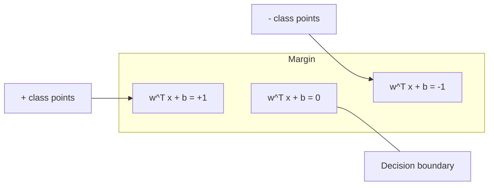
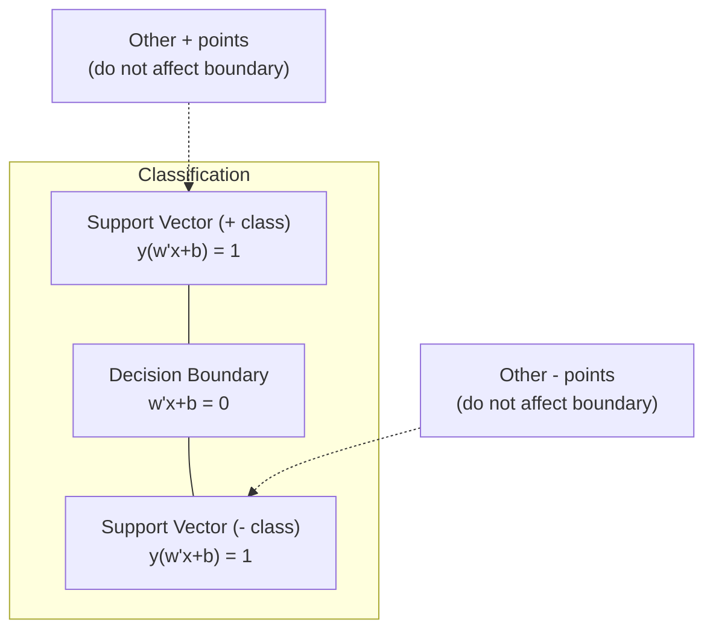
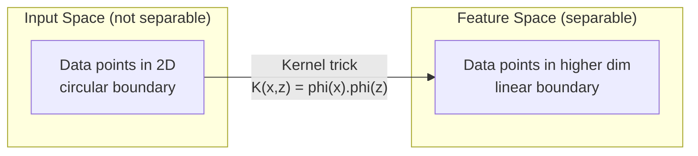

# Mendukung Mesin Vector

> Temukan jalan terluas antara dua kelas. Itulah keseluruhan gagasannya.

**Type:** Build
**Language:** Python
**Prerequisites:** Fase 1 (Lesson 08 Optimization, 14 Norm dan Distance, 18 Optimization Cembung)
**Waktu:** ~90 menit

## Tujuan Pembelajaran

- Menerapkan SVM linier dari awal menggunakan hilangnya engsel dan gradient descent pada formulasi primal
- Menjelaskan prinsip margin maksimum dan mengidentifikasi vector dukungan dari model terlatih
- Bandingkan kernel linier, polinomial, dan RBF dan jelaskan bagaimana trik kernel menghindari pemetaan high-dimensional yang eksplisit
- Evaluasi tradeoff yang dikontrol oleh parameter C antara lebar margin dan kesalahan klasifikasi

## Masalah

kamu memiliki dua kelas titik data dan perlu menggambar garis (atau hyperplane) yang memisahkannya. Banyak sekali jalur yang bisa berfungsi. Yang mana yang harus kamu pilih?

Yang memiliki margin terbesar. Margin adalah distance antara batas keputusan dan titik data terdekat di setiap sisi. Margin yang lebih lebar berarti pengklasifikasi lebih percaya diri dan menggeneralisasi data yang tidak terlihat dengan lebih baik.

Intuisi ini mengarah pada Support Vector Machines, salah satu algoritme paling elegan secara matematis di ML. SVM adalah metode klasifikasi yang dominan sebelum pembelajaran mendalam dan tetap menjadi pilihan terbaik untuk dataset kecil, data berdimensi tinggi, dan masalah yang membutuhkan model yang berprinsip dan dipahami dengan baik serta jaminan teoretis.

SVM terhubung langsung ke Fase 1: optimization-nya cembung (Lesson 18), margin diukur dengan norm (Lesson 14), dan trik kernel mengeksploitasi produk titik untuk menangani batas nonlinier tanpa pernah melakukan komputasi dalam ruang berdimensi tinggi.

## Konsep

### Pengklasifikasi margin maksimum

Mengingat data yang dapat dipisahkan secara linier dengan label y_i di {-1, +1} dan vector feature x_i, kita menginginkan hyperplane w^T x + b = 0 yang memisahkan kelas-kelas.

Distance titik x_i ke hyperplane adalah:

```
distance = |w^T x_i + b| / ||w||
```

Untuk titik yang diklasifikasikan dengan benar: y_i * (w^T x_i + b) > 0. Marginnya adalah dua kali distance dari hyperplane ke titik terdekat di kedua sisi.



Masalah optimization:

```
maximize    2 / ||w||     (the margin width)
subject to  y_i * (w^T x_i + b) >= 1  for all i
```

Setara (meminimalkan ||w||^2 lebih mudah untuk dioptimalkan):

```
minimize    (1/2) ||w||^2
subject to  y_i * (w^T x_i + b) >= 1  for all i
```

Ini adalah program kuadrat cembung. Ia memiliki solusi global yang unik. Titik data yang berada tepat pada batas margin (di mana y_i * (w^T x_i + b) = 1) adalah vector pendukung. Merekalah satu-satunya poin yang menentukan batasan keputusan. Memindahkan atau menghapus titik non-dukungan-vector, dan batasnya tidak berubah.

### Vector pendukung: beberapa yang kritis



Kebanyakan poin training tidak relevan. Hanya vector pendukung yang penting. Inilah sebabnya mengapa SVM hemat memori pada waktu prediksi: kamu hanya perlu menyimpan vector dukungan, bukan seluruh set training.

Jumlah vector pendukung juga memberikan batasan pada kesalahan generalisasi. Lebih sedikit vector dukungan dibandingkan dengan ukuran dataset berarti generalisasi yang lebih baik.

### Soft margin: menangani noise dengan parameter C

Data nyata jarang sekali dapat dipisahkan secara sempurna. Beberapa titik mungkin berada di sisi yang salah dari batas, atau di dalam margin. Formulasi soft margin memungkinkan pelanggaran dengan memperkenalkan variabel slack.

```
minimize    (1/2) ||w||^2 + C * sum(xi_i)
subject to  y_i * (w^T x_i + b) >= 1 - xi_i
            xi_i >= 0  for all i
```

Variabel slack xi_i mengukur seberapa banyak poin i yang melanggar margin. C mengontrol trade-off:| nilai C | Perilaku |
|---------|----------|
| C besar | Menghukum pelanggaran dengan berat. Margin sempit, kesalahan klasifikasi lebih sedikit. Pakaian |
| C kecil | Memungkinkan lebih banyak pelanggaran. Margin lebar, lebih banyak kesalahan klasifikasi. Pakaian dalam |

C adalah kekuatan regularisasi, terbalik. C besar = lebih sedikit regularisasi. C kecil = lebih banyak regularisasi.

### Loss engsel: loss function SVM

SVM margin lunak dapat ditulis ulang sebagai optimization tanpa batasan:

```
minimize    (1/2) ||w||^2 + C * sum(max(0, 1 - y_i * (w^T x_i + b)))
```

Suku max(0, 1 - y_i * f(x_i)) adalah loss engsel. Nilainya nol bila titik tersebut diklasifikasikan dengan benar dan melampaui margin. Bersifat linier jika titiknya berada di dalam margin atau salah klasifikasi.

```
Hinge loss for a single point:

loss
  |
  | \
  |  \
  |   \
  |    \
  |     \_______________
  |
  +-----|-----|-------->  y * f(x)
       0     1

Zero loss when y*f(x) >= 1 (correctly classified, outside margin).
Linear penalty when y*f(x) < 1.
```

Bandingkan dengan loss logistik (regresi logistik):

```
Hinge:     max(0, 1 - y*f(x))          Hard cutoff at margin
Logistic:  log(1 + exp(-y*f(x)))        Smooth, never exactly zero
```

Loss engsel menghasilkan solusi yang jarang (hanya vector pendukung yang memiliki kontribusi bukan nol). Kehilangan logistik menggunakan semua titik data. Hal ini membuat SVM lebih hemat memori pada waktu prediksi.

### Melatih SVM linier dengan gradient descent

kamu dapat melatih SVM linier menggunakan gradient descent pada kehilangan engsel ditambah regularisasi L2, tanpa menyelesaikan QP yang dibatasi:

```
L(w, b) = (lambda/2) * ||w||^2 + (1/n) * sum(max(0, 1 - y_i * (w^T x_i + b)))

Gradient with respect to w:
  If y_i * (w^T x_i + b) >= 1:  dL/dw = lambda * w
  If y_i * (w^T x_i + b) < 1:   dL/dw = lambda * w - y_i * x_i

Gradient with respect to b:
  If y_i * (w^T x_i + b) >= 1:  dL/db = 0
  If y_i * (w^T x_i + b) < 1:   dL/db = -y_i
```

Ini disebut formulasi primal. Ini berjalan dalam O(n * d) per zaman, di mana n adalah jumlah sample dan d adalah jumlah feature. Untuk data yang besar, jarang, dan berdimensi tinggi (klasifikasi teks), ini dilakukan dengan cepat.

### Formulasi ganda dan trik kernel

Masalah SVM ganda Lagrangian (dari Fase 1 Lesson 18, kondisi KKT) adalah:

```
maximize    sum(alpha_i) - (1/2) * sum_ij(alpha_i * alpha_j * y_i * y_j * (x_i . x_j))
subject to  0 <= alpha_i <= C
            sum(alpha_i * y_i) = 0
```

Dualnya hanya melibatkan produk titik x_i . x_j antar titik data. Inilah wawasan utamanya. Ganti setiap perkalian titik dengan kernel function K(x_i, x_j) dan SVM dapat mempelajari batasan nonlinier tanpa perlu menghitung transformasi secara eksplisit.

```
Linear kernel:      K(x, z) = x . z
Polynomial kernel:  K(x, z) = (x . z + c)^d
RBF (Gaussian):     K(x, z) = exp(-gamma * ||x - z||^2)
```

Kernel RBF memetakan data ke dalam ruang berdimensi tak terbatas. Titik-titik yang berdekatan dalam ruang input memiliki nilai kernel yang mendekati 1. Titik-titik yang berjauhan memiliki nilai kernel yang mendekati 0. Titik tersebut dapat mempelajari batasan keputusan yang mulus.



Trik kernel menghitung perkalian titik dalam ruang berdimensi tinggi tanpa harus pergi ke sana. Untuk kernel polinomial derajat d dalam dimension D, ruang feature eksplisit memiliki dimension O(D^d). Tapi K(x, z) dihitung dalam waktu O(D).

### SVM untuk regresi (SVR)

Regresi Vector Dukungan menyesuaikan tabung epsilon lebar di sekitar data. Titik-titik di dalam tabung tidak mempunyai loss. Titik di luar tabung diberi penalti secara linier.

```
minimize    (1/2) ||w||^2 + C * sum(xi_i + xi_i*)
subject to  y_i - (w^T x_i + b) <= epsilon + xi_i
            (w^T x_i + b) - y_i <= epsilon + xi_i*
            xi_i, xi_i* >= 0
```

Parameter epsilon mengontrol lebar tabung. Tabung yang lebih lebar = lebih sedikit vector pendukung = pemasangan yang lebih mulus. Tabung yang lebih sempit = lebih banyak vector pendukung = pemasangan yang lebih ketat.

### Mengapa SVM kalah dalam pembelajaran mendalam (dan kapan mereka masih menang)

SVM mendominasi ML dari akhir tahun 1990an hingga awal tahun 2010an. Pembelajaran mendalam melampaui mereka karena beberapa alasan:

| Faktor | SVM | Pembelajaran mendalam |
|--------|------|---------------|
| Rekayasa feature | Membutuhkannya | Feature pembelajaran |
| Skalabilitas | O(n^2) hingga O(n^3) untuk kernel | O(n) per zaman dengan SGD |
| Gambar/teks/audio | Membutuhkan feature buatan tangan | Belajar dari data mentah |
| Dataset besar (>100k) | Lambat | Skala dengan baik |
| Akselerasi GPU | Manfaat terbatas | Percepatan besar-besaran |SVM masih menang dalam situasi berikut:
- Dataset kecil (ratusan hingga ribuan sample)
- Data renggang berdimensi tinggi (teks dengan feature TF-IDF)
- Saat kamu membutuhkan jaminan matematis (batas margin)
- Ketika waktu training harus minimal (SVM linier sangat cepat)
- Klasifikasi biner dengan struktur margin yang jelas
- Deteksi anomali (SVM satu kelas)

## Build

### Langkah 1: Hilangnya engsel dan gradient

Yayasan. Hitung loss engsel untuk suatu batch dan gradiennya.

```python
def hinge_loss(X, y, w, b):
    n = len(X)
    total_loss = 0.0
    for i in range(n):
        margin = y[i] * (dot(w, X[i]) + b)
        total_loss += max(0.0, 1.0 - margin)
    return total_loss / n
```

### Langkah 2: SVM linier melalui gradient descent

Berlatihlah dengan meminimalkan kehilangan engsel secara teratur. Tidak diperlukan pemecah QP.

```python
class LinearSVM:
    def __init__(self, lr=0.001, lambda_param=0.01, n_epochs=1000):
        self.lr = lr
        self.lambda_param = lambda_param
        self.n_epochs = n_epochs
        self.w = None
        self.b = 0.0

    def fit(self, X, y):
        n_features = len(X[0])
        self.w = [0.0] * n_features
        self.b = 0.0

        for epoch in range(self.n_epochs):
            for i in range(len(X)):
                margin = y[i] * (dot(self.w, X[i]) + self.b)
                if margin >= 1:
                    self.w = [wj - self.lr * self.lambda_param * wj
                              for wj in self.w]
                else:
                    self.w = [wj - self.lr * (self.lambda_param * wj - y[i] * X[i][j])
                              for j, wj in enumerate(self.w)]
                    self.b -= self.lr * (-y[i])

    def predict(self, X):
        return [1 if dot(self.w, x) + self.b >= 0 else -1 for x in X]
```

### Langkah 3: Kernel function

Menerapkan kernel linier, polinomial, dan RBF.

```python
def linear_kernel(x, z):
    return dot(x, z)

def polynomial_kernel(x, z, degree=3, c=1.0):
    return (dot(x, z) + c) ** degree

def rbf_kernel(x, z, gamma=0.5):
    diff = [xi - zi for xi, zi in zip(x, z)]
    return math.exp(-gamma * dot(diff, diff))
```

### Langkah 4: Identifikasi vector margin dan dukungan

Setelah training, identifikasi titik mana yang merupakan vector pendukung dan hitung lebar margin.

```python
def find_support_vectors(X, y, w, b, tol=1e-3):
    support_vectors = []
    for i in range(len(X)):
        margin = y[i] * (dot(w, X[i]) + b)
        if abs(margin - 1.0) < tol:
            support_vectors.append(i)
    return support_vectors
```

Lihat `code/svm.py` untuk implementasi lengkap dengan semua demo.

## Pakai

Dengan scikit-belajar:

```python
from sklearn.svm import SVC, LinearSVC, SVR
from sklearn.preprocessing import StandardScaler
from sklearn.pipeline import Pipeline

clf = Pipeline([
    ("scaler", StandardScaler()),
    ("svm", SVC(kernel="rbf", C=1.0, gamma="scale")),
])
clf.fit(X_train, y_train)
print(f"Accuracy: {clf.score(X_test, y_test):.4f}")
print(f"Support vectors: {clf['svm'].n_support_}")
```

Penting: selalu skalakan feature kamu sebelum melatih SVM. SVM sensitif terhadap besaran feature karena marginnya bergantung pada ||w||, dan feature yang tidak berskala akan mendistorsi geometri.

Untuk dataset besar, gunakan `LinearSVC` (formulasi primal, O(n) per epoch) alih-alih `SVC` (formulasi ganda, O(n^2) hingga O(n^3)):

```python
from sklearn.svm import LinearSVC

clf = Pipeline([
    ("scaler", StandardScaler()),
    ("svm", LinearSVC(C=1.0, max_iter=10000)),
])
```

## Latihan

1. Hasilkan dataset 2D yang dapat dipisahkan secara linier. Latih LinearSVM kamu dan identifikasi vector dukungan. Verifikasi bahwa vector pendukung adalah titik yang paling dekat dengan batas keputusan.

2. Variasikan C dari 0,001 hingga 1000 pada dataset yang berisik. Plot batas keputusan untuk setiap nilai C. Amati transisi dari margin lebar (underfitting) ke margin sempit (overfitting).

3. Buat dataset yang batas kelasnya berbentuk lingkaran (bukan linier). Tunjukkan bahwa SVM linier gagal. Hitung kernel matrix RBF dan tunjukkan bahwa kelas-kelas tersebut dapat dipisahkan dalam ruang feature yang diinduksi kernel.

4. Bandingkan loss engsel vs loss logistik pada dataset yang sama. Latih SVM linier dan regresi logistik. Hitung berapa banyak poin training yang berkontribusi pada batasan keputusan setiap model (vector pendukung vs semua poin).

5. Menerapkan SVR (epsilon-insensitive loss). Sesuaikan dengan y = sin(x) + noise. Plot tabung epsilon di sekitar prediksi dan sorot vector pendukung (titik di luar tabung).

## Istilah Kunci| Istilah | Apa sebenarnya arti |
|------|----------------------|
| Vector pendukung | Titik training paling dekat dengan batas keputusan. Satu-satunya titik yang menentukan hyperplane |
| Margin | Distance antara batas keputusan dan vector pendukung terdekat. SVM memaksimalkan |
| Kehilangan engsel | maks(0, 1 - y*f(x)). Nol jika diklasifikasikan dengan benar dan berada di luar margin. Hukuman linier sebaliknya |
| parameter C | Pertukaran antara lebar margin dan kesalahan klasifikasi. C besar = margin sempit, C kecil = margin lebar |
| Margin lunak | Formulasi SVM yang memungkinkan pelanggaran margin melalui variabel slack. Menangani data yang tidak dapat dipisahkan |
| Trik kernel | Menghitung perkalian titik dalam ruang feature berdimensi tinggi tanpa memetakan secara eksplisit ke ruang tersebut |
| Kernel linier | K(x, z) = x . z. Setara dengan perkalian titik standar. Untuk data yang dapat dipisahkan secara linier |
| Kernel RBF | K(x, z) = exp(-gamma * \|\|x-z\|\|^2). Memetakan ke dimension tak terbatas. Mempelajari batas halus apa pun |
| Kernel polinomial | K(x, z) = (x .z + c)^d. Memetakan ruang feature kombinasi polinomial |
| Formulasi ganda | Perumusan ulang masalah SVM yang hanya bergantung pada perkalian titik antar titik data. Mengaktifkan kernel |
| SVR | Mendukung Regresi Vector. Cocok dengan tabung epsilon di sekitar data. Titik-titik di dalam tabung tidak mempunyai rugi-rugi |
| Variabel kendur | xi_i: mengukur seberapa besar suatu titik melanggar margin. Nol untuk poin yang diklasifikasikan dengan benar di luar margin |
| Margin maksimum | Prinsip pemilihan hyperplane yang memaksimalkan distance ke titik terdekat setiap kelas |

## Bacaan Lanjutan

- [Vapnik: Sifat Teori Pembelajaran Statistik (1995)](https://link.springer.com/book/10.1007/978-1-4757-3264-1) - teks dasar tentang SVM dan pembelajaran statistik
- [Cortes & Vapnik: Jaringan vector dukungan (1995)](https://link.springer.com/article/10.1007/BF00994018) - makalah SVM asli
- [Platt: Sequential Minimal Optimization (1998)](https://www.microsoft.com/en-us/research/publication/sequential-minimal-optimization-a-fast-algorithm-for-training-support-vector-machines/) - algoritma SMO yang menjadikan training SVM praktis
- [dokumentasi SVM scikit-learn](https://scikit-learn.org/stable/modules/svm.html) - panduan praktis dengan detail implementasi
- [LIBSVM: Perpustakaan untuk Mesin Vector Dukungan](https://www.csie.ntu.edu.tw/~cjlin/libsvm/) - perpustakaan C++ di balik sebagian besar implementasi SVM
