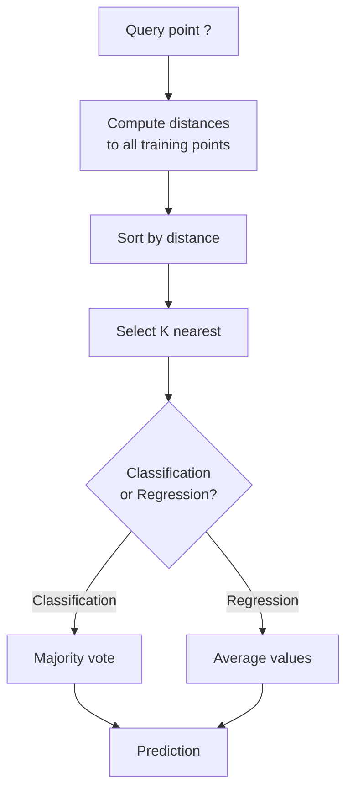
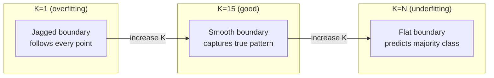
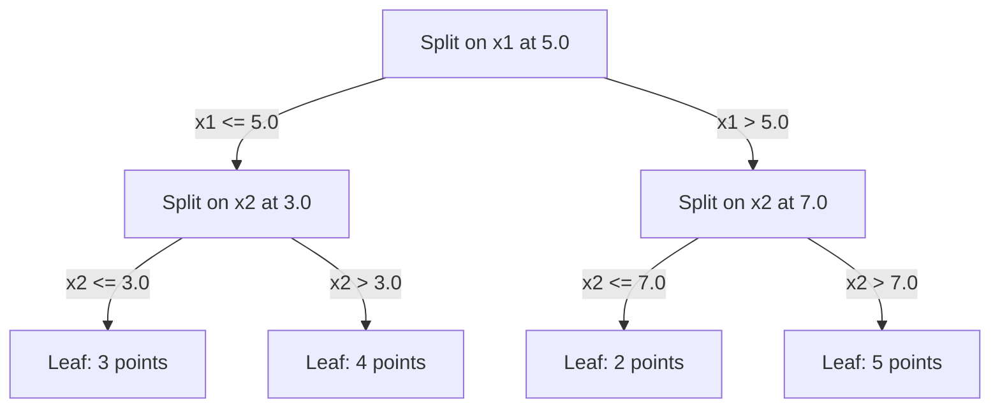

# K-Tetangga dan Distance Terdekat

> Simpan semuanya. Prediksi dengan melihat tetangga kamu. Algoritma paling sederhana yang benar-benar berfungsi.

**Type:** Build
**Language:** Python
**Prerequisites:** Fase 1 (Lesson 14 Norm dan Distance)
**Waktu:** ~90 menit

## Tujuan Pembelajaran

- Menerapkan klasifikasi dan regresi KNN dari awal dengan K yang dapat dikonfigurasi dan pemungutan suara berdasarkan distance
- Bandingkan metrik distance L1, L2, kosinus, dan Minkowski dan pilih yang sesuai untuk tipe data tertentu
- Jelaskan curse of dimensionality dan tunjukkan mengapa KNN terdegradasi di ruang berdimensi tinggi
- Build pohon KD untuk pencarian nearest neighbor yang efisien dan analisis ketika kinerjanya mengungguli brute force

## Masalah

kamu memiliki dataset. Titik data baru tiba. kamu perlu mengklasifikasikannya atau memprediksi nilainya. Daripada mempelajari parameter dari data (seperti regresi linier atau SVM), kamu cukup mencari titik training K yang paling dekat dengan titik baru dan membiarkannya memilih.

Ini adalah K-nearest neighbor. Tidak ada fase training. Tidak ada parameter untuk dipelajari. Tidak ada loss function untuk diminimalkan. kamu menyimpan seluruh set training dan menghitung distance pada waktu prediksi.

Kedengarannya terlalu sederhana untuk dikerjakan. Namun ternyata KNN mampu bersaing dalam banyak masalah, terutama dengan dataset berukuran kecil hingga menengah, dan pemahaman mendalam tentang KNN akan mengungkap konsep dasar: pilihan metrik distance (menghubungkan ke Fase 1 Lesson 14), curse of dimensionality, dan perbedaan antara malas dan bersemangat belajar.

KNN juga muncul di mana-mana di AI modern, hanya dengan nama yang berbeda. Basis data vector melakukan pencarian KNN melalui embedding. Pembuatan augmentasi pengambilan (RAG) menemukan K potongan dokumen terdekat. Sistem rekomendasi menemukan pengguna atau item serupa. Algoritmanya sama. Skala dan struktur datanya berbeda.

## Konsep

### Cara kerja KNN

Diberikan dataset titik berlabel dan titik kueri baru:

1. Hitung distance dari query ke setiap titik dalam dataset
2. Urutkan berdasarkan distance
3. Ambil K titik terdekat
4. Untuk klasifikasi: suara mayoritas di antara K tetangga
5. Untuk regresi: rata-rata (atau rata-rata tertimbang) dari nilai K tetangga



Itu adalah keseluruhan algoritma. Tidak pas. Tidak ada gradient descent. Tidak ada zaman.

### Memilih K

K adalah hyperparameter tunggal. Ini mengendalikan trade-off bias-varians:

| K | Perilaku |
|---|----------|
| K = 1 | Batasan keputusan mengikuti setiap titik. Nol kesalahan training. Varians tinggi. Pakaian |
| K Kecil (3-5) | Peka terhadap struktur lokal. Dapat menangkap batasan yang kompleks |
| K Besar | Batasan yang lebih halus. Lebih kuat terhadap kebisingan. Mungkin mengenakan pakaian dalam |
| K = N | Memprediksi kelas mayoritas untuk setiap poin. Bias maksimum |

Titik awal yang umum adalah K = sqrt(N) untuk dataset N poin. Gunakan K ganjil untuk klasifikasi biner untuk menghindari ikatan.



### Metrik distance

Fungsi distance mendefinisikan arti "dekat". Metrik yang berbeda menghasilkan tetangga yang berbeda, prediksi yang berbeda.

**L2 (Euclidean)** adalah defaultnya. Distance garis lurus.

```
d(a, b) = sqrt(sum((a_i - b_i)^2))
```

Sensitif terhadap skala feature. Selalu standarisasi feature sebelum menggunakan L2 dengan KNN.

**L1 (Manhattan)** menjumlahkan perbedaan absolut. Lebih kuat terhadap outlier dibandingkan L2 karena tidak mengkuadratkan perbedaannya.

```
d(a, b) = sum(|a_i - b_i|)
```

**Distance kosinus** mengukur sudut antar vector, mengabaikan besarnya. Penting untuk teks dan embed data.

```
d(a, b) = 1 - (a . b) / (||a|| * ||b||)
```

**Minkowski** menggeneralisasi L1 dan L2 dengan parameter p.```
d(a, b) = (sum(|a_i - b_i|^p))^(1/p)

p=1: Manhattan
p=2: Euclidean
p->inf: Chebyshev (max absolute difference)
```

Metrik mana yang digunakan bergantung pada data:

| Tipe data | Metrik terbaik | Mengapa |
|-----------|------------|-----|
| Feature numerik, skala serupa | L2 (Euclidean) | Default, berfungsi untuk data spasial |
| Feature numerik, outlier | L1 (Manhattan) | Kuat, tidak memperbesar perbedaan besar |
| Embedding teks | Kosinus | Besaran adalah kebisingan, arah adalah makna |
| Jarang berdimensi tinggi | Cosinus atau L1 | L2 menderita curse of dimensionality |
| Tipe campuran | Distance khusus | Gabungkan metrik per jenis feature |

### KNN tertimbang

Standar KNN memberikan weight yang sama pada semua K tetangga. Namun tetangga pada distance 0,1 seharusnya lebih penting daripada tetangga pada distance 5,0.

**KNN dengan weighting distance** memberi weight pada setiap tetangga secara terbalik berdasarkan distance:

```
weight_i = 1 / (distance_i + epsilon)

For classification: weighted vote
For regression:     weighted average = sum(w_i * y_i) / sum(w_i)
```

Epsilon mencegah pembagian dengan nol ketika titik kueri sama persis dengan titik training.

KNN tertimbang kurang sensitif terhadap pilihan K karena tetangga jauh memberikan kontribusi yang sangat kecil.

### Curse of dimensionality

Kinerja KNN menurun dalam high-dimensional. Ini bukanlah kekhawatiran yang samar-samar. Itu adalah fakta matematis.

**Masalah 1: distance menyatu.** Seiring bertambahnya dimension, rasio distance maksimum dan distance minimum mendekati 1. Semua titik menjadi sama "jauh" dari kueri.

```
In d dimensions, for random uniform points:

d=2:    max_dist / min_dist = varies widely
d=100:  max_dist / min_dist ~ 1.01
d=1000: max_dist / min_dist ~ 1.001

When all distances are nearly equal, "nearest" is meaningless.
```

**Masalah 2: volume meledak.** Untuk menangkap K tetangga dalam sebagian kecil data, kamu perlu memperluas radius penelusuran agar mencakup sebagian besar ruang feature. "Lingkungan" dalam high-dimensional mencakup sebagian besar ruangan.

**Soal 3: sudut mendominasi.** Dalam satuan hypercube dalam dimension d, sebagian besar volume terkonsentrasi di dekat sudut, bukan di tengah. Sebuah bola yang tertulis di dalam kubus berisi sebagian kecil volumenya seiring bertambahnya d.

Konsekuensi praktis: KNN berfungsi dengan baik hingga sekitar 20-50 feature. Selain itu, kamu memerlukan dimensionality reduction (PCA, UMAP, t-SNE) sebelum menerapkan KNN, atau kamu perlu menggunakan struktur pencarian berbasis pohon yang memanfaatkan dimension intrinsik data yang lebih rendah.

### KD-tree: pencarian nearest neighbor dengan cepat

KNN brute force menghitung distance dari kueri ke setiap titik training. Itu adalah O(n * d) per kueri. Untuk dataset besar, ini terlalu lambat.

Pohon KD secara rekursif mempartisi ruang di sepanjang sumbu feature. Pada setiap tingkat, ia terbagi menjadi satu dimension pada nilai median.



Untuk menemukan nearest neighbor, telusuri pohon ke daun yang berisi kueri, lalu lacak kembali dan periksa partisi tetangga hanya jika partisi tersebut dapat berisi titik yang lebih dekat.

Waktu kueri rata-rata: O(log n) untuk dimension rendah. Namun pohon KD terdegradasi menjadi O(n) dalam high-dimensional (d > 20) karena penelusuran mundur menghilangkan cabang yang semakin sedikit.

### Pohon bola: lebih baik untuk dimension sedang

Pohon bola mempartisi data menjadi hipersfer bersarang, bukan kotak sejajar sumbu. Setiap node mendefinisikan sebuah bola (pusat + radius) yang berisi semua titik di subpohon tersebut.

Keuntungan dibandingkan pohon KD:
- Bekerja lebih baik dalam dimension sedang (hingga ~50)
- Tangani struktur yang tidak sejajar sumbu
- Volume pembatas yang lebih ketat berarti lebih banyak cabang yang dipangkas selama pencarian

Baik pohon KD maupun pohon bola adalah algoritma yang tepat. Untuk pencarian skala besar (jutaan titik, ratusan dimension), metode perkiraan nearest neighbor (HNSW, IVF, kuantisasi produk) digunakan sebagai gantinya. Ini dibahas dalam Fase 1 Lesson 14.

### Malas belajar vs bersemangat belajarKNN adalah pembelajar yang malas: ia tidak melakukan pekerjaan pada waktu training dan semuanya bekerja pada waktu prediksi. Sebagian besar algoritme lainnya (regresi linier, SVM, neural network) adalah pembelajar yang bersemangat: mereka melakukan komputasi berat pada waktu training untuk membangun model yang ringkas, lalu prediksinya cepat.

| Aspek | Malas (KNN) | Bersemangat (SVM, neural network) |
|--------|------------|------------------------|
| Waktu training | O(1) hanya menyimpan data | O(n * zaman) |
| Waktu prediksi | O(n * d) per kueri | O(d) atau O(parameter) |
| Memori pada prediksi | Simpan seluruh set training | Simpan parameter model saja |
| Beradaptasi dengan data baru | Tambahkan poin secara instan | Latih kembali model |
| Batas keputusan | Implisit, dihitung dengan cepat | Eksplisit, diperbaiki setelah training |

Belajar malas sangat ideal ketika:
- Dataset sering berubah (menambah/menghapus poin tanpa training ulang)
- kamu memerlukan prediksi untuk sedikit pertanyaan
- kamu tidak ingin waktu latihan
- Kumpulan datanya cukup kecil sehingga pencarian brute force dapat dilakukan dengan cepat

### KNN untuk regresi

Alih-alih memberikan suara mayoritas, KNN untuk regresi membuat rata-rata nilai target K tetangga.

```
prediction = (1/K) * sum(y_i for i in K nearest neighbors)

Or with distance weighting:
prediction = sum(w_i * y_i) / sum(w_i)
where w_i = 1 / distance_i
```

Regresi KNN menghasilkan prediksi yang sedikit demi sedikit (atau sedikit demi sedikit mulus dengan weighting). Itu tidak dapat melakukan ekstrapolasi di luar jangkauan training data. Jika target training semuanya antara 0 dan 100, KNN tidak akan pernah memprediksi 200.

## Build

### Langkah 1: Fungsi distance

Menerapkan distance L1, L2, kosinus, dan Minkowski. Ini terhubung langsung ke Fase 1 Lesson 14.

```python
import math

def l2_distance(a, b):
    return math.sqrt(sum((ai - bi) ** 2 for ai, bi in zip(a, b)))

def l1_distance(a, b):
    return sum(abs(ai - bi) for ai, bi in zip(a, b))

def cosine_distance(a, b):
    dot_val = sum(ai * bi for ai, bi in zip(a, b))
    norm_a = math.sqrt(sum(ai ** 2 for ai in a))
    norm_b = math.sqrt(sum(bi ** 2 for bi in b))
    if norm_a == 0 or norm_b == 0:
        return 1.0
    return 1.0 - dot_val / (norm_a * norm_b)

def minkowski_distance(a, b, p=2):
    if p == float('inf'):
        return max(abs(ai - bi) for ai, bi in zip(a, b))
    return sum(abs(ai - bi) ** p for ai, bi in zip(a, b)) ** (1 / p)
```

### Langkah 2: Pengklasifikasi dan regresi KNN

Build KNN lengkap dengan K yang dapat dikonfigurasi, metrik distance, dan weighting distance opsional.

```python
class KNN:
    def __init__(self, k=5, distance_fn=l2_distance, weighted=False,
                 task="classification"):
        self.k = k
        self.distance_fn = distance_fn
        self.weighted = weighted
        self.task = task
        self.X_train = None
        self.y_train = None

    def fit(self, X, y):
        self.X_train = X
        self.y_train = y

    def predict(self, X):
        return [self._predict_one(x) for x in X]
```

### Langkah 3: KD-tree untuk pencarian yang efisien

Build pohon KD dari awal yang terbagi secara rekursif pada median setiap dimension.

```python
class KDTree:
    def __init__(self, X, indices=None, depth=0):
        # Recursively partition the data
        self.axis = depth % len(X[0])
        # Split on median of the current axis
        ...

    def query(self, point, k=1):
        # Traverse to leaf, then backtrack
        ...
```

Lihat `code/knn.py` untuk implementasi lengkap dengan semua metode pembantu dan demo.

### Langkah 4: Penskalaan feature

KNN memerlukan penskalaan feature karena distance sensitif terhadap besaran feature. Sebuah feature yang berkisar dari 0 hingga 1000 akan mendominasi feature yang berkisar dari 0 hingga 1.

```python
def standardize(X):
    n = len(X)
    d = len(X[0])
    means = [sum(X[i][j] for i in range(n)) / n for j in range(d)]
    stds = [
        max(1e-10, (sum((X[i][j] - means[j]) ** 2 for i in range(n)) / n) ** 0.5)
        for j in range(d)
    ]
    return [[((X[i][j] - means[j]) / stds[j]) for j in range(d)] for i in range(n)], means, stds
```

## Pakai

Dengan scikit-belajar:

```python
from sklearn.neighbors import KNeighborsClassifier
from sklearn.preprocessing import StandardScaler
from sklearn.pipeline import Pipeline

clf = Pipeline([
    ("scaler", StandardScaler()),
    ("knn", KNeighborsClassifier(n_neighbors=5, metric="euclidean")),
])
clf.fit(X_train, y_train)
print(f"Accuracy: {clf.score(X_test, y_test):.4f}")
```

Scikit-learn secara otomatis menggunakan pohon KD atau pohon bola ketika dataset cukup besar dan dimensinya cukup rendah. Untuk data berdimensi tinggi, ini kembali ke brute force. kamu dapat mengontrolnya dengan parameter `algorithm`.

Untuk pencarian nearest neighbor dalam skala besar (jutaan vector), gunakan FAISS, Annoy, atau database vector:

```python
import faiss

index = faiss.IndexFlatL2(dimension)
index.add(embeddings)
distances, indices = index.search(query_vectors, k=5)
```

## Latihan

1. Mengimplementasikan klasifikasi KNN pada dataset 2D dengan 3 kelas. Plot batas keputusan untuk K=1, K=5, K=15, dan K=N. Amati transisi dari overfitting ke underfitting.

2. Hasilkan 1000 titik acak dalam 2, 5, 10, 50, 100, dan 500 dimension. Untuk setiap dimension, hitung rasio distance berpasangan maksimum dengan distance berpasangan minimum. Plot rasio vs dimension untuk memvisualisasikan curse of dimensionality.

3. Bandingkan L1, L2, dan distance cosinus untuk KNN pada masalah klasifikasi teks (gunakan vector TF-IDF). Metrik mana yang memberikan akurasi terbaik? Mengapa cosinus cenderung menang untuk teks?

4. Menerapkan pohon KD dan mengukur waktu kueri vs kekerasan untuk dataset 1k, 10k, dan 100k poin dalam 2D, 10D, dan 50D. Pada dimension berapa pohon KD berhenti menjadi lebih cepat daripada kekerasan?5. Buatlah regressor KNN berbobot untuk y = sin(x) + noise. Bandingkan dengan KNN tak berbobot untuk K=3, 10, 30. Tunjukkan bahwa weighting menghasilkan prediksi yang lebih halus, khususnya untuk K besar.

## Istilah Kunci

| Istilah | Apa sebenarnya arti |
|------|----------------------|
| K-nearest neighbor | Algoritma non-parametrik yang memprediksi dengan mencari K titik training terdekat dengan query |
| Malas belajar | Tidak ada perhitungan pada waktu training. Semua pekerjaan terjadi pada waktu prediksi. KNN adalah contoh kanonik |
| Semangat belajar | Komputasi berat pada waktu training untuk membangun model yang ringkas. Kebanyakan algoritma ML sangat menginginkan |
| Kutukan Dimensionalitas | Dalam high-dimensional, distance menyatu dan lingkungan meluas hingga mencakup sebagian besar ruang, membuat KNN tidak efektif |
| Pohon KD | Pohon biner yang secara rekursif mempartisi ruang sepanjang sumbu feature. O(log n) kueri dalam dimension rendah |
| Pohon bola | Pohon hipersfer bersarang. Bekerja lebih baik daripada pohon KD dalam dimension sedang (hingga ~50) |
| KNN Tertimbang | Tetangga mempunyai weight yang berbanding terbalik dengan distance. Tetangga yang lebih dekat memiliki pengaruh lebih besar terhadap prediksi |
| Penskalaan feature | Menormalkan feature ke rentang yang sebanding. Diperlukan untuk metode berbasis distance seperti KNN |
| Suara terbanyak | Klasifikasi dengan menghitung kelas mana yang paling banyak terdapat pada K tetangga |
| Pencarian kekerasan | Menghitung distance ke setiap titik training. O(n*d) per kueri. Akurat tetapi lambat untuk n | yang besar
| Perkiraan nearest neighbor | Algoritma (HNSW, LSH, IVF) yang menemukan kira-kira titik terdekat jauh lebih cepat daripada pencarian tepat |
| Diagram Voronoi | Partisi ruang di mana setiap wilayah berisi semua titik yang lebih dekat ke satu titik training dibandingkan titik lainnya. K=1 KNN menghasilkan batas Voronoi |

## Bacaan Lanjutan

- [Cover & Hart: Nearest Neighbor Pattern Classification (1967)](https://ieeexplore.ieee.org/document/1053964) - makalah dasar KNN yang membuktikan bahwa ia memiliki tingkat kesalahan paling banyak dua kali lipat optimal Bayes
- [Friedman, Bentley, Finkel: Algoritma untuk Menemukan Kecocokan Terbaik dalam Logaritma Waktu yang Diharapkan (1977)](https://dl.acm.org/doi/10.1145/355744.355745) - makalah KD-tree asli
- [Beyer dkk.: Kapan "Tetangga Terdekat" Bermakna? (1999)](https://link.springer.com/chapter/10.1007/3-540-49257-7_15) - analisis formal curse of dimensionality untuk nearest neighbor
- [dokumentasi scikit-learn Nearest Neighbors](https://scikit-learn.org/stable/modules/neighbors.html) - panduan praktis dengan pemilihan algoritma
- [FAISS: Perpustakaan untuk Pencarian Kesamaan yang Efisien](https://github.com/facebookresearch/faiss) - Perpustakaan Meta untuk pencarian nearest neighbor dalam skala miliaran
