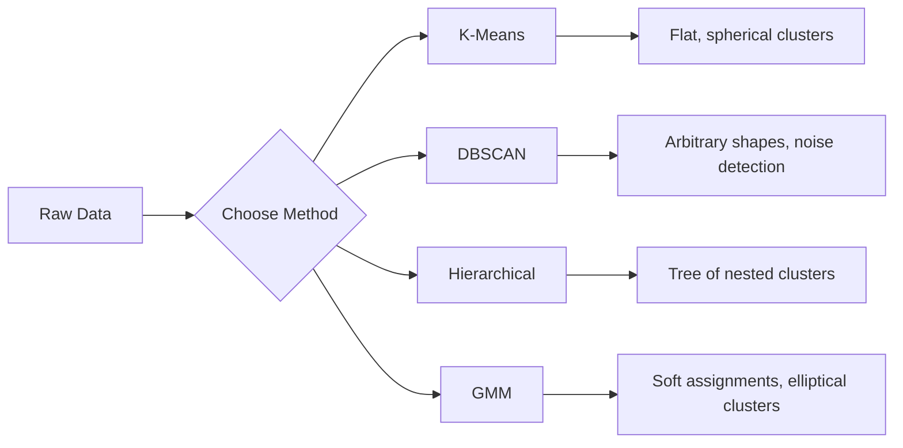

# Pembelajaran Tanpa Pengawasan

> Tanpa label, tanpa guru. Algoritme menemukan strukturnya sendiri.

**Type:** Build
**Language:** Python
**Prerequisites:** Fase 1 (Norm & Distance, Probability & Distributions), Fase 2 Lesson 1-6
**Waktu:** ~90 menit

## Tujuan Pembelajaran

- Menerapkan Model Campuran K-Means, DBSCAN, dan Gaussian dari awal dan membandingkan perilaku pengelompokannya
- Evaluasi kualitas cluster menggunakan skor siluet dan elbow method untuk memilih K yang optimal
- Jelaskan kapan DBSCAN mengungguli K-Means dan identifikasi algoritma mana yang menangani cluster dan outlier non-spherical
- Membangun jalur deteksi anomali menggunakan metode pengelompokan untuk menandai titik-titik yang menyimpang dari pola normal

## Masalah

Setiap lesson ML sejauh ini mengasumsikan data berlabel: "ini input, ini output yang benar". Di dunia nyata, label itu mahal. Sebuah rumah sakit memiliki jutaan catatan pasien tetapi belum ada yang secara manual menandai masing-masing catatan tersebut dengan kategori penyakit. Sebuah situs e-niaga memiliki jutaan sesi pengguna tetapi tidak ada yang memiliki segmen pelanggan yang diberi label sendiri. Tim keamanan memiliki log jaringan tetapi tidak ada yang menandai setiap anomali.

Pembelajaran tanpa pengawasan menemukan pola tanpa diberi tahu apa yang harus dicari. Ini mengelompokkan titik data yang serupa, menemukan struktur tersembunyi, dan memunculkan anomali. Jika pembelajaran yang diawasi adalah pembelajaran dari buku teks yang memiliki kunci jawaban, maka pembelajaran tanpa pengawasan adalah menatap data mentah sampai polanya terungkap.

Tangkapannya: tanpa label, kamu tidak bisa langsung mengukur "benar" atau "salah". kamu memerlukan alat berbeda untuk mengevaluasi apakah struktur yang ditemukan algoritme kamu bermakna.

## Konsep

### Pengelompokan: Mengelompokkan Hal-Hal Serupa

Clustering menugaskan setiap titik data ke dalam suatu kelompok (cluster) sehingga titik-titik dalam kelompok yang sama lebih mirip satu sama lain dibandingkan dengan titik-titik dalam kelompok lain. Pertanyaannya selalu: apa yang dimaksud dengan "serupa"?



### K-Means: Pekerja Keras

K-Means mempartisi data menjadi K cluster yang tepat. Setiap cluster memiliki centroid (pusat massanya), dan setiap titik termasuk dalam centroid terdekat.

Algoritma Lloyd:

1. Pilih K titik acak sebagai pusat massa awal
2. Tetapkan setiap titik data ke pusat massa terdekat
3. Hitung ulang setiap pusat massa sebagai rata-rata dari titik-titik yang ditetapkan
4. Ulangi langkah 2-3 hingga tugas berhenti berubah

Fungsi tujuan (inersia) mengukur total distance kuadrat dari setiap titik ke pusat massa yang ditetapkan. K-Means meminimalkan hal ini, tetapi hanya menemukan nilai minimum lokal. Inisialisasi yang berbeda dapat memberikan hasil yang berbeda.

### Memilih K

Dua metode standar:

**Elbow method:** Jalankan K-Means untuk K = 1, 2, 3, ..., n. Plot inersia vs K. Carilah "siku" di mana menambahkan lebih banyak cluster berhenti mengurangi inersia secara signifikan.

**Skor siluet:** Untuk setiap titik, ukur seberapa mirip titik tersebut dengan klasternya sendiri (a) dibandingkan dengan klaster terdekat lainnya (b). Koefisien siluetnya adalah (b - a) / max(a, b), berkisar dari -1 (cluster salah) hingga +1 (cluster baik). Rata-rata di semua poin untuk skor global.

### DBSCAN: Pengelompokan Berbasis Kepadatan

K-Means mengasumsikan cluster berbentuk bola dan mengharuskan kamu memilih K terlebih dahulu. DBSCAN tidak membuat asumsi apa pun. Ia menemukan cluster sebagai wilayah padat yang dipisahkan oleh wilayah yang jarang.

Dua parameter:
- **eps**: radius lingkungan
- **min_samples**: jumlah minimum titik yang diperlukan untuk membentuk wilayah padatTiga jenis poin:
- **Titik inti**: memiliki setidaknya poin min_samples dalam distance eps
- **Titik perbatasan**: dalam eps dari titik inti tetapi bukan titik inti itu sendiri
- **Titik kebisingan**: bukan inti maupun batas. Ini adalah hal yang aneh.

DBSCAN menghubungkan titik-titik inti yang berada dalam eps satu sama lain ke dalam cluster yang sama. Titik-titik perbatasan bergabung dengan cluster titik inti terdekat. Titik kebisingan bukan milik cluster.

Kekuatan: menemukan cluster dalam bentuk apa pun, secara otomatis menentukan jumlah cluster, mengidentifikasi outlier. Kelemahan: berjuang dengan kelompok dengan kepadatan berbeda-beda.

### Pengelompokan Hierarki

Membangun pohon (dendogram) dari cluster bersarang.

Aglomeratif (dari bawah ke atas):
1. Mulailah dengan setiap titik sebagai cluster tersendiri
2. Gabungkan dua cluster terdekat
3. Ulangi hingga hanya tersisa satu cluster
4. Potong dendrogram pada level yang diinginkan untuk mendapatkan K cluster

“Kedekatan” antar cluster dapat diukur dengan:
- **Tautan tunggal**: distance minimum antara dua titik mana pun dalam dua cluster
- **Hubungan lengkap**: distance maksimum antara dua titik mana pun
- **Hubungan rata-rata**: distance rata-rata antara semua pasangan
- **Metode Ward**: penggabungan yang menyebabkan peningkatan terkecil pada total varians dalam klaster

### Model Campuran Gaussian (GMM)

K-Means memberikan tugas sulit: setiap titik termasuk dalam satu cluster. GMM memberikan penugasan lunak: setiap titik memiliki probabilitas untuk menjadi bagian dari setiap cluster.

GMM mengasumsikan data dihasilkan dari campuran distribusi K Gaussian, yang masing-masing memiliki mean dan kovariansnya sendiri. Algoritme Expectation-Maximization (EM) bergantian antara:

- **E-step**: hitung probabilitas bahwa setiap titik dimiliki oleh setiap Gaussian
- **Langkah-M**: perbarui mean, kovarians, dan weight campuran setiap Gaussian untuk memaksimalkan kemungkinan data

GMM dapat memodelkan cluster elips (tidak hanya berbentuk bola seperti K-Means) dan secara alami menangani cluster yang tumpang tindih.

### Kapan Menggunakan Yang Mana

| Metode | Terbaik untuk | Hindari ketika |
|--------|----------|------------|
| K-Berarti | Dataset besar, cluster bola, dikenal K | Bentuk tidak beraturan, ada outlier |
| DBSCAN | K tidak diketahui, bentuk arbitrer, deteksi outlier | Kepadatan bervariasi, dimension sangat tinggi |
| Hierarki | Dataset kecil, memerlukan dendrogram, K | tidak diketahui Dataset besar (memori O(n^2)) |
| GM | Cluster yang tumpang tindih, diperlukan penugasan lunak | Dataset yang sangat besar, terlalu banyak dimension |

### Deteksi Anomali dengan Clustering

Pengelompokan secara alami mendukung deteksi anomali:
- **K-Means**: titik yang jauh dari pusat massa mana pun merupakan anomali
- **DBSCAN**: titik kebisingan menurut definisinya adalah anomali
- **GMM**: titik dengan probabilitas rendah di bawah semua Gauss adalah anomali

## Build

### Langkah 1: K-Means dari awal

```python
import math
import random


def euclidean_distance(a, b):
    return math.sqrt(sum((ai - bi) ** 2 for ai, bi in zip(a, b)))


def kmeans(data, k, max_iterations=100, seed=42):
    random.seed(seed)
    n_features = len(data[0])

    centroids = random.sample(data, k)

    for iteration in range(max_iterations):
        clusters = [[] for _ in range(k)]
        assignments = []

        for point in data:
            distances = [euclidean_distance(point, c) for c in centroids]
            nearest = distances.index(min(distances))
            clusters[nearest].append(point)
            assignments.append(nearest)

        new_centroids = []
        for cluster in clusters:
            if len(cluster) == 0:
                new_centroids.append(random.choice(data))
                continue
            centroid = [
                sum(point[j] for point in cluster) / len(cluster)
                for j in range(n_features)
            ]
            new_centroids.append(centroid)

        if all(
            euclidean_distance(old, new) < 1e-6
            for old, new in zip(centroids, new_centroids)
        ):
            print(f"  Converged at iteration {iteration + 1}")
            break

        centroids = new_centroids

    return assignments, centroids
```

### Langkah 2: Elbow method dan skor siluet

```python
def compute_inertia(data, assignments, centroids):
    total = 0.0
    for point, cluster_id in zip(data, assignments):
        total += euclidean_distance(point, centroids[cluster_id]) ** 2
    return total


def silhouette_score(data, assignments):
    n = len(data)
    if n < 2:
        return 0.0

    clusters = {}
    for i, c in enumerate(assignments):
        clusters.setdefault(c, []).append(i)

    if len(clusters) < 2:
        return 0.0

    scores = []
    for i in range(n):
        own_cluster = assignments[i]
        own_members = [j for j in clusters[own_cluster] if j != i]

        if len(own_members) == 0:
            scores.append(0.0)
            continue

        a = sum(euclidean_distance(data[i], data[j]) for j in own_members) / len(own_members)

        b = float("inf")
        for cluster_id, members in clusters.items():
            if cluster_id == own_cluster:
                continue
            avg_dist = sum(euclidean_distance(data[i], data[j]) for j in members) / len(members)
            b = min(b, avg_dist)

        if max(a, b) == 0:
            scores.append(0.0)
        else:
            scores.append((b - a) / max(a, b))

    return sum(scores) / len(scores)


def find_best_k(data, max_k=10):
    print("Elbow method:")
    inertias = []
    for k in range(1, max_k + 1):
        assignments, centroids = kmeans(data, k)
        inertia = compute_inertia(data, assignments, centroids)
        inertias.append(inertia)
        print(f"  K={k}: inertia={inertia:.2f}")

    print("\nSilhouette scores:")
    for k in range(2, max_k + 1):
        assignments, centroids = kmeans(data, k)
        score = silhouette_score(data, assignments)
        print(f"  K={k}: silhouette={score:.4f}")

    return inertias
```

### Langkah 3: DBSCAN dari awal

```python
def dbscan(data, eps, min_samples):
    n = len(data)
    labels = [-1] * n
    cluster_id = 0

    def region_query(point_idx):
        neighbors = []
        for i in range(n):
            if euclidean_distance(data[point_idx], data[i]) <= eps:
                neighbors.append(i)
        return neighbors

    visited = [False] * n

    for i in range(n):
        if visited[i]:
            continue
        visited[i] = True

        neighbors = region_query(i)

        if len(neighbors) < min_samples:
            labels[i] = -1
            continue

        labels[i] = cluster_id
        seed_set = list(neighbors)
        seed_set.remove(i)

        j = 0
        while j < len(seed_set):
            q = seed_set[j]

            if not visited[q]:
                visited[q] = True
                q_neighbors = region_query(q)
                if len(q_neighbors) >= min_samples:
                    for nb in q_neighbors:
                        if nb not in seed_set:
                            seed_set.append(nb)

            if labels[q] == -1:
                labels[q] = cluster_id

            j += 1

        cluster_id += 1

    return labels
```

### Langkah 4: Model Campuran Gaussian (algoritma EM)

```python
def gmm(data, k, max_iterations=100, seed=42):
    random.seed(seed)
    n = len(data)
    d = len(data[0])

    indices = random.sample(range(n), k)
    means = [list(data[i]) for i in indices]
    variances = [1.0] * k
    weights = [1.0 / k] * k

    def gaussian_pdf(x, mean, variance):
        d = len(x)
        coeff = 1.0 / ((2 * math.pi * variance) ** (d / 2))
        exponent = -sum((xi - mi) ** 2 for xi, mi in zip(x, mean)) / (2 * variance)
        return coeff * math.exp(max(exponent, -500))

    for iteration in range(max_iterations):
        responsibilities = []
        for i in range(n):
            probs = []
            for j in range(k):
                probs.append(weights[j] * gaussian_pdf(data[i], means[j], variances[j]))
            total = sum(probs)
            if total == 0:
                total = 1e-300
            responsibilities.append([p / total for p in probs])

        old_means = [list(m) for m in means]

        for j in range(k):
            r_sum = sum(responsibilities[i][j] for i in range(n))
            if r_sum < 1e-10:
                continue

            weights[j] = r_sum / n

            for dim in range(d):
                means[j][dim] = sum(
                    responsibilities[i][j] * data[i][dim] for i in range(n)
                ) / r_sum

            variances[j] = sum(
                responsibilities[i][j]
                * sum((data[i][dim] - means[j][dim]) ** 2 for dim in range(d))
                for i in range(n)
            ) / (r_sum * d)
            variances[j] = max(variances[j], 1e-6)

        shift = sum(
            euclidean_distance(old_means[j], means[j]) for j in range(k)
        )
        if shift < 1e-6:
            print(f"  GMM converged at iteration {iteration + 1}")
            break

    assignments = []
    for i in range(n):
        assignments.append(responsibilities[i].index(max(responsibilities[i])))

    return assignments, means, weights, responsibilities
```

### Langkah 5: Hasilkan data pengujian dan jalankan semuanya

```python
def make_blobs(centers, n_per_cluster=50, spread=0.5, seed=42):
    random.seed(seed)
    data = []
    true_labels = []
    for label, (cx, cy) in enumerate(centers):
        for _ in range(n_per_cluster):
            x = cx + random.gauss(0, spread)
            y = cy + random.gauss(0, spread)
            data.append([x, y])
            true_labels.append(label)
    return data, true_labels


def make_moons(n_samples=200, noise=0.1, seed=42):
    random.seed(seed)
    data = []
    labels = []
    n_half = n_samples // 2
    for i in range(n_half):
        angle = math.pi * i / n_half
        x = math.cos(angle) + random.gauss(0, noise)
        y = math.sin(angle) + random.gauss(0, noise)
        data.append([x, y])
        labels.append(0)
    for i in range(n_half):
        angle = math.pi * i / n_half
        x = 1 - math.cos(angle) + random.gauss(0, noise)
        y = 1 - math.sin(angle) - 0.5 + random.gauss(0, noise)
        data.append([x, y])
        labels.append(1)
    return data, labels


if __name__ == "__main__":
    centers = [[2, 2], [8, 3], [5, 8]]
    data, true_labels = make_blobs(centers, n_per_cluster=50, spread=0.8)

    print("=== K-Means on 3 blobs ===")
    assignments, centroids = kmeans(data, k=3)
    print(f"  Centroids: {[[round(c, 2) for c in cent] for cent in centroids]}")
    sil = silhouette_score(data, assignments)
    print(f"  Silhouette score: {sil:.4f}")

    print("\n=== Elbow Method ===")
    find_best_k(data, max_k=6)

    print("\n=== DBSCAN on 3 blobs ===")
    db_labels = dbscan(data, eps=1.5, min_samples=5)
    n_clusters = len(set(db_labels) - {-1})
    n_noise = db_labels.count(-1)
    print(f"  Found {n_clusters} clusters, {n_noise} noise points")

    print("\n=== GMM on 3 blobs ===")
    gmm_assignments, gmm_means, gmm_weights, _ = gmm(data, k=3)
    print(f"  Means: {[[round(m, 2) for m in mean] for mean in gmm_means]}")
    print(f"  Weights: {[round(w, 3) for w in gmm_weights]}")
    gmm_sil = silhouette_score(data, gmm_assignments)
    print(f"  Silhouette score: {gmm_sil:.4f}")

    print("\n=== DBSCAN on moons (non-spherical clusters) ===")
    moon_data, moon_labels = make_moons(n_samples=200, noise=0.1)
    moon_db = dbscan(moon_data, eps=0.3, min_samples=5)
    n_moon_clusters = len(set(moon_db) - {-1})
    n_moon_noise = moon_db.count(-1)
    print(f"  Found {n_moon_clusters} clusters, {n_moon_noise} noise points")

    print("\n=== K-Means on moons (will fail to separate) ===")
    moon_km, moon_centroids = kmeans(moon_data, k=2)
    moon_sil = silhouette_score(moon_data, moon_km)
    print(f"  Silhouette score: {moon_sil:.4f}")
    print("  K-Means splits moons poorly because they are not spherical")

    print("\n=== Anomaly detection with DBSCAN ===")
    anomaly_data = list(data)
    anomaly_data.append([20.0, 20.0])
    anomaly_data.append([-5.0, -5.0])
    anomaly_data.append([15.0, 0.0])
    anomaly_labels = dbscan(anomaly_data, eps=1.5, min_samples=5)
    anomalies = [
        anomaly_data[i]
        for i in range(len(anomaly_labels))
        if anomaly_labels[i] == -1
    ]
    print(f"  Detected {len(anomalies)} anomalies")
    for a in anomalies[-3:]:
        print(f"    Point {[round(v, 2) for v in a]}")
```

## Pakai

Dengan scikit-learn, algoritme yang sama bersifat satu kalimat:

```python
from sklearn.cluster import KMeans, DBSCAN, AgglomerativeClustering
from sklearn.mixture import GaussianMixture
from sklearn.metrics import silhouette_score as sklearn_silhouette

km = KMeans(n_clusters=3, random_state=42).fit(data)
db = DBSCAN(eps=1.5, min_samples=5).fit(data)
agg = AgglomerativeClustering(n_clusters=3).fit(data)
gmm_model = GaussianMixture(n_components=3, random_state=42).fit(data)
```

Versi dari awal menunjukkan dengan tepat apa yang dihitung oleh perpustakaan ini. K-Means melakukan iterasi antara penetapan dan penghitungan ulang. DBSCAN menumbuhkan kelompok dari biji yang padat. GMM bergantian antara ekspektasi dan maksimalisasi. Versi perpustakaan menambahkan stabilitas numerik, inisialisasi yang lebih cerdas (K-Means++), dan akselerasi GPU, tetapi logika intinya sama.

## Kirim

Lesson ini menghasilkan implementasi kerja K-Means, DBSCAN, dan GMM dari awal. Code pengelompokan dapat digunakan kembali sebagai landasan untuk metode tanpa pengawasan yang lebih canggih.

## Latihan

1. Menerapkan inisialisasi K-Means++: daripada memilih centroid secara acak, pilih centroid pertama secara acak dan setiap centroid berikutnya dengan probabilitas sebanding dengan distance kuadratnya dari centroid terdekat yang ada. Bandingkan kecepatan konvergensi dengan inisialisasi acak.
2. Tambahkan pengelompokan aglomeratif hierarki ke code. Implementasikan linkage Ward dan hasilkan dendrogram (sebagai daftar gabungan yang disarangkan). Potong pada level yang berbeda dan bandingkan dengan hasil K-Means.
3. Buat pipeline deteksi anomali sederhana: jalankan DBSCAN dan GMM pada data yang sama, titik tanda yang disepakati kedua metode adalah outlier (noise di DBSCAN, probabilitas rendah di GMM). Ukur tumpang tindihnya dan diskusikan jika metodenya tidak sesuai.

## Istilah Kunci

| Istilah | Apa kata orang | Apa sebenarnya arti |
|------|----------------|----------------------|
| Pengelompokan | "Mengelompokan hal-hal serupa" | Mempartisi data ke dalam himpunan bagian yang kesamaan dalam kelompoknya melebihi kesamaan antarkelompok, diukur dengan metrik distance tertentu |
| pusat | "Pusat cluster" | Rata-rata semua poin yang ditugaskan ke sebuah cluster; digunakan oleh K-Means sebagai perwakilan cluster |
| Inersia | "Betapa ketatnya cluster" | Jumlah kuadrat distance dari setiap titik ke pusat massa yang ditetapkan; lebih rendah lebih ketat |
| Skor siluet | "Betapa baiknya cluster-cluster tersebut terpisah" | Untuk setiap titik, (b - a) / max(a, b) dimana a adalah rata-rata distance intra-cluster dan b adalah rata-rata distance cluster terdekat |
| Poin inti | "Suatu titik di wilayah padat" | Suatu titik dengan setidaknya min_samples tetangga dalam distance eps, di DBSCAN |
| Algoritma EM | "K-Means Lembut" | Maksimalisasi Ekspektasi: menghitung probabilitas keanggotaan secara berulang (E-step) dan memperbarui parameter distribusi (M-step) |
| Dendrogram | "Pohon cluster" | Diagram pohon yang menunjukkan urutan dan distance penggabungan cluster dalam pengelompokan hierarki |
| anomali | "Orang asing" | Titik data yang tidak sesuai dengan pola yang diharapkan, diidentifikasi sebagai noise oleh DBSCAN atau probabilitas rendah oleh GMM |

## Bacaan Lanjutan

- [Stanford CS229 - Pembelajaran Tanpa Pengawasan](https://cs229.stanford.edu/notes2022fall/main_notes.pdf) - Catatan kuliah Andrew Ng tentang pengelompokan dan EM
- [scikit-learn Clustering Guide](https://scikit-learn.org/stable/modules/clustering.html) - perbandingan praktis semua algoritma clustering dengan contoh visual
- [Makalah asli DBSCAN (Ester et al., 1996)](https://www.aaai.org/Papers/KDD/1996/KDD96-037.pdf) - makalah yang memperkenalkan pengelompokan berbasis kepadatan
