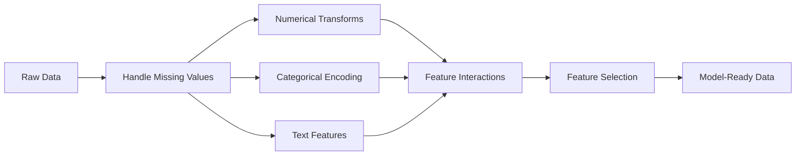

# Rekayasa & Seleksi Feature

> Feature yang bagus bernilai seribu poin data.

**Type:** Build
**Language:** Python
**Prerequisites:** Fase 1 (Statistik ML, Linear Algebra), Fase 2 Lesson 1-7
**Waktu:** ~90 menit

## Tujuan Pembelajaran

- Menerapkan transformasi numerik (standardisasi, penskalaan min-maks, transformasi log, binning) dan menjelaskan kapan masing-masing transformasi tersebut sesuai
- Membangun pengkodean one-hot, label, dan target untuk feature kategorikal dan mengidentifikasi risiko kebocoran data dalam pengkodean target
- Buat vektorizer TF-IDF dari awal dan jelaskan mengapa performanya mengungguli jumlah kata mentah untuk klasifikasi teks
- Terapkan pemilihan feature berbasis filter (batas varians, korelasi, informasi timbal balik) untuk mengurangi dimension

## Masalah

kamu memiliki dataset. kamu memilih algoritma. kamu melatihnya. Hasilnya biasa-biasa saja. kamu mencoba algoritma yang lebih bagus. Masih biasa-biasa saja. kamu menghabiskan waktu seminggu untuk menyetel hyperparameter. Peningkatan kecil.

Kemudian seseorang mengubah data mentah menjadi feature yang lebih baik dan regresi logistik sederhana mengalahkan ansambel peningkatan gradient yang kamu sesuaikan.

Hal ini terjadi terus-menerus. Dalam ML klasik, representasi data lebih penting daripada pilihan algoritma. Model harga rumah dengan "ukuran luas" dan "jumlah kamar tidur" akan mengalahkan model dengan "alamat sebagai string mentah" tidak peduli seberapa canggih pelajarnya. Algoritme hanya dapat bekerja dengan apa yang kamu berikan.

Rekayasa feature adalah proses mengubah data mentah menjadi representasi yang membuat pola lebih mudah ditemukan oleh model. Pemilihan feature adalah proses membuang feature-feature yang menambah noise tanpa menambahkan sinyal. Secara keseluruhan, keduanya merupakan aktivitas dengan leverage tertinggi di ML klasik.

## Konsep

### Pipeline Feature



### Feature Numerik

Angka mentah jarang sekali siap untuk dimodelkan. Transformasi umum:

**Penskalaan:** Menempatkan feature pada rentang yang sama sehingga algoritme berbasis distance (K-Means, KNN, SVM) memperlakukan semua feature secara setara. Penskalaan min-maks dipetakan ke [0, 1]. Standardisasi (skor-z) dipetakan ke mean=0, std=1.

**Transformasi log:** Mengompresi distribusi miring ke kanan (pendapatan, populasi, jumlah kata). Mengubah hubungan perkalian menjadi hubungan aditif.

**Binning:** Mengonversi nilai berkelanjutan ke dalam kategori. Berguna ketika hubungan antara feature dan target bersifat non-linier namun bertahap (misalnya, kelompok umur).

**Feature polinomial:** Membuat suku x^2, x^3, x1*x2. Memungkinkan model linier menangkap hubungan nonlinier dengan mengorbankan lebih banyak feature.

### Feature Kategoris

Model membutuhkan angka. Kategori memerlukan pengkodean.

**Encoding one-hot:** Membuat kolom biner untuk setiap kategori. "warna = merah/biru/hijau" menjadi tiga kolom: is_red, is_blue, is_green. Berfungsi dengan baik untuk feature berkardinalitas rendah tetapi dapat digunakan dalam banyak kategori.

**Pengkodean label:** Memetakan setiap kategori ke bilangan bulat: merah=0, biru=1, hijau=2. Memperkenalkan pengurutan yang salah (model mungkin berpikir hijau > biru > merah). Hanya sesuai untuk model berbasis pohon yang terbagi berdasarkan nilai individual.

**Encoding target:** Mengganti setiap kategori dengan rata-rata variabel target untuk kategori tersebut. Kuat namun berbahaya: risiko kebocoran data yang tinggi. Harus dihitung hanya pada training data dan diterapkan pada data pengujian.

### Feature Teks

**Hitung vektorizer:** Menghitung berapa kali setiap kata muncul dalam dokumen. "kucing itu duduk di atas matras" menjadi {the: 2, cat: 1, sat: 1, on: 1, mat: 1}.**TF-IDF:** Frekuensi Istilah-Frekuensi Dokumen Terbalik. Menimbang kata-kata berdasarkan keunikannya di seluruh dokumen. Kata-kata umum seperti "the" mempunyai weight yang rendah. Kata-kata yang jarang dan khas mendapat weight yang tinggi.

```
TF(word, doc) = count(word in doc) / total words in doc
IDF(word) = log(total docs / docs containing word)
TF-IDF = TF * IDF
```

### Nilai Hilang

Data nyata mempunyai lubang. Strategi:

- **Hapus baris:** Hanya jika data yang hilang jarang terjadi dan acak
- **Imputasi rata-rata/median:** Sederhana, mempertahankan bentuk distribusi (median lebih kuat terhadap outlier)
- **Imputasi mode:** Untuk feature kategorikal
- **Kolom indikator:** Tambahkan kolom biner "was_this_missing" sebelum memasukkan. Fakta bahwa data hilang dapat menjadi informasi
- **Isi maju/mundur:** Untuk data deret waktu

### Interaksi Feature

Terkadang hubungannya ada dalam kombinasi. "Tinggi badan" dan "berat badan" saja kurang dapat memprediksi dibandingkan "BMI = berat / tinggi badan^2". Interaksi feature melipatgandakan ruang feature, jadi gunakan pengetahuan domain untuk memilih interaksi yang tepat.

### Pemilihan Feature

Lebih banyak feature tidak selalu lebih baik. Feature yang tidak relevan menambah kebisingan, menambah waktu training, dan dapat menyebabkan overfitting.

**Metode filter (pra-model):**
- Korelasi: menghapus feature-feature yang sangat berkorelasi satu sama lain (berlebihan)
- Informasi timbal balik: mengukur seberapa banyak mengetahui suatu feature mengurangi ketidakpastian tentang target
- Ambang batas varians: menghapus feature yang hampir tidak bervariasi

**Metode wrapper (berbasis model):**
- Regularisasi L1 (Lasso): mendorong weight feature yang tidak relevan hingga tepat nol
- Penghapusan feature rekursif: latih, hapus feature yang paling tidak penting, ulangi

**Mengapa pemilihan itu penting:** Model dengan 10 feature bagus biasanya akan mengungguli model dengan 10 feature bagus dan 90 feature berisik. Feature yang berisik memberikan peluang bagi model untuk melakukan penyesuaian berlebihan pada pola training data yang tidak dapat digeneralisasi.

## Build

### Langkah 1: Transformasi numerik dari awal

```python
import math


def min_max_scale(values):
    min_val = min(values)
    max_val = max(values)
    if max_val == min_val:
        return [0.0] * len(values)
    return [(v - min_val) / (max_val - min_val) for v in values]


def standardize(values):
    n = len(values)
    mean = sum(values) / n
    variance = sum((v - mean) ** 2 for v in values) / n
    std = math.sqrt(variance) if variance > 0 else 1.0
    return [(v - mean) / std for v in values]


def log_transform(values):
    return [math.log(v + 1) for v in values]


def bin_values(values, n_bins=5):
    min_val = min(values)
    max_val = max(values)
    bin_width = (max_val - min_val) / n_bins
    if bin_width == 0:
        return [0] * len(values)
    result = []
    for v in values:
        bin_idx = int((v - min_val) / bin_width)
        bin_idx = min(bin_idx, n_bins - 1)
        result.append(bin_idx)
    return result


def polynomial_features(row, degree=2):
    n = len(row)
    result = list(row)
    if degree >= 2:
        for i in range(n):
            result.append(row[i] ** 2)
        for i in range(n):
            for j in range(i + 1, n):
                result.append(row[i] * row[j])
    return result
```

### Langkah 2: Pengkodean kategorikal dari awal

```python
def one_hot_encode(values):
    categories = sorted(set(values))
    cat_to_idx = {cat: i for i, cat in enumerate(categories)}
    n_cats = len(categories)

    encoded = []
    for v in values:
        row = [0] * n_cats
        row[cat_to_idx[v]] = 1
        encoded.append(row)

    return encoded, categories


def label_encode(values):
    categories = sorted(set(values))
    cat_to_int = {cat: i for i, cat in enumerate(categories)}
    return [cat_to_int[v] for v in values], cat_to_int


def target_encode(feature_values, target_values, smoothing=10):
    global_mean = sum(target_values) / len(target_values)

    category_stats = {}
    for feat, target in zip(feature_values, target_values):
        if feat not in category_stats:
            category_stats[feat] = {"sum": 0.0, "count": 0}
        category_stats[feat]["sum"] += target
        category_stats[feat]["count"] += 1

    encoding = {}
    for cat, stats in category_stats.items():
        cat_mean = stats["sum"] / stats["count"]
        weight = stats["count"] / (stats["count"] + smoothing)
        encoding[cat] = weight * cat_mean + (1 - weight) * global_mean

    return [encoding[v] for v in feature_values], encoding
```

### Langkah 3: Feature teks dari awal

```python
def count_vectorize(documents):
    vocab = {}
    idx = 0
    for doc in documents:
        for word in doc.lower().split():
            if word not in vocab:
                vocab[word] = idx
                idx += 1

    vectors = []
    for doc in documents:
        vec = [0] * len(vocab)
        for word in doc.lower().split():
            vec[vocab[word]] += 1
        vectors.append(vec)

    return vectors, vocab


def tfidf(documents):
    n_docs = len(documents)

    vocab = {}
    idx = 0
    for doc in documents:
        for word in doc.lower().split():
            if word not in vocab:
                vocab[word] = idx
                idx += 1

    doc_freq = {}
    for doc in documents:
        seen = set()
        for word in doc.lower().split():
            if word not in seen:
                doc_freq[word] = doc_freq.get(word, 0) + 1
                seen.add(word)

    vectors = []
    for doc in documents:
        words = doc.lower().split()
        word_count = len(words)
        tf_map = {}
        for word in words:
            tf_map[word] = tf_map.get(word, 0) + 1

        vec = [0.0] * len(vocab)
        for word, count in tf_map.items():
            tf = count / word_count
            idf = math.log(n_docs / doc_freq[word])
            vec[vocab[word]] = tf * idf
        vectors.append(vec)

    return vectors, vocab
```

### Langkah 4: Imputasi nilai hilang dari awal

```python
def impute_mean(values):
    present = [v for v in values if v is not None]
    if not present:
        return [0.0] * len(values), 0.0
    mean = sum(present) / len(present)
    return [v if v is not None else mean for v in values], mean


def impute_median(values):
    present = sorted(v for v in values if v is not None)
    if not present:
        return [0.0] * len(values), 0.0
    n = len(present)
    if n % 2 == 0:
        median = (present[n // 2 - 1] + present[n // 2]) / 2
    else:
        median = present[n // 2]
    return [v if v is not None else median for v in values], median


def impute_mode(values):
    present = [v for v in values if v is not None]
    if not present:
        return values, None
    counts = {}
    for v in present:
        counts[v] = counts.get(v, 0) + 1
    mode = max(counts, key=counts.get)
    return [v if v is not None else mode for v in values], mode


def add_missing_indicator(values):
    return [0 if v is not None else 1 for v in values]
```

### Langkah 5: Pemilihan feature dari awal

```python
def correlation(x, y):
    n = len(x)
    mean_x = sum(x) / n
    mean_y = sum(y) / n
    cov = sum((xi - mean_x) * (yi - mean_y) for xi, yi in zip(x, y)) / n
    std_x = math.sqrt(sum((xi - mean_x) ** 2 for xi in x) / n)
    std_y = math.sqrt(sum((yi - mean_y) ** 2 for yi in y) / n)
    if std_x == 0 or std_y == 0:
        return 0.0
    return cov / (std_x * std_y)


def mutual_information(feature, target, n_bins=10):
    feat_min = min(feature)
    feat_max = max(feature)
    bin_width = (feat_max - feat_min) / n_bins if feat_max != feat_min else 1.0
    feat_binned = [
        min(int((f - feat_min) / bin_width), n_bins - 1) for f in feature
    ]

    n = len(feature)
    target_classes = sorted(set(target))

    feat_bins = sorted(set(feat_binned))
    p_feat = {}
    for b in feat_bins:
        p_feat[b] = feat_binned.count(b) / n

    p_target = {}
    for t in target_classes:
        p_target[t] = target.count(t) / n

    mi = 0.0
    for b in feat_bins:
        for t in target_classes:
            joint_count = sum(
                1 for fb, tv in zip(feat_binned, target) if fb == b and tv == t
            )
            p_joint = joint_count / n
            if p_joint > 0:
                mi += p_joint * math.log(p_joint / (p_feat[b] * p_target[t]))

    return mi


def variance_threshold(features, threshold=0.01):
    n_features = len(features[0])
    n_samples = len(features)
    selected = []

    for j in range(n_features):
        col = [features[i][j] for i in range(n_samples)]
        mean = sum(col) / n_samples
        var = sum((v - mean) ** 2 for v in col) / n_samples
        if var >= threshold:
            selected.append(j)

    return selected


def remove_correlated(features, threshold=0.9):
    n_features = len(features[0])
    n_samples = len(features)

    to_remove = set()
    for i in range(n_features):
        if i in to_remove:
            continue
        col_i = [features[r][i] for r in range(n_samples)]
        for j in range(i + 1, n_features):
            if j in to_remove:
                continue
            col_j = [features[r][j] for r in range(n_samples)]
            corr = abs(correlation(col_i, col_j))
            if corr >= threshold:
                to_remove.add(j)

    return [i for i in range(n_features) if i not in to_remove]
```

### Langkah 6: Pipeline dan demo lengkap

```python
import random


def make_housing_data(n=200, seed=42):
    random.seed(seed)
    data = []
    for _ in range(n):
        sqft = random.uniform(500, 5000)
        bedrooms = random.choice([1, 2, 3, 4, 5])
        age = random.uniform(0, 50)
        neighborhood = random.choice(["downtown", "suburbs", "rural"])
        has_pool = random.choice([True, False])

        sqft_with_missing = sqft if random.random() > 0.05 else None
        age_with_missing = age if random.random() > 0.08 else None

        price = (
            50 * sqft
            + 20000 * bedrooms
            - 1000 * age
            + (50000 if neighborhood == "downtown" else 10000 if neighborhood == "suburbs" else 0)
            + (15000 if has_pool else 0)
            + random.gauss(0, 20000)
        )

        data.append({
            "sqft": sqft_with_missing,
            "bedrooms": bedrooms,
            "age": age_with_missing,
            "neighborhood": neighborhood,
            "has_pool": has_pool,
            "price": price,
        })
    return data


if __name__ == "__main__":
    data = make_housing_data(200)

    print("=== Raw Data Sample ===")
    for row in data[:3]:
        print(f"  {row}")

    sqft_raw = [d["sqft"] for d in data]
    age_raw = [d["age"] for d in data]
    prices = [d["price"] for d in data]

    print("\n=== Missing Value Handling ===")
    sqft_missing = sum(1 for v in sqft_raw if v is None)
    age_missing = sum(1 for v in age_raw if v is None)
    print(f"  sqft missing: {sqft_missing}/{len(sqft_raw)}")
    print(f"  age missing: {age_missing}/{len(age_raw)}")

    sqft_indicator = add_missing_indicator(sqft_raw)
    age_indicator = add_missing_indicator(age_raw)
    sqft_imputed, sqft_fill = impute_median(sqft_raw)
    age_imputed, age_fill = impute_mean(age_raw)
    print(f"  sqft filled with median: {sqft_fill:.0f}")
    print(f"  age filled with mean: {age_fill:.1f}")

    print("\n=== Numerical Transforms ===")
    sqft_scaled = standardize(sqft_imputed)
    age_scaled = min_max_scale(age_imputed)
    sqft_log = log_transform(sqft_imputed)
    age_binned = bin_values(age_imputed, n_bins=5)
    print(f"  sqft standardized: mean={sum(sqft_scaled)/len(sqft_scaled):.4f}, std={math.sqrt(sum(v**2 for v in sqft_scaled)/len(sqft_scaled)):.4f}")
    print(f"  age min-max: [{min(age_scaled):.2f}, {max(age_scaled):.2f}]")
    print(f"  age bins: {sorted(set(age_binned))}")

    print("\n=== Categorical Encoding ===")
    neighborhoods = [d["neighborhood"] for d in data]

    ohe, ohe_cats = one_hot_encode(neighborhoods)
    print(f"  One-hot categories: {ohe_cats}")
    print(f"  Sample encoding: {neighborhoods[0]} -> {ohe[0]}")

    le, le_map = label_encode(neighborhoods)
    print(f"  Label encoding map: {le_map}")

    te, te_map = target_encode(neighborhoods, prices, smoothing=10)
    print(f"  Target encoding: {({k: round(v) for k, v in te_map.items()})}")

    print("\n=== Text Features ===")
    descriptions = [
        "large modern house with pool",
        "small cozy cottage near downtown",
        "spacious family home with large yard",
        "modern apartment downtown with view",
        "rustic cabin in rural area",
    ]
    cv, cv_vocab = count_vectorize(descriptions)
    print(f"  Vocabulary size: {len(cv_vocab)}")
    print(f"  Doc 0 non-zero features: {sum(1 for v in cv[0] if v > 0)}")

    tf, tf_vocab = tfidf(descriptions)
    print(f"  TF-IDF vocabulary size: {len(tf_vocab)}")
    top_words = sorted(tf_vocab.keys(), key=lambda w: tf[0][tf_vocab[w]], reverse=True)[:3]
    print(f"  Doc 0 top TF-IDF words: {top_words}")

    print("\n=== Polynomial Features ===")
    sample_row = [sqft_scaled[0], age_scaled[0]]
    poly = polynomial_features(sample_row, degree=2)
    print(f"  Input: {[round(v, 4) for v in sample_row]}")
    print(f"  Polynomial: {[round(v, 4) for v in poly]}")
    print(f"  Features: [x1, x2, x1^2, x2^2, x1*x2]")

    print("\n=== Feature Selection ===")
    feature_matrix = [
        [sqft_scaled[i], age_scaled[i], float(sqft_indicator[i]), float(age_indicator[i])]
        + ohe[i]
        for i in range(len(data))
    ]

    print(f"  Total features: {len(feature_matrix[0])}")

    surviving_var = variance_threshold(feature_matrix, threshold=0.01)
    print(f"  After variance threshold (0.01): {len(surviving_var)} features kept")

    surviving_corr = remove_correlated(feature_matrix, threshold=0.9)
    print(f"  After correlation filter (0.9): {len(surviving_corr)} features kept")

    binary_prices = [1 if p > sum(prices) / len(prices) else 0 for p in prices]
    print("\n  Mutual information with target:")
    feature_names = ["sqft", "age", "sqft_missing", "age_missing"] + [f"neigh_{c}" for c in ohe_cats]
    for j in range(len(feature_matrix[0])):
        col = [feature_matrix[i][j] for i in range(len(feature_matrix))]
        mi = mutual_information(col, binary_prices, n_bins=10)
        print(f"    {feature_names[j]}: MI={mi:.4f}")

    print("\n  Correlation with price:")
    for j in range(len(feature_matrix[0])):
        col = [feature_matrix[i][j] for i in range(len(feature_matrix))]
        corr = correlation(col, prices)
        print(f"    {feature_names[j]}: r={corr:.4f}")
```

## Pakai

Dengan scikit-learn, transformasi ini adalah pipeline yang dapat disusun:

```python
from sklearn.preprocessing import StandardScaler, OneHotEncoder, PolynomialFeatures
from sklearn.impute import SimpleImputer
from sklearn.feature_extraction.text import TfidfVectorizer
from sklearn.feature_selection import mutual_info_classif, VarianceThreshold
from sklearn.compose import ColumnTransformer
from sklearn.pipeline import Pipeline

numeric_pipe = Pipeline([
    ("imputer", SimpleImputer(strategy="median")),
    ("scaler", StandardScaler()),
])

categorical_pipe = Pipeline([
    ("encoder", OneHotEncoder(sparse_output=False)),
])

preprocessor = ColumnTransformer([
    ("num", numeric_pipe, ["sqft", "age"]),
    ("cat", categorical_pipe, ["neighborhood"]),
])
```

Versi dari awal menunjukkan dengan tepat apa yang terjadi di dalam setiap transformasi. Versi pustaka menambahkan penanganan kasus tepi, dukungan matrix renggang, dan komposisi alur, namun perhitungannya tetap sama.

## Kirim

Lesson ini menghasilkan:
- `outputs/prompt-feature-engineer.md` - prompt untuk merekayasa feature secara sistematis dari data mentah

## Latihan

1. Tambahkan penskalaan yang kuat (menggunakan median dan rentang interkuartil, bukan mean dan deviasi standar) ke transformasi numerik. Bandingkan dengan penskalaan standar pada data dengan outlier ekstrem.
2. Terapkan pengkodean target tinggalkan satu-keluar: untuk setiap baris, hitung rata-rata target tidak termasuk nilai target baris itu sendiri. Tunjukkan bagaimana hal ini mengurangi overfitting dibandingkan dengan pengkodean target yang naif.
3. Membangun jalur pemilihan feature otomatis yang menggabungkan ambang batas varians, pemfilteran korelasi, dan peringkat informasi timbal balik. Terapkan ke dataset perumahan dan bandingkan kinerja model (gunakan regresi linier sederhana) dengan semua feature vs feature yang dipilih.

## Istilah Kunci| Istilah | Apa kata orang | Apa sebenarnya arti |
|------|----------------|----------------------|
| Rekayasa feature | "Membuat kolom baru" | Mengubah data mentah menjadi representasi yang memaparkan pola ke model |
| Standardisasi | "Menjadikannya normal" | Mengurangi mean dan membaginya dengan deviasi standar sehingga feature tersebut memiliki mean=0 dan std=1 |
| Pengkodean satu-panas | "Membuat variabel tiruan" | Membuat satu kolom biner per kategori, dimana tepat satu kolom adalah 1 untuk setiap baris |
| Pengkodean target | "Menggunakan jawaban untuk menyandikan" | Mengganti setiap kategori dengan nilai target rata-rata untuk kategori tersebut, dengan pemulusan untuk mencegah overfitting |
| TF-IDF | "Jumlah kata yang menarik" | Istilah Frekuensi dikalikan Frekuensi Dokumen Terbalik: kata-kata yang diberi weight berdasarkan seberapa khas kata-kata tersebut di seluruh korpus |
| Imputasi | "Mengisi bagian yang kosong" | Mengganti nilai yang hilang dengan nilai perkiraan (rata-rata, median, modus, atau prediksi model) |
| Pemilihan feature | "Membuang kolom yang buruk" | Menghapus feature yang menambah noise atau redundansi, hanya menjaga feature yang memiliki sinyal tentang target |
| Saling informasi | "Berapa banyak hal yang memberitahu kamu tentang hal lain" | Ukuran pengurangan ketidakpastian terhadap variabel Y diperoleh dengan mengamati variabel X|
| Kebocoran data | "Secara tidak sengaja curang" | Menggunakan informasi selama training yang tidak tersedia pada waktu prediksi, memberikan hasil optimis yang salah |

## Bacaan Lanjutan

- [Rekayasa Feature dan Seleksi (Max Kuhn & Kjell Johnson)](http://www.feat.engineering/) - buku online gratis yang mencakup lanskap lengkap rekayasa feature
- [scikit-learn Preprocessing Guide](https://scikit-learn.org/stable/modules/preprocessing.html) - referensi praktis untuk semua transformasi standar
- [Pengkodean Target Selesai dengan Benar (Micci-Barreca, 2001)](https://dl.acm.org/doi/10.1145/507533.507538) - makalah asli tentang pengkodean target dengan penghalusan
