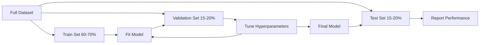

# Evaluasi Model

> Sebuah model hanya akan bagus jika cara kamu mengukurnya.

**Type:** Build
**Language:** Python
**Prerequisites:** Fase 1 (Probability & Distributions, Statistik untuk ML), Fase 2 Lesson 1-8
**Waktu:** ~90 menit

## Tujuan Pembelajaran

- Menerapkan validasi silang K-fold dan stratified K-fold dari awal dan menjelaskan mengapa stratifikasi penting untuk data yang tidak seimbang
- Hitung metrik presisi, perolehan, F1, AUC-ROC, dan regresi (MSE, RMSE, MAE, R-squared) dari awal
- Menafsirkan kurva pembelajaran untuk mendiagnosis apakah suatu model mempunyai bias tinggi atau varian tinggi
- Identifikasi kesalahan evaluasi umum termasuk kebocoran data, pemilihan metrik yang salah, dan kontaminasi set pengujian

## Masalah

kamu melatih seorang model. Ini mendapat akurasi 95% pada data kamu. Apakah itu bagus?

Mungkin. Mungkin tidak. Jika 95% data kamu termasuk dalam satu kelas, model yang selalu memprediksi kelas tersebut mendapatkan akurasi 95% namun sama sekali tidak berguna. Jika kamu mengevaluasi data yang sama dengan yang kamu latih, angka 95% tidak ada artinya karena model hanya mengingat jawabannya. Jika dataset kamu memiliki komponen waktu dan kamu mengacaknya secara acak sebelum memisahkannya, model kamu mungkin menggunakan data masa depan untuk memprediksi masa lalu.

Evaluasi model adalah tempat di mana sebagian besar proyek ML mengalami kesalahan. Metrik yang salah membuat model yang buruk terlihat bagus. Pemisahan yang salah memungkinkan model berbuat curang. Perbandingan yang salah membuat kamu memilih model yang lebih buruk. Melakukan evaluasi dengan benar bukanlah suatu pilihan. Ini adalah perbedaan antara model yang berfungsi dalam produksi dan model yang gagal saat melihat data sebenarnya.

## Konsep

### Training, Validasi, Tes



Tiga perpecahan, tiga tujuan:

- **Set training**: model belajar dari data ini. Ia melihat contoh-contoh ini selama training.
- **Kumpulan validasi**: digunakan untuk menyesuaikan hyperparameter dan memilih antar model. Model tidak pernah melatih data ini, tetapi keputusan kamu dipengaruhi oleh data tersebut.
- **Set pengujian**: disentuh tepat satu kali, di bagian paling akhir, untuk melaporkan kinerja akhir. Jika kamu melihat kinerja pengujian dan kemudian kembali mengubah model kamu, ini bukan lagi set pengujian. Ini telah menjadi set validasi kedua.

Set pengujian adalah jaminan kamu bahwa kinerja yang dilaporkan mencerminkan kinerja model pada data yang benar-benar tidak terlihat.

### Validasi Silang K-Fold

Dengan dataset yang kecil, satu rangkaian training/validasi akan membuang-buang data dan menghasilkan estimasi yang berisik. Validasi silang K-fold menggunakan semua data untuk training dan validasi:

```mermaid
flowchart TB
    subgraph Fold1["Fold 1"]
        direction LR
        V1["Val"] --- T1a["Train"] --- T1b["Train"] --- T1c["Train"] --- T1d["Train"]
    end
    subgraph Fold2["Fold 2"]
        direction LR
        T2a["Train"] --- V2["Val"] --- T2b["Train"] --- T2c["Train"] --- T2d["Train"]
    end
    subgraph Fold3["Fold 3"]
        direction LR
        T3a["Train"] --- T3b["Train"] --- V3["Val"] --- T3c["Train"] --- T3d["Train"]
    end
    subgraph Fold4["Fold 4"]
        direction LR
        T4a["Train"] --- T4b["Train"] --- T4c["Train"] --- V4["Val"] --- T4d["Train"]
    end
    subgraph Fold5["Fold 5"]
        direction LR
        T5a["Train"] --- T5b["Train"] --- T5c["Train"] --- T5d["Train"] --- V5["Val"]
    end
    Fold1 --> R["Average scores"]
    Fold2 --> R
    Fold3 --> R
    Fold4 --> R
    Fold5 --> R
```



1. Bagi data menjadi K lipatan yang berukuran sama
2. Untuk setiap lipatan, latih lipatan K-1 dan validasi pada lipatan sisanya
3. Rata-rata skor validasi K

K=5 atau K=10 adalah pilihan standar. Setiap titik data digunakan untuk validasi tepat satu kali. Skor rata-rata adalah perkiraan yang lebih stabil dibandingkan pembagian tunggal apa pun.

**K-fold bertingkat**: mempertahankan distribusi kelas di setiap lipatan. Jika dataset kamu adalah 70% kelas A dan 30% kelas B, setiap lipatan akan memiliki rasio yang kira-kira sama. Hal ini penting untuk dataset yang tidak seimbang karena pemisahan acak dapat menempatkan semua sample minoritas dalam satu kelompok.

### Metrik Klasifikasi

**Matrix perplexity**: fondasinya. Untuk klasifikasi biner:

|  | Diprediksi Positif | Prediksi Negatif |
|--|---|---|
| Sebenarnya Positif | Benar Positif (TP) | Negatif Palsu (FN) |
| Sebenarnya Negatif | Positif Palsu (FP) | Negatif Benar (TN) |

Dari matrix ini, semua metrik lainnya mengikuti:- **Akurasi** = (TP + TN) / (TP + TN + FP + FN). Sebagian dari prediksi yang benar. Menyesatkan ketika kelas tidak seimbang.
- **Presisi** = TP / (TP + FP). Dari semua hal yang diprediksi positif, berapa banyak yang sebenarnya positif? Gunakan ketika kesalahan positif memerlukan biaya yang mahal (misalnya, filter spam yang menandai email asli sebagai spam).
- **Recall** (sensitivitas) = ​​TP / (TP + FN). Dari semua hal positif yang sebenarnya, berapa banyak yang berhasil kita tangkap? Gunakan ketika hasil negatif palsu mahal (misalnya, skrining kanker tidak menemukan tumor).
- **Skor F1** = 2 * presisi * recall / (presisi + recall). Arti harmonik dari presisi dan perolehan. Menyeimbangkan keduanya ketika tidak ada yang mendominasi dengan jelas.
- **AUC-ROC**: Area di bawah kurva Karakteristik Pengoperasian Penerima. Plot tingkat positif sebenarnya vs tingkat positif palsu pada berbagai ambang klasifikasi. AUC = 0,5 berarti tebakan acak, AUC = 1,0 berarti pemisahan sempurna. Tidak bergantung pada ambang batas (threshold-independent): model ini mengukur seberapa baik model memberi peringkat positif di atas negatif, terlepas dari batas yang kamu pilih.

### Metrik Regresi

- **MSE** (Mean Squared Error) = mean((y_true - y_pred)^2). Menghukum kesalahan besar secara kuadrat. Sensitif terhadap outlier.
- **RMSE** (Kesalahan Root Mean Squared) = sqrt(MSE). Unit yang sama dengan variabel target. Lebih mudah untuk ditafsirkan daripada UMK.
- **MAE** (Rata-rata Kesalahan Absolut) = mean(|y_true - y_pred|). Perlakukan semua kesalahan secara linear. Lebih tangguh terhadap outlier dibandingkan UMK.
- **R-squared** = 1 - SS_res / SS_tot, dengan SS_res = jumlah((y_true - y_pred)^2) dan SS_tot = jumlah((y_true - y_mean)^2). Fraksi varians dijelaskan oleh model. R^2 = 1,0 sempurna. R^2 = 0,0 berarti model tidak lebih baik dari selalu memprediksi mean. R^2 bisa negatif jika modelnya lebih buruk dari meannya.

### Kurva Pembelajaran

Plot training dan skor validasi sebagai fungsi dari ukuran set training:

- **Bias tinggi (underfitting)**: kedua kurva bertemu dan menghasilkan skor rendah. Menambahkan lebih banyak data tidak akan membantu. kamu memerlukan model yang lebih kompleks.
- **Varians tinggi (overfitting)**: skor training tinggi namun skor validasi jauh lebih rendah. Kesenjangan di antara mereka sangat besar. Menambahkan lebih banyak data akan membantu.

### Kurva Validasi

Training plot dan skor validasi sebagai fungsi hyperparameter:

- Pada kompleksitas rendah: kedua skornya rendah (underfitting)
- Pada kompleksitas yang tepat: kedua skor tinggi dan berdekatan
- Pada kompleksitas tinggi: skor training tetap tinggi tetapi skor validasi turun (overfitting)

Nilai hyperparameter optimal adalah saat skor validasi mencapai puncaknya.

### Kesalahan Umum dalam Evaluasi

**Kebocoran data**: informasi dari set pengujian bocor ke dalam training. Contoh: memasang scaler pada dataset lengkap sebelum pemisahan, termasuk data masa depan dalam prediksi deret waktu, menggunakan feature yang diturunkan dari target. Selalu pisahkan terlebih dahulu, lalu proses awal.

**Ketidakseimbangan kelas**: 99% transaksi sah, 1% adalah penipuan. Model yang selalu memprediksi "sah" mendapatkan akurasi 99%. Gunakan presisi, recall, F1, atau AUC-ROC sebagai gantinya.

**Metrik yang salah**: mengoptimalkan akurasi ketika kamu harus mengoptimalkan penarikan kembali (diagnosis medis), atau mengoptimalkan RMSE ketika data kamu memiliki outlier yang besar (sebagai gantinya gunakan MAE).

**Tidak menggunakan pemisahan bertingkat**: dengan data yang tidak seimbang, pemisahan acak mungkin menempatkan sangat sedikit sample minoritas dalam kelompok validasi, sehingga memberikan perkiraan yang tidak stabil.

**Menguji terlalu sering**: setiap kali kamu melihat performa pengujian dan melakukan penyesuaian, kamu menyesuaikan diri dengan set pengujian. Set tes ini sekali pakai.

## Build

### Langkah 1: Training/validasi/pemisahan pengujian

```python
import random
import math


def train_val_test_split(X, y, train_ratio=0.6, val_ratio=0.2, seed=42):
    random.seed(seed)
    n = len(X)
    indices = list(range(n))
    random.shuffle(indices)

    train_end = int(n * train_ratio)
    val_end = int(n * (train_ratio + val_ratio))

    train_idx = indices[:train_end]
    val_idx = indices[train_end:val_end]
    test_idx = indices[val_end:]

    X_train = [X[i] for i in train_idx]
    y_train = [y[i] for i in train_idx]
    X_val = [X[i] for i in val_idx]
    y_val = [y[i] for i in val_idx]
    X_test = [X[i] for i in test_idx]
    y_test = [y[i] for i in test_idx]

    return X_train, y_train, X_val, y_val, X_test, y_test
```

### Langkah 2: Validasi silang K-fold dan K-fold bertingkat```python
def kfold_split(n, k=5, seed=42):
    random.seed(seed)
    indices = list(range(n))
    random.shuffle(indices)

    fold_size = n // k
    folds = []

    for i in range(k):
        start = i * fold_size
        end = start + fold_size if i < k - 1 else n
        val_idx = indices[start:end]
        train_idx = indices[:start] + indices[end:]
        folds.append((train_idx, val_idx))

    return folds


def stratified_kfold_split(y, k=5, seed=42):
    random.seed(seed)

    class_indices = {}
    for i, label in enumerate(y):
        class_indices.setdefault(label, []).append(i)

    for label in class_indices:
        random.shuffle(class_indices[label])

    folds = [{"train": [], "val": []} for _ in range(k)]

    for label, indices in class_indices.items():
        fold_size = len(indices) // k
        for i in range(k):
            start = i * fold_size
            end = start + fold_size if i < k - 1 else len(indices)
            val_part = indices[start:end]
            train_part = indices[:start] + indices[end:]
            folds[i]["val"].extend(val_part)
            folds[i]["train"].extend(train_part)

    return [(f["train"], f["val"]) for f in folds]


def cross_validate(X, y, model_fn, k=5, metric_fn=None, stratified=False):
    n = len(X)

    if stratified:
        folds = stratified_kfold_split(y, k)
    else:
        folds = kfold_split(n, k)

    scores = []
    for train_idx, val_idx in folds:
        X_train = [X[i] for i in train_idx]
        y_train = [y[i] for i in train_idx]
        X_val = [X[i] for i in val_idx]
        y_val = [y[i] for i in val_idx]

        model = model_fn()
        model.fit(X_train, y_train)
        predictions = [model.predict(x) for x in X_val]

        if metric_fn:
            score = metric_fn(y_val, predictions)
        else:
            score = sum(1 for yt, yp in zip(y_val, predictions) if yt == yp) / len(y_val)
        scores.append(score)

    return scores
```

### Langkah 3: Matrix perplexity dan metrik klasifikasi

```python
def confusion_matrix(y_true, y_pred):
    tp = sum(1 for yt, yp in zip(y_true, y_pred) if yt == 1 and yp == 1)
    tn = sum(1 for yt, yp in zip(y_true, y_pred) if yt == 0 and yp == 0)
    fp = sum(1 for yt, yp in zip(y_true, y_pred) if yt == 0 and yp == 1)
    fn = sum(1 for yt, yp in zip(y_true, y_pred) if yt == 1 and yp == 0)
    return tp, tn, fp, fn


def accuracy(y_true, y_pred):
    tp, tn, fp, fn = confusion_matrix(y_true, y_pred)
    total = tp + tn + fp + fn
    return (tp + tn) / total if total > 0 else 0.0


def precision(y_true, y_pred):
    tp, tn, fp, fn = confusion_matrix(y_true, y_pred)
    return tp / (tp + fp) if (tp + fp) > 0 else 0.0


def recall(y_true, y_pred):
    tp, tn, fp, fn = confusion_matrix(y_true, y_pred)
    return tp / (tp + fn) if (tp + fn) > 0 else 0.0


def f1_score(y_true, y_pred):
    p = precision(y_true, y_pred)
    r = recall(y_true, y_pred)
    return 2 * p * r / (p + r) if (p + r) > 0 else 0.0


def roc_curve(y_true, y_scores):
    thresholds = sorted(set(y_scores), reverse=True)
    tpr_list = []
    fpr_list = []

    total_positives = sum(y_true)
    total_negatives = len(y_true) - total_positives

    for threshold in thresholds:
        y_pred = [1 if s >= threshold else 0 for s in y_scores]
        tp = sum(1 for yt, yp in zip(y_true, y_pred) if yt == 1 and yp == 1)
        fp = sum(1 for yt, yp in zip(y_true, y_pred) if yt == 0 and yp == 1)

        tpr = tp / total_positives if total_positives > 0 else 0.0
        fpr = fp / total_negatives if total_negatives > 0 else 0.0

        tpr_list.append(tpr)
        fpr_list.append(fpr)

    return fpr_list, tpr_list, thresholds


def auc_roc(y_true, y_scores):
    fpr_list, tpr_list, _ = roc_curve(y_true, y_scores)

    pairs = sorted(zip(fpr_list, tpr_list))
    fpr_sorted = [p[0] for p in pairs]
    tpr_sorted = [p[1] for p in pairs]

    area = 0.0
    for i in range(1, len(fpr_sorted)):
        width = fpr_sorted[i] - fpr_sorted[i - 1]
        height = (tpr_sorted[i] + tpr_sorted[i - 1]) / 2
        area += width * height

    return area
```

### Langkah 4: Metrik regresi

```python
def mse(y_true, y_pred):
    n = len(y_true)
    return sum((yt - yp) ** 2 for yt, yp in zip(y_true, y_pred)) / n


def rmse(y_true, y_pred):
    return math.sqrt(mse(y_true, y_pred))


def mae(y_true, y_pred):
    n = len(y_true)
    return sum(abs(yt - yp) for yt, yp in zip(y_true, y_pred)) / n


def r_squared(y_true, y_pred):
    mean_y = sum(y_true) / len(y_true)
    ss_res = sum((yt - yp) ** 2 for yt, yp in zip(y_true, y_pred))
    ss_tot = sum((yt - mean_y) ** 2 for yt in y_true)
    if ss_tot == 0:
        return 0.0
    return 1.0 - ss_res / ss_tot
```

### Langkah 5: Kurva pembelajaran

```python
def learning_curve(X, y, model_fn, metric_fn, train_sizes=None, val_ratio=0.2, seed=42):
    random.seed(seed)
    n = len(X)
    indices = list(range(n))
    random.shuffle(indices)

    val_size = int(n * val_ratio)
    val_idx = indices[:val_size]
    pool_idx = indices[val_size:]

    X_val = [X[i] for i in val_idx]
    y_val = [y[i] for i in val_idx]

    if train_sizes is None:
        train_sizes = [int(len(pool_idx) * r) for r in [0.1, 0.2, 0.4, 0.6, 0.8, 1.0]]

    train_scores = []
    val_scores = []

    for size in train_sizes:
        subset = pool_idx[:size]
        X_train = [X[i] for i in subset]
        y_train = [y[i] for i in subset]

        model = model_fn()
        model.fit(X_train, y_train)

        train_pred = [model.predict(x) for x in X_train]
        val_pred = [model.predict(x) for x in X_val]

        train_scores.append(metric_fn(y_train, train_pred))
        val_scores.append(metric_fn(y_val, val_pred))

    return train_sizes, train_scores, val_scores
```

### Langkah 6: Pengklasifikasi sederhana untuk pengujian, ditambah demo lengkap

```python
class SimpleLogistic:
    def __init__(self, lr=0.1, epochs=100):
        self.lr = lr
        self.epochs = epochs
        self.weights = None
        self.bias = 0.0

    def sigmoid(self, z):
        z = max(-500, min(500, z))
        return 1.0 / (1.0 + math.exp(-z))

    def fit(self, X, y):
        n_features = len(X[0])
        self.weights = [0.0] * n_features
        self.bias = 0.0

        for _ in range(self.epochs):
            for xi, yi in zip(X, y):
                z = sum(w * x for w, x in zip(self.weights, xi)) + self.bias
                pred = self.sigmoid(z)
                error = yi - pred
                for j in range(n_features):
                    self.weights[j] += self.lr * error * xi[j]
                self.bias += self.lr * error

    def predict_proba(self, x):
        z = sum(w * xi for w, xi in zip(self.weights, x)) + self.bias
        return self.sigmoid(z)

    def predict(self, x):
        return 1 if self.predict_proba(x) >= 0.5 else 0


class SimpleLinearRegression:
    def __init__(self, lr=0.001, epochs=200):
        self.lr = lr
        self.epochs = epochs
        self.weights = None
        self.bias = 0.0

    def fit(self, X, y):
        n_features = len(X[0])
        self.weights = [0.0] * n_features
        self.bias = 0.0
        n = len(X)

        for _ in range(self.epochs):
            for xi, yi in zip(X, y):
                pred = sum(w * x for w, x in zip(self.weights, xi)) + self.bias
                error = yi - pred
                for j in range(n_features):
                    self.weights[j] += self.lr * error * xi[j] / n
                self.bias += self.lr * error / n

    def predict(self, x):
        return sum(w * xi for w, xi in zip(self.weights, x)) + self.bias


def standardize(values):
    n = len(values)
    mean = sum(values) / n
    var = sum((v - mean) ** 2 for v in values) / n
    std = math.sqrt(var) if var > 0 else 1.0
    return [(v - mean) / std for v in values], mean, std


def make_classification_data(n=300, seed=42):
    random.seed(seed)
    X = []
    y = []
    for _ in range(n):
        x1 = random.gauss(0, 1)
        x2 = random.gauss(0, 1)
        label = 1 if (x1 + x2 + random.gauss(0, 0.5)) > 0 else 0
        X.append([x1, x2])
        y.append(label)
    return X, y


def make_regression_data(n=200, seed=42):
    random.seed(seed)
    X = []
    y = []
    for _ in range(n):
        x1 = random.uniform(0, 10)
        x2 = random.uniform(0, 5)
        target = 3 * x1 + 2 * x2 + random.gauss(0, 2)
        X.append([x1, x2])
        y.append(target)
    return X, y


def make_imbalanced_data(n=300, minority_ratio=0.05, seed=42):
    random.seed(seed)
    X = []
    y = []
    for _ in range(n):
        if random.random() < minority_ratio:
            x1 = random.gauss(3, 0.5)
            x2 = random.gauss(3, 0.5)
            label = 1
        else:
            x1 = random.gauss(0, 1)
            x2 = random.gauss(0, 1)
            label = 0
        X.append([x1, x2])
        y.append(label)
    return X, y


if __name__ == "__main__":
    X_clf, y_clf = make_classification_data(300)

    print("=== Train/Validation/Test Split ===")
    X_train, y_train, X_val, y_val, X_test, y_test = train_val_test_split(X_clf, y_clf)
    print(f"  Train: {len(X_train)}, Val: {len(X_val)}, Test: {len(X_test)}")
    print(f"  Train class distribution: {sum(y_train)}/{len(y_train)} positive")
    print(f"  Val class distribution: {sum(y_val)}/{len(y_val)} positive")

    model = SimpleLogistic(lr=0.1, epochs=200)
    model.fit(X_train, y_train)

    print("\n=== Classification Metrics ===")
    y_pred = [model.predict(x) for x in X_test]
    tp, tn, fp, fn = confusion_matrix(y_test, y_pred)
    print(f"  Confusion matrix: TP={tp}, TN={tn}, FP={fp}, FN={fn}")
    print(f"  Accuracy:  {accuracy(y_test, y_pred):.4f}")
    print(f"  Precision: {precision(y_test, y_pred):.4f}")
    print(f"  Recall:    {recall(y_test, y_pred):.4f}")
    print(f"  F1 Score:  {f1_score(y_test, y_pred):.4f}")

    y_scores = [model.predict_proba(x) for x in X_test]
    auc = auc_roc(y_test, y_scores)
    print(f"  AUC-ROC:   {auc:.4f}")

    print("\n=== K-Fold Cross-Validation (K=5) ===")
    cv_scores = cross_validate(
        X_clf, y_clf,
        model_fn=lambda: SimpleLogistic(lr=0.1, epochs=200),
        k=5,
        metric_fn=accuracy,
    )
    mean_cv = sum(cv_scores) / len(cv_scores)
    std_cv = math.sqrt(sum((s - mean_cv) ** 2 for s in cv_scores) / len(cv_scores))
    print(f"  Fold scores: {[round(s, 4) for s in cv_scores]}")
    print(f"  Mean: {mean_cv:.4f} (+/- {std_cv:.4f})")

    print("\n=== Stratified K-Fold Cross-Validation (K=5) ===")
    strat_scores = cross_validate(
        X_clf, y_clf,
        model_fn=lambda: SimpleLogistic(lr=0.1, epochs=200),
        k=5,
        metric_fn=accuracy,
        stratified=True,
    )
    strat_mean = sum(strat_scores) / len(strat_scores)
    strat_std = math.sqrt(sum((s - strat_mean) ** 2 for s in strat_scores) / len(strat_scores))
    print(f"  Fold scores: {[round(s, 4) for s in strat_scores]}")
    print(f"  Mean: {strat_mean:.4f} (+/- {strat_std:.4f})")

    print("\n=== Imbalanced Data: Why Accuracy Lies ===")
    X_imb, y_imb = make_imbalanced_data(300, minority_ratio=0.05)
    positives = sum(y_imb)
    print(f"  Class distribution: {positives} positive, {len(y_imb) - positives} negative ({positives/len(y_imb)*100:.1f}% positive)")

    always_negative = [0] * len(y_imb)
    print(f"  Always-negative baseline:")
    print(f"    Accuracy:  {accuracy(y_imb, always_negative):.4f}")
    print(f"    Precision: {precision(y_imb, always_negative):.4f}")
    print(f"    Recall:    {recall(y_imb, always_negative):.4f}")
    print(f"    F1 Score:  {f1_score(y_imb, always_negative):.4f}")

    X_tr_i, y_tr_i, X_v_i, y_v_i, X_te_i, y_te_i = train_val_test_split(X_imb, y_imb)
    model_imb = SimpleLogistic(lr=0.5, epochs=500)
    model_imb.fit(X_tr_i, y_tr_i)
    y_pred_imb = [model_imb.predict(x) for x in X_te_i]
    print(f"\n  Trained model on imbalanced data:")
    print(f"    Accuracy:  {accuracy(y_te_i, y_pred_imb):.4f}")
    print(f"    Precision: {precision(y_te_i, y_pred_imb):.4f}")
    print(f"    Recall:    {recall(y_te_i, y_pred_imb):.4f}")
    print(f"    F1 Score:  {f1_score(y_te_i, y_pred_imb):.4f}")

    print("\n=== Regression Metrics ===")
    X_reg, y_reg = make_regression_data(200)

    col0 = [x[0] for x in X_reg]
    col1 = [x[1] for x in X_reg]
    col0_s, m0, s0 = standardize(col0)
    col1_s, m1, s1 = standardize(col1)
    X_reg_scaled = [[col0_s[i], col1_s[i]] for i in range(len(X_reg))]

    X_tr_r, y_tr_r, X_v_r, y_v_r, X_te_r, y_te_r = train_val_test_split(X_reg_scaled, y_reg)
    reg_model = SimpleLinearRegression(lr=0.01, epochs=500)
    reg_model.fit(X_tr_r, y_tr_r)
    y_pred_r = [reg_model.predict(x) for x in X_te_r]

    print(f"  MSE:       {mse(y_te_r, y_pred_r):.4f}")
    print(f"  RMSE:      {rmse(y_te_r, y_pred_r):.4f}")
    print(f"  MAE:       {mae(y_te_r, y_pred_r):.4f}")
    print(f"  R-squared: {r_squared(y_te_r, y_pred_r):.4f}")

    mean_baseline = [sum(y_tr_r) / len(y_tr_r)] * len(y_te_r)
    print(f"\n  Mean baseline:")
    print(f"    MSE:       {mse(y_te_r, mean_baseline):.4f}")
    print(f"    R-squared: {r_squared(y_te_r, mean_baseline):.4f}")

    print("\n=== Learning Curve ===")
    sizes, train_sc, val_sc = learning_curve(
        X_clf, y_clf,
        model_fn=lambda: SimpleLogistic(lr=0.1, epochs=200),
        metric_fn=accuracy,
    )
    print(f"  {'Size':>6} {'Train':>8} {'Val':>8}")
    for s, tr, va in zip(sizes, train_sc, val_sc):
        print(f"  {s:>6} {tr:>8.4f} {va:>8.4f}")

    print("\n=== Statistical Model Comparison ===")
    model_a_scores = cross_validate(
        X_clf, y_clf,
        model_fn=lambda: SimpleLogistic(lr=0.1, epochs=100),
        k=5, metric_fn=accuracy,
    )
    model_b_scores = cross_validate(
        X_clf, y_clf,
        model_fn=lambda: SimpleLogistic(lr=0.1, epochs=500),
        k=5, metric_fn=accuracy,
    )
    diffs = [a - b for a, b in zip(model_a_scores, model_b_scores)]
    mean_diff = sum(diffs) / len(diffs)
    std_diff = math.sqrt(sum((d - mean_diff) ** 2 for d in diffs) / len(diffs))
    t_stat = mean_diff / (std_diff / math.sqrt(len(diffs))) if std_diff > 0 else 0.0
    print(f"  Model A (100 epochs) mean: {sum(model_a_scores)/len(model_a_scores):.4f}")
    print(f"  Model B (500 epochs) mean: {sum(model_b_scores)/len(model_b_scores):.4f}")
    print(f"  Mean difference: {mean_diff:.4f}")
    print(f"  Paired t-statistic: {t_stat:.4f}")
    print(f"  (|t| > 2.78 for significance at p<0.05 with df=4)")
```

## Pakai

Dengan scikit-learn, evaluasi dimasukkan ke dalam alur kerja:

```python
from sklearn.model_selection import cross_val_score, StratifiedKFold, learning_curve
from sklearn.metrics import (
    accuracy_score, precision_score, recall_score, f1_score,
    roc_auc_score, confusion_matrix, mean_squared_error, r2_score,
)
from sklearn.linear_model import LogisticRegression

model = LogisticRegression()
scores = cross_val_score(model, X, y, cv=StratifiedKFold(5), scoring="f1")
```

Versi dari awal menunjukkan dengan tepat apa yang dilakukan validasi silang (tidak ada keajaiban, hanya for-loop dan pelacakan indeks), bagaimana setiap metrik dihitung (hanya menghitung TP/FP/TN/FN), dan mengapa stratifikasi penting (mempertahankan rasio kelas di setiap lipatan). Versi perpustakaan menambahkan paralelisme, lebih banyak opsi penilaian, dan integrasi dengan pipeline pipa.

## Kirim

Lesson ini menghasilkan:
- `outputs/skill-evaluation.md` - keterampilan yang mencakup strategi evaluasi untuk model klasifikasi dan regresi

## Latihan

1. Menerapkan kurva perolehan presisi: memplot presisi vs perolehan pada ambang batas yang berbeda. Hitung presisi rata-rata (area di bawah kurva PR). Bandingkan kurva PR dengan kurva ROC pada dataset yang tidak seimbang dan jelaskan kapan masing-masing kurva lebih informatif.
2. Buat loop validasi silang bertingkat: loop luar mengevaluasi performa model, loop dalam menyetel hyperparameter. Gunakan ini untuk membandingkan dua model secara adil tanpa membocorkan data validasi ke dalam evaluasi.
3. Menerapkan uji permutasi untuk perbandingan model: mengacak label, melatih ulang, dan mengukur kinerja. Ulangi 100 kali untuk membangun distribusi nol. Hitung nilai p untuk kinerja model yang diamati terhadap distribusi ini.

## Istilah Kunci

| Istilah | Apa kata orang | Apa sebenarnya arti |
|------|----------------|----------------------|
| Keterlaluan | "Menghafal training data" | Model ini menangkap gangguan dalam training data, berperforma baik pada training tetapi buruk pada data yang tidak terlihat |
| Validasi silang | "Menguji pada subset yang berbeda" | Memutar secara sistematis bagian data mana yang digunakan untuk validasi, merata-ratakan hasil di semua rotasi |
| Presisi | "Berapa banyak prediksi positif yang benar" | TP / (TP + FP) : pecahan prediksi positif yang sebenarnya positif |
| Ingat | "Berapa banyak hal positif aktual yang kami temukan" | TP / (TP + FN): pecahan positif aktual yang diidentifikasi dengan benar |
| AUC-ROC | "Seberapa baik model memisahkan kelas" | Area di bawah kurva tingkat positif sebenarnya vs tingkat positif palsu di seluruh ambang batas, dari 0,5 (acak) hingga 1,0 (sempurna) |
| R-kuadrat | "Berapa banyak explained variance" | 1 - (jumlah sisa kuadrat / jumlah total kuadrat): pecahan varians target yang ditangkap oleh model |
| Kebocoran data | "Modelnya curang" | Menggunakan informasi selama training yang tidak tersedia pada waktu prediksi, mengarah pada evaluasi optimis |
| Kurva belajar | "Bagaimana kinerja berubah dengan lebih banyak data" | Plot skor training dan validasi vs ukuran set training, yang menunjukkan underfitting atau overfitting |
| Perpecahan bertingkat | "Menjaga rasio kelas tetap seimbang" | Memisahkan data sehingga setiap subset memiliki proporsi yang sama di setiap kelas dengan dataset lengkap |

## Bacaan Lanjutan- [Panduan Pemilihan Model scikit-learn](https://scikit-learn.org/stable/model_selection.html) - referensi komprehensif tentang validasi silang, metrik, dan penyetelan hyperparameter
- [Melampaui Akurasi: Presisi dan Perolehan Kembali (Kursus Singkat Google ML)](https://developers.google.com/machine-learning/crash-course/classification/precision-and-recall) - penjelasan jelas dengan contoh interaktif
- [Survei Prosedur Validasi Silang (Arlot & Celisse, 2010)](https://projecteuclid.org/journals/statistics-surveys/volume-4/issue-none/A-survey-of-cross-validation-procedures-for-model-selection/10.1214/09-SS054.full) - pembahasan yang cermat mengenai kapan dan mengapa berbagai strategi CV berhasil
