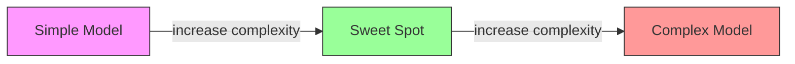
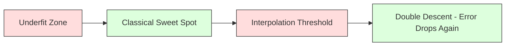
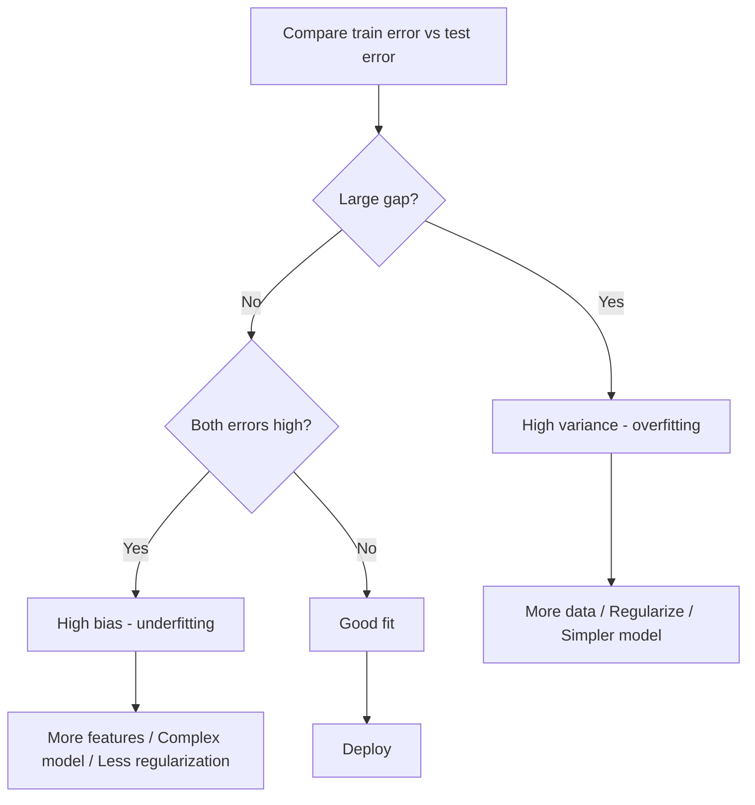
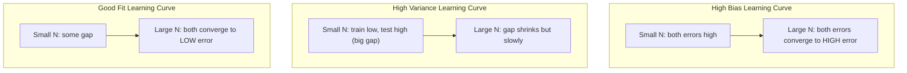
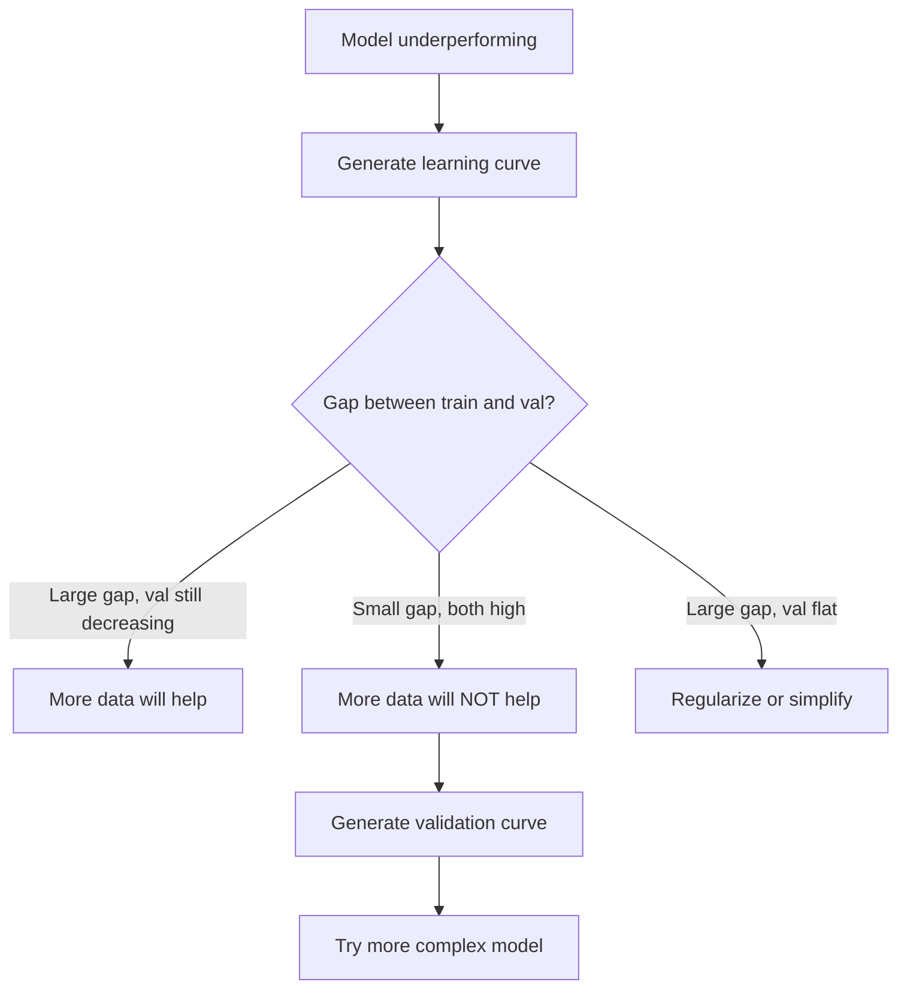

# Pengorbanan Bias-Varians

> Setiap kesalahan model berasal dari salah satu dari tiga sumber: bias, varians, atau noise. kamu hanya dapat mengontrol dua yang pertama.

**Type:** Learn
**Language:** Python
**Prerequisites:** Phase 2, Lesson 01-09 (dasar-dasar ML, regresi, klasifikasi, evaluasi)
**Waktu:** ~75 menit

## Tujuan Pembelajaran

- Turunkan decomposition bias-varians dari kesalahan prediksi yang diharapkan dan jelaskan peran kebisingan yang tidak dapat direduksi
- Mendiagnosis apakah suatu model mengalami bias tinggi atau varian tinggi menggunakan pola kesalahan training dan pengujian
- Jelaskan bagaimana teknik regularisasi (L1, L2, dropout, penghentian awal) memperdagangkan bias untuk varians
- Menerapkan eksperimen yang memvisualisasikan tradeoff bias-varians di seluruh model dengan kompleksitas yang semakin meningkat

## Masalah

kamu melatih seorang model. Ada beberapa kesalahan pada data pengujian. Dari mana kesalahan itu berasal?

Jika model kamu terlalu sederhana (regresi linier pada dataset melengkung), model tersebut akan selalu kehilangan pola sebenarnya. Itu bias. Jika model kamu terlalu kompleks (polinomial derajat 20 pada 15 titik data), model tersebut akan sangat cocok dengan training data tetapi memberikan prediksi yang sangat berbeda pada data baru. Itu adalah varians.

kamu tidak dapat meminimalkan keduanya sekaligus untuk kapasitas model tetap. Tekan bias ke bawah dan varians naik. Dorong varians ke bawah dan bias meningkat. Memahami tradeoff ini adalah satu-satunya keterampilan diagnostik yang paling berguna dalam machine learning. Ini memberi tahu kamu apakah akan membuat model kamu lebih kompleks atau kurang kompleks, apakah akan mendapatkan lebih banyak data atau merekayasa feature yang lebih baik, apakah akan mengatur lebih banyak atau lebih sedikit.

## Konsep

### Bias: Kesalahan Sistematis

Bias mengukur seberapa jauh perbedaan prediksi rata-rata model kamu dari nilai sebenarnya. Jika kamu melatih model yang sama pada banyak set training berbeda yang diambil dari distribusi yang sama dan membuat rata-rata prediksinya, bias adalah kesenjangan antara rata-rata tersebut dan kebenarannya.

Bias yang tinggi berarti model terlalu kaku untuk menangkap pola sebenarnya. Garis lurus yang sesuai dengan parabola akan selalu meleset dari kurva, tidak peduli berapa banyak data yang kamu berikan. Ini tidak sesuai.

```
High bias (underfitting):
  Model always predicts roughly the same wrong thing.
  Training error: HIGH
  Test error: HIGH
  Gap between them: SMALL
```

### Varians: Sensitivitas terhadap Data Training

Varians mengukur seberapa besar perubahan prediksi kamu saat kamu berlatih pada subset data yang berbeda. Jika perubahan kecil pada set training menyebabkan perubahan besar pada model, maka variansnya tinggi.

Varians yang tinggi berarti model tersebut menyesuaikan noise pada training data, bukan sinyal yang mendasarinya. Polinomial derajat-20 akan melewati setiap titik training tetapi berosilasi liar di antara titik-titik tersebut. Ini berlebihan.

```
High variance (overfitting):
  Model fits training data perfectly but fails on new data.
  Training error: LOW
  Test error: HIGH
  Gap between them: LARGE
```

### Decomposition

Untuk setiap titik x, kesalahan prediksi yang diharapkan pada loss kuadrat terurai secara tepat:

```
Expected Error = Bias^2 + Variance + Irreducible Noise

where:
  Bias^2   = (E[f_hat(x)] - f(x))^2
  Variance = E[(f_hat(x) - E[f_hat(x)])^2]
  Noise    = E[(y - f(x))^2]             (sigma^2)
```

- `f(x)` adalah fungsi sebenarnya
- `f_hat(x)` adalah prediksi model kamu
- `E[...]` adalah ekspektasi atas rangkaian training yang berbeda
- `y` adalah label yang diamati (fungsi sebenarnya ditambah noise)

Istilah kebisingan tidak dapat direduksi. Tidak ada model yang dapat memberikan kinerja lebih baik daripada sigma^2 pada data yang berisik. Tugas kamu adalah menemukan keseimbangan yang tepat antara bias^2 dan varians.

### Kompleksitas Model vs Kesalahan



Kurva klasik berbentuk U:

| Kompleksitas | Bias | Varians | Jumlah Kesalahan |
|-----------|------|----------|-------------|
| Terlalu rendah | TINGGI | RENDAH | TINGGI (kurang pas) |
| Akurat | SEDANG | SEDANG | TERENDAH |
| Terlalu tinggi | RENDAH | TINGGI | TINGGI (overfitting) |

### Regularisasi sebagai Kontrol Bias-VariansRegularisasi sengaja meningkatkan bias untuk mengurangi varians. Ini membatasi model sehingga tidak bisa mengejar kebisingan.

- **L2 (Ridge):** Menyusut semua weight menuju nol. Mempertahankan semua feature namun mengurangi pengaruhnya.
- **L1 (Lasso):** Mendorong beberapa weight tepat ke nol. Melakukan pemilihan feature.
- **Dropout:** Menonaktifkan neuron secara acak selama training. Memaksa representasi yang berlebihan.
- **Penghentian awal:** Menghentikan training sebelum model sepenuhnya sesuai dengan training data.

Kekuatan regularisasi (lambda, tingkat putus sekolah, jumlah zaman) secara langsung mengontrol posisi kamu pada kurva bias-varians. Lebih banyak regularisasi berarti lebih banyak bias, lebih sedikit varians.

### Keturunan Ganda: Perspektif Modern

Teori klasik mengatakan: setelah sweet spot, kompleksitas yang lebih besar selalu merugikan. Namun penelitian sejak 2019 menunjukkan sesuatu yang tidak terduga. Jika kamu terus meningkatkan kapasitas model jauh melampaui ambang batas interpolasi (saat model memiliki cukup parameter untuk menyesuaikan training data dengan sempurna), kesalahan pengujian dapat berkurang lagi.



Fenomena "keturunan ganda" ini menjelaskan mengapa neural network dengan parameter berlebih (dengan parameter yang jauh lebih banyak daripada contoh training) masih dapat digeneralisasi dengan baik. Pertukaran bias-varians klasik tidaklah salah, namun tidak lengkap bagi rezim modern.

Pengamatan penting tentang keturunan ganda:
- Ini terjadi pada model linier, pohon keputusan, dan neural network
- Lebih banyak data sebenarnya dapat merugikan di wilayah interpolasi (penurunan ganda berdasarkan sample)
- Semakin banyak periode training dapat menyebabkannya juga (keturunan ganda berdasarkan periode)
- Regularisasi menghaluskan puncak tetapi tidak menghilangkannya

Mengapa ini terjadi? Pada ambang batas interpolasi, model memiliki kapasitas yang cukup untuk memenuhi semua titik training. Hal ini dipaksakan ke dalam solusi yang sangat spesifik yang merangkai setiap titik, dan gangguan kecil pada data menyebabkan perubahan besar pada kecocokan. Di sinilah varians mencapai puncaknya. Melewati ambang batas, model memiliki banyak kemungkinan solusi yang sesuai dengan data dengan sempurna. Algoritme pembelajaran (misalnya, gradient descent dengan regularisasi implisit) cenderung memilih yang paling sederhana di antara algoritma tersebut. Bias implisit terhadap solusi sederhana inilah yang menyebabkan model dengan parameter berlebihan digeneralisasi.

| Rezim | Parameter vs Sample | Perilaku |
|--------|----------------------|----------|
| Diremehkan | hal << n | Pengorbanan klasik berlaku |
| Ambang batas interpolasi | p ~ n | Varians memuncak, lonjakan kesalahan pengujian |
| Berparameter berlebihan | p >> n | Regularisasi implisit dimulai, kesalahan pengujian menurun |

Untuk tujuan praktis: jika kamu menggunakan neural network atau kumpulan pohon besar, jangan berhenti pada ambang batas interpolasi. Tetap jauh di bawahnya (dengan regularisasi eksplisit) atau lewati saja. Tempat terburuk adalah tepat di ambang pintu.

### Mendiagnosis Model kamu



| Gejala | Diagnosa | Perbaiki |
|---------|-----------|-----|
| Kesalahan kereta tinggi, kesalahan pengujian tinggi | Bias | Lebih banyak feature, model kompleks, lebih sedikit regularisasi |
| Kesalahan kereta rendah, kesalahan pengujian tinggi | Varians | Lebih banyak data, regularisasi, model lebih sederhana, dropout |
| Kesalahan kereta rendah, kesalahan pengujian rendah | Cocok | Kirim |
| Kesalahan kereta berkurang, kesalahan pengujian meningkat | Overfitting sedang berlangsung | Berhenti lebih awal |

### Strategi Praktis

**Ketika bias menjadi masalahnya:**
- Tambahkan feature polinomial atau interaksi
- Gunakan model yang lebih fleksibel (ansambel pohon, bukan linier)
- Mengurangi kekuatan regularisasi
- Berlatih lebih lama (bila belum konvergen)**Ketika varians menjadi masalah:**
- Dapatkan lebih banyak training data
- Gunakan bagging (hutan acak)
- Tingkatkan regularisasi (lambda lebih tinggi, lebih banyak dropout)
- Pemilihan feature (menghilangkan feature berisik)
- Gunakan validasi silang untuk mendeteksinya sejak dini

### Metode Ensemble dan Pengurangan Varians

Metode ansambel adalah alat yang paling praktis untuk melawan varians.

**Bagging (Bootstrap Aggregating)** melatih beberapa model pada sample bootstrap berbeda dari training data, lalu membuat rata-rata prediksinya. Masing-masing model mempunyai varian yang tinggi, namun rata-rata memiliki varian yang jauh lebih rendah. Hutan acak diterapkan pada pohon keputusan.

Mengapa ini bekerja secara matematis: jika kamu membuat rata-rata N prediksi independen, masing-masing dengan varians sigma^2, varians rata-ratanya adalah sigma^2 / N. Model tersebut tidak benar-benar independen (semuanya melihat data yang serupa), sehingga pengurangannya kurang dari 1/N, namun tetap substansial.

**Peningkatan** mengurangi bias dengan membuat model secara berurutan, dengan setiap model baru berfokus pada kesalahan ansambel sejauh ini. Peningkatan gradient dan AdaBoost adalah contoh utamanya. Peningkatan dapat menyebabkan overfit jika kamu menambahkan terlalu banyak model, sehingga kamu memerlukan penghentian atau regularisasi lebih awal.

| Metode | Efek Utama | Perubahan Bias | Perubahan Varians |
|--------|---------------|-------------|-----------------|
| mengantongi | Mengurangi varians | Tidak ada perubahan | Menurun |
| Meningkatkan | Mengurangi bias | Menurun | Dapat meningkatkan |
| Penumpukan | Mengurangi keduanya | Tergantung pada meta-pelajar | Tergantung pada model dasar |
| Putus sekolah | Mengantongi implisit | Sedikit peningkatan | Menurun |

**Aturan praktis:** jika model dasar kamu memiliki varian tinggi (pohon dalam, polinomial derajat tinggi), gunakan bagging. Jika model dasar kamu memiliki bias tinggi (tunggul dangkal, model linier sederhana), gunakan peningkatan.

### Kurva Pembelajaran

Kurva pembelajaran memplot training dan kesalahan validasi sebagai fungsi dari ukuran set training. Ini adalah alat diagnostik paling praktis yang kamu miliki. Berbeda dengan perbandingan training/pengujian tunggal, kurva pembelajaran menunjukkan lintasan model kamu dan memberi tahu kamu apakah lebih banyak data akan membantu.



Cara membacanya:

| Skenario | Kesalahan Training | Kesalahan Validasi | Kesenjangan | Apa Artinya | Apa yang Harus Dilakukan |
|----------|---------------|-----------------|-----|---------------|------------|
| Bias tinggi | Tinggi | Tinggi | Kecil | Model tidak dapat menangkap pola | Lebih banyak feature, model kompleks, lebih sedikit regularisasi |
| Varians tinggi | Rendah | Tinggi | Besar | Model mengingat training data | Lebih banyak data, regularisasi, model yang lebih sederhana |
| Cocok | Sedang | Sedang | Kecil | Model menggeneralisasi dengan baik | Kirim |
| Varians tinggi, membaik | Rendah | Menurun dengan lebih banyak data | Menyusut | Masalah varians yang dapat diperbaiki data | Kumpulkan lebih banyak data |
| Bias tinggi, datar | Tinggi | Tinggi dan datar | Kecil dan datar | Lebih banyak data TIDAK akan membantu | Ubah arsitektur model |

Wawasan penting: jika kedua kurva sudah stabil dan kesenjangannya kecil namun kedua kesalahannya tinggi, lebih banyak data tidak ada gunanya. kamu membutuhkan model yang lebih baik. Jika kesenjangannya besar dan masih mengecil, lebih banyak data akan membantu.

### Cara Menghasilkan Kurva Pembelajaran

Ada dua pendekatan:

**Pendekatan 1: Variasikan ukuran set training, model tetap.** Jaga agar model dan hyperparameter tetap konstan. Latihlah subset training data yang semakin besar. Ukur kesalahan training dan kesalahan validasi pada setiap ukuran. Ini adalah kurva pembelajaran standar.**Pendekatan 2: Variasikan kompleksitas model, data tetap.** Jaga agar data tetap konstan. Menyapu parameter kompleksitas (derajat polinomial, kedalaman pohon, jumlah layer). Ukur kesalahan training dan kesalahan validasi pada setiap kompleksitas. Ini adalah kurva validasi dan menunjukkan tradeoff bias-varians secara langsung.

Kedua pendekatan tersebut saling melengkapi. Yang pertama memberi tahu kamu apakah lebih banyak data akan membantu. Yang kedua memberi tahu kamu apakah model lain akan membantu. Jalankan keduanya sebelum mengambil keputusan tentang langkah kamu selanjutnya.



## Build

Code di `code/bias_variance.py` menjalankan eksperimen decomposition bias-varians penuh. Inilah pendekatannya, langkah demi langkah.

### Langkah 1: Hasilkan Data Sintetis dari Fungsi yang Diketahui

Kami menggunakan `f(x) = sin(1.5x) + 0.5x` dengan noise Gaussian. Mengetahui fungsi sebenarnya memungkinkan kita menghitung bias dan varians yang tepat.

```python
def true_function(x):
    return np.sin(1.5 * x) + 0.5 * x

def generate_data(n_samples=30, noise_std=0.5, x_range=(-3, 3), seed=None):
    rng = np.random.RandomState(seed)
    x = rng.uniform(x_range[0], x_range[1], n_samples)
    y = true_function(x) + rng.normal(0, noise_std, n_samples)
    return x, y
```

### Langkah 2: Pengambilan Sample Bootstrap dan Pemasangan Polinomial

Untuk setiap derajat polinomial, kami menggambar banyak set training bootstrap, menyesuaikan polinomial, dan mencatat prediksi pada kisi pengujian tetap. Ini memberi kita distribusi prediksi di setiap titik pengujian.

```python
def fit_polynomial(x_train, y_train, degree, lam=0.0):
    X = np.column_stack([x_train ** d for d in range(degree + 1)])
    if lam > 0:
        penalty = lam * np.eye(X.shape[1])
        penalty[0, 0] = 0
        w = np.linalg.solve(X.T @ X + penalty, X.T @ y_train)
    else:
        w = np.linalg.lstsq(X, y_train, rcond=None)[0]
    return w
```

Kami memuat 200 sample bootstrap yang berbeda. Setiap sample bootstrap diambil dari distribusi dasar yang sama tetapi berisi titik yang berbeda.

### Langkah 3: Menghitung Bias^2, Decomposition Varians

Dengan 200 set prediksi di setiap titik pengujian, kita dapat menghitung decomposition langsung dari definisi:

```python
mean_pred = predictions.mean(axis=0)
bias_sq = np.mean((mean_pred - y_true) ** 2)
variance = np.mean(predictions.var(axis=0))
total_error = np.mean(np.mean((predictions - y_true) ** 2, axis=1))
```

- `mean_pred` adalah E[f_hat(x)] diperkirakan dari sample bootstrap
- `bias_sq` adalah selisih kuadrat antara prediksi rata-rata dan kebenaran
- `variance` adalah rata-rata penyebaran prediksi di seluruh sample bootstrap
- `total_error` kira-kira harus sama dengan bias^2 + varians + noise

### Langkah 4: Kurva Pembelajaran

Kurva pembelajaran menyapu ukuran set training sambil menjaga kompleksitas model tetap. Mereka menunjukkan apakah model kamu terbatas data atau terbatas kapasitas.

```python
def demo_learning_curves():
    sizes = [10, 15, 20, 30, 50, 75, 100, 150, 200, 300]
    degree = 5

    for n in sizes:
        train_errors = []
        test_errors = []
        for seed in range(50):
            x_train, y_train = generate_data(n_samples=n, seed=seed * 100)
            w = fit_polynomial(x_train, y_train, degree)
            train_pred = predict_polynomial(x_train, w)
            train_mse = np.mean((train_pred - y_train) ** 2)
            test_pred = predict_polynomial(x_test, w)
            test_mse = np.mean((test_pred - y_test) ** 2)
            train_errors.append(train_mse)
            test_errors.append(test_mse)
        # Average over runs gives the learning curve point
```

Untuk model varian tinggi (derajat 5 dengan data kecil), kamu akan melihat:
- Kesalahan training dimulai dengan rendah dan meningkat seiring dengan semakin banyaknya data yang membuat penghafalan menjadi lebih sulit
- Kesalahan pengujian mulai tinggi dan menurun seiring model mendapat lebih banyak sinyal
- Kesenjangan tersebut mengecil seiring dengan semakin banyaknya data

Untuk model dengan bias tinggi (derajat 1), kedua kesalahan menyatu dengan cepat ke nilai tinggi yang sama dan lebih banyak data tidak membantu.

### Langkah 5: Sapu Regularisasi

Code ini juga mencakup `demo_regularization_sweep()`, yang menetapkan polinomial tingkat tinggi (derajat 15) dan menyapu kekuatan regularisasi Ridge dari 0,001 menjadi 100. Hal ini menunjukkan tradeoff bias-varians dari sudut yang berbeda: alih-alih memvariasikan kompleksitas model, kami memvariasikan kekuatan kendala.

```python
def demo_regularization_sweep():
    alphas = [0.001, 0.005, 0.01, 0.05, 0.1, 0.5, 1.0, 5.0, 10.0, 50.0, 100.0]
    for alpha in alphas:
        results = bias_variance_decomposition([15], lam=alpha)
        r = results[15]
        print(f"alpha={alpha:.3f}  bias={r['bias_sq']:.4f}  var={r['variance']:.4f}")
```

Pada alpha rendah, polinomial derajat-15 hampir tidak dibatasi. Varians mendominasi karena model mengejar noise di setiap sample bootstrap. Pada alpha tinggi, penaltinya sangat kuat sehingga model secara efektif menjadi fungsi yang mendekati konstan. Bias mendominasi. Alpha optimal berada di antara kedua ekstrem ini.

Ini adalah kurva U yang sama dengan derajat polinomial yang berbeda-beda, tetapi dikendalikan oleh kenop kontinu, bukan kenop diskrit. Dalam praktiknya, regularisasi adalah cara yang lebih disukai untuk mengontrol trade-off karena memungkinkan kontrol yang lebih menyeluruh tanpa mengubah rangkaian feature.

## Pakai

sklearn menyediakan `learning_curve` dan `validation_curve` untuk mengotomatiskan diagnostik ini tanpa menulis bootstrap loop.

### Kurva Validasi: Kompleksitas Model Sapu

```python
from sklearn.model_selection import validation_curve
from sklearn.pipeline import make_pipeline
from sklearn.preprocessing import PolynomialFeatures
from sklearn.linear_model import Ridge

degrees = list(range(1, 16))
train_scores_all = []
val_scores_all = []

for d in degrees:
    pipe = make_pipeline(PolynomialFeatures(d), Ridge(alpha=0.01))
    train_scores, val_scores = validation_curve(
        pipe, X, y, param_name="polynomialfeatures__degree",
        param_range=[d], cv=5, scoring="neg_mean_squared_error"
    )
    train_scores_all.append(-train_scores.mean())
    val_scores_all.append(-val_scores.mean())
```Ini memberi kamu kurva tradeoff bias-varians secara langsung. Jika skor validasi lebih buruk dibandingkan skor training, varians mendominasi. Ketika keduanya buruk, bias mendominasi.

### Kurva Pembelajaran: Ukuran Set Training Sapu

```python
from sklearn.model_selection import learning_curve

pipe = make_pipeline(PolynomialFeatures(5), Ridge(alpha=0.01))
train_sizes, train_scores, val_scores = learning_curve(
    pipe, X, y, train_sizes=np.linspace(0.1, 1.0, 10),
    cv=5, scoring="neg_mean_squared_error"
)
train_mse = -train_scores.mean(axis=1)
val_mse = -val_scores.mean(axis=1)
```

Plot `train_mse` dan `val_mse` melawan `train_sizes`. Bentuknya memberi tahu kamu segalanya tentang model kamu.

### Validasi Silang dengan Sapu Regularisasi

```python
from sklearn.model_selection import cross_val_score

alphas = [0.001, 0.01, 0.1, 1.0, 10.0, 100.0]
for alpha in alphas:
    pipe = make_pipeline(PolynomialFeatures(10), Ridge(alpha=alpha))
    scores = cross_val_score(pipe, X, y, cv=5, scoring="neg_mean_squared_error")
    print(f"alpha={alpha:>7.3f}  MSE={-scores.mean():.4f} +/- {scores.std():.4f}")
```

Hal ini menghilangkan kekuatan regularisasi untuk kompleksitas model yang tetap. kamu akan melihat tradeoff bias-varians yang sama: alpha rendah berarti varians tinggi, alpha tinggi berarti bias tinggi.

### Menyatukan Semuanya: Alur Kerja Diagnostik Lengkap

Dalam praktiknya, kamu menjalankan diagnostik ini secara berurutan:

1. Latih model kamu. Hitung kesalahan kereta dan pengujian.
2. Jika keduanya tinggi: kamu mempunyai masalah bias. Lewati ke langkah 4.
3. Jika trainnya rendah tetapi testnya tinggi: kamu mempunyai masalah varians. Hasilkan kurva pembelajaran untuk melihat apakah lebih banyak data akan membantu. Jika tidak, aturlah.
4. Hasilkan kurva validasi yang mencakup parameter kompleksitas utama kamu. Temukan titik manisnya.
5. Pada titik terbaiknya, buatlah kurva pembelajaran. Jika kesenjangannya masih besar, kamu memerlukan lebih banyak data atau regularisasi.
6. Coba Ridge/Lasso dengan nilai alpha yang berbeda menggunakan `cross_val_score`. Pilih alpha yang kesalahan validasi silangnya paling rendah.

Hal ini memerlukan waktu komputasi selama 10-15 menit untuk sebagian besar dataset tabular dan menghemat waktu berjam-jam untuk menebak.

## Kirim

Lesson ini menghasilkan: `outputs/prompt-model-diagnostics.md`

## Latihan

1. Jalankan decomposition dengan `noise_std=0` (tanpa suara). Apa yang terjadi dengan istilah kesalahan yang tidak dapat direduksi? Apakah kompleksitas optimal berubah?

2. Tingkatkan ukuran set training dari 30 menjadi 300. Bagaimana pengaruhnya terhadap komponen varians? Apakah derajat polinomial optimal bergeser?

3. Tambahkan regularisasi L2 (regresi Ridge) ke dalam eksperimen. Untuk polinomial derajat tinggi tetap (derajat 15), sapukan lambda dari 0 hingga 100. Plot bias^2 dan varians sebagai fungsi lambda.

4. Ubah fungsi sebenarnya dari polinomial menjadi `sin(x)`. Bagaimana decomposition bias-varians berubah? Apakah masih ada derajat optimal yang jelas?

5. Menerapkan pembungkus agregasi (bagging) bootstrap sederhana: latih 10 model pada sample bootstrap dan prediksi rata-rata. Tunjukkan bahwa hal ini mengurangi varians tanpa meningkatkan banyak bias.

## Istilah Kunci| Istilah | Apa kata orang | Apa sebenarnya arti |
|------|----------------|----------------------|
| Bias | "Modelnya terlalu sederhana" | Kesalahan sistematis dari asumsi yang salah. Kesenjangan antara rata-rata prediksi model dan kebenaran. |
| Varians | "Modelnya terlalu pas" | Kesalahan dari sensitivitas terhadap training data. Berapa banyak perubahan prediksi di berbagai set training. |
| Kesalahan yang tidak dapat direduksi | "Kebisingan dalam data" | Kesalahan karena keacakan dalam proses pembuatan data yang sebenarnya. Tidak ada model yang bisa menghilangkannya. |
| Kurangnya | "Tidak cukup belajar" | Model memiliki bias yang tinggi. Itu meleset dari pola sebenarnya bahkan pada training data. |
| Keterlaluan | "Menghafal data" | Model memiliki varian yang tinggi. Ini cocok dengan noise dalam training data yang tidak digeneralisasi. |
| Regularisasi | "Membatasi model" | Menambahkan penalti untuk mengurangi kompleksitas model, memperdagangkan bias untuk varians yang lebih rendah. |
| Keturunan ganda | "Parameter lainnya dapat membantu" | Kesalahan pengujian berkurang lagi ketika kapasitas model jauh melebihi ambang batas interpolasi. |
| Kompleksitas model | "Betapa fleksibelnya modelnya" | Kapasitas model untuk menyesuaikan dengan pola yang berubah-ubah. Dikendalikan oleh arsitektur, feature, atau regularisasi. |

## Bacaan Lanjutan

- [Hastie, Tibshirani, Friedman: Elemen Pembelajaran Statistik, Ch. 7](https://hastie.su.domains/ElemStatLearn/) -- penanganan definitif terhadap decomposition bias-varians
- [Belkin dkk., Merekonsiliasi praktik machine learning modern dan trade-off bias-varians (2019)](https://arxiv.org/abs/1812.11118) -- makalah keturunan ganda
- [Nakkiran et al., Deep Double Descent (2019)](https://arxiv.org/abs/1912.02292) -- penurunan ganda berdasarkan zaman dan berdasarkan sample
- [Scott Fortmann-Roe: Memahami Pengorbanan Bias-Variance](http://scott.fortmann-roe.com/docs/BiasVariance.html) -- penjelasan visual yang jelas
