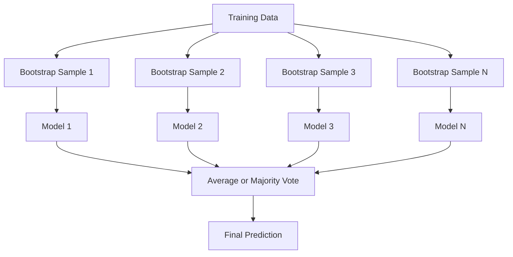
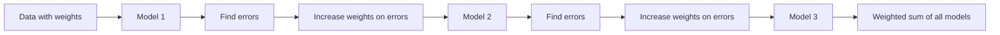
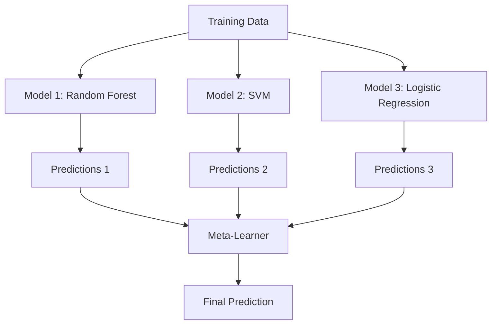

# Metode Ensembel

> Sekelompok pembelajar yang lemah, jika digabungkan dengan benar, akan menjadi pembelajar yang kuat. Ini bukan metafora. Itu adalah sebuah teorema.

**Type:** Build
**Language:** Python
**Prerequisites:** Fase 2, Lesson 10 (Bias-Variance Tradeoff)
**Waktu:** ~120 menit

## Tujuan Pembelajaran

- Menerapkan AdaBoost dan peningkatan gradient dari awal dan menjelaskan bagaimana peningkatan secara berurutan mengurangi bias
- Build ansambel bagging dan tunjukkan bagaimana rata-rata model yang berhubungan dengan dekorasi mengurangi varians tanpa meningkatkan bias
- Bandingkan bagging, boosting, dan stacking dalam hal komponen kesalahan apa yang ditargetkan setiap metode
- Mengevaluasi keragaman ansambel dan menjelaskan mengapa akurasi pemungutan suara mayoritas meningkat dengan lebih mandirinya pembelajar lemah

## Masalah

Pohon keputusan tunggal cepat untuk dilatih dan mudah diinterpretasikan, namun terlalu berlebihan. Model linier tunggal cocok untuk batas-batas yang kompleks. kamu dapat menghabiskan waktu berhari-hari untuk merancang arsitektur model yang sempurna. Atau kamu dapat menggabungkan sekumpulan model yang tidak sempurna dan mendapatkan sesuatu yang lebih baik daripada model mana pun secara terpisah.

Metode ansambel melakukan hal ini. Ini adalah teknik yang paling andal untuk memenangkan kompetisi Kaggle pada data tabular, mendukung sebagian besar sistem ML produksi, dan menggambarkan tindakan trade-off bias-varians. Mengantongi mengurangi varians. Peningkatan mengurangi bias. Penumpukan mempelajari model mana yang dapat dipercaya pada input mana.

## Konsep

### Mengapa Ensemble Berhasil

Misalkan kamu memiliki N pengklasifikasi independen, masing-masing dengan akurasi p > 0,5. Suara terbanyak mempunyai ketelitian:

```
P(majority correct) = sum over k > N/2 of C(N,k) * p^k * (1-p)^(N-k)
```

Untuk 21 pengklasifikasi yang masing-masing memiliki akurasi 60%, akurasi suara mayoritas adalah sekitar 74%. Dengan 101 pengklasifikasi, angkanya meningkat menjadi 84%. Kesalahan tersebut hilang jika model melakukan kesalahan yang berbeda.

Persyaratan utamanya adalah **keberagaman**. Jika semua model membuat kesalahan yang sama, menggabungkannya tidak akan membantu. Ansambel berfungsi karena mereka menghasilkan beragam model melalui:

- Subset training yang berbeda (mengantongi)
- Subset feature yang berbeda (hutan acak)
- Koreksi kesalahan berurutan (peningkatan)
- Keluarga model yang berbeda (susun)

### Bagging (Agregasi Bootstrap)

Bagging menciptakan keragaman dengan melatih setiap model pada sample bootstrap training data yang berbeda.



Sample bootstrap diambil dengan penggantian dari data asli, berukuran sama dengan aslinya. Sekitar 63,2% sample unik muncul di setiap bootstrap. 36,8% sisanya (sample siap pakai) menyediakan set validasi gratis.

Bagging mengurangi varians tanpa meningkatkan banyak bias. Setiap pohon melakukan overfitting ke sample bootstrapnya, namun overfitting berbeda untuk setiap pohon, sehingga rata-rata menghilangkan noise.

**Hutan Acak** memiliki perubahan ekstra: pada setiap pemisahan, hanya subset feature acak yang dipertimbangkan. Hal ini memaksa lebih banyak keanekaragaman di antara pepohonan. Jumlah umum feature kandidat adalah `sqrt(n_features)` untuk klasifikasi dan `n_features / 3` untuk regresi.

### Peningkatan (Koreksi Kesalahan Berurutan)

Meningkatkan model kereta secara berurutan. Setiap model baru berfokus pada contoh kesalahan model sebelumnya.



Peningkatan mengurangi bias. Setiap model baru mengoreksi kesalahan sistematis dari ansambel sejauh ini. Prediksi akhir adalah jumlah tertimbang dari semua model, dimana model yang lebih baik mendapatkan weight yang lebih tinggi.

Pengorbanannya: boosting bisa menjadi overfit jika kamu menjalankan terlalu banyak putaran, karena itu terus memberikan contoh yang lebih sulit, beberapa di antaranya mungkin menimbulkan kebisingan.

### AdaBoostAdaBoost (Adaptive Boosting) adalah algoritma peningkatan praktis pertama. Ia bekerja dengan pelajar dasar mana pun, biasanya tunggul keputusan (pohon kedalaman-1).

Algoritmanya:

```
1. Initialize sample weights: w_i = 1/N for all i

2. For t = 1 to T:
   a. Train weak learner h_t on weighted data
   b. Compute weighted error:
      err_t = sum(w_i * I(h_t(x_i) != y_i)) / sum(w_i)
   c. Compute model weight:
      alpha_t = 0.5 * ln((1 - err_t) / err_t)
   d. Update sample weights:
      w_i = w_i * exp(-alpha_t * y_i * h_t(x_i))
   e. Normalize weights to sum to 1

3. Final prediction: H(x) = sign(sum(alpha_t * h_t(x)))
```

Model dengan kesalahan lebih rendah mendapatkan alpha lebih tinggi. Sample yang salah diklasifikasikan mendapatkan weight yang lebih tinggi sehingga model berikutnya berfokus pada sample tersebut.

### Peningkatan Gradient

Peningkatan gradient menggeneralisasi peningkatan ke loss function yang sewenang-wenang. Alih-alih menimbang ulang sample, ia menyesuaikan setiap model baru dengan residu (gradient loss negatif) dari ansambel saat ini.

```
1. Initialize: F_0(x) = argmin_c sum(L(y_i, c))

2. For t = 1 to T:
   a. Compute pseudo-residuals:
      r_i = -dL(y_i, F_{t-1}(x_i)) / dF_{t-1}(x_i)
   b. Fit a tree h_t to the residuals r_i
   c. Find optimal step size:
      gamma_t = argmin_gamma sum(L(y_i, F_{t-1}(x_i) + gamma * h_t(x_i)))
   d. Update:
      F_t(x) = F_{t-1}(x) + learning_rate * gamma_t * h_t(x)

3. Final prediction: F_T(x)
```

Untuk kehilangan kesalahan kuadrat, residu semu hanyalah residu sebenarnya: `r_i = y_i - F_{t-1}(x_i)`. Setiap pohon benar-benar cocok dengan kesalahan ansambel sebelumnya.

Learning rate (penyusutan) mengontrol seberapa besar kontribusi setiap pohon. Learning rate yang lebih kecil memerlukan lebih banyak pohon tetapi dapat digeneralisasikan dengan lebih baik. Nilai tipikal: 0,01 hingga 0,3.

### XGBoost: Mengapa Ini Mendominasi Data Tabular

XGBoost (eXtreme Gradient Boosting) adalah peningkatan gradient dengan optimization teknik yang menjadikannya cepat, akurat, dan tahan terhadap overfitting:

- **Tujuan reguler:** Hukuman L1 dan L2 pada weight daun mencegah pohon menjadi terlalu percaya diri
- **Perkiraan orde kedua:** Menggunakan turunan loss pertama dan kedua, sehingga memberikan keputusan pemisahan yang lebih baik
- **Pemisahan berdasarkan ketersebaran:** Menangani nilai yang hilang secara asli dengan mempelajari arah terbaik untuk data yang hilang di setiap pemisahan
- **Subsampling kolom:** Seperti hutan acak, sample ditampilkan di setiap bagian untuk keanekaragaman
- **Sketsa kuantil berbobot:** Secara efisien menemukan titik pemisahan untuk feature berkelanjutan pada data terdistribusi
- **Struktur blok yang sadar cache:** Tata letak memori dioptimalkan untuk jalur cache CPU

Untuk data tabular, XGBoost (dan penerusnya LightGBM) secara konsisten mengungguli neural network. Hal ini tidak akan berubah dalam waktu dekat. Jika data kamu muat dalam tabel dengan baris dan kolom, mulailah dengan peningkatan gradient.

### Penumpukan (Pembelajaran Meta)

Penumpukan menggunakan prediksi beberapa model dasar sebagai feature untuk pembelajar meta.



Pembelajar meta mempelajari model dasar mana yang dapat dipercaya untuk input apa. Jika hutan acak lebih baik di wilayah tertentu dan SVM di wilayah lain, pembelajar meta akan belajar membuat rute yang sesuai.

Untuk menghindari kebocoran data, prediksi model dasar harus dihasilkan melalui validasi silang pada set training. kamu tidak pernah melatih model dasar dan membuat feature meta pada data yang sama.

### Pemungutan suara

Ansambel paling sederhana. Gabungkan saja prediksinya secara langsung.

- **Pemungutan suara sulit:** Pemungutan suara mayoritas pada label kelas.
- **Pemungutan suara lunak:** Rata-rata prediksi probabilitas, pilih kelas dengan probabilitas rata-rata tertinggi. Biasanya lebih baik karena menggunakan informasi rahasia.

## Build

### Langkah 1: Tunggul Keputusan (Pembelajar Dasar)

Code di `code/ensembles.py` mengimplementasikan semuanya dari awal. Kita mulai dengan tunggul keputusan: sebuah pohon dengan satu belahan.

```python
class DecisionStump:
    def __init__(self):
        self.feature_idx = None
        self.threshold = None
        self.polarity = 1
        self.alpha = None

    def fit(self, X, y, weights):
        n_samples, n_features = X.shape
        best_error = float("inf")

        for f in range(n_features):
            thresholds = np.unique(X[:, f])
            for thresh in thresholds:
                for polarity in [1, -1]:
                    pred = np.ones(n_samples)
                    pred[polarity * X[:, f] < polarity * thresh] = -1
                    error = np.sum(weights[pred != y])
                    if error < best_error:
                        best_error = error
                        self.feature_idx = f
                        self.threshold = thresh
                        self.polarity = polarity

    def predict(self, X):
        n = X.shape[0]
        pred = np.ones(n)
        idx = self.polarity * X[:, self.feature_idx] < self.polarity * self.threshold
        pred[idx] = -1
        return pred
```

### Langkah 2: AdaBoost dari Awal

```python
class AdaBoostScratch:
    def __init__(self, n_estimators=50):
        self.n_estimators = n_estimators
        self.stumps = []
        self.alphas = []

    def fit(self, X, y):
        n = X.shape[0]
        weights = np.full(n, 1 / n)

        for _ in range(self.n_estimators):
            stump = DecisionStump()
            stump.fit(X, y, weights)
            pred = stump.predict(X)

            err = np.sum(weights[pred != y])
            err = np.clip(err, 1e-10, 1 - 1e-10)

            alpha = 0.5 * np.log((1 - err) / err)
            weights *= np.exp(-alpha * y * pred)
            weights /= weights.sum()

            stump.alpha = alpha
            self.stumps.append(stump)
            self.alphas.append(alpha)

    def predict(self, X):
        total = sum(a * s.predict(X) for a, s in zip(self.alphas, self.stumps))
        return np.sign(total)
```

### Langkah 3: Peningkatan Gradient dari Awal

```python
class GradientBoostingScratch:
    def __init__(self, n_estimators=100, learning_rate=0.1, max_depth=3):
        self.n_estimators = n_estimators
        self.lr = learning_rate
        self.max_depth = max_depth
        self.trees = []
        self.initial_pred = None

    def fit(self, X, y):
        self.initial_pred = np.mean(y)
        current_pred = np.full(len(y), self.initial_pred)

        for _ in range(self.n_estimators):
            residuals = y - current_pred
            tree = SimpleRegressionTree(max_depth=self.max_depth)
            tree.fit(X, residuals)
            update = tree.predict(X)
            current_pred += self.lr * update
            self.trees.append(tree)

    def predict(self, X):
        pred = np.full(X.shape[0], self.initial_pred)
        for tree in self.trees:
            pred += self.lr * tree.predict(X)
        return pred
```

### Langkah 4: Bandingkan dengan sklearn

Code ini memverifikasi bahwa penerapan dari awal kami menghasilkan akurasi serupa dengan `AdaBoostClassifier` dan `GradientBoostingClassifier` sklearn, dan membandingkan semua metode secara berdampingan.

## Pakai

### Kapan Menggunakan Setiap Metode| Metode | Mengurangi | Terbaik untuk | Hati-hati dengan |
|--------|---------|----------|---------------|
| Mengantongi / Hutan Acak | Varians | Data berisik, banyak feature | Tidak membantu dengan bias |
| AdaBoost | Bias | Data bersih, pembelajar dasar sederhana | Sensitif terhadap outlier dan noise |
| Peningkatan Gradient | Bias | Data tabel, kompetisi | Lambat untuk dilatih, mudah untuk overfit tanpa penyetelan |
| XGBoost / LightGBM | Keduanya | ML tabel produksi | Banyak hyperparameter |
| Penumpukan | Keduanya | Mendapatkan akurasi 1-2% terakhir | Kompleks, risiko meta-pelajar yang berlebihan |
| Pemungutan suara | Varians | Kombinasi cepat dari beragam model | Hanya membantu jika modelnya beragam |

### Tumpukan Produksi untuk Data Tabular

Untuk sebagian besar soal prediksi tabel, berikut adalah urutan yang dapat dicoba:

1. **LightGBM atau XGBoost** dengan parameter default
2. Sesuaikan n_estimators, learning_rate, max_ depth, min_child_weight
3. Jika kamu membutuhkan 0,5% terakhir, buatlah susunan susun dengan 3-5 model berbeda
4. Gunakan validasi silang secara menyeluruh

Jaringan saraf pada data tabular hampir selalu lebih buruk daripada peningkatan gradient, meskipun penelitian terus dilakukan. TabNet, NODE, dan arsitektur serupa terkadang cocok tetapi jarang mengalahkan XGBoost yang telah disetel dengan baik.

## Kirim

Lesson ini menghasilkan `outputs/prompt-ensemble-selector.md` -- prompt yang membantu kamu memilih metode ansambel yang tepat untuk dataset tertentu. Jelaskan data kamu (ukuran, tipe feature, tingkat kebisingan, keseimbangan kelas) dan masalah yang kamu pecahkan. Prompt ini menelusuri daftar periksa keputusan, merekomendasikan metode, menyarankan memulai hyperparameter, dan memperingatkan tentang kesalahan umum pada metode tersebut. Juga menghasilkan `outputs/skill-ensemble-builder.md` dengan panduan seleksi lengkap.

## Latihan

1. Modifikasi implementasi AdaBoost untuk melacak akurasi latihan setelah setiap putaran. Akurasi plot vs. jumlah penduga. Kapan itu bertemu?

2. Terapkan hutan acak dari awal dengan menambahkan subsampling feature acak ke pohon regresi. Latih 100 pohon dengan `max_features=sqrt(n_features)` dan prediksi rata-rata. Bandingkan pengurangan varians dengan satu pohon.

3. Dalam implementasi peningkatan gradient, tambahkan penghentian awal: lacak kehilangan validasi setelah setiap putaran dan hentikan jika belum membaik selama 10 putaran berturut-turut. Berapa banyak pohon yang sebenarnya dibutuhkan?

4. Build ansambel susun dengan tiga model dasar (regresi logistik, pohon keputusan, k-nearest neighbor) dan meta-pelajar regresi logistik. Gunakan validasi silang 5 kali lipat untuk menghasilkan feature meta. Bandingkan dengan masing-masing model dasar saja.

5. Jalankan XGBoost pada dataset yang sama dengan parameter default. Bandingkan keakuratannya dengan peningkatan gradient dari awal. Waktu keduanya. Berapa besar perbedaan kecepatannya?

## Istilah Kunci| Istilah | Apa kata orang | Apa sebenarnya arti |
|------|----------------|----------------------|
| mengantongi | "Latihlah pada himpunan bagian acak" | Agregasi bootstrap: melatih model pada sample bootstrap, prediksi rata-rata untuk mengurangi varians |
| Meningkatkan | "Fokus pada contoh sulit" | Latih model secara berurutan, masing-masing mengoreksi kesalahan ansambel sejauh ini, untuk mengurangi bias |
| AdaBoost | "Timbang ulang datanya" | Peningkatan melalui pembaruan berat sample; poin yang salah klasifikasi mendapat weight lebih tinggi untuk pelajar berikutnya |
| Peningkatan gradient | "Paskan sisa" | Meningkatkan melalui penyesuaian setiap model baru ke gradient negatif dari loss function |
| XGBoost | "Senjata Kaggle" | Peningkatan gradient dengan regularisasi, optimization orde kedua, dan trik kecepatan tingkat sistem |
| Penumpukan | "Model di atas model" | Gunakan prediksi model dasar sebagai feature input untuk pembelajar meta |
| Hutan acak | "Banyak pohon yang diacak" | Mengantongi pohon keputusan, menambahkan subsampling feature acak di setiap pemisahan untuk keragaman |
| Ansambel keberagaman | "Buat kesalahan yang berbeda" | Model harus tidak berkorelasi dalam kesalahannya agar ansambel dapat meningkatkan individu |
| Kesalahan di luar tas | "Validasi gratis" | Sample yang tidak ada dalam undian bootstrap (~36,8%) berfungsi sebagai set validasi tanpa memerlukan ketidaksepakatan |

## Bacaan Lanjutan

- [Schapire & Freund: Boosting: Fondasi dan Algoritma](https://mitpress.mit.edu/9780262526036/) -- buku karya pencipta AdaBoost
- [Friedman: Greedy Function Approximation: A Gradient Boosting Machine (2001)](https://statweb.stanford.edu/~jhf/ftp/trebst.pdf) -- makalah peningkat gradient asli
- [Chen & Guestrin: XGBoost (2016)](https://arxiv.org/abs/1603.02754) -- makalah XGBoost
- [Wolpert: Stacked Generalization (1992)](https://www.sciencedirect.com/science/article/abs/pii/S0893608005800231) -- kertas susun asli
- [Metode Ensemble scikit-learn](https://scikit-learn.org/stable/modules/ensemble.html) -- referensi praktis
