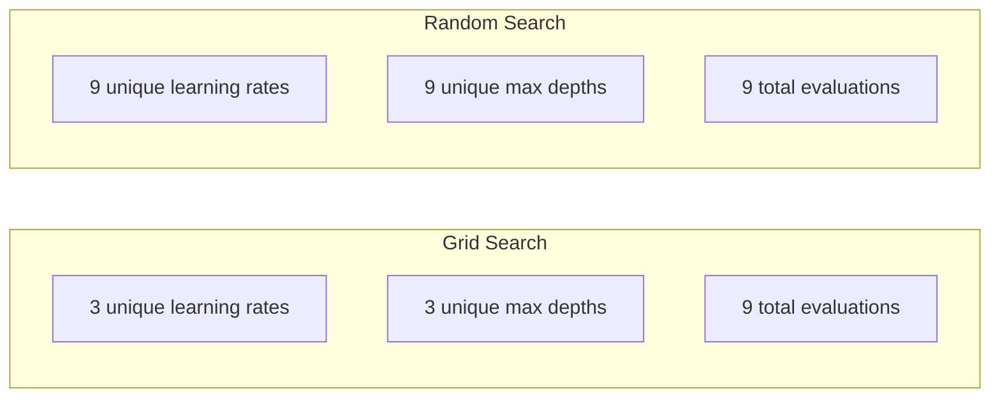
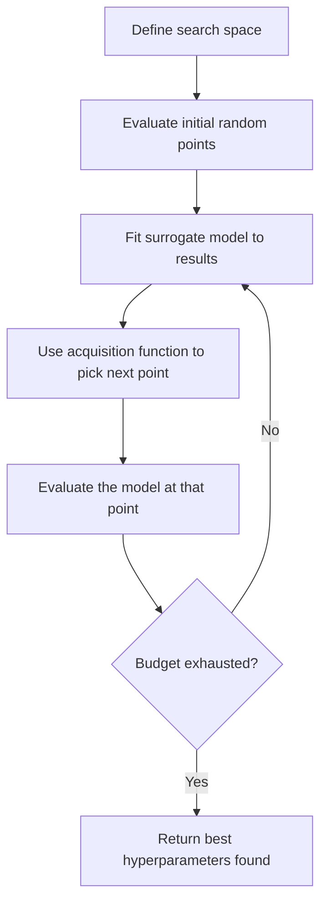
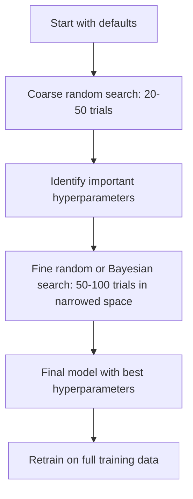
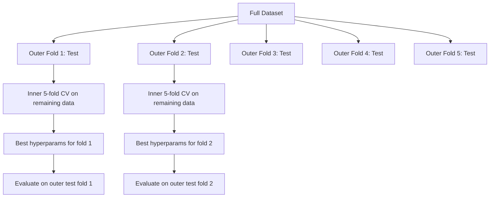

# Penyetelan Hyperparameter

> Hyperparameter adalah tombol yang kamu putar sebelum training dimulai. Mengubahnya dengan baik adalah perbedaan antara model yang biasa-biasa saja dan model yang hebat.

**Type:** Build
**Language:** Python
**Prerequisites:** Fase 2, Lesson 11 (Metode Ensemble)
**Waktu:** ~90 menit

## Tujuan Pembelajaran

- Menerapkan pencarian grid, pencarian acak, dan optimization Bayesian dari awal dan membandingkan efisiensi sampelnya
- Jelaskan mengapa penelusuran acak mengungguli penelusuran kisi ketika sebagian besar hyperparameter memiliki dimension efektif yang rendah
- Membangun loop optimization Bayesian menggunakan model pengganti dan fungsi akuisisi untuk memandu pencarian
- Rancang strategi penyetelan hyperparameter yang menghindari overfitting pada set validasi melalui validasi silang yang tepat

## Masalah

Model peningkatan gradient kamu memiliki learning rate, jumlah pohon, kedalaman maksimal, sample minimum per daun, rasio subsampel, dan rasio sample kolom. Itu adalah enam hyperparameter. Jika masing-masing mempunyai 5 nilai wajar, grid mempunyai 5^6 = 15.625 kombinasi. Latihan masing-masing membutuhkan waktu 10 detik. Itu berarti 43 jam komputasi untuk mencoba semuanya.

Pencarian grid adalah pendekatan yang paling jelas dan paling buruk dalam skala besar. Pencarian acak akan lebih baik dengan komputasi yang lebih sedikit. Optimization Bayesian menjadi lebih baik lagi dengan belajar dari evaluasi sebelumnya. Mengetahui strategi mana yang harus digunakan, dan hyperparameter mana yang benar-benar penting, menghemat waktu GPU yang terbuang selama berhari-hari.

## Konsep

### Parameter vs Hyperparameter

Parameter dipelajari selama training (weight, bias, ambang batas terpisah). Hyperparameter ditetapkan sebelum training dimulai dan mengontrol bagaimana pembelajaran terjadi.

| Hiperparameter | Apa yang dikontrolnya | Rentang tipikal |
|---------------|-----------------|---------------|
| Learning rate | Ukuran langkah per pembaruan | 0,001 hingga 1,0 |
| Jumlah pohon/zaman | Berapa lama untuk berlatih | 10 hingga 10.000 |
| Kedalaman maksimal | Kompleksitas model | 1 sampai 30 |
| Regularisasi (lambda) | Pencegahan overfitting | 0,0001 hingga 100 |
| Ukuran kumpulan | Kebisingan estimasi gradient | 16 sampai 512 |
| Angka putus sekolah | Sebagian kecil neuron terjatuh | 0,0 hingga 0,5 |

### Pencarian Kotak

Pencarian grid mengevaluasi setiap kombinasi nilai yang ditentukan. Ini lengkap dan mudah dimengerti, tetapi berskala secara eksponensial dengan jumlah hyperparameter.

```
Grid for 2 hyperparameters:

  learning_rate: [0.01, 0.1, 1.0]
  max_depth:     [3, 5, 7]

  Evaluations: 3 x 3 = 9 combinations

  (0.01, 3)  (0.01, 5)  (0.01, 7)
  (0.1,  3)  (0.1,  5)  (0.1,  7)
  (1.0,  3)  (1.0,  5)  (1.0,  7)
```

Pencarian grid memiliki kelemahan mendasar: jika satu hyperparameter penting dan yang lainnya tidak, sebagian besar evaluasi akan sia-sia. kamu hanya mendapatkan 3 nilai unik dari parameter penting dari 9 evaluasi.

### Pencarian Acak

Pencarian acak mengambil sample hyperparameter dari distribusi, bukan grid. Dengan anggaran yang sama yaitu 9 evaluasi, kamu mendapatkan 9 nilai unik dari setiap hyperparameter.



Mengapa jaringan mengalahkan acak (Bergstra & Bengio, 2012):

- Kebanyakan hyperparameter memiliki dimension efektif yang rendah. Biasanya hanya 1-2 dari 6 hyperparameter yang penting untuk masalah tertentu.
- Pencarian grid membuang-buang evaluasi pada dimension yang tidak penting.
- Pencarian acak mencakup dimension penting dengan lebih padat untuk anggaran yang sama.
- Pada 60 percobaan acak, kamu memiliki peluang 95% untuk menemukan titik dalam 5% titik optimal (jika ada di ruang pencarian).

### Optimization Bayesian

Pencarian acak mengabaikan hasil. Ia tidak mengetahui bahwa learning rate yang tinggi menyebabkan divergensi atau bahwa kedalaman 3 secara konsisten mengungguli kedalaman 10. Optimization Bayesian menggunakan evaluasi masa lalu untuk memutuskan di mana pencarian berikutnya.



Dua principal component:**Model pengganti:** Model yang murah untuk dievaluasi (biasanya proses Gaussian) yang mendekati fungsi tujuan yang mahal. Ini memberikan prediksi dan perkiraan ketidakpastian pada titik mana pun dalam ruang pencarian.

**Fungsi akuisisi:** Memutuskan tempat untuk mengevaluasi selanjutnya dengan menyeimbangkan eksploitasi (pencarian di dekat titik bagus yang diketahui) dan eksplorasi (pencarian di tempat yang ketidakpastiannya tinggi). Pilihan umum:

- **Perbaikan yang Diharapkan (EI):** Seberapa besar peningkatan dibandingkan yang terbaik saat ini yang kita harapkan pada saat ini?
- **Batas Keyakinan Atas (UCB):** Prediksi ditambah kelipatan ketidakpastian. UCB yang lebih tinggi berarti menjanjikan atau belum dijelajahi.
- **Probabilitas Peningkatan (PI):** Berapa probabilitas poin ini mengalahkan poin terbaik saat ini?

Optimization Bayesian biasanya menemukan hyperparameter yang lebih baik daripada penelusuran acak dengan evaluasi 2-5x lebih sedikit. Biaya pemasangan model pengganti dapat diabaikan dibandingkan dengan melatih model sebenarnya.

### Berhenti Dini

Tidak semua latihan harus diselesaikan. Jika suatu konfigurasi jelas-jelas buruk setelah 10 epoch, hentikan dan lanjutkan. Ini adalah penghentian awal dalam konteks pencarian hyperparameter.

Strategi:
- **Berbasis kesabaran:** Berhenti jika loss validasi belum membaik selama N periode berturut-turut
- **Pemangkasan median:** Hentikan jika hasil antara uji coba lebih buruk daripada median uji coba yang diselesaikan pada langkah yang sama
- **Hyperband:** Alokasikan anggaran kecil ke banyak konfigurasi, lalu tingkatkan anggaran secara bertahap untuk konfigurasi terbaik

Hyperband sangat efektif. Ini memulai 81 konfigurasi dengan masing-masing 1 epoch, mempertahankan sepertiga teratas, memberinya 3 epoch, mempertahankan sepertiga teratas, dan seterusnya. Hal ini menemukan konfigurasi yang baik 10-50x lebih cepat dibandingkan mengevaluasi semua konfigurasi dengan anggaran penuh.

### Penjadwal Kecepatan Pembelajaran

Learning rate hampir selalu menjadi hyperparameter yang paling penting. Daripada memperbaikinya, penjadwal menyesuaikannya selama training.

| Penjadwal | Rumus | Kapan menggunakan |
|-----------|---------|-------------|
| Peluruhan langkah | Kalikan dengan 0,1 setiap N epoch | Training CNN klasik |
| Anil kosinus | lr * 0,5 * (1 + cos(pi * t / T)) | Standar modern |
| Pemanasan + pembusukan | Kenaikan linier kemudian peluruhan kosinus | Transformer |
| Satu siklus | Naik lalu turunkan dalam satu siklus | Konvergensi cepat |
| Kurangi di dataran tinggi | Kurangi berdasarkan faktor saat metrik terhenti | Default aman |

### Pentingnya Hiperparameter

Tidak semua hyperparameter mempunyai arti yang sama. Penelitian mengenai hutan acak (Probst et al., 2019) dan peningkatan gradient menunjukkan pola yang konsisten:

**Sangat penting:**
- Learning rate (selalu setel terlebih dahulu)
- Jumlah penduga / zaman (gunakan penghentian awal, bukan penyetelan)
- Kekuatan regularisasi

**Kepentingan sedang:**
- Kedalaman / jumlah layer maksimal
- Min sample per daun/berat peluruhan
- Rasio subsampel

**Rendah Penting:**
- Feature maksimal (untuk hutan acak)
- Pilihan fungsi activation spesifik
- Ukuran batch (dalam kisaran wajar)

Tune yang penting dulu, sisanya biarkan default.

### Strategi Praktis



Alur kerja konkrit:1. **Mulailah dengan default perpustakaan.** Mereka dipilih oleh praktisi berpengalaman dan sering kali sudah 80% berhasil mencapainya.
2. **Pencarian acak kasar.** Rentang luas, 20-50 percobaan. Gunakan penghentian awal untuk menghentikan laju buruk dengan cepat.
3. **Analisis hasil.** Hyperparameter manakah yang berkorelasi dengan performa? Persempit ruang pencarian.
4. **Penelusuran halus.** Optimization Bayesian atau penelusuran acak terfokus dalam ruang yang menyempit. 50-100 percobaan.
5. **Latih ulang semua training data** dengan hyperparameter terbaik yang ditemukan.

### Integrasi Validasi Silang

Menyesuaikan hyperparameter pada satu pemisahan validasi berisiko. Hyperparameter terbaik mungkin sesuai dengan lipatan validasi tertentu. Validasi silang bersarang memecahkan masalah ini dengan menggunakan dua loop:

- **Outer loop** (evaluasi): membagi data menjadi train+val dan pengujian. Melaporkan kinerja yang tidak memihak.
- **Loop dalam** (penalaan): membagi train+val menjadi train dan val. Menemukan hyperparameter terbaik.



Setiap lipatan luar menemukan hyperparameter terbaiknya secara mandiri. Skor luar adalah perkiraan kinerja generalisasi yang tidak bias.

Dengan sklearn:

```python
from sklearn.model_selection import cross_val_score, GridSearchCV
from sklearn.ensemble import GradientBoostingRegressor

inner_cv = GridSearchCV(
    GradientBoostingRegressor(),
    param_grid={
        "learning_rate": [0.01, 0.05, 0.1],
        "max_depth": [2, 3, 5],
        "n_estimators": [50, 100, 200],
    },
    cv=5,
    scoring="neg_mean_squared_error",
)

outer_scores = cross_val_score(
    inner_cv, X, y, cv=5, scoring="neg_mean_squared_error"
)

print(f"Nested CV MSE: {-outer_scores.mean():.4f} +/- {outer_scores.std():.4f}")
```

Ini mahal (5 lipatan luar x 5 lipatan dalam x 27 titik kisi = 675 model yang cocok), tetapi ini memberi kamu perkiraan kinerja yang dapat dipercaya. Gunakan saat melaporkan hasil akhir di surat kabar atau saat taruhannya tinggi.

### Tip Praktis

**Mulailah dengan learning rate.** Ini selalu menjadi hyperparameter terpenting untuk metode berbasis gradient. Learning rate yang buruk membuat segala sesuatunya menjadi tidak relevan. Perbaiki hyperparameter lain pada default dan sapu learning rate terlebih dahulu.

**Gunakan distribusi log-uniform untuk learning rate dan regularisasi.** Perbedaan antara 0,001 dan 0,01 sama pentingnya dengan perbedaan antara 0,1 dan 1,0. Pencarian secara linier hanya membuang-buang anggaran.

**Gunakan penghentian awal, bukan menyetel n_estimators.** Untuk peningkatan dan jaringan neural, tetapkan n_estimators atau epoch tinggi dan biarkan penghentian awal memutuskan kapan harus berhenti. Tindakan ini menghapus satu hyperparameter dari pencarian.

**Alokasi anggaran.** Habiskan 60% anggaran penyesuaian kamu untuk 2 hyperparameter terpenting. Habiskan 40% sisanya untuk hal lainnya. 2 teratas menyumbang sebagian besar variasi kinerja.

**Skala itu penting.** Jangan pernah mencari ukuran batch pada skala log (16, 32, 64 boleh saja). Selalu cari learning rate pada skala log. Cocokkan distribusi penelusuran dengan pengaruh hyperparameter terhadap model.

| Tipe Model | Hyperparameter Teratas | Pencarian yang Direkomendasikan | Anggaran |
|-----------|--------------------|--------------------|--------|
| Hutan Acak | n_estimator, kedalaman_maks, daun_sampel_min | Pencarian acak, 50 percobaan | Rendah (training cepat) |
| Peningkatan Gradient | kecepatan_belajar, n_estimator, kedalaman_maks | Bayesian, 100 percobaan + penghentian awal | Sedang |
| Jaringan Syaraf | kecepatan_belajar, peluruhan_berat, ukuran_batch | Bayesian atau acak, 100+ uji coba | Tinggi (training lambat) |
| SVM | C, gamma (kernel RBF) | Grid pada skala log, 25-50 percobaan | Rendah (2 parameter) |
| Laso/Punggung Bukit | alpha | Pencarian 1D pada skala log, 20 percobaan | Sangat rendah |
| XGBoost | kecepatan_belajar, kedalaman_maks, subsampel, colsampel | Bayesian, 100-200 percobaan + penghentian awal | Sedang |

**Jika ragu:** penelusuran acak dengan 2x jumlah hyperparameter sebagai uji coba (misalnya, 6 hyperparameter = minimum 12+ uji coba). kamu akan terkejut betapa seringnya pencarian acak dengan 50 percobaan mengalahkan pencarian grid yang dirancang dengan cermat.

## Build

### Langkah 1: Pencarian Grid dari AwalKode di `code/tuning.py` mengimplementasikan pencarian grid, pencarian acak, dan optimizer Bayesian sederhana dari awal.

```python
def grid_search(model_fn, param_grid, X_train, y_train, X_val, y_val):
    keys = list(param_grid.keys())
    values = list(param_grid.values())
    best_score = -float("inf")
    best_params = None
    n_evals = 0

    for combo in itertools.product(*values):
        params = dict(zip(keys, combo))
        model = model_fn(**params)
        model.fit(X_train, y_train)
        score = evaluate(model, X_val, y_val)
        n_evals += 1

        if score > best_score:
            best_score = score
            best_params = params

    return best_params, best_score, n_evals
```

### Langkah 2: Pencarian Acak dari Awal

```python
def random_search(model_fn, param_distributions, X_train, y_train,
                  X_val, y_val, n_iter=50, seed=42):
    rng = np.random.RandomState(seed)
    best_score = -float("inf")
    best_params = None

    for _ in range(n_iter):
        params = {k: sample(v, rng) for k, v in param_distributions.items()}
        model = model_fn(**params)
        model.fit(X_train, y_train)
        score = evaluate(model, X_val, y_val)

        if score > best_score:
            best_score = score
            best_params = params

    return best_params, best_score, n_iter
```

### Langkah 3: Optimization Bayesian (Sederhana)

Ide intinya: sesuaikan proses Gaussian ke pasangan yang diamati (hiperparameter, skor), lalu gunakan fungsi akuisisi untuk memutuskan ke mana harus mencari selanjutnya.

```python
class SimpleBayesianOptimizer:
    def __init__(self, search_space, n_initial=5):
        self.search_space = search_space
        self.n_initial = n_initial
        self.X_observed = []
        self.y_observed = []

    def _kernel(self, x1, x2, length_scale=1.0):
        dists = np.sum((x1[:, None, :] - x2[None, :, :]) ** 2, axis=2)
        return np.exp(-0.5 * dists / length_scale ** 2)

    def _fit_gp(self, X_new):
        X_obs = np.array(self.X_observed)
        y_obs = np.array(self.y_observed)
        y_mean = y_obs.mean()
        y_centered = y_obs - y_mean

        K = self._kernel(X_obs, X_obs) + 1e-4 * np.eye(len(X_obs))
        K_star = self._kernel(X_new, X_obs)

        L = np.linalg.cholesky(K)
        alpha = np.linalg.solve(L.T, np.linalg.solve(L, y_centered))
        mu = K_star @ alpha + y_mean

        v = np.linalg.solve(L, K_star.T)
        var = 1.0 - np.sum(v ** 2, axis=0)
        var = np.maximum(var, 1e-6)

        return mu, var

    def _expected_improvement(self, mu, var, best_y):
        sigma = np.sqrt(var)
        z = (mu - best_y) / (sigma + 1e-10)
        ei = sigma * (z * norm_cdf(z) + norm_pdf(z))
        return ei

    def suggest(self):
        if len(self.X_observed) < self.n_initial:
            return sample_random(self.search_space)

        candidates = [sample_random(self.search_space) for _ in range(500)]
        X_cand = np.array([to_vector(c) for c in candidates])
        mu, var = self._fit_gp(X_cand)
        ei = self._expected_improvement(mu, var, max(self.y_observed))
        return candidates[np.argmax(ei)]

    def observe(self, params, score):
        self.X_observed.append(to_vector(params))
        self.y_observed.append(score)
```

Pengganti GP memberikan dua hal pada setiap poin kandidat: skor prediksi (mu) dan ketidakpastian (var). Peningkatan yang Diharapkan menyeimbangkan hal-hal berikut: peningkatan ini lebih menyukai titik-titik ketika model memprediksi skor tinggi ATAU ketika ketidakpastian tinggi. Pada awalnya, sebagian besar titik memiliki ketidakpastian yang tinggi sehingga optimizer melakukan eksplorasi. Nantinya, fokus pada wilayah yang paling menjanjikan.

### Langkah 4: Bandingkan Semua Metode

Jalankan ketiga metode pada tujuan sintetik yang sama dan bandingkan. Perbandingan ini menggunakan wrapper sederhana yang memanggil setiap optimizer dengan fungsi tujuan langsung (tanpa training model), sehingga API berbeda dari implementasi berbasis model di atas:

```python
def synthetic_objective(params):
    lr = params["learning_rate"]
    depth = params["max_depth"]
    return -(np.log10(lr) + 2) ** 2 - (depth - 4) ** 2 + 10

param_grid = {
    "learning_rate": [0.001, 0.01, 0.1, 1.0],
    "max_depth": [2, 3, 4, 5, 6, 7, 8],
}

grid_best = None
grid_score = -float("inf")
grid_history = []
for combo in itertools.product(*param_grid.values()):
    params = dict(zip(param_grid.keys(), combo))
    score = synthetic_objective(params)
    grid_history.append((params, score))
    if score > grid_score:
        grid_score = score
        grid_best = params

param_dist = {
    "learning_rate": ("log_float", 0.001, 1.0),
    "max_depth": ("int", 2, 8),
}

rand_best = None
rand_score = -float("inf")
rand_history = []
rng = np.random.RandomState(42)
for _ in range(28):
    params = {k: sample(v, rng) for k, v in param_dist.items()}
    score = synthetic_objective(params)
    rand_history.append((params, score))
    if score > rand_score:
        rand_score = score
        rand_best = params

optimizer = SimpleBayesianOptimizer(param_dist, n_initial=5)
bayes_history = []
for _ in range(28):
    params = optimizer.suggest()
    score = synthetic_objective(params)
    optimizer.observe(params, score)
    bayes_history.append((params, score))
bayes_score = max(s for _, s in bayes_history)

print(f"{'Method':<20} {'Best Score':>12} {'Evaluations':>12}")
print("-" * 50)
print(f"{'Grid Search':<20} {grid_score:>12.4f} {len(grid_history):>12}")
print(f"{'Random Search':<20} {rand_score:>12.4f} {len(rand_history):>12}")
print(f"{'Bayesian Opt':<20} {bayes_score:>12.4f} {len(bayes_history):>12}")
```

Dengan anggaran yang sama, optimization Bayesian biasanya menemukan skor terbaik paling cepat karena tidak menyia-nyiakan evaluasi di wilayah yang jelas-jelas buruk. Pencarian acak mencakup lebih banyak hal daripada pencarian grid. Pencarian grid hanya menang jika kamu memiliki sangat sedikit hyperparameter dan mampu melakukannya secara menyeluruh.

## Pakai

### Optuna dalam Praktek

Optuna adalah perpustakaan yang direkomendasikan untuk penyetelan hyperparameter yang serius. Ini mendukung pemangkasan, pencarian terdistribusi, dan visualisasi di luar kotak.

```python
import optuna

def objective(trial):
    lr = trial.suggest_float("learning_rate", 1e-4, 1e-1, log=True)
    n_est = trial.suggest_int("n_estimators", 50, 500)
    max_depth = trial.suggest_int("max_depth", 2, 10)

    model = GradientBoostingRegressor(
        learning_rate=lr,
        n_estimators=n_est,
        max_depth=max_depth,
    )
    model.fit(X_train, y_train)
    return mean_squared_error(y_val, model.predict(X_val))

study = optuna.create_study(direction="minimize")
study.optimize(objective, n_trials=100)

print(f"Best params: {study.best_params}")
print(f"Best MSE: {study.best_value:.4f}")
```

Feature utama Optuna:
- `suggest_float(..., log=True)` untuk parameter yang paling baik dicari pada skala log (learning rate, regularisasi)
- `suggest_int` untuk parameter bilangan bulat
- `suggest_categorical` untuk pilihan terpisah
- MedianPruner bawaan untuk menghentikan uji coba buruk lebih awal
- `study.trials_dataframe()` untuk analisis

### Optuna dengan Pemangkasan

Pemangkasan menghentikan uji coba yang tidak menjanjikan sejak dini, sehingga menghemat komputasi secara besar-besaran. Berikut polanya:

```python
import optuna
from sklearn.model_selection import cross_val_score

def objective(trial):
    params = {
        "learning_rate": trial.suggest_float("lr", 1e-4, 0.5, log=True),
        "max_depth": trial.suggest_int("max_depth", 2, 10),
        "n_estimators": trial.suggest_int("n_estimators", 50, 500),
        "subsample": trial.suggest_float("subsample", 0.5, 1.0),
    }

    model = GradientBoostingRegressor(**params)
    scores = cross_val_score(model, X_train, y_train, cv=3,
                             scoring="neg_mean_squared_error")
    mean_score = -scores.mean()

    trial.report(mean_score, step=0)
    if trial.should_prune():
        raise optuna.TrialPruned()

    return mean_score

pruner = optuna.pruners.MedianPruner(n_startup_trials=10, n_warmup_steps=5)
study = optuna.create_study(direction="minimize", pruner=pruner)
study.optimize(objective, n_trials=200)
```

`MedianPruner` menghentikan uji coba jika nilai perantaranya lebih buruk daripada median semua uji coba yang diselesaikan pada langkah yang sama. Pemangkasan memerlukan panggilan `trial.report()` untuk melaporkan metrik perantara dan `trial.should_prune()` untuk memeriksa apakah uji coba harus dihentikan. `n_startup_trials=10` memastikan setidaknya 10 uji coba selesai sepenuhnya sebelum pemangkasan dimulai. Hal ini biasanya menghemat 40-60% dari total komputasi.

### Tuner Bawaan sklearn

Untuk eksperimen cepat, sklearn menyediakan `GridSearchCV`, `RandomizedSearchCV`, dan `HalvingRandomSearchCV`:

```python
from sklearn.model_selection import RandomizedSearchCV
from scipy.stats import loguniform, randint

param_dist = {
    "learning_rate": loguniform(1e-4, 0.5),
    "max_depth": randint(2, 10),
    "n_estimators": randint(50, 500),
}

search = RandomizedSearchCV(
    GradientBoostingRegressor(),
    param_dist,
    n_iter=100,
    cv=5,
    scoring="neg_mean_squared_error",
    random_state=42,
    n_jobs=-1,
)
search.fit(X_train, y_train)
print(f"Best params: {search.best_params_}")
print(f"Best CV MSE: {-search.best_score_:.4f}")
```

Gunakan `loguniform` dari scipy untuk learning rate dan regularisasi. Gunakan `randint` untuk hyperparameter bilangan bulat. Bendera `n_jobs=-1` diparalelkan di seluruh inti CPU.

### Kesalahan Umum dalam Penyetelan Hyperparameter

**Kebocoran data melalui preprocessing.** Jika kamu memasang scaler pada set data lengkap sebelum validasi silang, informasi dari lipatan validasi akan bocor ke dalam training. Selalu letakkan preprocessing di dalam `Pipeline` agar hanya muat di lipatan training.

**Kelebihan kesesuaian dengan set validasi.** Menjalankan ribuan uji coba secara efektif melatih set validasi. Gunakan validasi silang bertingkat untuk perkiraan kinerja akhir, atau adakan set pengujian terpisah yang tidak pernah kamu sentuh selama penyetelan.**Penelusuran rentangnya terlalu sempit.** Jika nilai terbaik kamu berada pada batas ruang penelusuran, berarti kamu belum melakukan penelusuran yang cukup luas. Nilai optimal mungkin berada di luar rentang kamu. Selalu periksa apakah parameter terbaik ada di tepinya.

**Mengabaikan efek interaksi.** Learning rate dan jumlah estimator berinteraksi secara kuat dalam peningkatan. Learning rate yang rendah memerlukan lebih banyak penduga. Menyetelnya secara terpisah memberikan hasil yang lebih buruk daripada menyetelnya secara bersamaan.

**Tidak menggunakan penghentian awal untuk model berulang.** Untuk peningkatan gradient dan jaringan neural, tetapkan n_estimators atau epochs ke nilai tinggi dan gunakan penghentian awal. Ini jauh lebih baik daripada menyetel jumlah iterasi sebagai hyperparameter.

## Latihan

1. Jalankan pencarian grid dan pencarian acak dengan total anggaran yang sama (misalnya 50 evaluasi). Bandingkan skor terbaik yang ditemukan. Jalankan percobaan sebanyak 10 kali dengan benih yang berbeda. Seberapa sering pencarian acak menang?

2. Implementasikan Hyperband dari awal. Mulai dengan 81 konfigurasi, masing-masing dilatih selama 1 epoch. Pertahankan 1/3 teratas di setiap putaran dan lipat tigakan anggaran mereka. Bandingkan total komputasi (jumlah semua periode di semua konfigurasi) dengan menjalankan 81 konfigurasi untuk anggaran penuh.

3. Tambahkan penjadwal learning rate (cosine annealing) ke implementasi peningkatan gradient dari Lesson 11. Apakah ini membantu dibandingkan dengan learning rate tetap?

4. Gunakan Optuna untuk menyetel RandomForestClassifier pada dataset nyata (misalnya, dataset kanker payudara sklearn). Gunakan `optuna.visualization.plot_param_importances(study)` untuk melihat hyperparameter mana yang paling penting. Apakah sesuai dengan peringkat pentingnya dari lesson ini?

5. Menerapkan fungsi akuisisi sederhana (Perbaikan yang Diharapkan) dan mendemonstrasikan eksplorasi vs eksploitasi. Plot mean dan ketidakpastian model pengganti, dan tunjukkan di mana EI memilih untuk mengevaluasi selanjutnya.

## Istilah Kunci

| Istilah | Apa kata orang | Apa sebenarnya arti |
|------|----------------|----------------------|
| Hiperparameter | "Pengaturan yang kamu pilih" | Kumpulan nilai sebelum training yang mengontrol proses pembelajaran, bukan dipelajari dari data |
| Pencarian jaringan | "Coba setiap kombinasi" | Pencarian menyeluruh pada kisi parameter tertentu. Biaya eksponensial. |
| Pencarian acak | "Contoh saja secara acak" | Contoh hyperparameter dari distribusi. Mencakup dimension penting dengan lebih baik daripada penelusuran grid. |
| Optimization Bayesian | "Pencarian cerdas" | Menggunakan model tujuan pengganti untuk memutuskan di mana evaluasi selanjutnya, menyeimbangkan eksplorasi dan eksploitasi |
| Model pengganti | "Perkiraan yang murah" | Sebuah model (biasanya proses Gaussian) yang mendekati fungsi tujuan mahal dari evaluasi yang diamati |
| Fungsi akuisisi | "Di mana mencarinya selanjutnya" | Mencetak poin kandidat dengan menyeimbangkan peningkatan yang diharapkan dengan ketidakpastian. EI dan UCB adalah pilihan umum. |
| Berhenti lebih awal | "Berhentilah membuang-buang waktu" | Hentikan training lebih awal ketika kinerja validasi berhenti meningkat |
| Hiperband | "Braket turnamen untuk konfigurasi" | Alokasi sumber daya adaptif: memulai banyak konfigurasi dengan anggaran kecil, pertahankan yang terbaik dan tingkatkan anggarannya |
| Penjadwal learning rate | "Ganti lr selama latihan" | Sebuah fungsi yang menyesuaikan learning rate selama training untuk konvergensi yang lebih baik |

## Bacaan Lanjutan- [Bergstra & Bengio: Pencarian Acak untuk Optimization Hyper-Parameter (2012)](https://jmlr.org/papers/v13/bergstra12a.html) -- makalah yang menunjukkan kisi-kisi ketukan acak
- [Snoek dkk., Optimization Bayesian Praktis pada Algoritma Machine Learning (2012)](https://arxiv.org/abs/1206.2944) -- Optimization Bayesian untuk ML
- [Li et al., Hyperband: A Novel Bandit-Based Approach (2018)](https://jmlr.org/papers/v18/16-558.html) -- makalah Hyperband
- [Optuna: Kerangka Optimization Hyperparameter Generasi Berikutnya](https://arxiv.org/abs/1907.10902) -- makalah Optuna
- [Probst dkk., Tunability: Pentingnya Hyperparameter (2019)](https://jmlr.org/papers/v20/18-444.html) -- hyperparameter mana yang penting
