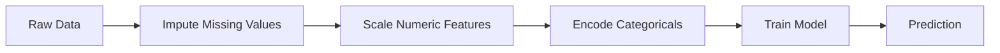
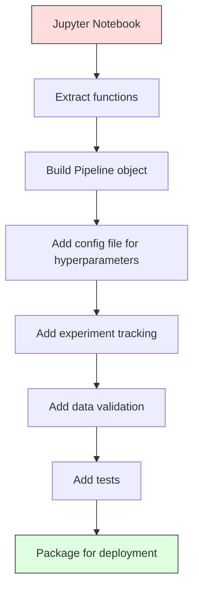

# Pipeline Pipa ML

> Model bukanlah suatu produk. Sebuah pipa adalah. Pipeline mencakup segalanya mulai dari data mentah hingga prediksi yang diterapkan, dan setiap langkah harus dapat direproduksi.

**Type:** Build
**Language:** Python
**Prerequisites:** Fase 2, Lesson 12 (Penyesuaian Hyperparameter)
**Waktu:** ~120 menit

## Tujuan Pembelajaran

- Membangun pipeline ML dari awal yang menyatukan imputasi, penskalaan, pengkodean, dan training model ke dalam satu objek yang dapat direproduksi
- Identifikasi skenario kebocoran data dan jelaskan bagaimana pipeline mencegahnya dengan memasang Transformer hanya pada training data
- Buat ColumnTransformer yang menerapkan preprocessing berbeda pada feature numerik dan kategorikal
- Menerapkan serialisasi jalur pipa dan menunjukkan bahwa jalur pipa yang dipasang sama menghasilkan hasil yang identik dalam training dan produksi

## Masalah

kamu memiliki buku catatan yang memuat data, mengisi nilai yang hilang dengan median, menskalakan feature, melatih model, dan mencetak akurasi. Ini berhasil. kamu mengirimkannya.

Sebulan kemudian, seseorang melatih ulang model tersebut dan mendapatkan hasil yang berbeda. Median dihitung pada dataset lengkap termasuk data uji (kebocoran data). Parameter penskalaan tidak disimpan, jadi inference menggunakan statistik yang berbeda. Code rekayasa feature disalin-tempel antara training dan penyajian, dan salinannya berbeda. Kolom kategoris memperoleh nilai baru dalam produksi yang belum pernah dilihat oleh pembuat enkode.

Ini bukanlah hipotesis. Ini adalah alasan paling umum mengapa sistem ML gagal dalam produksi. Pipeline menyelesaikan semuanya dengan mengemas setiap langkah transformasi menjadi satu objek yang teratur dan dapat direproduksi.

## Konsep

### Apa Itu Pipeline Pipa

Pipeline adalah urutan transformasi data yang diikuti oleh model. Setiap langkah mengambil output dari langkah sebelumnya sebagai input. Seluruh pipeline dipasang satu kali pada training data. Pada waktu inference, pipeline yang dipasang sama mengubah data baru dan menghasilkan prediksi.



Jaminan pipa:
- Transformasi hanya dipasang pada training data (tidak ada kebocoran)
- Transformasi yang sama diterapkan pada waktu inference
- Seluruh objek dapat diserialkan dan disebarkan sebagai satu artefak
- Validasi silang menerapkan pipa per lipatan, mencegah kebocoran halus

### Kebocoran Data: Pembunuh Senyap

Kebocoran data terjadi ketika informasi dari set pengujian atau data masa depan mencemari training. Pipeline pipa mencegah bentuk yang paling umum.

**Bocor (salah):**
```python
X = df.drop("target", axis=1)
y = df["target"]

scaler = StandardScaler()
X_scaled = scaler.fit_transform(X)

X_train, X_test = X_scaled[:800], X_scaled[800:]
y_train, y_test = y[:800], y[800:]
```

Scaler melihat data uji. Rata-rata dan deviasi standar termasuk sample uji. Hal ini meningkatkan perkiraan akurasi.

**Benar:**
```python
X_train, X_test = X[:800], X[800:]

scaler = StandardScaler()
X_train_scaled = scaler.fit_transform(X_train)
X_test_scaled = scaler.transform(X_test)
```

Dengan pipeline pipa, kamu tidak perlu memikirkan hal ini. Pipeline menanganinya secara otomatis.

### sklearn Pipa

trafo rantai `Pipeline` sklearn dan estimator. Ini memperlihatkan `.fit()`, `.predict()`, dan `.score()` yang menerapkan semua langkah secara berurutan.

```python
from sklearn.pipeline import Pipeline
from sklearn.preprocessing import StandardScaler
from sklearn.linear_model import LogisticRegression

pipe = Pipeline([
    ("scaler", StandardScaler()),
    ("model", LogisticRegression()),
])

pipe.fit(X_train, y_train)
predictions = pipe.predict(X_test)
```

Saat kamu menelepon `pipe.fit(X_train, y_train)`:
1. Scaler memanggil `fit_transform` di X_train
2. Panggilan model `fit` pada X_train berskala

Saat kamu menelepon `pipe.predict(X_test)`:
1. Scaler memanggil `transform` (bukan fit_transform) pada X_test
2. Panggilan model `predict` pada X_test berskala

Scaler tidak pernah melihat data pengujian selama pemasangan. Inilah intinya.

### ColumnTransformer: Pipeline Pipa Berbeda untuk Kolom Berbeda

Dataset nyata memiliki kolom numerik dan kategorikal yang memerlukan preprocessing yang berbeda. `ColumnTransformer` menangani ini.```python
from sklearn.compose import ColumnTransformer
from sklearn.preprocessing import StandardScaler, OneHotEncoder
from sklearn.impute import SimpleImputer

numeric_pipe = Pipeline([
    ("impute", SimpleImputer(strategy="median")),
    ("scale", StandardScaler()),
])

categorical_pipe = Pipeline([
    ("impute", SimpleImputer(strategy="most_frequent")),
    ("encode", OneHotEncoder(handle_unknown="ignore")),
])

preprocessor = ColumnTransformer([
    ("num", numeric_pipe, ["age", "income", "score"]),
    ("cat", categorical_pipe, ["city", "gender", "plan"]),
])

full_pipeline = Pipeline([
    ("preprocess", preprocessor),
    ("model", GradientBoostingClassifier()),
])
```

`handle_unknown="ignore"` di OneHotEncoder sangat penting untuk produksi. Saat kategori baru muncul (kota yang belum pernah dilihat modelnya), kategori tersebut menghasilkan vector nol, bukannya crash.

### Pelacakan Eksperimen

Pipeline membuat training dapat direproduksi, namun kamu juga perlu melacak apa yang terjadi di seluruh eksperimen: hyperparameter mana yang digunakan, versi dataset mana, metrik apa yang digunakan, code mana yang berjalan.

**MLflow** adalah solusi sumber terbuka yang paling umum:

```python
import mlflow

with mlflow.start_run():
    mlflow.log_param("max_depth", 5)
    mlflow.log_param("n_estimators", 100)
    mlflow.log_param("learning_rate", 0.1)

    pipe.fit(X_train, y_train)
    accuracy = pipe.score(X_test, y_test)

    mlflow.log_metric("accuracy", accuracy)
    mlflow.sklearn.log_model(pipe, "model")
```

Setiap proses dicatat dengan parameter, metrik, artefak, dan model lengkap. kamu dapat membandingkan proses, mereproduksi eksperimen apa pun, dan menerapkan versi model apa pun.

**Weight & Bias (wandb)** menyediakan fungsi yang sama dengan dasbor yang dihosting:

```python
import wandb

wandb.init(project="my-pipeline")
wandb.config.update({"max_depth": 5, "n_estimators": 100})

pipe.fit(X_train, y_train)
accuracy = pipe.score(X_test, y_test)

wandb.log({"accuracy": accuracy})
```

### Pembuatan Versi Model

Setelah pelacakan eksperimen, kamu perlu mengelola versi model. Model mana yang sedang diproduksi? Yang manakah pementasan? Yang mana minggu lalu?

Registri Model MLflow menyediakan:
- **Pelacakan versi:** Setiap model yang disimpan mendapat nomor versi
- **Transisi panggung:** "Pementasan", "Produksi", "Diarsipkan"
- **Alur kerja persetujuan:** Model harus dipromosikan secara eksplisit ke produksi
- **Rollback:** Beralih kembali ke versi sebelumnya secara instan

### Pembuatan Versi Data dengan DVC

Code diversi dengan git. Data juga harus diversi, tetapi git tidak dapat menangani file besar. DVC (Kontrol Versi Data) memecahkan masalah ini.

```
dvc init
dvc add data/training.csv
git add data/training.csv.dvc data/.gitignore
git commit -m "Track training data"
dvc push
```

DVC menyimpan data aktual dalam penyimpanan distance jauh (S3, GCS, Azure) dan menyimpan file kecil `.dvc` di git yang mencatat hash. Saat kamu checkout git commit, `dvc checkout` memulihkan data persis yang digunakan.

Ini berarti setiap git commit embed code dan data. Reproduksibilitas penuh.

### Eksperimen yang Dapat Direproduksi

Eksperimen yang dapat direproduksi memerlukan empat hal:

1. **Benih acak tetap:** Tetapkan benih untuk numpy, acak, dan kerangka (torch, sklearn)
2. **Dependensi yang dipasangi pin:** persyaratan.txt atau puisi.lock dengan versi yang tepat
3. **Data berversi:** DVC atau sejenisnya
4. **File konfigurasi:** Semua hyperparameter dalam konfigurasi, bukan hardcode

```python
import numpy as np
import random

def set_seed(seed=42):
    random.seed(seed)
    np.random.seed(seed)
    try:
        import torch
        torch.manual_seed(seed)
        torch.cuda.manual_seed_all(seed)
        torch.backends.cudnn.deterministic = True
    except ImportError:
        pass
```

### Dari Buku Catatan ke Pipeline Produksi



Perkembangan yang khas:

1. **Eksplorasi buku catatan:** Eksperimen cepat, visualisasi, ide feature
2. **Fungsi ekstrak:** Memindahkan preprocessing, rekayasa feature, evaluasi ke dalam modul
3. **Build Pipeline:** Transformasi berantai menjadi sklearn Pipeline atau kelas khusus
4. **Manajemen konfigurasi:** Pindahkan semua hyperparameter ke dalam konfigurasi YAML/JSON
5. **Pelacakan eksperimen:** Tambahkan MLflow atau logging Wandb
6. **Validasi data:** Periksa skema, distribusi, dan pola nilai yang hilang sebelum training
7. **Pengujian:** Pengujian unit untuk Transformer, pengujian integrasi untuk pipeline penuh
8. **Deployment:** Membuat serial pipeline, membungkusnya dalam API (FastAPI, Flask), memasukkan ke dalam container

### Kesalahan Umum Pipeline Pipa| Kesalahan | Mengapa ini buruk | Perbaiki |
|---------|-------------|-----|
| Pemasangan data lengkap sebelum dibelah | Kebocoran data | Gunakan Pipeline dengan cross_val_score |
| Rekayasa feature di luar pipa | Transformasi berbeda pada kereta vs servis | Letakkan semua transformasi di Pipeline |
| Tidak menangani kategori yang tidak diketahui | Kegagalan produksi karena nilai-nilai baru | OneHotEncoder(handle_unknown="abaikan") |
| Nama kolom yang dikodekan keras | Rusak saat skema berubah | Gunakan daftar nama kolom dari config |
| Tidak ada validasi data | Prediksi diam-diam salah pada data buruk | Tambahkan pemeriksaan skema sebelum prediksi |
| Latihan/serving miring | Model melihat feature berbeda di prod | Satu objek Pipeline untuk keduanya |

## Build

Code di `code/pipeline.py` membuat pipeline ML lengkap dari awal:

### Langkah 1: Transformer Khusus

```python
class CustomTransformer:
    def __init__(self):
        self.means = None
        self.stds = None

    def fit(self, X):
        self.means = np.mean(X, axis=0)
        self.stds = np.std(X, axis=0)
        self.stds[self.stds == 0] = 1.0
        return self

    def transform(self, X):
        return (X - self.means) / self.stds

    def fit_transform(self, X):
        return self.fit(X).transform(X)
```

### Langkah 2: Pipeline Pipa dari Awal

```python
class PipelineFromScratch:
    def __init__(self, steps):
        self.steps = steps

    def fit(self, X, y=None):
        X_current = X.copy()
        for name, step in self.steps[:-1]:
            X_current = step.fit_transform(X_current)
        name, model = self.steps[-1]
        model.fit(X_current, y)
        return self

    def predict(self, X):
        X_current = X.copy()
        for name, step in self.steps[:-1]:
            X_current = step.transform(X_current)
        name, model = self.steps[-1]
        return model.predict(X_current)
```

### Langkah 3: Validasi Silang dengan Pipeline

Code ini menunjukkan bagaimana validasi silang dengan pipeline mencegah kebocoran data: scaler dipasang secara terpisah pada training data setiap lipatan.

### Langkah 4: Pipeline Produksi Penuh dengan sklearn

Pipeline pipa lengkap dengan `ColumnTransformer`, beberapa jalur preprocessing, dan sebuah model, dilatih dengan validasi silang dan pencatatan eksperimen yang tepat.

## Kirim

Lesson ini menghasilkan:
- `outputs/prompt-ml-pipeline.md` -- keterampilan untuk membangun dan men-debug pipeline ML
- `code/pipeline.py` -- pipeline lengkap dari awal hingga sklearn

## Latihan

1. Build alur yang menangani dataset dengan 3 kolom numerik dan 2 kolom kategorikal. Gunakan `ColumnTransformer` untuk menerapkan imputasi median + penskalaan ke numerik dan imputasi paling sering + pengkodean one-hot ke kategorikal. Berlatih dengan validasi silang 5 kali lipat.

2. Sengaja menimbulkan kebocoran data: sesuaikan scaler pada dataset lengkap sebelum memisahkannya. Bandingkan skor validasi silang (bocor) dengan skor validasi silang pipeline (bersih). Seberapa besar perbedaannya?

3. Buat serial pipeline pipa kamu dengan `joblib.dump`. Muat dalam skrip terpisah dan jalankan prediksi. Pastikan prediksinya identik.

4. Tambahkan trafo khusus ke pipeline yang membuat feature polinomial (derajat 2) untuk dua kolom numerik terpenting. Kemana arahnya?

5. Siapkan pelacakan MLflow untuk pipeline. Jalankan 5 eksperimen dengan hyperparameter berbeda. Gunakan MLflow UI (`mlflow ui`) untuk membandingkan proses dan memilih model terbaik.

## Istilah Kunci| Istilah | Apa kata orang | Apa sebenarnya arti |
|------|----------------|----------------------|
| Pipeline pipa | "Rantai transformasi + model" | Rangkaian trafo dan model yang dipasang secara berurutan, diterapkan sebagai satu unit untuk mencegah kebocoran |
| Kebocoran data | "Info tes bocor ke dalam training" | Menggunakan informasi dari luar set training untuk membangun model, meningkatkan estimasi kinerja |
| KolomTransformator | "Preprocessing yang berbeda per kolom" | Menerapkan alur yang berbeda ke subset kolom yang berbeda, menggabungkan hasil |
| Pelacakan eksperimen | "Mencatat proses kamu" | Mencatat parameter, metrik, artefak, dan versi code untuk setiap training yang dijalankan |
| aliran ml | "Lacak dan terapkan model" | Platform sumber terbuka untuk pelacakan eksperimen, registri model, dan penerapan |
| DVC | "Git untuk data" | Sistem kontrol versi untuk file data besar, menyimpan hash di git dan data di penyimpanan distance jauh |
| Registri model | "Katalog versi model" | Sebuah sistem yang melacak versi model dengan label tahapan (pementasan, produksi, arsip) |
| Latihan/serving miring | "Ini berhasil di buku catatan" | Perbedaan antara cara data diproses selama training versus inference, menyebabkan kesalahan diam |
| Reproduksibilitas | "Code yang sama, hasil yang sama" | Kemampuan untuk mendapatkan hasil yang identik dari code, data, dan konfigurasi yang sama |

## Bacaan Lanjutan

- [scikit-learn Pipeline docs](https://scikit-learn.org/stable/modules/compose.html) -- referensi pipeline resmi
- [Dokumentasi MLflow](https://mlflow.org/docs/latest/index.html) -- pelacakan eksperimen dan registry model
- [Dokumentasi DVC](https://dvc.org/doc) -- pembuatan versi data
- [Sculley et al., Hidden Technical Debt in Machine Learning Systems (2015)](https://papers.nips.cc/paper/2015/hash/86df7dcfd896fcaf2674f757a2463eba-Abstract.html) -- makalah penting tentang kompleksitas sistem ML
- [Praktik Terbaik Google ML: Aturan ML](https://developers.google.com/machine-learning/guides/rules-of-ml) -- saran praktis produksi ML
