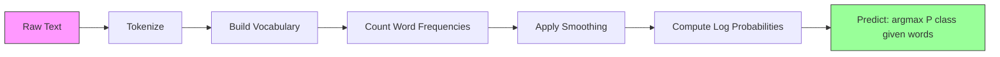

# Naif Bayes

> Asumsi "naif" itu salah, dan tetap saja berhasil. Itulah keindahannya.

**Type:** Build
**Language:** Python
**Prerequisites:** Fase 2, Lesson 01-07 (klasifikasi, teorema Bayes)
**Waktu:** ~75 menit

## Tujuan Pembelajaran

- Menerapkan Multinomial Naive Bayes dari awal dengan pemulusan Laplace untuk klasifikasi teks
- Jelaskan mengapa asumsi independensi yang naif salah secara matematis tetapi dalam praktiknya menghasilkan peringkat kelas yang benar
- Bandingkan varian Multinomial, Bernoulli, dan Gaussian Naive Bayes dan pilih varian yang tepat untuk jenis feature tertentu
- Mengevaluasi Naive Bayes terhadap regresi logistik pada data renggang berdimensi tinggi dan menjelaskan tradeoff bias-varians di tempat kerja

## Masalah

kamu perlu mengklasifikasikan teks. Email menjadi spam atau bukan-spam. Ulasan pelanggan menjadi positif atau negatif. Dukung tiket ke dalam kategori. kamu memiliki ribuan feature (satu per kata) dan training data terbatas.

Kebanyakan pengklasifikasi tersedak di sini. Regresi logistik memerlukan sample yang cukup untuk memperkirakan ribuan weight dengan andal. Pohon keputusan terbelah menjadi satu kata pada satu waktu dan melakukan overfit secara liar. KNN dalam 10.000 dimension tidak ada artinya karena setiap titik mempunyai distance yang sama dari setiap titik lainnya.

Naive Bayes menangani ini. Ini membuat asumsi yang salah secara matematis (bahwa setiap feature tidak bergantung pada setiap feature lain yang diberikan kelasnya), dan masih mengungguli model "lebih cerdas" dalam klasifikasi teks, terutama dengan set training kecil. Ini berlatih dalam sekali melewati data. Ini mencakup jutaan feature. Ini menghasilkan perkiraan probabilitas (meskipun sering kali dikalibrasi dengan buruk karena asumsi independensi).

Memahami mengapa asumsi yang salah menghasilkan prediksi yang baik mengajarkan kamu sesuatu yang mendasar tentang machine learning: model terbaik bukanlah model yang paling benar, melainkan model dengan trade-off bias-varians terbaik untuk data kamu.

## Konsep

### Teorema Bayes (Ulasan Singkat)

Teorema Bayes membalik probabilitas bersyarat:

```
P(class | features) = P(features | class) * P(class) / P(features)
```

Kami ingin `P(class | features)` -- kemungkinan bahwa suatu dokumen termasuk dalam kelas berdasarkan kata-kata di dalamnya. Kita dapat menghitungnya dari:
- `P(features | class)` -- kemungkinan melihat kata-kata ini di dokumen kelas ini
- `P(class)` -- probabilitas kelas sebelumnya (seberapa umum spam secara umum?)
- `P(features)` -- buktinya, sama untuk semua kelas, jadi kita bisa mengabaikannya saat membandingkan

Kelas dengan `P(class | features)` tertinggi menang.

### Asumsi Kemerdekaan yang Naif

Menghitung `P(features | class)` secara tepat memerlukan estimasi probabilitas gabungan semua feature secara bersamaan. Dengan kosakata 10.000 kata, kamu perlu memperkirakan distribusi lebih dari 2^10.000 kemungkinan kombinasi. Mustahil.

Asumsi naif: setiap feature independen secara kondisional berdasarkan kelasnya.

```
P(w1, w2, ..., wn | class) = P(w1 | class) * P(w2 | class) * ... * P(wn | class)
```

Daripada menggunakan satu distribusi gabungan yang mustahil, kamu memperkirakan n distribusi per feature yang sederhana. Masing-masing hanya membutuhkan hitungan.

Anggapan ini jelas salah. Kata "mesin" dan "pembelajaran" tidak berdiri sendiri dalam dokumen mana pun. Namun pengklasifikasi tidak memerlukan perkiraan probabilitas yang benar. Dibutuhkan peringkat yang benar -- kelas mana yang memiliki probabilitas tertinggi. Asumsi independensi menimbulkan kesalahan sistematis, namun kesalahan tersebut berdampak sama pada semua kelas, sehingga pemeringkatan tetap benar.

### Mengapa Masih Berfungsi

Tiga alasan:1. **Memberi peringkat melebihi kalibrasi.** Klasifikasi hanya memerlukan kelas dengan peringkat teratas yang benar. Bahkan jika P(spam) = 0,99999 ketika probabilitas sebenarnya adalah 0,7, pengklasifikasi masih memilih spam dengan benar. Kita tidak memerlukan probabilitas yang benar. Kami membutuhkan pemenang yang tepat.

2. **Bias tinggi, varians rendah.** Asumsi independensi merupakan prioritas yang kuat. Hal ini sangat membatasi model, sehingga mencegah overfitting. Dengan training data yang terbatas, model yang sedikit salah namun stabil mengalahkan model yang secara teoritis benar tetapi sangat tidak stabil. Ini adalah tindakan pertukaran bias-varians.

3. **Redundansi feature dibatalkan.** Feature yang berkorelasi memberikan bukti yang berlebihan. Pengklasifikasi menghitung dua kali bukti ini, namun juga menghitung dua kali bukti tersebut untuk kelas yang benar. Jika “mesin” dan “pembelajaran” selalu muncul bersamaan, keduanya memberikan bukti bagi kelas “teknologi”. NB menghitungnya dua kali, tetapi NB menghitungnya dua kali untuk kelas yang tepat.

Alasan keempat, praktis: Naive Bayes sangat cepat. Training adalah satu kali melewati frekuensi penghitungan data. Prediksi adalah perkalian matrix. kamu dapat melatih jutaan dokumen dalam hitungan detik. Kecepatan ini berarti kamu dapat melakukan iterasi lebih cepat, mencoba lebih banyak rangkaian feature, dan menjalankan lebih banyak eksperimen dibandingkan dengan model yang lebih lambat.

### Matematika Langkah demi Langkah

Mari kita menelusuri contoh konkritnya. Misalkan kita mempunyai dua kelas: spam dan bukan-spam. Kosakata kita memiliki tiga kata: "gratis", "uang", "pertemuan".

Training data:
- Email spam menyebutkan "gratis" 80 kali, "uang" 60 kali, "pertemuan" 10 kali (total 150 kata)
- Email bukan spam menyebutkan "gratis" 5 kali, "uang" 10 kali, "rapat" 100 kali (total 115 kata)
- 40% email adalah spam, 60% bukan spam

Dengan pemulusan Laplace (alpha=1):

```
P(free | spam)    = (80 + 1) / (150 + 3) = 81/153 = 0.529
P(money | spam)   = (60 + 1) / (150 + 3) = 61/153 = 0.399
P(meeting | spam) = (10 + 1) / (150 + 3) = 11/153 = 0.072

P(free | not-spam)    = (5 + 1) / (115 + 3) = 6/118 = 0.051
P(money | not-spam)   = (10 + 1) / (115 + 3) = 11/118 = 0.093
P(meeting | not-spam) = (100 + 1) / (115 + 3) = 101/118 = 0.856
```

Email baru berisi: "gratis" (2 kali), "uang" (1 kali), "rapat" (0 kali).

```
log P(spam | email) = log(0.4) + 2*log(0.529) + 1*log(0.399) + 0*log(0.072)
                    = -0.916 + 2*(-0.637) + (-0.919) + 0
                    = -3.109

log P(not-spam | email) = log(0.6) + 2*log(0.051) + 1*log(0.093) + 0*log(0.856)
                        = -0.511 + 2*(-2.976) + (-2.375) + 0
                        = -8.838
```

Spam menang dengan selisih yang besar. Kata "gratis" yang muncul dua kali merupakan bukti kuat adanya spam. Perhatikan bahwa "pertemuan" yang tidak muncul memberikan kontribusi nol pada kedua jumlah log (0 * log(P)) -- di NB Multinomial, kata-kata yang tidak ada tidak berpengaruh. Bernoulli NB-lah yang secara eksplisit memodelkan ketiadaan kata.

### Tiga Varian

Naive Bayes hadir dalam tiga rasa. Setiap model `P(feature | class)` berbeda.

#### Naif Bayes Multinomial

Memodelkan setiap feature sebagai hitungan. Terbaik untuk data teks yang fiturnya adalah frekuensi kata atau nilai TF-IDF.

```
P(word_i | class) = (count of word_i in class + alpha) / (total words in class + alpha * vocab_size)
```

`alpha` adalah pemulusan Laplace (dijelaskan di bawah). Varian ini adalah pekerja keras untuk klasifikasi teks.

#### Gaussian Naif Bayes

Memodelkan setiap feature sebagai distribusi normal. Terbaik untuk feature berkelanjutan.

```
P(x_i | class) = (1 / sqrt(2 * pi * var)) * exp(-(x_i - mean)^2 / (2 * var))
```

Setiap kelas mendapatkan mean dan variansnya sendiri untuk setiap feature. Ini berfungsi dengan baik ketika feature benar-benar mengikuti kurva lonceng di setiap kelas.

#### Bernoulli Naif Bayes

Memodelkan setiap feature sebagai biner (ada atau tidak ada). Terbaik untuk teks pendek atau vector feature biner.

```
P(word_i | class) = (docs in class containing word_i + alpha) / (total docs in class + 2 * alpha)
```

Berbeda dengan Multinomial, Bernoulli secara eksplisit menghukum ketiadaan sebuah kata. Jika "gratis" biasanya muncul di spam tetapi tidak ada di email ini, Bernoulli menganggapnya sebagai bukti terhadap spam.

### Kapan Menggunakan Setiap Varian| Varian | Jenis Feature | Terbaik Untuk | Contoh |
|---------|-------------|----------|---------|
| Multinomial | Hitungan atau frekuensi | Klasifikasi teks, kumpulan kata | Spam email, klasifikasi topik |
| Gaussian | Nilai berkelanjutan | Data tabular dengan feature normal-ish | Klasifikasi iris mata, data sensor |
| Bernoulli | Biner (0/1) | Teks pendek, vector feature biner | Spam SMS, feature ada/tidaknya |

### Penghalusan Laplace

Apa yang terjadi jika sebuah kata muncul di data pengujian tetapi tidak pernah muncul di training data untuk kelas tertentu?

Tanpa pemulusan: `P(word | class) = 0/N = 0`. Satu angka nol dikalikan ke seluruh produk menghasilkan `P(class | features) = 0`, terlepas dari semua bukti lainnya. Satu kata yang tidak terlihat menghancurkan keseluruhan prediksi, tidak peduli berapa banyak bukti lain yang mendukungnya.

Pemulusan Laplace menambahkan sejumlah kecil `alpha` (biasanya 1) ke setiap jumlah feature:

```
P(word_i | class) = (count(word_i, class) + alpha) / (total_words_in_class + alpha * vocab_size)
```

Dengan alpha=1, setiap kata mendapat setidaknya kemungkinan kecil. Kata "discombobulate" yang muncul di email percobaan tidak lagi mematikan kemungkinan spam. Penghalusan ini memiliki interpretasi Bayesian: ini setara dengan menempatkan Dirichlet seragam sebelum kata distribusi.

Alpha yang lebih tinggi berarti pemulusan yang lebih kuat (distribusi yang lebih seragam). Alpha yang lebih rendah berarti model lebih mempercayai data. Alpha adalah hyperparameter yang kamu sesuaikan.

Efek alpha:

| Alpha | Efek | Kapan menggunakan |
|-------|--------|-------------|
| 0,001 | Hampir tidak ada kelancaran, percayalah pada data | Kumpulan training yang sangat besar, diharapkan tidak ada feature tak terlihat |
| 0,1 | Perataan ringan | Set training besar |
| 1.0 | Pemulusan Laplace Standar | Titik awal bawaan |
| 10.0 | Perataan berat, meratakan distribusi | Kumpulan training yang sangat kecil, diharapkan banyak feature tak terlihat |

### Perhitungan Ruang Log

Mengalikan ratusan probabilitas (masing-masing kurang dari 1) menyebabkan underflow floating-point. Hasil kali menjadi nol dalam floating point meskipun nilai sebenarnya adalah bilangan positif yang sangat kecil.

Solusinya: bekerja di ruang log. Daripada mengalikan probabilitas, tambahkan logaritmanya:

```
log P(class | x1, x2, ..., xn) = log P(class) + sum_i log P(xi | class)
```

Ini mengubah prediksi menjadi perkalian titik:

```
log_scores = X @ log_feature_probs.T + log_class_priors
prediction = argmax(log_scores)
```

Perkalian matrix. Itulah sebabnya prediksi Naive Bayes sangat cepat -- pengoperasiannya sama seperti model linier satu lapis.

### Naive Bayes vs Regresi Logistik

Keduanya adalah pengklasifikasi linier untuk teks. Perbedaannya terletak pada model yang mereka buat.

| Aspek | Naif Bayes | Regresi Logistik |
|--------|------------|-------------------|
| Ketik | Generatif (model P(X\|Y)) | Diskriminatif (model P(Y\|X)) |
| Training | Hitung frekuensi | Optimalkan loss function |
| Data kecil | Lebih baik (bantuan sebelumnya yang kuat) | Lebih buruk lagi (tidak cukup untuk memperkirakan weight) |
| Data besar | Lebih parahnya (asumsi yang salah itu menyakitkan) | Lebih baik (batas fleksibel) |
| Feature | Mengasumsikan kemerdekaan | Menangani korelasi |
| Kecepatan | Lulus tunggal, sangat cepat | Optimization berulang |
| Kalibrasi | Probabilitas buruk | Probabilitas yang lebih baik |

Aturan praktisnya: mulailah dengan Naive Bayes. Jika kamu memiliki cukup data dan NB dataran tinggi, beralihlah ke regresi logistik.

### Pipeline Klasifikasi



Dalam praktiknya, kami bekerja di ruang log untuk menghindari underflow floating-point. Daripada mengalikan banyak probabilitas kecil, kita menambahkan logaritmanya:

```
log P(class | features) = log P(class) + sum_i log P(feature_i | class)
```

## Build

Code di `code/naive_bayes.py` mengimplementasikan MultinomialNB dan GaussianNB dari awal.

### MultinomialNB

Implementasi dari awal:1. **fit(X, y)**: Untuk setiap kelas, hitung frekuensi setiap feature. Tambahkan penghalusan Laplace. Hitung probabilitas log. Simpan prior kelas (log frekuensi kelas).

2. **predict_log_proba(X)**: Untuk setiap sample, hitung log P(kelas) + jumlah log P(feature_i | class) untuk semua kelas. Ini adalah perkalian matrix: X @ log_probs.T + log_priors.

3. **predict(X)**: Mengembalikan kelas dengan probabilitas log tertinggi.

```python
class MultinomialNB:
    def __init__(self, alpha=1.0):
        self.alpha = alpha

    def fit(self, X, y):
        classes = np.unique(y)
        n_classes = len(classes)
        n_features = X.shape[1]

        self.classes_ = classes
        self.class_log_prior_ = np.zeros(n_classes)
        self.feature_log_prob_ = np.zeros((n_classes, n_features))

        for i, c in enumerate(classes):
            X_c = X[y == c]
            self.class_log_prior_[i] = np.log(X_c.shape[0] / X.shape[0])
            counts = X_c.sum(axis=0) + self.alpha
            self.feature_log_prob_[i] = np.log(counts / counts.sum())

        return self
```

Wawasan utama: setelah pemasangan, prediksi hanyalah perkalian matrix ditambah bias. Inilah sebabnya mengapa Naive Bayes begitu cepat.

### GaussianNB

Untuk feature berkelanjutan, kami memperkirakan mean dan varians per kelas per feature:

```python
class GaussianNB:
    def __init__(self):
        pass

    def fit(self, X, y):
        classes = np.unique(y)
        self.classes_ = classes
        self.means_ = np.zeros((len(classes), X.shape[1]))
        self.vars_ = np.zeros((len(classes), X.shape[1]))
        self.priors_ = np.zeros(len(classes))

        for i, c in enumerate(classes):
            X_c = X[y == c]
            self.means_[i] = X_c.mean(axis=0)
            self.vars_[i] = X_c.var(axis=0) + 1e-9
            self.priors_[i] = X_c.shape[0] / X.shape[0]

        return self
```

Prediksi menggunakan Gaussian PDF per feature, dikalikan antar feature (ditambahkan dalam ruang log).

### Demo: Klasifikasi Teks

Code ini menghasilkan data kumpulan kata sintetis yang menyimulasikan dua kelas (artikel teknologi vs artikel olahraga). Setiap kelas mempunyai distribusi frekuensi kata yang berbeda-beda. MultinomialNB mengklasifikasikannya menggunakan jumlah kata.

Data sintetis berfungsi seperti ini: kami membuat 200 "kata" (kolom feature). Kata-kata 0-39 memiliki frekuensi tinggi dalam artikel teknologi dan rendah dalam olahraga. Kata 80-119 memiliki frekuensi tinggi dalam olahraga dan rendah dalam teknologi. Kata 40-79 memiliki frekuensi sedang pada keduanya. Hal ini menciptakan skenario realistis di mana beberapa kata merupakan indikator kelas yang kuat dan yang lainnya merupakan gangguan.

### Demo: Feature Berkelanjutan

Code ini menghasilkan data seperti Iris (3 kelas, 4 feature, cluster Gaussian). GaussianNB mengklasifikasikan menggunakan mean dan varians per kelas. Setiap kelas memiliki pusat yang berbeda (vector rata-rata) dan penyebaran (varians) yang berbeda, yang meniru data dunia nyata di mana pengukuran berbeda secara sistematis antar kategori.

Code ini juga menunjukkan:
- **Perbandingan penghalusan:** Melatih MultinomialNB dengan nilai alpha berbeda untuk menunjukkan pengaruh kekuatan penghalusan terhadap akurasi.
- **Eksperimen ukuran training:** Bagaimana akurasi NB meningkat seiring bertambahnya training data dari 20 menjadi 1600 sample. NB mencapai akurasi yang layak bahkan dengan sample yang sangat sedikit -- inilah keunggulan utamanya.
- **Matrix perplexity:** Presisi, perolehan, dan skor F1 per kelas untuk menunjukkan di mana NB melakukan kesalahan.

### Kecepatan Prediksi

Prediksi Naive Bayes adalah perkalian matrix. Untuk n sample dengan feature d dan kelas k:
- MultinomialNB : perkalian satu matrix (n x d) @ (d x k) = O(n * d * k)
- GaussianNB: n * k Evaluasi PDF Gaussian, masing-masing melalui d feature = O(n * d * k)

Keduanya linier di setiap dimension. Bandingkan dengan KNN (yang memerlukan komputasi distance ke semua titik training) atau SVM dengan kernel RBF (yang memerlukan evaluasi kernel terhadap semua vector dukungan). NB lebih cepat dengan urutan besarnya pada waktu prediksi.

## Pakai

Dengan sklearn, kedua varian adalah satu baris:

```python
from sklearn.naive_bayes import GaussianNB, MultinomialNB

gnb = GaussianNB()
gnb.fit(X_train, y_train)
print(f"GaussianNB accuracy: {gnb.score(X_test, y_test):.3f}")

mnb = MultinomialNB(alpha=1.0)
mnb.fit(X_train_counts, y_train)
print(f"MultinomialNB accuracy: {mnb.score(X_test_counts, y_test):.3f}")
```

Untuk klasifikasi teks dengan sklearn:

```python
from sklearn.feature_extraction.text import CountVectorizer
from sklearn.naive_bayes import MultinomialNB
from sklearn.pipeline import Pipeline

text_clf = Pipeline([
    ("vectorizer", CountVectorizer()),
    ("classifier", MultinomialNB(alpha=1.0)),
])

text_clf.fit(train_texts, train_labels)
accuracy = text_clf.score(test_texts, test_labels)
```

Code di `naive_bayes.py` membandingkan implementasi dari awal dengan sklearn pada data yang sama untuk memverifikasi kebenarannya.

### TF-IDF dengan Naive Bayes

Jumlah kata mentah memberi setiap kata weight yang sama per kemunculannya. Namun kata-kata umum seperti "the" dan "is" sering muncul di setiap kelas -- tidak membawa informasi apa pun. TF-IDF (Frekuensi Jangka - Frekuensi Dokumen Terbalik) mengurangi kata-kata umum dan meningkatkan kata-kata yang jarang dan diskriminatif.

```python
from sklearn.feature_extraction.text import TfidfVectorizer
from sklearn.naive_bayes import MultinomialNB
from sklearn.pipeline import Pipeline

text_clf = Pipeline([
    ("tfidf", TfidfVectorizer()),
    ("classifier", MultinomialNB(alpha=0.1)),
])
```Nilai TF-IDF tidak negatif, sehingga dapat digunakan dengan MultinomialNB. Kombinasi TF-IDF + MultinomialNB adalah salah satu dasar terkuat untuk klasifikasi teks. Ini sering kali mengalahkan model yang lebih kompleks pada dataset dengan kurang dari 10.000 sample training.

### BernoulliNB untuk Teks Pendek

Untuk teks pendek (tweet, SMS, pesan chat), BernoulliNB bisa mengungguli MultinomialNB. Teks pendek memiliki jumlah kata yang rendah, sehingga informasi frekuensi yang diandalkan MultinomialNB menimbulkan gangguan. BernoulliNB hanya peduli pada ada atau tidaknya, yang lebih dapat diandalkan dengan teks pendek.

```python
from sklearn.naive_bayes import BernoulliNB
from sklearn.feature_extraction.text import CountVectorizer

text_clf = Pipeline([
    ("vectorizer", CountVectorizer(binary=True)),
    ("classifier", BernoulliNB(alpha=1.0)),
])
```

Bendera `binary=True` di CountVectorizer mengubah semua hitungan menjadi 0/1. Tanpanya, BernoulliNB masih berfungsi tetapi melihat hal-hal yang tidak dirancang untuknya.

### Mengkalibrasi Probabilitas NB

Probabilitas NB dikalibrasi dengan buruk. Ketika NB mengatakan P(spam) = 0,95, probabilitas sebenarnya mungkin 0,7. Jika kamu memerlukan perkiraan probabilitas yang andal (misalnya, untuk menetapkan ambang batas atau menggabungkan dengan model lain), gunakan CalibratedClassifierCV dari sklearn:

```python
from sklearn.calibration import CalibratedClassifierCV

calibrated_nb = CalibratedClassifierCV(MultinomialNB(), cv=5, method="sigmoid")
calibrated_nb.fit(X_train, y_train)
proba = calibrated_nb.predict_proba(X_test)
```

Hal ini cocok dengan regresi logistik di atas skor mentah NB menggunakan validasi silang. Probabilitas yang dihasilkan lebih mendekati frekuensi kelas sebenarnya.

### Gotcha Umum

1. **Nilai feature negatif.** MultinomialNB memerlukan feature non-negatif. Jika kamu memiliki nilai negatif (seperti TF-IDF dengan pengaturan tertentu atau feature standar), gunakan GaussianNB sebagai gantinya, atau ubah fiturnya menjadi positif.

2. **Feature varian nol.** GaussianNB membagi berdasarkan varians. Jika suatu feature memiliki varian nol untuk suatu kelas (semua nilai identik), perhitungan probabilitas akan terhenti. Code menambahkan istilah pemulusan kecil (1e-9) ke semua varian untuk mencegah hal ini.

3. **Ketidakseimbangan kelas.** Jika 99% email bukan spam, P(bukan-spam) = 0,99 sebelumnya sangat kuat sehingga melampaui bukti kemungkinan. kamu dapat mengatur class prior secara manual atau menggunakan parameter class_prior di sklearn.

4. **Penskalaan feature.** MultinomialNB tidak memerlukan penskalaan (berfungsi dalam hitungan). GaussianNB juga tidak memerlukan penskalaan (ini memperkirakan statistik per feature). Ini merupakan keunggulan dibandingkan regresi logistik dan SVM, yang sensitif terhadap skala feature.

## Kirim

Lesson ini menghasilkan:
- `outputs/skill-naive-bayes-chooser.md` -- keterampilan mengambil keputusan untuk memilih varian NB yang tepat
- `code/naive_bayes.py` -- MultinomialNB dan GaussianNB dari awal, dengan perbandingan sklearn

### Saat Naive Bayes Gagal

NB gagal ketika asumsi independensi menyebabkan peringkat yang salah (bukan hanya probabilitas yang salah). Ini terjadi ketika:

1. **Interaksi feature yang kuat.** Jika kelas bergantung pada kombinasi dua feature tetapi tidak keduanya saja (pola mirip XOR), NB akan melewatkannya sepenuhnya. Setiap feature saja tidak memberikan bukti, dan NB tidak dapat menggabungkannya secara nonlinier.

2. **Feature yang sangat berkorelasi dengan bukti yang berlawanan.** Jika feature A mengatakan "spam" dan feature B mengatakan "bukan-spam", namun A dan B berkorelasi sempurna (kenyataannya selalu sama), NB akan melihat bukti yang bertentangan padahal sebenarnya tidak ada.

3. **Kumpulan training yang sangat besar.** Dengan data yang cukup, model diskriminatif seperti regresi logistik mempelajari batasan keputusan sebenarnya dan mengungguli NB. Asumsi independensi yang membantu data berukuran kecil kini menghambat model tersebut.Dalam praktiknya, mode kegagalan ini jarang terjadi pada klasifikasi teks. Feature teks sangat banyak, masing-masing lemah, dan kesalahan asumsi independensi cenderung hilang. Untuk data tabular dengan sedikit feature yang berkorelasi kuat, pertimbangkan regresi logistik atau model berbasis pohon terlebih dahulu.

## Latihan

1. **Eksperimen yang memperhalus.** Latih MultinomialNB pada data teks dengan nilai alpha 0,01, 0,1, 1,0, 10,0, dan 100,0. Akurasi plot vs alpha. Di manakah kinerja mencapai puncaknya? Mengapa alpha yang sangat tinggi menyakitkan?

2. **Uji independensi feature.** Ambil dataset teks asli. Pilihlah dua kata yang jelas berkorelasi (“mesin” dan “pembelajaran”). Hitung P(kata1 | kelas) * P(kata2 | kelas) dan bandingkan dengan P(kata1 DAN kata2 | kelas). Seberapa salahkah asumsi independensi? Apakah ini mempengaruhi keakuratan klasifikasi?

3. **Implementasi Bernoulli.** Perluas code dengan kelas BernoulliNB. Ubah kumpulan kata menjadi biner (ada/tidak ada) dan bandingkan akurasinya dengan MultinomialNB pada data teks. Kapan Bernoulli menang?

4. **NB vs Regresi Logistik.** Latih keduanya pada data teks. Mulailah dengan 100 sample training dan tingkatkan menjadi 10.000. Akurasi plot vs ukuran set training untuk keduanya. Pada titik manakah Regresi Logistik mengambil alih Naive Bayes?

5. **Filter spam.** Buat pengklasifikasi spam yang lengkap: memberi token pada teks email mentah, membangun kosa kata, membuat feature kumpulan kata, melatih MultinomialNB, mengevaluasi dengan presisi dan mengingat (bukan hanya akurasi -- mengapa?).

## Istilah Kunci

| Istilah | Apa kata orang | Apa sebenarnya arti |
|------|----------------|----------------------|
| Naif Bayes | "Pengklasifikasi probabilistik sederhana" | Pengklasifikasi yang menerapkan teorema Bayes dengan asumsi bahwa feature independen bersyarat jika diberikan kelas |
| Kemerdekaan bersyarat | "Feature tidak saling mempengaruhi" | P(A, B \| C) = P(A \| C) * P(B \| C) -- mengetahui B tidak memberi tahu kamu hal baru tentang A setelah kamu mengetahui C |
| Pemulusan Laplace | "Tambahkan satu pemulusan" | Menambahkan hitungan kecil ke setiap feature untuk mencegah probabilitas nol mendominasi prediksi |
| Sebelumnya | "Apa yang kamu yakini sebelum melihat data" | P(kelas) -- probabilitas setiap kelas sebelum mengamati feature apa pun |
| Kemungkinan | "Seberapa cocok datanya" | P(features \| class) -- probabilitas mengamati feature-feature ini jika kelasnya diketahui |
| Belakang | "Apa yang kamu yakini setelah melihat data" | P(kelas \| feature) -- probabilitas kelas yang diperbarui setelah mengamati feature |
| Model generatif | "Memodelkan bagaimana data dihasilkan" | Model yang mempelajari P(X \| Y) dan P(Y), kemudian menggunakan teorema Bayes untuk mendapatkan P(Y \| X) |
| Model diskriminatif | "Memodelkan batas keputusan" | Model yang mempelajari P(Y \| X) secara langsung tanpa memodelkan bagaimana X dihasilkan |
| Log probabilitas | "Hindari aliran bawah" | Bekerja dengan log P alih-alih P untuk mencegah hasil kali banyak bilangan kecil menjadi nol dalam floating point |

## Bacaan Lanjutan- [scikit-learn Naive Bayes docs](https://scikit-learn.org/stable/modules/naive_bayes.html) -- ketiga varian dengan detail matematika
- [McCallum dan Nigam, Perbandingan Model Peristiwa untuk Klasifikasi Teks Naive Bayes (1998)](https://www.cs.cmu.edu/~knigam/papers/multinomial-aaaiws98.pdf) -- perbandingan klasik Multinomial vs Bernoulli untuk teks
- [Rennie dkk., Mengatasi Asumsi Buruk Pengklasifikasi Teks Naive Bayes (2003)](https://people.csail.mit.edu/jrennie/papers/icml03-nb.pdf) -- penyempurnaan pada NB untuk teks
- [Ng dan Jordan, Tentang Pengklasifikasi Diskriminatif vs. Generatif (2001)](https://ai.stanford.edu/~ang/papers/nips01-discriminativegenerative.pdf) -- membuktikan NB konvergen lebih cepat dibandingkan LR dengan data yang lebih sedikit
