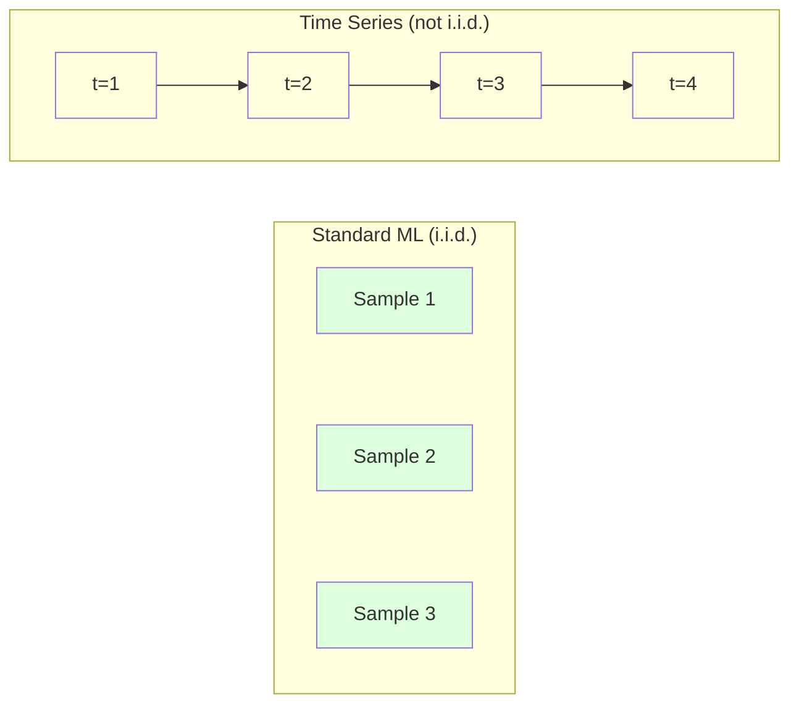
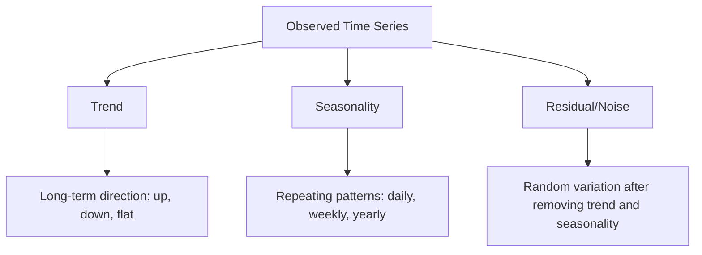
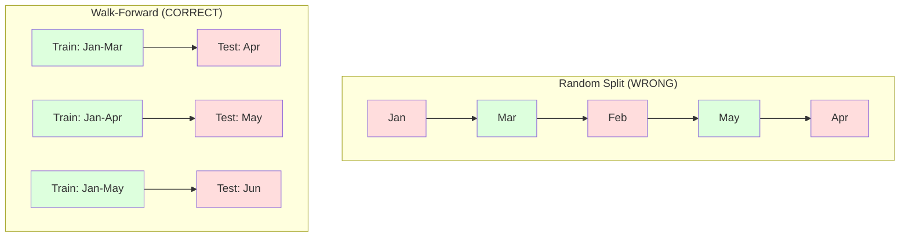

# Dasar-dasar Deret Waktu

> Kinerja masa lalu memprediksi hasil di masa depan -- jika kamu memeriksa stasioneritasnya terlebih dahulu.

**Type:** Build
**Language:** Python
**Prerequisites:** Phase 2, Lesson 01-09
**Waktu:** ~90 menit

## Tujuan Pembelajaran

- Uraikan deret waktu menjadi tren, musiman, dan komponen sisa, lalu uji stasioneritasnya
- Menerapkan feature kelambatan dan statistik bergulir untuk mengubah rangkaian waktu menjadi masalah pembelajaran yang diawasi
- Membangun kerangka validasi yang berjalan maju yang mencegah kebocoran data di masa depan ke dalam training
- Jelaskan mengapa pemisahan training/pengujian acak tidak valid untuk deret waktu dan tunjukkan kesenjangan kinerja versus pemisahan temporal yang tepat

## Masalah

kamu memiliki data yang diurutkan berdasarkan waktu. Penjualan harian, suhu per jam, penggunaan CPU per menit, harga saham mingguan. kamu ingin memprediksi nilai berikutnya, minggu depan, kuartal berikutnya.

kamu menggunakan perangkat ML standar kamu: pemisahan training/pengujian acak, validasi silang, masuknya matrix feature, keluar prediksi. Setiap langkah salah.

Deret waktu mematahkan asumsi yang diandalkan oleh ML standar. Sample tidak independen -- suhu hari ini bergantung pada suhu kemarin. Perpecahan acak membocorkan informasi masa depan ke masa lalu. Feature yang tampak bagus dalam pengujian backtest gagal dalam produksi karena mengandalkan pola yang berubah seiring waktu.

Model yang mendapatkan akurasi 95% dengan validasi silang acak mungkin mendapatkan 55% dengan evaluasi berbasis waktu yang tepat. Perbedaannya bukanlah masalah teknis. Inilah perbedaan antara model yang bekerja di atas kertas dan model yang bekerja di produksi.

Lesson ini mencakup dasar-dasar: apa yang membuat data waktu berbeda, cara mengevaluasi model secara jujur, dan cara mengubah deret waktu menjadi feature yang dapat digunakan oleh model ML standar.

## Konsep

### Apa yang Membuat Rangkaian Waktu Berbeda

ML standar mengasumsikan i.i.d. -- independen dan terdistribusi secara identik. Tiap sample diambil dari distribusi yang sama, tidak bergantung pada sample lainnya. Deret waktu melanggar keduanya:

- **Tidak independen.** Harga saham hari ini bergantung pada harga saham kemarin. Penjualan minggu ini berkorelasi dengan minggu lalu.
- **Tidak terdistribusi secara identik.** Distribusinya bergeser seiring waktu. Penjualan di bulan Desember terlihat berbeda dengan penjualan di bulan Maret.

Pelanggaran-pelanggaran tersebut bukanlah pelanggaran ringan. Mereka mengubah cara kamu membuat feature, cara kamu mengevaluasi model, dan algoritme mana yang berfungsi.



Dalam ML standar, sample dapat dipertukarkan. Mengacaknya tidak mengubah apa pun. Dalam deret waktu, keteraturan adalah segalanya. Pengacakan menghancurkan sinyal.

### Komponen Rangkaian Waktu

Setiap deret waktu merupakan kombinasi dari:



- **Tren**: Arah jangka panjang. Pendapatan tumbuh 10% per tahun. Kenaikan suhu global.
- **Musimalitas**: Pola berulang pada interval tetap. Penjualan ritel melonjak di bulan Desember. Penggunaan AC mencapai puncaknya pada bulan Juli.
- **Sisa**: Apa pun yang tersisa setelah menghilangkan tren dan musim. Jika sisa tampak seperti white noise, decomposition tersebut menangkap sinyal.

### Stasioneritas

Suatu deret waktu dikatakan stasioner jika sifat statistiknya (rata-rata, varians, autokorelasi) tidak berubah seiring waktu. Kebanyakan metode peramalan mengasumsikan stasioneritas.

**Mengapa penting:** Deret non-stasioner memiliki mean yang menyimpang. Model yang dilatih berdasarkan data dari bulan Januari telah mempelajari rata-rata yang berbeda dari apa yang akan ditampilkan pada bulan Februari. Ini akan menjadi kesalahan secara sistematis.

**Cara memeriksanya:** Hitung rata-rata bergulir dan deviasi standar bergulir pada jendela. Jika menyimpang, maka deret tersebut tidak stasioner.**Cara memperbaiki:** Perbedaan. Daripada memodelkan nilai mentah, modelkan perubahan antara nilai yang berurutan:

```
diff[t] = value[t] - value[t-1]
```

Jika satu putaran pembedaan tidak membuat deret tersebut stasioner, terapkan lagi (diferensiasi orde kedua). Kebanyakan seri dunia nyata memerlukan paling banyak dua putaran.

**Contoh:**

Seri asli: [100, 102, 106, 112, 120]
Perbedaan pertama: [2, 4, 6, 8] (masih dalam tren naik)
Perbedaan kedua: [2, 2, 2] (konstan -- stasioner)

Seri aslinya memiliki tren kuadrat. Perbedaan pertama mengubahnya menjadi tren linier. Perbedaan kedua membuatnya datar. Dalam praktiknya, kamu jarang membutuhkan lebih dari dua putaran.

**Uji formal:** Uji Augmented Dickey-Fuller (ADF) adalah uji statistik standar untuk stasioneritas. Hipotesis nolnya adalah "deret tersebut tidak stasioner". Nilai p di bawah 0,05 berarti kamu dapat menolak nol dan menyimpulkan stasioneritas. Kami tidak menerapkan ADF dari awal (hal ini memerlukan tabel distribusi asimtotik), namun pendekatan statistik bergulir dalam code kami memberikan pemeriksaan visual yang praktis.

### Autokorelasi

Autokorelasi mengukur seberapa besar korelasi suatu nilai pada waktu t dengan nilai pada waktu t-k (k langkah di masa lalu). Fungsi autokorelasi (ACF) memplot korelasi ini untuk setiap lag k.

**ACF memberi tahu kamu:**
- Seberapa jauh seri ini diingat. Jika ACF turun ke nol setelah lag 5, nilai lebih dari 5 langkah yang lalu tidak relevan.
- Apakah ada musiman. Jika ACF melonjak pada lag 12 (data bulanan), maka terjadi musiman tahunan.
- Berapa banyak feature lag yang harus dibuat. Gunakan kelambatan hingga ACF menjadi dapat diabaikan.

**PACF (Fungsi Autokorelasi Parsial)** menghilangkan korelasi tidak langsung. Jika hari ini berkorelasi dengan 3 hari yang lalu hanya karena keduanya berkorelasi dengan kemarin, maka PACF pada lag 3 akan menjadi nol sedangkan ACF pada lag 3 tidak.

### Feature Lag: Mengubah Rangkaian Waktu menjadi Pembelajaran yang Diawasi

Model ML standar memerlukan matrix feature X dan target y. Deret waktu memberi kamu satu kolom nilai. Jembatan ini memiliki feature lag.

Ambil seri [10, 12, 14, 13, 15] dan buat feature lag-1 dan lag-2:

| lag_2 | lag_1 | sasaran |
|-------|-------|--------|
| 10 | 12 | 14 |
| 12 | 14 | 13 |
| 14 | 13 | 15 |

Sekarang kamu memiliki masalah regresi standar. Model ML apa pun (regresi linier, hutan acak, peningkatan gradient) dapat memprediksi target dari kelambatan.

Feature tambahan yang dapat kamu rekayasa:
- **Statistik bergulir:** mean, std, min, max pada nilai k terakhir
- **Feature kalender:** hari dalam seminggu, bulan, hari_liburan, akhir_akhir pekan
- **Nilai yang berbeda:** berubah dari langkah sebelumnya
- **Statistik yang diperluas:** rata-rata kumulatif, jumlah kumulatif
- **Feature rasio:** nilai saat ini / rata-rata bergulir (seberapa jauh dari rata-rata terkini)
- **Feature interaksi:** lag_1 * day_of_week (efek hari kerja pada momentum)

**Berapa banyak lag?** Gunakan fungsi autokorelasi. Jika ACF signifikan hingga lag 10, gunakan minimal 10 lag. Jika ada musiman mingguan, sertakan lag 7 (dan mungkin 14). Semakin banyak lag akan memberikan lebih banyak histori pada model, namun juga memiliki lebih banyak feature yang dapat disesuaikan, sehingga meningkatkan risiko overfitting.

**Perangkap penyelarasan target.** Saat membuat feature lag, target harus berupa nilai pada waktu t, dan semua feature harus menggunakan nilai pada waktu t-1 atau lebih awal. Jika kamu secara tidak sengaja memasukkan nilai pada waktu t sebagai feature, kamu memiliki prediktor yang sempurna -- dan model yang sama sekali tidak berguna. Ini adalah bug paling umum dalam rekayasa feature deret waktu.

### Validasi Berjalan ke DepanIni adalah konsep terpenting dalam lesson ini. Validasi silang k-fold standar secara acak menetapkan sample untuk dilatih dan diuji. Untuk deret waktu, ini membocorkan informasi masa depan.



Validasi maju:
1. Melatih data hingga waktu t
2. Prediksi pada waktu t+1 (atau t+1 hingga t+k untuk multi-langkah)
3. Geser jendela ke depan
4. Ulangi

Setiap lipatan pengujian hanya berisi data yang muncul setelah semua training data. Tidak ada kebocoran di masa depan. Ini memberi kamu perkiraan yang jujur ​​tentang bagaimana kinerja model saat diterapkan.

**Perluasan jendela** menggunakan semua data historis untuk training (jendela bertambah). **Jendela geser** menggunakan jendela training berukuran tetap (slide jendela). Gunakan perluasan jika kamu yakin data lama masih relevan. Gunakan geser ketika dunia berubah dan data lama rusak.

### Intuisi ARIMA

ARIMA adalah model deret waktu klasik. Ini memiliki tiga komponen:

- **AR (Autoregressive):** Memprediksi dari nilai masa lalu. AR(p) menggunakan nilai p terakhir.
- **I (Terintegrasi):** Diferensiasi untuk mencapai stasioneritas. I(d) menerapkan d putaran pembedaan.
- **MA (Moving Average):** Memprediksi dari kesalahan perkiraan masa lalu. MA(q) menggunakan kesalahan q terakhir.

ARIMA(p, d, q) menggabungkan ketiganya. kamu memilih p, d, q berdasarkan analisis ACF/PACF atau pencarian otomatis (ARIMA otomatis).

Kami tidak akan mengimplementasikan ARIMA dari awal -- hal ini memerlukan optimization numerik yang berada di luar cakupan lesson ini. Kuncinya adalah memahami fungsi masing-masing komponen sehingga kamu dapat menginterpretasikan hasil ARIMA dan mengetahui kapan harus menggunakannya.

### Kapan Menggunakan Apa

| Pendekatan | Terbaik Untuk | Menangani Musiman | Menangani Feature Eksternal |
|----------|---------|-------------------|------------------------|
| Feature Lag + ML | Tabel dengan banyak feature eksternal | Dengan feature kalender | Ya |
| ARIMA | Seri univariat tunggal, jangka pendek | Varian SARIMA | Tidak (ARIMAX terbatas) |
| Pemulusan eksponensial | Tren sederhana + musiman | Ya (Holt-Winters) | Tidak |
| Nabi | Peramalan bisnis, hari libur | Ya (istilah Fourier) | Terbatas |
| Jaringan saraf (LSTM, Transformer) | Urutan panjang, banyak seri | Dipelajari | Ya |

Untuk sebagian besar masalah praktis, feature lag + peningkatan gradient adalah titik awal yang paling kuat. Ini menangani feature eksternal secara alami, tidak memerlukan stasioneritas, dan mudah untuk di-debug.

### Peramalan Cakrawala dan Strategi

Peramalan satu langkah memperkirakan satu langkah ke depan. Peramalan multi-langkah memprediksi beberapa langkah. Ada tiga strategi:

**Rekursif (diulang):** Prediksi satu langkah ke depan, gunakan prediksi sebagai input untuk langkah berikutnya. Sederhana namun kesalahan terakumulasi -- setiap prediksi menggunakan prediksi sebelumnya, sehingga kesalahan bertambah.

**Langsung:** Latih model terpisah untuk setiap horizon. Model-1 memprediksi t+1, Model-5 memprediksi t+5. Tidak ada akumulasi kesalahan, tetapi setiap model memiliki sample training yang lebih sedikit dan tidak berbagi informasi.

**Multi-output:** Latih satu model yang mengeluarkan semua horizon secara bersamaan. Berbagi informasi lintas cakrawala tetapi memerlukan model yang mendukung banyak output (atau loss function khusus).

Untuk sebagian besar soal praktis, mulailah dengan rekursif untuk horizon pendek (1-5 langkah) dan arahkan untuk horizon yang lebih panjang.

### Kesalahan Umum dalam Rangkaian Waktu| Kesalahan | Mengapa itu terjadi | Bagaimana cara memperbaikinya |
|---------|---------------|-----------|
| Pemisahan kereta/tes acak | Kebiasaan dari ML standar | Gunakan walk-forward atau temporal split |
| Menggunakan feature masa depan | Feature pada waktu t disertakan secara tidak sengaja | Audit setiap feature untuk penyelarasan temporal |
| Terlalu pas dengan musim | Model menghafal pola kalender | Tahan siklus musiman penuh di set pengujian |
| Mengabaikan perubahan skala | Pendapatan berlipat ganda tetapi pola tetap | Perubahan persentase model, bukan | absolut
| Terlalu banyak feature lag | "Lebih banyak sejarah lebih baik" | Gunakan ACF untuk menentukan lag yang relevan |
| Tidak membeda-bedakan | "Model akan mengetahuinya" | Model pohon menangani tren; model linier membutuhkan stasioneritas |

## Build

Code di `code/time_series.py` mengimplementasikan blok penyusun inti dari awal.

### Pembuat Feature Lag

```python
def make_lag_features(series, n_lags):
    n = len(series)
    X = np.full((n, n_lags), np.nan)
    for lag in range(1, n_lags + 1):
        X[lag:, lag - 1] = series[:-lag]
    valid = ~np.isnan(X).any(axis=1)
    return X[valid], series[valid]
```

Ini mengubah rangkaian 1D menjadi matrix feature yang setiap barisnya memiliki nilai `n_lags` terakhir sebagai feature, dan nilai saat ini sebagai target.

### Validasi Silang Berjalan ke Depan

```python
def walk_forward_split(n_samples, n_splits=5, min_train=50):
    assert min_train < n_samples, "min_train must be less than n_samples"
    step = max(1, (n_samples - min_train) // n_splits)
    for i in range(n_splits):
        train_end = min_train + i * step
        test_end = min(train_end + step, n_samples)
        if train_end >= n_samples:
            break
        yield slice(0, train_end), slice(train_end, test_end)
```

Setiap pemisahan memastikan training data hadir tepat sebelum data pengujian. Jendela training meluas dengan setiap lipatan.

### Model Autoregresif Sederhana

Model AR murni hanyalah regresi linier pada feature lag:

```python
class SimpleAR:
    def __init__(self, n_lags=5):
        self.n_lags = n_lags
        self.weights = None
        self.bias = None

    def fit(self, series):
        X, y = make_lag_features(series, self.n_lags)
        # Solve via normal equations
        X_b = np.column_stack([np.ones(len(X)), X])
        theta = np.linalg.lstsq(X_b, y, rcond=None)[0]
        self.bias = theta[0]
        self.weights = theta[1:]
        return self
```

Hal ini secara konseptual identik dengan regresi linier dari Lesson 02, tetapi diterapkan pada versi variabel yang sama dengan jeda waktu.

### Pemeriksaan Stasioneritas

Code ini menghitung statistik bergulir untuk menilai stasioneritas secara visual dan numerik:

```python
def check_stationarity(series, window=50):
    rolling_mean = np.array([
        series[max(0, i - window):i].mean()
        for i in range(1, len(series) + 1)
    ])
    rolling_std = np.array([
        series[max(0, i - window):i].std()
        for i in range(1, len(series) + 1)
    ])
    return rolling_mean, rolling_std
```

Jika rata-rata gelinding menyimpang atau std gelinding berubah, deret tersebut tidak stasioner. Terapkan pembedaan dan periksa lagi.

Code ini juga memeriksa stasioneritas dengan membandingkan paruh pertama dan paruh kedua rangkaian. Jika rata-rata berbeda lebih dari setengah deviasi standar atau rasio varian melebihi 2x, deret tersebut ditandai sebagai non-stasioner.

### Autokorelasi

```python
def autocorrelation(series, max_lag=20):
    n = len(series)
    mean = series.mean()
    var = series.var()
    acf = np.zeros(max_lag + 1)
    for k in range(max_lag + 1):
        cov = np.mean((series[:n-k] - mean) * (series[k:] - mean))
        acf[k] = cov / var if var > 0 else 0
    return acf
```

## Pakai

Dengan sklearn, kamu menggunakan feature lag secara langsung dengan regressor mana pun:

```python
from sklearn.linear_model import Ridge
from sklearn.ensemble import GradientBoostingRegressor

X, y = make_lag_features(series, n_lags=10)

for train_idx, test_idx in walk_forward_split(len(X)):
    model = Ridge(alpha=1.0)
    model.fit(X[train_idx], y[train_idx])
    predictions = model.predict(X[test_idx])
```

Untuk ARIMA, gunakan statsmodels:

```python
from statsmodels.tsa.arima.model import ARIMA

model = ARIMA(train_series, order=(5, 1, 2))
fitted = model.fit()
forecast = fitted.forecast(steps=30)
```

Code di `time_series.py` mendemonstrasikan kedua pendekatan dan membandingkannya menggunakan validasi walk-forward.

### sklearn TimeSeriesSplit

sklearn menyediakan `TimeSeriesSplit` yang mengimplementasikan validasi walk-forward:

```python
from sklearn.model_selection import TimeSeriesSplit

tscv = TimeSeriesSplit(n_splits=5)
for train_index, test_index in tscv.split(X):
    X_train, X_test = X[train_index], X[test_index]
    y_train, y_test = y[train_index], y[test_index]
    model.fit(X_train, y_train)
    score = model.score(X_test, y_test)
```

Ini setara dengan `walk_forward_split` kami sejak awal tetapi terintegrasi ke dalam kerangka validasi silang sklearn. kamu dapat menggunakannya dengan `cross_val_score`:

```python
from sklearn.model_selection import cross_val_score

scores = cross_val_score(model, X, y, cv=TimeSeriesSplit(n_splits=5))
print(f"Mean score: {scores.mean():.4f} +/- {scores.std():.4f}")
```

### Metrik Evaluasi

Perkiraan deret waktu menggunakan metrik regresi, tetapi dengan konteks yang memperhatikan waktu:

- **MAE (Mean Absolute Error):** Rata-rata |y_true - y_pred|. Mudah untuk ditafsirkan dalam unit asli. Rata-rata, prediksi meleset sebesar 3,2 derajat.
- **RMSE (Root Mean Squared Error):** Akar kuadrat dari mean squared error. Menghukum kesalahan besar lebih dari MAE. Gunakan ketika kesalahan besar lebih buruk daripada banyak kesalahan kecil.
- **MAPE (Rata-Rata Persentase Kesalahan Absolut):** Rata-rata |kesalahan / nilai_benar| * 100. Tidak bergantung pada skala, berguna untuk membandingkan berbagai seri. Tapi tidak terdefinisi ketika nilai sebenarnya adalah nol.
- **Perbandingan dasar yang naif:** Selalu bandingkan dengan dasar yang sederhana. Garis dasar naif musiman memperkirakan nilai dari satu periode yang lalu (kemarin, minggu lalu). Jika model kamu tidak bisa mengalahkan kenaifan, ada sesuatu yang salah.

### Feature BergulirKode ini menunjukkan penambahan statistik bergulir (rata-rata, std, min, maks selama jendela 7 dan 14 hari) ke feature lag. Hal ini memberikan informasi kepada model tentang tren dan volatilitas terkini yang tidak dapat ditangkap oleh feature-feature yang tertinggal.

Misalnya, jika rata-rata perputaran naik, hal ini menunjukkan tren naik. Jika rolling std meningkat, hal ini menunjukkan peningkatan volatilitas. Ini adalah jenis pola yang dapat dipelajari oleh model berbasis pohon, tetapi model linier tidak dapat mempelajarinya.

## Kirim

Lesson ini menghasilkan:
- `outputs/prompt-time-series-advisor.md` -- prompt untuk membingkai masalah deret waktu
- `code/time_series.py` -- feature lag, validasi walk-forward, model AR, pemeriksaan stasioneritas

### Garis Dasar yang Harus kamu Kalahkan

Sebelum membuat model apa pun, tetapkan garis dasar:

1. **Nilai terakhir (persistensi).** Prediksi hari esok akan sama dengan hari ini. Bagi banyak seri, hal ini sangat sulit dikalahkan.
2. **Naif musiman.** Memprediksi bahwa hari ini akan sama dengan hari yang sama pada minggu lalu (atau tahun lalu). Jika model kamu tidak dapat mengatasi hal ini, berarti model tersebut belum mempelajari pola berguna apa pun selain musiman.
3. **Rata-rata bergerak.** Memprediksi rata-rata nilai k terakhir. Menghaluskan kebisingan tetapi tidak dapat menangkap perubahan mendadak.

Jika model ML mewah kamu kalah dibandingkan model dasar naif musiman, kamu memiliki bug. Yang paling umum: kebocoran feature di masa mendatang, metode evaluasi yang salah, atau rangkaian yang benar-benar acak dan tidak dapat diprediksi.

### Tip Praktis

1. **Mulailah dengan membuat plot.** Sebelum melakukan pemodelan apa pun, buat plot rangkaian mentahnya. Carilah tren, musiman, outlier, perubahan struktural (perubahan perilaku yang tiba-tiba). Inspeksi visual selama 30 detik sering kali memberi tahu kamu analisis otomatis selama lebih dari satu jam.

2. **Perbedaan pertama, model kedua.** Jika rangkaian memiliki tren yang jelas, bedakan sebelum membuat feature lag. Model berbasis pohon dapat menangani tren, namun model linier tidak, dan pembedaan tidak ada salahnya.

3. **Tahan setidaknya satu siklus musiman penuh.** Jika kamu memiliki siklus musiman mingguan, set pengujian kamu memerlukan setidaknya satu minggu penuh. Jika bulanan, minimal satu bulan penuh. Jika tidak, kamu tidak dapat mengevaluasi apakah model tersebut menangkap pola musiman.

4. **Monitor dalam produksi.** Model deret waktu mengalami penurunan seiring waktu seiring dengan perubahan dunia. Lacak kesalahan prediksi secara bergiliran. Saat error mulai meningkat, latih kembali model berdasarkan data terbaru.

5. **Hati-hati terhadap pergantian rezim.** Model yang dilatih berdasarkan data sebelum pandemi tidak akan memprediksi perilaku pascapandemi. Sertakan indikator perubahan rezim yang diketahui sebagai feature, atau gunakan jendela geser yang melupakan data lama.

6. **Seri miring transformasi log.** Pendapatan, harga, dan penghitungan sering kali miring ke kanan. Mengambil log akan menstabilkan varians dan membuat pola perkalian menjadi aditif, yang dapat ditangani oleh model linier. Perkiraan dalam ruang log, lalu eksponensial untuk kembali ke satuan awal.

## Latihan

1. **Eksperimen stasioneritas.** Menghasilkan rangkaian dengan tren linier. Periksa stasioneritas dengan statistik bergulir. Terapkan pembedaan pertama. Periksa lagi. Berapa putaran pembedaan yang diperlukan untuk membuat tren kuadrat?

2. **Pemilihan lag.** Hitung ACF pada rangkaian musiman (periode=7). Lag manakah yang memiliki autokorelasi tertinggi? Buat feature lag hanya dengan menggunakan lag tersebut (bukan lag berturut-turut). Apakah akurasi meningkat dibandingkan menggunakan lag 1 hingga 7?

3. **Berjalan maju vs pemisahan acak.** Latih regresi Ridge pada feature lag. Evaluasi dengan pembagian 80/20 acak dan dengan validasi walk-forward. Seberapa besar pemisahan acak melebih-lebihkan kinerja?4. **Rekayasa feature.** Tambahkan feature rolling mean (window=7), rolling std (window=7), dan hari dalam seminggu ke feature lag. Bandingkan akurasi dengan dan tanpa tambahan ini menggunakan validasi langsung.

5. **Perkiraan multi-langkah.** Memodifikasi model AR untuk memprediksi 5 langkah ke depan, bukan 1. Bandingkan dua strategi: (a) prediksi satu langkah, gunakan prediksi tersebut sebagai input untuk langkah berikutnya (rekursif), dan (b) latih model terpisah untuk setiap horizon (langsung). Mana yang lebih akurat?

## Istilah Kunci

| Istilah | Apa kata orang | Apa sebenarnya arti |
|------|----------------|----------------------|
| stasioneritas | "Statistiknya tidak berubah seiring waktu" | Deret yang mean, varians, dan struktur autokorelasinya konstan sepanjang waktu |
| Membedakan | "Kurangi nilai yang berurutan" | Menghitung y[t] - y[t-1] untuk menghilangkan tren dan mencapai stasioneritas |
| Autokorelasi (ACF) | "Bagaimana suatu rangkaian berkorelasi dengan dirinya sendiri" | Korelasi antara deret waktu dan salinannya yang tertinggal, sebagai fungsi dari lag |
| Autokorelasi parsial (PACF) | "Hanya korelasi langsung" | Autokorelasi pada lag k setelah menghilangkan efek semua lag yang lebih pendek |
| Feature kelambatan | "Nilai masa lalu sebagai input" | Menggunakan y[t-1], y[t-2], ..., y[t-k] sebagai feature untuk memprediksi y[t] |
| Validasi maju | "Validasi silang yang menghargai waktu" | Evaluasi dimana data latih selalu mendahului data uji secara kronologis |
| ARIMA | "Model deret waktu klasik" | Rata-Rata Pergerakan Terintegrasi AutoRegresif: menggabungkan nilai masa lalu (AR), perbedaan (I), dan kesalahan masa lalu (MA) |
| Musiman | "Pola kalender berulang" | Siklus teratur dan dapat diprediksi dalam rangkaian waktu yang dikaitkan dengan periode kalender (harian, mingguan, tahunan) |
| Tren | "Arah jangka panjang" | Peningkatan atau penurunan level seri yang terus-menerus dari waktu ke waktu |
| Memperluas jendela | "Gunakan semua riwayat" | Validasi maju di mana set training bertambah setiap kali lipat |
| Jendela geser | "Riwayat ukuran tetap" | Validasi berjalan ke depan di mana set training adalah jendela dengan panjang tetap yang meluncur ke depan |

## Bacaan Lanjutan

- [Hyndman dan Athanasopoulos, Forecasting: Principles and Practice (Edisi ke-3rd)](https://otexts.com/fpp3/) -- buku teks gratis terbaik tentang peramalan deret waktu
- [scikit-learn Time Series Split](https://scikit-learn.org/stable/modules/generated/sklearn.model_selection.TimeSeriesSplit.html) -- walk-forward splitter sklearn
- [statsmodels dokumen ARIMA](https://www.statsmodels.org/stable/generated/statsmodels.tsa.arima.model.ARIMA.html) -- Implementasi ARIMA dengan diagnostik
- [Makridakis dkk., Kompetisi M5 (2022)](https://www.sciencedirect.com/science/article/pii/S0169207021001874) -- kompetisi perkiraan skala besar yang menampilkan metode ML vs metode statistik
