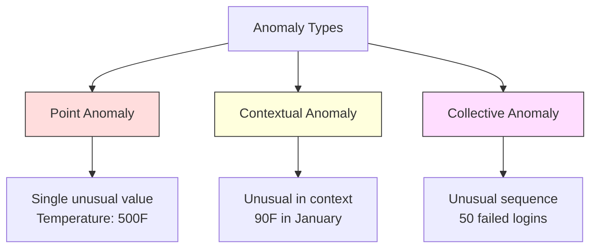
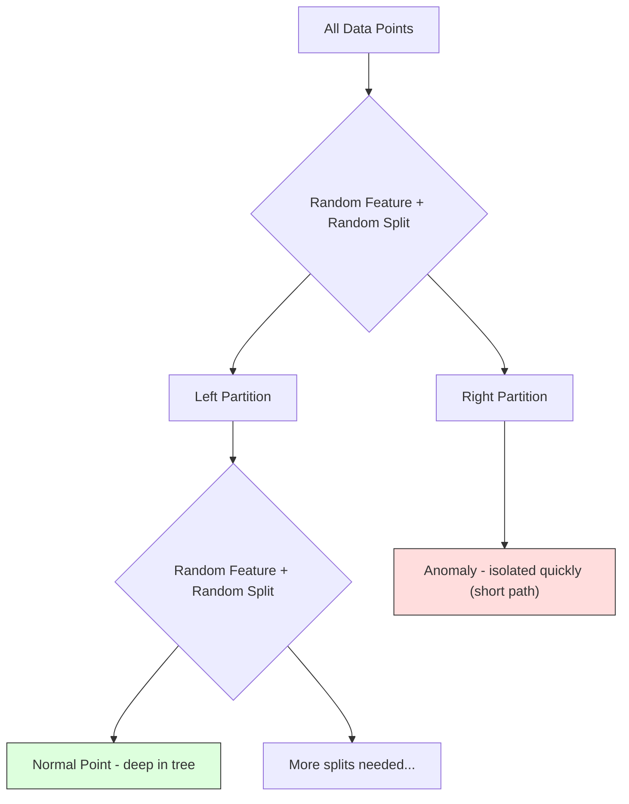

# Deteksi Anomali

> Normal mudah untuk didefinisikan. Abnormal adalah segala sesuatu yang tidak sesuai.

**Type:** Build
**Language:** Python
**Prerequisites:** Phase 2, Lesson 01-09
**Waktu:** ~75 menit

## Tujuan Pembelajaran

- Menerapkan metode deteksi anomali Z-score, IQR, dan Hutan Isolasi dari awal
- Bedakan antara anomali titik, kontekstual, dan kolektif, lalu pilih metode deteksi yang sesuai untuk masing-masing anomali
- Jelaskan mengapa deteksi anomali dibingkai sebagai pemodelan data normal daripada mengklasifikasikan anomali
- Bandingkan deteksi anomali tanpa pengawasan dengan klasifikasi yang diawasi dan evaluasi keseimbangan antara cakupan anomali baru dan presisi

## Masalah

Kartu kredit digunakan di New York pada pukul 14.00, kemudian di Tokyo pada pukul 14.05. Sensor pabrik membaca 150 derajat ketika kisaran normalnya adalah 80-120. Sebuah server mengirimkan 50.000 permintaan per detik ketika rata-rata hariannya adalah 200.

Ini adalah anomali. Menemukannya penting. Penipuan menghabiskan biaya miliaran. Kegagalan peralatan memerlukan waktu henti. Data biaya intrusi jaringan.

Tantangannya: kamu jarang memberi label pada contoh anomali. Penipuan mencapai 0,1% dari transaksi. Kegagalan peralatan terjadi beberapa kali dalam setahun. kamu tidak dapat melatih pengklasifikasi standar karena hampir tidak ada apa pun di kelas "anomali" yang dapat dipelajari. Bahkan jika kamu memiliki beberapa label, anomali yang kamu lihat bukanlah satu-satunya jenis yang akan kamu temui. Skema penipuan masa depan terlihat berbeda dengan skema saat ini.

Deteksi anomali membalikkan masalah. Daripada mempelajari apa yang tidak normal, pelajarilah apa yang normal. Apa pun yang menyimpang dari normal adalah hal yang mencurigakan. Ini berfungsi tanpa label, beradaptasi dengan jenis anomali baru, dan menskalakan ke dataset yang sangat besar.

## Konsep

### Jenis Anomali

Tidak semua anomali itu sama:

- **Anomali titik.** Satu titik data yang tidak biasa, apa pun konteksnya. Pembacaan suhu 500 derajat. Transaksi sebesar $50.000 dari akun yang biasanya membelanjakan $50.
- **Anomali kontekstual.** Titik data yang tidak biasa mengingat konteksnya. Suhu 90 derajat adalah normal di musim panas, dan tidak normal di musim dingin. Nilai yang sama, konteks yang berbeda.
- **Anomali kolektif.** Urutan titik data yang tidak biasa sebagai sebuah kelompok, meskipun masing-masing titik mungkin normal. Lima kegagalan login adalah normal. Lima puluh berturut-turut adalah serangan brute force.

Kebanyakan metode mendeteksi anomali titik. Anomali kontekstual memerlukan feature waktu atau lokasi. Anomali kolektif memerlukan metode yang sadar urutan.



### Pembingkaian Tanpa Pengawasan

Dalam klasifikasi standar, kamu memiliki label untuk kedua kelas. Dalam deteksi anomali, kamu biasanya menghadapi salah satu dari tiga situasi:

1. **Sepenuhnya tanpa pengawasan.** Tidak ada label sama sekali. kamu memasang detektor pada semua data dan berharap anomali cukup jarang terjadi sehingga tidak merusak model "normal".
2. **Semi-diawasi.** kamu hanya memiliki dataset bersih yang terdiri dari data normal. kamu cocok di set bersih ini dan mencetak gol lainnya. Ini adalah pengaturan terkuat jika memungkinkan.
3. **Pengawasan lemah.** kamu memiliki beberapa anomali berlabel. Gunakan mereka untuk evaluasi, bukan training. Berlatih tanpa pengawasan, lalu ukur presisi/recall pada subset yang diberi label.

Wawasan utamanya: deteksi anomali pada dasarnya berbeda dari klasifikasi. kamu memodelkan distribusi data normal, bukan batas keputusan antara dua kelas.

### Diawasi vs Tidak Diawasi: Pengorbanannya

Jika kamu memiliki anomali berlabel, haruskah kamu menggunakannya untuk training (klasifikasi yang diawasi) atau untuk evaluasi saja (deteksi tanpa pengawasan)?**Diawasi (dianggap sebagai klasifikasi):**
- Menangkap jenis anomali yang pernah kamu lihat sebelumnya
- Presisi lebih tinggi pada jenis anomali yang diketahui
- Merindukan tipe anomali baru sepenuhnya
- Memerlukan training ulang ketika jenis anomali baru muncul
- Memerlukan contoh anomali yang cukup (seringkali terlalu sedikit)

**Tanpa pengawasan (model normal, penyimpangan tanda):**
- Menangkap segala penyimpangan dari normal, termasuk tipe baru
- Tidak memerlukan anomali berlabel
- Tingkat positif palsu yang lebih tinggi (tidak segala sesuatu yang tidak biasa itu buruk)
- Lebih kuat terhadap peralihan distribusi

Dalam praktiknya, sistem terbaik menggabungkan keduanya: deteksi tanpa pengawasan untuk cakupan luas, model yang diawasi untuk jenis anomali prioritas tinggi yang diketahui, dan peninjauan manusia untuk kasus-kasus yang ambigu.

### Metode Skor Z

Pendekatan paling sederhana. Hitung mean dan deviasi standar setiap feature. Tandai titik mana pun yang lebih dari k standar deviasi dari mean.

```text
z_score = (x - mean) / std
anomaly if |z_score| > threshold
```

Ambang batas defaultnya adalah 3,0 (99,7% data normal berada dalam 3 standar deviasi untuk distribusi Gaussian).

**Kelebihan:** Sederhana. Cepat. Dapat ditafsirkan ("nilai ini adalah 4,5 standar deviasi dari normal").

**Kelemahan:** Mengasumsikan data terdistribusi normal. Sensitif terhadap outlier dalam training data (outlier menggeser mean dan meningkatkan std, sehingga lebih sulit dideteksi). Gagal pada distribusi multimodal.

**Jika berfungsi dengan baik:** Pemantauan feature tunggal dengan data yang kira-kira berbentuk lonceng. Waktu respons server, toleransi produksi, pembacaan sensor dengan garis dasar yang stabil.

**Jika gagal:** Data multi-cluster (dua lokasi kantor dengan suhu dasar yang berbeda), data yang miring (jumlah transaksi yang jarang terjadi sebesar $1000 tetapi bukan anomali), data dengan outlier di set training.

### Metode IQR

Lebih kuat dari Z-score. Menggunakan rentang interkuartil, bukan mean dan deviasi standar.

```
Q1 = 25th percentile
Q3 = 75th percentile
IQR = Q3 - Q1
lower_bound = Q1 - factor * IQR
upper_bound = Q3 + factor * IQR
anomaly if x < lower_bound or x > upper_bound
```

Faktor defaultnya adalah 1,5.

**Kekuatan:** Kuat terhadap outlier (persentil tidak terpengaruh oleh nilai ekstrem). Bekerja pada distribusi miring. Tidak ada asumsi normalitas.

**Kelemahan:** Hanya univariat (berlaku per feature secara independen). Tidak dapat mendeteksi anomali yang tidak biasa hanya jika feature dipertimbangkan bersama-sama (suatu titik mungkin normal di setiap feature secara individual namun anomali di ruang gabungan).

**Catatan praktis:** Faktor 1,5 dalam IQR sama dengan kumis dalam plot kotak. Titik-titik di luar kumis berpotensi menjadi outlier. Menggunakan 3.0 dibandingkan 1.5 membuat detektor lebih konservatif (lebih sedikit tanda, lebih sedikit positif palsu). Faktor yang tepat bergantung pada toleransi kamu terhadap alarm palsu.

### Hutan Isolasi

Wawasan utamanya: anomali sedikit dan berbeda. Dalam partisi data secara acak, anomali lebih mudah diisolasi -- anomali memerlukan lebih sedikit pemisahan acak untuk dipisahkan dari yang lain.



**Cara kerjanya:**
1. Build banyak pohon acak (hutan isolasi)
2. Di setiap node, pilih feature acak dan nilai pemisahan acak antara nilai min dan maks
3. Terus belah hingga setiap titik terisolasi (di daunnya sendiri)
4. Anomali memiliki rata-rata panjang jalur yang lebih pendek di seluruh pohon

**Mengapa berhasil:** Titik normal berada di daerah padat. Banyak pemisahan acak diperlukan untuk mengisolasi satu dari tetangganya. Anomali hidup di daerah yang jarang. Satu atau dua pemisahan acak sudah cukup untuk mengisolasi mereka.

Skor anomali didasarkan pada panjang jalur rata-rata di semua pohon, dinormalisasi dengan panjang jalur yang diharapkan dari pohon pencarian biner acak:

```
score(x) = 2^(-average_path_length(x) / c(n))
```Dimana `c(n)` adalah panjang jalur yang diharapkan untuk n sample. Skor mendekati 1 berarti anomali. Skor mendekati 0,5 berarti normal. Skor mendekati 0 berarti sangat normal (dalam kelompok padat).

**Kelebihan:** Tidak ada asumsi distribusi. Bekerja dalam high-dimensional. Berskala dengan baik (ukuran sample sublinear karena setiap pohon menggunakan subsampel). Menangani tipe feature campuran.

**Kelemahan:** Berjuang melawan anomali di wilayah padat (efek penyembunyian). Pemisahan acak kurang efektif bila banyak feature tidak relevan.

**Hyperparameter utama:**
- `n_estimators`: Jumlah pohon. 100 biasanya cukup. Lebih banyak pohon memberikan skor yang lebih stabil tetapi komputasi lebih lambat.
- `max_samples`: Jumlah sample per pohon. 256 adalah default di kertas asli. Nilai yang lebih kecil membuat masing-masing pohon menjadi kurang akurat namun meningkatkan keanekaragaman. Subsampling inilah yang membuat Isolation Forest cepat -- setiap pohon melihat sebagian kecil data.
- `contamination`: Fraksi anomali yang diharapkan. Hanya digunakan untuk mengatur ambang batas. Tidak mempengaruhi skor itu sendiri.

### Faktor Pencilan Lokal (LOF)

LOF membandingkan kepadatan lokal di sekitar suatu titik dengan kepadatan di sekitar titik tetangganya. Suatu titik di wilayah jarang yang dikelilingi oleh wilayah padat adalah anomali.

**Cara kerjanya:**
1. Untuk setiap titik, carilah k tetangga terdekatnya
2. Hitung kepadatan keterjangkauan lokal (seberapa padat lingkungan sekitar)
3. Bandingkan kepadatan setiap titik dengan kepadatan tetangganya
4. Jika suatu titik memiliki kepadatan yang jauh lebih rendah dibandingkan titik tetangganya, maka titik tersebut merupakan outlier

**Skor LOF:**
- LOF mendekati 1,0 berarti kepadatan sama dengan tetangga (normal)
- LOF lebih besar dari 1,0 berarti kepadatan lebih rendah dibandingkan tetangganya (berpotensi anomali)
- LOF jauh lebih besar dari 1,0 (misalnya 2,0+) berarti kepadatan jauh lebih rendah (kemungkinan anomali)

Bagian “lokal” sangatlah penting. Pertimbangkan dataset dengan dua cluster: cluster padat yang terdiri dari 1000 titik dan cluster jarang yang terdiri dari 50 titik. Sebuah titik di tepi cluster yang jarang bukanlah hal yang aneh secara global -- ia memiliki 50 tetangga. Namun secara lokal, merupakan hal yang tidak biasa jika tetangga terdekatnya lebih padat daripada sebelumnya. LOF menangkap nuansa yang terlewatkan oleh metode global.

**Kelebihan:** Mendeteksi anomali lokal (titik-titik yang tidak lazim di lingkungannya, meskipun anomali tersebut bukan merupakan anomali global). Bekerja pada kelompok dengan kepadatan berbeda.

**Kelemahan:** Lambat pada dataset besar (O(n^2) karena implementasi yang naif). Sensitif terhadap pilihan k. Tidak berfungsi dengan baik dalam dimension yang sangat tinggi (curse of dimensionality mempengaruhi penghitungan distance).

### Perbandingan

| Metode | Asumsi | Kecepatan | Menangani Peredupan Tinggi | Mendeteksi Anomali Lokal |
|--------|------------|-------|-------------------|------------------------|
| Skor Z | Distribusi normal | Sangat cepat | Ya (per feature) | Tidak |
| IQR | Tidak ada (per feature) | Sangat cepat | Ya (per feature) | Tidak |
| Hutan Isolasi | Tidak ada | Cepat | Ya | Sebagian |
| LOF | Distance itu bermakna | Lambat | Buruk | Ya |

### Tantangan Evaluasi

Mengevaluasi detektor anomali lebih sulit daripada mengevaluasi pengklasifikasi:

- **Ketidakseimbangan kelas ekstrem.** Dengan anomali 0,1%, memprediksi "normal" untuk semuanya memberikan akurasi 99,9%. Akurasi tidak ada gunanya.
- **AUROC menyesatkan.** Dengan ketidakseimbangan yang parah, AUROC dapat terlihat bagus meskipun modelnya tidak memperhitungkan sebagian besar anomali pada ambang batas praktis.
- **Metrik yang lebih baik:** Precision@k (dari k item teratas yang ditandai, berapa banyak yang merupakan anomali nyata), AUPRC (area di bawah kurva presisi-recall), dan recall pada tingkat positif palsu yang tetap.

```mermaid
flowchart LR
    A[Raw Data] --> B[Train on Normal Data Only]
    B --> C[Score All Test Data]
    C --> D[Rank by Anomaly Score]
    D --> E[Evaluate Top-K Flagged Items]
    E --> F[Precision at K / AUPRC]

    style A fill:#f9f,stroke:#333
    style F fill:#9f9,stroke:#333
```### Pipeline Deteksi Anomali

Dalam praktiknya, deteksi anomali mengikuti alur kerja berikut:

1. **Kumpulkan data dasar.** Idealnya, periode ketika kamu mengetahui tidak ada (atau sangat sedikit) anomali.
2. **Rekayasa feature.** Feature mentah ditambah feature turunan (statistik bergulir, feature waktu, rasio).
3. **Latih detektornya.** Cocok dengan data dasar. Model mempelajari seperti apa tampilan "normal".
4. **Skor data baru.** Setiap observasi baru mendapat skor anomali.
5. **Pemilihan ambang batas.** Pilih batas skor. Ini adalah keputusan bisnis: ambang batas yang lebih tinggi berarti lebih sedikit alarm palsu namun lebih banyak anomali yang terlewat.
6. **Peringatkan dan selidiki.** Poin yang ditandai akan dikirim ke tinjauan manusia atau respons otomatis.
7. **Pengumpulan input.** Catat apakah item yang ditandai merupakan anomali nyata atau alarm palsu. Gunakan data ini untuk mengevaluasi detektor dan menyesuaikan ambang batas dari waktu ke waktu.

Pipeline pipa tersebut tidak pernah "selesai". Distribusi data bergeser, jenis anomali baru muncul, dan ambang batas perlu disesuaikan. Perlakukan deteksi anomali sebagai sistem yang hidup, bukan model yang hanya ada satu kali saja.

## Build

Code di `code/anomaly_detection.py` mengimplementasikan Z-score, IQR, dan Isolation Forest dari awal.

### Detektor Skor Z

```python
def zscore_detect(X, threshold=3.0):
    mean = X.mean(axis=0)
    std = X.std(axis=0)
    std[std == 0] = 1.0
    z = np.abs((X - mean) / std)
    return z.max(axis=1) > threshold
```

Sederhana dan vector. Menandai suatu titik jika ada feature yang melebihi ambang batas.

### Detektor IQR

```python
def iqr_detect(X, factor=1.5):
    q1 = np.percentile(X, 25, axis=0)
    q3 = np.percentile(X, 75, axis=0)
    iqr = q3 - q1
    iqr[iqr == 0] = 1.0
    lower = q1 - factor * iqr
    upper = q3 + factor * iqr
    outside = (X < lower) | (X > upper)
    return outside.any(axis=1)
```

### Isolasi Hutan dari Awal

Implementasi dari awal membangun pohon isolasi yang mempartisi ruang feature secara acak:

```python
class IsolationTree:
    def __init__(self, max_depth):
        self.max_depth = max_depth

    def fit(self, X, depth=0):
        n, p = X.shape
        if depth >= self.max_depth or n <= 1:
            self.is_leaf = True
            self.size = n
            return self
        self.is_leaf = False
        self.feature = np.random.randint(p)
        x_min = X[:, self.feature].min()
        x_max = X[:, self.feature].max()
        if x_min == x_max:
            self.is_leaf = True
            self.size = n
            return self
        self.threshold = np.random.uniform(x_min, x_max)
        left_mask = X[:, self.feature] < self.threshold
        self.left = IsolationTree(self.max_depth).fit(X[left_mask], depth + 1)
        self.right = IsolationTree(self.max_depth).fit(X[~left_mask], depth + 1)
        return self
```

Panjang jalur untuk mengisolasi suatu titik menentukan skor anomalinya. Jalur yang lebih pendek berarti lebih banyak anomali.

Kelas `IsolationForest` membungkus beberapa pohon:

```python
class IsolationForest:
    def __init__(self, n_estimators=100, max_samples=256, seed=42):
        self.n_estimators = n_estimators
        self.max_samples = max_samples

    def fit(self, X):
        sample_size = min(self.max_samples, X.shape[0])
        max_depth = int(np.ceil(np.log2(sample_size)))
        for _ in range(self.n_estimators):
            idx = rng.choice(X.shape[0], size=sample_size, replace=False)
            tree = IsolationTree(max_depth=max_depth)
            tree.fit(X[idx])
            self.trees.append(tree)

    def anomaly_score(self, X):
        avg_path = average path length across all trees
        scores = 2.0 ** (-avg_path / c(max_samples))
        return scores
```

Faktor normalisasi `c(n)` adalah panjang jalur yang diharapkan dari pencarian yang gagal dalam pohon pencarian biner dengan n elemen. Sama dengan `2 * H(n-1) - 2*(n-1)/n` dengan `H` adalah bilangan harmonik. Normalisasi ini memastikan skor dapat dibandingkan di seluruh dataset dengan ukuran berbeda.

### Skenario Demo

Code ini menghasilkan beberapa skenario pengujian:

1. **Kluster tunggal dengan outlier.** Klaster Gaussian 2D dengan anomali yang dimasukkan jauh dari pusat. Semua metode harusnya berhasil di sini.
2. **Data multimodal.** Tiga cluster dengan ukuran dan kepadatan berbeda. Titik antar cluster tidak normal. Z-score kesulitan karena rentang per fiturnya luas.
3. **Data berdimensi tinggi.** 50 feature, namun anomali hanya berbeda pada 5 feature. Menguji apakah metode dapat menemukan anomali dalam subset feature.

Setiap demo membandingkan semua metode menggunakan presisi, recall, F1, dan Precision@k.

## Pakai

Dengan sklearn (menggunakan implementasi perpustakaan, bukan dari awal):

```python
from sklearn.ensemble import IsolationForest
from sklearn.neighbors import LocalOutlierFactor

iso = IsolationForest(n_estimators=100, contamination=0.05, random_state=42)
iso.fit(X_train)
predictions = iso.predict(X_test)

lof = LocalOutlierFactor(n_neighbors=20, contamination=0.05, novelty=True)
lof.fit(X_train)
predictions = lof.predict(X_test)
```

Catatan `contamination` menetapkan fraksi anomali yang diharapkan. Menyetelnya dengan benar itu penting -- terlalu rendah akan menghilangkan anomali, terlalu tinggi akan menimbulkan alarm palsu.

Code di `anomaly_detection.py` membandingkan implementasi dari awal dengan sklearn pada data yang sama.

### Parameter Kontaminasi sklearn

Parameter `contamination` di sklearn menentukan ambang batas untuk mengubah skor anomali berkelanjutan menjadi prediksi biner. Itu tidak mengubah skor yang mendasarinya.

```python
iso_5 = IsolationForest(contamination=0.05)
iso_10 = IsolationForest(contamination=0.10)
```Keduanya menghasilkan skor anomali yang sama. Namun `iso_5` menandai 5% teratas sementara `iso_10` menandai 10% teratas. Jika kamu tidak mengetahui tingkat anomali sebenarnya (biasanya kamu tidak mengetahuinya), setel kontaminasi ke "otomatis" dan kerjakan skor mentah secara langsung. Tetapkan ambang batas kamu sendiri berdasarkan trade-off biaya antara positif palsu dan negatif palsu.

### SVM Satu Kelas

Detektor anomali tanpa pengawasan lainnya yang perlu diketahui. SVM Kelas Satu menyesuaikan batas di sekitar data normal dalam ruang feature berdimensi tinggi (menggunakan trik kernel).

```python
from sklearn.svm import OneClassSVM

oc_svm = OneClassSVM(kernel="rbf", gamma="auto", nu=0.05)
oc_svm.fit(X_train)
predictions = oc_svm.predict(X_test)
```

Parameter `nu` memperkirakan pecahan anomali. SVM Satu Kelas berfungsi dengan baik pada dataset kecil hingga menengah tetapi tidak berskala pada data yang sangat besar (kernel matrix tumbuh secara kuadrat).

### Pendekatan Autoencoder (Pratinjau)

Autoencoder adalah neural network yang belajar mengompresi dan merekonstruksi data. Berlatih dengan data normal. Pada saat pengujian, anomali memiliki reconstruction error yang tinggi karena jaringan belajar merekonstruksi pola normal saja.

Hal ini tercakup dalam Fase 3 (Pembelajaran Mendalam), namun prinsipnya sama: contohkan apa yang normal, tandai apa yang menyimpang.

### Deteksi Anomali Ensemble

Sama seperti metode ansambel yang meningkatkan klasifikasi (Lesson 11), menggabungkan beberapa detektor anomali akan meningkatkan deteksi. Pendekatan paling sederhana:

1. Jalankan beberapa detektor (Z-score, IQR, Isolation Forest, LOF)
2. Normalisasikan skor setiap detektor ke [0, 1]
3. Rata-ratakan skor yang dinormalisasi
4. Tandai poin di atas ambang batas skor rata-rata

Hal ini mengurangi kesalahan positif karena metode yang berbeda memiliki mode kegagalan yang berbeda. Suatu hal yang ditandai oleh keempat metode tersebut hampir pasti merupakan anomali. Suatu titik yang hanya ditandai oleh satu titik saja mungkin merupakan keunikan dari metode tersebut.

Ansambel yang lebih canggih memberi weight pada setiap detektor berdasarkan perkiraan keandalannya (diukur pada set validasi dengan anomali yang diketahui, jika tersedia).

### Pertimbangan Produksi

1. **Penyimpangan ambang batas.** Seiring dengan pergeseran distribusi data, ambang batas tetap menjadi usang. Pantau distribusi skor anomali dan sesuaikan secara berkala.
2. **Peringatan kelelahan.** Terlalu banyak alarm palsu dan operator berhenti memperhatikan. Mulailah dengan ambang batas yang tinggi (peringatan yang lebih sedikit dan lebih dapat diandalkan) dan turunkan seiring dengan terbangunnya kepercayaan.
3. **Pendekatan ansambel.** Dalam produksi, gabungkan beberapa detektor. Tandai suatu titik hanya jika beberapa metode sepakat bahwa titik tersebut anomali. Hal ini mengurangi kesalahan positif secara signifikan.
4. **Rekayasa feature.** Feature mentah jarang mencukupi. Tambahkan statistik bergulir, rasio, waktu sejak peristiwa terakhir, dan feature khusus domain. Kumpulan feature yang baik lebih penting daripada pilihan detektor.
5. **Umpan balik.** Saat operator menyelidiki item yang ditandai dan mengonfirmasi atau mengabaikannya, masukkan kembali ke dalam sistem. Akumulasi data berlabel dari waktu ke waktu untuk mengevaluasi dan meningkatkan detektor.

## Kirim

Lesson ini menghasilkan:
- `outputs/skill-anomaly-detector.md` -- keterampilan mengambil keputusan untuk memilih detektor yang tepat
- `code/anomaly_detection.py` -- Z-score, IQR, dan Hutan Isolasi dari awal, dengan perbandingan sklearn

### Memilih Ambang Batas

Skor anomali terus berlanjut. kamu memerlukan ambang batas untuk membuat keputusan biner. Ini adalah keputusan bisnis, bukan keputusan teknis.Pertimbangkan dua skenario:
- **Deteksi penipuan.** Kecurangan yang hilang itu mahal (tagihan balik, kepercayaan pelanggan). Alarm palsu membutuhkan waktu 5 menit bagi analis manusia untuk menyelidikinya. Tetapkan ambang batas yang rendah untuk menangkap lebih banyak penipuan, menerima lebih banyak alarm palsu.
- **Pemeliharaan peralatan.** Alarm palsu berarti penghentian yang tidak perlu dan memerlukan biaya $50.000. Kegagalan yang terlewat berarti perbaikan senilai $500.000. Tetapkan ambang batas untuk menyeimbangkan biaya-biaya ini.

Dalam kedua kasus tersebut, ambang batas optimal bergantung pada rasio biaya antara positif palsu dan negatif palsu. Plot presisi dan perolehan kembali pada ambang batas yang berbeda, overlay fungsi biaya, dan pilih titik biaya minimum.

### Peningkatan ke Produksi

Untuk deteksi anomali waktu nyata dalam produksi:

1. **Training batch, penilaian online.** Latih model secara berkala (harian, mingguan) berdasarkan data normal terkini. Nilailah setiap pengamatan baru yang diperoleh.
2. **Perhitungan feature harus cocok.** Jika kamu berlatih dengan statistik bergulir selama 30 hari, kamu memerlukan histori 30 hari guna menghitung feature untuk observasi baru. Buffer riwayat yang diperlukan.
3. **Pemantauan distribusi skor.** Melacak distribusi skor anomali dari waktu ke waktu. Jika skor median naik, berarti datanya berubah atau modelnya sudah usang.
4. **Keterjelasan.** Saat kamu menandai suatu anomali, sebutkan alasannya. Z-score: "Feature X adalah 4,2 standar deviasi di atas normal." Hutan Isolasi: "Titik ini diisolasi rata-rata dalam 3,1 perpecahan (titik normal memakan waktu 8,5)."

## Latihan

1. **Penyetelan ambang batas.** Jalankan detektor skor Z dengan ambang batas dari 1,0 hingga 5,0 dalam langkah 0,5. Plot presisi dan perolehan kembali pada setiap ambang batas. Di manakah titik terbaik untuk data kamu?

2. **Anomali multivariat.** Buat data 2D yang setiap fiturnya terlihat normal, namun kombinasinya anomali (misalnya, titik jauh dari diagonal cluster utama). Tunjukkan bahwa Z-score per feature tidak memenuhi hal ini, tetapi Isolation Forest dapat menangkapnya.

3. **LOF dari awal.** Menerapkan Faktor Outlier Lokal menggunakan k-neighbours terdekat. Bandingkan dengan LocalOutlierFactor sklearn pada data yang sama. Gunakan k=10 dan k=50 -- bagaimana pilihan k mempengaruhi hasil?

4. **Deteksi anomali streaming.** Ubah detektor skor Z agar berfungsi dalam pengaturan streaming: perbarui mean dan varians yang berjalan saat poin baru tiba (algoritma online Welford). Bandingkan dengan skor Z batch pada data yang sama.

5. **Evaluasi dunia nyata.** Ambil dataset dengan anomali yang diketahui (misalnya penipuan kartu kredit dari Kaggle). Evaluasi keempat metode menggunakan presisi@100, presisi@500, dan AUPRC. Metode mana yang paling berhasil? Mengapa?

## Istilah Kunci| Istilah | Apa kata orang | Apa sebenarnya arti |
|------|----------------|----------------------|
| anomali | "Pencilan, poin yang tidak biasa" | Suatu titik data yang menyimpang secara signifikan dari pola yang diharapkan dari data normal |
| Anomali titik | "Satu nilai aneh" | Pengamatan individu yang tidak biasa terlepas dari konteksnya |
| Anomali kontekstual | "Nilai normal, konteks salah" | Pengamatan yang tidak biasa mengingat konteksnya (waktu, lokasi, dll.) namun mungkin normal dalam konteks lain |
| Hutan Isolasi | "Pembagian acak untuk menemukan outlier" | Kumpulan pohon acak yang mengisolasi anomali dengan pemisahan lebih sedikit dari titik normal |
| Faktor Pencilan Lokal | "Bandingkan kepadatan dengan tetangga" | Sebuah metode yang menandai titik-titik yang kepadatan lokalnya jauh lebih rendah dibandingkan kepadatan tetangganya |
| Skor Z | "Penyimpangan standar dari mean" | (x - mean) / std, mengukur distance suatu titik dari pusat dalam satuan standar deviasi |
| IQR | "Rentang antarkuartil" | Q3 - Q1, mengukur penyebaran 50% data tengah, digunakan untuk deteksi outlier yang kuat |
| Kontaminasi | "Fraksi anomali yang diharapkan" | Hyperparameter yang memberi tahu detektor berapa proporsi data yang harus ditandai sebagai anomali |
| Presisi@k | "Dari k bendera teratas, berapa yang asli" | Presisi dihitung hanya pada k titik yang paling mencurigakan, berguna untuk deteksi anomali yang tidak seimbang |
| AUPRC | "Area di bawah kurva perolehan presisi" | Metrik yang merangkum kinerja penarikan presisi di semua ambang batas, lebih baik daripada AUROC untuk data yang tidak seimbang |

## Bacaan Lanjutan

- [Liu et al., Isolation Forest (2008)](https://cs.nju.edu.cn/zhouzh/zhouzh.files/publication/icdm08b.pdf) -- makalah asli Isolation Forest
- [Breunig dkk., LOF: Mengidentifikasi Pencilan Lokal Berbasis Kepadatan (2000)](https://dl.acm.org/doi/10.1145/342009.335388) -- makalah LOF asli
- [scikit-learn Outlier Detection docs](https://scikit-learn.org/stable/modules/outlier_detection.html) -- ikhtisar semua detektor anomali sklearn
- [Chandola et al., Anomaly Detection: A Survey (2009)](https://dl.acm.org/doi/10.1145/1541880.1541882) -- survei komprehensif tentang metode deteksi anomali
- [Goldstein dan Uchida, A Comparative Evaluation of Unsupervised Anomaly Detection Algorithms (2016)](https://journals.plos.org/plosone/article?id=10.1371/journal.pone.0152173) -- perbandingan empiris 10 metode pada dataset nyata
