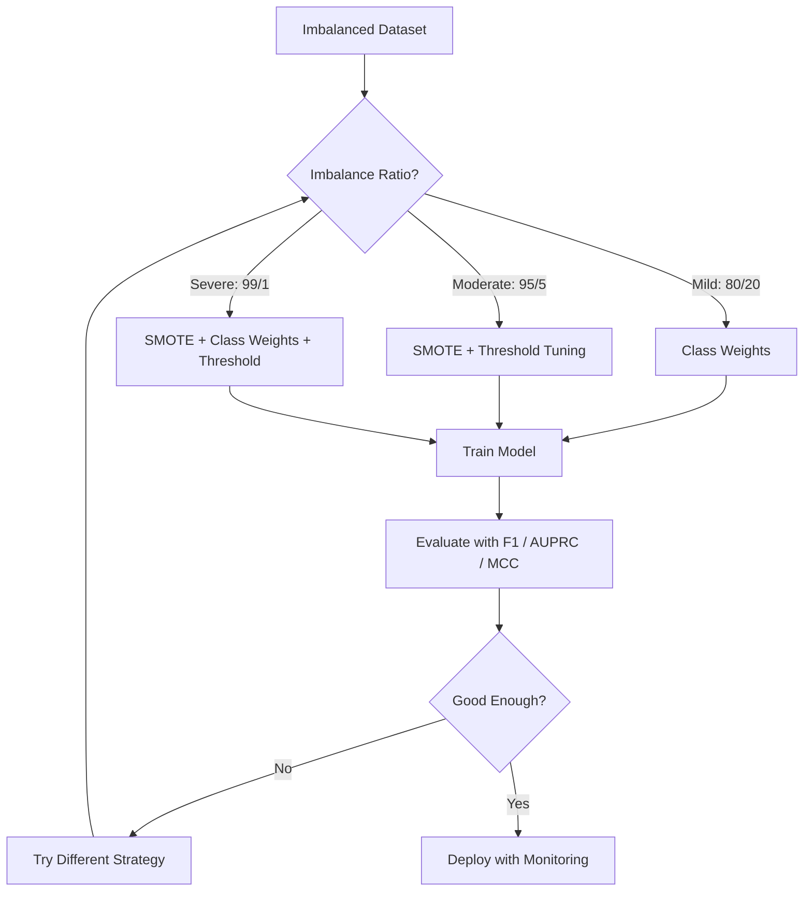
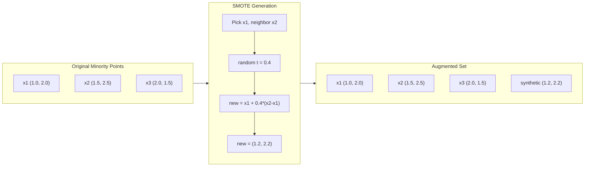

# Menangani Data yang Tidak Seimbang

> Jika 99% data kamu "normal", keakuratannya bohong.

**Type:** Build
**Language:** Python
**Prerequisites:** Fase 2, Lesson 01-09 (khususnya metrik evaluasi)
**Waktu:** ~90 menit

## Tujuan Pembelajaran

- Menerapkan SMOTE dari awal dan menjelaskan perbedaan pengambilan sample berlebih sintetik dengan duplikasi acak
- Evaluasi pengklasifikasi yang tidak seimbang menggunakan Koefisien Korelasi F1, AUPRC, dan Matthews alih-alih akurasi
- Bandingkan weighting kelas, penyetelan ambang batas, dan strategi pengambilan sample ulang, lalu pilih pendekatan yang tepat untuk rasio ketidakseimbangan tertentu
- Membangun pipeline data tidak seimbang lengkap yang menggabungkan SMOTE, weight kelas, dan optimization ambang batas

## Masalah

kamu membangun model deteksi penipuan. Akurasinya mencapai 99,9%. kamu merayakannya. Kemudian kamu menyadari bahwa ini memprediksi "bukan penipuan" untuk setiap transaksi.

Ini bukan bug. Ini adalah hal yang rasional untuk dilakukan ketika hanya 0,1% transaksi yang merupakan penipuan. Model tersebut belajar bahwa selalu menebak kelas mayoritas akan meminimalkan kesalahan keseluruhan. Secara teknis itu benar dan sama sekali tidak berguna.

Hal ini terjadi di mana pun klasifikasi nyata penting. Diagnosis penyakit: tingkat positif 1%. Intrusi jaringan: 0,01% serangan. Cacat produksi: cacat 0,5%. Pemfilteran spam: 20% spam. Prediksi churn: 5% churn. Semakin penting kelas minoritas, maka cenderung semakin langka.

Akurasi gagal karena memperlakukan semua prediksi yang benar secara setara. Memberi label yang benar pada transaksi yang sah dan menangkap penipuan dengan benar, keduanya dihitung sebagai satu titik akurasi. Namun menangkap penipuan adalah alasan utama keberadaan model ini. Kita memerlukan metrik, teknik, dan strategi training yang memaksa model untuk memperhatikan kelas yang jarang namun penting.

## Konsep

### Mengapa Akurasi Gagal

Misalkan dataset dengan 1000 sample: 990 negatif, 10 positif. Model yang selalu memprediksi negatif:

|  | Diprediksi Positif | Prediksi Negatif |
|--|---|---|
| Sebenarnya Positif | 0 (TP) | 10 (FN) |
| Sebenarnya Negatif | 0 (FP) | 990 (TN) |

Akurasi = (0 + 990) / 1000 = 99,0%

Model ini tidak menangkap adanya penipuan. Nol penyakit. Nol cacat. Tapi akurasinya mengatakan 99%. Inilah sebabnya mengapa akurasi berbahaya untuk masalah yang tidak seimbang.

### Metrik yang Lebih Baik

**Presisi** = TP / (TP + FP). Dari semua hal yang ditandai sebagai positif, berapa banyak yang sebenarnya? Presisi tinggi berarti sedikit alarm palsu.

**Ingat** = TP / (TP + FN). Dari semua hal yang benar-benar positif, berapa banyak yang berhasil kita tangkap? Ingatan yang tinggi berarti sedikit hal positif yang terlewatkan.

**Skor F1** = 2 * presisi * perolehan / (presisi + perolehan). Arti harmonik. Menghukum ketidakseimbangan ekstrim antara presisi dan perolehan lebih dari rata-rata aritmatika.

**Skor F-beta** = (1 + beta^2) * presisi * penarikan / (beta^2 * presisi + penarikan). Ketika beta > 1, perolehan kembali lebih penting. Ketika beta <1, presisi lebih penting. F2 umum digunakan dalam deteksi penipuan (penipuan yang hilang lebih buruk daripada alarm palsu).

**AUPRC** (Area di Bawah Kurva Perolehan Presisi). Seperti AUC-ROC tetapi lebih informatif untuk data yang tidak seimbang. Pengklasifikasi acak memiliki AUPRC yang sama dengan tingkat kelas positif (bukan 0,5 seperti ROC). Hal ini membuat perbaikan lebih mudah dilihat.

**Koefisien Korelasi Matthews** = (TP * TN - FP * FN) / sqrt((TP+FP)(TP+FN)(TN+FP)(TN+FN)). Berkisar dari -1 hingga +1. Hanya memberikan skor tinggi jika model bekerja dengan baik di kedua kelas. Seimbang bahkan ketika ukuran kelas sangat berbeda.Untuk model "selalu memprediksi negatif" di atas: presisi = 0/0 (tidak ditentukan, sering kali disetel ke 0), perolehan = 0/10 = 0, F1 = 0, MCC = 0. Metrik ini dengan tepat mengidentifikasi model sebagai tidak berharga.

### Pipeline Data yang Tidak Seimbang



### SMOTE: Teknik Pengambilan Sample Minoritas Sintetis

Pengambilan sample berlebihan secara acak menduplikasi sample minoritas yang ada. Ini berhasil tetapi berisiko mengalami overfitting karena model melihat titik yang sama berulang kali.

SMOTE menciptakan sample minoritas sintetik baru yang masuk akal tetapi tidak dapat ditiru. Algoritmanya:

1. Untuk setiap sample minoritas x, carilah k tetangga terdekatnya di antara sample minoritas lainnya
2. Pilih satu tetangga secara acak
3. Buat sample baru pada ruas garis antara x dan tetangganya

Rumusnya: `new_sample = x + random(0, 1) * (neighbor - x)`

Ini menginterpolasi antara titik minoritas nyata, membuat sample di wilayah ruang feature yang sama tanpa hanya menyalin data yang ada.



### Strategi Pengambilan Sample Dibandingkan

**Pengambilan Sample Secara Acak**: duplikat sample minoritas untuk mencocokkan jumlah mayoritas.
- Kelebihan: sederhana, tidak ada kehilangan informasi
- Kekurangan: duplikat yang tepat menyebabkan overfitting, menambah waktu training

**Pengambilan Sample Secara Acak**: menghapus sample mayoritas untuk mencocokkan jumlah minoritas.
- Kelebihan: training cepat, sederhana
- Kekurangan: membuang data mayoritas yang berpotensi berguna, variansnya lebih tinggi

**SMOTE**: membuat sample minoritas sintetis melalui interpolasi.
- Kelebihan: menghasilkan titik data baru, mengurangi overfitting dibandingkan dengan random oversampling
- Kekurangan: dapat membuat sample berisik di dekat batas keputusan, tidak memperhitungkan distribusi kelas mayoritas

| Strategi | Data Berubah | Resiko | Kapan Menggunakan |
|----------|-------------|------|-------------|
| Sample berlebihan | Minoritas diduplikasi | Keterlaluan | Dataset kecil, ketidakseimbangan sedang |
| Contoh di bawah | Mayoritas dihapus | Kehilangan informasi | Dataset besar, ingin training cepat |
| HAPUS | Minoritas sintetis ditambahkan | Kebisingan batas | Ketidakseimbangan sedang, sample minoritas cukup untuk k-NN |

### Weight Kelas

Daripada mengubah data, ubahlah cara model menangani kesalahan. Berikan weight yang lebih tinggi pada kesalahan klasifikasi kelas minoritas.

Untuk soal biner dengan 950 sample negatif dan 50 sample positif:
- Weight untuk kelas negatif = n_samples / (2*n_negatif) = 1000 / (2*950) = 0,526
- Weight kelas positif = n_samples / (2*n_positif) = 1000 / (2*50) = 10,0

Kelas positif mendapat weight 19x. Kesalahan mengklasifikasikan satu sample positif memerlukan biaya yang sama dengan kesalahan mengklasifikasikan 19 sample negatif. Model tersebut dipaksa untuk memperhatikan kelas minoritas.

Dalam regresi logistik, ini mengubah loss function:

```
weighted_loss = -sum(w_i * [y_i * log(p_i) + (1-y_i) * log(1-p_i)])
```

dimana w_i bergantung pada kelas sample i.

Weight kelas secara matematis setara dengan ekspektasi oversampling, tetapi tanpa membuat titik data baru. Hal ini membuatnya lebih cepat dan menghindari risiko duplikasi sample yang berlebihan.

### Penyetelan Ambang Batas

Kebanyakan pengklasifikasi menghasilkan probabilitas. Ambang batas defaultnya adalah 0,5: jika P(positif) >= 0,5, prediksi positif. Tapi 0,5 itu sewenang-wenang. Ketika kelas tidak seimbang, ambang batas optimal biasanya jauh lebih rendah.

Prosesnya:
1. Latih seorang model
2. Dapatkan prediksi probabilitas pada set validasi
3. Sapu ambang batas dari 0,0 hingga 1,0
4. Hitung F1 (atau metrik pilihan kamu) pada setiap ambang batas
5. Pilih ambang batas yang memaksimalkan metrik kamu

```mermaid
flowchart LR
    A[Model] --> B[Predict Probabilities]
    B --> C[Sweep Thresholds 0.0 to 1.0]
    C --> D[Compute F1 at Each]
    D --> E[Pick Best Threshold]
    E --> F[Use in Production]
```Sebuah model mungkin menghasilkan P(penipuan) = 0,15 untuk transaksi penipuan. Pada ambang batas 0,5, ini tergolong bukan penipuan. Pada ambang batas 0,10, ia ditangkap dengan benar. Kalibrasi probabilitas kurang penting dibandingkan peringkat -- selama penipuan memiliki probabilitas lebih tinggi dibandingkan non-penipuan, terdapat ambang batas yang memisahkan keduanya.

### Pembelajaran yang Sensitif terhadap Biaya

Generalisasi weight kelas. Alih-alih menetapkan biaya yang seragam, tetapkan biaya kesalahan klasifikasi yang spesifik:

| | Prediksi Positif | Prediksi Negatif |
|--|---|---|
| Sebenarnya Positif | 0 (benar) | C_FN = 100 |
| Sebenarnya Negatif | C_FP = 1 | 0 (benar) |

Hilangnya transaksi penipuan (FN) biayanya 100x lebih mahal daripada alarm palsu (FP). Model ini mengoptimalkan total biaya, bukan jumlah kesalahan total.

Ini adalah pendekatan paling berprinsip ketika kamu dapat memperkirakan biaya di dunia nyata. Diagnosis kanker yang terlewat memiliki dampak yang sangat berbeda dibandingkan alarm palsu yang memerlukan biopsi tambahan. Menjadikan biaya-biaya ini eksplisit akan memaksa adanya trade-off yang tepat.

### Bagan Alur Keputusan

```mermaid
flowchart TD
    A[Start: Imbalanced Dataset] --> B{How imbalanced?}
    B -->|"< 70/30"| C["Mild: try class weights first"]
    B -->|"70/30 to 95/5"| D["Moderate: SMOTE + class weights"]
    B -->|"> 95/5"| E["Severe: combine multiple strategies"]
    C --> F{Enough data?}
    D --> F
    E --> F
    F -->|"< 1000 samples"| G["Oversample or SMOTE, avoid undersampling"]
    F -->|"1000-10000"| H["SMOTE + threshold tuning"]
    F -->|"> 10000"| I["Undersampling OK, or class weights"]
    G --> J[Train + Evaluate with F1/AUPRC]
    H --> J
    I --> J
    J --> K{Recall high enough?}
    K -->|No| L[Lower threshold]
    K -->|Yes| M{Precision acceptable?}
    M -->|No| N[Raise threshold or add features]
    M -->|Yes| O[Ship it]
```

## Build

### Langkah 1: Hasilkan dataset yang tidak seimbang

```python
import numpy as np


def make_imbalanced_data(n_majority=950, n_minority=50, seed=42):
    rng = np.random.RandomState(seed)

    X_maj = rng.randn(n_majority, 2) * 1.0 + np.array([0.0, 0.0])
    X_min = rng.randn(n_minority, 2) * 0.8 + np.array([2.5, 2.5])

    X = np.vstack([X_maj, X_min])
    y = np.concatenate([np.zeros(n_majority), np.ones(n_minority)])

    shuffle_idx = rng.permutation(len(y))
    return X[shuffle_idx], y[shuffle_idx]
```

### Langkah 2: SMOTE dari awal

```python
def euclidean_distance(a, b):
    return np.sqrt(np.sum((a - b) ** 2))


def find_k_neighbors(X, idx, k):
    distances = []
    for i in range(len(X)):
        if i == idx:
            continue
        d = euclidean_distance(X[idx], X[i])
        distances.append((i, d))
    distances.sort(key=lambda x: x[1])
    return [d[0] for d in distances[:k]]


def smote(X_minority, k=5, n_synthetic=100, seed=42):
    rng = np.random.RandomState(seed)
    n_samples = len(X_minority)
    k = min(k, n_samples - 1)
    synthetic = []

    for _ in range(n_synthetic):
        idx = rng.randint(0, n_samples)
        neighbors = find_k_neighbors(X_minority, idx, k)
        neighbor_idx = neighbors[rng.randint(0, len(neighbors))]
        t = rng.random()
        new_point = X_minority[idx] + t * (X_minority[neighbor_idx] - X_minority[idx])
        synthetic.append(new_point)

    return np.array(synthetic)
```

### Langkah 3: Pengambilan sample berlebih dan pengambilan sample terlalu kecil secara acak

```python
def random_oversample(X, y, seed=42):
    rng = np.random.RandomState(seed)
    classes, counts = np.unique(y, return_counts=True)
    max_count = counts.max()

    X_resampled = list(X)
    y_resampled = list(y)

    for cls, count in zip(classes, counts):
        if count < max_count:
            cls_indices = np.where(y == cls)[0]
            n_needed = max_count - count
            chosen = rng.choice(cls_indices, size=n_needed, replace=True)
            X_resampled.extend(X[chosen])
            y_resampled.extend(y[chosen])

    X_out = np.array(X_resampled)
    y_out = np.array(y_resampled)
    shuffle = rng.permutation(len(y_out))
    return X_out[shuffle], y_out[shuffle]


def random_undersample(X, y, seed=42):
    rng = np.random.RandomState(seed)
    classes, counts = np.unique(y, return_counts=True)
    min_count = counts.min()

    X_resampled = []
    y_resampled = []

    for cls in classes:
        cls_indices = np.where(y == cls)[0]
        chosen = rng.choice(cls_indices, size=min_count, replace=False)
        X_resampled.extend(X[chosen])
        y_resampled.extend(y[chosen])

    X_out = np.array(X_resampled)
    y_out = np.array(y_resampled)
    shuffle = rng.permutation(len(y_out))
    return X_out[shuffle], y_out[shuffle]
```

### Langkah 4: Regresi logistik dengan weight kelas

```python
def sigmoid(z):
    return 1.0 / (1.0 + np.exp(-np.clip(z, -500, 500)))


def logistic_regression_weighted(X, y, weights, lr=0.01, epochs=200):
    n_samples, n_features = X.shape
    w = np.zeros(n_features)
    b = 0.0

    for _ in range(epochs):
        z = X @ w + b
        pred = sigmoid(z)
        error = pred - y
        weighted_error = error * weights

        gradient_w = (X.T @ weighted_error) / n_samples
        gradient_b = np.mean(weighted_error)

        w -= lr * gradient_w
        b -= lr * gradient_b

    return w, b


def compute_class_weights(y):
    classes, counts = np.unique(y, return_counts=True)
    n_samples = len(y)
    n_classes = len(classes)
    weight_map = {}
    for cls, count in zip(classes, counts):
        weight_map[cls] = n_samples / (n_classes * count)
    return np.array([weight_map[yi] for yi in y])
```

### Langkah 5: Penyetelan ambang batas

```python
def find_optimal_threshold(y_true, y_probs, metric="f1"):
    best_threshold = 0.5
    best_score = -1.0

    for threshold in np.arange(0.05, 0.96, 0.01):
        y_pred = (y_probs >= threshold).astype(int)
        tp = np.sum((y_pred == 1) & (y_true == 1))
        fp = np.sum((y_pred == 1) & (y_true == 0))
        fn = np.sum((y_pred == 0) & (y_true == 1))

        if metric == "f1":
            precision = tp / (tp + fp) if (tp + fp) > 0 else 0.0
            recall = tp / (tp + fn) if (tp + fn) > 0 else 0.0
            score = 2 * precision * recall / (precision + recall) if (precision + recall) > 0 else 0.0
        elif metric == "recall":
            score = tp / (tp + fn) if (tp + fn) > 0 else 0.0
        elif metric == "precision":
            score = tp / (tp + fp) if (tp + fp) > 0 else 0.0

        if score > best_score:
            best_score = score
            best_threshold = threshold

    return best_threshold, best_score
```

### Langkah 6: Fungsi evaluasi

```python
def confusion_matrix_values(y_true, y_pred):
    tp = np.sum((y_pred == 1) & (y_true == 1))
    tn = np.sum((y_pred == 0) & (y_true == 0))
    fp = np.sum((y_pred == 1) & (y_true == 0))
    fn = np.sum((y_pred == 0) & (y_true == 1))
    return tp, tn, fp, fn


def compute_metrics(y_true, y_pred):
    tp, tn, fp, fn = confusion_matrix_values(y_true, y_pred)
    accuracy = (tp + tn) / (tp + tn + fp + fn)
    precision = tp / (tp + fp) if (tp + fp) > 0 else 0.0
    recall = tp / (tp + fn) if (tp + fn) > 0 else 0.0
    f1 = 2 * precision * recall / (precision + recall) if (precision + recall) > 0 else 0.0

    denom = np.sqrt(float((tp + fp) * (tp + fn) * (tn + fp) * (tn + fn)))
    mcc = (tp * tn - fp * fn) / denom if denom > 0 else 0.0

    return {
        "accuracy": accuracy,
        "precision": precision,
        "recall": recall,
        "f1": f1,
        "mcc": mcc,
    }
```

### Langkah 7: Bandingkan semua pendekatan

```python
X, y = make_imbalanced_data(950, 50, seed=42)
split = int(0.8 * len(y))
X_train, X_test = X[:split], X[split:]
y_train, y_test = y[:split], y[split:]

# Baseline: no treatment
w_base, b_base = logistic_regression_weighted(
    X_train, y_train, np.ones(len(y_train)), lr=0.1, epochs=300
)
probs_base = sigmoid(X_test @ w_base + b_base)
preds_base = (probs_base >= 0.5).astype(int)

# Oversampled
X_over, y_over = random_oversample(X_train, y_train)
w_over, b_over = logistic_regression_weighted(
    X_over, y_over, np.ones(len(y_over)), lr=0.1, epochs=300
)
preds_over = (sigmoid(X_test @ w_over + b_over) >= 0.5).astype(int)

# SMOTE
minority_mask = y_train == 1
X_minority = X_train[minority_mask]
synthetic = smote(X_minority, k=5, n_synthetic=len(y_train) - 2 * int(minority_mask.sum()))
X_smote = np.vstack([X_train, synthetic])
y_smote = np.concatenate([y_train, np.ones(len(synthetic))])
w_sm, b_sm = logistic_regression_weighted(
    X_smote, y_smote, np.ones(len(y_smote)), lr=0.1, epochs=300
)
preds_smote = (sigmoid(X_test @ w_sm + b_sm) >= 0.5).astype(int)

# Class weights
sample_weights = compute_class_weights(y_train)
w_cw, b_cw = logistic_regression_weighted(
    X_train, y_train, sample_weights, lr=0.1, epochs=300
)
probs_cw = sigmoid(X_test @ w_cw + b_cw)
preds_cw = (probs_cw >= 0.5).astype(int)

# Threshold tuning (tune on held-out validation set, not test set)
probs_val = sigmoid(X_val @ w_cw + b_cw)
best_thresh, best_f1 = find_optimal_threshold(y_val, probs_val, metric="f1")
preds_thresh = (probs_cw >= best_thresh).astype(int)
```

File code menjalankan semua ini dalam satu skrip dan mencetak hasilnya.

## Pakai

Dengan pembelajaran scikit dan pembelajaran tidak seimbang, teknik-teknik ini bersifat satu kesatuan:

```python
from sklearn.linear_model import LogisticRegression
from sklearn.metrics import classification_report, f1_score
from sklearn.model_selection import train_test_split
from imblearn.over_sampling import SMOTE
from imblearn.under_sampling import RandomUnderSampler
from imblearn.pipeline import Pipeline

X_train, X_test, y_train, y_test = train_test_split(X, y, stratify=y)

model_weighted = LogisticRegression(class_weight="balanced")
model_weighted.fit(X_train, y_train)
print(classification_report(y_test, model_weighted.predict(X_test)))

smote = SMOTE(random_state=42)
X_resampled, y_resampled = smote.fit_resample(X_train, y_train)
model_smote = LogisticRegression()
model_smote.fit(X_resampled, y_resampled)
print(classification_report(y_test, model_smote.predict(X_test)))

pipeline = Pipeline([
    ("smote", SMOTE()),
    ("model", LogisticRegression(class_weight="balanced")),
])
pipeline.fit(X_train, y_train)
print(classification_report(y_test, pipeline.predict(X_test)))
```

Implementasi dari awal menunjukkan dengan tepat fungsi masing-masing teknik. SMOTE hanyalah interpolasi k-NN pada kelas minoritas. Weight kelas melipatgandakan kerugiannya. Penyetelan ambang batas adalah for-loop over cutoff. Tidak ada keajaiban.

## Kirim

Lesson ini menghasilkan:
- `outputs/skill-imbalanced-data.md` -- daftar keputusan untuk menangani masalah klasifikasi yang tidak seimbang

## Latihan

1. **Borderline-SMOTE**: memodifikasi implementasi SMOTE agar hanya menghasilkan sample sintetik untuk titik minoritas yang berada di dekat batas keputusan (yang k-tetangga terdekatnya mencakup sample kelas mayoritas). Bandingkan hasilnya dengan SMOTE standar pada dataset yang kelasnya tumpang tindih.

2. **Optimization matrix biaya**: menerapkan pembelajaran sensitif biaya dengan matrix biaya sebagai parameternya. Buat fungsi yang mengambil matrix biaya dan mengembalikan prediksi optimal yang meminimalkan biaya yang diharapkan. Uji dengan rasio biaya yang berbeda (1:10, 1:100, 1:1000) dan plot bagaimana perubahan trade-off presisi-recall.

3. **Kalibrasi ambang batas**: menerapkan penskalaan Platt (menyesuaikan regresi logistik pada output mentah model untuk menghasilkan probabilitas yang dikalibrasi). Bandingkan kurva perolehan presisi sebelum dan sesudah kalibrasi. Tunjukkan bahwa kalibrasi tidak mengubah peringkat (AUC tetap sama) namun membuat probabilitas lebih bermakna.

4. **Ansambel dengan pengantongan seimbang**: latih beberapa model, masing-masing pada sample bootstrap seimbang (semua minoritas + subset mayoritas acak). Rata-ratakan prediksi mereka. Bandingkan pendekatan ini dengan model tunggal dengan SMOTE. Ukur kinerja dan varians di seluruh proses.5. **Eksperimen rasio ketidakseimbangan**: ambil dataset yang seimbang dan tingkatkan rasio ketidakseimbangan secara bertahap (50/50, 70/30, 90/10, 95/5, 99/1). Untuk setiap rasio, latih dengan dan tanpa SMOTE. Plot F1 vs rasio ketidakseimbangan untuk kedua pendekatan. Pada rasio berapa SMOTE mulai membuat perbedaan yang berarti?

## Istilah Kunci

| Istilah | Apa kata orang | Apa sebenarnya arti |
|------|----------------|----------------------|
| Ketidakseimbangan kelas | "Satu kelas memiliki lebih banyak sample" | Distribusi kelas dalam dataset sangat miring, menyebabkan model lebih memilih kelas mayoritas |
| HAPUS | "Pengambilan sample berlebih sintetis" | Membuat sample minoritas baru dengan melakukan interpolasi antara sample minoritas yang ada dan k tetangga minoritas terdekat |
| Weight kelas | "Membuat kesalahan pada kelas langka menjadi lebih mahal" | Mengalikan loss function dengan weight khusus kelas sehingga model memberikan sanksi yang lebih berat terhadap kesalahan klasifikasi minoritas |
| Penyetelan ambang batas | "Memindahkan batas keputusan" | Mengubah batas probabilitas untuk klasifikasi dari default 0,5 ke nilai yang mengoptimalkan metrik yang diinginkan |
| Pengorbanan penarikan presisi | "kamu tidak dapat memiliki keduanya" | Menurunkan ambang batas akan menangkap lebih banyak hal positif (recall lebih tinggi) namun juga menandai lebih banyak positif palsu (presisi lebih rendah), dan sebaliknya |
| AUPRC | "Area di bawah kurva PR" | Meringkas kurva perolehan presisi menjadi satu angka; lebih informatif daripada AUC-ROC ketika kelas sangat tidak seimbang |
| Koefisien Korelasi Matthews | "Metrik yang seimbang" | Korelasi antara label prediksi dan label aktual yang menghasilkan skor tinggi hanya jika model berperforma baik di kedua kelas |
| Pembelajaran yang sensitif terhadap biaya | "Kesalahan yang berbeda membutuhkan biaya yang berbeda" | Memasukkan biaya kesalahan klasifikasi di dunia nyata ke dalam tujuan training sehingga model mengoptimalkan biaya total, bukan jumlah kesalahan |
| Pengambilan sample berlebihan secara acak | "Gandakan minoritas" | Mengulang sample kelas minoritas untuk menyeimbangkan jumlah kelas; sederhana namun berisiko overfitting pada titik duplikat |

## Bacaan Lanjutan

- [SMOTE: Synthetic Minority Over-sampling Technique (Chawla et al., 2002)](https://arxiv.org/abs/1106.1813) -- makalah SMOTE asli, masih merupakan karya yang paling banyak dikutip tentang pembelajaran yang tidak seimbang
- [Belajar dari Data yang Tidak Seimbang (He & Garcia, 2009)](https://ieeexplore.ieee.org/document/5128907) -- survei komprehensif yang mencakup pendekatan pengambilan sample, sensitif terhadap biaya, dan algoritmik
- [dokumentasi pembelajaran yang tidak seimbang](https://imbalanced-learn.org/stable/) -- Pustaka Python dengan varian SMOTE, strategi undersampling, dan integrasi pipeline
- [Plot Precision-Recall Lebih Informatif dibandingkan Plot ROC (Saito & Rehmsmeier, 2015)](https://journals.plos.org/plosone/article?id=10.1371/journal.pone.0118432) -- kapan dan mengapa memilih kurva PR dibandingkan kurva ROC untuk permasalahan yang tidak seimbang
