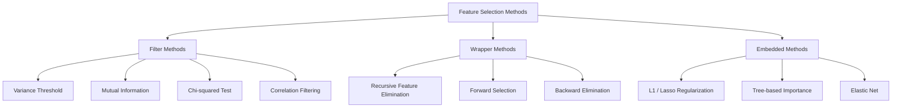
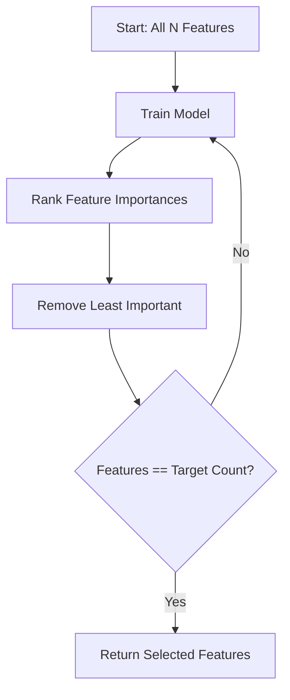
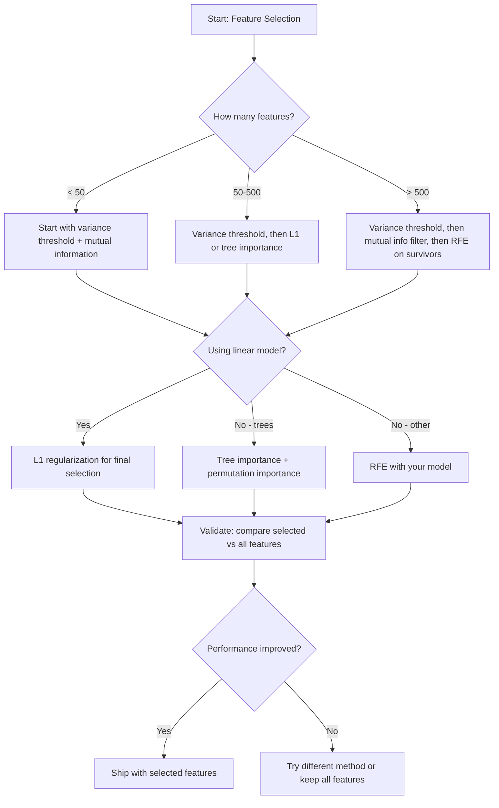

# Pemilihan Feature

> Lebih banyak feature tidak lebih baik. Feature yang tepat lebih baik.

**Type:** Build
**Language:** Python
**Prerequisites:** Fase 2, Lesson 01-09, 08 (rekayasa feature)
**Waktu:** ~75 menit

## Tujuan Pembelajaran

- Menerapkan metode filter (batas varians, informasi timbal balik, chi-kuadrat) dan metode pembungkus (RFE, pemilihan maju) dari awal
- Jelaskan mengapa informasi timbal balik menangkap hubungan feature-target nonlinier yang tidak terdapat dalam korelasi
- Bandingkan regularisasi L1 (pilihan tertanam) dengan RFE (pilihan pembungkus) dan evaluasi tradeoff komputasinya
- Membangun jalur pemilihan feature yang menggabungkan beberapa metode dan mendemonstrasikan peningkatan generalisasi pada data yang disimpan

## Masalah

kamu memiliki 500 feature. Model kamu berlatih dengan lambat, terus-menerus mengenakan pakaian luar, dan tidak ada yang bisa menjelaskan apa yang dipelajarinya. kamu menambahkan lebih banyak feature dengan harapan dapat meningkatkan kinerja. Ini menjadi lebih buruk.

Inilah curse of dimensionality dalam tindakan. Seiring bertambahnya jumlah feature, volume ruang feature pun meledak. Titik data menjadi jarang. Distance antar titik bertemu. Model ini memerlukan lebih banyak data secara eksponensial untuk menemukan pola nyata. Feature kebisingan meredam feature sinyal. Overfitting menjadi default.

Pemilihan feature adalah penawarnya. Singkirkan kebisingannya. Hapus redundansi. Jagalah feature-feature yang membawa informasi aktual tentang target. Hasilnya: training lebih cepat, generalisasi lebih baik, dan model yang benar-benar dapat kamu jelaskan.

Tujuannya bukan untuk menggunakan semua informasi yang tersedia. Itu adalah dengan menggunakan informasi yang benar.

## Konsep

### Tiga Kategori Pemilihan Feature

Setiap metode pemilihan feature terbagi dalam salah satu dari tiga kategori:



**Metode filter** memberi skor pada setiap feature secara independen menggunakan ukuran statistik. Mereka tidak menggunakan model. Cepat, tetapi mereka melewatkan interaksi feature.

**Metode wrapper** melatih model untuk mengevaluasi subset feature. Mereka menggunakan kinerja model sebagai skor. Hasil yang lebih baik, tetapi mahal karena mereka melatih ulang modelnya berkali-kali.

**Metode tersemat** memilih feature sebagai bagian dari training model. Regularisasi L1 mendorong weight ke nol. Pohon keputusan dibagi berdasarkan feature yang paling berguna. Seleksi terjadi pada saat pemasangan, bukan sebagai langkah terpisah.

### Ambang Batas Varians

Filter paling sederhana. Jika suatu feature hampir tidak bervariasi antar sample, maka hampir tidak ada informasi yang dibawanya.

Pertimbangkan feature 0,0 untuk 999 dari 1000 sample. Variansnya mendekati nol. Tidak ada model yang dapat menggunakannya untuk membedakan kelas. Hapus itu.

```
variance(x) = mean((x - mean(x))^2)
```

Tetapkan ambang batas (misalnya, 0,01). Hilangkan setiap feature dengan varians di bawahnya. Ini menghilangkan feature konstan atau hampir konstan tanpa melihat variabel target sama sekali.

Kapan menggunakannya: sebagai langkah pra-pemrosesan sebelum metode lainnya. Ini jelas menangkap feature-feature yang tidak berguna dengan biaya mendekati nol.

Batasan: suatu feature dapat memiliki varian tinggi dan tetap berupa noise murni. Ambang batas varians diperlukan tetapi tidak cukup.

### Saling Informasi

Informasi timbal balik mengukur seberapa besar mengetahui nilai feature X mengurangi ketidakpastian tentang target Y.

```
I(X; Y) = sum_x sum_y p(x, y) * log(p(x, y) / (p(x) * p(y)))
```

Jika X dan Y saling bebas, p(x, y) = p(x) * p(y), maka suku lognya adalah nol dan I(X; Y) = 0. Semakin banyak X memberitahukan kamu tentang Y, semakin tinggi informasi timbal baliknya.

Keuntungan utama dibandingkan korelasi: informasi timbal balik menangkap hubungan nonlinier. Suatu feature mungkin tidak memiliki korelasi dengan target tetapi informasi timbal baliknya tinggi karena hubungannya bersifat kuadrat atau periodik.Untuk feature berkelanjutan, diskritisasikan ke dalam bin terlebih dahulu (estimasi berbasis histogram). Jumlah wadah mempengaruhi perkiraan -- terlalu sedikit wadah akan kehilangan informasi, terlalu banyak wadah akan menambah kebisingan. Pilihan umum: sqrt(n) bins atau aturan Sturges (1 + log2(n)).


### Penghapusan Feature Rekursif (RFE)

RFE adalah metode pembungkus. Ia menggunakan feature penting model itu sendiri untuk memangkas secara berulang:

1. Latih model dengan semua fiturnya
2. Memberi peringkat feature berdasarkan kepentingannya (koefisien untuk model linier, pengurangan pengotor untuk pohon)
3. Hapus feature yang paling tidak penting
4. Ulangi hingga jumlah feature yang diinginkan tersisa



RFE mempertimbangkan interaksi feature karena model melihat semua feature yang tersisa secara bersamaan. Menghapus satu feature akan mengubah pentingnya feature lainnya. Hal ini membuatnya lebih teliti dibandingkan metode filter.

Biaya: kamu melatih model N - waktu target. Dengan 500 feature dan target 10, berarti 490 training berjalan. Untuk model mahal, ini lambat. kamu dapat mempercepatnya dengan menghapus beberapa feature per langkah (misalnya, menghapus 10% terbawah setiap putaran).

### Regularisasi L1 (Laso).

Regularisasi L1 menambahkan nilai absolut weight ke loss function:

```
loss = prediction_error + alpha * sum(|w_i|)
```

Parameter alpha mengontrol seberapa agresif feature dipangkas. Alpha yang lebih tinggi berarti semakin banyak weight yang tepat nol.

Kenapa tepatnya nol? Penalti L1 menciptakan wilayah kendala berbentuk berlian di ruang weight. Solusi optimal cenderung mendarat di sudut berlian ini, dimana satu atau lebih bobotnya nol. Regularisasi L2 (punggung bukit) menciptakan batasan melingkar di mana weight menyusut tetapi jarang mencapai nol.

Ini adalah pemilihan feature yang tertanam: model mempelajari selama training feature mana yang harus diabaikan. Feature dengan weight nol dihilangkan secara efektif.

Keuntungan: training tunggal yang dijalankan, menangani feature-feature yang berkorelasi (memilih satu dan menghilangkan yang lain), dibangun di sebagian besar implementasi model linier.

Batasan: hanya berfungsi untuk model linier. Tidak dapat menangkap pentingnya feature nonlinier.

### Pentingnya Feature Berbasis Pohon

Pohon keputusan dan ansambelnya (hutan acak, peningkatan gradient) secara alami memberi peringkat pada feature. Setiap pemisahan mengurangi pengotor (Gini atau entropi untuk klasifikasi, varians untuk regresi). Feature yang menghasilkan pengurangan pengotor lebih besar adalah lebih penting.

Untuk hutan acak dengan pohon T:

```
importance(feature_j) = (1/T) * sum over all trees of
    sum over all nodes splitting on feature_j of
        (n_samples * impurity_decrease)
```

Ini memberikan skor kepentingan yang dinormalisasi untuk setiap feature. Ini menangani hubungan nonlinier dan interaksi feature secara otomatis.

Attention: kepentingan berdasarkan pohon bias terhadap feature dengan banyak nilai unik (kardinalitas tinggi). Kolom ID acak akan tampak penting karena membagi setiap sample dengan sempurna. Gunakan pentingnya permutasi sebagai pemeriksaan kewarasan.

### Pentingnya Permutasi

Metode model-agnostik:

1. Latih model dan catat performa dasar pada data validasi
2. Untuk setiap feature: acak nilainya secara acak, ukur penurunan kinerjanya
3. Semakin besar penurunannya, semakin penting feature tersebut

Jika mengacak feature tidak mengganggu performa, model tidak akan bergantung padanya. Jika performa menurun, feature tersebut sangat penting.

Kepentingan permutasi menghindari bias kardinalitas kepentingan berbasis pohon. Namun ini lambat: satu evaluasi penuh per feature, diulang beberapa kali untuk stabilitas.

### Tabel Perbandingan| Metode | Ketik | Kecepatan | Nonlinier | Interaksi Feature |
|--------|------|-------|-----------|---------------------|
| Ambang batas varians | menyaring | Sangat cepat | Tidak | Tidak |
| Saling informasi | menyaring | Cepat | Ya | Tidak |
| Filter korelasi | menyaring | Cepat | Tidak | Tidak |
| RFE | Pembungkus | Lambat | Tergantung modelnya | Ya |
| L1 / Laso | Tertanam | Cepat | Tidak (linier) | Tidak |
| Pentingnya pohon | Tertanam | Sedang | Ya | Ya |
| Pentingnya permutasi | Model-agnostik | Lambat | Ya | Ya |

### Bagan Alur Keputusan



## Build

### Langkah 1: Hasilkan data sintetis dengan struktur feature yang diketahui

```python
import numpy as np


def make_feature_selection_data(n_samples=500, seed=42):
    rng = np.random.RandomState(seed)

    x1 = rng.randn(n_samples)
    x2 = rng.randn(n_samples)
    x3 = rng.randn(n_samples)
    x4 = x1 + 0.1 * rng.randn(n_samples)
    x5 = x2 + 0.1 * rng.randn(n_samples)

    informative = np.column_stack([x1, x2, x3, x4, x5])

    correlated = np.column_stack([
        x1 * 0.9 + 0.1 * rng.randn(n_samples),
        x2 * 0.8 + 0.2 * rng.randn(n_samples),
        x3 * 0.7 + 0.3 * rng.randn(n_samples),
        x1 * 0.5 + x2 * 0.5 + 0.1 * rng.randn(n_samples),
        x2 * 0.6 + x3 * 0.4 + 0.1 * rng.randn(n_samples),
    ])

    noise = rng.randn(n_samples, 10) * 0.5

    X = np.hstack([informative, correlated, noise])
    y = (2 * x1 - 1.5 * x2 + x3 + 0.5 * rng.randn(n_samples) > 0).astype(int)

    feature_names = (
        [f"info_{i}" for i in range(5)]
        + [f"corr_{i}" for i in range(5)]
        + [f"noise_{i}" for i in range(10)]
    )

    return X, y, feature_names
```

Kita mengetahui kebenaran dasarnya: feature 0-4 bersifat informatif (ditambah 3 dan 4 merupakan salinan berkorelasi dari 0 dan 1), feature 5-9 berkorelasi dengan feature informatif, feature 10-19 adalah gangguan murni. Metode seleksi yang baik harus memberi peringkat 0-4 tertinggi dan 10-19 terendah.

### Langkah 2: Ambang batas varians

```python
def variance_threshold(X, threshold=0.01):
    variances = np.var(X, axis=0)
    mask = variances > threshold
    return mask, variances
```

### Langkah 3: Saling informasi (diskrit)

```python
def discretize(x, n_bins=10):
    min_val, max_val = x.min(), x.max()
    if max_val == min_val:
        return np.zeros_like(x, dtype=int)
    bin_edges = np.linspace(min_val, max_val, n_bins + 1)
    binned = np.digitize(x, bin_edges[1:-1])
    return binned


def mutual_information(X, y, n_bins=10):
    n_samples, n_features = X.shape
    mi_scores = np.zeros(n_features)

    y_vals, y_counts = np.unique(y, return_counts=True)
    p_y = y_counts / n_samples

    for f in range(n_features):
        x_binned = discretize(X[:, f], n_bins)
        x_vals, x_counts = np.unique(x_binned, return_counts=True)
        p_x = dict(zip(x_vals, x_counts / n_samples))

        mi = 0.0
        for xv in x_vals:
            for yi, yv in enumerate(y_vals):
                joint_mask = (x_binned == xv) & (y == yv)
                p_xy = np.sum(joint_mask) / n_samples
                if p_xy > 0:
                    mi += p_xy * np.log(p_xy / (p_x[xv] * p_y[yi]))
        mi_scores[f] = mi

    return mi_scores
```

### Langkah 4: Penghapusan Feature Rekursif

```python
def simple_logistic_importance(X, y, lr=0.1, epochs=100):
    n_samples, n_features = X.shape
    w = np.zeros(n_features)
    b = 0.0

    for _ in range(epochs):
        z = X @ w + b
        pred = 1.0 / (1.0 + np.exp(-np.clip(z, -500, 500)))
        error = pred - y
        w -= lr * (X.T @ error) / n_samples
        b -= lr * np.mean(error)

    return w, b


def rfe(X, y, n_features_to_select=5, lr=0.1, epochs=100):
    n_total = X.shape[1]
    remaining = list(range(n_total))
    rankings = np.ones(n_total, dtype=int)
    rank = n_total

    while len(remaining) > n_features_to_select:
        X_subset = X[:, remaining]
        w, _ = simple_logistic_importance(X_subset, y, lr, epochs)
        importances = np.abs(w)

        least_idx = np.argmin(importances)
        original_idx = remaining[least_idx]
        rankings[original_idx] = rank
        rank -= 1
        remaining.pop(least_idx)

    for idx in remaining:
        rankings[idx] = 1

    selected_mask = rankings == 1
    return selected_mask, rankings
```

### Langkah 5: Pemilihan feature L1

```python
def soft_threshold(w, alpha):
    return np.sign(w) * np.maximum(np.abs(w) - alpha, 0)


def l1_feature_selection(X, y, alpha=0.1, lr=0.01, epochs=500):
    n_samples, n_features = X.shape
    w = np.zeros(n_features)
    b = 0.0

    for _ in range(epochs):
        z = X @ w + b
        pred = 1.0 / (1.0 + np.exp(-np.clip(z, -500, 500)))
        error = pred - y

        gradient_w = (X.T @ error) / n_samples
        gradient_b = np.mean(error)

        w -= lr * gradient_w
        w = soft_threshold(w, lr * alpha)
        b -= lr * gradient_b

    selected_mask = np.abs(w) > 1e-6
    return selected_mask, w
```

### Langkah 6: Kepentingan berbasis pohon (pohon keputusan sederhana)

```python
def gini_impurity(y):
    if len(y) == 0:
        return 0.0
    classes, counts = np.unique(y, return_counts=True)
    probs = counts / len(y)
    return 1.0 - np.sum(probs ** 2)


def best_split(X, y, feature_idx):
    values = np.unique(X[:, feature_idx])
    if len(values) <= 1:
        return None, -1.0

    best_threshold = None
    best_gain = -1.0
    parent_gini = gini_impurity(y)
    n = len(y)

    for i in range(len(values) - 1):
        threshold = (values[i] + values[i + 1]) / 2.0
        left_mask = X[:, feature_idx] <= threshold
        right_mask = ~left_mask

        n_left = np.sum(left_mask)
        n_right = np.sum(right_mask)

        if n_left == 0 or n_right == 0:
            continue

        gain = parent_gini - (n_left / n) * gini_impurity(y[left_mask]) - (n_right / n) * gini_impurity(y[right_mask])

        if gain > best_gain:
            best_gain = gain
            best_threshold = threshold

    return best_threshold, best_gain


def tree_importance(X, y, n_trees=50, max_depth=5, seed=42):
    rng = np.random.RandomState(seed)
    n_samples, n_features = X.shape
    importances = np.zeros(n_features)

    for _ in range(n_trees):
        sample_idx = rng.choice(n_samples, size=n_samples, replace=True)
        feature_subset = rng.choice(n_features, size=max(1, int(np.sqrt(n_features))), replace=False)

        X_boot = X[sample_idx]
        y_boot = y[sample_idx]

        tree_imp = _build_tree_importance(X_boot, y_boot, feature_subset, max_depth)
        importances += tree_imp

    total = importances.sum()
    if total > 0:
        importances /= total

    return importances


def _build_tree_importance(X, y, feature_subset, max_depth, depth=0):
    n_features = X.shape[1]
    importances = np.zeros(n_features)

    if depth >= max_depth or len(np.unique(y)) <= 1 or len(y) < 4:
        return importances

    best_feature = None
    best_threshold = None
    best_gain = -1.0

    for f in feature_subset:
        threshold, gain = best_split(X, y, f)
        if gain > best_gain:
            best_gain = gain
            best_feature = f
            best_threshold = threshold

    if best_feature is None or best_gain <= 0:
        return importances

    importances[best_feature] += best_gain * len(y)

    left_mask = X[:, best_feature] <= best_threshold
    right_mask = ~left_mask

    importances += _build_tree_importance(X[left_mask], y[left_mask], feature_subset, max_depth, depth + 1)
    importances += _build_tree_importance(X[right_mask], y[right_mask], feature_subset, max_depth, depth + 1)

    return importances
```

### Langkah 7: Jalankan semua metode dan bandingkan

File code menjalankan kelima metode pada dataset sintetis yang sama dan mencetak tabel perbandingan yang menunjukkan feature mana yang dipilih setiap metode.

## Pakai

Dengan scikit-learn, pemilihan feature dimasukkan ke dalam pipeline:

```python
from sklearn.feature_selection import (
    VarianceThreshold,
    mutual_info_classif,
    RFE,
    SelectFromModel,
)
from sklearn.linear_model import Lasso, LogisticRegression
from sklearn.ensemble import RandomForestClassifier

vt = VarianceThreshold(threshold=0.01)
X_filtered = vt.fit_transform(X)

mi_scores = mutual_info_classif(X, y)
top_k = np.argsort(mi_scores)[-10:]

rfe_selector = RFE(LogisticRegression(), n_features_to_select=10)
rfe_selector.fit(X, y)
X_rfe = rfe_selector.transform(X)

lasso_selector = SelectFromModel(Lasso(alpha=0.01))
lasso_selector.fit(X, y)
X_lasso = lasso_selector.transform(X)

rf = RandomForestClassifier(n_estimators=100)
rf.fit(X, y)
importances = rf.feature_importances_
```

Implementasi dari awal menunjukkan dengan tepat apa yang terjadi di dalam setiap metode. Ambang batas varians hanyalah menghitung `var(X, axis=0)` dan menerapkan masker. Saling informasi menghitung frekuensi gabungan dan marginal dalam tabel kontingensi. RFE adalah loop yang melatih, memberi peringkat, dan memangkas. L1 adalah gradient descent dengan langkah ambang lunak. Kepentingan pohon mengakumulasi pengurangan pengotor di seluruh bagian. Tidak ada keajaiban -- hanya statistik dan loop.

Versi sklearn menambahkan ketahanan (misalnya mutual_info_classif menggunakan estimasi kepadatan k-NN alih-alih binning), kecepatan (implementasi C), dan integrasi pipeline.

## Kirim

Lesson ini menghasilkan:
- `outputs/skill-feature-selector.md` -- pohon keputusan referensi cepat untuk memilih metode pemilihan feature yang tepat

## Latihan

1. **Pilihan maju**: menerapkan kebalikan dari RFE. Mulailah dengan nol feature. Di setiap langkah, tambahkan feature yang paling meningkatkan performa model. Hentikan ketika menambahkan feature tidak lagi membantu. Bandingkan feature yang dipilih dengan hasil RFE. Mana yang lebih cepat? Mana yang memberikan hasil lebih baik?

2. **Pemilihan stabilitas**: menjalankan pemilihan feature L1 sebanyak 50 kali, setiap kali pada 80% subsampel data secara acak, dengan nilai alpha yang sedikit berbeda. Hitung seberapa sering setiap feature dipilih. Feature yang dipilih pada > 80% proses adalah "stabil". Bandingkan feature stabil dengan pemilihan L1 sekali jalan. Mana yang lebih bisa diandalkan?

3. **Deteksi multikolinearitas**: menghitung matrix korelasi untuk semua feature. Menerapkan fungsi yang, dengan ambang korelasi (misalnya 0,9), menghapus satu feature dari setiap pasangan yang berkorelasi tinggi (menjaga pasangan yang memiliki informasi timbal balik lebih tinggi dengan target). Uji dataset sintetis dan verifikasi bahwa dataset tersebut menghilangkan feature-feature berkorelasi yang berlebihan.4. **Pipa pemilihan feature**: ambang batas varians rantai, filter informasi timbal balik, dan RFE ke dalam satu pipa. Pertama-tama hapus feature varian yang mendekati nol, lalu pertahankan 50% teratas berdasarkan informasi bersama, lalu jalankan RFE pada yang selamat. Bandingkan pipeline ini dengan menjalankan RFE saja di semua feature. Apakah jalur pipanya lebih cepat? Apakah ini sama akuratnya?

5. **Pentingnya permutasi dari awal**: menerapkan kepentingan permutasi. Untuk setiap feature, kocok nilainya 10 kali, ukur rata-rata penurunan skor F1. Bandingkan peringkat tersebut dengan tingkat kepentingan berdasarkan pohon. Temukan kasus-kasus di mana mereka tidak setuju dan jelaskan alasannya (petunjuk: feature-feature yang berkorelasi).

## Istilah Kunci

| Istilah | Apa kata orang | Apa sebenarnya arti |
|------|----------------|----------------------|
| Metode penyaring | "Skor feature secara mandiri" | Pendekatan pemilihan feature yang memberi peringkat feature menggunakan ukuran statistik tanpa melatih model, mengevaluasi setiap feature secara terpisah |
| Metode pembungkus | "Gunakan model untuk memilih feature" | Pendekatan pemilihan feature yang mengevaluasi subset feature dengan melatih model dan menggunakan performanya sebagai kriteria pemilihan |
| Metode tertanam | "Model memilih feature selama training" | Pemilihan feature yang terjadi sebagai bagian dari penyesuaian model, seperti regularisasi L1 yang mendorong weight ke nol |
| Saling informasi | "Berapa banyak variabel yang memberitahu kamu tentang variabel lain" | Ukuran pengurangan ketidakpastian tentang Y berdasarkan pengetahuan tentang X, yang menangkap ketergantungan linier dan nonlinier |
| Penghapusan Feature Rekursif | "Latih, pangkat, pangkas, ulangi" | Metode wrapper berulang yang melatih model, menghapus feature yang paling tidak penting, dan mengulanginya hingga jumlah target tercapai |
| Regularisasi L1 / Lasso | "Penalti yang mematikan feature" | Menambahkan jumlah nilai weight absolut ke loss function, yang mendorong weight feature yang tidak penting menjadi nol |
| Ambang batas varians | "Hapus feature konstan" | Menghapus feature yang variansinya di seluruh sample berada di bawah ambang batas yang ditentukan, menyaring feature yang tidak membawa informasi |
| Pentingnya feature | "Feature mana yang paling penting" | Skor yang menunjukkan seberapa besar kontribusi setiap feature terhadap prediksi model, dihitung dari perolehan terpisah (pohon) atau besaran koefisien (linier) |
| Pentingnya permutasi | "Acak dan ukur kerusakannya" | Mengevaluasi pentingnya feature dengan mengacak nilai setiap feature secara acak dan mengukur penurunan performa model |
| Kutukan Dimensionalitas | "Terlalu banyak feature, data tidak cukup" | Fenomena penambahan feature meningkatkan volume ruang feature secara eksponensial, membuat data menjadi jarang dan distance menjadi tidak berarti |

## Bacaan Lanjutan- [Pengantar Pemilihan Variabel dan Feature (Guyon & Elisseeff, 2003)](https://jmlr.org/papers/v3/guyon03a.html) -- survei dasar tentang metode pemilihan feature, masih banyak dijadikan referensi
- [Panduan Pemilihan Feature scikit-learn](https://scikit-learn.org/stable/modules/feature_selection.html) -- referensi praktis untuk filter, wrapper, dan metode tersemat dengan contoh code
- [Stability Selection (Meinshausen & Buhlmann, 2010)](https://arxiv.org/abs/0809.2932) -- menggabungkan subsampling dengan pemilihan feature untuk hasil yang kuat dan dapat direproduksi
- [Waspadalah terhadap Default Random Random Forest Importances (Strobl et al., 2007)](https://bmcbioinformatics.biomedcentral.com/articles/10.1186/1471-2105-8-25) -- menunjukkan bias kardinalitas dalam kepentingan berbasis pohon dan mengusulkan kepentingan bersyarat sebagai alternatif
