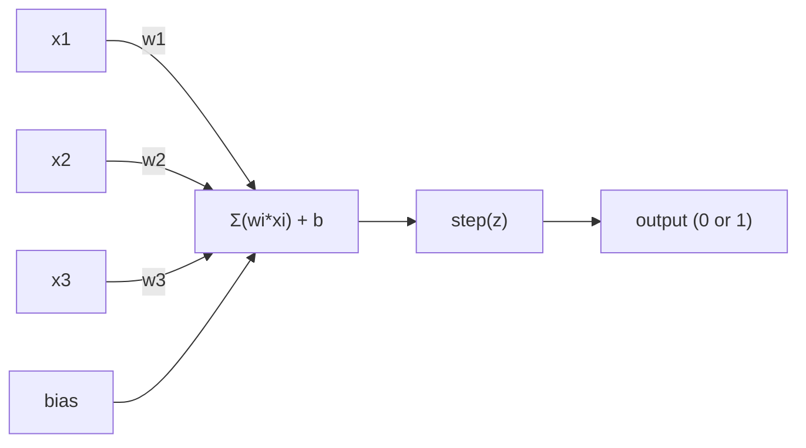
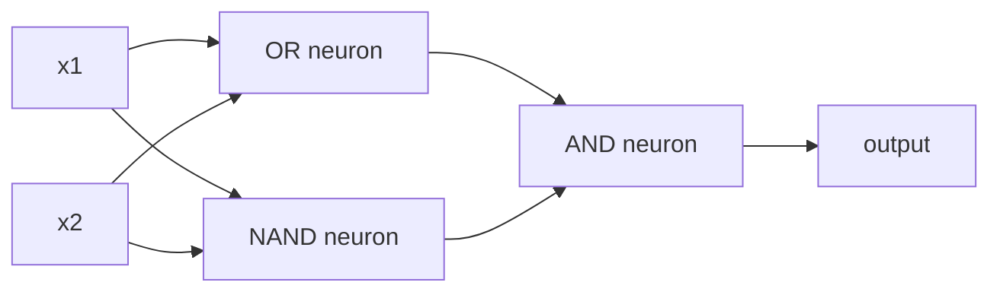

#Perceptron

> Perceptron adalah atom neural network. Pisahkan dan kamu akan menemukan weight, bias, dan keputusan.

**Type:** Build
**Language:** Python
**Prerequisites:** Fase 1 (Intuisi Linear Algebra)
**Waktu:** ~60 menit

## Tujuan Pembelajaran

- Menerapkan perceptron dari awal dengan Python, termasuk aturan pembaruan weight dan fungsi activation langkah
- Jelaskan mengapa satu perceptron hanya dapat menyelesaikan masalah yang dapat dipisahkan secara linier dan mendemonstrasikan kasus kegagalan XOR
- Build perceptron multi-layer dengan menyusun gerbang OR, NAND, dan AND untuk menyelesaikan XOR
- Latih jaringan dua lapis dengan activation sigmoid dan backpropagation untuk mempelajari XOR secara otomatis

## Masalah

kamu tahu vector dan perkalian titik. kamu tahu bahwa matrix mengubah input menjadi output. Namun bagaimana mesin *mempelajari* transformasi mana yang akan digunakan?

Perceptron menjawab ini. Ini adalah mesin pembelajaran yang paling sederhana: ambil beberapa input, kalikan dengan weight, tambahkan bias, dan buat keputusan biner. Kemudian sesuaikan. Itu saja. Setiap neural network yang pernah dibangun adalah layer-layer dari ide ini yang ditumpuk menjadi satu.

Memahami perceptron berarti memahami apa sebenarnya arti "belajar" dalam code: menyesuaikan angka hingga hasilnya sesuai dengan kenyataan.

## Konsep

### Satu Neuron, Satu Keputusan

Sebuah perceptron mengambil n input, mengalikannya dengan weight, menjumlahkannya, menambahkan bias, dan meneruskan hasilnya melalui fungsi activation.



Fungsi langkahnya brutal: jika jumlah tertimbang ditambah bias >= 0, keluarannya 1. Jika tidak, keluarannya 0.

```
step(z) = 1  if z >= 0
           0  if z < 0
```

Ini adalah pengklasifikasi linier. Weight dan bias menentukan garis (atau bidang hiper dalam dimension yang lebih tinggi) yang membagi ruang input menjadi dua wilayah.

### Batasan Keputusan

Untuk dua input, perceptron menarik garis melalui ruang 2D:

```
  x2
  ┤
  │  Class 1        /
  │    (0)          /
  │                /
  │               / w1·x1 + w2·x2 + b = 0
  │              /
  │             /     Class 2
  │            /        (1)
  ┼───────────/──────────── x1
```

Segala sesuatu di satu sisi garis menghasilkan 0. Segala sesuatu di sisi lain menghasilkan 1. Training menggerakkan garis ini hingga memisahkan kelas dengan benar.

### Aturan Pembelajaran

Aturan pembelajaran perceptron sederhana:

```
For each training example (x, y_true):
    y_pred = predict(x)
    error = y_true - y_pred

    For each weight:
        w_i = w_i + learning_rate * error * x_i
    bias = bias + learning_rate * error
```

Jika prediksinya benar, error = 0, tidak ada perubahan. Jika prediksinya 0 tetapi seharusnya 1, bobotnya bertambah. Jika prediksinya 1 tetapi seharusnya 0, bobotnya berkurang. Learning rate mengontrol seberapa besar setiap penyesuaian.

### Masalah XOR

Di sinilah rusaknya. Perhatikan gerbang logika berikut:

```
AND gate:           OR gate:            XOR gate:
x1  x2  out         x1  x2  out         x1  x2  out
0   0   0           0   0   0           0   0   0
0   1   0           0   1   1           0   1   1
1   0   0           1   0   1           1   0   1
1   1   1           1   1   1           1   1   0
```

AND dan OR dapat dipisahkan secara linier: kamu dapat menggambar satu garis untuk memisahkan angka 0 dan angka 1. XOR tidak. Tidak ada satu baris pun yang dapat memisahkan [0,1] dan [1,0] dari [0,0] dan [1,1].

```
AND (separable):        XOR (not separable):

  x2                      x2
  1 ┤  0     1            1 ┤  1     0
    │     /                 │
  0 ┤  0 / 0              0 ┤  0     1
    ┼──/──────── x1         ┼──────────── x1
       line works!          no single line works!
```

Ini adalah batasan mendasar. Sebuah perceptron hanya dapat menyelesaikan permasalahan yang dapat dipisahkan secara linear. Minsky dan Papert membuktikan hal ini pada tahun 1969 dan hal ini hampir mematikan penelitian neural network selama satu dekade.

Cara mengatasinya: susun perceptron menjadi beberapa layer. Perceptron multi-layer dapat menyelesaikan XOR dengan menggabungkan dua keputusan linier menjadi keputusan nonlinier.

## Build

### Langkah 1: Kelas Perceptron

```python
class Perceptron:
    def __init__(self, n_inputs, learning_rate=0.1):
        self.weights = [0.0] * n_inputs
        self.bias = 0.0
        self.lr = learning_rate

    def predict(self, inputs):
        total = sum(w * x for w, x in zip(self.weights, inputs))
        total += self.bias
        return 1 if total >= 0 else 0

    def train(self, training_data, epochs=100):
        for epoch in range(epochs):
            errors = 0
            for inputs, target in training_data:
                prediction = self.predict(inputs)
                error = target - prediction
                if error != 0:
                    errors += 1
                    for i in range(len(self.weights)):
                        self.weights[i] += self.lr * error * inputs[i]
                    self.bias += self.lr * error
            if errors == 0:
                print(f"Converged at epoch {epoch + 1}")
                return
        print(f"Did not converge after {epochs} epochs")
```

### Langkah 2: Melatih gerbang logika

```python
and_data = [
    ([0, 0], 0),
    ([0, 1], 0),
    ([1, 0], 0),
    ([1, 1], 1),
]

or_data = [
    ([0, 0], 0),
    ([0, 1], 1),
    ([1, 0], 1),
    ([1, 1], 1),
]

not_data = [
    ([0], 1),
    ([1], 0),
]

print("=== AND Gate ===")
p_and = Perceptron(2)
p_and.train(and_data)
for inputs, _ in and_data:
    print(f"  {inputs} -> {p_and.predict(inputs)}")

print("\n=== OR Gate ===")
p_or = Perceptron(2)
p_or.train(or_data)
for inputs, _ in or_data:
    print(f"  {inputs} -> {p_or.predict(inputs)}")

print("\n=== NOT Gate ===")
p_not = Perceptron(1)
p_not.train(not_data)
for inputs, _ in not_data:
    print(f"  {inputs} -> {p_not.predict(inputs)}")
```

### Langkah 3: Perhatikan XOR gagal

```python
xor_data = [
    ([0, 0], 0),
    ([0, 1], 1),
    ([1, 0], 1),
    ([1, 1], 0),
]

print("\n=== XOR Gate (single perceptron) ===")
p_xor = Perceptron(2)
p_xor.train(xor_data, epochs=1000)
for inputs, expected in xor_data:
    result = p_xor.predict(inputs)
    status = "OK" if result == expected else "WRONG"
    print(f"  {inputs} -> {result} (expected {expected}) {status}")
```

Itu tidak akan pernah menyatu. Ini adalah bukti kuat bahwa satu perceptron tidak dapat mempelajari XOR.

### Langkah 4: Selesaikan XOR dengan dua layer

Caranya: XOR = (x1 OR x2) DAN BUKAN (x1 DAN x2). Gabungkan tiga perceptron:



```python
def xor_network(x1, x2):
    or_neuron = Perceptron(2)
    or_neuron.weights = [1.0, 1.0]
    or_neuron.bias = -0.5

    nand_neuron = Perceptron(2)
    nand_neuron.weights = [-1.0, -1.0]
    nand_neuron.bias = 1.5

    and_neuron = Perceptron(2)
    and_neuron.weights = [1.0, 1.0]
    and_neuron.bias = -1.5

    hidden1 = or_neuron.predict([x1, x2])
    hidden2 = nand_neuron.predict([x1, x2])
    output = and_neuron.predict([hidden1, hidden2])
    return output


print("\n=== XOR Gate (multi-layer network) ===")
for inputs, expected in xor_data:
    result = xor_network(inputs[0], inputs[1])
    print(f"  {inputs} -> {result} (expected {expected})")
```

Keempat kasus tersebut benar. Menumpuk perceptron ke dalam layer menciptakan batasan keputusan yang tidak dapat dihasilkan oleh satu perceptron pun.### Langkah 5: Latih Jaringan Dua Layer

Langkah 4 sambungkan weight dengan tangan. Itu berfungsi untuk XOR, tetapi tidak untuk masalah nyata di mana kamu tidak mengetahui weight yang tepat sebelumnya. Cara mengatasinya: ganti fungsi step dengan sigmoid dan pelajari bobotnya secara otomatis melalui backpropagation.

```python
class TwoLayerNetwork:
    def __init__(self, learning_rate=0.5):
        import random
        random.seed(0)
        self.w_hidden = [[random.uniform(-1, 1), random.uniform(-1, 1)] for _ in range(2)]
        self.b_hidden = [random.uniform(-1, 1), random.uniform(-1, 1)]
        self.w_output = [random.uniform(-1, 1), random.uniform(-1, 1)]
        self.b_output = random.uniform(-1, 1)
        self.lr = learning_rate

    def sigmoid(self, x):
        import math
        x = max(-500, min(500, x))
        return 1.0 / (1.0 + math.exp(-x))

    def forward(self, inputs):
        self.inputs = inputs
        self.hidden_outputs = []
        for i in range(2):
            z = sum(w * x for w, x in zip(self.w_hidden[i], inputs)) + self.b_hidden[i]
            self.hidden_outputs.append(self.sigmoid(z))
        z_out = sum(w * h for w, h in zip(self.w_output, self.hidden_outputs)) + self.b_output
        self.output = self.sigmoid(z_out)
        return self.output

    def train(self, training_data, epochs=10000):
        for epoch in range(epochs):
            total_error = 0
            for inputs, target in training_data:
                output = self.forward(inputs)
                error = target - output
                total_error += error ** 2

                d_output = error * output * (1 - output)

                saved_w_output = self.w_output[:]
                hidden_deltas = []
                for i in range(2):
                    h = self.hidden_outputs[i]
                    hd = d_output * saved_w_output[i] * h * (1 - h)
                    hidden_deltas.append(hd)

                for i in range(2):
                    self.w_output[i] += self.lr * d_output * self.hidden_outputs[i]
                self.b_output += self.lr * d_output

                for i in range(2):
                    for j in range(len(inputs)):
                        self.w_hidden[i][j] += self.lr * hidden_deltas[i] * inputs[j]
                    self.b_hidden[i] += self.lr * hidden_deltas[i]
```

```python
net = TwoLayerNetwork(learning_rate=2.0)
net.train(xor_data, epochs=10000)
for inputs, expected in xor_data:
    result = net.forward(inputs)
    predicted = 1 if result >= 0.5 else 0
    print(f"  {inputs} -> {result:.4f} (rounded: {predicted}, expected {expected})")
```

Dua perbedaan utama dari Langkah 4. Pertama, sigmoid menggantikan fungsi langkah -- mulus, sehingga ada gradient. Kedua, metode `train` menyebarkan kesalahan mundur dari output ke layer tersembunyi, menyesuaikan setiap weight secara proporsional dengan kontribusinya terhadap kesalahan. Itu backpropagation dalam 20 baris.

Ini adalah jembatan menuju Lesson 03. Matematika di balik `d_output` dan `hidden_deltas` adalah aturan rantai yang diterapkan pada grafik jaringan. Kami akan menurunkannya dengan benar di sana.

## Pakai

Segala sesuatu yang baru saja kamu buat dari awal ada dalam satu impor:

```python
from sklearn.linear_model import Perceptron as SkPerceptron
import numpy as np

X = np.array([[0,0],[0,1],[1,0],[1,1]])
y = np.array([0, 0, 0, 1])

clf = SkPerceptron(max_iter=100, tol=1e-3)
clf.fit(X, y)
print([clf.predict([x])[0] for x in X])
```

Lima baris. Kelas `Perceptron` 30 baris kamu melakukan hal yang sama. Versi sklearn menambahkan pemeriksaan konvergensi, beberapa loss function, dan dukungan input renggang -- tetapi loop intinya sama: jumlah tertimbang, fungsi langkah, pembaruan weight jika ada kesalahan.

Kesenjangan sebenarnya terlihat dalam skala besar. Perubahan apa saja yang terjadi pada jaringan produksi:

- Fungsi langkah menjadi sigmoid, ReLU, atau activation lancar lainnya
- Weight dipelajari secara otomatis melalui backpropagation (Lesson 03)
- Layer menjadi lebih dalam: 3, 10, 100+ layer
- Prinsip yang sama berlaku: setiap layer menciptakan feature baru dari output layer sebelumnya

Sebuah perceptron hanya dapat menggambar garis lurus. Tumpuk, dan kamu bisa menggambar bentuk apa pun.

## Kirim

Lesson ini menghasilkan:
- `outputs/skill-perceptron.md` - keterampilan yang mencakup kapan arsitektur single-layer vs multi-layer diperlukan

## Latihan

1. Latih perceptron pada gerbang NAND (gerbang universal - rangkaian logika apa pun dapat dibuat dari NAND). Verifikasi weight dan biasnya membentuk batasan keputusan yang valid.
2. Ubah kelas Perceptron untuk melacak batas keputusan (w1*x1 + w2*x2 + b = 0) pada setiap epoch. Cetak bagaimana garis bergeser selama training di gerbang AND.
3. Build perceptron dengan 3 input yang menghasilkan 1 hanya jika setidaknya 2 dari 3 input adalah 1 (fungsi suara mayoritas). Apakah ini dapat dipisahkan secara linier? Mengapa?

## Istilah Kunci

| Istilah | Apa kata orang | Apa sebenarnya arti |
|------|----------------|----------------------|
| Perseptron | "Neuron palsu" | Pengklasifikasi linier: perkalian titik dari input dan weight, ditambah bias, melalui fungsi langkah |
| Berat | "Betapa pentingnya sebuah input" | Pengganda yang menskalakan kontribusi setiap input terhadap keputusan |
| Bias | "Ambang batas" | Konstanta yang menggeser batas keputusan, membiarkan perceptron menyala bahkan dengan input nol |
| Fungsi activation | "Hal yang menekan nilai" | Fungsi yang diterapkan setelah fungsi penjumlahan - langkah tertimbang untuk perceptron, sigmoid/ReLU untuk jaringan modern |
| Dapat dipisahkan secara linier | "kamu dapat menarik garis di antara mereka" | Dataset di mana satu hyperplane dapat memisahkan kelas | dengan sempurna
| Masalah XOR | "Hal yang tidak bisa dilakukan oleh perceptron" | Bukti bahwa jaringan layer tunggal tidak dapat mempelajari fungsi yang tidak dapat dipisahkan secara linier |
| Batas keputusan | "Di mana pengklasifikasi beralih" | Hyperplane w*x + b = 0 yang membagi ruang input menjadi dua kelas |
| Perceptron multi-lapis | "Jaringan saraf nyata" | Perceptron ditumpuk dalam beberapa layer, di mana output setiap layer memberi input ke layer berikutnya |

## Bacaan Lanjutan- Frank Rosenblatt, "The Perceptron: A Probabilistic Model for Information Storage and Organization in the Brain" (1958) -- makalah asli yang memulai semuanya
- Minsky & Papert, "Perceptrons" (1969) -- buku yang membuktikan XOR tidak dapat dipecahkan oleh jaringan layer tunggal dan mematikan penelitian perceptron selama satu dekade
- Michael Nielsen, "Neural Networks and Deep Learning", Bab 1 (http://neuralnetworksanddeeplearning.com/) -- online gratis, penjelasan visual terbaik tentang bagaimana perceptron menyusun ke dalam jaringan
