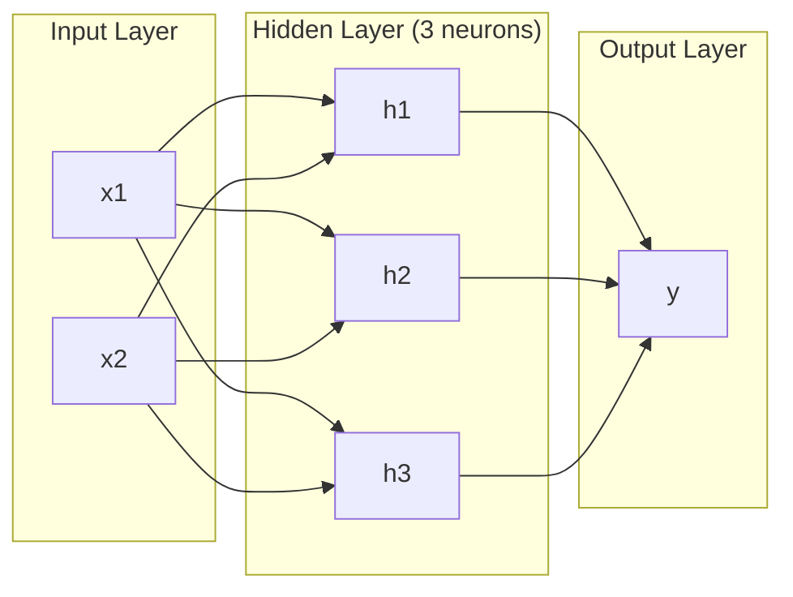
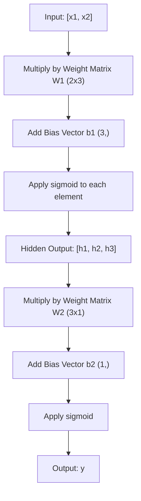
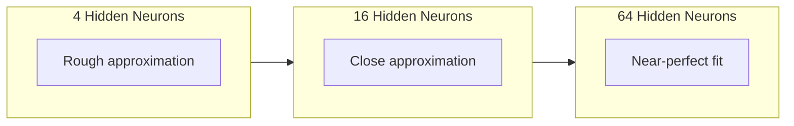

# Jaringan Multi-Layer dan Forward Pass

> Satu neuron menarik garis. Tumpuk semuanya, dan kamu bisa menggambar apa saja.

**Type:** Build
**Language:** Python
**Prerequisites:** Fase 01 (Dasar Matematika), Lesson 03.01 (Perceptron)
**Waktu:** ~90 menit

## Tujuan Pembelajaran

- Membangun jaringan multi-layer dari awal dengan kelas Layer dan Network yang melakukan forward pass lengkap
- Melacak dimension matrix melalui setiap layer jaringan dan mengidentifikasi ketidakcocokan bentuk
- Jelaskan bagaimana penumpukan activation nonlinier memungkinkan jaringan mempelajari batasan keputusan yang melengkung
- Selesaikan masalah XOR menggunakan arsitektur 2-2-1 dengan weight sigmoid yang disetel secara manual

## Masalah

Sebuah neuron tunggal adalah laci garis. Itu saja. Satu garis lurus melalui data kamu. Setiap masalah nyata dalam AI -- pengenalan gambar, pemahaman bahasa, bermain Go -- memerlukan kurva. Menumpuk neuron ke dalam layer adalah cara kamu mendapatkan kurva.

Pada tahun 1969, Minsky dan Papert membuktikan keterbatasan ini berakibat fatal: jaringan layer tunggal tidak dapat mempelajari XOR. Bukan "berjuang untuk belajar" -- secara matematis tidak bisa. Tabel kebenaran XOR menempatkan [0,1] dan [1,0] di satu sisi, [0,0] dan [1,1] di sisi lain. Tidak ada satu garis pun yang memisahkan mereka.

Hal ini mematikan pendanaan neural network selama lebih dari satu dekade. Perbaikannya sudah jelas jika dipikir-pikir: berhenti menggunakan satu layer. Tumpuk neuron menjadi beberapa layer. Biarkan layer pertama mengukir ruang input menjadi feature-feature baru, dan biarkan layer kedua menggabungkan feature-feature tersebut menjadi keputusan yang tidak dapat diambil oleh satu lini pun.

Tumpukan itu adalah jaringan multi-layer. Ini adalah dasar dari setiap model pembelajaran mendalam dalam produksi saat ini. Jalur maju -- data yang mengalir dari input melalui layer tersembunyi ke output -- adalah hal pertama yang perlu kamu buat sebelum hal lain berfungsi.

## Konsep

### Layer: Input, Tersembunyi, Output

Jaringan multi-layer memiliki tiga jenis layer:

**Layer input** -- sebenarnya bukan sebuah layer. Ini menyimpan data mentah kamu. Dua feature berarti dua node input. Tidak ada perhitungan yang terjadi di sini.

**Layer tersembunyi** -- tempat pekerjaan dilakukan. Setiap neuron mengambil setiap output dari layer sebelumnya, menerapkan weight dan bias, lalu meneruskan hasilnya melalui fungsi activation. "Tersembunyi" karena kamu tidak pernah melihat nilai ini secara langsung di training data.

**Layer output** -- jawaban akhir. Untuk klasifikasi biner, satu neuron dengan sigmoid. Untuk kelas jamak, satu neuron per kelas.



Ini adalah jaringan 2-3-1. Dua input, tiga neuron tersembunyi, satu output. Setiap koneksi membawa weight. Setiap neuron (kecuali input) membawa bias.

Setiap layer menghasilkan vector angka yang disebut keadaan tersembunyi. Untuk teks, status tersembunyi meningkatkan dimension -- mengkodekan sebuah kata sebagai 768 angka untuk menangkap makna semantik. Untuk gambar, mereka mengurangi dimension -- mengompresi jutaan piksel menjadi representasi yang dapat dikelola. Keadaan tersembunyi adalah tempat pembelajaran berada.

### Neuron dan Activation

Setiap neuron melakukan tiga hal:

1. Kalikan setiap input dengan bobotnya yang sesuai
2. Jumlahkan semua hasil kali dan tambahkan bias
3. Masukkan jumlah tersebut melalui fungsi activation

Untuk saat ini, aktivasinya bersifat sigmoid:

```
sigmoid(z) = 1 / (1 + e^(-z))
```

Sigmoid memasukkan angka apa pun ke dalam rentang (0, 1). Input positif yang besar mendorong ke arah 1. Input negatif yang besar mendorong ke arah 0. Nol dipetakan ke 0,5. Kurva halus inilah yang memungkinkan pembelajaran -- tidak seperti langkah sulit perceptron, sigmoid memiliki gradient di mana-mana.

### Forward Pass: Bagaimana Data MengalirForward pass mendorong data input melalui jaringan, layer by layer, hingga mencapai output. Tidak ada pembelajaran yang terjadi selama forward pass. Ini adalah perhitungan murni: kalikan, tambah, aktifkan, ulangi.



Pada setiap layer, tiga operasi terjadi secara berurutan:

```
z = W * input + b       (linear transformation)
a = sigmoid(z)           (activation)
```

Output suatu layer menjadi input bagi layer berikutnya. Itu adalah keseluruhan umpan ke depan.

### Dimension Matrix

Dimension pelacakan adalah satu-satunya keterampilan debugging yang paling penting dalam pembelajaran mendalam. Berikut adalah jaringan 2-3-1:

| Langkah | Operasi | Dimension | Bentuk Hasil |
|------|-----------|------------|-------------|
| Input | x | -- | (2,) |
| Linier tersembunyi | W1*x+b1| W1: (3, 2), b1: (3,) | (3,) |
| Activation tersembunyi | sigmoid(z1) | -- | (3,) |
| Output linier | W2 * jam + b2 | W2: (1, 3), b2: (1,) | (1,) |
| Activation output | sigmoid(z2) | -- | (1,) |

Aturannya: matrix weight W pada layer k berbentuk (neuron_in_layer_k, neuron_in_layer_k_minus_1). Baris cocok dengan layer saat ini. Kolom cocok dengan layer sebelumnya. Jika bentuknya tidak sejajar, kamu mengalami bug.

### Teorema Pendekatan Universal

Pada tahun 1989, George Cybenko membuktikan sesuatu yang luar biasa: neural network dengan satu layer tersembunyi dan neuron yang cukup dapat memperkirakan fungsi kontinu apa pun hingga akurasi yang diinginkan.

Ini tidak berarti satu layer tersembunyi selalu yang terbaik. Artinya secara teori arsitektur mampu. Dalam praktiknya, jaringan yang lebih dalam (lebih banyak layer, lebih sedikit neuron per layer) mempelajari fungsi yang sama dengan total parameter yang jauh lebih sedikit dibandingkan jaringan dengan lebar dangkal. Itulah sebabnya pembelajaran mendalam berhasil.

Intuisi: setiap neuron di layer tersembunyi mempelajari satu "benjolan" atau feature. Cukup banyak tonjolan yang ditempatkan di lokasi yang tepat dapat mendekati kurva mulus apa pun. Lebih banyak neuron, lebih banyak benjolan, perkiraan lebih baik.



### Komposabilitas

Jaringan neural dapat disusun. kamu dapat menumpuknya, merangkainya, menjalankannya secara paralel. Model Whisper menggunakan jaringan encoder untuk memproses audio dan jaringan decoder terpisah untuk menghasilkan teks. LLM modern hanya bersifat decoder. BERT hanya untuk pembuat enkode. T5 adalah encoder-decoder. Pilihan arsitektur menentukan apa yang dapat dilakukan model.

## Build

Python Murni. Tidak ada angka. Setiap operasi matrix ditulis dari awal.

### Langkah 1: Activation Sigmoid

```python
import math

def sigmoid(x):
    x = max(-500.0, min(500.0, x))
    return 1.0 / (1.0 + math.exp(-x))
```

Penjepit ke [-500, 500] mencegah luapan. `math.exp(500)` besar namun terbatas. `math.exp(1000)` tidak terhingga.

### Langkah 2: Kelas Layer

Operasi terpenting dalam semua pembelajaran mendalam adalah perkalian matrix. Setiap layer, setiap attention, setiap umpan ke depan -- semuanya matmuls ke bawah. Layer linier mengambil vector input, mengalikannya dengan matrix weight, dan menambahkan vector bias: y = Wx + b. Persamaan tunggal tersebut mewakili 90% komputasi dalam neural network.

Sebuah layer menampung matrix weight dan vector bias. Metode majunya mengambil vector input dan mengembalikan output yang diaktifkan.

```python
class Layer:
    def __init__(self, n_inputs, n_neurons, weights=None, biases=None):
        if weights is not None:
            self.weights = weights
        else:
            import random
            self.weights = [
                [random.uniform(-1, 1) for _ in range(n_inputs)]
                for _ in range(n_neurons)
            ]
        if biases is not None:
            self.biases = biases
        else:
            self.biases = [0.0] * n_neurons

    def forward(self, inputs):
        self.last_input = inputs
        self.last_output = []
        for neuron_idx in range(len(self.weights)):
            z = sum(
                w * x for w, x in zip(self.weights[neuron_idx], inputs)
            )
            z += self.biases[neuron_idx]
            self.last_output.append(sigmoid(z))
        return self.last_output
```

Matrix weight memiliki bentuk (n_neurons, n_inputs). Setiap baris adalah weight satu neuron di semua input. Metode maju melakukan loop melalui neuron, menghitung jumlah tertimbang ditambah bias, menerapkan sigmoid, dan mengumpulkan hasilnya.

### Langkah 3: Kelas Jaringan

Jaringan adalah daftar layer. Jalur maju menghubungkannya: output dari layer k diumpankan ke layer k+1.

```python
class Network:
    def __init__(self, layers):
        self.layers = layers

    def forward(self, inputs):
        current = inputs
        for layer in self.layers:
            current = layer.forward(current)
        return current
```

Itu adalah keseluruhan umpan ke depan. Empat baris logika. Data masuk, mengalir melalui setiap layer, keluar dari sisi lain.

### Langkah 4: XOR dengan Weight yang Disetel dengan TanganPada Lesson 01, kita menyelesaikan XOR dengan menggabungkan perceptron OR, NAND, dan AND. Sekarang lakukan hal yang sama dengan kelas Layer dan Network kita. Arsitektur 2-2-1: dua input, dua neuron tersembunyi, satu output.

```python
hidden = Layer(
    n_inputs=2,
    n_neurons=2,
    weights=[[20.0, 20.0], [-20.0, -20.0]],
    biases=[-10.0, 30.0],
)

output = Layer(
    n_inputs=2,
    n_neurons=1,
    weights=[[20.0, 20.0]],
    biases=[-30.0],
)

xor_net = Network([hidden, output])

xor_data = [
    ([0, 0], 0),
    ([0, 1], 1),
    ([1, 0], 1),
    ([1, 1], 0),
]

for inputs, expected in xor_data:
    result = xor_net.forward(inputs)
    predicted = 1 if result[0] >= 0.5 else 0
    print(f"  {inputs} -> {result[0]:.6f} (rounded: {predicted}, expected: {expected})")
```

Weight yang besar (20, -20) membuat sigmoid bertindak seperti fungsi langkah. Neuron tersembunyi pertama mendekati OR. Yang kedua mendekati NAND. Neuron output menggabungkannya menjadi AND, yaitu XOR.

### Langkah 5: Klasifikasi Lingkaran

Masalah yang lebih sulit: mengklasifikasikan titik-titik 2D sebagai di dalam atau di luar lingkaran berjari-jari 0,5 yang berpusat di titik asal. Hal ini memerlukan batas keputusan yang melengkung -- tidak mungkin dilakukan oleh satu perceptron.

```python
import random
import math

random.seed(42)

data = []
for _ in range(200):
    x = random.uniform(-1, 1)
    y = random.uniform(-1, 1)
    label = 1 if (x * x + y * y) < 0.25 else 0
    data.append(([x, y], label))

circle_net = Network([
    Layer(n_inputs=2, n_neurons=8),
    Layer(n_inputs=8, n_neurons=1),
])
```

Dengan weight acak, jaringan tidak akan terklasifikasi dengan baik. Namun umpan ke depan masih berjalan. Inilah intinya -- umpan ke depan hanyalah perhitungan. Mempelajari weight yang tepat adalah backpropagation, yang akan dibahas pada Lesson 03.

```python
correct = 0
for inputs, expected in data:
    result = circle_net.forward(inputs)
    predicted = 1 if result[0] >= 0.5 else 0
    if predicted == expected:
        correct += 1

print(f"Accuracy with random weights: {correct}/{len(data)} ({100*correct/len(data):.1f}%)")
```

Weight acak memberikan akurasi yang buruk -- seringkali lebih buruk daripada menebak kelas mayoritas. Setelah training (Lesson 03), arsitektur yang sama dengan 8 neuron tersembunyi ini akan menggambar batas melengkung yang memisahkan bagian dalam dan luar.

## Pakai

PyTorch melakukan semua hal di atas dalam empat baris:

```python
import torch
import torch.nn as nn

model = nn.Sequential(
    nn.Linear(2, 8),
    nn.Sigmoid(),
    nn.Linear(8, 1),
    nn.Sigmoid(),
)

x = torch.tensor([[0.0, 0.0], [0.0, 1.0], [1.0, 0.0], [1.0, 1.0]])
output = model(x)
print(output)
```

`nn.Linear(2, 8)` adalah kelas Layer kamu: matrix weight bentuk (8, 2), vector bias bentuk (8,). `nn.Sigmoid()` adalah fungsi sigmoid kamu yang diterapkan berdasarkan elemen. `nn.Sequential` adalah kelas Jaringan kamu: layer rantai secara berurutan.

Perbedaannya adalah kecepatan dan skala. PyTorch berjalan pada GPU, menangani jutaan sample, dan secara otomatis menghitung gradient untuk backpropagation. Namun logika forward pass identik dengan apa yang baru saja kamu buat dari awal.

## Kirim

Lesson ini menghasilkan prompt yang dapat digunakan kembali untuk merancang arsitektur jaringan:

- `outputs/prompt-network-architect.md`

Gunakan ketika kamu perlu memutuskan berapa banyak layer, berapa banyak neuron per layer, dan fungsi activation mana yang digunakan untuk masalah tertentu.

## Latihan

1. Build jaringan 2-4-2-1 (dua layer tersembunyi) dan jalankan forward pass pada data XOR dengan weight acak. Cetak output layer tersembunyi perantara untuk melihat bagaimana representasi bertransformasi di setiap layer.

2. Ubah ukuran layer tersembunyi di pengklasifikasi lingkaran dari 8 menjadi 2, lalu menjadi 32. Jalankan forward pass dengan weight acak setiap kali. Apakah jumlah neuron tersembunyi mengubah rentang atau distribusi output? Mengapa?

3. Menerapkan metode `count_parameters` pada kelas Network yang mengembalikan jumlah total weight dan bias yang dapat dilatih. Uji pada jaringan 784-256-128-10 (arsitektur MNIST klasik). Berapa banyak parameter yang dimilikinya?

4. Buatlah umpan maju untuk jaringan 3-4-4-2. Beri nilai warna RGB (dinormalisasi ke 0-1) dan amati kedua keluarannya. Ini adalah arsitektur untuk pengklasifikasi warna sederhana dengan dua kelas.

5. Ganti sigmoid dengan fungsi "langkah bocor": kembalikan 0,01 * z jika z < 0, jika tidak 1,0. Jalankan forward pass pada XOR dengan weight yang disetel dengan tangan yang sama dari Langkah 4. Apakah masih berfungsi? Mengapa sigmoid halus lebih disukai daripada potongan keras?

## Istilah Kunci| Istilah | Apa kata orang | Apa sebenarnya arti |
|------|----------------|----------------------|
| Umpan ke depan | "Menjalankan model" | Mendorong input melalui setiap layer -- kalikan dengan weight, tambahkan bias, aktifkan -- untuk menghasilkan output |
| Layer tersembunyi | "Bagian tengah" | Setiap layer antara input dan output yang nilainya tidak diamati secara langsung dalam data |
| Jaringan multi-lapis | "Jaringan saraf yang dalam" | Layer neuron ditumpuk secara berurutan, di mana output setiap layer memberi input ke layer berikutnya |
| Fungsi activation | "Nonlinieritas" | Fungsi yang diterapkan setelah transformasi linier yang memasukkan kurva ke dalam batas keputusan |
| Sigmoid | "Kurva S" | sigma(z) = 1/(1+e^(-z)), mengkompres bilangan real apa pun menjadi (0,1), mulus dan terdiferensiasi di mana saja |
| Matrix berat | "Parameter" | Matrix berbentuk W (lapisan_neuron_saat ini, lapisan_neuron_sebelumnya) berisi kekuatan koneksi yang dapat dipelajari |
| Vector bias | "Pengimbang" | Sebuah vector ditambahkan setelah perkalian matrix yang memungkinkan neuron aktif meskipun semua inputnya nol |
| Perkiraan universal | "Jaringan saraf dapat mempelajari apa saja" | Satu layer tersembunyi dengan jumlah neuron yang cukup dapat mendekati fungsi kontinu apa pun -- namun "cukup" dapat berarti miliaran |
| Transformasi linier | "Langkah perkalian matrix" | z = W * x + b, perhitungan sebelum activation, yang memetakan input ke ruang baru |
| Batas keputusan | "Di mana pengklasifikasi beralih" | Permukaan dalam ruang input tempat output jaringan melewati ambang klasifikasi |

## Bacaan Lanjutan

- Michael Nielsen, "Neural Networks and Deep Learning", Bab 1-2 (http://neuralnetworksanddeeplearning.com/) -- penjelasan gratis paling jelas tentang forward pass dan struktur jaringan, dengan visualisasi interaktif
- Cybenko, "Approximation by Superpositions of a Sigmoidal Function" (1989) -- makalah teorema pendekatan universal yang asli, sangat mudah dibaca
- 3Blue1Brown, "Tapi apa itu neural network?" (https://www.youtube.com/watch?v=aircAruvnKk) -- Panduan visual selama 20 menit tentang layer, weight, dan umpan ke depan yang membangun model mental yang tepat
- Goodfellow, Bengio, Courville, "Deep Learning", Bab 6 (https://www.deeplearningbook.org/) -- referensi standar untuk jaringan multi-layer, online gratis
