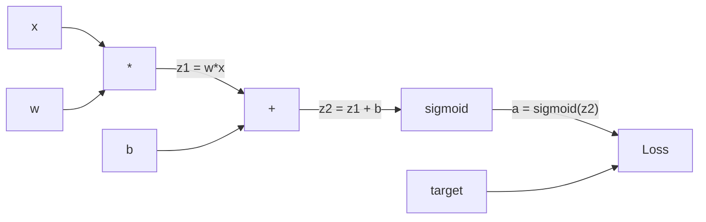
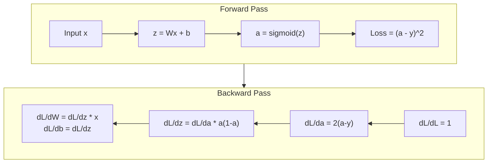
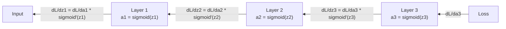

# Backpropagation dari Awal

> Backpropagation adalah algoritma yang memungkinkan pembelajaran. Tanpanya, neural network hanyalah penghasil angka acak yang mahal.

**Type:** Build
**Language:** Python
**Prerequisites:** Lesson 03.02 (Jaringan Multi-Layer)
**Waktu:** ~120 menit

## Tujuan Pembelajaran

- Menerapkan mesin autograd berbasis Nilai yang membuat grafik komputasi dan menghitung gradient melalui pengurutan topologi
- Turunkan backward pass untuk penjumlahan, perkalian, dan sigmoid menggunakan aturan rantai
- Latih jaringan multi-layer pada XOR dan klasifikasi lingkaran hanya dengan menggunakan mesin backpropagation dari awal
- Identifikasi masalah gradient hilang di jaringan sigmoid dalam dan jelaskan mengapa gradient menyusut secara eksponensial

## Masalah

Jaringan kamu memiliki satu layer tersembunyi dengan 768 input dan 3072 output. Itu berarti 2.359.296 weight. Itu membuat prediksi yang salah. Weight manakah yang menyebabkan kesalahan? Menguji setiap weight secara individual berarti 2,3 juta operan ke depan. Backpropagation menghitung 2,3 juta gradient dalam satu gerakan mundur. Itu bukan optimization. Itulah perbedaan antara bisa dilatih dan tidak mungkin.

Pendekatan yang naif: ambil satu weight, dorong sedikit, jalankan forward pass lagi, ukur apakah penurunannya naik atau turun. Itu memberi kamu gradient untuk weight itu. Sekarang lakukan untuk setiap weight dalam jaringan. Kalikan dengan ribuan langkah training dan jutaan titik data. kamu memerlukan waktu geologis untuk melatih sesuatu yang berguna.

Backpropagation memecahkan masalah ini. Satu lintasan maju, satu lintasan mundur, semua gradient dihitung. Caranya adalah aturan rantai dari kalkulus, diterapkan secara sistematis pada grafik komputasi. Ini adalah algoritma yang menjadikan pembelajaran mendalam menjadi praktis. Tanpanya, kita masih terjebak pada masalah mainan.

## Konsep

### Aturan Rantai, Diterapkan pada Jaringan

kamu melihat aturan rantai di Fase 01, Lesson 05. Rekap singkat: jika y = f(g(x)), maka dy/dx = f'(g(x)) * g'(x). kamu mengalikan turunan di sepanjang rantai.

Dalam neural network, "rantai" adalah urutan operasi dari input hingga loss. Setiap layer menerapkan weight, menambahkan bias, melewati activation. Loss function membandingkan output akhir dengan target. Backpropagation menelusuri rantai ini ke belakang, menghitung bagaimana setiap operasi berkontribusi terhadap kesalahan.

### Grafik Komputasi

Setiap forward pass membuat grafik. Setiap node adalah operasi (kalikan, tambah, sigmoid). Setiap sisi membawa nilai ke depan dan gradient ke belakang.



Forward pass: nilai mengalir dari kiri ke kanan. x dan w menghasilkan z1 = w*x. Tambahkan b untuk mendapatkan z2. Sigmoid memberikan activation a. Bandingkan a dengan target y menggunakan loss function.

Backward pass: gradient mengalir dari kanan ke kiri. Mulailah dengan dL/da (bagaimana loss berubah seiring activation). Kalikan dengan da/dz2 (turunan sigmoid). Itu menghasilkan dL/dz2. Dibagi menjadi dL/db (sama dengan dL/dz2, karena z2 = z1 + b) dan dL/dz1. Maka dL/dw = dL/dz1 * x dan dL/dx = dL/dz1 * w.

Setiap node dalam grafik memiliki satu tugas selama gerakan mundur: ambil gradient yang datang dari atas, kalikan dengan turunan lokalnya, dan turunkan.

### Maju vs Mundur



Forward pass menyimpan setiap nilai perantara: z, a, input ke setiap layer. Jalur mundur memerlukan nilai-nilai yang disimpan ini untuk menghitung gradient. Ini adalah tradeoff komputasi memori di jantung backprop. kamu menukar memori (menyimpan activation) dengan kecepatan (satu pass, bukan jutaan).

### Aliran Gradient Melalui JaringanUntuk jaringan 3 lapis, rantai gradient melewati setiap layer:



Pada setiap layer, gradient dikalikan dengan turunan sigmoid. Turunan sigmoidnya adalah a * (1 - a), yang maksimal pada 0,25 (jika a = 0,5). Sedalam tiga layer, gradiennya telah dikalikan paling banyak 0,25^3 = 0,0156. Kedalaman sepuluh layer: 0,25^10 = 0,000001.

### Hilangnya Gradient

Ini adalah masalah gradient hilang. Sigmoid menekan outputnya antara 0 dan 1. Turunannya selalu kurang dari 0,25. Tumpuk cukup banyak layer sigmoid dan gradient menyusut hingga tidak ada. Layer awal hampir tidak belajar karena menerima gradient mendekati nol.

```
sigmoid(z):     Output range [0, 1]
sigmoid'(z):    Max value 0.25 (at z = 0)

After 5 layers:   gradient * 0.25^5 = 0.001x original
After 10 layers:  gradient * 0.25^10 = 0.000001x original
```

Inilah sebabnya mengapa jaringan sigmoid dalam hampir mustahil untuk dilatih. Perbaikannya -- ReLU dan variannya -- adalah subjek dari Lesson 04. Untuk saat ini, pahami bahwa backprop berfungsi dengan sempurna. Masalah adalah apa yang sedang dikerjakannya.

### Mendapatkan Gradient untuk Jaringan 2 Layer

Matematika konkrit untuk jaringan dengan input x, layer tersembunyi dengan sigmoid, layer output dengan sigmoid, dan loss MSE.

Umpan ke depan:
```
z1 = W1 * x + b1
a1 = sigmoid(z1)
z2 = W2 * a1 + b2
a2 = sigmoid(z2)
L = (a2 - y)^2
```

Backward pass (menerapkan aturan rantai langkah demi langkah):
```
dL/da2 = 2(a2 - y)
da2/dz2 = a2 * (1 - a2)
dL/dz2 = dL/da2 * da2/dz2 = 2(a2 - y) * a2 * (1 - a2)

dL/dW2 = dL/dz2 * a1
dL/db2 = dL/dz2

dL/da1 = dL/dz2 * W2
da1/dz1 = a1 * (1 - a1)
dL/dz1 = dL/da1 * da1/dz1

dL/dW1 = dL/dz1 * x
dL/db1 = dL/dz1
```

Setiap gradient adalah produk turunan lokal yang ditelusuri kembali dari loss tersebut. Itu saja yang dimaksud dengan backpropagation.

## Build

### Langkah 1: Node Nilai

Setiap angka dalam perhitungan kita menjadi sebuah Nilai. Ia menyimpan datanya, gradiennya, dan cara pembuatannya (sehingga ia mengetahui cara menghitung gradient mundur).

```python
class Value:
    def __init__(self, data, children=(), op=''):
        self.data = data
        self.grad = 0.0
        self._backward = lambda: None
        self._children = set(children)
        self._op = op

    def __repr__(self):
        return f"Value(data={self.data:.4f}, grad={self.grad:.4f})"
```

Belum ada gradient (0,0). Belum ada fungsi mundur (no-op). Lagu `_children` yang mana Values ​​menghasilkan yang satu ini, sehingga kita dapat mengurutkan grafiknya secara topologi nanti.

### Langkah 2: Operasi dengan Fungsi Mundur

Setiap operasi menciptakan Nilai baru dan menentukan bagaimana gradient mengalir mundur melaluinya.

```python
def __add__(self, other):
    other = other if isinstance(other, Value) else Value(other)
    out = Value(self.data + other.data, (self, other), '+')

    def _backward():
        self.grad += out.grad
        other.grad += out.grad

    out._backward = _backward
    return out

def __mul__(self, other):
    other = other if isinstance(other, Value) else Value(other)
    out = Value(self.data * other.data, (self, other), '*')

    def _backward():
        self.grad += other.data * out.grad
        other.grad += self.data * out.grad

    out._backward = _backward
    return out
```

Sebagai tambahan: d(a+b)/da = 1, d(a+b)/db = 1. Jadi kedua input mendapatkan gradient output secara langsung.

Untuk perkalian: d(a*b)/da = b, d(a*b)/db = a. Setiap input mendapatkan nilai lainnya dikalikan gradient output.

`+=` sangat penting. Nilai mungkin digunakan dalam beberapa operasi. Gradiennya adalah jumlah gradient dari semua jalur.

### Langkah 3: Sigmoid dan Rugi

```python
import math

def sigmoid(self):
    x = self.data
    x = max(-500, min(500, x))
    s = 1.0 / (1.0 + math.exp(-x))
    out = Value(s, (self,), 'sigmoid')

    def _backward():
        self.grad += (s * (1 - s)) * out.grad

    out._backward = _backward
    return out
```

Turunan sigmoid: sigmoid(x) * (1 - sigmoid(x)). Kami menghitung sigmoid(x) = s selama forward pass. Gunakan kembali. Tidak ada pekerjaan tambahan.

```python
def mse_loss(predicted, target):
    diff = predicted + Value(-target)
    return diff * diff
```

MSE untuk satu output: (diprediksi - target)^2. Kami menyatakan pengurangan sebagai penjumlahan dengan Nilai yang dinegasikan.

### Langkah 4: Umpan Mundur

Pengurutan topologi memastikan kita memproses node dalam urutan yang benar -- gradient node terakumulasi sepenuhnya sebelum kita menyebarkannya.

```python
def backward(self):
    topo = []
    visited = set()

    def build_topo(v):
        if v not in visited:
            visited.add(v)
            for child in v._children:
                build_topo(child)
            topo.append(v)

    build_topo(self)
    self.grad = 1.0
    for v in reversed(topo):
        v._backward()
```

Mulai dari loss (gradient = 1,0, karena dL/dL = 1). Berjalan mundur melalui grafik yang diurutkan. `_backward` setiap node mendorong gradient ke turunannya.

### Langkah 5: Layer dan Jaringan

```python
import random

class Neuron:
    def __init__(self, n_inputs):
        scale = (2.0 / n_inputs) ** 0.5
        self.weights = [Value(random.uniform(-scale, scale)) for _ in range(n_inputs)]
        self.bias = Value(0.0)

    def __call__(self, x):
        act = sum((wi * xi for wi, xi in zip(self.weights, x)), self.bias)
        return act.sigmoid()

    def parameters(self):
        return self.weights + [self.bias]


class Layer:
    def __init__(self, n_inputs, n_outputs):
        self.neurons = [Neuron(n_inputs) for _ in range(n_outputs)]

    def __call__(self, x):
        out = [n(x) for n in self.neurons]
        return out[0] if len(out) == 1 else out

    def parameters(self):
        params = []
        for n in self.neurons:
            params.extend(n.parameters())
        return params


class Network:
    def __init__(self, sizes):
        self.layers = []
        for i in range(len(sizes) - 1):
            self.layers.append(Layer(sizes[i], sizes[i + 1]))

    def __call__(self, x):
        for layer in self.layers:
            x = layer(x)
            if not isinstance(x, list):
                x = [x]
        return x[0] if len(x) == 1 else x

    def parameters(self):
        params = []
        for layer in self.layers:
            params.extend(layer.parameters())
        return params

    def zero_grad(self):
        for p in self.parameters():
            p.grad = 0.0
```

Neuron mengambil input, menghitung jumlah tertimbang + bias, dan menerapkan sigmoid. Inisialisasi weight berskala berdasarkan sqrt(2/n_inputs) untuk mencegah saturasi sigmoid di jaringan yang lebih dalam. Layer adalah daftar Neuron. Jaringan adalah daftar Layer. Metode `parameters()` mengumpulkan semua Nilai yang dapat dipelajari sehingga kami dapat memperbaruinya.

### Langkah 6: Latih dengan XOR

```python
random.seed(42)
net = Network([2, 4, 1])

xor_data = [
    ([0.0, 0.0], 0.0),
    ([0.0, 1.0], 1.0),
    ([1.0, 0.0], 1.0),
    ([1.0, 1.0], 0.0),
]

learning_rate = 1.0

for epoch in range(1000):
    total_loss = Value(0.0)
    for inputs, target in xor_data:
        x = [Value(i) for i in inputs]
        pred = net(x)
        loss = mse_loss(pred, target)
        total_loss = total_loss + loss

    net.zero_grad()
    total_loss.backward()

    for p in net.parameters():
        p.data -= learning_rate * p.grad

    if epoch % 100 == 0:
        print(f"Epoch {epoch:4d} | Loss: {total_loss.data:.6f}")

print("\nXOR Results:")
for inputs, target in xor_data:
    x = [Value(i) for i in inputs]
    pred = net(x)
    print(f"  {inputs} -> {pred.data:.4f} (expected {target})")
```

Perhatikan penurunan kerugiannya. Dari prediksi acak hingga output XOR yang benar, sepenuhnya didorong oleh gradient komputasi backpropagation dan mendorong weight ke arah yang benar.

### Langkah 7: Klasifikasi LingkaranDalam Lesson 02, kamu menyetel weight untuk klasifikasi lingkaran. Sekarang biarkan jaringan mempelajarinya.

```python
random.seed(7)

def generate_circle_data(n=100):
    data = []
    for _ in range(n):
        x1 = random.uniform(-1.5, 1.5)
        x2 = random.uniform(-1.5, 1.5)
        label = 1.0 if x1 * x1 + x2 * x2 < 1.0 else 0.0
        data.append(([x1, x2], label))
    return data

circle_data = generate_circle_data(80)

circle_net = Network([2, 8, 1])
learning_rate = 0.5

for epoch in range(2000):
    random.shuffle(circle_data)
    total_loss_val = 0.0
    for inputs, target in circle_data:
        x = [Value(i) for i in inputs]
        pred = circle_net(x)
        loss = mse_loss(pred, target)
        circle_net.zero_grad()
        loss.backward()
        for p in circle_net.parameters():
            p.data -= learning_rate * p.grad
        total_loss_val += loss.data

    if epoch % 200 == 0:
        correct = 0
        for inputs, target in circle_data:
            x = [Value(i) for i in inputs]
            pred = circle_net(x)
            predicted_class = 1.0 if pred.data > 0.5 else 0.0
            if predicted_class == target:
                correct += 1
        accuracy = correct / len(circle_data) * 100
        print(f"Epoch {epoch:4d} | Loss: {total_loss_val:.4f} | Accuracy: {accuracy:.1f}%")
```

Kami menggunakan SGD online di sini -- memperbarui weight setelah setiap sample alih-alih mengumpulkan seluruh batch. Ini merusak simetri lebih cepat dan menghindari saturasi sigmoid pada loss landscape penuh. Mengacak data setiap periode akan mencegah jaringan mengingat urutannya.

Tidak ada penyetelan tangan. Jaringan menemukan batas keputusan melingkarnya sendiri. Itulah kekuatan backpropagation: kamu menentukan arsitektur, loss function, dan data. Algoritme menghitung bobotnya.

## Pakai

PyTorch melakukan semua hal di atas dalam beberapa baris. Ide intinya sama -- autograd membuat grafik komputasi selama lintasan maju dan menelusurinya ke belakang untuk menghitung gradient.

```python
import torch
import torch.nn as nn

model = nn.Sequential(
    nn.Linear(2, 4),
    nn.Sigmoid(),
    nn.Linear(4, 1),
    nn.Sigmoid(),
)
optimizer = torch.optim.SGD(model.parameters(), lr=1.0)
criterion = nn.MSELoss()

X = torch.tensor([[0,0],[0,1],[1,0],[1,1]], dtype=torch.float32)
y = torch.tensor([[0],[1],[1],[0]], dtype=torch.float32)

for epoch in range(1000):
    pred = model(X)
    loss = criterion(pred, y)
    optimizer.zero_grad()
    loss.backward()
    optimizer.step()

print("PyTorch XOR Results:")
with torch.no_grad():
    for i in range(4):
        pred = model(X[i])
        print(f"  {X[i].tolist()} -> {pred.item():.4f} (expected {y[i].item()})")
```

`loss.backward()` adalah `total_loss.backward()` kamu. `optimizer.step()` adalah panduan kamu `p.data -= lr * p.grad`. `optimizer.zero_grad()` adalah `net.zero_grad()` kamu. Algoritma yang sama, implementasi kekuatan industri. PyTorch menangani akselerasi GPU, presisi campuran, pemeriksaan gradient, dan ratusan jenis layer. Namun backward pass adalah aturan rantai yang sama yang diterapkan pada grafik komputasi yang sama.

Latihan menjalankan forward pass, lalu backward pass, lalu memperbarui weight. Inference hanya menjalankan forward pass. Tidak ada gradient, tidak ada pembaruan. Perbedaan ini penting karena inference adalah apa yang terjadi dalam produksi. Saat kamu memanggil API seperti Claude atau GPT, kamu menjalankan inference -- prompt kamu mengalir maju melalui jaringan, dan token keluar di ujung yang lain. Tidak ada perubahan weight. Memahami backprop penting karena membentuk setiap weight dalam jaringan tersebut.

## Kirim

Lesson ini menghasilkan:
- `outputs/prompt-gradient-debugger.md` -- prompt yang dapat digunakan kembali untuk mendiagnosis masalah gradient (menghilang, meledak, NaN) di neural network mana pun

## Latihan

1. Tambahkan metode `__sub__` ke kelas Nilai (a - b = a + (-1 * b)). Kemudian terapkan metode `__neg__`. Verifikasi bahwa gradient sudah benar dengan membandingkan dengan perhitungan manual untuk ekspresi sederhana seperti (a - b)^2.

2. Tambahkan metode `relu` ke Nilai (output maks(0, x), turunannya adalah 1 jika x > 0, jika tidak 0). Ganti sigmoid dengan relu di layer tersembunyi dan latih XOR lagi. Bandingkan kecepatan konvergensi. kamu akan melihat training yang lebih cepat -- ini adalah pratinjau Lesson 04.

3. Menerapkan metode `__pow__` pada Nilai untuk pangkat bilangan bulat. Gunakan untuk mengganti `mse_loss` dengan ekspresi `(predicted - target) ** 2` yang tepat. Verifikasikan gradient sesuai dengan implementasi aslinya.

4. Tambahkan kliping gradient ke loop training: setelah memanggil `backward()`, klip semua gradient ke [-1, 1]. Latih jaringan yang lebih dalam (4+ layer dengan sigmoid) dan bandingkan kurva loss dengan dan tanpa kliping. Ini adalah pertahanan pertama kamu terhadap ledakan gradient.

5. Buat visualisasi: setelah training XOR, cetak gradient setiap parameter di jaringan. Identifikasi layer mana yang memiliki gradient terkecil. Ini menunjukkan masalah gradient hilang yang kamu baca di bagian Konsep.

## Istilah Kunci| Istilah | Apa kata orang | Apa sebenarnya arti |
|------|----------------|----------------------|
| Backpropagation | "Jaringan belajar" | Algoritme yang menghitung dL/dw untuk setiap weight dengan menerapkan aturan rantai mundur melalui grafik komputasi |
| Grafik komputasi | "Struktur jaringan" | Grafik asiklik berarah di mana node adalah operasi dan tepinya membawa nilai (maju) dan gradient (mundur) |
| Aturan rantai | "Kalikan turunannya" | Jika y = f(g(x)), maka dy/dx = f'(g(x)) * g'(x) -- dasar matematika backpropagation |
| Gradient | "Arah pendakian paling curam" | Turunan parsial dari loss terhadap suatu parameter -- memberi tahu kamu cara mengubah parameter tersebut untuk mengurangi loss |
| Gradient menghilang | "Jaringan dalam tidak belajar" | Gradient menyusut secara eksponensial saat menyebar melalui layer dengan activation jenuh seperti sigmoid |
| Umpan ke depan | "Menjalankan jaringan" | Menghitung output dari input dengan menerapkan operasi setiap layer secara berurutan dan menyimpan nilai perantara |
| Backward pass | "Menghitung gradient" | Melintasi grafik komputasi secara terbalik, mengumpulkan gradient di setiap node menggunakan aturan rantai |
| Learning rate | "Seberapa cepat ia belajar" | Scalar yang mengontrol ukuran langkah saat memperbarui weight: w_new = w_old - lr * gradient |
| Urutan topologi | "Urutan yang benar" | Pengurutan node grafik di mana setiap node muncul setelah semua node tempat bergantungnya -- memastikan gradient terakumulasi sepenuhnya sebelum propagasi |
| Kelas Otomatis | "Diferensiasi otomatis" | Sebuah sistem yang membuat grafik komputasi selama komputasi maju dan secara otomatis menghitung gradient -- apa yang dilakukan mesin PyTorch |

## Bacaan Lanjutan

- Rumelhart, Hinton & Williams, "Mempelajari representasi dengan kesalahan propagasi balik" (1986) -- makalah yang menjadikan backpropagation sebagai arus utama dan membuka training jaringan multi-layer
- 3Blue1Brown, seri "Neural Networks" (https://www.youtube.com/playlist?list=PLZHQObOWTQDNU6R1_67000Dx_ZCJB-3pi) -- penjelasan visual terbaik tentang backpropagation dan aliran gradient melalui jaringan
