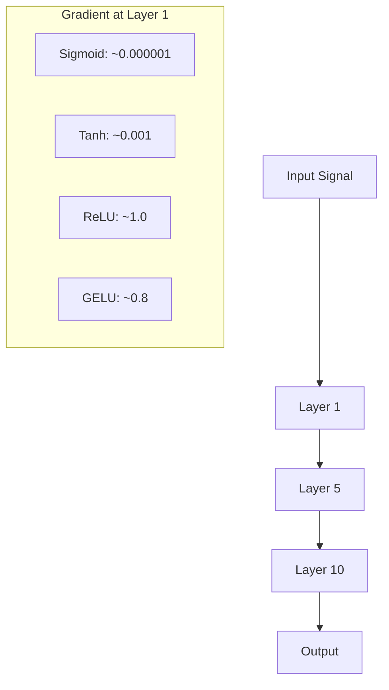
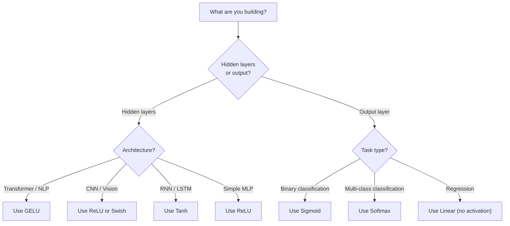

# Fungsi Activation

> Tanpa nonlinier, jaringan 100 lapis kamu adalah perkalian matrix yang bagus. Activation adalah gerbang yang memungkinkan neural network berpikir secara melengkung.

**Type:** Build
**Language:** Python
**Prerequisites:** Lesson 03.03 (backpropagation)
**Waktu:** ~75 menit

## Tujuan Pembelajaran

- Mengimplementasikan sigmoid, tanh, ReLU, Leaky ReLU, GELU, Swish, dan softmax beserta turunannya dari awal
- Diagnosis masalah gradient hilang dengan mengukur besaran activation melalui 10+ layer dengan activation berbeda
- Mendeteksi neuron mati di jaringan ReLU dan menjelaskan mengapa GELU menghindari mode kegagalan ini
- Pilih fungsi activation yang benar untuk arsitektur tertentu (Transformer, CNN, RNN, layer output)

## Masalah

Tumpuk dua transformasi linier: y = W2(W1x + b1) + b2. Perluas: y = W2W1x + W2b1 + b2. Itu hanya y = Ax + c -- transformasi linier tunggal. Tidak peduli berapa banyak layer linier yang kamu susun, hasilnya akan diciutkan menjadi satu kali matrix. Jaringan 100 layer kamu memiliki kekuatan representasi yang sama dengan jaringan satu layer.

Ini bukanlah keingintahuan teoritis. Artinya, jaringan linier dalam tidak dapat mempelajari XOR, tidak dapat mengklasifikasikan dataset spiral, dan tidak dapat mengenali wajah. Tanpa fungsi activation, kedalaman hanyalah ilusi.

Fungsi activation memutus linearitas. Mereka membengkokkan output setiap layer melalui fungsi nonlinier, memberikan jaringan kemampuan untuk membengkokkan batasan keputusan, memperkirakan fungsi arbitrer, dan benar-benar belajar. Namun pilih activation yang salah dan gradient kamu akan hilang hingga nol (sigmoid di jaringan dalam), meledak hingga tak terbatas (activation tanpa batas tanpa inisialisasi yang cermat), atau neuron kamu mati secara permanen (ReLU dengan bias negatif yang besar). Pilihan fungsi activation secara langsung menentukan apakah jaringan kamu belajar atau tidak.

## Konsep

### Mengapa Nonlinier Diperlukan

Perkalian matrix dapat disusun. Mengalikan suatu vector dengan matrix A maka matrix B identik dengan mengalikan dengan AB. Artinya, menumpuk sepuluh layer linier secara matematis setara dengan satu layer linier dengan satu matrix besar. Semua parameter itu, semua kedalaman itu -- terbuang sia-sia. kamu memerlukan sesuatu untuk memutus rantai tersebut. Itulah fungsi activation.

Ini buktinya. Layer linier menghitung f(x) = Wx + b. Tumpukan dua:

```
Layer 1: h = W1 * x + b1
Layer 2: y = W2 * h + b2
```

Pengganti:

```
y = W2 * (W1 * x + b1) + b2
y = (W2 * W1) * x + (W2 * b1 + b2)
y = A * x + c
```

Satu layer. Masukkan activation nonlinier g() antar layer:

```
h = g(W1 * x + b1)
y = W2 * h + b2
```

Sekarang pergantian pemain terputus. W2 * g(W1 * x + b1) + b2 tidak dapat direduksi menjadi transformasi linier tunggal. Jaringan dapat mewakili fungsi nonlinier. Setiap layer tambahan dengan activation menambah kapasitas representasi.

### Sigmoid

Fungsi activation asli untuk neural network.

```
sigmoid(x) = 1 / (1 + e^(-x))
```

Rentang output: (0, 1). Halus, dapat dibedakan, memetakan bilangan real apa pun ke nilai seperti probabilitas.

Turunannya:

```
sigmoid'(x) = sigmoid(x) * (1 - sigmoid(x))
```

Nilai maksimum turunan ini adalah 0,25, terjadi pada x = 0. Dalam backpropagation, gradient dikalikan melalui layer. Sepuluh layer sigmoid berarti gradient dikalikan paling banyak 0,25 sepuluh kali:

```
0.25^10 = 0.000000953674
```

Kurang dari sepersejuta sinyal aslinya. Ini adalah masalah gradient hilang. Gradient pada layer awal menjadi sangat kecil sehingga weight hampir tidak diperbarui. Jaringan tampaknya belajar -- loss berkurang di layer berikutnya -- tetapi layer pertama dibekukan. Jaringan sigmoid dalam tidak bisa dilatih.Masalah tambahan: output sigmoid selalu positif (0 hingga 1), yang berarti gradient pada weight selalu bertanda sama. Hal ini menyebabkan zig-zag selama gradient descent.

### Tanh

Versi sigmoid terpusat.

```
tanh(x) = (e^x - e^(-x)) / (e^x + e^(-x))
```

Rentang output: (-1, 1). Berpusat pada nol, yang menghilangkan masalah zig-zag.

Turunannya:

```
tanh'(x) = 1 - tanh(x)^2
```

Turunan maksimum adalah 1,0 pada x = 0 -- empat kali lebih baik daripada sigmoid. Namun masalah gradient hilang masih ada. Untuk input positif atau negatif yang besar, turunannya mendekati nol. Sepuluh layer masih menghancurkan gradient, hanya saja tidak terlalu agresif.

### ReLU: Terobosan

Satuan Linier yang Diperbaiki. Dipopulerkan untuk pembelajaran mendalam oleh Nair dan Hinton pada tahun 2010 (fungsinya sendiri berasal dari karya Fukushima tahun 1969), ini mengubah segalanya.

```
relu(x) = max(0, x)
```

Rentang output: [0, tak terbatas). Turunannya sangat sederhana:

```
relu'(x) = 1  if x > 0
            0  if x <= 0
```

Tidak ada gradient hilang untuk input positif. Gradiennya tepat 1, melewati lurus. Inilah sebabnya mengapa jaringan dalam dapat dilatih -- ReLU mempertahankan besaran gradient di seluruh layer.

Namun ada modus kegagalan: masalah neuron mati. Jika input berbobot suatu neuron selalu negatif (karena bias negatif yang besar atau inisialisasi weight yang tidak menguntungkan), keluarannya selalu nol, gradiennya selalu nol, dan tidak pernah diperbarui. Itu mati secara permanen. Dalam praktiknya, 10-40% neuron di jaringan ReLU bisa mati selama training.

### ReLU bocor

Perbaikan paling sederhana untuk neuron mati.

```
leaky_relu(x) = x        if x > 0
                alpha * x if x <= 0
```

Dimana alpha adalah konstanta kecil, biasanya 0,01. Sisi negatifnya memiliki kemiringan yang kecil, bukan nol, sehingga neuron yang mati masih mendapatkan sinyal gradient dan dapat pulih.

### GELU: Standar Modern

Satuan Linier Kesalahan Gaussian. Diperkenalkan oleh Hendrycks dan Gimpel pada tahun 2016. Activation default di BERT, GPT, dan sebagian besar Transformer modern.

```
gelu(x) = x * Phi(x)
```

Dimana Phi(x) adalah fungsi distribusi kumulatif dari distribusi normal standar. Perkiraan yang digunakan dalam praktik:

```
gelu(x) ~= 0.5 * x * (1 + tanh(sqrt(2/pi) * (x + 0.044715 * x^3)))
```

GELU mulus di mana-mana, memungkinkan nilai negatif kecil (tidak seperti ReLU yang sulit dijepit ke nol), dan memiliki interpretasi probabilistik: ia memberi weight pada setiap input berdasarkan seberapa besar kemungkinannya menjadi positif dalam distribusi Gaussian. Gerbang halus ini mengungguli ReLU dalam arsitektur Transformer karena memberikan aliran gradient yang lebih baik dan sepenuhnya menghindari masalah neuron mati.

### Desir / SiLU

Activation self-gated ditemukan oleh Ramachandran et al. pada tahun 2017 melalui pencarian otomatis.

```
swish(x) = x * sigmoid(x)
```

Desir secara formal adalah x * sigmoid(x). Google menemukannya melalui pencarian otomatis pada ruang fungsi activation -- neural network yang merancang bagian-bagian neural network.

Seperti GELU, ia halus, tidak monoton, dan memungkinkan nilai negatif yang kecil. Perbedaannya tidak kentara: Swish menggunakan sigmoid untuk gating sedangkan GELU menggunakan Gaussian CDF. Dalam praktiknya, kinerjanya hampir sama. Swish digunakan di EfficientNet dan beberapa model vision. GELU mendominasi model bahasa.

### Softmax: Activation Output

Tidak digunakan pada layer tersembunyi. Softmax mengubah vector skor mentah (logit) menjadi distribusi probabilitas.

```
softmax(x_i) = e^(x_i) / sum(e^(x_j) for all j)
```

Setiap output antara 0 dan 1. Semua output berjumlah 1. Ini menjadikannya activation akhir standar untuk klasifikasi kelas jamak. Logit terbesar mendapatkan probabilitas tertinggi, tetapi tidak seperti argmax, softmax dapat dibedakan dan menyimpan informasi tentang keyakinan relatif.

### Perbandingan Bentuk```mermaid
graph LR
    subgraph "Activation Functions"
        S["Sigmoid<br/>Range: (0,1)<br/>Saturates both ends"]
        T["Tanh<br/>Range: (-1,1)<br/>Zero-centered"]
        R["ReLU<br/>Range: [0,inf)<br/>Dead neurons"]
        G["GELU<br/>Range: ~(-0.17,inf)<br/>Smooth gating"]
    end
    S -->|"Vanishing gradient"| Problem["Deep networks<br/>don't train"]
    T -->|"Less severe but<br/>still vanishes"| Problem
    R -->|"Gradient = 1<br/>for x > 0"| Solution["Deep networks<br/>train fast"]
    G -->|"Smooth gradient<br/>everywhere"| Solution
```

### Perbandingan Aliran Gradient



### Yang Activation Kapan



## Build

### Langkah 1: Implementasikan Semua Fungsi Activation dengan Derivatif

Setiap fungsi mengambil satu pelampung dan mengembalikan pelampung. Setiap fungsi turunan mengambil input yang sama dan mengembalikan gradient.

```python
import math

def sigmoid(x):
    x = max(-500, min(500, x))
    return 1.0 / (1.0 + math.exp(-x))

def sigmoid_derivative(x):
    s = sigmoid(x)
    return s * (1 - s)

def tanh_act(x):
    return math.tanh(x)

def tanh_derivative(x):
    t = math.tanh(x)
    return 1 - t * t

def relu(x):
    return max(0.0, x)

def relu_derivative(x):
    return 1.0 if x > 0 else 0.0

def leaky_relu(x, alpha=0.01):
    return x if x > 0 else alpha * x

def leaky_relu_derivative(x, alpha=0.01):
    return 1.0 if x > 0 else alpha

def gelu(x):
    return 0.5 * x * (1 + math.tanh(math.sqrt(2 / math.pi) * (x + 0.044715 * x ** 3)))

def gelu_derivative(x):
    phi = 0.5 * (1 + math.erf(x / math.sqrt(2)))
    pdf = math.exp(-0.5 * x * x) / math.sqrt(2 * math.pi)
    return phi + x * pdf

def swish(x):
    return x * sigmoid(x)

def swish_derivative(x):
    s = sigmoid(x)
    return s + x * s * (1 - s)

def softmax(xs):
    max_x = max(xs)
    exps = [math.exp(x - max_x) for x in xs]
    total = sum(exps)
    return [e / total for e in exps]
```

### Langkah 2: Visualisasikan Dimana Gradient Mati

Hitung gradient pada 100 titik dengan distance yang sama dari -5 hingga 5. Cetak histogram teks yang menunjukkan di mana setiap gradient activation mendekati nol.

```python
def gradient_scan(name, derivative_fn, start=-5, end=5, n=100):
    step = (end - start) / n
    near_zero = 0
    healthy = 0
    for i in range(n):
        x = start + i * step
        g = derivative_fn(x)
        if abs(g) < 0.01:
            near_zero += 1
        else:
            healthy += 1
    pct_dead = near_zero / n * 100
    print(f"{name:15s}: {healthy:3d} healthy, {near_zero:3d} near-zero ({pct_dead:.0f}% dead zone)")

gradient_scan("Sigmoid", sigmoid_derivative)
gradient_scan("Tanh", tanh_derivative)
gradient_scan("ReLU", relu_derivative)
gradient_scan("Leaky ReLU", leaky_relu_derivative)
gradient_scan("GELU", gelu_derivative)
gradient_scan("Swish", swish_derivative)
```

### Langkah 3: Eksperimen Menghilangkan Gradient

Meneruskan sinyal melalui N layer menggunakan sigmoid vs ReLU. Ukur bagaimana besarnya activation berubah.

```python
import random

def vanishing_gradient_experiment(activation_fn, name, n_layers=10, n_inputs=5):
    random.seed(42)
    values = [random.gauss(0, 1) for _ in range(n_inputs)]

    print(f"\n{name} through {n_layers} layers:")
    for layer in range(n_layers):
        weights = [random.gauss(0, 1) for _ in range(n_inputs)]
        z = sum(w * v for w, v in zip(weights, values))
        activated = activation_fn(z)
        magnitude = abs(activated)
        bar = "#" * int(magnitude * 20)
        print(f"  Layer {layer+1:2d}: magnitude = {magnitude:.6f} {bar}")
        values = [activated] * n_inputs

vanishing_gradient_experiment(sigmoid, "Sigmoid")
vanishing_gradient_experiment(relu, "ReLU")
vanishing_gradient_experiment(gelu, "GELU")
```

### Langkah 4: Detektor Neuron Mati

Buat jaringan ReLU, berikan input acak melaluinya, hitung berapa banyak neuron yang tidak pernah aktif.

```python
def dead_neuron_detector(n_inputs=5, hidden_size=20, n_samples=1000):
    random.seed(0)
    weights = [[random.gauss(0, 1) for _ in range(n_inputs)] for _ in range(hidden_size)]
    biases = [random.gauss(0, 1) for _ in range(hidden_size)]

    fire_counts = [0] * hidden_size

    for _ in range(n_samples):
        inputs = [random.gauss(0, 1) for _ in range(n_inputs)]
        for neuron_idx in range(hidden_size):
            z = sum(w * x for w, x in zip(weights[neuron_idx], inputs)) + biases[neuron_idx]
            if relu(z) > 0:
                fire_counts[neuron_idx] += 1

    dead = sum(1 for c in fire_counts if c == 0)
    rarely_fire = sum(1 for c in fire_counts if 0 < c < n_samples * 0.05)
    healthy = hidden_size - dead - rarely_fire

    print(f"\nDead Neuron Report ({hidden_size} neurons, {n_samples} samples):")
    print(f"  Dead (never fired):     {dead}")
    print(f"  Barely alive (<5%):     {rarely_fire}")
    print(f"  Healthy:                {healthy}")
    print(f"  Dead neuron rate:       {dead/hidden_size*100:.1f}%")

    for i, c in enumerate(fire_counts):
        status = "DEAD" if c == 0 else "WEAK" if c < n_samples * 0.05 else "OK"
        bar = "#" * (c * 40 // n_samples)
        print(f"  Neuron {i:2d}: {c:4d}/{n_samples} fires [{status:4s}] {bar}")

dead_neuron_detector()
```

### Langkah 5: Perbandingan Training -- Sigmoid vs ReLU vs GELU

Latih jaringan dua layer yang sama pada dataset lingkaran (titik di dalam lingkaran = kelas 1, di luar = kelas 0) dengan tiga activation berbeda. Bandingkan kecepatan konvergensi.

```python
def make_circle_data(n=200, seed=42):
    random.seed(seed)
    data = []
    for _ in range(n):
        x = random.uniform(-2, 2)
        y = random.uniform(-2, 2)
        label = 1.0 if x * x + y * y < 1.5 else 0.0
        data.append(([x, y], label))
    return data


class ActivationNetwork:
    def __init__(self, activation_fn, activation_deriv, hidden_size=8, lr=0.1):
        random.seed(0)
        self.act = activation_fn
        self.act_d = activation_deriv
        self.lr = lr
        self.hidden_size = hidden_size

        self.w1 = [[random.gauss(0, 0.5) for _ in range(2)] for _ in range(hidden_size)]
        self.b1 = [0.0] * hidden_size
        self.w2 = [random.gauss(0, 0.5) for _ in range(hidden_size)]
        self.b2 = 0.0

    def forward(self, x):
        self.x = x
        self.z1 = []
        self.h = []
        for i in range(self.hidden_size):
            z = self.w1[i][0] * x[0] + self.w1[i][1] * x[1] + self.b1[i]
            self.z1.append(z)
            self.h.append(self.act(z))

        self.z2 = sum(self.w2[i] * self.h[i] for i in range(self.hidden_size)) + self.b2
        self.out = sigmoid(self.z2)
        return self.out

    def backward(self, target):
        error = self.out - target
        d_out = error * self.out * (1 - self.out)

        for i in range(self.hidden_size):
            d_h = d_out * self.w2[i] * self.act_d(self.z1[i])
            self.w2[i] -= self.lr * d_out * self.h[i]
            for j in range(2):
                self.w1[i][j] -= self.lr * d_h * self.x[j]
            self.b1[i] -= self.lr * d_h
        self.b2 -= self.lr * d_out

    def train(self, data, epochs=200):
        losses = []
        for epoch in range(epochs):
            total_loss = 0
            correct = 0
            for x, y in data:
                pred = self.forward(x)
                self.backward(y)
                total_loss += (pred - y) ** 2
                if (pred >= 0.5) == (y >= 0.5):
                    correct += 1
            avg_loss = total_loss / len(data)
            accuracy = correct / len(data) * 100
            losses.append(avg_loss)
            if epoch % 50 == 0 or epoch == epochs - 1:
                print(f"    Epoch {epoch:3d}: loss={avg_loss:.4f}, accuracy={accuracy:.1f}%")
        return losses


data = make_circle_data()

configs = [
    ("Sigmoid", sigmoid, sigmoid_derivative),
    ("ReLU", relu, relu_derivative),
    ("GELU", gelu, gelu_derivative),
]

results = {}
for name, act_fn, act_d_fn in configs:
    print(f"\n=== Training with {name} ===")
    net = ActivationNetwork(act_fn, act_d_fn, hidden_size=8, lr=0.1)
    losses = net.train(data, epochs=200)
    results[name] = losses

print("\n=== Final Loss Comparison ===")
for name, losses in results.items():
    print(f"  {name:10s}: start={losses[0]:.4f} -> end={losses[-1]:.4f} (improvement: {(1 - losses[-1]/losses[0])*100:.1f}%)")
```

## Pakai

PyTorch menyediakan semua ini sebagai bentuk fungsional dan modul:

```python
import torch
import torch.nn as nn
import torch.nn.functional as F

x = torch.randn(4, 10)

relu_out = F.relu(x)
gelu_out = F.gelu(x)
sigmoid_out = torch.sigmoid(x)
swish_out = F.silu(x)

logits = torch.randn(4, 5)
probs = F.softmax(logits, dim=1)

model = nn.Sequential(
    nn.Linear(10, 64),
    nn.GELU(),
    nn.Linear(64, 32),
    nn.GELU(),
    nn.Linear(32, 5),
)
```

Layer tersembunyi pada trafo: GELU. Layer tersembunyi di CNN: ReLU. Layer output untuk klasifikasi: softmax. Layer output untuk regresi: tidak ada (linier). Layer output untuk probabilitas: sigmoid. Itu saja. Mulailah dengan default ini. Ubahlah hanya jika kamu memiliki bukti.

RNN dan LSTM menggunakan tanh untuk keadaan tersembunyi dan sigmoid untuk gerbang, tetapi jika kamu membangun dari awal hari ini, kamu mungkin tidak menggunakan RNN. Jika neuron di jaringan ReLU kamu mati, beralihlah ke GELU. Jangan menggunakan Leaky ReLU kecuali kamu memiliki alasan khusus -- GELU memecahkan masalah neuron mati dan memberikan aliran gradient yang lebih baik.

## Kirim

Lesson ini menghasilkan:
- `outputs/prompt-activation-selector.md` -- prompt yang dapat digunakan kembali untuk membantu kamu memilih fungsi activation yang tepat untuk arsitektur apa pun

## Latihan

1. Menerapkan Parametrik ReLU (PReLU) di mana kemiringan alpha negatif adalah parameter yang dapat dipelajari. Latihlah pada dataset lingkaran dan bandingkan dengan Leaky ReLU yang diperbaiki.

2. Jalankan percobaan gradient hilang dengan 50 layer, bukan 10. Plot besaran pada setiap layer untuk sigmoid, tanh, ReLU, dan GELU. Pada layer manakah setiap sinyal activation secara efektif mencapai nol?

3. Implementasikan ELU (Exponential Linear Unit): elu(x) = x jika x > 0, alpha * (e^x - 1) jika x <= 0. Bandingkan laju neuron matinya dengan ReLU pada jaringan yang sama.

4. Buatlah "monitor kesehatan gradient" yang dijalankan selama training: pada setiap periode, hitung besaran gradient rata-rata pada setiap layer. Cetak peringatan ketika gradient layer mana pun turun di bawah 0,001 atau melebihi 100.

5. Ubah perbandingan training untuk menggunakan dataset XOR dari Lesson 01, bukan lingkaran. Activation mana yang paling cepat menyatu pada XOR? Mengapa ini berbeda dengan hasil lingkaran?

## Istilah Kunci| Istilah | Apa kata orang | Apa sebenarnya arti |
|------|----------------|----------------------|
| Fungsi activation | "Bagian nonlinier" | Sebuah fungsi yang diterapkan pada output setiap neuron yang memutus linearitas, memungkinkan jaringan mempelajari pemetaan nonlinier |
| Gradient menghilang | "Gradient menghilang di jaringan dalam" | Gradient menyusut secara eksponensial melalui layer ketika turunan activation kurang dari 1, membuat layer awal tidak dapat dilatih |
| Gradient yang meledak | "Gradient meledak" | Gradient tumbuh secara eksponensial melalui layer ketika pengali efektif melebihi 1, menyebabkan training |
| Neuron mati | "Sebuah neuron yang berhenti belajar" | Neuron ReLU yang masukannya negatif secara permanen, menghasilkan output nol dan gradient nol |
| Sigmoid | "Memperas nilai menjadi 0-1" | Fungsi logistik 1/(1+e^-x), penting secara historis tetapi menyebabkan vanishing gradient di jaringan dalam |
| ULT | "Klip negatif ke nol" | max(0, x) -- activation yang membuat pembelajaran mendalam menjadi praktis dengan mempertahankan besaran gradient |
| GELU | "Activation trafo" | Unit Linier Kesalahan Gaussian, activation mulus yang memberi weight pada input berdasarkan probabilitasnya menjadi positif |
| Desir/SiLU | "ReLU dengan gerbang mandiri" | x * sigmoid(x), ditemukan melalui pencarian otomatis, digunakan di EfficientNet |
| Softmax | "Mengubah skor menjadi probabilitas" | Menormalkan vector logit menjadi distribusi probabilitas yang semua nilainya berada di (0,1) dan berjumlah 1 |
| ReLU Bocor | "ReLU yang tidak mati" | max(alpha*x, x) di mana alpha kecil (0,01), mencegah neuron mati dengan membiarkan gradient negatif kecil |
| Saturasi | "Bagian datar dari sigmoid" | Wilayah dimana turunan activation mendekati nol, menghalangi aliran gradient |
| Masuk | "Skor mentah sebelum softmax" | Output layer terakhir yang tidak dinormalisasi sebelum menerapkan softmax atau sigmoid |

## Bacaan Lanjutan

- Nair & Hinton, "Rectified Linear Units Improve Restricted Boltzmann Machines" (2010) -- makalah yang memperkenalkan ReLU dan memungkinkan training jaringan dalam
- Hendrycks & Gimpel, "Gaussian Error Linear Units (GELUs)" (2016) -- memperkenalkan fungsi activation yang menjadi default untuk Transformer
- Ramachandran dkk., "Mencari Fungsi Activation" (2017) -- menggunakan pencarian otomatis untuk menemukan Swish, menunjukkan bahwa desain activation dapat diotomatisasi
- Glorot & Bengio, "Memahami kesulitan melatih neural network maju umpan dalam" (2010) -- makalah yang mendiagnosis gradient hilang/meledak dan mengusulkan inisialisasi Xavier
- Goodfellow, Bengio, Courville, "Deep Learning" Bab 6.3 (https://www.deeplearningbook.org/) -- perlakuan ketat terhadap unit tersembunyi dan fungsi activation
