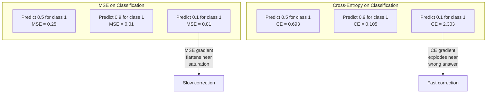
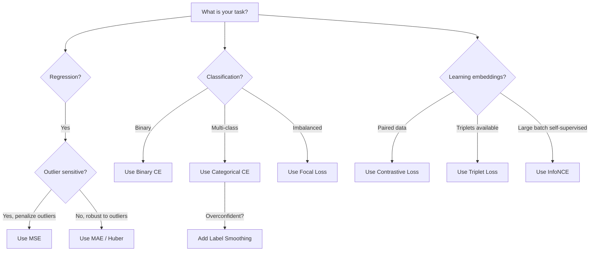
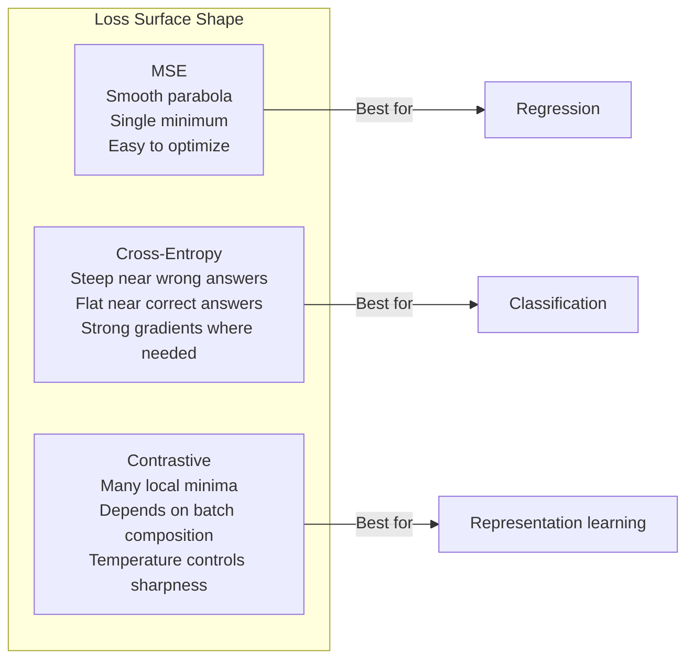

# Fungsi Loss

> Jaringan kamu membuat prediksi. Kenyataan di lapangan mengatakan sebaliknya. Seberapa salahnya? Angka itu adalah loss. Pilih loss function yang salah dan model kamu akan mengoptimalkan hal yang salah sepenuhnya.

**Type:** Build
**Language:** Python
**Prerequisites:** Lesson 03.04 (Fungsi Activation)
**Waktu:** ~75 menit

## Tujuan Pembelajaran

- Menerapkan MSE, entropi silang biner, entropi silang kategoris, dan loss kontrastif (InfoNCE) dari awal dengan gradiennya
- Jelaskan mengapa MSE gagal untuk klasifikasi dengan menunjukkan mode kegagalan "prediksi 0,5 untuk semuanya".
- Terapkan perataan label pada entropi silang dan jelaskan cara hal ini mencegah prediksi terlalu percaya diri
- Pilih loss function yang benar untuk regresi, klasifikasi biner, klasifikasi kelas jamak, dan embedding tugas pembelajaran

## Masalah

Model yang meminimalkan MSE pada masalah klasifikasi akan dengan yakin memprediksi 0,5 untuk semuanya. Ini meminimalkan loss. Itu juga tidak berguna.

Loss function adalah satu-satunya hal yang benar-benar dioptimalkan oleh model kamu. Bukan akurasi. Bukan skor F1. Bukan metrik apa pun yang kamu laporkan kepada manajer kamu. Optimizer mengambil gradient loss function dan menyesuaikan weight untuk memperkecil angka tersebut. Jika loss function tidak menangkap apa yang kamu pedulikan, model akan menemukan cara termurah secara matematis untuk memenuhinya, dan cara tersebut hampir tidak pernah kamu inginkan.

Berikut adalah contoh konkritnya. kamu memiliki tugas klasifikasi biner. Dua kelas, pembagian 50/50. kamu menggunakan UMK sebagai loss kamu. Model ini memprediksi 0,5 untuk setiap input. Rata-rata UMK adalah 0,25, yang merupakan nilai minimum yang mungkin dicapai tanpa benar-benar mempelajari apa pun. Model ini tidak memiliki kemampuan diskriminatif tetapi secara teknis meminimalkan loss function kamu. Beralih ke entropi silang dan model yang sama dipaksa untuk mendorong prediksi ke arah 0 atau 1, karena -log(0.5) = 0.693 adalah loss yang sangat besar, sementara -log(0.99) = 0.01 memberi penghargaan pada prediksi yang benar dan meyakinkan. Pilihan loss function adalah perbedaan antara model yang mempelajari dan model yang memainkan metrik.

Ini menjadi lebih buruk. Dalam pembelajaran dengan pengawasan mandiri, kamu bahkan tidak memiliki label. Loss kontrastif mendefinisikan sinyal pembelajaran secara keseluruhan: apa yang dianggap serupa, apa yang dianggap berbeda, dan seberapa keras model harus memisahkannya. Jika loss kontrastif salah, maka embeddings kamu akan runtuh ke satu titik -- setiap input dipetakan ke vector yang sama. Secara teknis tidak ada loss. Sama sekali tidak berharga.

## Konsep

### Kesalahan Rata-Rata Kuadrat (MSE)

Default untuk regresi. Hitung selisih kuadrat antara prediksi dan target, rata-rata seluruh sample.

```
MSE = (1/n) * sum((y_pred - y_true)^2)
```

Mengapa mengkuadratkan penting: ini menghukum kesalahan besar secara kuadrat. Kesalahan 2 berharga 4x lipat dari kesalahan 1. Kesalahan 10 berharga 100x. Hal ini membuat UMK sensitif terhadap outlier -- satu prediksi yang salah akan mendominasi loss.

Angka sebenarnya: jika model kamu memprediksi harga rumah dan turun sebesar $10.000 pada sebagian besar rumah namun turun sebesar $200.000 pada satu rumah besar, MSE akan secara agresif mencoba memperbaiki satu rumah tersebut, sehingga berpotensi menurunkan kinerja 99 rumah lainnya.

Gradient UMK sehubungan dengan prediksi adalah:

```
dMSE/dy_pred = (2/n) * (y_pred - y_true)
```

Linear dalam kesalahan. Kesalahan yang lebih besar menghasilkan gradient yang lebih besar. Ini adalah feature untuk regresi (kesalahan besar memerlukan koreksi besar) dan bug untuk klasifikasi (kamu ingin menghukum jawaban yang salah secara eksponensial, bukan linier).

### Loss Lintas EntropiFungsi loss untuk klasifikasi. Berakar pada teori informasi -- teori ini mengukur perbedaan antara distribusi probabilitas yang diprediksi dan distribusi sebenarnya.

**Entropi Silang Biner (BCE):**

```
BCE = -(y * log(p) + (1 - y) * log(1 - p))
```

Dimana y adalah label sebenarnya (0 atau 1) dan p adalah probabilitas prediksi.

Mengapa -log(p) berfungsi: jika label sebenarnya adalah 1 dan kamu memperkirakan p = 0,99, kerugiannya adalah -log(0,99) = 0,01. Saat kamu memprediksi p = 0,01, kerugiannya adalah -log(0,01) = 4,6. Perbedaan 460x itulah yang menyebabkan entropi silang berhasil. Ini secara brutal menghukum prediksi yang salah dan hampir tidak menghukum prediksi yang benar.

Gradient menceritakan kisah yang sama:

```
dBCE/dp = -(y/p) + (1-y)/(1-p)
```

Ketika y = 1 dan p mendekati nol, gradiennya adalah -1/p yang mendekati tak terhingga negatif. Model tersebut mendapat sinyal yang sangat besar untuk memperbaiki kesalahannya. Ketika p mendekati 1, gradiennya kecil. Sudah benar, tidak ada yang perlu diperbaiki.

**Entropi Silang Kategoris:**

Untuk klasifikasi kelas jamak dengan target yang dikodekan one-hot.

```
CCE = -sum(y_i * log(p_i))
```

Hanya kelas sebenarnya yang berkontribusi terhadap loss (karena semua y_i lainnya adalah nol). Jika ada 10 kelas dan kelas yang benar mendapat probabilitas 0,1 (tebakan acak), kerugiannya adalah -log(0.1) = 2.3. Jika kelas yang benar mendapat probabilitas 0,9, kerugiannya adalah -log(0,9) = 0,105. Model ini belajar memusatkan massa probabilitas pada jawaban yang benar.

### Mengapa UMK Gagal Klasifikasi



Gradient MSE mendatar ketika prediksi mendekati 0 atau 1 (karena saturasi sigmoid). Gradient lintas-entropi mengkompensasi hal ini -- -log membatalkan daerah datar sigmoid, memberikan gradient yang kuat tepat di tempat yang paling membutuhkannya.

### Penghalusan Label

Label standar one-hot mengatakan "ini adalah 100% kelas 3 dan 0% yang lainnya." Itu adalah klaim yang kuat. Penghalusan label melembutkannya:

```
smooth_label = (1 - alpha) * one_hot + alpha / num_classes
```

Dengan kelas alpha = 0,1 dan 10: alih-alih [0, 0, 1, 0, ...], targetnya menjadi [0.01, 0.01, 0.91, 0.01, ...]. Model ini menargetkan 0,91, bukan 1,0.

Mengapa ini berhasil: model yang mencoba menghasilkan output tepat 1,0 melalui softmax perlu mendorong logit hingga tak terbatas. Hal ini menyebabkan terlalu percaya diri, merugikan generalisasi, dan membuat model rapuh terhadap pergeseran distribusi. Penghalusan label membatasi target pada 0,9 (dengan alpha=0,1), menjaga logit dalam kisaran yang wajar. GPT dan sebagian besar model modern menggunakan penghalusan label atau yang setara.

### Loss Kontrasif

Tidak ada label. Tidak ada kelas. Hanya memasangkan input dan pertanyaannya: apakah serupa atau berbeda?

**Loss kontrastif gaya SimCLR (NT-Xent / InfoNCE):**

Ambil satu gambar. Buat dua tampilan tambahan (pangkas, putar, jitter warna). Ini adalah "pasangan positif" -- keduanya harus memiliki embedding yang serupa. Setiap gambar lain dalam kumpulan tersebut membentuk "pasangan negatif" -- gambar tersebut harus memiliki embedding yang berbeda.

```
L = -log(exp(sim(z_i, z_j) / tau) / sum(exp(sim(z_i, z_k) / tau)))
```

Dimana sim() adalah kesamaan kosinus, z_i dan z_j adalah pasangan positif, jumlah seluruh negatif, dan tau (suhu) mengontrol seberapa tajam distribusinya. Temperatur lebih rendah = negatif lebih keras = pemisahan lebih agresif.

Bilangan real: ukuran batch 256 berarti 255 negatif per pasangan positif. Suhu tau = 0,07 (default SimCLR). Kerugiannya tampak seperti softmax atas kesamaan -- ia ingin kesamaan pasangan positif menjadi yang tertinggi di antara 256 opsi.

**Loss Tiga Kali Lipat:**

Mengambil tiga input: jangkar, positif (kelas yang sama), negatif (kelas berbeda).

```
L = max(0, d(anchor, positive) - d(anchor, negative) + margin)
```Margin (biasanya 0,2-1,0) menerapkan kesenjangan minimum antara distance positif dan negatif. Jika titik negatifnya sudah cukup jauh, maka kerugiannya adalah nol -- tidak ada gradient, tidak ada pembaruan. Hal ini membuat training menjadi efisien tetapi memerlukan penambangan triplet yang cermat (memilih negatif keras yang dekat dengan jangkar).

### Loss Fokus

Untuk dataset yang tidak seimbang. Entropi silang standar memperlakukan semua contoh yang diklasifikasikan dengan benar secara setara. Contoh mudah penurunan berat badan fokal:

```
FL = -alpha * (1 - p_t)^gamma * log(p_t)
```

Dimana p_t adalah probabilitas prediksi kelas sebenarnya dan gamma mengontrol pemfokusan. Dengan gamma = 0, ini adalah entropi silang standar. Dengan gamma = 2 (default):

- Contoh mudah (p_t = 0,9): berat = (0,1)^2 = 0,01. Diabaikan secara efektif.
- Contoh sulit (p_t = 0,1): berat = (0,9)^2 = 0,81. Sinyal gradient penuh.

Kehilangan fokus diperkenalkan oleh Lin et al. untuk deteksi objek, dimana 99% kandidat wilayah memiliki latar belakang (negatif mudah). Tanpa kehilangan fokus, model tenggelam dalam contoh latar belakang yang mudah dan tidak pernah belajar mendeteksi objek. Dengan ini, model tersebut memfokuskan kapasitasnya pada kasus-kasus sulit dan ambigu yang penting.

### Pohon Keputusan Fungsi Loss



### Kehilangan Lanskap



## Build

### Langkah 1: UMK dan Gradiennya

```python
def mse(predictions, targets):
    n = len(predictions)
    total = 0.0
    for p, t in zip(predictions, targets):
        total += (p - t) ** 2
    return total / n

def mse_gradient(predictions, targets):
    n = len(predictions)
    grads = []
    for p, t in zip(predictions, targets):
        grads.append(2.0 * (p - t) / n)
    return grads
```

### Langkah 2: Entropi Silang Biner

Masalah log(0) adalah nyata. Jika model memprediksi dengan tepat 0 untuk contoh positif, log(0) = negatif tak terhingga. Kliping mencegah hal ini.

```python
import math

def binary_cross_entropy(predictions, targets, eps=1e-15):
    n = len(predictions)
    total = 0.0
    for p, t in zip(predictions, targets):
        p_clipped = max(eps, min(1 - eps, p))
        total += -(t * math.log(p_clipped) + (1 - t) * math.log(1 - p_clipped))
    return total / n

def bce_gradient(predictions, targets, eps=1e-15):
    grads = []
    for p, t in zip(predictions, targets):
        p_clipped = max(eps, min(1 - eps, p))
        grads.append(-(t / p_clipped) + (1 - t) / (1 - p_clipped))
    return grads
```

### Langkah 3: Entropi Silang Kategoris dengan Softmax

Softmax mengubah logit mentah menjadi probabilitas. Kemudian kami menghitung entropi silang terhadap target one-hot.

```python
def softmax(logits):
    max_val = max(logits)
    exps = [math.exp(x - max_val) for x in logits]
    total = sum(exps)
    return [e / total for e in exps]

def categorical_cross_entropy(logits, target_index, eps=1e-15):
    probs = softmax(logits)
    p = max(eps, probs[target_index])
    return -math.log(p)

def cce_gradient(logits, target_index):
    probs = softmax(logits)
    grads = list(probs)
    grads[target_index] -= 1.0
    return grads
```

Gradient softmax + cross-entropy disederhanakan dengan indah: hanya (probabilitas yang diprediksi - 1) untuk kelas sebenarnya, dan (probabilitas yang diprediksi) untuk semua kelas lainnya. Penyederhanaan elegan ini bukanlah suatu kebetulan -- itulah sebabnya softmax dan cross-entropy dipasangkan.

### Langkah 4: Penghalusan Label

```python
def label_smoothed_cce(logits, target_index, num_classes, alpha=0.1, eps=1e-15):
    probs = softmax(logits)
    loss = 0.0
    for i in range(num_classes):
        if i == target_index:
            smooth_target = 1.0 - alpha + alpha / num_classes
        else:
            smooth_target = alpha / num_classes
        p = max(eps, probs[i])
        loss += -smooth_target * math.log(p)
    return loss
```

### Langkah 5: Loss Kontrasif (InfoNCE Sederhana)

```python
def cosine_similarity(a, b):
    dot = sum(x * y for x, y in zip(a, b))
    norm_a = math.sqrt(sum(x * x for x in a))
    norm_b = math.sqrt(sum(x * x for x in b))
    if norm_a < 1e-10 or norm_b < 1e-10:
        return 0.0
    return dot / (norm_a * norm_b)

def contrastive_loss(anchor, positive, negatives, temperature=0.07):
    sim_pos = cosine_similarity(anchor, positive) / temperature
    sim_negs = [cosine_similarity(anchor, neg) / temperature for neg in negatives]

    max_sim = max(sim_pos, max(sim_negs)) if sim_negs else sim_pos
    exp_pos = math.exp(sim_pos - max_sim)
    exp_negs = [math.exp(s - max_sim) for s in sim_negs]
    total_exp = exp_pos + sum(exp_negs)

    return -math.log(max(1e-15, exp_pos / total_exp))
```

### Langkah 6: MSE vs Cross-Entropy pada Klasifikasi

Latih jaringan yang sama dari lesson 04 (dataset lingkaran) dengan kedua loss function. Saksikan lintas entropi menyatu lebih cepat.

```python
import random

def sigmoid(x):
    x = max(-500, min(500, x))
    return 1.0 / (1.0 + math.exp(-x))

def make_circle_data(n=200, seed=42):
    random.seed(seed)
    data = []
    for _ in range(n):
        x = random.uniform(-2, 2)
        y = random.uniform(-2, 2)
        label = 1.0 if x * x + y * y < 1.5 else 0.0
        data.append(([x, y], label))
    return data


class LossComparisonNetwork:
    def __init__(self, loss_type="bce", hidden_size=8, lr=0.1):
        random.seed(0)
        self.loss_type = loss_type
        self.lr = lr
        self.hidden_size = hidden_size

        self.w1 = [[random.gauss(0, 0.5) for _ in range(2)] for _ in range(hidden_size)]
        self.b1 = [0.0] * hidden_size
        self.w2 = [random.gauss(0, 0.5) for _ in range(hidden_size)]
        self.b2 = 0.0

    def forward(self, x):
        self.x = x
        self.z1 = []
        self.h = []
        for i in range(self.hidden_size):
            z = self.w1[i][0] * x[0] + self.w1[i][1] * x[1] + self.b1[i]
            self.z1.append(z)
            self.h.append(max(0.0, z))

        self.z2 = sum(self.w2[i] * self.h[i] for i in range(self.hidden_size)) + self.b2
        self.out = sigmoid(self.z2)
        return self.out

    def backward(self, target):
        if self.loss_type == "mse":
            d_loss = 2.0 * (self.out - target)
        else:
            eps = 1e-15
            p = max(eps, min(1 - eps, self.out))
            d_loss = -(target / p) + (1 - target) / (1 - p)

        d_sigmoid = self.out * (1 - self.out)
        d_out = d_loss * d_sigmoid

        for i in range(self.hidden_size):
            d_relu = 1.0 if self.z1[i] > 0 else 0.0
            d_h = d_out * self.w2[i] * d_relu
            self.w2[i] -= self.lr * d_out * self.h[i]
            for j in range(2):
                self.w1[i][j] -= self.lr * d_h * self.x[j]
            self.b1[i] -= self.lr * d_h
        self.b2 -= self.lr * d_out

    def compute_loss(self, pred, target):
        if self.loss_type == "mse":
            return (pred - target) ** 2
        else:
            eps = 1e-15
            p = max(eps, min(1 - eps, pred))
            return -(target * math.log(p) + (1 - target) * math.log(1 - p))

    def train(self, data, epochs=200):
        losses = []
        for epoch in range(epochs):
            total_loss = 0.0
            correct = 0
            for x, y in data:
                pred = self.forward(x)
                self.backward(y)
                total_loss += self.compute_loss(pred, y)
                if (pred >= 0.5) == (y >= 0.5):
                    correct += 1
            avg_loss = total_loss / len(data)
            accuracy = correct / len(data) * 100
            losses.append((avg_loss, accuracy))
            if epoch % 50 == 0 or epoch == epochs - 1:
                print(f"    Epoch {epoch:3d}: loss={avg_loss:.4f}, accuracy={accuracy:.1f}%")
        return losses
```

## Pakai

PyTorch menyediakan semua loss function standar dengan stabilitas numerik bawaan:

```python
import torch
import torch.nn as nn
import torch.nn.functional as F

predictions = torch.tensor([0.9, 0.1, 0.7], requires_grad=True)
targets = torch.tensor([1.0, 0.0, 1.0])

mse_loss = F.mse_loss(predictions, targets)
bce_loss = F.binary_cross_entropy(predictions, targets)

logits = torch.randn(4, 10)
labels = torch.tensor([3, 7, 1, 9])
ce_loss = F.cross_entropy(logits, labels)
ce_smooth = F.cross_entropy(logits, labels, label_smoothing=0.1)
```

Gunakan `F.cross_entropy` (bukan `F.nll_loss` plus softmax manual). Ini menggabungkan log-softmax dan kemungkinan log negatif dalam satu operasi yang stabil secara numerik. Menerapkan softmax secara terpisah kemudian mengambil log menjadi kurang stabil -- kamu kehilangan presisi dalam pengurangan eksponensial besar.

Untuk pembelajaran kontrastif, sebagian besar tim menggunakan implementasi atau pustaka khusus seperti `lightly` atau `pytorch-metric-learning`. Loop inti selalu sama: hitung kesamaan berpasangan, buat softmax pada positif dan negatif, backpropagation.

## Kirim

Lesson ini menghasilkan:
- `outputs/prompt-loss-function-selector.md` -- prompt yang dapat digunakan kembali untuk memilih loss function yang tepat
- `outputs/prompt-loss-debugger.md` -- prompt diagnostik ketika kurva loss kamu terlihat salah

## Latihan

1. Mengimplementasikan Huber loss (smooth L1 loss), yaitu MSE untuk error kecil dan MAE untuk error besar. Latih jaringan regresi yang memprediksi y = sin(x) dengan MSE vs Huber ketika 5% target training memiliki tambahan gangguan acak (outlier). Bandingkan kesalahan tes akhir.2. Tambahkan loss fokus ke loop training klasifikasi biner. Buat dataset yang tidak seimbang (90% kelas 0, 10% kelas 1). Bandingkan BCE standar vs kehilangan fokus (gamma=2) pada penarikan kembali kelas minoritas setelah 200 zaman.

3. Menerapkan triplet loss dengan penambangan negatif semi-keras. Hasilkan data embedding 2D untuk 5 kelas. Untuk setiap jangkar, carilah titik negatif yang paling keras yang masih lebih jauh dari titik positifnya (semi-keras). Bandingkan konvergensi dengan pemilihan triplet acak.

4. Jalankan perbandingan MSE vs lintas entropi tetapi lacak besaran gradient di setiap layer selama training. Plot norm gradient rata-rata per zaman. Verifikasi bahwa entropi silang menghasilkan gradient yang lebih besar pada periode awal ketika model paling tidak pasti.

5. Terapkan loss divergensi KL dan verifikasi bahwa meminimalkan KL(benar || prediksi) memberikan gradient yang sama seperti entropi silang ketika distribusi sebenarnya adalah one-hot. Kemudian coba sasaran lunak (seperti penyulingan pengetahuan) yang distribusi "sebenarnya" berasal dari output softmax model guru.

## Istilah Kunci

| Istilah | Apa kata orang | Apa sebenarnya arti |
|------|----------------|----------------------|
| Loss function | "Betapa salahnya modelnya" | Fungsi yang dapat membedakan prediksi dan target pemetaan ke scalar yang diminimalkan oleh optimizer |
| UMK | "Kesalahan kuadrat rata-rata" | Rata-rata selisih kuadrat antara prediksi dan target; menghukum kesalahan besar secara kuadrat |
| Entropi silang | "Loss klasifikasi" | Mengukur perbedaan antara distribusi probabilitas yang diprediksi dan distribusi sebenarnya menggunakan -log(p) |
| Entropi silang biner | "SM" | Entropi silang untuk dua kelas: -(y*log(p) + (1-y)*log(1-p)) |
| Perataan label | "Melunakkan target" | Mengganti target keras 0/1 dengan nilai lunak (misalnya 0,1/0,9) untuk mencegah terlalu percaya diri dan meningkatkan generalisasi |
| Loss kontrastif | "Satukan, pisahkan" | Loss yang mempelajari representasi dengan membuat pasangan serupa menjadi dekat dan berpasangan jauh dalam ruang embedding |
| InfoNCE | "Kehilangan CLIP/SimCLR" | Entropi silang skala suhu yang dinormalisasi atas skor kesamaan; memperlakukan pembelajaran kontrastif sebagai klasifikasi |
| Kehilangan fokus | "Perbaikan data yang tidak seimbang" | Entropi silang diberi weight (1-p_t)^gamma untuk mengurangi weight contoh mudah dan fokus pada contoh sulit |
| Loss kembar tiga | "Jangkar-positif-negatif" | Mendorong jangkar lebih dekat ke positif daripada negatif dengan setidaknya satu margin dalam ruang embedding |
| Suhu | "Tombol ketajaman" | Pembagi scalar pada logit/kesamaan yang mengontrol seberapa puncak distribusi yang dihasilkan; lebih rendah = lebih tajam |

## Bacaan Lanjutan

- Lin et al., "Focal Loss for Dense Object Detection" (2017) -- memperkenalkan kehilangan fokus untuk menangani ketidakseimbangan kelas ekstrem dalam deteksi objek (RetinaNet)
- Chen dkk., "Kerangka Sederhana untuk Pembelajaran Kontrastif Representasi Visual" (SimCLR, 2020) -- mendefinisikan jalur pembelajaran kontrastif modern dengan loss NT-Xent
- Szegedy dkk., "Rethinking the Inception Architecture" (2016) -- memperkenalkan penghalusan label sebagai teknik regularisasi, yang kini menjadi standar di sebagian besar model besar
- Hinton dkk., "Menyaring Pengetahuan dalam Jaringan Neural" (2015) -- penyulingan pengetahuan menggunakan target lunak dan divergensi KL, dasar untuk kompresi model
